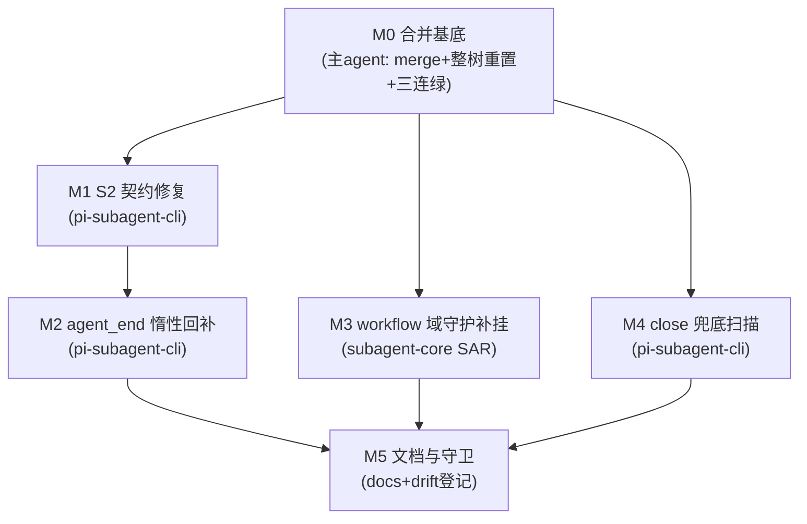

# subagent-agent-end-recovery-replay 实施计划

基线: (待基线 commit 后回填) | 来源设计: `docs/design/subagent-agent-end-recovery-replay.md`（设计就绪版，commit 41d475737） | 日期: 2026-09-10

对抗审查证据: `.review/design-review-replay-r1~r5.md`（主审五轮：5+3+2+1+0 MF 收敛）+ `design-review-replay-r1~r4-impact.md`（影响面审：R4 起 0 MF 收敛）。终局 = R5 主审 0/0 + R4 影响面 0 MF。

## 0 章节映射

所有 subagent task 的坐标唯一来源，禁止自猜编号。

| 内容 | 设计文档实际位置 |
|------|------------------|
| 背景/目标 | §1（1.1 SCQA / 1.2 系统认知与关键协议事实 / 1.3 设计目标 G1-G3 / 1.4 in-out scope） |
| 现状与根因 | §2（2.1 六环链重放 / 2.2 S2 现场 / 2.3 下游代价 / 2.4 兜底核验含 M3 缺口 / 2.5 数据流 / 2.6 根因类抽象） |
| 终态/机制 | §3（3.1 终态 / 3.2 D1-D4 移植判定表 / 3.3 决策 1-9 / 3.4 错误规格表） |
| 验收场景表 | §4（V1-V7 + V5b/V5c；章首验收分层声明：V2-V4 协议脚本对端、V1 真实 pi 端到端） |
| 下一层拆分 | §5.1 单元 M0-M5（含文件改动地图） |
| 待验证检查点 | §5.2 K1-K6 |
| 超时哲学合规 | §5.4 |

## 1 目标快照（逐字摘录设计 §1.3 / §1.4）

**G1（根除不通知）**：任何 subagent run——无论握手成败、进程死活、引擎崩否——终态必然到达主 agent（完成/失败/终止通知三选一），不存在无限等待。

**G2（通知质量）**：完成通知携带结果正文与 `session_read` 截断指针行；sessionFile 尽最大努力获取（它决定 chat 域「Full transcript」指针、冷续 resume 锚点、session-reader 取证能力），但其缺失不得阻塞通知。

**G3（防复发）**：失败类抽象为「一次性获取 + 失败不可恢复 + 下游无限保守等待」——新架构每环都必须有不依赖运气的外部熔断，且本文档把判定证据固化，防止未来重构时旧病根借尸还魂。

**Out-of-scope**（设计 §1.4）：keep-alive 后代保活编排迁回（W7 裁决域）；runtime rpc-client 双轨调和机制改造；W 系列机制任何改动；NotifyDomainPorts 加固（遗留①）；carbon 升级（遗留④，部署侧）。

## 2 单元列表

无独立 u-foundation：M1-M4 均为包内小改动，无跨单元新增共享类型/接口模块（M3 复用 subagent-core 既有 settled-watchdog 原语，M2 消费 pi-subagent-cli 既有 `requestGetStateOnce` 死导出）——M0 既是 DAG 根。

| Unit | 职责 | 领地（精确文件路径，基于本 worktree） | 依赖 | 隔离 | 验收条款 |
|------|------|--------------------------------------|------|------|----------|
| **M0 合并基底** | `git merge dev-0.9.16` → 解冲突 → 整树重置代码面（设计决策 7：`git checkout dev-0.9.16 -- packages/ && git checkout dev-0.9.16 -- eslint.config.mjs`，覆盖内容冲突 2 件/自动合并陷阱 2 件/自动保留面 5 件）；文档冲突保两套；对照 K5 预演清单 | 无新改动（纯合并+重置+归位）；**主 agent 亲自执行**（git 写操作 subagent 禁止） | — | plain | 合并后全量测试三连绿（本计划 §4 全量组）+ K5 冲突面对照无清单外意外 |
| **M1 S2 契约修复** | 设计决策 1：`get-state-handshake.ts:82-91` 两个 clearTimeout 均移入 sessionFile 命中分支（应答不完整视同未应答，保留全部既有驱动）；改写锁行为专测 `:163-192` 为契约断言（缺 sessionFile 应答 → 剩余重试照发 → 3 轮耗尽 resolve） | `packages/pi-subagent-cli/src/get-state-handshake.ts`；`packages/pi-subagent-cli/src/__tests__/get-state-handshake.test.ts` | M0 | plain | V2（协议脚本对端）+ 契约单测绿；头注「最多重试 3 次」与实现一致 |
| **M2 agent_end 惰性回补** | 设计决策 2：`spawn-runner.ts:274-276` 非 chatMode `onAgentEnd` 分支改 async 编排——同步段先置 `runEnd.endedCleanly=true`，回补段整体 try / `killChild()` 放 finally 必达；`requestGetStateOnce` 接线（K1：优先 identity tracker 的 `addStateListener`，核对签名）；K2 killChild 幂等核验 | `packages/pi-subagent-cli/src/spawn-runner.ts`；`packages/pi-subagent-cli/src/get-state-handshake.ts`（仅 K1 接线需要时，M1 已合入后串行无冲突）；新增测试 `packages/pi-subagent-cli/src/__tests__/`（agent-end 补查 fake timers 用例 + 回补链抛错 kill 仍达用例） | M1（串行：同包同文件潜在接线面，避免并行冲突） | plain | V3（spawn 期三轮不应答 + agent_end 恢复应答 → outcome.sessionFile 非空 + ≤1s）；回补链抛错用例证明 kill finally 必达 |
| **M3 workflow 域守护补挂** | 设计决策 9：SAR.run（`subprocess-agent-runner.ts:235` 起）try 块内 engine.run 派发前 arm per-run no-progress watchdog（30min）；刷新源 = journal.onEvent 包装 ∪ stream.onDelta 包装；fire = watchdog AbortController 并入 mergeTimeoutSignal 合流（:214 扩一源）→ wireAbortSignal 阶梯；disarm = finally + 桥接 listener 移除；fire 回调同步段只 abort+warn 不抛；重试语义保留（executeAgentCall 通用重试面） | `packages/subagent-core/src/execution/subprocess-agent-runner.ts`；新增测试 `packages/subagent-core/src/execution/__tests__/`（楔死 fire 链 fake timers + 产出刷新不 fire + killAll 组杀邻接 V5c + chat 域守护回归零变化 V5b）；若原语抽取需新文件归本单元领地 | M0 | plain | V5①（fire 链断言 + 刷新不 fire + agent() 收敛/journal close/重试面）+ V5b 全绿 + V5c；V5② 视 K6 核验结果降级 |
| **M4 close 兜底扫描** | 设计决策 4：新建 prompt 头键扫描器（mtime ∈ [spawnStartedAtMs, close] 候选 + 前 ~64KB 头读 + `includes(promptHead ~200字符)` + 单命中才采纳/零多命中放弃 + 采纳 warn 附审计证据 + 降级门 >64 候选或 >100ms）；close finalizer 接线（`spawn-run-pump.ts:201-216` LC-4 之后、resolveExit 之前）；整体 try-catch / resolveExit 必达；K3① prompt 逐字落盘验证 | `packages/pi-subagent-cli/src/session-file-locator.ts`（新）；`packages/pi-subagent-cli/src/spawn-run-pump.ts`（close finalizer 插入）；`packages/pi-subagent-cli/src/index.ts`（barrel）；新增测试（单命中/零命中/多命中/坏行容错/fs 异常降级） | M0 | plain | V4（全程不应答 → 扫描补上单命中；多命中构造 → 放弃+warn+run 正常终态）；fs 异常用例证明 resolveExit 必达 |
| **M5 文档与守卫** | 设计决策 8：线 B 三份文档头部修订记录（D1-D4 判定结论 + 新落点 M1-M4 + 旧实现文件已随 engines/pi 删除）；troubleshooting §12 同步；replay.md 登记 `DOC_MODULE_MAP` → `packages/pi-subagent-cli/src` 映射（drift 守卫真检查）；replay.md §4 回填验收结果 | `docs/design/subagent-agent-end-recovery.md`；`docs/design/subagent-agent-end-recovery.impl-plan.md`；`docs/design/subagent-core-unbounded-wait-audit.md`；`docs/troubleshooting.md`；`scripts/check-doc-symbol-drift.mjs`；`docs/design/subagent-agent-end-recovery-replay.md` | M1-M4 全 committed | plain | V7 机器门全绿 + drift 守卫对 replay.md 真检查非恒真 |

**领地互斥说明**：M1 与 M2 串行因同包同文件（get-state-handshake.ts 的 K1 接线面）；M1∥M3∥M4 无文件交集（pi-subagent-cli 两文件 / subagent-core 一文件）；M4 的 spawn-run-pump.ts 与 M2 的 spawn-runner.ts 是不同文件（pump≠runner），barrel index.ts 仅 M4 触碰（M2 新增函数不进 barrel，lazy 回补是 spawn-runner 内部编排）。

## 3 DAG 图



并行批次：**批次 1** = M1 ∥ M3 ∥ M4（3 并发，符合 ≤5 约束）；**批次 2** = M2（M1 合入后立即开工，与批次 1 剩余并行）；**批次 3** = M5。

## 4 测试策略

命令从各包 package.json 实读（dev-0.9.16 树，M0 后在本 worktree 生效）。红线：vitest（禁 node:test），从子包目录运行；timer 测试用 fake timers；测试写删目标 mkdtempSync 自建自删，禁碰真实数据目录（fs-guard 已挂 pi-subagent-cli 与 subagent-core vitest）。

**增量（单元开发期）**：

| 包 | 命令 |
|----|------|
| pi-subagent-cli | `cd packages/pi-subagent-cli && pnpm test`（vitest run）+ `pnpm typecheck` |
| subagent-core | `cd packages/subagent-core && pnpm test` + `pnpm typecheck` |

**全量（M0 基底验收 + 收尾 Gate A / V7 机器门）**：

```bash
pnpm run lint                                   # root ESLint
pnpm --filter @zhushanwen/pi-subagent-cli test && pnpm --filter @zhushanwen/pi-subagent-cli typecheck
pnpm --filter @zhushanwen/subagent-core test && pnpm --filter @zhushanwen/subagent-core typecheck
pnpm --filter @zhushanwen/runtime test          # M0 基底重点（5 件自动保留面在其领地）
node scripts/check-doc-symbol-drift.mjs         # M5 后
```

**端到端（Gate B，阶段 5）**：V1（真机 dev app 6 路并发 workflow subagent）+ V6（常规单路 + chat 域冷续）按设计 §4 步骤执行；V2-V4 协议脚本对端在单元验收期随做随验，脚本用完归档移除。对端 sessionDir 必须 mkdtempSync 或继承测试进程已重定向的 `XYZ_AGENT_DATA_DIR`（设计 §4 分层声明）。

## 5 合理偏差登记表

| Unit | 偏差描述 | 判定与依据 | 登记时间 |
|------|----------|-----------|----------|
| M2 | `get-state-handshake.ts` **未改动**（K1 结论：接线不需要） | 既有握手调用点已用 `performGetStateHandshake(child, identity.addStateListener)` 同形态；`requestGetStateOnce` 形参 `AddGetStateResponseListener = (id, resolver) => void \| (() => void)` 与 `addStateListener(id, resolver): void` 直接可赋值——零接线即满足 K1「优先 identity 的 addStateListener」。已核验签名 | 2026-09-10 |
| M2 | `orchestrateAgentEndBackfill` 入参含可注入 `backfill` 实现 | 验收条款明列「构造回补段抛错证明 kill 必达」，需在编排边界注入会抛错的实现；生产路径恒传 `backfillSessionFileAtAgentEnd`（单次 `requestGetStateOnce`），同步段置位与 try/finally 语义与设计决策 2 逐字一致 | 2026-09-10 |
| M2 | `LAZY_GET_STATE_TIMEOUT_MS`（1000）落在 `spawn-runner.ts` 模块内且未导出 | `constants.ts` 在领地之外不可动；测试改为行为断言（假时钟推进 <1s 内收敛）而非引用常量。值域符合设计 §5.4 控制面单请求秒级 | 2026-09-10 |
| M2 | 回补命中后除 `addStateListener` 内部落位外，额外显式调 `identity.applyGetStateFields(fields)` | 与既有握手调用点（`identity.applyGetStateFields(r)`）同款兜底；幂等（同值不重发 handleReady，V3 用例断言 handleReady 恰 1 条） | 2026-09-10 |
| M2 | K2 核验结论：`killChild` **幂等成立**（非偏差，结论登记） | `subagent-engine-sdk/src/kill-chain.ts:95` 首行 `if (child.exitCode !== null \|\| child.signalCode !== null) return "terminated"` 早退；:121-129 safeKill 吞掉「检查与 kill 之间自退」的抛出。本包补组合级用例（回补 finally 经杀链落已退出 child → 不调 child.kill、不注册 exit 监听、可重复） | 2026-09-10 |
| M3 | 新增 `mergeRunSignals`（三源合流，返回 `{signal, dispose}`），`mergeTimeoutSignal` 降为薄包装 | 设计写「`:214` 扩一个信号源」，但既有 7 条纯函数测试锁死 `mergeTimeoutSignal` 返回 `AbortSignal` 且无 timeoutMs 时原样返回 external signal；同时 R4 INFO 要求 finally 移除桥接 listener（否则 run 级 signal 累积 → MaxListenersExceededWarning），需要 dispose 面。**单实现**（mergeTimeoutSignal 委托 mergeRunSignals），无第二套逻辑；顺带修掉原实现「controller 已 abort 后才注册清理 listener → timer 不回收」的既有时序盲区 | 2026-09-10 |
| M3 | **K6 结论：mid-round 30min 窗口不可缩短 → V5② 按设计降级 V1 端到端兜底** | 中段阈值是原语内纯常量 `SETTLED_MID_ROUND_NO_PROGRESS_MS`（`settled-watchdog.ts:32` 注释「中段阈值 v1 不开 env」）；env `XYZ_SUBAGENT_SETTLED_WATCHDOG_MS` 只覆盖收尾段或两段全关，无缩短中段窗通道。加测试 seam 需改 `settled-watchdog.ts`（非 M3 领地）——不越界 | 2026-09-10 |
| M3 | V5c 集成测试直接 abort watchdog 的 AbortController（= fire 回调内唯一同步动作），未真等 30min | 真引擎子进程无法与 fake timers 混跑（连接/IO 依赖真实 timer），且窗口不可缩短（上一条）。计时链路「30min 到点 → abort」由 V5①（fake timers）覆盖，V5c 覆盖「abort → mergedSignal → wireAbortSignal 阶梯 → killAll → 邻接 run 终态」进程链路，两者拼合为完整 fire 链（测试文件头注已声明） | 2026-09-10 |
| M3 | `stream.onDelta` 用「原地包裹 + finally 精确还原」而非原型链代理对象 | 既有锁定测试（`subprocess-agent-runner.test.ts`「U1 stream 透传」断言 `executeAndAwait` 第 4 参 `toBe` 同一 stream 对象）要求保持 identity；该测试文件不在 M3 领地，不修改。还原含 `hadOwnOnDelta` 分支，无残留覆写 | 2026-09-10 |
| M3 | 未修改任何既有测试文件；fire 后的失败结果追加恢复指引后缀（`withNoProgressRecoveryNote`，只对已带 error 的结果追注） | 领地只含 SAR 源码 + 新增测试；错误规格表（设计 §3.4）明文要求「失败结果附『重派 workflow / 检查 subagents』指引」，属设计落地而非新增功能 | 2026-09-10 |
| M4 | **K3① 结论：prompt 非逐字落盘 → 启用「原文 + JSON 转义形态」双 includes（未走设计的降级路径「只 warn 不采纳」）** | 主 agent 独立复核：实装 `@earendil-works/pi-coding-agent@0.84.4` 的 `dist/core/session-manager.js:701/732/753` 逐行 `JSON.stringify(entry)` 落盘 → 引号/反斜杠/制表/换行确为转义形态。JSON 转义是**单射**且逐字符确定性，故转义形态匹配的误配面与原文匹配同强度——设计的降级条件（「非逐字则不可靠匹配」）在转义形态下不成立，双 includes 是比降级更完整的落地，安全底线（单命中才采纳）未放松。反证用例已锁：仅原文 includes 必 miss | 2026-09-10 |
| M4 | locator 入参由 `promptHead`（调用方预截断）改为 `prompt`（全文，locator 内部截 200） | 截断契约留在调用方会让 `PROMPT_HEAD_CHARS` 出现跨文件第二份实现；接线点收缩为一行属性。设计与决策 4 未规定截断方，语义不变 | 2026-09-10 |
| M4 | 截断点落在 UTF-16 高代理时丢弃该半字符 | 半截代理的两种键形态都不匹配文件（`JSON.stringify` 对孤立代理输出 `\udXXX` 转义），会静默 no_match；丢弃后头部仍是全文逐字符前缀，两形态必然命中（用例「代理对边界」锁定） | 2026-09-10 |
| M4 | `candidateCount` 始终 = `candidates.length`（上限门场景报实测值而非 0） | 设计 §3.4 要求 warn 含候选数，而上限门正是最需要该数字的场景（用例断言 65） | 2026-09-10 |
| M4 | warn 由 pump 侧发出，locator 保持纯函数（只回结构化结果 + 16 hex 头哈希） | `recordId` 只在 pump 侧存在；locator 不落 prompt 明文，审计面只给哈希 | 2026-09-10 |
| M4 | 全 miss warn 文案未逐字照抄设计 §3.1 第 4 步（保留 `[sessionfile] unobtainable for <recordId>` 前缀与 `record finalized without transcript anchor` 尾句，增补 reason/candidates/promptHeadHash/error 与 Recovery 指引） | 设计原文的「all 5 acquisition paths missed」在 close 收尾单点判断时未必为真（可能 LC-4 已命中或第 4 路生效），逐字照抄会写出不成立的断言；结构对齐 §3.4「warn 附恢复指引」 | 2026-09-10 |
| M4 | 采纳面只补 `sessionFile`，不由文件名反推 sessionId | 决策 4 采纳面仅 sessionFile；e2e 明确断言 `result.sessionId` 仍为 undefined（已知面，非缺陷） | 2026-09-10 |
| M4 | **领土扩张：`spawn-runner.ts` +1 行**（`sessionFileFallback: { prompt: params.task, spawnStartedAtMs: startTime, sessionDir: params.sessionDir }`） | 计划期领地划分漏项：prompt 只存在于 `runSpawnOnce` 作用域，pump 的 `StdoutPumpDeps` 不含它，设计决策 4 只写了 pump 侧插入未预见此依赖。主 agent 裁定授权（M2 已 commit 042dccec6，无并发写者）；核验确认 diff 恰 1 hunk / 1 行，`index ed2ebaa10` = M2 提交版，M2 逻辑零触碰 | 2026-09-10 |
| M4 | 新增 seam 缺省分支 warn「M4 prompt-head scan not wired」 | 设计未规定；防止缺接线时静默降级（规则 20）。生产已接线，该分支现只覆盖未接线调用方与测试 | 2026-09-10 |

## 6 状态表

| Unit | 状态 | 轮次 | 证据指针 |
|------|------|------|----------|
| M0 合并基底 | committed | 1/2 | merge 430dacabc + 残留清理 e192dfe4a；K5 冲突面与预演清单完全吻合；全量三连绿（pi-subagent-cli 304 passed / subagent-core 2834 passed / runtime 457 文件 5184 passed / tsc 干净） |
| M1 S2 契约修复 | committed | 1/2 | 9578af7f4；diff ⊆ 领地（2 文件）；契约断言（缺 sessionFile → 重试照发 1→2→3 → 耗尽 resolve）+ 全包 304 绿 + tsc 干净；deviation 1 条已登记（注释分叉表述修正） |
| M2 agent_end 惰性回补 | committed | 1/2 | 042dccec6；diff ⊆ 领地（spawn-runner.ts + 新测试，`get-state-handshake.ts` 按 K1 结论零改动）；6 用例绿（V3 回补 ≤1s 实测 614ms / 回补 reject 与 sync-throw 两路 kill 必达 / K1 接线面 / K2 幂等 / 自退 race）+ 全包 310 passed（基线 304+6）+ tsc 干净；deviation 5 条已登记 |
| M3 workflow 域守护补挂 | committed | 1/2 | bd4404ddf；diff ⊆ 领地（subprocess-agent-runner.ts + 2 新测试，禁区三文件未动）；8 用例绿（V5① 7 + V5c 1，V5c 真引擎 3.06s）+ 全包 2842 passed（基线 2834+8）+ tsc 干净；**K6 结论：mid-round 窗不可缩短 → V5② 降级 V1 兜底**；deviation 5 条已登记 |
| M4 close 兜底扫描 | committed | 1/2 | f737baa7a；diff ⊆ 领地 + 授权的 1 行扩张（核验：spawn-runner.ts 恰 1 hunk/1 行、base hash = M2 提交版）；29 新用例绿（locator 17 + pump 8 + 生产路径 e2e 4，含接线前后反向探针）+ 全包 339 passed（基线 310+29）+ tsc 干净；K3① 已双源复核（探针 + 主 agent 读 pi dist）；**K3② 未执行**，归属改为阶段 5 V1 期（见 §7）；deviation 9 条已登记 |
| M5 文档与守卫 | pending | 0/2 | — |

## 7 残留风险与变更历史

**残留风险**：

- K1-K6 检查点（设计 §5.2）分别挂在：M2（K1 接线签名 / K2 killChild 幂等）、M4（K3① prompt 逐字落盘——非逐字则 M4 降级为「只 warn 不采纳」并登记）、M0（K5 冲突面预演对照——清单外 packages/ 冲突即停下重估）、M5（K4 rpc-client diff 核验无欠账重放）、V5②（K6 mid-round 窗可否缩短——不可则降级 V1 兜底）。
- V1 真机验收需 dev app + 真实 workflow 派发环境（阶段 5 处理，可能需 `pnpm dev` + Playwright 连 9222）。
- K3① 失败时 M4 降级路径已在设计决策 4 预置，不阻塞 M1-M3/M5。
- **M3 的 K6 结论改变了验收姿势**：workflow 域 mid-round 窗不可缩短（原语内纯常量、无 env 通道），故 V5②（缩短窗口的真机验收）不可执行，按设计降级为 V1 端到端兜底——阶段 5 Gate B 不设 V5② 项，workflow 域守护的真实性由 V1（真实 workflow 派发）承接。
- 对 M3「V5c 未真等 30min」的残余风险：fire 链被拆成两段验证（V5① 计时到点→abort；V5c abort→阶梯→killAll）。阶段 3 一致性审查须核对两段接口是否真的咬合（V5① 的 abort 对象 == V5c 的 abort 入口语义）。
- **K3②（真实 workflow 并发形态下 prompt 头部键区分度实测）归属已裁定到阶段 5 Gate B 的 V1 期**：该检查点需要真实 workflow 派发环境（dev app），单测面无法构造真实并发头部形态。若 V1 期实测发现同模板并发头部同质率高 → M4 兜底在该场景下只会「安全放弃」（不误配，但也无效），届时应按设计决策 4 的升级路径改键策略（全文哈希 / 参数段取样）并回写设计。
- **已接受的测试输出噪音**：M2 的 `agent-end-backfill.test.ts` race① 用例 sessionDir 为空，M4 接线后 close 收尾会多打一行 `[sessionfile] unobtainable ... reason=no_candidates` warn。这是接线后的真实降级留痕（非失败），不改该用例（静音会掩盖真实行为面）。
- 阶段 5 Gate B 需注意 V4 的场景构造：单命中/多命中判定依赖 mtime 窗口内候选数，真机验收时目录里同期并发 run 的 session 文件会天然构成多候选——多命中即安全放弃，验收判据应是「不误配 + run 正常终态」，而非「必须命中」。

**变更历史**：

- 2026-09-10：计划创建（对应设计就绪版 41d475737），待用户评审 + 基线 commit。
- 2026-09-10：用户评审确认；基线 commit e12ea80bd。M0 执行完毕：merge 430dacabc（冲突面与 K5 预演完全吻合）+ 残留清理 e192dfe4a（checkout 整树重置碰不到的 3 个线 B 独有测试文件——教训：`git checkout <tree> -- packages/` 只覆盖 dev 树存在文件，不删 merge 自动合入的线 B 独有文件）；全量三连绿。批次 1（M1/M3/M4）派发。
- 2026-09-10：**M4 核验通过并 commit（f737baa7a）→ M1-M4 全部 committed，DAG 解锁 M5**。硬核验方式：`git diff` 确认 `spawn-runner.ts` 恰 1 hunk/1 行且 base hash = M2 提交版（ed2ebaa10，M2 逻辑零触碰）、领地外零改动、探针与备份文件零残留；主 agent 重跑全包 339 passed + tsc 干净；K3① 结论由主 agent 独立读 pi dist（`session-manager.js:701/732/753` 逐行 JSON.stringify）复核成立。M4 期间发生一次越界阻塞（prompt 只在 runSpawnOnce 作用域，pump 拿不到）——主 agent 裁定为计划期领地划分漏项并授权 1 行扩张，非 dev 违规。K3② 归属裁定到阶段 5 V1 期。
- 2026-09-10：**M2 与 M3 核验通过并 commit**（M2 = `042dccec6`，M3 = `bd4404ddf`；M4 仍在途）。硬核验方式：`git diff --name-only` 确认 M3 只动 1 个源文件（禁区三文件零触碰）、M2 只动 spawn-runner.ts；主 agent 重跑双方核心测试（M2 6/6 绿、M3 8/8 绿、subagent-core 全包 2842 passed）。两单元共 10 条 deviation 已登记 §5，其中两条是有实质影响的结论：M3 的 mergeRunSignals 单实现改造（含修掉原合流函数的 listener 回收时序盲区）、M3 的 K6 mid-round 窗不可缩短 → V5② 降级 V1。
- 2026-09-10：**额度中断后立即重派（不做等待）**。M1 committed（9578af7f4）后批次 2（M2）与批次 1 残余（M3/M4）三个 dev agent 先后返回 `[1308] 已达到 5 小时的使用上限`（provider 声明 18:39:42 重置），全部零产出。停工核验：`git status --short` 仅 1 项未跟踪产物 `packages/pi-subagent-cli/src/session-file-locator.ts`（M4 agent 死前写出的扫描器本体，175 行，无测试无接线，未经核验），`git diff --stat` 为空（M2/M3 零残留）——故 M2/M3/M4 按 pending 重算（无 committed 证据）。用户指示不用定时等待、直接继续：随即以 `u-dev` 后台重派三单元（轮次 1/2），M4 task 内附遗留半成品路径与「先核验再续作、不符则改写并说明」指令。中断期间的前一笔记录（cron 挂起方案）已按用户指示撤销。
- 2026-09-10：**K4 提前核验完毕（结论：无欠账）**——线 B 对 rpc-client.ts 的 112 行改动 = 纯 D4 消费切换（createLineReader import + 本地 LF 读取器删除）+ 注释迁移；线 B 注释提及的「stdout error 吞转发（2026-09-04 事故审计）」在 dev 版同点位存在（`rpc-client.ts:482` 一行防护 + :496 W2 完整监听），决策 5「预期无欠账」证实。M5 无需 rpc-client 相关重放。
