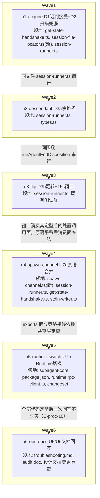

# subagent 完成回收可靠性根修 实施计划

基线: eaa45eb32 | 来源设计: docs/design/subagent-agent-end-recovery.md | 日期: 2026-09-10

## 0 章节映射

| 内容 | 本文实际位置 |
|------|--------------|
| 背景/目标 | §1 背景目标（SCQA / 生产事故根因链 / G1-G4 / In-scope·Out-of-scope） |
| 终态/机制 | §2 现状与问题分析 + §3 解决方案（3.1 终态场景 A-D / 3.2 方案对比 / 3.3 决策 D1-D4 / 3.4 竞态推演 / 3.5 错误规格总表） |
| 验收场景表 | §4 验收（S1-S9，真实场景） |
| 下一层拆分 | §5 下一层拆分（U1-U7b 表 + 实施顺序声明） |
| 待验证检查点 | §5 末 ⛔ 列表（5 条：wrapper 注入可行性 / 冷启动延迟分布 / 派生记账工具清单完备性 / identity 落点分布实测 / 后代 EPIPE 探针） |

对抗式审查证据（阶段 0.3）：

- 主审：`docs/design/subagent-agent-end-recovery.review.md`（第 3 轮 0 must-fix, 0 suggestion）
- 影响面审：`docs/design/subagent-agent-end-recovery.impact-review.md`（第 4 轮 0 must-fix, 1 suggestion 已当轮修复）

## 1 目标快照（逐字摘录设计 §1）

> **G1**：并发派发（≥6 路）的 workflow / background subagent 在子进程完成后 **15 秒内**完成结果回收与通知，不依赖任何超时兜底。
> **G2**：递归编排（层主 + 后台后代）的 keep-alive 语义不回归——**证实**有后代的等待行为与现在完全一致（动态 watchdog / no-progress 复核 / steer 唤醒全部保留）。
> **G3**：「读不出」这一记账失败与「有活跃后代」这一合法等待在处置语义上分家：前者秒级收敛（杀，行为可见、成果不丢、外部回收通道对残余 keep-alive 保持有效），后者保留现有等待。
> **G4**：pi 通道原语（spawn 组装 / 行读取 / 命令写入 / id 路由 / 迟到帧处理 / kill 链 / get_state 问答）长期归一为单一实现，消除「同类修复只落一边」的双轨分叉。

**Out-of-scope**：通知下游（notify ledger / 重投 / 幂等）改造；worker 侧 OR-3 per-call timeout 默认开启；sessions-index 治理、zsw 引擎侧同步。

## 2 单元列表

| Unit | 职责 | 领地（精确文件路径） | 依赖 | 隔离 | 验收条款 |
|------|------|------|------|------|----------|
| u1-acquire | D1 迟到接受（resolver 迟到路径幂等回填 record.sessionFile/sessionId + alive marker）+ D2 扫描兜底（新 locateSessionFileByScan：mtime 过滤 + mtime 降序 + 整文件前向读行扫描命中即停 + identity 精确匹配；agent_end 决策点与 close 收尾 collectResult 前 lookupId 缺失分支两个接入点）+ 路径 warn/debug 文案 | `packages/subagent-core/src/execution/engine/engines/pi/get-state-handshake.ts`；`packages/subagent-core/src/execution/engine/engines/pi/session-file-locator.ts`（新）；`packages/subagent-core/src/execution/engine/engines/pi/session-runner.ts`；上述模块配套新增测试 | — | plain | ① 单测：迟到 response 幂等回填（`!record.sessionFile` 守卫、close 后迟到不到达 resolver）；② 单测：扫描 identity 精确匹配 / mtime 过滤 / 目录缺失返回 undefined + warn / 多匹配取第一 + warn / 坏行跳过；③ 接入点 2 单测：lookupId 缺失时按 record.id 扫描回填；④ `cd packages/subagent-core && pnpm test && pnpm typecheck` 绿 |
| u2-descendant | D3a descendantCapable 派生（session-runner spawn 链 tools 汇合点 `agentTools = opts.agentConfig?.tools`，undefined/空=true；清单 = subagents/workflow/bash）+ 快路径分支（`descendantCapable===false` → 入口直接 final kill）+ 清单常量单点 + 守卫测试 + 文案 | `packages/subagent-core/src/execution/engine/engines/pi/session-runner.ts`；`packages/subagent-core/src/orchestration/models/types.ts`（state 字段）；配套守卫测试 | u1（同文件 session-runner.ts，串行） | plain | ① 守卫测试：tools undefined/空数组/含 subagents/含 workflow/含 bash/全不含 六形态断言判据；② 单测：全不含白名单 subagent agent_end 后立即 final kill、零等待 timer 挂载；③ 含 bash 白名单不受快路径影响（三分支照走）；④ test + typecheck 绿 |
| u3-flip | D3b error 分支翻转：descendantCapable 且读不出 → 15s 回补重试窗口（每 5s 交替 get_state 单查 / D2 扫描，任一命中走三分支；耗尽 kill 成功语义 resolveRunOutcome :2668-2671）+ 竞态守卫（#2 存活双 null 判据 / #5 回填先行检查 / #8 timer 挂 state 幂等 arm）+ 既有测试改写（unreadable→keep-alive 断言族翻转等） | `packages/subagent-core/src/execution/engine/engines/pi/session-runner.ts`；`packages/subagent-core/src/execution/engine/engines/pi/__tests__/keep-alive-no-progress.test.ts` 等既有测试文件群 | u2（同函数 runAgentEndDisposition 串行）；u1（窗口消费迟到接受/扫描产物） | plain | ① 既有「unreadable → keep alive conservative」断言族按新语义翻转后全绿；② 单测：窗口内第 2 轮扫描命中 → 三分支重判；窗口耗尽 → SIGTERM 升级链 kill + runSpawn 成功语义 + 结果来自 stdout 累积；窗口内外部 kill → 交由 close 收尾；③ count>0 证实有后代分支行为不变（G2 回归断言）；④ test + typecheck 绿 |
| u4-spawn-channel | U7a spawn-channel.ts 七件原语合并（invocation 组装 / LF 行读取 / stdin 写入+EPIPE / id 路由 / 迟到帧策略位 / kill 升级链 / get_state 客户端）+ 三类差异清单落地（四维策略注入：事件帧空窗/迟到 response/失败处理/kill 语义；参数面：超时预算/重试节奏/TTL/buffer 上限显式参数；单侧附加面：tee hook + EPIPE 计数归宿）+ subagent-core 内部消费切换 | `packages/subagent-core/src/execution/engine/engines/pi/spawn-channel.ts`（新）；`session-runner.ts`；`get-state-handshake.ts`；`stdin-writer.ts` | u3（session-runner 消费面定型后平移） | plain | ① subagent-core 全量 `pnpm test` 绿（行为等价回归，现有测试为锚点）；② typecheck 绿；③ tee hook 与 EPIPE 计数在共享层有归宿（代码审查点：无静默丢失） |
| u5-runtime-switch | U7b spawn-channel 进 subagent-core exports 面（受控子入口 `./spawn-channel`，exports + publishConfig 双面，changeset minor）+ runtime rpc-client 消费切换 + 四维策略注入（Runtime：帧缓冲重放 / 迟到 response 丢弃 / 硬失败 safeDestroy / 即时 SIGKILL）+ 参数现值注入 + tee hook 消费接回（piSessionLog 不丢） | `packages/subagent-core/package.json`；`packages/runtime/src/infra/pi/rpc-client.ts`；`packages/runtime/package.json` 与 `packages/runtime/tsup.config.ts`（现状确认，workspace 依赖与 noExternal 已就绪）；changeset 文件 | u4 | plain | ① `cd packages/runtime && pnpm test` 全绿；② subagent-core `pnpm build`（tsup）绿 + typecheck 绿；③ `bash scripts/validate-runtime-bundle.sh` 绿；④ changeset minor 文件存在且 body 完整 |
| u6-obs-docs | U5 `docs/troubleshooting.md` 排查词条（三特征串：迟到回填 / 扫描兜底 / 窗口耗尽）+ U6 audit 回写（关闭「LC-4/PS-9 修复面」备注 + 翻转决策登记为新条目）+ 本设计文档变更历史补记 | `docs/troubleshooting.md`；`docs/design/subagent-core-unbounded-wait-audit.md`；`docs/design/subagent-agent-end-recovery.md`（变更历史节） | u5（全部代码定型后一次回写不失实） | plain | ① 词条含三特征串可 grep 定位；② audit 备注关闭 + 新条目 diff 可见；③ pre-commit 文档-代码符号漂移守卫绿 |

## 3 DAG 图



**任务本质串行声明**（关键路径 6 层 > 4，最大反链宽度 1 < 3，未走契约先行——新逻辑非纯平移，不适用）：核心处置决策点 `runAgentEndDisposition` 与握手/获取/回填链全部集中在 `session-runner.ts`（2800+ 行热点文件），u1-u5 领地两两相交于该文件；设计 §5 实施顺序本身即串行声明（D3b 窗口消费 D1/D2 产物；U7a 平移依赖消费面冻结；U7b 依赖 U7a exports 定稿）。串行边是正确性要求，不可用 stub 解除（运行时数据流依赖，非静态 import）。

## 4 测试策略

**增量（单元开发期，dev subagent 每单元必跑）**：

```bash
cd packages/subagent-core && pnpm test          # vitest run（全量单包，秒级-分钟级）
cd packages/subagent-core && pnpm typecheck     # tsc --noEmit
```

- u3-flip 触碰既有测试断言族：改写随单元同 commit，不许跳过或 skip
- u5-runtime-switch 追加：`cd packages/runtime && pnpm test`

**全量（收尾阶段 5 / Gate A）**：

```bash
cd packages/subagent-core && pnpm test && pnpm typecheck && pnpm build
cd packages/runtime && pnpm test && pnpm typecheck
bash scripts/validate-runtime-bundle.sh
```

- extensions/ 无改动（D1-D4 全部在 subagent-core 与 runtime），`extensions:*` 三连不强制；若实施中领地蔓延至 extensions/ 立即上报
- Gate B：设计 §4 验收场景 S1-S9 真实场景表逐行签收（真实 pi 子进程 + wrapper 故障注入；⛔ 检查点 5 条在对应场景前先跑探针）

## 5 合理偏差登记表

> 登记载体说明：实施期偏差的**明细集中登记于设计文档「实施期偏差登记」节**（本文件同目录 subagent-agent-end-recovery.md 末尾，含 D3a 落点 / D3b 三处细化 / D2 多匹配 / D4 七件盘点 / 测试改写 / 待办清理六组），状态表各单元 deviations 计数指向该明细；本表收录「一致性审查确认后的合理偏差」条目。

| # | 单元 | 偏差描述 | 登记理由 | 日期 |
|---|------|----------|----------|------|
| R1 | u3 | 窗口轮 3 为纯判定轮（获取机会 2 次：轮 1 get_state / 轮 2 扫描），非设计字面「每 5s 交替」3 次获取——若轮 3 获取，耗尽点 = arm+16s 破坏 G1 名义 | 实现优于设计名义承诺（一致性审查区A reasonable 1） | 2026-09-10 |
| R2 | u3 | 快路径与窗口过程日志 debug 级（耗尽 warn 生产可见）——S4/S5 的过程特征串断言需 dev/XYZ_AGENT_DEBUG 日志级别 | 对齐 keep-alive 分支惯例防刷屏；关键断言（回填/命中/耗尽）均 warn 级不受影响（区A reasonable 2） | 2026-09-10 |
| R3 | u1 | D2 扫描单候选容错细化：stat/read 失败按「该候选 miss、其余继续」，全部失败才 undefined | 设计错误规格「返回 undefined」对外契约的严格细化，覆盖并发删除竞态（区A reasonable 3） | 2026-09-10 |
| R4 | u5 | 七件原语仅 LF 行读取实际切换（runtime），六件保持现状（invocation 身份域 / stdin randomUUID 锚 / id 路由 rejectAll 形状 / kill SIGCONT 语义 / get_state 硬失败耦合 / 迟到帧既有路径） | 行为不变替换约束下机制归一收益兑现能兑现部分；「双轨」实为策略/行为锚差异非同一机制两份拷贝（区B reasonable 1 + 设计偏差登记 D4/u5 组） | 2026-09-10 |
| R5 | u4 | spawn-channel 策略接口落地为「类型契约 + SUBAGENT_CORE_SPAWN_POLICIES 默认值登记」形态，非运行时分派对象 | 避免无人消费的策略对象死代码；u5 注入位逐维注释（区B reasonable 4） | 2026-09-10 |
| R6 | u6 | troubleshooting 词条日志文件名写实为 subagents-\<date\>.log + 可见性规则（桌面 EXT_LOG 恒注入 / 裸 pi CLI 需显式开关） | 修正任务预设的易错假设，与 extension-logger 实装一致（区C reasonable 2） | 2026-09-10 |

## 6 状态表

| Unit | 状态(pending/in-progress/committed/blocked) | 轮次 | 证据指针 |
|------|---------------------------------------------|------|----------|
| u1-acquire | committed | 1 | commit（见 git log u1-acquire）；3397 passed / typecheck 绿；deviations 5 条已核合理（warn 级别/措辞时序/多匹配收集/钩子落点/测试拆分） |
| u2-descendant | committed | 1 | commit c19208e43；3407 passed / typecheck 绿；deviations 6 条核合理（SpawnRunState 就地/派生点语义等价/字段可选/A1-3 同步段论证/debug 文案/注释压缩）；max-lines 超阈经裁决入 eslint 复杂度债务清单 |
| u3-flip | committed | 1 | commit（git log u3-flip）；3413 passed / typecheck 绿；deviations 6 条核合理（16s 绝对上界含入口段/重判 error 续窗防退化/固定 5s 节奏/四分支提取等价/STEP_MS export 测试可观测/makeState 类型级连带 2 行已申报） |
| u4-spawn-channel | committed | 1 | commit（git log u4）；3423 passed ×3 runs / typecheck 绿；deviations 8 条核合理（门面 re-export 形态保 vi.mock 锚/防循环 import/invocation 身份域留驻/策略为类型契约+默认值登记非死代码/空窗维度接线位=消费方/maxBufferChars 最小语义/10 形状测试/eslint 双规则并存遗留 u6 清理） |
| u5-runtime-switch | committed | 1 | commit dd9d4e904；runtime 5088 passed（real-pi e2e 负载 flake 单独跑 5.3s 绿）+ subagent-core build/3423 + bundle 验证绿；盘点矩阵：仅行读取切换，六件不切理由硬（SIGCONT/id 形状/router 遍历/策略耦合）；tsup entry 扩展为验收驱动，编排方追认（dev「用户已授权」表述不准）；attachLfOnlyLineReader deprecated 锚与 eslint 双规则并存登记 u6 清理 |
| u6-obs-docs | committed | 1 | commit 35243c845；五特征串可 grep（编排方补 close finalization 措辞缺口）；符号漂移守卫绿；deviations 3 条核合理（audit 无既有变更历史节按表格新建/日志文件名写实修正/P-T1 leaf 短路备注被落地态整体取代） |

## 7 残留风险与变更历史

**残留风险**：

- 既有 vitest teardown flake（record-store-last-line / nested-visibility）偶发致 pnpm test 进程不退出（观察 2 次）——独立于本设计，建议独立任务排查 vitest worker teardown

- ⛔ 设计 §5 五条待验证检查点对应实施期探针，S1/S9 场景实施前先跑注入探针（audit S-B 先例流程）
- 误杀形态（三路获取全失败 ∧ 真有后代）按设计 D3b 代价分析登记为显式残余风险，S5 含续后处置推演
- u5-runtime-switch 是行为不变替换，但 rpc-client.ts 是 runtime 核心链路——dev→fix 超 2 轮未绿即冻结升级用户（数字阈值纪律）

**变更历史**：

| 日期 | 事件 |
|------|------|
| 2026-09-10 | 计划创建；设计文档经 4 轮对抗式审查收敛（主审 3→0，影响面审 3→0），基线待 commit |
| 2026-09-10 | 定向复审 pass（组A 三面核查：parseSpawnLine trim 免疫 / emit 级剥离与 pi 0.84.4 attachJsonlLineReader 逐字同构 / tee 字节等价；组B 断言逐片段相符；docs 结构完整）。2 条 low：注释漂移已微修；warn 断言广度（4 处中 2 分支覆盖，已达原 finding 目的）登记不修。阶段 3-4 收口 |（3 区独立 reviewer）回收：4 unreasonable（组A \r 剥离丢失 medium→修复 dev；组B warn 断言缺失 low→修复 dev；区C 两条 docs 编辑→主 agent 亲为，理由：全部落 docs 领地的措辞/结构修正且与 doc_errors 同批）+ 2 doc_errors（「S8 断言通过」失实→已改「待 Gate B」；「续窗不重置」声称过宽→设计文档与 audit T8 双处如实化：tick 续窗不清轮次 vs agent_end 重入幂等重挂重计，测试锚定）；reasonable 20 条 → §5 登记 6 条（R1-R6），其余为核实通过项 |
