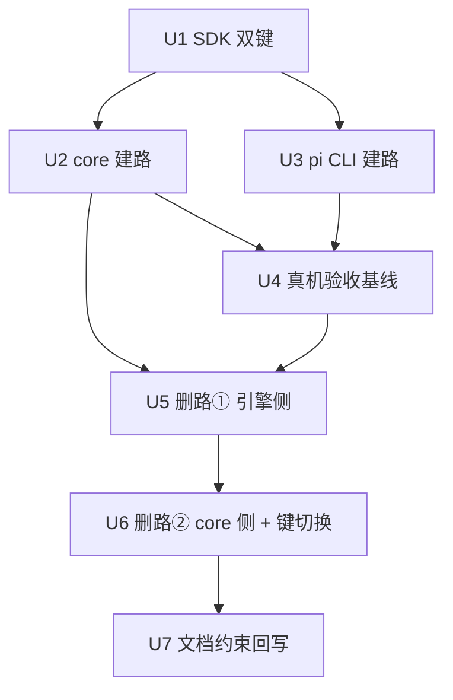

# subagent chat 域统一进 run 域 实施计划
基线: <待填> | 来源设计: docs/design/subagent-chat-run-unification.md (v7) | 日期: 2026-09-11

## 0 章节映射
| 内容 | 设计文档实际位置 |
|------|------------------|
| 背景/目标 | §1 背景目标（1.1 SCQA / 1.3 设计目标 G1-G3 / 1.4 in-out scope） |
| 终态/机制 | §3 解决方案（3.3 关键决策 D1-D8 + 红线 / 3.4 ConversationContinuation / 3.5 终态数据流） |
| 验收场景表 | §4 验收（S1-S8 真实场景表） |
| 下一层拆分 | §5 下一层拆分（U1-U7 单元表 + S5 grep 门测试处置表 + 文件改动地图 + 待验证检查点①-⑦） |
| 待验证检查点 | §5 末段「待验证检查点」①-⑦ |

对抗式审查证据：本会话 tech-design 双审循环 6 轮收敛（终轮主审 0 MF + 0 SUG、影响面 0 MF + 0 SUG），收敛声明见设计文档头部「修订状态：v7（设计就绪）」，被否谱系 19 条在附录 B。

## 1 目标快照

**背景/目标（§1.3 逐字摘录）**：
- G1 agent() 等同 subagent 语义稳定：同一派发路径、同一 record 模型、同一保障。
- G2 删除面干净：chat 域独立状态机整族退役，四包 + extensions 测试全绿，grep 门零命中。
- G3 行为兼容：one-shot 行为零变化；崩溃/重启后续聊语义保持（30 天 idle-gc 只归档不终态化）。

**Out-of-scope（§1.4）**：本设计不动 zcode 会话库（C-ext-20）、不动 H2/H3/H4 范围（workflow record 归位、service 拆分、持久化收口另案）、不改 pi 源码。

## 2 单元列表

| Unit | 职责 | 领地（精确文件路径） | 依赖 | 隔离 | 验收条款 |
|------|------|---------------------|------|------|---------|
| U1 | SDK 协议双键过渡：新增 `resume` 子对象与 `chat` 并存（载荷同形）+ schema/测试；roundLifecycle/interact 标 deprecated | `packages/subagent-engine-sdk/src/protocol/{methods,contract-types,schema,reverse-channels,port-contract,engine-protocol}.ts` + `packages/subagent-engine-sdk/src/__tests__/`（resume schema 用例新增） | 无（DAG 根） | plain | `cd packages/subagent-engine-sdk && pnpm test` 绿；resume 与 chat 键载荷同形单测 |
| U2 | core 建路：ConversationContinuation（§3.4 全规格）+ message/close 编排改写 + SP-5 升级路由与 gate（双写点）+ 引擎退出链收割（红线①POSIX 组杀/Windows 镜像通道，intentionalKill 跳过）+ settle 交棒改 run 应答驱动 + doFinalizeRoundToIdle outcome 入参 | `packages/subagent-core/src/execution/conversation-continuation.ts`（新增）/ `execution/subagent-service.ts` / `execution/subagent-actions-core.ts` / `execution/finalize-record.ts` / `execution/notifier.ts` / `execution/engine/client/engine-client.ts` / `execution/settled-watchdog.ts` / `execution/engine/common/capability-gate.ts` / 对应 `__tests__/`（新增 continuation 用例族） | U1 | plain | `cd packages/subagent-core && pnpm test` 绿；U2 单测清单（§5 U2 验收列全项）逐条有对应用例 |
| U3 | pi CLI 建路：run 路径 resume 参数穿透（spawn-args 已支持 `--session`）+ 首轮不再经 ChatSessionRegistry | `packages/pi-subagent-cli/src/{pi-engine,server,spawn-runner}.ts` | U1 | plain | e2e：resume run 续写同文件、历史召回（`cd packages/pi-subagent-cli && pnpm test`） |
| U4 | 真机验收：S1-S8 全表 + 冷启耗时实测入表（D2 量化闭环） | 无代码领地（真机场景执行；发现缺陷回对应单元修复） | U2+U3 | plain | §4 场景表逐行签收（此单元在阶段 5 Gate B 复验；建路后先跑一轮拿基线） |
| U5 | 删路①（引擎侧）：pi chat-session.ts + e2e chat 形态改写；SDK roundLifecycle 通道族 + interact + port-contract/engine-protocol + schema + conformance fixtures + probe；zcode server.ts interact dispatch + zcode-engine.ts 桩；测试处置表前 8 行 | `packages/pi-subagent-cli/src/chat-session.ts`（删）/ `packages/pi-subagent-cli/src/__tests__/{chat-session,chat-protocol,pi-engine,protocol-chat-e2e,server}.test.ts`（处置表）/ `packages/subagent-engine-sdk/src/protocol/*`（通道族删）/ `packages/subagent-engine-sdk/src/__tests__/{chat-domain-v1x,protocol}.test.ts` / `packages/zcode-subagent-cli/src/{server,zcode-engine}.ts` / `packages/zcode-subagent-cli/src/__tests__/server.test.ts` | U2+U4 | plain | S5 grep 门方向：处置表前 8 行清零；`cd packages/pi-subagent-cli && pnpm test` + `cd packages/subagent-engine-sdk && pnpm test` + `cd packages/zcode-subagent-cli && pnpm test` 绿 |
| U6 | 删路②（core 侧）：删除清单（deliverChatMessage/resumeColdRound/cold-resurrect/closeChatIdle 族/handleChatRoundPhase/engine 层承载件/finalizeChatSpawnFailure/settleChatRoundFromResponse/base 两函数）；core 测试处置表后 4 行；**U6 同批 `chat`→`resume` 键读写两端切换**（U1 配对）；settled-watchdog 刷新源收尾 | `packages/subagent-core/src/execution/*`（删除清单）/ `execution/__tests__/`（处置表后 4 行）/ `execution/engine/{port.ts,client/{remote-engine,reverse-router,engine-client}.ts,host/host-bridge.ts}` / `execution/execution-record.ts`（roundBaseTurnIndex 清理）/ `execution/types.ts` | U5 | plain | S5 grep 门全量零命中 + 四包全量绿 + 净删统计 |
| U7 | 文档与约束回写：C-proc-13 五段逐段、chat-domain-v1x 文档 superseded 横幅、protocolization 文档族符号清扫、troubleshooting §12 | `docs/constraints.json` + `docs/constraints.md`（render 脚本再生）/ `docs/design/chat-domain-v1x-liveness-governance*.md` / `docs/troubleshooting.md` | U6 | plain | `node scripts/check-doc-symbol-drift.mjs` 绿 + `node scripts/render-constraints.mjs` 已跑 |

## 3 DAG 图

## 4 测试策略

- 增量（单元开发期）：`cd packages/<受影响包> && pnpm test`（vitest run；四包 = subagent-core / subagent-engine-sdk / pi-subagent-cli / zcode-subagent-cli）；extensions 触及时 `pnpm extensions:test`
- 全量（收尾阶段 5）：四包全部 + `pnpm extensions:typecheck && pnpm extensions:lint && pnpm extensions:test` + `bash scripts/validate-runtime-bundle.sh`
- 红线：vitest only；timer 测试用 fake timers；测试写删目标 mkdtempSync 自建自删，禁触真实数据目录

## 5 合理偏差登记表

| Unit | 偏差 | 处置 |
|------|------|------|
| U1 | port-contract.ts 实际在 src/ 根而非计划的 src/protocol/ 花括号范围 | 合理——计划路径写法笔误，按实际路径修改，语义等同；U2-U6 领地引用时同读 |
| U1 | schema 同形校验落地为载荷级 JSON Schema 片段 runSessionParamsSchema，非帧级深校验 | 合理——帧级 params=ANY_JSON 不深校验是 schema.ts 现行设计裁决，U1 不越界 |
| U1 | deprecated 落点扩展到 InteractResult 与 ProtocolParamsMap/ResultMap 的 interact 属性行（+2 处） | 合理——同属「声明处标注」，保证 IDE 消费面完整 |
| U1 | resume-schema.test.ts 双键同形断言族在 U6 删 chat 键后随退役 | 登记——纳入 U6 测试处置范围（文件头已注明去向） |
| U3 | spawn-runner chatMode 语义改为「agent_settled resolve + 杀链收割」（原保活给 registry 续聊） | 合理——D7 对齐必需件：续聊 = 新 run，进程无保活理由；agent_end 仍不 kill 保住 compact 收尾窗 |
| U3 | e2e 历史召回为构造性断言（fixture 回显历史行数） | 合理——真实 LLM 召回归 U4 真机 S1 |
| U3 | server 删除 chat run 跳过 per-run askUser 绑定的特判；pi-engine 删三个 chat 私有死函数 | 合理——链路解耦后死代码（TS noUnusedLocals 拦截无法保留）；registry 本体与 interact 删除仍归 U5 |
| U3 | 过渡期事实：U3 已落而 U2 未合入期间，chat 流的 core 旧链路在首轮收割后无法经 interact 续聊 | 已知——DAG 定义 U4 依赖 U2+U3，双单元合入后链路完整；U2 在途 |

## 6 状态表

## 6 状态表

| Unit | 状态 | 轮次 | 证据指针 |
|------|------|------|---------|
| U1 | committed | 1 | commit bc9322d05：SDK 7 文件 + resume-schema.test.ts 12 用例；重跑 152 passed；typecheck exit 0；读端三包零改动。解冻前置 = C-pi-14 守卫落地（e7740ca39，过渡豁免 104 文件） |
| U2 | pending | 0 | — |
| U3 | committed | 1 | commit 2b7bf4f11：pi CLI 9 文件；重跑 336 passed（26 文件）+ typecheck exit 0；e2e 构造性历史召回 + 收割上报断言 |
| U4 | pending | 0 | — |
| U5 | pending | 0 | — |
| U6 | pending | 0 | — |
| U7 | pending | 0 | — |

## 7 残留风险与变更历史

- 残留风险：① 设计文档行号基于 commit 64e379a7c 附近，实施以符号 grep 锚定（文档头部已声明）；② 用户 L 批次并行改动可能与 U2 领地交叉——派发前核对工作区，L 批改动一律认知外处理；③ F7 staged 引擎副本新鲜度——U4 真机前确认（`19a5401ab` 已修 dev 启动恒重建）。
- 变更历史：
  - 2026-09-11 计划创建（来源设计 v7，双 0 收敛版）。
  - 2026-09-11 U1 开发完成 + 硬核验通过，流转 commit 被共享 pre-commit 的 C-pi-14 布局守卫拦截（守卫交付物缺失 + 本分支 205 处存量旧布局字面量，清理 sweep 在兄弟分支未合并）→ **U1 冻结升级用户**（dev-flow MANDATORY：环境冲突超出编排者裁决范围）。全流水线 packages/ 提交均被同一守卫拦截，冻结期间 doc-only 提交不受影响。
  - 2026-09-11 **解冻（用户裁决「cherry pick」后发现新事实修正为守卫+豁免路线）**：完整 cherry-pick d484b3dac 时发现其携带方案 B 数据布局迁移（`<dataDir>/pi/agent` → `<dataDir>/agent`，含 migrate-pi-layout-v2 迁移脚本，属未合并的 session-reader 分支 U18）——把未合并的布局迁移拖进 H1 基座超出授权，已 abort。改行**守卫落地 + 过渡豁免**路线（e7740ca39）：守卫脚本+单测从 sweep 分支原样引入，3 个方案 B 交付物专属豁免条目剔除（随其合并再回），104 个含 pi/ 字面量文件登记过渡豁免（统一理由：本分支尚为 pi/ 子层布局，方案 B 合并时随 sweep 清理后回收）；R2 放行 fixture 换本分支既有豁免文件。守卫复跑 0 命中（2699 文件/112 豁免）、单测 19/19 绿。
  - 2026-09-11 **L 组 session 遗留收尾**（用户指令 sess_47c1bc22 完整处理）：① f6-third-site-wip stash 已消失，其内容经取证被 HEAD 的 F6 提交（d647b289e + 5186f6356）覆盖，无残留；剩余 3 条 stash 均属其他分支工作（dev-0.9.14 / cw/scoped-model / dev-0.9.5），不在本分支融合范围、未动。② childStateChanged 行为契约已登记 **C-pi-15**（constraints.json + constraints.md 再生，98 条）——引擎任务子进程 spawn/退出必须上报 host/childSpawned/childStateChanged（killed 类型层必含），宿主镜像置死 + SR-4 dialog 取消双依赖。
