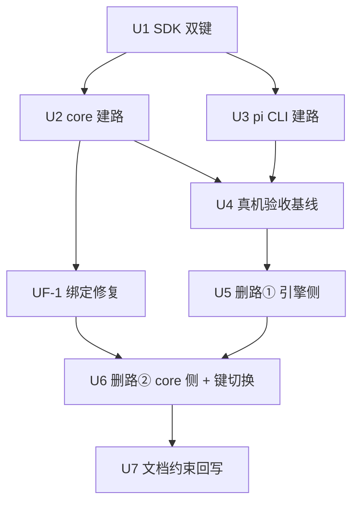

# subagent chat 域统一进 run 域 实施计划
基线: <待填> | 来源设计: docs/design/subagent-chat-run-unification.md (v7) | 日期: 2026-09-11

## 0 章节映射
| 内容 | 设计文档实际位置 |
|------|------------------|
| 背景/目标 | §1 背景目标（1.1 SCQA / 1.3 设计目标 G1-G3 / 1.4 in-out scope） |
| 终态/机制 | §3 解决方案（3.3 关键决策 D1-D8 + 红线 / 3.4 ConversationContinuation / 3.5 终态数据流） |
| 验收场景表 | §4 验收（S1-S8 真实场景表） |
| 下一层拆分 | §5 下一层拆分（U1-U7 单元表 + S5 grep 门测试处置表 + 文件改动地图 + 待验证检查点①-⑦） |
| 待验证检查点 | §5 末段「待验证检查点」①-⑦ |

对抗式审查证据：本会话 tech-design 双审循环 6 轮收敛（终轮主审 0 MF + 0 SUG、影响面 0 MF + 0 SUG），收敛声明见设计文档头部「修订状态：v7（设计就绪）」，被否谱系 19 条在附录 B。

## 1 目标快照

**背景/目标（§1.3 逐字摘录）**：
- G1 agent() 等同 subagent 语义稳定：同一派发路径、同一 record 模型、同一保障。
- G2 删除面干净：chat 域独立状态机整族退役，四包 + extensions 测试全绿，grep 门零命中。
- G3 行为兼容：one-shot 行为零变化；崩溃/重启后续聊语义保持（30 天 idle-gc 只归档不终态化）。

**Out-of-scope（§1.4）**：本设计不动 zcode 会话库（C-ext-20）、不动 H2/H3/H4 范围（workflow record 归位、service 拆分、持久化收口另案）、不改 pi 源码。

## 2 单元列表

| Unit | 职责 | 领地（精确文件路径） | 依赖 | 隔离 | 验收条款 |
|------|------|---------------------|------|------|---------|
| U1 | SDK 协议双键过渡：新增 `resume` 子对象与 `chat` 并存（载荷同形）+ schema/测试；roundLifecycle/interact 标 deprecated | `packages/subagent-engine-sdk/src/protocol/{methods,contract-types,schema,reverse-channels,port-contract,engine-protocol}.ts` + `packages/subagent-engine-sdk/src/__tests__/`（resume schema 用例新增） | 无（DAG 根） | plain | `cd packages/subagent-engine-sdk && pnpm test` 绿；resume 与 chat 键载荷同形单测 |
| U2 | core 建路：ConversationContinuation（§3.4 全规格）+ message/close 编排改写 + SP-5 升级路由与 gate（双写点）+ 引擎退出链收割（红线①POSIX 组杀/Windows 镜像通道，intentionalKill 跳过）+ settle 交棒改 run 应答驱动 + doFinalizeRoundToIdle outcome 入参 | `packages/subagent-core/src/execution/conversation-continuation.ts`（新增）/ `execution/subagent-service.ts` / `execution/subagent-actions-core.ts` / `execution/finalize-record.ts` / `execution/notifier.ts` / `execution/engine/client/engine-client.ts` / `execution/settled-watchdog.ts` / `execution/engine/common/capability-gate.ts` / 对应 `__tests__/`（新增 continuation 用例族） | U1 | plain | `cd packages/subagent-core && pnpm test` 绿；U2 单测清单（§5 U2 验收列全项）逐条有对应用例 |
| U3 | pi CLI 建路：run 路径 resume 参数穿透（spawn-args 已支持 `--session`）+ 首轮不再经 ChatSessionRegistry | `packages/pi-subagent-cli/src/{pi-engine,server,spawn-runner}.ts` | U1 | plain | e2e：resume run 续写同文件、历史召回（`cd packages/pi-subagent-cli && pnpm test`） |
| U4 | 真机验收：S1-S8 全表 + 冷启耗时实测入表（D2 量化闭环） | 无代码领地（真机场景执行；发现缺陷回对应单元修复） | U2+U3 | plain | 基线轮已执行（2026-09-11，隔离实例 /tmp/xyz-iso-data，真实 LLM MiMo-V2.5-Pro）：S1 ✅（三轮通知各自到达，含快续聊回归点——sess_8590cc5a 遗留确认修复；轮 3 召回「牡丹47」准确；列表一行）/ S2 ✅（在途 abort 实证：child exit 143 → drain 新轮执行新指令「7」；检查点⑤按内容级口径过）/ S3 ✅（会话切换 live≡reload）/ S4 ✅（SIGKILL → 失败通知单发带恢复指引 + 原文件 resume + JSONL 20 行零交错 + 召回与 flush 内容一致）/ S7 ✅（close 胜出、无僵尸轮、record 终态 closed + 通知）/ S8 ✅（message on settled one-shot 返回 delivered:true，升级后续聊答 152）/ S6 ❌ → **UF-1 缺陷登记（见 §5）** / S5 ⏳（U5/U6 后 Gate B 复验）。冷启实测入表：spawn+重放+首条落盘 3-7s（中位 ~4s，n≈10），首响（含 LLM）3-18s——未触发 D2 重审线。气泡冻结观察项未复现（本基线无主轮 error 终态），Gate B 续观。观察项：列表「0 turns · 0 tok」计数不涨（display 面）、失败载荷 exit code 显示 128 vs relay 实录 143（信息准确性，低优）。 |
| U5 | 删路①（引擎侧）：pi chat-session.ts + e2e chat 形态改写；SDK roundLifecycle 通道族 + interact + port-contract/engine-protocol + schema + conformance fixtures + probe；zcode server.ts interact dispatch + zcode-engine.ts 桩；测试处置表前 8 行 | `packages/pi-subagent-cli/src/chat-session.ts`（删）/ `packages/pi-subagent-cli/src/__tests__/{chat-session,chat-protocol,pi-engine,protocol-chat-e2e,server}.test.ts`（处置表）/ `packages/subagent-engine-sdk/src/protocol/*`（通道族删）/ `packages/subagent-engine-sdk/src/__tests__/{chat-domain-v1x,protocol}.test.ts` / `packages/zcode-subagent-cli/src/{server,zcode-engine}.ts` / `packages/zcode-subagent-cli/src/__tests__/server.test.ts` | U2+U4 | plain | S5 grep 门方向：处置表前 8 行清零；`cd packages/pi-subagent-cli && pnpm test` + `cd packages/subagent-engine-sdk && pnpm test` + `cd packages/zcode-subagent-cli && pnpm test` 绿 |
| U6 | 删路②（core 侧）：删除清单（deliverChatMessage/resumeColdRound/cold-resurrect/closeChatIdle 族/handleChatRoundPhase/engine 层承载件/finalizeChatSpawnFailure/settleChatRoundFromResponse/base 两函数）；core 测试处置表后 4 行；**U6 同批 `chat`→`resume` 键读写两端切换**（U1 配对）；settled-watchdog 刷新源收尾 | `packages/subagent-core/src/execution/*`（删除清单）/ `execution/__tests__/`（处置表后 4 行）/ `execution/engine/{port.ts,client/{remote-engine,reverse-router,engine-client}.ts,host/host-bridge.ts}` / `execution/execution-record.ts`（roundBaseTurnIndex 清理）/ `execution/types.ts` | U5 | plain | S5 grep 门全量零命中 + 四包全量绿 + 净删统计 |
| U7 | 文档与约束回写：C-proc-13 五段逐段、chat-domain-v1x 文档 superseded 横幅、protocolization 文档族符号清扫、troubleshooting §12 | `docs/constraints.json` + `docs/constraints.md`（render 脚本再生）/ `docs/design/chat-domain-v1x-liveness-governance*.md` / `docs/troubleshooting.md` | U6 | plain | `node scripts/check-doc-symbol-drift.mjs` 绿 + `node scripts/render-constraints.mjs` 已跑 |
| UF-1 | 跨重启续聊绑定修复（U4 基线发现，见 §5 偏差表 UF-1 行）：宿主侧在 run 终态应答 `outcome.sessionFile` 回填点写 record 绑定 sidecar（id→file + rootSessionId，复用 L4 state-marker 载体族），必要时修 findLightById/collectRecords 消费面；**不引入 pi 源码/extension 改动** | `packages/subagent-core/src/execution/{subagent-service,state-marker,record-store}.ts` + `__tests__/`（新增绑定写入/消费/终态翻转用例） | U2 | plain | 单测：run 应答回填后 sidecar 落盘、coldLookupForAction 能经 sidecar 解析 id→file、close 终态翻转不破坏既有 .state 语义、`cd packages/subagent-core && pnpm test` 全绿；S6 三变体 Gate B 真机复验签收 |

## 3 DAG 图

> UF-1 为 U4 基轮发现的 must-fix 修复单元（H1 G3 承诺「重启后续聊语义保持」），与 U5 并行、先于 U6（同文件 subagent-service.ts 领地互斥由串行保证），Gate B 前完成并复验 S6。

## 4 测试策略

- 增量（单元开发期）：`cd packages/<受影响包> && pnpm test`（vitest run；四包 = subagent-core / subagent-engine-sdk / pi-subagent-cli / zcode-subagent-cli）；extensions 触及时 `pnpm extensions:test`
- 全量（收尾阶段 5）：四包全部 + `pnpm extensions:typecheck && pnpm extensions:lint && pnpm extensions:test` + `bash scripts/validate-runtime-bundle.sh`
- 红线：vitest only；timer 测试用 fake timers；测试写删目标 mkdtempSync 自建自删，禁触真实数据目录

## 5 合理偏差登记表

| Unit | 偏差 | 处置 |
|------|------|------|
| U1 | port-contract.ts 实际在 src/ 根而非计划的 src/protocol/ 花括号范围 | 合理——计划路径写法笔误，按实际路径修改，语义等同；U2-U6 领地引用时同读 |
| U1 | schema 同形校验落地为载荷级 JSON Schema 片段 runSessionParamsSchema，非帧级深校验 | 合理——帧级 params=ANY_JSON 不深校验是 schema.ts 现行设计裁决，U1 不越界 |
| U1 | deprecated 落点扩展到 InteractResult 与 ProtocolParamsMap/ResultMap 的 interact 属性行（+2 处） | 合理——同属「声明处标注」，保证 IDE 消费面完整 |
| U1 | resume-schema.test.ts 双键同形断言族在 U6 删 chat 键后随退役 | 登记——纳入 U6 测试处置范围（文件头已注明去向） |
| U3 | spawn-runner chatMode 语义改为「agent_settled resolve + 杀链收割」（原保活给 registry 续聊） | 合理——D7 对齐必需件：续聊 = 新 run，进程无保活理由；agent_end 仍不 kill 保住 compact 收尾窗 |
| U3 | e2e 历史召回为构造性断言（fixture 回显历史行数） | 合理——真实 LLM 召回归 U4 真机 S1 |
| U3 | server 删除 chat run 跳过 per-run askUser 绑定的特判；pi-engine 删三个 chat 私有死函数 | 合理——链路解耦后死代码（TS noUnusedLocals 拦截无法保留）；registry 本体与 interact 删除仍归 U5 |
| U3 | 过渡期事实：U3 已落而 U2 未合入期间，chat 流的 core 旧链路在首轮收割后无法经 interact 续聊 | 已知——DAG 定义 U4 依赖 U2+U3，双单元合入后链路完整；U2 在途 |
| U2 | doFinalizeRoundToIdle 入口未加 status==='running' 硬 assert（设计 §3.4 配套断言） | 合理——与旧 chat 载体死代码共存矛盾（watchdog/spawnFailure/roundFailed 均 tryTransition(closed) 后调 roundToIdle），硬 assert 使死代码不可编译；Continuation 终态守卫 early-return 构造性保证 + close 抢先用例覆盖；U6 删死代码后补硬断言 |
| U2 | D7 失败轮「前值 ?? 失败摘要」的前值保留分支在 Continuation 主链不可达 | 合理——Continuation 轮始清 result（承接 resumeColdRound 的 §5.4 执行态语义，先于失败簿记）→ 主链失败轮 result 恒写失败摘要；「前值 ??」规则在 doFinalizeRoundToIdle 载荷层完整实现（专用用例在），集成用例按主链实际形态断言 |
| U2 | notifyGate 门在 finalize 之后判 closedReason，B#19 竞态窗改由 early-return 构造性拦截 | 合理——真实 doFinalizeRoundToIdle 会清 closedReason；early-return（status 终态面，先于门）已拦 cancelled/parent-new 注入；门按设计保留为正交第二闸（防御），门语义用例以「running + closedReason 残留」形态验证 |
| U2 | Continuation 轮不挂 idle timer（armChatIdleTimer 不再被新编排触发） | 合理——轮末进程随 agent_settled 回收、轮间无保活进程，「5min idle 关闭」语义随长驻消亡（设计 §2.2#5 预告）；30 天 idle-gc 只归档不终态化不变；旧 arm 点死代码 U6 删 |
| U2 | 旧测试最小适配 5 文件（删 3 用例 + 改写 5 用例） | 合理——delivery-methods 删 EPIPE（interact 面退役，覆盖归 pi 包）与 disarm idle timer（挂载面退役）；first-round-watchdog 删未知相位静默（相位消费面退役）；其余为签名/锚点/mock 最小适配；大规模删除仍归 U6 处置表 |
| U2 | extensions 5 用例破损留 U6 处置（未越界修） | 已知过渡态——subagent-message-close 3 + one-shot-upgrade 1（mock 缺 canUpgradeToConversation）+ chatmode-round-notify-real-chain 1（anchor 回填退役，sessionFile 回填改由 run 应答 outcome.sessionFile 承载，kickOffChatRound resolve 段已实现）；同根因均为 U2 编排改写，处置表已排 U6 批；extensions 其余 901 用例绿 |
| U2 | Windows 收割通道经私有方法 reapOrphansViaMirrorSnapshot 直调覆盖 | 合理——vitest worker 内 process.platform 不可 stub；platform→通道一行字面分派由 U4 真机 Windows 验收承接（本基线轮在 macOS 跑），通道语义（置死前快照过滤活孤儿 + 异步 taskkill + 无 spawnSync）已全测 |
| U4 | **UF-1（S6 ❌，must-fix）：跨重启 record 续聊链断裂**——SIGKILL / 优雅停机 / 已完成三变体下，重启后 message 一律「subagent not found or not owned」；展示层可重建（列表 3 条）但动作链不可达 | **归属裁定：engine-CLI 化时代预存缺口，非 H1 回归**——证据链：①子任务 session 文件只含 {session, model_change, thinking_level_change, message} 四类条目，**无身份条目/record id/rootSessionId 绑定**；②sessions-index.json 从未落盘；③`PI_SUBAGENT_SELF_RECORD_ID` 全链路只有读取（subagent-service.ts:283 定义、:665/:692/:723 消费）**无注入点**（旧 in-proc session-runner 注入，W3 引擎协议化后丢失）→ coldLookupForAction（cold-resurrect.ts:50 findColdLookupCandidate：findLightById + collectRecords）无映射工件可查。设计 S6 前提（存量 record 可续聊）依赖的绑定写侧在基线之前已死，六轮双审未抓出。**修复路由：新增 scoped 单元 UF-1（H1 内、Gate B 前落地）**——宿主侧绑定写（handshake 拿到 sessionFile 后落 record 绑定 sidecar，复用 L4 state-marker 载体族；close 时写终态 marker 已有先例）【2026-09-11 审查修正：绑定写点实态 = run 终态应答 `outcome.sessionFile` 回填处（subagent-service.ts 写点三处），handshake 面只回填 engineHandle.sessionRef 不写绑定；UF-1 按实态实施】，使 findLightById/collectRecords 恢复 id→file 映射；带 S6 三变体回归（Gate B 复验）。设计文档 S6 需同步补「绑定工件」前提说明（U7 批）。 |
| U5 | 处置表第 8 行 + conformance fixtures（fake-engine-protocol.mjs / smoke-run.fixture.json）物理在 subagent-core，impl-plan U5 领地清单未列 | 合理——设计文档 §5 U5 行明确归 U5（「conformance fixtures + probe」+「处置表前 8 行」），按设计文档职责执行；登记领地清单省略，U5-U6 领地引用时同读 |
| U5 | protocol-blackbox.test.ts 连带最小适配（interact 往返断言段删） | 合理——fixtures 剥离后该断言必红；不在处置表与领地清单，随 fixtures 同批登记 |
| U5 | probe 脚本处置 = 空集 | 合理——grep 门 pattern 下 scripts/ 与三包 probe 文件零命中，contract.probe.test.ts 无 chat 符号；非遗漏 |
| U5 | U5→U6 设计内过渡态：subagent-core 6 文件 9 处 TS2305（type-only import 已删 SDK 符号），分布 = port.ts / remote-engine.ts / reverse-router.ts / engine/types.ts / subagent-service.ts:118 / protocol-closure.test.ts | 已知——全部位于 U6 删除清单「engine 层承载件」；vitest 运行时绿（core 2883 passed 实证 type-only import 擦除）；U6 落地收敛，UF-1 验收面（core pnpm test）不受影响 |
| U5 | HostStreamDeltaParams 的 recordId 关联形态保留未删 | 合理——不命中 grep 门 pattern，其 core 消费面（reverse-router recordId 分路）属 U6 删除清单 |
| U5 | conversation 能力位按 D5 保留（pi native / zcode unsupported / gate / manifest 不动，注释语义收窄为 resume 能力位）；chat-domain-v1x.test.ts 整删后 SDK 侧 gate 文案契约断言随文件退役 | 合理——D5 位与 gate 行为保留；gate 行为覆盖仍存于 core capability-gate.test.ts 与 pi server.test.ts gate 用例 |
| UF-1 | 红1（collectRecords 绑定重建缺 round 投影）= 前任实现缺口，修法为 scanFile 内 identity miss 且绑定携带 round 时补 entry.light.round（+6 行最小侵入），不动 buildRecord 签名与既有全量重建语义；cold-resurrect.ts/alive-store.ts 零触碰 | 合理——既有语义 identity entry 磁盘重建不恢复 round，绑定路径按需补投影 |
| UF-1 | 红2（写失败不阻塞用例红）根因 = 测试桩缺陷（mkdir 后漏 chmod 0o555，目录实际可写），非实现缺陷——同文件 A 组同款用例绿证明 writeRecordBinding 只读目录行为正确 | 合理——修测试桩不改实现 |
| UF-1 | 红3（跨重启全链断言错位）根因 = 首任测试断言挖错协议承载位：chat 会话形态参数（recordId/resume）挂 RunContext（port.ts:146）不在 task；修正后与 delivery-methods.test.ts:191 既有绿测试同口径 | 合理——协议承载位以 port.ts 既有契约为准 |
| UF-1 | typecheck 验收口径调整：typecheck exit 0 在 U6 前不可达（U5 过渡态 9 处 TS2305），调整为「恰好 9 且逐条为已登记分布、零新增」 | 已知——U6 落地后收敛到 exit 0 |
| U6 | closeChatIdle 未删 + deliverChatMessage 保留为活入口（interrupt 三参→两参清理） | 合理——两者均为活代码（D4 close 承载三处消费 / chatActions messageHandler 活入口），符合「仍被新链路引用的死代码候选不硬删」条款；resumeColdRound 整删（守卫链已在 Continuation） |
| U6 | cold-resurrect.ts 删除落地为改名迁移 cold-lookup.ts：UF-1 跨重启活链消费面不可连语义删除；resurrectColdRecord 的 chatMode 无条件置位改为 found.chatMode 水合保留 | 合理——升级置位归 Continuation revive 格 + messageHandler gate 双写点（D4/D5 意图），行为变化 = one-shot 跨重启升级现过 gate，正是 D5 设计 |
| U6 | 领地延伸三处（均有背书）：①SDK 删 RunChatParams/RunParams.chat + resume-schema 双键同形断言族删（U1 偏差「纳入 U6 处置」+ U6「删 chat 键」职责）②pi 读端 ctx.chat→ctx.resume + assertResumeRunFrame（设计「读写两端切换」含读端）③extensions 处置实为 8 文件（任务 3 + 处置表 2 + 连带编译修复 3） | 合理——登记领地清单省略，U5 有同款先例 |
| U6 | UF-1 record-binding.test.ts 机械适配 2 行（三参→两参调用 + ctx.chat→ctx.resume）：U6 删 deliverChatMessage 三参签名与 RunContext.chat 键后原两行必然编译失败 | 合理——语义断言零变化（绑定重建→续写原文件→resume 锚点），13 用例全绿实证 |
| U6 | terminateChatSession（interact cancel/close）调用点删除：U5 删引擎侧 interact dispatch 后已是「发帧必失败」死通道；stale-child 守卫退化为镜像检查 + 有界等待（STALE_CHILD_EXIT_WAIT_MS）后派发 | 已知——残余窗口由红线③宿主重启窗登记与 S4 实测承接，与 U2 建路后 U5 已造成的现状一致，非本批新引入 |
| U6 | backfillChatAnchor（idle 相位帧锚点回填）随相位机整删：chat 轮 sessionFile 锚点唯一落点 = run 应答 outcome.sessionFile（既有写点 + UF-1 绑定落盘） | 合理——S6/UF-1 用例实证；read 降级链对该形态落 ③outcome-only |
| U6 | session-reader TC-m3b-real-data-guard 两轮打回修复：①sourceMode 硬编码断言改合法集 ['flat-fallback','precise'] ②FAM 家族记录已从本机消失致 totalNodes 恒红 → 裁决落地动态选根（关联 record 最多者作根）+ 无合适根诚实 skip | 教训入账——守卫用例对可变外部状态（本机真实数据）做硬编码断言必随数据演化腐烂；守卫意图 = 不抛错 + 树非空，数据形态描述不是断言目标 |
| U6 | git 操作申报（违反「禁一切 git 写操作」约束）：git mv（改名 staging，替代方案丢 rename 语义）+ git add -N（统计行数，立即 reset 还原）；未 commit/push/切分支 | 已知——编排者核验时 staged rename 已并入流转，无实质损害；纪律提醒已入账 |
| U7 | 设计文档 §5 U7 行「②轮次活性权威：chatMode 纳入监督域」为 v2 时代残留措辞——D8 已在 v3 回撤为「豁免维持」（附录 B#6），U7 行未随 v3 同步，与 D8 正文自相矛盾；U7 按协调者指令「五段内容以 H1 设计 §3.3 D5/D7 与落地实态为准」执行，并将该行修正为「chatMode 豁免维持（D8 v3）、注销发射点②承载改 Continuation 轮终簿记」 | 合理——C-proc-13 ②段回写以 D8 v3 终态为准（监督器零改动），措辞修正属 C-proc-10 文档同步纪律范围；同批清理的活文档悬空引用三处（extensions/subagents/architecture.md、architecture/subagent-engine-abstraction.md、subagent-service-decomposition.md R0 行）超出 U7 领地清单字面，为 U7 验收「符号清扫」grep 全域命中的直接处置对象 |
| 阶段3 | UF-1 合理演化登记①：record-store 对绑定 sidecar 存在的文件跳过磁盘索引投影（record-store.ts:1093-1098）+ 负缓存可被后到绑定打破（:1110-1114 注释「戳变化自动重试」）——UF-1 偏差红1 只登记了 round 投影，本条为审查补齐的关联缺口 | 合理（R1 审查确认）——SessionsIndexEntry 不含 chatMode/round，索引命中会抹掉绑定承载的对话形态域；索引跳过是 UF-1 正确性必需件 |
| 阶段3 | UF-1 合理演化登记②：continuationFor 实例-record 绑定一致性检查（subagent-service.ts continuationFor 内 `existing.boundRecord === record` 判定，跨重启冷查重建新 record 对象时重建 Continuation；行号以审查时点为准，组 A 修复落地后漂移） | 合理（R1 审查确认）——保证 Continuation 的状态写恒落 store 在册对象，是 UF-1 跨重启链的隐含必需件（设计 §3.4 未涉及的实例生命周期面） |
| 阶段3 | 双写点①用例未断言 recovery 指引段（subagent-actions-core.test.ts:662-663 仅断言 message 主文案） | 可接受（R3 审查确认）——文案单源同一函数（capability-gate），指引段由双写点②用例 recovery 断言（conversation-continuation.test.ts:198-199）间接守护，覆盖冗余度略不均非缺口 |

## 6 状态表

| Unit | 状态 | 轮次 | 证据指针 |
|------|------|------|---------|
| U1 | committed | 1 | commit bc9322d05：SDK 7 文件 + resume-schema.test.ts 12 用例；重跑 152 passed；typecheck exit 0；读端三包零改动。解冻前置 = C-pi-14 守卫落地（e7740ca39，过渡豁免 104 文件） |
| U2 | committed | 1 | commit 51e971a82：14 文件 +2265/-344（新增 conversation-continuation.ts + 2 测试文件 39 用例）；主 agent 独立重跑 2886 passed \| 4 skipped（193 文件）+ tsc 0；前任 dev 汇报随压缩丢失、接替 dev 派出 200s 即召回（未产生编辑）后按前任迟到送达的完整汇报硬核验流转；7 偏差登记 §5 |
| U3 | committed | 1 | commit 2b7bf4f11：pi CLI 9 文件；重跑 336 passed（26 文件）+ typecheck exit 0；e2e 构造性历史召回 + 收割上报断言 |
| U4 | committed | 1 | 基线轮完成（见 §2 U4 行逐场景签收）；S6 ❌ 触发 UF-1 单元（证据链 + 归属裁定 + 修复路由登记 §5） |
| U5 | committed | 1 | commit 465bb7d0d：26 文件 +396/-2996；grep 门三包源码+测试双方向零命中；sdk 133 / pi 303 / zcode 243+3 skipped 全绿 + 三 typecheck 0（主 agent 独立重跑逐字相符）；处置表前 8 行清零；7 偏差登记 §5；UF-1 并行在途改动共存未触碰 |
| U6 | committed | 1+2 打回 | commit bbed5fcfa：64 文件 +617/-2049（净删 ~1474）；grep 门全仓零命中；四包测试全绿 + tsc 0（TS2305 归零）；extensions 三连绿（subagent-workflow 906/906 + session-reader 修复）；UF-1 绑定 13 用例保持全绿；主 agent 独立重跑相符；偏差登记 §5（含两轮打回） |
| U7 | committed | 1 | commit 7a699817a：docs/ 15 文件 +51/-26（内容见下条变更历史；主 agent 硬核验 = drift 守卫绿、render 幂等重跑零 diff、残余 17 文件宽符号命中逐一核对为删除声明/史实注记/前瞻标注）；5 偏差登记 §5 |
| UF-1 | committed | 2 | commit f70dc2da4：4 文件（state-marker 载体 / record-store 消费 / service 写点 / record-binding.test 13 用例）；主 agent 独立重跑 13/13 + 全量 2896 passed \| 4 skipped + typecheck 恰 9 处已登记过渡态；接替 dev 修 3 红（1 实现缺口 + 2 测试缺陷）后 5 验收项 clause_map 全覆盖；4 偏差登记 §5 |

## 7 残留风险与变更历史

- 残留风险：① 设计文档行号基于 commit 64e379a7c 附近，实施以符号 grep 锚定（文档头部已声明）；② 用户 L 批次并行改动可能与 U2 领地交叉——派发前核对工作区，L 批改动一律认知外处理；③ F7 staged 引擎副本新鲜度——U4 真机前确认（`19a5401ab` 已修 dev 启动恒重建）；④ sess_8590cc5a（subagent 通知机制）唯一未修遗留 = **pi 热路径续聊轮零通知**（旧架构 `handleChatRoundPhase` 热路径相位消费只交棒不 notify，`settleChatRoundFromResponse` 唯一调用点在冷路径续体，快续聊整条通知链不存在、record result 不落盘）——本设计 D7 轮末分流 + settle 交棒 run 应答驱动即其结构性根治（热路径整族随 U5/U6 删除），已登记为 U4 真机 S1 显式回归目标（**Gate B 实测确认修复**：三轮通知各自到达）；非本批提交引入（W3 chat 域协议化时代遗漏）；⑤ **engine-client.ts 结构性拆分债（Gate A 验收登记，2026-09-11）**：H1 期间收割链与轮次活性承载并入后 541 行，超 max-lines override（520→545 提额放行，Gate A 唯一阻塞项修复）——eslint.config.mjs 注释既定拆分方向 = 正向请求面/反向路由面/收割面三分，随 H3 service 拆分轮处置，不在此线临时大拆（验收阶段避动红线①收割链核心面）；⑥ **subagent sessions 目录布局分裂（Gate B S6 fail 根因，W7 复刻错误非 H1 引入，修复中）**：引擎 `pi-engine.ts resolveSessionDir` 自 W7（375ebab02）起三处偏离宿主权威（根 dataDir vs agentDir / 段序 / 编码），注释自称「等价形态」为假；`hostInfo.dataRoot` 引擎不消费（initialize 只校验 protocolVersion）——引擎写盘与宿主冷查/GC/session-reader/runtime extractor 四路扫描根分裂，`.record-binding` 随引擎错根落盘；修复 = **Option C 协议化**（run ctx 增 `sessionDir`，宿主 `getSubagentSessionDir` 单一权威注入，引擎本地推导降级 [LEGACY] fallback；同构先例 ctx.sessionRootId）；游离树 `<dataDir>/subagents`（npm 引擎包发布窗产生，量级小 manifest 无损）清扫**并入方案 B 迁移脚本**登记（兄弟分支，不在本分支另起一次性脚本）；守卫盲区（根级漂移 check-layout-literals 抓不住，真机是唯一网）随方案 B 的 C-pi-14 authority 文档补「跨进程路径不得双侧各自推导」条目；⑦ **S6② disconnected 变体不可真机构造（Gate B 裁决）**：disconnected 仅由 `.state` reason 异常的重建分支产出，正常流程不可达—— revive 链以单测覆盖为准（conversation-continuation.test 既有 disconnected 用例），真机场景调整为 running-idle / parent-shutdown 复活 / user-close 拒绝三类。
- 变更历史：
  - 2026-09-11 计划创建（来源设计 v7，双 0 收敛版）。
  - 2026-09-11 U1 开发完成 + 硬核验通过，流转 commit 被共享 pre-commit 的 C-pi-14 布局守卫拦截（守卫交付物缺失 + 本分支 205 处存量旧布局字面量，清理 sweep 在兄弟分支未合并）→ **U1 冻结升级用户**（dev-flow MANDATORY：环境冲突超出编排者裁决范围）。全流水线 packages/ 提交均被同一守卫拦截，冻结期间 doc-only 提交不受影响。
  - 2026-09-11 **解冻（用户裁决「cherry pick」后发现新事实修正为守卫+豁免路线）**：完整 cherry-pick d484b3dac 时发现其携带方案 B 数据布局迁移（`<dataDir>/pi/agent` → `<dataDir>/agent`，含 migrate-pi-layout-v2 迁移脚本，属未合并的 session-reader 分支 U18）——把未合并的布局迁移拖进 H1 基座超出授权，已 abort。改行**守卫落地 + 过渡豁免**路线（e7740ca39）：守卫脚本+单测从 sweep 分支原样引入，3 个方案 B 交付物专属豁免条目剔除（随其合并再回），104 个含 pi/ 字面量文件登记过渡豁免（统一理由：本分支尚为 pi/ 子层布局，方案 B 合并时随 sweep 清理后回收）；R2 放行 fixture 换本分支既有豁免文件。守卫复跑 0 命中（2699 文件/112 豁免）、单测 19/19 绿。
  - 2026-09-11 **L 组 session 遗留收尾**（用户指令 sess_47c1bc22 完整处理）：① f6-third-site-wip stash 已消失，其内容经取证被 HEAD 的 F6 提交（d647b289e + 5186f6356）覆盖，无残留；剩余 3 条 stash 均属其他分支工作（dev-0.9.14 / cw/scoped-model / dev-0.9.5），不在本分支融合范围、未动。② childStateChanged 行为契约已登记 **C-pi-15**（constraints.json + constraints.md 再生，98 条）——引擎任务子进程 spawn/退出必须上报 host/childSpawned/childStateChanged（killed 类型层必含），宿主镜像置死 + SR-4 dialog 取消双依赖。
  - 2026-09-11 **sess_8590cc5a（subagent 通知机制）遗留并入**（用户指令当前 session 一并处理）：唯一未修遗留「pi 热路径续聊轮零通知」的处置 = 本设计自身（该 session 呈现的选项 1「等 H1 落地自然修复」）——D7 每轮 run 应答驱动 settle + 轮末分流通知，热路径整族随 U5/U6 删除；登记为 U4 真机 S1 显式回归目标（S1 执行须压子进程存活窗口）。附带观察「主轮 error 终态后 UI 流式气泡冻结不重置」列入 U4 真机核验项（复现则 renderer 侧独立修复，不扩 H1 scope）。U2 前任 dev 汇报随上下文压缩丢失，按接替程序补派（在途 diff 核验为领地内、新增用例 39/39 绿）。
  - 2026-09-11 **U2 流转 committed（51e971a82）**：接替 dev 派出 200s 即召回（原 ID 截断致 TaskOutput 查无——完整 ID 下前任 dev 仍在跑并正常送达完整汇报），按前任汇报硬核验（文件集合 ⊆ 领地逐一对上、全量独立重跑 2886 passed 与汇报逐字相符、tsc 0）后流转。教训入账：后台 agent 句柄查询必须用完整 agentId；「通知未到 ≠ agent 已死」。就绪集重算：U4 就绪（U2+U3 双 committed），U5 仍锁于 U4。
  - 2026-09-11 **U4 真机基线轮完成**：隔离实例（/tmp/xyz-iso-data，PORT_OFFSET=200，vite 1421，CDP 9242，真实 LLM MiMo-V2.5-Pro，staged 引擎 bundle-extensions 重建含 U1-U3）。逐场景签收见 §2 U4 行：S1/S2/S3/S4/S7/S8 ✅（**sess_8590cc5a 遗留热路径零通知确认修复**——快续聊轮通知到达）；S6 ❌ 触发 **UF-1**（跨重启续聊绑定断裂，engine-CLI 时代预存缺口：PI_SUBAGENT_SELF_RECORD_ID 无注入点 → 身份条目永不落盘 → coldLookupForAction 无映射可查；展示层 3 条 vs message 链 not-found 双注册表不同源实测钉位）。新增 UF-1 单元（§2/§3 DAG/§6），与 U5 并行、先于 U6，Gate B 复验 S6 三变体。冷启量化入表。气泡观察项未复现、Gate B 续观；两项低优观察（turns/tok 计数、exit code 128 vs 143）**改挂 Gate B 观察清单**（2026-09-11 审查修正：UF-1 领地 = core 绑定 4 文件、U7 = docs-only，均不含 renderer display 面与失败载荷 exit code 显示，「随批带走」无承接单元，与气泡观察同列 Gate B）。
  - 2026-09-11 **U5 流转 committed（465bb7d0d）**：删路①引擎侧完成——SDK 通道族 9→8/方法 10→9、pi chat-session.ts 删、zcode interact 桩删、处置表前 8 行清零，grep 门三包零命中；三包测试/typecheck 独立重跑全绿。U5→U6 过渡态（core 6 处 TS2305 type-only import）登记 §5，U6 收敛。UF-1 与 U5 同批派发（领地不相交），U5 硬核验时文件集严格二分，UF-1 在途 4 文件未触碰。
  - 2026-09-11 **UF-1 首任 dev 限流阵亡 → 接替派出**：主体实现已完成（+249/-19，13 用例 10 绿），账户限流 1302 中断于收尾段；残留 3 红用例钉位（collectRecords 重建分支消费缺口 / 写失败不阻塞 warn 路径 / service 跨重启集成链）。按接替程序补派（失败明细 + TS2305 过渡态禁触清单随 task 附上）。U6 仍锁于 UF-1（subagent-service.ts 串行）。
  - 2026-09-11 **UF-1 流转 committed（f70dc2da4）**：接替 dev 修 3 红后 13/13 绿、全量 2896 passed、typecheck 恰 9 处已登记过渡态零新增；5 验收项 clause_map 全覆盖（回填点落盘 / collectRecords+findLightById 解析 / coldLookupForAction 全链 / .state 终态优先级 / 写失败不阻塞）。就绪集重算：**U6 就绪**（U5+UF-1 双 committed）——此后 S6 三变体跨重启续聊的真机复验移至 Gate B（UF-1 单测已覆盖全链，真机留验收签收）。
  - 2026-09-11 **U6 流转 committed（bbed5fcfa，含两轮打回）**：删路② + chat→resume 键读写两端同批切换完成，净删 ~1474 行，S5 grep 门全仓零命中，四包 tsc 归零全绿，extensions 三连绿。打回轮 1 = extensions:test 唯一红（session-reader TC-m3b-real-data-guard）钉位为测试对真实数据快照硬编码；打回轮 2 = totalNodes 断言的第二层硬编码（FAM 家族记录已消失）触发裁决 → 动态选根 + 诚实 skip 落地。教训：环境守卫用例禁烤数据快照。就绪集重算：**U7 就绪**（U6 committed），U7 后进入阶段 3 一致性审查。
  - 2026-09-11 **U7 文档与约束回写完成（dev 执行，待硬核验流转 commit）**：① C-proc-13 五段逐段改写——①协议面（roundLifecycle 通道族 + interact 删除、resume 唯一形态键、conversation 位收窄 resume 能力位 + SP-5 双写点 gate）②轮次活性权威（round-supervisor chatMode 豁免维持、run 事件 + onActivity 刷新源、run 应答驱动 settle 交棒、注销发射点②承载改 Continuation 簿记）③pending 注册表（补 goal 拦截覆盖窗「整个对话期→轮在途期」收窄）④不动 ⑤abort 阶梯（补续聊轮打断不经此面澄清）；authority 改挂本设计 §3.3，constraints.md 再生 98 条。② chat-domain-v1x 两文档 superseded 横幅。③ protocolization 两文档 H1 退役注记（档案处置，正文不逐处改写）。④ 活文档悬空清理三条（extensions/subagents/architecture.md 协议面段与机制表、architecture/subagent-engine-abstraction.md EnginePort interact 契约块、subagent-service-decomposition.md R0 行跨聚合边消亡）+ 史档注记三条（agent-end-recovery-replay 两文档、core-unbounded-wait-audit）。⑤ troubleshooting §12 H1 修订（四路获取链仍现行 + 续聊轮宿主侧锚点 outcome.sessionFile 新路 + H1 后续聊排障要点四条 + 旧 chat 域日志面消亡声明）。⑥ 本设计 S6 行补绑定工件前提（UF-1 登记项落地）+ §5 U7 行「chatMode 纳入监督域」残留措辞修正为 D8 v3 豁免维持（v2 时代残留、D8 回撤时未同步，详见 §5 U7 偏差行）。验收：check-doc-symbol-drift 绿；render-constraints 重跑无 diff 残留；残余 grep 清点活文档零悬空。**史档豁免清单（宽符号集下仍命中但零悬空、未逐处改写，内联自 U7 dev 汇报）**：chat-domain-v1x 两档（superseded 横幅已加）/ subagent-engine-protocolization 两档（退役注记已加）/ subagent-agent-end-recovery-replay 两档 + subagent-core-unbounded-wait-audit（H1 注记已加）/ subagent-agent-end-recovery.md（头部既有「线 B 历史记录」注记，未动）/ subagent-record-persistence-consolidation.md（H4 待执行设计，引用带「随 H1 消亡退役」前瞻声明；2026-09-11 审查修正其 D3 前提，见变更历史末条）/ subagent-post-convergence-architecture.md + dual-track-convergence.impl-plan + todo/subagent-workflow-sidebar-sync-plan-review-r4（审查档案与变更史，行号取证快照性质）。
  - 2026-09-11 **U7 流转 committed（7a699817a）+ 阶段 2 收口**：主 agent 硬核验（drift 守卫绿、render 幂等、残余命中核对）后流转。**全部实施单元（U1-U7 + UF-1）committed**；转入阶段 3 一致性对抗审查——按分区规模判定派 4 个独立 reviewer 并行（R1 subagent-core / R2 SDK+pi CLI / R3 zcode+extensions / R4 docs+constraints），相互独立禁止引用彼此结论，报告到齐后聚合去重。
  - 2026-09-11 **阶段 3 聚合去重 + 修复批次按领地并行派发**：4 分区报告全齐——R1 core（1 high + 3 low unreasonable / 5 reasonable / 2 doc_errors）、R2 SDK+pi（1 low + 7 doc_errors）、R3 zcode+extensions（2 low / 8 reasonable / 1 doc_error）、R4 docs（2 low / 3 doc_errors；其中 U7 状态滞后一条已被 79f194cba 先行修复不计）。handshake 措辞两区重叠（R1-DE1 ≡ R4-DE2）合并为四处。unreasonable 按领地分三组并行派修复 dev：**组 A core**（R1-UN1 one-shot 楔死熔断恢复【high·违背 G3 静默回归】/ R1-UN2 drain 守卫 throw 未接错误面 / R1-UN3 doFinalizeRoundToIdle 硬断言兑现 / R1-UN4 死赋值 / R3-E2 canUpgradeToConversation 直测）、**组 B extensions**（R3-E1 两 stub 残留 interact 成员 / R3-DE1 one-shot-upgrade 措辞统一）、**组 C SDK+pi**（R2-U1 gate 运行时文案收窄 resume 语义 + 6 条注释漂移）。doc_errors 与 reasonable 登记归主 agent 亲为（组 D），R4 两条 unreasonable（观察项挂 Gate B / 自包含内联）同领地并入组 D。
  - 2026-09-11 **组 C 流转 committed（e1683b7be）+ 定向复审 pass；组 B 流转 committed（88e08cfbe）**：组 C 6 文件 +21/-19 全注释/文案级（gate 运行时文案收窄 resume 语义，错误码值/签名不变），主 agent 独立重跑 sdk 130 / pi 303 + 双 tsc 0 逐字相符，定向复审 7 核对点全过零 issues（附带观察 engine-protocol.ts:13 历史段时态词面差异，微修攒入收尾批）。组 B 两 stub interact 纯删除（TS2353 消失）+ one-shot-upgrade 措辞统一（四处含连带场景注释）；subagent-workflow 906/906 独立重跑相符；纯删除+注释级改动由主 agent 全文 diff 审计替代定向复审。
  - 2026-09-11 **组 D docs 修复（主 agent 亲为，本轮）**：① R4-DE1【high】.alive 写者声明修正两文档四处——architecture.md 机制表行 + record-persistence-consolidation.md 一句话结论/G1/写面表 #3（实态 = 写者随 U6 改名迁入 cold-lookup.ts:157 resurrect 回边保留，原「唯一写者已删、零写者」前提失效；H4 D3 清理执行前须先处置该写点）；② R1-DE1+R4-DE2 handshake→run 终态应答回填点四处（设计 S6 行 / impl-plan §2 UF-1 行 / impl-plan §5 U4 行加注 / troubleshooting 排障②改查 run 应答到达）；③ R1-DE2 + RA2/RA3 §3.4 伪码三处（arm 挂载点改「泛化派发主干 pool acquire 后（ContinuationHost.dispatchChatRound 承载）」/ 终态守卫补「并清空 queue」/ 成功失败分支补 disarm 步骤）；④ R1-RA1 文件改动地图 capability-gate 行改「注释更新 + SP-5 升级 gate 错误构造单源」；⑤ R2-D6 处置表 pi-engine.test 行补 close/cancel/EPIPE 删除与覆盖去向；⑥ R4-F1 两项低优观察改挂 Gate B 观察清单；⑦ R4-F2 史档豁免清单内联（自 U7 dev 汇报 deviations#5）；⑧ §5 补 reasonable 登记三条（UF-1 索引跳过 / continuationFor 一致性检查 / 双写点①覆盖冗余度）。
  - 2026-09-11 **组 A 流转 committed（42c6f83d2）+ 定向复审 pass（带 1 medium 增量）+ SDK 微修（2712be324）**：8 文件 +332/-12——A1 one-shot 轮 settled-watchdog 熔断恢复【high·G3】（arm 分流 + onOneShotSettledWatchdogTimeout 对齐旧非 chatMode 分支：kill 升级链 + abort + CAS(closed,gc) + 终态化 + 失败通知过 notifyGate 门，wedge 全链回归用例）/ A2 drain 守卫 throw 接错误面 / A3 doFinalizeRoundToIdle 入口硬断言（**判据偏差**：endedAt 冻结判据替代字面 status==='running'——SP-5 与 CAS 锁内面以 closed 进入，字面形态即生产回归；endedAt 判据更贴合 S7 防御目标，偏差登记在断言注释内）/ A4 死赋值删除（interrupt 字段保留 = extensions schema 兼容面）/ A5 canUpgradeToConversation 直测。主 agent 硬核验：core 2882 passed \| 4 skipped + tsc 0 逐字相符、领地纯净、diff 审计过。**归因更正**：随批 2 处红断言同步（chat-engine-routing / capability-gate）dev 归因「U6 遗留」有误——实为组 C e1683b7be SDK 文案收窄的连带测试面（组 C 定向复审只抽验 sdk/pi 未跑 core 关联测试的盲区，被组 A 全量跑抓到）；修复本身正确。定向复审 8 核对点全过 verdict=pass，附带 3 issues：**[medium] A2 丢弃通知与同轮失败通知同 notifyId（id:round）被 notifier 永久去重——主可达场景下「队列被丢」显式反馈实际不可达（单测纯 push mock 未暴露真实去重链）**，增量修复派出（独立 dedupKey 方向 + 真实去重链用例）；[low] A3 注释「唯一生产写点」粒度（record-store 重建路径亦写，行为正确）随批修正；[low] A1 abort listener 同步抛理论逃逸面与既有 cancelBackground 先例同形、非本批新增风险类——登记不修。SDK 注释时态微修（engine-protocol.ts:13 v1.x 增量段，组 C 复审附带观察）随手 committed（2712be324）。
  - 2026-09-11 **组 A 增量修复 committed（9cfa83f33）+ 阶段 3 审查清零**：定向复审 medium（drain 丢弃通知与同轮失败通知同 key 被永久去重，真实通知链上显式反馈不可达——单测纯 push mock 未暴露）修复落地：BgNotifyRecord 增可选 dedupKey（notifyId 构造优先消费，缺省 `id:round`/`id` 语义零变化）+ drain-drop 用 `id:round:drain-drop`（带 round：跨轮丢弃是不同事件须区分；同轮重放幂等合理）+ 用例升级桥接真实 createNotifier/ledger 去重链（**红锚验证**：回退修复用例精确转红）+ notify-ledger 单测锁定 key 构造语义；随批修 A3 注释写点枚举粒度（low）。key 空间四形态互斥性枚举入账（裸 id / id:round / sync-batch:sha1 / id:round:drain-drop）。主 agent 硬核验：core 2883 passed \| 4 skipped + tsc 0 逐字相符，diff 审计领地纯净（改动面 <160 行，全文审计替代二轮定向复审——用例自带红锚自证）。**四分区审查问题全清零**：R1（42c6f83d2 + 9cfa83f33）/ R2（e1683b7be + 2712be324，复审 pass）/ R3（88e08cfbe，纯删除+注释级主 agent 审计）/ R4（79f194cba + 55a458bc6，doc 组主 agent 亲为）；reasonable 已登记 §5 三条 + 变更历史。累计 2 轮修复循环（批次轮 + 复审增量轮），unreasonable 规模单调递减，未触数字阈值。转入阶段 5 双级验收。
  - 2026-09-11 **Gate A 全绿（0c0f272f9）**：四包测试+tsc 全绿（core 2883\|4 / sdk 130 / pi 303 / zcode 243\|3——zcode 一例源码扫描守卫 5s 超时为并发 flaky，单独重跑确认）；extensions 三连 0；bundle HEAD 产物全链重建 6/6 + Plugin E2E 全过（首轮跑在 30h 前陈旧产物上，强制重建后澄清——教训：validate-runtime-bundle.sh 对已存在产物不重建，验收前核对产物 mtime）；lint 唯一硬失败（engine-client.ts 541 > override 520，H1 加码未同步提额）→ 提额 545 + 拆分债登记残留风险⑤；零容忍审计唯一命中 = 检查器自身 SKIP_DIRS（非绕过）；覆盖矩阵无无人认领模块。
  - 2026-09-11 **Gate B 真机终验：S1-S5/S7/S8 全绿，S6 三变体全灭（唯一 fail，根因已定性）**：隔离实例（/tmp/xyz-iso-data，PORT_OFFSET=200，MiMo-V2.5-Pro）。绿项要点——S1 三轮通知各自到达（notifyId :1/:2/:3，55s 间隔未被 60s 窗吞，轮 3 召回轮 1 事实，**sess_8590cc5a 遗留确认修复**）；S2 打断（relay killed code=143 → 新轮立即执行 + 中断现场召回）；S3 关重开 body 逐字节一致；S4 SIGKILL 引擎 CLI → 失败通知单发 + record 保持 running + 同文件 resume + JSONL 0 坏行 + 任务子进程 2s 收割 + 崩溃前事实召回；S7 force/非 force 两路无僵尸轮无追加通知；S8 one-shot 升级 chatMode 续聊。**S6 fail 根因（主 agent 亲读代码 + 专项调研双确认）**：subagent sessions 目录「宿主 vs 引擎」布局分裂——宿主 `path-encoding.ts:37` = `<agentDir>/subagents/<encodeCwd>/sessions`，引擎 `pi-engine.ts:76` = `<dataDir>/subagents/sessions/<sanitized>`，三处不等价（根/段序/编码），引擎注释「等价形态」为 W7（375ebab02）复刻错误（复刻了 core [MF#1] 已废弃的段序 + 现造正则编码，无历史出处）；`hostInfo.dataRoot` 引擎不消费。后果 = 引擎写盘（session 文件 + UF-1 `.record-binding`）在宿主冷查/GC/session-reader/runtime extractor 四路扫描根之外 → 跨重启 `not found or not owned` + 列表不可见。**UF-1 单测覆盖了绑定写入后的全链但绑定文件不在生产扫描根内——「单测绿 ≠ 生产绿」第三例**（教训入账）。附带发现：entry-only 孤儿恢复只认末条 running 且 parent-shutdown 不写 manifest（展示层∪动作链双失）；user-close 拒绝分流走错支（快照丢 closedReason，安全不变量未破）；S6② disconnected 正常流程不可构造（裁决 = 单测覆盖，残留风险⑦）。
  - 2026-09-11 **S6 修复决策：Option C 协议化（宿主单一权威）**：专项调研四方案对比（A 引擎跟随宿主 / B 宿主跟随引擎 / C 协议化 / D 双根兼容）后裁定 C——run ctx 增 `sessionDir`（宿主 `getSubagentSessionDir` 单一权威注入，引擎本地推导降级 [LEGACY] fallback），同构先例 = ctx.sessionRootId（F6）；C 消灭病灶（同一布局双侧推导）而非对齐症状，且天然免疫方案 B 布局迁移（A 的 pi/agent 复刻字面量在方案 B 合并时必然二次断裂）。游离树 `<dataDir>/subagents` 清扫并入方案 B 迁移脚本（兄弟分支登记，量级小 + manifest 无损）；守卫盲区（根级漂移 check-layout-literals 抓不住）随方案 B 的 C-pi-14 authority 补条目。修复批次 L（布局协议化，SDK+core engine 面+pi，单 dev 串行——契约链必须同 commit 自洽）派出；批次 M（entry-only 孤儿恢复 + parent-shutdown manifest + user-close 文案支，record-store/subagent-service 领地）待 L 流转后派（避免 EngineClient 构造处最小传参与 M 的 subagent-service 改动冲突）。修后只重验 S6 三变体 + user-close 文案支 + S1-S4/S7/S8 烟囱复测。
