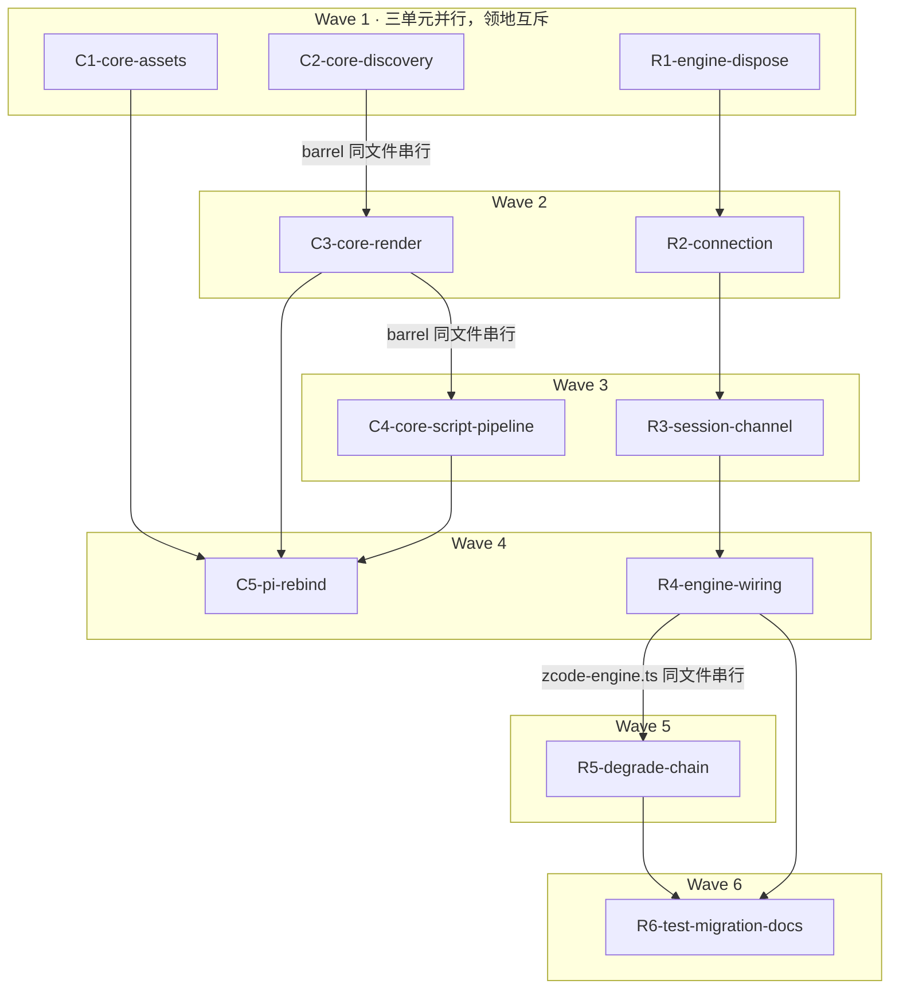

# subagent-core 双线实施计划（convergence C1-C5 + app-server 常驻化 R1-R6）

基线: fef05eb41（convergence 设计）| 日期: 2026-08-30
来源设计：① [subagent-core-convergence.md](subagent-core-convergence.md)（xyz 侧收口，两轮对抗审查 0 MF 终态）② [zcode-engine-appserver-resident.md](zcode-engine-appserver-resident.md)（zcode engine app-server 常驻化，三轮审查收敛「设计就绪」，审查轨迹见其文档头部）

**范围声明**：本计划覆盖 xyz-agent 仓两条正交线的全部 11 个单元——C 线（convergence 收口，C1-C5，原 W1-W5）与 R 线（app-server 常驻化，R1-R6，设计文档原 W1-W6）。两线在 core 仓内领地互斥（C 线 `src/shared|orchestration|agents/` + barrel；R 线 `src/execution/**`，barrel 为 type re-export 不需改），按波次并行推进。zsw 侧 W6-W9（convergence）由另一会话执行；R 线不涉及 zsw 仓改动（G4 宿主零改动）。

**单元编号映射**：C1-C5 = convergence 设计 §5.1 的 W1-W5；R1-R6 = app-server 设计 §5 的 W1-W6。验收场景编号：CA2/CA3-pi/CA9 = convergence 设计 §4.1（上游 A2/A3-pi/A9）；RA1-RA9 = app-server 设计 §4。

**版本决策（用户 2026-08-30「一起开发」指令，取代 app-server 设计 §5 的「先行/顺延」建议）**：两线合并落 **core 0.4.0 单一 minor**（capabilities 声明变化 + 资产/导出/参数化新增均为 minor 级）。收尾时创建单一 changeset，正文合并描述两线内容——不创建两个 minor changeset（会叠加成两个版本）。

## 0 章节映射

| 内容 | convergence 设计实际位置 | app-server 设计实际位置 |
|------|------------------------|------------------------|
| 背景/目标 | §1（1.3 G1-G6；1.4 In/Out scope） | §1（G1-G5 表；in/out scope 段） |
| 终态/机制 | §3（3.1 终态；3.2 D-1~D-6；3.3 红线 9 条；3.4 探针）+ §2.4 数据流 | §3（3.1 终态；3.2 方案 A/B/C；3.3 D1-D10 + 错误规格表 + 3.4 不变量 1-4）+ §2.4 数据流 |
| 验收场景表 | §4.1（CA2/CA3-pi/CA9）+ §4.2 单元门 + §4.3 完成定义 | §4（RA1-RA9，标注必过门/回归门/合入门） |
| 下一层拆分 | §5.1（W1-W5 即 C1-C5）+ 过渡态声明 | §5（W1-W6 即 R1-R6）+ 文档同步清单 |
| 待验证检查点 | §5.4（project 槽 API 形态 / dev 拓扑扫描确认） | §5 末（5 项：--surface/--stdio 矩阵 / stream.chunk 文本字段 / -32022 错误码 / read tokens 结构 / GUI ①级锚定） |

**施工红线（C 线，设计 §3.3 九条，每个 C 单元 task 原样携带）**：遮蔽序不可写反 / 注入序本体胜 / 单层扫描维持 / 修对 async 生产面 / 渲染守卫（除 id/name 外全字段 optional）/ 去 tools 化进 CHANGELOG / 内置条目无截断豁免 / CA2 豁免收窄 / 新增导出必须进 barrel。

**R 线实施不变量（设计 §3.4 四条 + 关键决策约束，每个 R 单元 task 携带相关项）**：① C3 事件不变量全量沿用 ② run resolve 先于 journal close ③ onPoolResolved 先于首事件 + onHandleReady 回填（RunContext 新增可选回调）④ dispose 幂等；D6 常驻进程不进 spawnedChildren Map、onChildSpawned 不逐任务注册；D7 poolDir==HOME==db 锚定不变量、pid 归属两文件分离、心跳 mtime 不参与活持有否决；D9 反向请求必须应答。

## 1 目标快照

**C 线**（逐字摘录 convergence §1.3/§1.4）：G1 资产同源（10 内置 agent 模板一处维护随 core 分发）；G2 契约统一（agent=.md 绝对路径；workflow=内置名或 .js 绝对路径，本仓 pi 半边）；G3 注入对齐（三段 XML 渲染进 core）；G4 创作闭环（generate→lint→save→delete core 化，目录宿主注入）；G5 双实现收敛（agent 发现只剩 core 一套）；G6 维护成本（改 core 一处两插件获得）。Out：zsw 侧施工、引擎行为变更、平台差异强行对齐、fork/conversation/idleTimeout 移植、app-server 常驻化（**由 R 线承接，见下**）。

**R 线**（摘录 app-server §1）：G1 长驻零冷启动（第 2+ 任务无 ~1.5s 进程启动段）；G2 实时事件流 coarse→stream（journal 运行中携带 ①②级读取钥匙；GUI 逐字推送属 relay 通道不在本线）；G3 per-session model（同进程任务 A/B 各用各的模型）；G4 宿主零改动（pi 壳与 zsw 壳不改一行）；G5 漂移防御内化（probe + capabilities + conformance）。Out：steer、conversation 热会话/恢复序、pi 引擎、GUI relay 通道、宿主改动。

**共同 Out**：不 push、不合并 main、不发版（一切推送类操作需用户授权）。

## 2 单元列表

### C 线（convergence）

| Unit | 职责 | 领地（精确路径） | 依赖 | 隔离 | 验收条款 |
|-----|------|-----------------|------|------|---------|
| C1-core-assets | 10 .md 迁 core + 去 tools 化 + 双 package.json 清理 + core workflows/README 漂移修 | `packages/subagent-core/agents/`（新）；`packages/subagent-core/package.json`；`packages/subagent-core/workflows/README.md`；`extensions/universal/subagent-workflow/agents/`（删）；`extensions/universal/subagent-workflow/package.json` | — | plain | ① core agents/ 10 .md 无 `tools:` frontmatter、body 无平台工具名（grep 全 0）② pi-sw agents/ 不存在 ③ 两 package.json 无残留引用、core files 含 agents/ ④ core `pnpm vitest run` + `pnpm typecheck` 绿 ⑤ workflows/README.md:67 改路径唯一口径 |
| C2-core-discovery | async 链 realpath 去重 + project host 槽 + hostRoots 同标签多根（Map→列表+硬编码槽合并，原根后置）+ 漂移注释修 + barrel 发现面 | `packages/subagent-core/src/shared/resource-discovery.ts`；`packages/subagent-core/src/index.ts`；`packages/subagent-core/src/shared/__tests__/` | — | plain | ① vitest 绿（多链同文件去重 / 同标签多根 / 同 stem 撞名本体胜 / 子目录·node_modules 三维度）② pi 单条目形态改前后 `discoverResources` 输出逐项一致（对照探针跑 pi 真实 agentDir，证据落 `docs/design/subagent-core-convergence.probe-c2.md`）③ scanDirectorySync L671 注释修 ④ barrel 逐名探针 ⑤ hostRoots 端口签名不变 |
| C3-core-render | 三 format 函数 + Entry 下沉；ModelEntry 并集（provider? 本仓补充）+ 守卫；分段预算；sortByCodepoint；guide 参数化；xml-injection 出 barrel | `packages/subagent-core/src/shared/`（新渲染模块）；`packages/subagent-core/src/index.ts`；`packages/subagent-core/src/shared/__tests__/` | C2（barrel 串行） | plain | ① 单测：undefined input/contextWindow 守卫、provider 存在 `provider/id` 拼接+(provider,id) 排序、缺席/空串裸 id+id 码点序、码点序+截尾、预算边界 15/10、guide 宿主注入 ② barrel 逐名探针 ③ 渲染源码无内嵌平台文案 |
| C4-core-script-pipeline | getTmpDir/getSavedDir 参数化；generate 校验管线（ESM/meta/agent()/语法/round-trip）+ tmp 写盘下沉；save/delete/generate 出 barrel | `packages/subagent-core/src/orchestration/workflow-files.ts`；`packages/subagent-core/src/orchestration/`（新管线模块）；`packages/subagent-core/src/index.ts`；`packages/subagent-core/src/orchestration/__tests__/` | C3（barrel 串行） | plain | ① 单测：ESM 拒（含行列）/无 meta 拒/无 agent() 拒/合法落 tmp ② 目录参数注入生效（源码无 `.pi` 硬编码 grep）③ barrel 逐名探针 |
| C5-pi-rebind | pi-sw 七项改接：① injector 调 core format（pi 版 guide）② workflow-script 调 core 管线 ③ run 放开内置名 ④ 依赖下限 ⑤ CHANGELOG ⑥ core 包根接线（不命中走 hostRoots 降级）⑦ import 统一 barrel | `extensions/universal/subagent-workflow/src/injectors/`（3 文件）；`src/interface/tool-workflow.ts`；`src/interface/tool-workflow-script.ts`；`package.json`；`CHANGELOG.md`；`README.md` | C1、C3、C4 | plain | ① pi-sw vitest 全绿 ② 注入快照除 10 内置角色 location 前缀外逐字节等价 ③ run 内置名可跑 ⑥④ core 包根接线实测（convergence §5.4 检查点 2）⑦ grep 无 `subagent-core/shared/` 深路径 import ⑧ CHANGELOG 含 tools 行为变化+逃生门；README 角色数 10 |

### R 线（app-server 常驻化）

| Unit | 职责 | 领地（精确路径） | 依赖 | 隔离 | 验收条款 |
|-----|------|-----------------|------|------|---------|
| R1-engine-dispose | 停机面：EnginePort 可选 `dispose?()` + registry 重注册先 dispose + `killAllSpawnedChildren` 编排扩容（先 registry dispose 同步面、后 per-record children）+ onChildSpawned 契约文案 | `packages/subagent-core/src/execution/engine/port.ts`；`registry.ts`；`packages/subagent-core/src/execution/session-runner.ts`；相关 `__tests__` | — | plain | ① 单测：dispose 幂等、重注册同名先 dispose 旧实例、killAllSpawnedChildren 编排序（dispose 先于 children 遍历）② 宿主调用点零改动（session-runner 导出签名不变）③ port.ts 头注登记两处字段级扩展（dispose + 后续 R4 的 onHandleReady 可同注）④ pi 壳现役 dispose 行为不回归（session_shutdown 链单测绿） |
| R2-connection | 连接层 AppServerConnection：NDJSON 四帧型分发、请求 id 关联、反向请求常量表应答（D9）+未知回空 result、崩溃 onClose、惰性启动/重建、stderr tee 落盘 | `packages/subagent-core/src/execution/engine/engines/zcode/connection.ts`（新）；`engines/zcode/__tests__/`（新 fixture：fake-server 从 zsw 仓移植改造） | R1 | plain | ① 单测（fake server）：四帧型分发、请求-应答 id 关联、反向请求 `session/requestRuntimePreferences` 常量应答 + 未知回 `{id, result:{}}`、onClose 触发全部在途 reject、惰性启动与进程死后重建 ② stderr tee 落盘断言 ③ 协议断言逐字对齐设计附录 A.1（无 jsonrpc 字段、strict 拒未知键） |
| R3-session-channel | 会话层：create/subscribe/send/终态判定（turn.terminal 权威+宽松匹配防洪堤）/read 四层兜底/close；golden 帧序列语料替换 | `packages/subagent-core/src/execution/engine/engines/zcode/session-channel.ts`（新）；`golden-sample.ts`（语料替换）；`engines/zcode/__tests__/` | R2 | plain | ① 单测：A.2 帧序列逐字断言（create 参数 strict 对象/subscribe deliveryKind 必填/send content 字段/收尾帧 usage→message_end.usage）、终态判定（turn.terminal 权威 + 缺失时宽松匹配兜底）、read 四层兜底、close ② golden 双副本 diff 机制保留且新语料四类样本（create 应答/推送流/终态帧/read 应答）③ `-32602` strict 拒收注入用例（RA5-① 回归门的地基） |
| R4-engine-wiring | 引擎接线：launcher 双模式分派、run 重写（事件时序前移）、abort 链 D3（stop→grace→killChain）、capabilities D5（仅 eventGranularity→stream）、per-session model 透传、poolKey='home-appserver' 锚定+journal 同池+凭据刷新（内容 hash）+目录锁/派生（D7 全量语义）+pidfile 孤儿自愈（D6③ 三重判据）、RunContext 可选 `onHandleReady` + 编排层回填 record.engineHandle 落 entry | `engines/zcode/launcher.ts`、`zcode-engine.ts`、`preparer.ts`、`constants.ts`、`registration.ts`、`parser.ts`（退场或收敛）；`engine/port.ts`（RunContext 增可选回调）；`execution/subagent-service.ts`、`record-store.ts`（回填接线）；persona-router 调用点（zcode 目录内）；相关 `__tests__` | R1、R2、R3 | plain | ① 单测：锚定不变量 poolDir==HOME==db（poolKey 静态常量 + 派生目录记实际名）、目录锁（O_EXCL/pid 活即持有/双接管者竞争闭环/心跳不参与否决）、凭据刷新（hash 不一致→重写+重建连接）、abort 序（stop→grace→kill）、capabilities 仅 eventGranularity 变 ② onHandleReady 回填：create 应答后经回调→record.engineHandle→entry 落盘链单测（record-store 上报通道）③ `eventGranularity` 生产零消费方断言维持（翻转无下游破坏）④ spawn 降级路径行为不回归（D2 兜底与常驻并存） |
| R5-degrade-chain | 降级链：probe 冒烟改写（独立连接 create→close→shutdown、10s、不发模型请求、结论记 CLI mtime）、首败失效降级（-32601/-32602→spawn 重跑一次+后续直走+record 标注 degraded）、`XYZ_ZCODE_MODE=appserver|spawn` 定向（定向时不探不降） | `engines/zcode/zcode-engine.ts`、`probe 相关文件`（zcode 目录内）；相关 `__tests__` | R4（zcode-engine.ts 同文件串行） | plain | ① 单测 RA5-① 回归门：fixture 注入 `-32602` → 降级 spawn 重跑成功 + record 标注 + 后续直走 spawn ② probe 冒烟：fake server 上 create/close/shutdown 序 + 10s 预算 + mtime 记录与重探触发 ③ env 定向三态（缺省探+降/appserver 不探/spawn 不探不降）④ 错误分类表（设计 §3.3 错误规格 8 行）单测覆盖 |
| R6-test-migration-docs | zcode 单测族迁移（~40+ 用例）+ conformance C3/C4 口径适配 + golden 双副本 + live gate 4 用例改写 + 文档同步 | `src/execution/engine/__tests__/conformance/`（8 文件）；`engines/zcode/__tests__/`；`docs/architecture/subagent-engine-abstraction.md`；`docs/design/subagent-core-package-extraction.md`；`.xyz-harness/subagent-engine-abstraction/decisions.md` | R4、R5 | plain | ① core `pnpm vitest run` 全量绿（迁移后零跳过零删用例——只迁移不瘦身）② conformance C3（stream 粒度：text_delta 拼接==read 全文等）C4（kill-only 维持）口径适配后全绿 ③ live gate 4 用例改写后 CI 形态正确（live 环境跑属 RA8 跨仓段）④ 文档 3 处 diff 签收（D-010 追加 revisit 行不改写原文）⑤ zsw 仓决策记录状态更新 = 跨仓项，登记移交不阻塞 |

## 3 DAG 图

**并行安全依据**：两线领地在 core 仓内零文件交集（C 线 `shared|orchestration|agents|index.ts` + pi-sw；R 线 `execution/**` 且不动 barrel——EnginePort/RunContext 是 type re-export，加可选成员不需改 index.ts）。若 R 线实施中发现必须动 barrel → 写进 blockers 上报，与 C 线 barrel 串行重排（C2→C3→C4 链上插入）。

**波间推进**：整波 committed 才开下一波。C 线过渡态声明（convergence §5.1）：C1 完成到 C5⑥ 接线完成之间 pi 侧 10 内置角色消失——本分支不发布无外部影响。

## 4 测试策略

| 面 | 增量（单元开发期） | 阶段门 | 全量（Gate A，收尾） |
|----|--------------------|--------|---------------------|
| core | `cd packages/subagent-core && pnpm vitest run <相关文件>` + `pnpm typecheck` | 波次汇合点（无在途单元时）跑 core `pnpm vitest run` 全量 | core vitest 全量 + typecheck + `pnpm build:bundle`（含新导出面与 agents 资产） |
| pi-sw（C 线） | `cd extensions/universal/subagent-workflow && pnpm vitest run <相关>` | C5 后全量 | pi-sw vitest 全量 |
| 仓级 | — | — | `pnpm extensions:typecheck && pnpm extensions:lint && pnpm extensions:test` |
| 真机 Gate B | — | — | 见下 |

**并行条款**：双线并行期间单元验收只认增量测试；core 全量 vitest 只在波次汇合点（上一波全部 committed、下一波未派发）跑——防另一线在途测试挂住本线全量。

**Gate B 验收分段**（真机，真实依赖非 mock）：
- **本仓可执行段**（本计划负责跑完）：CA2（pi dev 快照对比 + 内置名 run + npm pack 升级模拟，含 W5 前基线快照前置）、CA3-pi（契约正反例）、CA9（orchestrator 真实派发 + argv 探针）；RA2-②（xyz-agent dev 起 zcode subagent，运行中开详情页 + 中途重开 session）、RA5-①（回归门单测）、RA7-③（pi 壳 session 关闭无泄漏）、RA8 本仓段（core conformance/单测族全绿）。
- **跨仓协调段**（依赖 zsw 仓 vendored 刷新 `vendor --local`，本仓完成后由 zsw 会话/用户执行，本计划登记移交）：RA1/RA2-①/RA3/RA4/RA6/RA7-①②（zsw 真机）、RA5-②③（真机首败降级 + mtime 重探）、RA8 live gate、RA9（zsw 自有源码 diff 为空验证）。

## 5 合理偏差登记表

| # | 单元 | 偏差 | 分类与依据 |
|---|------|------|-----------|
| 1 | C1 | grep 词表扩展 structured-output；保留 read/write/edit/bash/grep 通用职责词；README 68 行 fixAgent 同性质漂移连带修 | 合理——通用词跨平台非平台绑定；同性质漂移一次修净防 67/68 行自相矛盾 |
| 2 | C2 | 漂移注释修扩展至 sync 链全部同类 docstring；realpath 归一优先于 stem 覆盖的极端构造取舍 | 合理——模块内文档一致性；语义取舍已测试锁定 |
| 3 | C3 | sortByCodepoint 非变异化；opts 对象参数形态；barrel 追加 summarizeDescription + opts 类型；contextWindow 0 视为有效 | 合理——core 纯函数定位；红线 9 深路径不可达 |
| 4 | C4 | save/delete 第三可选参数向后兼容；core 管线返回结构化结果非 throw；缺省常量出 barrel | 合理——pi 现调用形态零改动；isError 转换归宿主契约层 |
| 5 | R1 | registry 新增 disposeEngines() 导出（设计说「killAllSpawnedChildren 先遍历 registry」的实现载体）；registry 引入 logger | 合理——语义等价封装，同步面语义按 D6① 预留 |
| 6 | R2 | fixture 用 .mjs（本仓 eslint no-require-imports 拦 require）；buildAppServerEnv 组装器独立于 launcher | 合理——环境约束等价实现 |
| 7 | R3 | golden「替换」实施为「并存」（stdout 语料保留）——spawn 语料消费方在 R4（probe 干跑）/R6（conformance）领地，且 D2 保留 spawn 降级路径；去留 R6 统一定。golden 帧序列为合成语料（A.2 权威+旧实现形态），真机实录待跨仓段替换。session-channel 连接崩溃收割依赖 turnTimeoutMs 兜底（connection 无 onClose 面，R4 补） | 合理——领地纪律优先；来源如实标注 |

## 6 状态表

| Unit | 状态 | 轮次 | 证据指针 |
|------|------|------|---------|
| C1-core-assets | committed | 1 | 86b700f67（vitest 2363 绿；grep tools 全 0；README 67/68 行连带修——同性质漂移合理偏差） |
| C2-core-discovery | committed | 1 | 5b03be26d（新增 15 用例 + pi 单条目形态快照；真机探针 IDENTICAL 落 [probe-c2.md](subagent-core-convergence.probe-c2.md)；检查点 1 定案 project-host 槽） |
| C3-core-render | committed | 1 | 19c059bf6（33 用例全条目覆盖；barrel 追加 summarizeDescription + opts 类型为合理扩面；guide 必填注入 + 无内嵌文案 grep 证实） |
| C4-core-script-pipeline | committed | 1 | ec1dcdf9a（24 用例；save/delete 第三可选参数向后兼容；结构化返回 {ok}|{error}，isError 转换留宿主 C5） |
| C5-pi-rebind | committed | 1 | a26b9a80c（pi-sw 918 绿；guide 新文案依据 systemPrompt 参数已移除的实测；probe-c5 五场景落证；⑦收口面达成，深路径归零转 C5b） |
| C5b-barrel-aux | pending | 0 | —（C5 blocker 转化：core barrel 补 findWorkspaceRoot/getCachedParsed/getCachedFileContent/parseResourceMeta 4 导出，pi-sw injector 深路径归零） |
| R1-engine-dispose | committed | 1 | b0519eccd（24 新用例；registry disposeEngines() 导出为等价封装偏差） |
| R2-connection | committed | 1 | db721187d（21 fake-server 用例；fixture 用 .mjs 避 eslint require 拦截；buildAppServerEnv 组装器供 R4 复用） |
| R3-session-channel | committed | 1 | 44e2120f3（31 用例；golden 并存偏差见 §5；runTurn resolve 形态与 onClose 面缺口已交接 R4） |
| R4-engine-wiring | committed | 2 | a1370623c（前任 5h 限额中断于 import 面，接替续作；2519 绿；conformance contract.abort 钉 spawn 模式单点突破待 R6 知会） |
| R5-degrade-chain | pending | 0 | — |
| R6-test-migration-docs | pending | 0 | — |

## 7 残留风险与变更历史

### 残留风险

1. **分支认知外提交**：基线 `88d7eadc6` 后其他任务线提交持续增长（2026-08-30 核实 26 个），与两线领地交集为 0。每波派发前复核 `git log --name-only` 与 `git status`；工作区现存认知外变更（`apps/electron/package.json`、暂无其他）不碰不裹挟。
2. **版本合并决策**：两线共用 core 0.4.0 单 minor（用户「一起开发」指令取代 app-server 设计 §5 先行/顺延建议）；收尾创建单一 changeset。若 core 0.3.0（host-surface changeset 已备）届时仍未发布，与用户确认是否合并 minor。
3. **R 线实施期检查点**（app-server 设计 §5 末 5 项）：--surface/--stdio 矩阵（D10 留白，R4 实施期定案）、stream.chunk 文本字段、-32022 错误码、read tokens 结构、GUI ①级锚定——结论回填设计文档检查点段并登记偏差表。
4. **C 线实施期检查点**（convergence §5.4 前两项）：project 槽 API 形态（C2）、dev 拓扑扫描确认（C5⑥）——probe 文档落证。
5. **跨仓验收依赖**：Gate B 跨仓段依赖 zsw 会话 vendor --local 刷新；RA9 与 zsw W6-W9（convergence zsw 侧）共享该前置。本仓完成定义 = 本仓可执行段全绿 + committed + 报告用户，跨仓段移交。
6. **R2 fixture 移植来源**：fake-server 60+ 用例从 zsw 仓 `84b63a0^:lib/runner-appserver.js` 时代实现移植改造——只取测试模式与协议断言，代码逐字复制需适配 core 测试框架（vitest），防止盲目平移。
7. **发版与 push 授权边界**：一切 push / 合并 main / npm publish 需用户另行授权。

### 变更历史

- 2026-08-30：计划创建（convergence 单线 W1-W5，基线 commit e0c73266c）。
- 2026-08-30：**扩充为双线版**——用户指令「app-server 常驻化一起开发」，并入 R 线 R1-R6（单元重命名避撞名：convergence W1-W5 → C1-C5；app-server W1-W6 → R1-R6；验收场景加 CA/RA 前缀）；版本合并为单一 core 0.4.0；Gate B 切分本仓段/跨仓段；DAG 重排 6 波。convergence 单元验收条款不变（沿用本计划前一版）。
