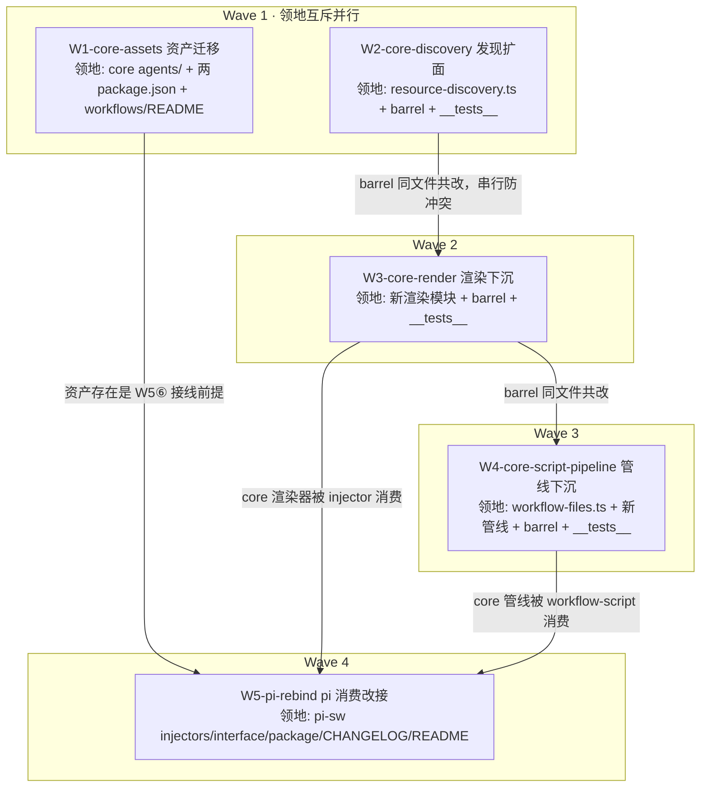

# subagent-core-convergence 实施计划（xyz-agent 侧 W1-W5）

基线: fef05eb41 | 来源设计: [subagent-core-convergence.md](subagent-core-convergence.md) | 日期: 2026-08-30

**范围声明**：本计划只覆盖 xyz-agent 仓的 W1-W5（core 扩面 + pi-sw 改接）。zsw 侧 W6-W9 由另一会话在 zcode-plugin-workspace 仓执行，其 W6a 开工前置 = 本计划 §4.3 完成定义全部满足。两仓一体的完整拆分见上游 `zcode-plugin-workspace/feat-app-server-refactor/docs/design/subagent-core-convergence.impl-plan.md`。

**审查通过证据**：[subagent-core-convergence.review.md](subagent-core-convergence.review.md)——两轮对抗审查收敛（R1 4MF/4S/1DE 全修 → R2 0MF + 3S/1DE 当轮修完），终态 0 must-fix / 0 遗留。

## 0 章节映射

| 内容 | 设计文档实际位置 |
|------|------------------|
| 背景/目标 | §1 背景目标（1.3 设计目标 G1-G6；1.4 In/Out scope） |
| 终态/机制 | §3 解决方案（3.1 终态；3.2 决策落位 D-1~D-6；3.3 设计红线 9 条；3.4 运行时断言与探针）+ §2.4 物理数据流 |
| 验收场景表 | §4.1 真实场景验收（A2 / A3-pi / A9）+ §4.2 单元级测试门 + §4.3 完成定义 |
| 下一层拆分 | §5.1 实施单元 W1-W5 + 依赖序 + 过渡态声明 |
| 待验证检查点 | §5.4（本仓相关 2 项：project 槽 API 形态、dev 拓扑扫描确认；第 3 项预算值实测归 zsw 侧 W7） |

## 1 目标快照（逐字摘录自设计 §1.3 / §1.4）

**设计目标**：
- **G1 资产同源**：内置 agent 模板与内置 workflow 一样，一处维护（core 包），随 core 包分发，两插件同版本消费。
- **G2 契约统一**：agent 参数 = .md 绝对路径；workflow 引用 = 内置名或 .js 绝对路径（含 `~/` 前缀展开）。本仓负责 pi 半边（workflow run 放开内置名）。
- **G3 注入对齐**：三段 XML（subagents/workflows/models）渲染函数进 core，字段口径统一（location / contextWindow / 能力标记）。
- **G4 创作闭环**：generate→lint→save→delete 管线 core 化，落盘目录按宿主注入。
- **G5 双实现收敛**：agent 发现只剩 core 一套（本仓补 core 缺口，zsw 侧退役自写 resolver）。
- **G6 维护成本**：新增角色/调整注入格式只改 core 一处 + 发版。

**Out of scope**（摘录）：zsw 侧施工（W6-W9）；core 引擎/编排内核行为变更；平台固有差异强行对齐（triggerTurn vs mailbox、每 turn vs 一次性注入）；pi-sw 的 fork/conversation/idleTimeout 等会话级参数向 zsw 移植；app-server 常驻化（`docs/design/zcode-engine-appserver-resident.md`，正交）。**不 push、不合并 main、不发版**。

**施工红线 9 条**：设计 §3.3（遮蔽序不可写反 / 注入序语义·本体胜 / 单层扫描维持 / 修对 async 生产面 / 渲染守卫显式工作项 + 除 id/name 外全字段 optional / 去 tools 化进 CHANGELOG / 内置条目无截断豁免 / A2 豁免收窄 / 新增导出必须进 barrel）——每个单元 task 必须原样携带。

## 2 单元列表

| Unit | 职责 | 领地（精确文件路径） | 依赖 | 隔离 | 验收条款 |
|-----|------|---------------------|------|------|---------|
| W1-core-assets | 10 个 .md 迁入 core + D-5 去 tools 化 + 双 package.json 清理 + core workflows/README 漂移修 | `packages/subagent-core/agents/`（新，10 个 .md）；`packages/subagent-core/package.json`（files+agents/）；`packages/subagent-core/workflows/README.md`；`extensions/universal/subagent-workflow/agents/`（整目录删）；`extensions/universal/subagent-workflow/package.json`（pi.agents + files 清理） | — | plain | ① core `agents/` 10 个 .md，frontmatter 无 `tools` 字段、body 无平台工具名硬编码（grep `-c "^tools:" packages/subagent-core/agents/*.md` 全 0；「你只有以下」类文案清除）② pi-sw `agents/` 目录不存在 ③ 两 package.json 无 `agents` 残留引用（pi.agents 字段删除、files 白名单条目删除、core files 含 `agents/`）④ core `pnpm vitest run` + `pnpm typecheck` 绿 ⑤ `workflows/README.md:67`「AgentRegistry 名」漂移表述已改为路径唯一口径 |
| W2-core-discovery | async 发现链 realpath 去重 + project host 槽 + hostRoots 同标签多根（Map→列表 + 硬编码槽合并，原根后置）+ 漂移注释修 + barrel 发现面导出 | `packages/subagent-core/src/shared/resource-discovery.ts`；`packages/subagent-core/src/index.ts`；`packages/subagent-core/src/__tests__/`（新增/改） | — | plain | ① core vitest 绿，新增用例覆盖：多链同文件去重（两个不同名 symlink 指同一 .md → 清单 1 条）、同标签多根注入（两条目都扫描非后者覆盖）、同 stem 撞名本体胜（原根后置 → last-writer-wins 落本体）、子目录不扫/node_modules 不灌三维度对照 ② pi 单条目形态改前后 `discoverResources` 输出逐项一致（对照探针跑 pi 真实 agentDir，含每条 source 标签与胜出路径，证据落盘 `docs/design/subagent-core-convergence.probe-w2.md`）③ `scanDirectorySync` L671 漂移注释已修（措辞精确到消费关系）④ barrel 新增 `discoverResources` + 相关类型导出（node require 逐名探针）⑤ hostRoots 端口形态不变（宿主提供根数组签名不动） |
| W3-core-render | 三 format 函数 + Entry 接口下沉 core；ModelEntry 并集（含 provider? 本仓补充）+ 守卫；分段条目预算参数；sortByCodepoint；guide 参数化；xml-injection 出 barrel | `packages/subagent-core/src/shared/`（新渲染模块，命名执行期定）；`packages/subagent-core/src/index.ts`；`packages/subagent-core/src/__tests__/` | W2（barrel 同文件串行） | plain | ① 渲染单测绿：undefined input/contextWindow 不抛不渲垃圾、provider 存在时 `<id>` 输出 `provider/id` 拼接 + (provider, id) 两段排序、provider 缺席/空串时裸 id + id 码点序、码点序 + 截尾、预算边界（15/10）、guide 由宿主注入 ② barrel 导出探针（node require 逐名检查 format 三函数 + xml-injection 两函数 + Entry 类型）③ 渲染函数源码无内嵌平台文案（grep 无 "systemPrompt alongside"） |
| W4-core-script-pipeline | getTmpDir/getSavedDir 参数化；generate 校验管线（ESM/meta/agent()/语法/round-trip）+ tmp 写盘下沉；save/delete/generate 出 barrel | `packages/subagent-core/src/orchestration/workflow-files.ts`；`packages/subagent-core/src/orchestration/`（新管线模块）；`packages/subagent-core/src/index.ts`；`packages/subagent-core/src/__tests__/` | W3（barrel 同文件串行） | plain | ① 管线单测绿：ESM 样本拒（报错含行列）、无 meta 拒、无 agent() 拒、合法样本落 tmp ② 参数化目录注入生效（tmp/saved 目录由参数注入，源码无 `.pi` 硬编码——grep 验证）③ barrel 探针（saveWorkflow/deleteWorkflow/generate 管线入口逐名 require） |
| W5-pi-rebind | pi-sw 改消费 core 新面，七项：① injector 调 core format（guide 传 pi 版新文案）② workflow-script 调 core 管线 ③ run 放开内置名 ④ 依赖下限（发布面 ≥0.4.0）⑤ CHANGELOG（tools 行为变化 + project 级逃生门）⑥ core 包 agents/ 进 pi 发现面接线（约定扫描命中实测，不命中 hostRoots 注入 core 包根降级并记录）⑦ 发现/渲染 import 统一改 barrel | `extensions/universal/subagent-workflow/src/injectors/`（3 文件）；`extensions/universal/subagent-workflow/src/interface/tool-workflow.ts`；`extensions/universal/subagent-workflow/src/interface/tool-workflow-script.ts`；`extensions/universal/subagent-workflow/package.json`；`extensions/universal/subagent-workflow/CHANGELOG.md`；`extensions/universal/subagent-workflow/README.md` | W1（资产）、W3（渲染）、W4（管线） | plain | ① pi-sw vitest 全绿 ② 注入快照：除 10 内置角色 location 前缀外逐字节等价（用户/项目资源 location 不豁免，红线 8）③ workflow run 传内置名可跑（单测 + 手测）④ core 包根接线实测（§5.4 检查点 2：约定扫描不命中则走 hostRoots 注入降级，路径与证据记录进 probe 文档）⑤ grep 断言 pi-sw src 内无 `@zhushanwen/subagent-core/shared/` 深路径 import ⑥ 发布面依赖下限落地方式记录（workspace:* 保留，changeset 发布替换策略核对结论写入 CHANGELOG 或 probe 文档）⑦ CHANGELOG 含 tools 行为变化 + project 级覆写逃生门；README 角色数 10 修正 |

## 3 DAG 图

串行链说明：W2→W3→W4 仅为 `src/index.ts`（barrel）同文件共改的保守串行（产物互不依赖）；W1 与 W2 领地互斥真并行；W5 汇聚 W1/W3/W4 三前驱。**过渡态声明**（设计 §5.1）：W1 完成到 W5⑥ 接线完成之间 pi 侧 10 内置角色消失——本分支不发布无外部影响。

## 4 测试策略

| 包 | 增量（单元开发期） | 全量（阶段门/收尾） |
|----|--------------------|---------------------|
| core | `cd packages/subagent-core && pnpm vitest run <相关测试文件>` + `pnpm typecheck` | `pnpm vitest run` + `pnpm typecheck` + `pnpm build:bundle`（W5 完成后验证自包含 bundle 含新面） |
| pi-sw | `cd extensions/universal/subagent-workflow && pnpm vitest run <相关>` | `pnpm vitest run` |
| 仓级收尾 | — | `pnpm extensions:typecheck && pnpm extensions:lint && pnpm extensions:test`（AGENTS.md 三连） |
| Gate B 真机 | — | 设计 §4.1 三场景：A2（快照对比 + 内置名 run + npm pack 升级模拟）/ A3-pi（契约正反例）/ A9（orchestrator 真实派发 + argv 探针） |

## 5 合理偏差登记表

（初始为空；执行期按 dev-flow 偏差三分类登记）

## 6 状态表

| Unit | 状态 | 轮次 | 证据指针 |
|------|------|------|---------|
| W1-core-assets | pending | 0 | — |
| W2-core-discovery | pending | 0 | — |
| W3-core-render | pending | 0 | — |
| W4-core-script-pipeline | pending | 0 | — |
| W5-pi-rebind | pending | 0 | — |

## 7 残留风险与变更历史

### 残留风险

1. **分支认知外提交**：基线 `88d7eadc6` 后其他任务线提交持续增长（2026-08-30 核实 26 个），与 W1-W5 领地交集为 0。每波派发前主 agent 复核 `git log --oneline 88d7eadc6..HEAD --name-only` 与 `git status`，领地内出现认知外变更即停。工作区现存认知外变更（`apps/electron/package.json` 修改、`docs/design/zcode-engine-appserver-resident.md` untracked）不碰、不裹挟。
2. **core 0.3.0 发版节奏**：0.3.0（host-surface，changeset 已存在）用户侧待发；本计划全部落 0.4.0（新增 minor changeset，W5 时创建）。若 0.3.0 未发而本线先合，changeset 合并为一个 minor（执行期与用户确认）。
3. **§5.4 检查点实施期落证**：project 槽 API 形态（W2 定，倾向显式 `project-host` 槽）；dev 拓扑扫描确认（W5⑥ 实测）。结论回填 probe 文档并同步设计文档 §5.4。
4. **zsw 侧依赖**：W6a 开工前置 = §4.3 完成定义（含 Gate B 三场景）全部满足 + 用户向 zsw 会话放行信号。W5 完成 ≠ 立即通知 zsw，需走完验收。
5. **发版与 push 授权边界**：一切 push / 合并 main / npm publish 需用户另行授权；本计划终态 = 本仓 committed + 双级验收绿。

### 变更历史

- 2026-08-30：计划创建（dev-flow 阶段 1；单元切分与验收条款合成自设计文档 §5.1/§4.2 与上游两仓 impl-plan §2 的 W1-W5 行）。
