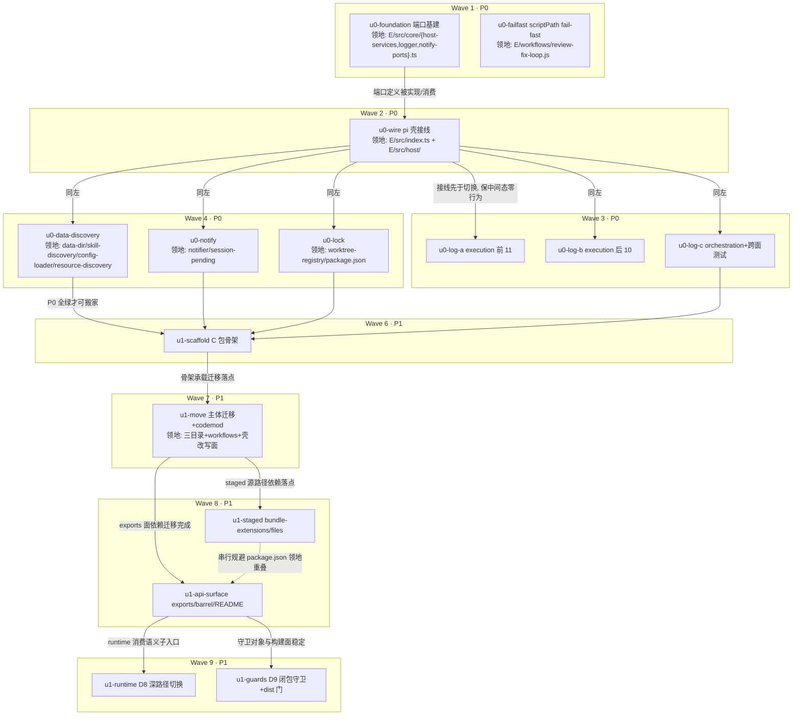

# subagent-core 包抽离 实施计划

基线: 313c08d57 | 来源设计: [docs/design/subagent-core-package-extraction.md](subagent-core-package-extraction.md)（含 2026-08-29 计划期契约细化） | 日期: 2026-08-29

范围声明：本计划覆盖设计的 **P0 + P1**（本仓内闭环）。P2（zcode 仓迁移）在设计层已定为独立下一层产物（zcode 仓对照实现计划），P3 为后续演进——均不在本计划内。

## 0 章节映射

| 内容 | 设计文档实际位置 |
|------|--------------|
| 背景/目标 | §1 背景目标（SCQA / 设计目标 5 条 / in-out scope） |
| 终态/机制 | §3 解决方案：§3.1 终态、§3.3 D1-D9 关键决策、D6 逐段接管核对、§3.4 错误规格、§3.5 终态数据流 |
| 验收场景表 | §4 验收（V1-V7，含真实流程/通过标准列 + file: 前置门） |
| 下一层拆分 | §5 下一层拆分（P0-P3 阶段表 + 文件改动地图 + 检查点 1-6） |
| 待验证检查点 | §5 末尾「待验证检查点」1-6（本计划处理 1/2/4/5；3/6 属 P2 zcode 侧） |

设计文档为精简五段制（背景 §1 / 现状 §2 / 方案 §3 / 验收 §4 / 拆分 §5）。

## 1 目标快照（逐字摘录）

> **一句话结论**：把 pi-subagent-workflow 中已落地的引擎中立执行层（EnginePort + pi/zcode 双引擎）、workflow 编排层与 workflow 脚本资产（含 review-fix-loop）抽为独立 npm 包 `@zhushanwen/subagent-core`，本仓 pi extension 与 zcode 仓 zsw 插件双宿主引用同一实现，消灭两套平行实现导致的逻辑漂移。

> 设计目标（使用者体验倒推）：1. **修复一次，双宿主生效**；2. **pi 宿主行为零回归**（xyz-agent 用户的 subagent / workflow / GUI 可见性行为与抽包前逐字段一致）；3. **zcode 宿主升级到统一实现的全量能力**；4. **两宿主特有能力不丢失**；5. **公共 API 成为显式契约**。

> **out of scope**：独立 bin CLI；zcode 主会话引擎切换；第三引擎实现；`file:` 入口与材料注入 parity（Phase 3 另行小设计）；zsw daemon 自身架构改造；xyz-agent renderer/GUI 改动（零改动）。

本计划的达成判据（P0+P1 部分）：设计 §5 P0/P1 两行的验收——P0「全量测试绿 + extension 在 pi CLI 实测一例 subagent」；P1 由 V1（本仓可执行部分）/ V6-① / V7 守护。

## 2 单元列表

领地根 `E/` = `extensions/universal/subagent-workflow/`，`R/` = `packages/runtime/`，`C/` = `packages/subagent-core/`（P1 新建）。

### P0（包内 port 化，零行为变化）

| Unit | 职责 | 领地（精确文件路径） | 依赖 | 隔离 | 验收条款 |
|------|------|------|------|------|---------|
| u0-foundation | core 端口基建：`E/src/core/host-services.ts`（HostServices[dataRoot/log/discoveryRoots] + configureCore + DEFAULT_DATA_ROOT + 未配置消费抛 `core_host_not_configured`）、`E/src/core/logger.ts`（facade getLogger——动态解析宿主 log 实现，返回 `{debug,warn,error}` 与 ExtensionLogger 结构兼容）、`E/src/core/notify-ports.ts`（NotifyDomainPorts + configureNotifyDomain + 缺省降级解析器）；`eslint.config.mjs` 增 src/core 的 no-console config 级 override（缺省 sink 即 console 属 D2 设计，按 resource-discovery.ts 先例走配置级豁免，Wave 1 修复轮扩入） | `E/src/core/host-services.ts`、`E/src/core/logger.ts`、`E/src/core/notify-ports.ts`、`E/src/core/__tests__/host-services.test.ts`、`E/src/core/__tests__/logger.test.ts`、`E/src/core/__tests__/notify-ports.test.ts`、`eslint.config.mjs`（override 块）、`.githooks/check_staged_forbidden_lines.py`（规则 A scoped allowlist——pre-commit 首拦发现的第二道守卫，按「规则误报修正规则本体」doctrine 处理，Wave 1 修复轮扩入） | 无 | plain | ① 新单测覆盖：facade 顶层缓存惯例下 configureCore 前后透明切换（模块顶层 `const logger = getLogger(...)` 在 configure 后调用路由到宿主实现）、未 configureCore 消费 dataRoot 抛错含恢复指引文案、NotifyDomainPorts 缺省降级（投递直发 / pending 计零）；② `pnpm extensions:typecheck` 绿；③ `npx eslint E/src/core` 零 error |
| u0-failfast | D1 附带加固：`E/workflows/review-fix-loop.js:137-142` scriptPath 缺席时 `process.cwd()` 静默回退改 fail-fast（报 `core_module_load_failed`，错误文案指出 worker 宿主 scriptPath 注入点）；**同款收口扩展至全部内置 workflow 脚本**（chain.js:40-42 / parallel.js:50-52 / map-reduce.js:71-72 / scatter-gather.js 的 SCRIPT_DIR 回退——Wave 1 验收发现，偏差 #6） | `E/workflows/review-fix-loop.js`、`E/workflows/chain.js`、`E/workflows/parallel.js`、`E/workflows/map-reduce.js`、`E/workflows/scatter-gather.js`、`E/src/orchestration/__tests__/review-fix-loop-scriptpath-failfast.test.ts`（新，含内置四件用例） | 无 | plain | ① 新测试：worker 入口无 scriptPath 注入时以非零退出 / 报错含 `core_module_load_failed`（覆盖全部五脚本）；② 有真实 scriptPath 时 utils 解析正常（回归）；③ 现有 review-fix-loop 相关测试族绿 |
| u0-wire | pi 壳接线：`E/src/host/pi-host.ts` 实现 HostServices（dataRoot=getAgentDir()、log=桥接 pi-extension-logger、discoveryRoots=现 resource-discovery 根推导表带 source 标签）+ NotifyDomainPorts（countActiveFromEntries / createDelivery 直传）；`E/src/index.ts` 扩展初始化最早处调 configureCore + configureNotifyDomain | `E/src/index.ts`、`E/src/host/pi-host.ts`、`E/src/host/__tests__/pi-host.test.ts`（后两全新建） | u0-foundation | plain | ① pi-host 单测：三个端口实现与现行为等价（roots 清单/顺序/source 标签与 resource-discovery.ts:518-529 现推导一致）；② `pnpm extensions:typecheck` 绿；③ 全量测试绿（接线无行为变化——此波端口尚无 core 消费方） |
| u0-log-a | logger 切换批次 A（execution 前 11 文件 + 其测试）：`E/src/core/logger.ts` facade 替换 pi-extension-logger import；对应测试 `vi.mock("@zhushanwen/pi-extension-logger")` 目标同步替换为 facade 模块 | 源：`E/src/execution/{agent-registry,best-effort,channel-registry-access,config,finalize-record,idle-gc}.ts`、`E/src/execution/engine/common/{event-journal,kill-chain,pool-manager}.ts`、`E/src/execution/engine/engines/pi/pi-engine.ts`、`E/src/execution/engine/engines/zcode/zcode-engine.ts`；测试：`E/src/execution/__tests__/{config,finalize-record,gc-timer,channel-registry-handshake}.test.ts`、`E/src/execution/engine/engines/zcode/__tests__/registration.test.ts` | u0-wire | plain | ① 领地内 `grep pi-extension-logger` 零残留；② 受影响测试全绿（mock 断言仍有效）；③ 行为零变化——logger 调用面（方法名/参数序）逐文件等价替换 |
| u0-log-b | logger 切换批次 B（execution 后 10 文件 + 其测试） | 源：`E/src/execution/{notify-ledger,record-store,session-runner,sessions-index,stdin-writer,subagent-service,ui-request-handler-factory,ui-request-observability,ui-request-queue,worktree-manager}.ts`；测试：`E/src/execution/__tests__/{stdin-writer,ui-request-observability,ui-request-handler-factory,notify-ledger,run-and-finalize-chatmode,chatmode-first-round-closure-service,conversation-wiring,parent-child-matrix,one-shot-upgrade,get-record-for-action-restart,spawned-children,run-spawn-stdout-callback-throw,epipe-fallback,subagent-service-message-close,subagent-service-parent-guard}.test.ts` | u0-wire | plain | 同 u0-log-a 三条 |
| u0-log-c | logger 切换批次 C（orchestration 3 文件 + 跨面集成测试） | 源：`E/src/orchestration/{error-recovery,jsonl-run-store,lifecycle}.ts`；测试：`E/src/orchestration/__tests__/{jsonl-run-store-corrupt-entry,jsonl-run-store-retention,jsonl-run-store-session-file,error-recovery-postmessage-defense}.test.ts`、`E/src/__tests__/{ended-message-and-fork-from,transparent-resume,robustness-medium-batch4}.test.ts`（跨 a/b 面集成测试归本单元避免领地交集） | u0-wire | plain | 同 u0-log-a 三条 |
| u0-data-discovery | pi SDK 运行时值触点 ×3 + 根构建注入化：`data-dir.ts` fallback getAgentDir→host.dataRoot()（env 段与 warn-once 留 core）；`skill-discovery.ts` getAgentDir→discoveryRoots().skills（标签条目）；`config-loader.ts` scanConfig.agentDir→discoveryRoots().workflows 注入；`resource-discovery.ts` 根构建段（:518-529）改消费注入 roots（source 标签/顺序逐字保留）；各自 logger 同步切 facade。**收口轮扩入**（验收发现，偏差 #7）：`subagent-list-injector.ts` / `workflow-list-injector.ts` 的 ScanConfig 构造点同步改传 hostRoots（领地外构造面，计划期审计缺口；两文件 getAgentDir 其他用途属壳侧合法保留） | `E/src/execution/engine/common/data-dir.ts`、`E/src/orchestration/skill-discovery.ts`、`E/src/orchestration/config-loader.ts`、`E/src/shared/resource-discovery.ts`、`E/src/injectors/subagent-list-injector.ts`、`E/src/injectors/workflow-list-injector.ts`；测试：`E/src/execution/engine/__tests__/common/data-dir.test.ts`、`E/src/orchestration/__tests__/skill-discovery.test.ts`、`E/src/shared/__tests__/resource-discovery.test.ts`、`E/src/orchestration/__tests__/config-loader*.test.ts`、`E/src/injectors/__tests__/{subagent-list-injector,workflow-list-injector}.test.ts`（以 grep 现存为准） | u0-wire | plain | ① 领地内核心四源文件 `grep "pi-coding-agent"` 运行时值清零（config-loader:26-29 收口后删除）；② 遮蔽报告输出（标签/顺序）与改造前快照逐字一致——测试用改造前 expected 固化；③ 受影响测试全绿（含两 injector 测试） |
| u0-notify | 通知域两机制注入化：`notifier.ts` createDelivery import→经 notify-ports 工厂（NotifierHost 不改面，工厂在 createNotifier 内解析；缺席降级直发并 warn 一次）；`session-pending.ts` countActiveFromEntries import→notify-ports 计数器（缺席按零活跃处理）；各自 logger 同步切 facade | `E/src/execution/notifier.ts`、`E/src/execution/session-pending.ts`；测试：`E/src/execution/__tests__/{delivery-methods,chatmode-round-notify-real-chain}.test.ts` + `E/src/execution/__tests__/notifier*.test.ts`、`session-pending*.test.ts`（以 grep 现存为准） | u0-wire | plain | ① 领地内 `grep "session-delivery\|pi-pending-notifications"` 零残留（import 面）；② 受影响测试全绿（含 delivery 门/合批语义回归） |
| u0-lock | worktree-registry 去依赖：withFileLock→proper-lockfile 直用（语义对齐 `extensions/shared/file-lock/src/file-lock.ts`：stale 30s / retries 10 指数退避 / onCompromised 抛错 / ELOCKED 降级无锁 RMW 保留）；logger 同步切 facade；package.json 增 proper-lockfile 依赖 | `E/src/execution/worktree-registry.ts`、`E/package.json`；测试：`E/src/execution/__tests__/worktree-registry*.test.ts`（以 grep 现存为准） | u0-wire | plain | ① `grep pi-file-lock` 领地内零残留；② 锁竞争/stale 用例绿；③ `pnpm install` 后 typecheck 绿 |

### P1（物理抽包 + 双形态构建 + 回接 + 守卫）

| Unit | 职责 | 领地 | 依赖 | 隔离 | 验收条款 |
|------|------|------|------|------|---------|
| u1-scaffold | 新包骨架：package.json（name/version/type/main:src/index.ts/exports 骨架/engines node>=20/files）、tsup.config.ts（ESM+CJS 双 dist、noExternal 含 extension-protocol[D4 bundle]、dts）、vitest.config.ts、tsconfig.json、README 骨架；changeset（minor 新包） | `C/package.json`、`C/tsup.config.ts`、`C/vitest.config.ts`、`C/tsconfig.json`、`C/README.md`、`.changeset/subagent-core-extraction.md`（全新建） | P0 全 committed | plain | ① `C/` 下 `pnpm install` 成功（workspace 识别）；② `pnpm --filter @zhushanwen/subagent-core exec tsup` 产出双 dist（空 src 冒烟）；③ D4 探针雏形：node require CJS dist 不抛（node 20） |
| u1-move | 主体迁移：`git mv` E/src/{execution,orchestration,shared}→C/src/（**保留件例外**：`orchestration/jsonl-run-store.ts` 留壳迁 `E/src/`；`execution/ui-request-handler-factory.ts` **进 core** 并将 pi ExtensionContext 类型中立化为 core 自持结构化 UIContext——检查点 1 裁定依据：dialog-queue[core] 与 index.ts[壳] 双消费）；`git mv` E/workflows→C/workflows（含 _shared/README）；测试随主体（execution 138/orchestration 31/shared 8 中 subject 迁移者随迁，壳 subject 留 `E/src/__tests__/`）；壳侧 import codemod（interface/injectors/index.ts/留壳测试的 `../execution|../orchestration|../shared` → `@zhushanwen/subagent-core` 深路径形态）；E/package.json 增 `@zhushanwen/subagent-core: workspace:*`、ajv/yaml 视壳侧 grep 结果归置（实测壳侧零直接使用→迁 C）；C/package.json dependencies 定格（extension-protocol + proper-lockfile + ajv + yaml，D3 闭包收敛）；C/src/index.ts 最小 barrel | 迁移面：`E/src/{execution,orchestration,shared}/**`、`E/workflows/**`、落点 `C/src/**`、`C/workflows/**`、`C/package.json`、`C/src/index.ts`；壳改写面：`E/src/index.ts`、`E/src/interface/**`、`E/src/injectors/**`、`E/src/jsonl-run-store.ts`（新位置）、`E/src/__tests__/**`（留壳测试）、`E/package.json` | u1-scaffold | plain | ① `pnpm extensions:typecheck && pnpm extensions:lint && pnpm extensions:test` 绿（两包测试各自跑）；② `C/` vitest 独立跑绿（随迁测试）；③ **pi CLI 实测一例 subagent**（MANDATORY 项目规则：`pi --mode rpc --extension` 链路通，验证 pi TS loader 对 workspace 包深路径的解析——失败即触发检查点 7 降级：exports 加 `./*` 通配映射）；④ `grep -r "pi-coding-agent" C/src/` 仅剩 type import 且无 @earendil-works 运行时值（jsonl-run-store 已留壳） |
| u1-api-surface | D5 公共面定稿：C/package.json exports 精修（`.` 主入口 / `./engines/zcode/reader`、`./engines/zcode/constants`、`./engine/paths`、`./relay-env` 语义子入口 / `./workflows/*` 资产子入口 / require+import conditions + dts 映射——CJS require 条件为本仓首例，检查点 4）；C/src/index.ts barrel 定稿（EnginePort 及中立类型 / routeEngine / HostServices 与 configureCore / NotifyDomainPorts / runWorkflow / DEFAULT_DATA_ROOT）；README 完整化（公共 API 表 + pi 壳/zsw 壳接入示例各一段——§3.4 core_host_not_configured 恢复指引的落点） | `C/package.json`、`C/src/index.ts`、`C/README.md`、`.changeset/subagent-core-extraction.md` | u1-move | plain | ① `pnpm --filter @zhushanwen/subagent-core exec tsup` 后 dist 结构与 exports 映射一致（子入口可达）；② d.ts 生成且公共面类型完整；③ D4 门正式落地：node 20 require CJS dist smoke 通过（r2 核实：当前 entry 闭包无 protocol 运行时引用，探针不压 bundle 边界——noExternal 为防御性边界）——失败走设计降级路径（全量 bundle 闭包） |
| u1-staged | 打包面切换：`scripts/bundle-extensions.mjs` workflows 资产 staged 复制源改指 C 包（MANIFEST_RESOURCE_FIELDS 拷贝逻辑源路径解析更新；relay/ 处理不动——RELAY_DIR_PACKAGES 维持 E 包）；E/package.json files 数组精简（去已迁目录）；C 包 workflows/ 发布面（files 含 workflows/） | `scripts/bundle-extensions.mjs`、`E/package.json`（files 字段）、`C/package.json`（files 字段——与 u1-api-surface 领地重叠，串行规避：本单元在其后） | u1-api-surface | plain | ① `bash scripts/validate-runtime-bundle.sh` exit 0；② staged 布局下以真实 scriptPath 注入执行一次 utils 解析成功 + scriptPath 缺席 fail-fast（V1-④ 探针，双形态）；③ E 包 npm pack 清单不含已迁 src 目录 |
| u1-runtime | D8 复用链切换：R 深路径 5 语句（relay-env.ts:21 / relay-registry.ts:28 / subagent-engine-history.ts:33,36,37）→ C 语义子入口；R/package.json 依赖切换（pi-subagent-workflow→subagent-core，import 面仅此 5 语句实测封闭）；R/tsup.config.ts noExternal 更新；同口径测试文件（relay-*4 + session-service-engine-config 等，以 grep 现存为准） | `R/src/infra/relay/relay-env.ts`、`R/src/infra/relay/relay-registry.ts`、`R/src/services/session/subagent-engine-history.ts`、`R/tsup.config.ts`、`R/package.json`、`R/src/__tests__/infra/relay/*.test.ts`、`R/src/__tests__/session-service-engine-config.test.ts` | u1-api-surface | plain | ① `cd packages/runtime && pnpm vitest run` 全绿；② `grep "pi-subagent-workflow" R/src/` 仅剩注释/staged 布局字符串（非 import）；③ runtime tsup 构建绿 |
| u1-guards | D9 双守卫 + 检查点 5：`scripts/check-subagent-core-closure.mjs`（校验 C 的 deps/peers/源码 import 闭包不含 @earendil-works/*、@zhushanwen/pi-extension-logger、@zhushanwen/pi-pending-notifications、@xyz-agent/session-delivery、@zhushanwen/pi-file-lock；附 worker 入口子图零 host-services 断言）；`.githooks/pre-commit` 按路径挂载（C/** 变更触发）；`scripts/smoke-core-dist.mjs`（build→node require CJS dist→golden 回放层免 LLM 跑通）；发布门接线（`scripts/npm-prerelease.sh` / `.github/workflows/release-npm.yml` 增 dist 回归门步骤） | `scripts/check-subagent-core-closure.mjs`、`scripts/smoke-core-dist.mjs`（全新建）、`.githooks/pre-commit`、`scripts/npm-prerelease.sh`、`.github/workflows/release-npm.yml` | u1-api-surface | plain | ① 守卫绿：现状闭包干净通过；② **有牙验证**（V6-①）：临时在 C/src 注入一处 `@earendil-works/pi-coding-agent` import→守卫转红→移除后复绿（过程留测试或 README 记录）；③ smoke 脚本 exit 0（golden 回放绿）；④ pre-commit 路径触发实测一次 |

## 3 DAG 图

波间验收门（主 agent 执行，非派发单元）：W4 完成后 **P0 门**（全量测试 + pi CLI 实测一例 subagent，设计 §5 P0 行）；W9 完成后 **P1 门**（V1 本仓可执行部分 ①②④ + V6-① + V7 + validate-runtime-bundle + 全量三连）。

## 4 测试策略

从子包目录运行（项目规范，vitest 配置在子包）：

- **增量（单元开发期）**：
  - extension：`cd extensions/universal/subagent-workflow && pnpm vitest run <受影响测试文件>`；typecheck：`pnpm extensions:typecheck`
  - core（P1 起）：`cd packages/subagent-core && pnpm vitest run`
  - runtime：`cd packages/runtime && pnpm vitest run <受影响测试文件>`
- **阶段门（P0 门 / P1 门 / 收尾全量）**：
  - `pnpm extensions:typecheck && pnpm extensions:lint && pnpm extensions:test`（三连）
  - `cd packages/runtime && pnpm vitest run`（全量，注意全量 suite 需 >7 分钟，timeout 给足 600s）
  - `cd packages/subagent-core && pnpm vitest run`（P1 起）
  - `bash scripts/validate-runtime-bundle.sh`（P1 起）
- **实测（MANDATORY）**：P0 门与 u1-move 验收各跑一次 pi CLI 实测——`pi --mode rpc --session-dir <tmp> --model <可用模型> --approve --extension extensions/universal/subagent-workflow` + stdin JSONL 派一个最小 subagent 任务，`XYZ_AGENT_DEBUG=1` 查 `~/.pi/agent/logs/`
- timer 测试用 fake timers（TEST-STRATEGY 红线）；禁 node:test

## 5 合理偏差登记表

| # | 偏差 | 依据 | 处置 |
|---|------|------|------|
| 1 | discoveryRoots 条目 `string[]`→`{dir, source}` | resource-discovery 遮蔽报告/测试断言依赖 source 标签（user-pi/npm/npm-dev），纯 string[] 丢语义 | 已回写设计 D2（commit 313c08d57） |
| 2 | HostServices.notify 推迟至 P2；P0/P1 以 NotifyDomainPorts 窄端口承载 pi 侧两机制 | D2 演进纪律②禁止无真实触点预留；pi 侧机制为投递内核工厂+活跃计数，非事件推送 | 已回写设计 D2（同上） |
| 3 | dataRoot 分段归属 + 未配置抛 core_host_not_configured（缺省值改显式导出 DEFAULT_DATA_ROOT） | 消除 D2「缺省 ~/.subagent-core」与 §3.4 错误规格的矛盾（缺省静默漂目录 vs 必需端口报错） | 已回写设计 D2（同上） |
| 4 | u1-move 单元规模豁免（迁移面 >120 文件） | execution↔orchestration 双向 import（实测 agent-result-mapper/agent-registry→orchestration、execute-agent-call/error-recovery→execution）决定不可分目录渐进；git mv+codemod 机械度高，人工编辑限残差 | 本计划登记；dev task 内附 codemod 策略与残差清点要求 |
| 5 | ui-request-handler-factory.ts 进 core 并类型中立化 | 检查点 1 裁定（r2 修正措辞）：factory 粘合 dialog-queue/host-mode/ui-channels/ui-interaction-model 四个 core 件，唯一生产消费方是壳 index.ts，划壳将迫使壳深引 core 内部件并分裂 UiRequestHandler 契约；ExtensionContext 仅 type import，结构化 UIContext 可承载 | 落 u1-move；一致性审查时复核 |
| 6 | u0-failfast 收口面从 review-fix-loop.js 单文件扩展到全部五个内置 workflow 脚本 | Wave 1 验收发现 chain/parallel/map-reduce/scatter-gather 存在同构 SCRIPT_DIR cwd 回退——同一代码加载面，D1 加固理由等价适用；P0 收口保 P1 纯物理迁移 | 计划领地已更新（本文件）；设计 D1 的「附带加固」措辞以本条为准扩展 |
| 7 | u0-data-discovery 领地扩入 subagent-list-injector / workflow-list-injector 两壳文件 | 计划期审计缺口：设计 §2.5 只审计 pi SDK import 面，未审计 core 类型 ScanConfig 的构造面——两 injector 各有一处 `{kind, workspaceRoot, agentDir}` 构造，形状重构必然波及。裁决：ScanConfig.agentDir → hostRoots（带标签根），resource-discovery buildScanTargets 保持数组结构、agentDir 派生三条目改按 source 标签查 hostRoots（core 自建 user-agents/project/tmp 条目留原位，遮蔽序逐字不变，不引入槽位语义） | 计划领地已更新（本文件）；一致性审查时复核遮蔽序等价 |
| 8 | NotifyDomainPorts.createDelivery 以结构化类型（DeliveryPort/DeliveryConfig/DeliveryHandle）承载，非设计代码块的 unknown 示意 | D2 文字本就要求「类型由 core 自持结构类型描述」，unknown 仅示意占位；结构面实现更精确且闭包仍干净 | 一致性审查 reasonable；设计代码块已同步结构化签名 |
| 9 | `./*`→src dev 态通配从「降级路径」前移为常设；publishConfig 发布面剔除该通配 | u1-move 壳侧 codemod 的深路径形态要求通配才能解析（一步到位）；npm 消费面仍收窄到受控入口（D5「收窄不放宽」语义由 publishConfig 兑现） | 一致性审查 reasonable；残留风险 1 的降级路径条目相应视为已落地为常态 |
| 10 | barrel 导出面超 D5 最小列举（getLogger/CoreLogger/LogLevel/abortRun/RunSpec/LifecycleDeps/CORE_PACKAGE_VERSION/ModelInfo/SubagentStream），逐名列出不用 export * | 每个超列导出均有注释理由（RunContext 成员类型闭包必然公开等），符合端口演进纪律②精神；semver 增量走 minor | 一致性审查 reasonable |
| 11 | core_port_missing 降级语义按域精细化：投递工厂缺席 warn 一次（含恢复动作），计数缺席静默恒 0 | 设计 §3.4 单行规格未区分两机制；计数缺席若也 warn 会在每次 pending 判定刷屏，静默恒 0 是安全侧语义 | 一致性审查 reasonable |
| 12 | Electron 发布管线前置 core dist 构建：electron `build:runtime` 链式前置 `--filter subagent-core run build`（+ validate-runtime-bundle 回退链同步） | 一致性审查 high 级发现：require→dist 条件（本仓首例）使 runtime tsup 在 fresh checkout 解析不到 `packages/subagent-core/dist/*.cjs`（dist 被 gitignore）——旧依赖 extension-protocol 的 import 条件指 src 故无此问题；.npmrc 未启用 pre/post 脚本故用显式链式 | 修复批次 A 落地；build.yml 经 electron build/build:dir 两分支自然覆盖 |
| 13 | NULL_HOST.log 缺省 sink 按级分化：debug 级 no-op、warn/error 保持 console | 对齐 pi-extension-logger 的 debug 默认 no-op 语义（目标 2 零回归）且防 configureCore 前窗口刷屏；设计 D2 原文只写「缺省 console」 | 一致性审查 r2 reasonable；设计 D2 已补 debug 语义注记 + README 示例注释同步 |
| 14 | 闭包守卫检查点 5 断言收紧：worker 入口子图到达任何 core `src/` 源码即拦（非仅 host-services/notify-ports 两文件） | staged 资产自包含判据（builtin staged 布局无 src/），同时封死模块改名后断言 fail-open 缝隙 | 一致性审查 r2 reasonable；设计 D9-①/检查点 5 已补收紧注记 |
| 15 | smoke 门 require 段用 Node self-reference 形态（非真实 npm install） | dev 与 publishConfig 两面 require 条件映射同构，与 npm 消费者加载路径等价；发布门内免网络/安装依赖，完整 install 形态由 pnpm pack 探针覆盖（Gate B 已验） | 一致性审查 r2 reasonable；设计 D9-② 落地注记已补 |
| 16 | SLUG_MAX_LENGTH 权威定义内化 core（execute-options-mapper），壳侧 interface 降级为 re-export | 消除拆包后「core 反向 import 壳常量」的违规形态，值与文档零变化；保持既有 import 路径兼容 | 一致性审查 r2 reasonable；u1-move 壳改写面补登 |
| 17 | 六件 subject-在-core 测试 P1 留壳（r3 扩围：session-pending / notifier-flush / notify-ledger / chatmode-first-round-closure-service / chatmode-round-notify-real-chain / agent-registry[混合：前段 core 解析行为、末段 builtin agents 壳资产合规段随壳]） | 前五件经 NotifyDomainPorts / setPiHandle 注入 pi 真机制（真计数器 / session-delivery 真投递内核 / 真链路）锚定回归面（头注自证「注入真函数保住回归面」），pi 机制是测试主体组成部分；迁 C 需给宿主中立包加 pi 协作件 devDeps，零覆盖增益（E 套件直接跑 C 源）；agent-registry 因 builtin agents 壳资产合规段整体留壳 | r2 登记 2 件、r3 补登 4 件并逐件头注标注裁定 |
| 18 | pi-host skills 根刻意不补 npm-dev（保持 agents 三根 / skills 两根的不对称现状） | 忠于「pi 宿主零回归」——skill-discovery 现状即两根，补根属静默引入新发现源；pi-host.test 已固化为契约 | 一致性审查 r2 reasonable |
| 19 | fail-fast 错误文案含恢复动作+注入点+禁令（五脚本一致）；测试基建随迁加固（vitest env 净化 + reset*ForTests 出入口不进 barrel） | 错误→权威源→重试闭环强于设计 §3.4 单行规格；防宿主 shell export 假红与测试态泄漏，公共面未放宽 | 一致性审查 r2 reasonable |
| 20 | C 包测试基建净化（r3）：mocks/ 三件与 vitest 三条 alias 死配置删除（消费方测试 format/sdk-contract 留壳）；17 处 loggerMock 方法面收窄到 CoreLogger 真实契约（debug/warn/error，删 info） | 迁移整目录复制壳包基建带来推测性预留（违反最小代码原则）；vi.mock factory 面超出被 mock 模块契约面时 vitest 不报错，冗余面会永久潜伏 | 修复批次 E1；C vitest 2321 全绿 |
| 21 | D9-①/② 挂载面补全（r3）：闭包守卫补挂 ci.yml invariants job + release-npm.yml publish 前；release-npm-dev.yml 增条件化 smoke（`should_publish == 'true'` 才跑，兜底绕过 npm-prerelease.sh 的手动触发场景） | 设计 D9 声称「pre-commit / CI invariants / 发布管线」三面挂载，r3 前实现仅 pre-commit 一面（worktree 侧实装 .bare/hooks 且每 commit 实跑，缺的是 CI/发布面）；dev workflow 条件化为「不发布不跑、维持 job 既有绿态」裁量 | 修复批次 E3；CI 真实首跑待下次发布管线（同残留风险 6） |

**变更历史**：

- 2026-08-29：初始基线（commit 313c08d57 设计契约细化之后）；P2/P3 明确出范围。
- 2026-08-29（Wave 1 验收轮）：①u0-foundation 领地扩入 `eslint.config.mjs`（no-console config 级 override——缺省 sink 即 console 属 D2 设计，resource-discovery.ts 先例形态，禁行内 disable）；②u0-failfast 领地扩入其余四个内置 workflow 脚本（偏差 #6）。范围重申（用户指示）：本计划只开发 xyz-agent 侧（P0+P1），zcode 插件（P2）待 core npm 包完成后由用户另行安排。
- 2026-08-29（Wave 1 提交轮）：pre-commit `check_staged_forbidden_lines` 拦截两处——①eslint.config.mjs 注释散文含 `eslint-disable` 字面触发规则 B（改措辞避开，非真实 disable 指令）；②host-services.ts 的 console.warn/error 触发规则 A（eslint override 管不到 python 守卫）——按「规则误报修正规则本体」doctrine 给守卫加 scoped allowlist（`src/core/` 前缀 + 理由注释，P1 迁包后自然失效），u0-foundation 领地相应扩入 `.githooks/check_staged_forbidden_lines.py`。
- 2026-08-29（Wave 3/4 验收轮）：u0-data-discovery 领地扩入两 injector（偏差 #7：§2.5 审计只覆盖 pi SDK import 面，漏 ScanConfig 构造面）；裁决 ScanConfig.agentDir→hostRoots 标签查表形态（遮蔽序逐字不变）。
- 2026-08-30（P0 验收门 **PASS**）：九单元全 committed（最新 8b047a341 波次收尾：28 源文件 facade import 补 .ts 后缀 + 17 个失效双 mock 清理）；全量 3226 测试绿 + typecheck/lint 绿；**pi CLI 实测一例 subagent 通过**——扩展加载零错误、record `running→closed` 生命周期完整、日志经 facade→pi-host 桥接落盘（组件前缀保持）、resource-discovery 遮蔽报告在 hostRoots 注入下语义不变（user-agents shadows user-pi 实测）、agent 发现三源命中。实测命令记录：`pi -ne -p <派 subagent 提示> --model xiaomi-token-plan-cn/mimo-v2.5-pro --extension <E 绝对路径> --session-dir /tmp/pi-p0-gate --approve`（-ne 避开全局 npm 同名扩展的工具冲突）。进入 P1。
- 2026-08-30（P1 补充单元）：u1-typecheck-cleanup（2d5dc8ec5）——api-surface 验收发现的 C 自有 tsc 存量红（280 条），归因为 E 侧 tsconfig 本就 exclude `__/__tests__`（测试从未进 tsc 面，运行时由 vitest 守护——仓内 20 包同策略），C 配置补 skipLibCheck + exclude 对齐，零测试改动。
- 2026-08-30（P1 验收门 **PASS**）：七单元全 committed（9986d5d57 → 022904c24）。证据：①V1-② 合入后重跑实测——默认引擎 subagent（u1-move 内）、zcode 引擎 subagent（record `engine: zcode` running→closed + journal 落 `engines/zcode/<poolKey>/` 含 zcode CLI rollout）、parallel 双分支 workflow（wf 启动 → 2×subagent running→closed → workflow 结束 entry）；②V1-③ standalone pi 数据落点（P0 门 + P1 各实测均走 `~/.pi/agent` 派生回退）；③V1-④ staged 双探针（u1-staged）；④V6-① 守卫有牙（注入 pi-SDK import 与 worker→host-services require 双探针转红、移除复绿）+ pre-commit 真实触发实证（C 路径 staged 自动运行守卫段）；⑤V7 npm 消费者完整形态（见下条补充记录）；⑥`bash scripts/validate-runtime-bundle.sh` 全绿（含尾段 plugin e2e + SEC 场景）；⑦三包全量：E 908 / C 2321 / runtime 382 + C typecheck 绿。发现并登记残留风险 7（node:sqlite）与 8（eslint warnings 存量）。
- 2026-08-30（P1 验收门补充记录）：npm pack 消费者探针发现裸 `npm pack` 不替换 workspace 协议（`workspace:*` 原样进 tarball 致安装失败）——真实发布走 changesets/pnpm publish 管线会替换；V7 完整形态以 `pnpm pack` 产物验证通过（extension-protocol→0.7.0 正确替换、裸消费者安装、主入口 8 导出、子入口、workflows 资产 49 导出全通）。
- 2026-08-30（一致性审查轮 1，三区独立 reviewer：C 包 / E 壳 / runtime+管线，区间 95eb245fe..HEAD）：28 条 reasonable（偏差登记表 #8-#11 固化关键项）+ 8 条 unreasonable（1 high + 7 low）+ 3 条 doc_errors。**high**：Electron 发布管线断链（runtime noExternal 解析 core 的 require→dist，dist 被 gitignore 且构建链无 core build 步骤——已实验确认 pre/post 脚本未启用，修复用显式链式，偏差 #12，修复批次 A）。low ×7 分两批：守卫三口径可绕过 + pre-commit D 过滤 + smoke dist 上下文（修复批次 B）；注释/格式漂移 ×6（修复批次 C）。doc_errors ×3：设计 D2 createDelivery 签名同步结构化类型、D9-② node 20 门落地注记（调用方 node 执行 + reader 子入口 node:sqlite 版本门控）、smoke 头注释阶段编号（并入批次 B）——设计文档两处已由主 agent 修订。清零 commits：d94e98e01（A）/ 266fe60bd（B）/ 47e037e5d（C）/ 0bb41b1e0（docs）。
- 2026-08-30（**双级验收 双绿，P0+P1 交付完成**）：**Gate A**——三连（typecheck/lint/test）+ C vitest/typecheck + runtime 全量 + validate-runtime-bundle + 闭包守卫 + dist smoke 全 exit 0，合计 **787 测试文件 / 10221 passed / 0 failed**；零容忍扫描：新引入 SKIP_ 0 / test.skip 0 / 无理由 eslint-disable 0 / no-verify 0；覆盖矩阵 16 单元全认领（bench/ 2 文件 codemod 机械波及 + apps/electron/package.json 偏差 #12 已甄别）。**Gate B**——V1 pass（②③④ 实测：三场景 + review-fix-loop 真实 run 补测通过——RPC 模式 114.6k tokens 真实模型、workflow-record running→done、reviewer running→closed、errorLogs 空；①GUI 基线对比 not-executed 如实披露，残留风险 9）、V6-① pass（有牙 + 加固后子路径/optionalDeps/扩展名三口径再探针）、V7 pass（npm 消费者完整形态 + 双发布管线接线实存）；V2/V3/V4/V5/V6-② out-of-scope(P2)（计划基线范围声明）；检查点 1/4/5/7 resolved、2 partially-resolved（node20 runner TODO）、3/6 pending(P2)。诚实限制见残留风险 6/7/9/10 与 Gate B 报告（会话记录）。
- 2026-08-30（一致性审查轮 2，用户指示再派三区独立 reviewer 深审机制层，区间同轮 1 `95eb245fe..HEAD`，主 agent 亲验全部承重证据）：三区 **0 high**。unreasonable ×2（low）：①check_staged_forbidden_lines.py 死前缀条目（修复批次 D：删除 `extensions/.../src/core/` 旧条目，与 eslint 侧「glob 跟走」策略对齐——取代 Wave 1「保留作历史登记」处置）；②session-pending/notifier-flush 两测试留壳（裁定登记为偏差 #17 非迁移——pi 真机制锚定属宿主配置回归面，头注自证）。doc_errors ×5：D4「bundle 进产物」陈述失实（dist 实测 protocol 常量 0 命中、`index.cjs` 外部 require 仅 ajv/fs/os/path——唯一运行时 import 点 engine-discovery 不在 5 entry 闭包、仅壳侧深路径消费；设计 D4/检查点 2 + README + package.json $comment + tsup 注释 + changeset + 本计划 §2 验收③ 统一改为「noExternal 防御性边界」措辞）；偏差 #5「双消费」措辞方向反（实际 factory→dialog-queue 单向、factory 唯一生产消费方是壳 index.ts，#5 依据与 factory.ts 注释同步改写为「四 core 件粘合」理由）；设计 D1 证据锚点过期（补 P1 迁移后位置与行号）；D9-① 禁项 4→5（补 pi-file-lock）；bundle-extensions.mjs 探针注释路径缺 `pi-` 前缀（staged 实际目录为 pi-subagent-workflow）。reasonable ×10 → 登记偏差 #13-#19 与残留风险 11/12；机制级注记回写设计文档（D2 debug 语义 / 检查点 5 收紧 / D9-② self-reference 等价形态 / 状态行补实现后回写记录）。
- 2026-08-30（一致性审查轮 3，用户指示「再次审查」，三区独立 reviewer，深挖方向=轮 2 修复自洽 + 跨区接缝 + 测试语义保真，区间 95eb245fe..HEAD）：三区 **0 high**。C 区正面确认：轮 2 修复与 dist 新鲜产物完全自洽、167 测试文件 blob 级新旧对比无断言弱化（多处反有增强）、公共面 README/barrel/exports/tsup/dist 五方逐名一致。unreasonable ×9（low）分三批修复：**E1**（C 包测试基建净化——mocks/ 三件 + 三 alias 死配置删除、17 处 loggerMock 收窄，偏差 #20；2321 测试 0 fail）；**E2**（E 壳 20 文件注释级漂移批改——18 首行旧路径、relay.mjs SSOT 指针改指 core 包、3 处相对路径推导描述、4 件留壳头注裁定标注；82 用例绿）；**E3**（守卫/管线——闭包守卫补挂 ci.yml invariants + release-npm.yml publish 前、release-npm-dev.yml 条件化 smoke（偏差 #21）；eslint 恢复 packages/subagent-core/src no-console:error 约束面（探针零命中后落地，src/core/__tests__ 豁免，迁移前等价面）；smoke 补 5 入口 .d.cts 存在性 + engine/paths dist 行为断言 2 条 + 头注释如实化；TC8 补 staged workflows 与 C/workflows 逐字节一致断言；闭包守卫 3b from 面前瞻局限注释）。doc_errors ×4 主 agent 修：$comment「72 处」数字失实（实测 111，改定性表述）、vitest.setup 两 SSOT 锚点（裸字面量/留壳件）、host-services.ts:32 缺省 sink 语义漏同步、偏差 #17 扩围六件清单 + 残留风险 12 改写。R 区 reviewer 一处前提误判被主 agent 亲验纠正（worktree 无 .git/hooks 系 bare 模式常态，pre-commit 实装 .bare/hooks 且每次 commit 实跑；「CI/发布面缺挂载」结论独立成立已修）。R 区 reasonable 3 条：optionalDeps + 子路径双口径禁项已回写设计 D9-①、install-hooks staged 删除防线（pathspec 不带 diff-filter + 存在性检查）、轮 2 修复三处复核自洽。新增残留风险 13（crash-recovery 重复 vi.mock，E2 附带发现）与 14（smoke dist 行为面边界）。验证：守卫/smoke exit 0、eslint 探针 0 error、TC8 10 passed、三 yaml 语法核验过。

## 6 状态表

| Unit | 状态(pending/in-progress/committed/blocked) | 轮次 | 证据指针 |
|------|------|------|---------|
| u0-foundation | committed | 2（交付 + no-console/pre-commit 双守卫修复） | 587b39e56（22 测试绿 + typecheck + eslint + 守卫自测） |
| u0-failfast | committed | 2（交付 + 四内置脚本扩展轮） | 46c4d5562（9 新测试 + 423 回归绿） |
| u0-wire | committed | 1 | 0915a9f58（12 新测试 + 全量 3225 绿） |
| u0-log-a | committed | 1 | b33cb3892（58 定向 + 297 engine 子树绿） |
| u0-log-b | committed | 1 | 1304125f7（171 定向绿；notify-ledger 断言平移登记） |
| u0-log-c | committed | 1 | 4df8765c2（96 定向 + 464 orchestration 子树绿） |
| u0-notify | committed | 1 | b78c30c2a（223 定向绿；与 log-b 的交叉测试冲突双向消解） |
| u0-lock | committed | 1 | 445b2d10e（53 测试绿含真实锁竞争；files 面补齐 + pi-file-lock 死依赖清除） |
| u0-data-discovery | committed | 2（交付 + injectors 扩领地收口轮，偏差 #7） | 6c8815dbd（全量 3226 绿；遮蔽序 40 用例快照未动全绿） |
| u1-scaffold | committed | 1 | 9986d5d57（CJS require 探针过） |
| u1-move | committed | 2（交付 + 4 行 disable 理由后缀轮） | 48ae09ba4（C 2321 / E 908 双绿 + pi CLI 实测 + 闭包红线 grep 清） |
| u1-api-surface | committed | 1 | 782144709（exports/barrel/README + d.ts 消费探针；C typecheck 存量红移交补充单元） |
| u1-staged | committed | 1 | 2c01ef4b5（staged 逐字节一致 + V1-④ 双探针） |
| u1-runtime | committed | 1 | 1e3074678（runtime 382 绿 + validate-runtime-bundle 全绿——D8 端到端） |
| u1-guards | committed | 1 | 022904c24（闭包守卫有牙双探针 + smoke 三段门 + 双管线接线；pre-commit 真实触发实证） |
| u1-typecheck-cleanup（补充单元） | committed | 1 | 2d5dc8ec5（280 条配置对齐清零：skipLibCheck + __tests__ exclude，零测试改动） |

## 7 残留风险与变更历史

**残留风险**：

1. **pi TS loader 对 workspace 包深路径的解析面（新检查点 7）**：pi 直载 E 包 TS 源时，壳文件 import `@zhushanwen/subagent-core/src/...` 依赖 pi loader 的包解析（exports 条件或目录回退）。u1-move 验收③强制 pi CLI 实测；降级路径：exports 加 `./*` 通配映射 + 必要时壳改用语义子入口。
2. **vi.mock 失效的隐性断言弱化**：33 个测试文件 mock pi-extension-logger，切换后 mock 目标替换若遗漏，断言可能「静默通过」（mock 不再被消费）。缓解：各 log 单元验收含 grep 零残留 + 受影响测试逐文件跑绿。
3. **内置 workflows 发现链**：内置四件经 resource-discovery npm 扫描根发现（实测无 import.meta 定位），迁移后经 C 包作为传递依赖被发现——npm 安装形态成立；E 包 staged 布局由 u1-staged 改复制源。dev-link 场景（`agentDir/extensions` npm-dev 根）同样经依赖闭包命中，u1-move 实测覆盖。
4. **ajv/yaml 依赖归属**：实测壳侧（interface/injectors/index.ts）零直接使用，预期整体迁 C；若 codemod 后发现残差使用，两包并列声明（不构成闭包违规）。
5. **D4 CJS bundle 边界**：extension-protocol bundle 进 CJS 产物的探针若失败，走设计既定降级（全量 bundle 闭包内非 node 依赖）。
6. **u1-guards 动 .github/workflows**：CI 文件改动在本地只能语法核验（`node --check` / yaml parse），真实门到下一次发布管线才首次生效——P1 门记录该限制。
7. **`./engines/zcode/reader` dist 依赖 node:sqlite（node≥22.5）**（u1-guards 实测发现）：node 20 消费者不可加载该子入口（主入口与其余子入口无此依赖）。P2 zcode 侧 2c 接入 engines/zcode 时需评估：zsw 宿主 node 版本面或 reader 的 sqlite 加载惰性化。已在 smoke-core-dist.mjs 头注释登记 TODO node20 runner。
8. **C 侧 eslint 684 warnings 存量**（u1-move 验收登记 706，r4 复测刷新——口径 `eslint src`（包目录，120 文件），0 errors，674 可 --fix 项不变）：extensions/packages 规则集差异，非阻断；收口留后续清理单元或随一致性审查处置。
9. **GUI 视觉回归未覆盖**（Gate B 诚实披露）：V1-① 的四视图基线截图对比未执行——P0 开工前未采集 GUI 基线，事后无对照物；补偿证据（record entry 字段级测试 + live 重跑三例）只覆盖数据面不覆盖视觉呈现。后续做 GUI 回归前需先建基线采集机制。
10. **守卫有牙过程建议固化自测模式**（Gate B 轻微流程瑕疵）：V6-① 有牙验证的原始输出未在仓内文件固化（证据依赖本计划变更历史记录）；建议后续给 check-subagent-core-closure.mjs 加 `--self-test` 模式（内置注入-转红-移除-复绿全流程）补固化。**已闭合（2026-08-30 残留收口批次）**：`--self-test` 已实装（子进程黑盒注入-转红-移除-复绿，实测双段绿）。
11. **CORE_PACKAGE_VERSION 与 package.json version 双源手动同步**（r2 登记）：`src/index.ts` 与 package.json 两处版本字面量当前一致，smoke 门仅断言非空——属可低成本闭合的漂移面，建议闭包守卫加 version 双源一致性断言（未实施，登记待办）。**已闭合（2026-08-30 残留收口批次）**：断言已入闭包守卫检查项 0（负向验证：临时改 package.json version 即被拦，exit 1）。
12. **E 壳测试套件依赖 C 测试树路径**（r2 登记、r3 修正影响面、r4 精确计数）：E 侧 7 个测试文件共 **8 条** import 语句跨包深路径引用 C 的 3 个测试 helper——spawn-mock（chatmode-round-notify-real-chain **同文件 2 条**：:31 动态 + :101 静态 / contract.relay）、mock-extension-api（sdk-contract / interface/subagent-tool-path-guard）、orchestration test-mocks（jsonl-run-store 三件）。单一权威源、避免双宿主两份 mock 漂移；C 侧测试基建重组（移动/改名 helper）时需同步全部 7 文件 8 条 import。
13. **crash-recovery.test.ts:20-31 重复 vi.mock 声明**（r3 E2 附带发现）：pi-coding-agent 与 pi-ai 各存在重复注册（后者覆盖前者，无行为影响）——清理涉及「哪个声明是期望行为」的语义判断，留待下次触碰该文件时顺带处理，避免收尾阶段引入行为面变化。**已闭合（2026-08-30 残留收口批次）**：核实两处重复均为逐字节相同声明（无语义歧义），各删一份，4/4 测试绿。
14. **smoke 门 dist 行为面边界**（r3 增强后仍存）：golden 回放 26 tests 跑在 src TS 源；dist 行为断言=主入口 3 条 + `engine/paths` 子入口 2 条 + 5 入口 `.d.cts` 存在性——其余子入口「可加载但行为坏」不被拦（头注释已如实化；V7 完整 npm install 形态由 pnpm pack 消费者探针覆盖）。

### 变更历史（残留收口）

- 2026-08-30（残留收口三件，风险 10/11/13 闭合）：① 闭包守卫新增检查项 0——`src/index.ts` CORE_PACKAGE_VERSION 与 package.json version 双源一致性断言（负向验证：临时改 version 即拦，exit 1）；② 守卫新增 `--self-test` 自测模式（子进程黑盒注入探针→断言转红且 stderr 指名探针→移除→断言复绿，V6-①「有牙」证据固化为可复现命令）；③ crash-recovery.test.ts 重复 vi.mock 清理（两处均为逐字节相同声明，各删一份，4/4 绿）。验证：守卫正常跑 exit 0（120 文件 89 包级 import 口径不变）+ self-test 双段绿 + 版本漂移负向拦截。触发：用户指令（核心包线遗留问题修复）。
- 2026-08-30（增量审查 r4 + 全量修复，0 must-fix / 2 suggestion / 4 doc_error 全处置；报告 /tmp/design-review-core-extraction-r4.md）：r4 确认三条闭合标注全部属实（self-test 独立复跑双段绿、逐字节核实、684 warnings 复测）。修复：① S1 检查项 0 改 matchAll 唯一性断言（多声明复制残留也拦，防第一匹配静默漏漂移——与检查项 2 fail-closed 哲学对齐）；② S2 self-test 扩双探针（新增检查点 5 面：workflows/ 注入 `require("../src/core/host-services.ts")` 探针，stderr 指名 host-services 定位），头注同步「双探针 = V6-① 原始两面」；③ 风险 8 数字刷新 706→684（r4 复测口径 `eslint src` 120 文件，0 errors / 674 fixable 不变）；④ 风险 12 精确化 7 文件 8 条语句（chatmode 同文件 :31 动态 + :101 静态，主 agent 亲验计数）；⑤ 设计 D9-① 补 r4 实现注记（版本双源断言 + --self-test）；⑥ install-hooks.sh 与 .bare/hooks/pre-commit 实装件守卫段注释同步（补 optionalDependencies + 版本双源，r3 遗留 optionalDeps 缺注一并补）。触发：用户指令（全等级修复 + 循环审查）。
