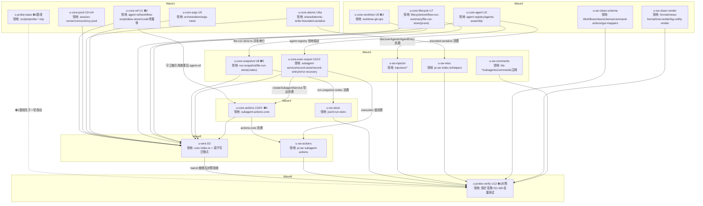

# subagent-core sink（下沉收口）实施计划

基线: 8baf6cb34 | 来源设计: docs/design/subagent-core-sink-design.md | 日期: 2026-08-31

## 0 章节映射

| 内容 | 设计文档实际位置 |
|------|------------------|
| 背景/目标 | §1 背景目标（SCQA / 系统是什么 / G1-G5 / Scope） |
| 终态/机制 | §3 解决方案（3.1 终态 / 3.2 方案对比 / 3.3 关键决策 D1-D10 / 错误规格表） |
| 验收场景表 | §4 验收（S1-S8，全部真实依赖禁 mock） |
| 下一层拆分 | §5 下一层拆分（5.1 三阶段 / 5.2 U1-U12 / 5.3 文件改动地图 / 5.4 ⛔1-⛔5 实施期门 / 5.5 版本发版） |
| 待验证检查点 | §5.4（⛔1 探针基线 / ⛔2 `..` 收紧样本集 / ⛔3 patch 降级留痕 / ⛔4 守卫链等值 / ⛔5 codec 存量往返） |

审查证据：设计文档 commit 链即对抗审查收敛记录——bab007ba5（draft under review）→ 5c23aa908（R1 adversarial review **4MF**/9S/2I closed）→ 88d496046（R2 focus review **0MF**，6S/3I closed）→ eeb9dce3f（final polish，措辞精确化）。当前 must_fix == 0。

## 0.1 与 code-simplify 扫描候选的整合（2026-08-31 全仓扫描）

本计划来源 = sink 设计 U1-U12 + code-simplify 扫描的 pi-subagent-workflow 包候选。映射：

- 设计 U11 已吸收：format.ts↔views/format.ts 合并（扫描强候选）、死导出清理（强候选×4）、workflow-list-injector 排序改 sortByCodepoint（薄）、boundedPrettySerialize 下沉 shared。
- 扫描候选并入本计划新增的 pi-sw 清理单元：u-sw-clean-schema / u-sw-clean-render / u-sw-comments / u-sw-misc / u-sw-store（明细见各单元「清理项」标注）。
- **本计划 Out of scope**（扫描候选中不属本包或不属本 wave）：workflow-state-link 兼容读退役（需 runtime workflow-extractor.ts 同批退役，单独决策）；e2e/workflow-thinkinglevel-real.spec.ts 全 skip 残留（仓库级 e2e）；其他 23 个 extension 包的候选（用户自行处理）；runtime 侧 UI 超时链 / 推荐扩展链（提案级 T2/T3，另行拍板）。

## 1 目标快照（逐字摘录设计 §1.3 / §1.4）

> G1 同一资产同一行为：任一 agent .md / workflow 脚本在两宿主的解析、校验、预算、执行语义一致（含边界：block-scalar、`..`、maxTurns 换算）。
> G2 修复单源化：core 修正任一下沉域的 bug，两宿主刷新后自动受益，无双实现同步负担。
> G3 第三宿主可达：新宿主仅凭 barrel 导出面即可完成「列 agents / run workflow / 崩溃恢复」三件事，零复刻。
> G4 pi 零回归：pi-sw 全部既有行为语义不变——唯一例外为声明的安全收紧：normalizeRef 的 `..` 段校验（收紧对 pi 是行为变更，⛔2 以样本集验证而非等值断言）。
> G5 发版一次到位：全部新导出面落同一 core minor（0.4.0）。

Out of scope（设计 §1.4）：zsw 侧消费改造与发版（姊妹文档）；zsw record 状态机迁移实施；已裁决不收口的平台绑定面 7 项；pi TUI 渲染族下沉（仅壳内去重）。

## 2 单元列表

拆分说明：设计 U1-U12 重切为 20 个执行单元。原因：① barrel（core `src/index.ts`）是热点公共文件——按「共享接线点集中律」把全部 barrel 追加集中到独立的 u-wire 终点单元（pi 走深路径不受 barrel 影响，zsw 是姊妹文档，集中接线物理互斥且 D2「分组注释」一次做齐）；② file-run-store.ts 被 U7(prune)/U8(codec) 共改 → 串行边；③ agent-registry.ts 执行消费面导出归并进 u-core-agent 领地避免共改；④ 全局 subagent 约束 ≤5 文件/单元 → U6 拆原语（u-core-atomic）与内部迁移（并入 u-wire 顺手做）；⑤ pi-sw 扫描清理项按文件聚类成 4 个独立小单元，与消费改造单元领地互斥。

| Unit | 职责 | 领地（精确文件路径，均相对仓库根） | 依赖 | 隔离 | 验收条款 |
|---|---|---|---|---|---|
| u-probe-base | ⛔1 实施前基线：发现清单快照 + 注入三段 XML 快照脚本（真实 pi agentDir）+ S7 负面验证 | `scripts/probe-pi-sw-snapshot.mjs`（新增）；快照产物落 `.review/sink-probe/`（gitignore 域） | 无 | plain | ①脚本对真实 agentDir 产出两份快照；②在当前未改动 HEAD 重跑 diff 为空（S7） |
| u-core-ref | U1 契约面：normalizeRef 增 `..` 段拒绝（⛔2 声明行为变更）+ AGENT_REF_EXT/WORKFLOW_REF_EXT/displayAgentName/invalidAgentRefMessage 工厂导出形态 + normalizeWorkflowRef(ref,{knownNames}) + WorkflowScript 类与 loadWorkflowScriptByPath 工厂 + 模型切分四件（splitZcodeModelRef/DEFAULT_PROVIDER_ID/ZCODE_FALLBACK_DEFAULT_MODEL/hasApiKey 提升导出）+ SLUG_MAX_LENGTH + isProcessAlive | `packages/subagent-core/src/shared/agent-ref.ts`、`src/orchestration/workflow-script-registry-impl.ts`、`src/execution/execute-options-mapper.ts`、`src/execution/alive-store.ts`、`src/execution/engine/engines/zcode/preparer.ts`、`src/execution/engine/engines/zcode/constants.ts` + 各自 `__tests__` 新增/修改 | 无 | plain | ①⛔2 样本集：`/x/../y.md` 与 `/x/../y.js` 拒、`~/` 合法不误伤、skillPath/cwd 既有 assertSafeStartPath 保持；②`pnpm typecheck && pnpm test` 绿（含 core 全量；若 pi-sw 既有测试钉住放行行为，按设计声明的行为变更同步修正该测试并在 PR 描述登记） |
| u-core-pool | U3+U4：computeWatchdogMs 抽出为 `maxTurnsToWatchdogMs`（floor 语义文档化）+ `createConcurrencyPool({maxConcurrent, queuePolicy})` 工厂（缺省 priority） | `packages/subagent-core/src/execution/session-runner.ts`、`src/execution/concurrency-pool.ts` + 测试 | 无 | plain | ①`maxTurnsToWatchdogMs(2) >= 1_800_000` 断言测试；②queuePolicy 缺省下既有 pool 行为等值（既有测试绿）；③typecheck+test 绿 |
| u-core-atomic | U6a：`shared/atomic-write.ts`（tmp+rename 原子写原语）+ `shared/bounded-serialize.ts`（自 pi-sw helpers.ts boundedPrettySerialize 平移，测试随迁） | `packages/subagent-core/src/shared/atomic-write.ts`（新增）、`src/shared/bounded-serialize.ts`（新增）+ 两份新测试 | 无 | plain | ①两原语单测绿（含半截文件/残留 tmp 恢复语义）；②既有实现逐字平移（bounded 序列化输出与 pi-sw 现实现字节一致——快照断言）；③typecheck+test 绿 |
| u-core-args | U9：`orchestration/args-meta.ts`（argKeysFromMeta / findFlattenedArgKeys / normalizeArgsByMeta） | `packages/subagent-core/src/orchestration/args-meta.ts`（新增）+ 测试 | 无 | plain | ①三函数单测绿（以既有 workflow 资产 @pi-meta parameters 为fixture）；②pi-sw 既有 findFlattenedArgKeys 行为等值（对照测试）；③typecheck+test 绿 |
| u-core-agent | U2 + A6 + agent-registry 执行消费面导出形态：`parseAgentProfile(text,filePath)` 宽容解析 + AgentMeta 可选 maxTurns/disallowedTools/skills + `discoverAgents(workspaceRoot, hostRoots)` 装配（frontmatter name 去重 + 码点序 + warn 口径内聚）+ agent-registry 执行消费面（loadByPath/lookupRecordAnyState）导出确认 | `packages/subagent-core/src/execution/agent-registry.ts`、`src/execution/agents-assembly.ts`（新增）+ 测试 | 无 | plain | ①block-scalar/多行 `- item`/单行 key:value/无 frontmatter 四形态覆盖测试（无 frontmatter 宽容降级不抛）；②discoverAgents 与 pi-sw 现装配循环产出等值（以 fixture 目录对照断言：同序同名同字段）；③typecheck+test 绿 |
| u-core-worktree | U5：`execution/worktree-git-ops.ts` git 内核纯函数（保真读/GitRunError/SafeId/dirty 谓词/collectWorktreePatch(anchor)/三步容错清理/listWorktreePorcelain 原始输出）；两条降级路径 warn+裸 diff+patchIncomplete 留痕 | `packages/subagent-core/src/execution/worktree-git-ops.ts`（新增）+ 测试 | 无 | plain | ①⛔3 core 侧分支：锚点缺失/损坏与 add 失败均断言 warn 发出 + 裸 diff + `patchIncomplete:true`；②新文件+已提交改动场景 patch 含两者（真实 git 临时仓集成测试）；③typecheck+test 绿 |
| u-core-lifecycle | U7：`recoverCrashedRuns(store,runs,reason,hooks?)`（pi pending:unregister 经 hooks 外置）+ FileRunStore.pruneStateFilesBeyondCap + `runSummary(run)`/`isScriptRunning(runs,name)` | `packages/subagent-core/src/orchestration/lifecycle.ts`、`src/orchestration/workflow-run-summary.ts`（新增）、`src/orchestration/file-run-store.ts`（仅增 prune 方法）+ 测试 | 无 | plain | ①崩溃恢复四步序列测试（loadAll→failed→save→evict + hooks 回调被调）；②prune 超 cap 裁剪最旧断言；③runSummary 字段投影测试；④typecheck+test 绿 |
| u-core-snapshot | U8：`orchestration/run-snapshot.ts`（toRunSnapshot/fromRunSnapshot/版本常量 `"wf-run-v2"`/live-strip）+ FileRunStore 切换消费（缺 v 宽容读 + 写入补 v + strip live） | `packages/subagent-core/src/orchestration/run-snapshot.ts`（新增）、`src/orchestration/file-run-store.ts`（切 codec 改造）+ 测试 | u-core-lifecycle（file-run-store.ts 共改串行） | plain | ①⛔5：无 v 存量行宽容读取不丢数据 + 写入补 v + 未知更高版本跳过+warn；②live 字段 strip 后落盘断言；③typecheck+test 绿 |
| u-core-exec-export | U10①前半：execution 运行时面导出形态确认——SubagentService 类 + SubagentServiceInit 类型 + createSubagentService(deps) 工厂（构造依赖参数注入，`subagent-service.ts:300-321` 现构造面如实导出）+ record 状态查询面 + 错误类型族；`@experimental` 语义注释 | `packages/subagent-core/src/execution/subagent-service.ts`、`src/execution/record-store.ts`（查询面导出形态）、`src/execution/record-entry.ts`、`src/execution/error-recovery.ts`（仅导出形态，逻辑零改动——若错误类型实际散布其他文件，以 `rg "class .*Error"` 实测为准并在偏差登记表记录） | u-core-agent（agent-registry 域稳定后再定执行消费面引用） | plain | ①createSubagentService 以参数注入构造成功（无全局查找）；②第三宿主最小构造示例编译通过（示例代码入单元产出或测试）；③typecheck+test 绿 |
| u-core-actions | U10②：`execution/subagent-actions-core.ts` 领域内核下沉——pi-sw subagent-actions.ts 六 handler 的零 pi-API 部分（校验/守卫链/归属判定/终态映射）迁移 + ⛔4 行为快照等值测试 | `packages/subagent-core/src/execution/subagent-actions-core.ts`（新增）+ 新测试（快照锚定 pi 现行为，含错误文案锚） | u-core-ref、u-core-exec-export | plain | ①⛔4：六 handler 行为快照（输入→输出+错误文案）迁移前后逐项一致（快照测试先在迁移前对现实现生成）；②typecheck+test 绿 |
| u-wire | D2 barrel 终点接线：index.ts 全部新导出按域分组注释追加（agent-ref 面/workflow 契约面/worktree 内核/运行时面(@experimental)/快照 codec/原语）+ U6b core 内部原子写迁移（6-7 处 tmp 写点切 atomic-write，逐处机械替换） | `packages/subagent-core/src/index.ts` + core 内 6-7 处原子写迁移点（以 `rg "tmp\|\.tmp\|renameSync\|rename(" src --type ts` 实测清单为准，逐处 ≤3 行） | u-core-ref、u-core-pool、u-core-atomic、u-core-args、u-core-agent、u-core-worktree、u-core-lifecycle、u-core-snapshot、u-core-exec-export、u-core-actions（全部 core 单元） | plain | ①`node -e "const c=require('./dist/index.cjs')"` 或 barrel import 冒烟：全部新符号可达；②index.ts 无重复导出/命名冲突（tsc 绿）；③迁移点替换后 core 全量测试绿 |
| u-sw-clean-schema | pi-sw 壳内清理一（扫描候选，零行为）：WorkflowsView.ts detail-content 转出口删除；subagent-tool-schema.ts SubagentParamsStatic 死类型 + SLUG_MAX_LENGTH re-export 垫片删除（保留 line24 import 供内部 maxLength 用）；command-actions.ts LifecycleVerb 单成员机件收敛为 `verb === "abort"` 直判（保留 lifecycle-removed 分支 UX）；gui-mappers.ts 抽共享 isFailedStatus 谓词 | `extensions/universal/subagent-workflow/src/interface/views/WorkflowsView.ts`、`src/interface/subagent-tool-schema.ts`、`src/interface/command-actions.ts`、`src/interface/gui-mappers.ts` + 对应 `__tests__` 同步 | 无 | plain | ①`pnpm typecheck && pnpm test` 绿（被删符号的测试同步删除）；②`rg "SubagentParamsStatic\|SLUG_MAX_LENGTH" extensions/universal/subagent-workflow/src` 无残留引用；③gui-mappers 行为等值（TreeItem status/icon 组合断言不变） |
| u-sw-clean-render | pi-sw 壳内清理二 + 设计 U11 宿主内合并：format.ts ↔ views/format.ts 通用文本工具折叠（formatElapsedSeconds 单源化——小时档行为以 interface/format.ts 版为准并在偏差登记表记录 views 侧消费点核实；segFillColored/pad/visibleLen/ThemeLike 折叠）；firstLineSanitized 双胞胎收口；BgNotifyRecord.round 字段删除；BorderedBgBox 去 export | `extensions/universal/subagent-workflow/src/interface/format.ts`、`src/interface/views/format.ts`、`src/interface/tool-render.ts`、`src/interface/bg-notify-render.ts` + 对应测试 | 无 | plain | ①折叠后全部 TUI 渲染测试绿（行为断言不变）；②formatElapsedSeconds(3700) === "1h1m" 单源断言；③`rg "formatElapsedSeconds\|segFillColored" src/interface` 定义唯一；④typecheck+test 绿 |
| u-sw-comments | pi-sw 注释漂移清扫（8 处，零代码）：6 文件头旧目录路径（src/tui/、src/commands/）改现路径；subagent-tool.ts:66 内联注释；commands.ts:210 测试文件名引用 | `extensions/universal/subagent-workflow/src/interface/list-component.ts`、`list-shared.ts`、`list-view.ts`、`subagents.ts`、`commands.ts`、`subagent-tool.ts`（各 1-3 行注释） | 无 | plain | ①`rg "src/tui/\|src/commands/" extensions/universal/subagent-workflow/src` 清零；②typecheck 绿（纯注释） |
| u-sw-injector | U11 消费改造一：subagent-list-injector 装配循环改 `discoverAgents`；workflow-list-injector 内联排序改深路径 `sortByCodepoint`；engine-awareness normalizeEngineId 再导出折叠（index.ts 与测试改直 import registry） | `extensions/universal/subagent-workflow/src/injectors/subagent-list-injector.ts`、`workflow-list-injector.ts`、`engine-awareness.ts`、`src/index.ts` 中该 import 行 + 对应测试 | u-core-agent | plain | ①⛔1 前置：发现清单快照与改造后重跑逐项一致（注入三段 XML 含 agents 段 diff 为空）；②pi-sw 全量测试绿；③`rg "discoverWorkflows\|装配" src/injectors` 无残留手写装配循环 |
| u-sw-misc | U11 消费改造二：index.ts 三项删除（resources_discover no-op handler、包根 re-export getOrCreateChannelRegistry/UiChannelRegistry/ChannelHandler 及失实注释、formatSubagentStatusSnapshot+MAX_STATUS_INJECTION 及其测试 describe）+ helpers.ts boundedPrettySerialize 切 core shared（本地实现删除）+ helpers.ts WorkflowNotifyDetails 去 export（测试改内联类型） | `extensions/universal/subagent-workflow/src/index.ts`、`src/interface/helpers.ts` + 对应测试 | u-core-atomic | plain | ①`rg "resources_discover\|getOrCreateChannelRegistry\|formatSubagentStatusSnapshot" extensions/universal/subagent-workflow/src` 生产码清零（ADR 注释可留）；②boundedPrettySerialize 输出快照与改造前字节一致；③typecheck+test 绿 |
| u-sw-store | U11 消费改造三：jsonl-run-store 切 core run-snapshot codec（SNAPSHOT_VERSION 沿用 `"wf-run-v2"`、不匹配静默跳过语义保持）+ 壳内清理（doDispose 复制循环折叠为 flushPendingSaves 复用、DEFAULT_SAVE_DEBOUNCE_MS/JsonlRunStoreOptions 去 export） | `extensions/universal/subagent-workflow/src/jsonl-run-store.ts` + 测试 | u-core-snapshot | plain | ①⛔5 pi 侧：含 live 字段 run 的快照往返与实施前逐字节一致（v 字段 `"wf-run-v2"` 不变）；②既有 store 全部测试绿（含去抖/rewrite/append 模式）；③typecheck+test 绿 |
| u-sw-actions | U11 消费改造四（D6② pi 侧）：subagent-actions.ts 收缩为「参数提取 + core 调用 + TUI 渲染」adapter，六 handler 领域内核改消费 core subagent-actions-core | `extensions/universal/subagent-workflow/src/interface/subagent-actions.ts`、`src/interface/subagent-tool.ts`（仅参数提取接线，若无需改动则不动）+ 对应测试 | u-core-actions、u-core-exec-export | plain | ①⛔4 pi 侧：六 handler 行为快照（含错误文案）与改造前逐项一致；②pi-sw 全量测试绿；③subagent-actions.ts 内无守卫链/归属判定逻辑残留（`rg "guard\|归属\|ownership"` 人工复核） |
| u-probe-verify | U12 收口：实施后重跑对照探针 diff 逐项一致 + S1-S8 场景脚本化执行 + 全量测试套件 | `scripts/probe-pi-sw-snapshot.mjs`（复用）、`.review/sink-probe/` 产物对比；不改 src | 全部单元 | plain | ①⛔1 对照：实施前后发现清单/注入 XML 快照 diff 为空；②S2 floor 断言 + S5 第三宿主脚本仅凭 barrel 完成三件事 + S7 负面验证复跑通过；③pi-sw 全量测试绿（基线 2541+）+ core 全量绿 + `pnpm extensions:typecheck && extensions:lint && extensions:test` 绿 |

## 3 DAG 图

全部单元隔离 = plain（领地互斥已核查：core `src/index.ts` 仅 u-wire；pi-sw `src/index.ts` 仅 u-sw-misc；`file-run-store.ts` 串行边化解；`agent-registry.ts` 归 u-core-agent 一家）。无热点文件并行写。

## 4 测试策略

- 增量（单元开发期）：
  - core 单元：`cd packages/subagent-core && pnpm typecheck && pnpm test`（vitest run，基线 177 测试文件全绿为出发态）
  - pi-sw 单元：`cd extensions/universal/subagent-workflow && pnpm typecheck && pnpm test`（基线 71 测试文件；S4 全量基线 2541+ 断言）
  - 派发 task 中写明：vitest、子包目录运行、fake timers 规范（项目 TEST-STRATEGY.md）
- 收尾（u-probe-verify）：core 全量 + pi-sw 全量 + `pnpm extensions:typecheck && pnpm extensions:lint && pnpm extensions:test`
- 真机场景（S1②③/S2 pi 侧/S4③）：本机 pi CLI 实测（`pi --mode rpc` 冒烟），u-probe-verify 内执行；S3/S8 依赖 zsw 侧与发版（out of scope，验收表标注「姊妹文档承载」）

## 5 合理偏差登记表

（初始为空，执行期主 agent 维护）

## 6 状态表

| Unit | 状态 | 轮次 | 证据指针 |
|---|---|---|---|
| u-probe-base | committed | 1 | c8b399306 |
| u-core-ref | committed | 1 | 见 wave1-progress commit |
| u-core-pool | committed | 1 | 8261b549a |
| u-core-atomic | committed | 1 | ff9051b25 |
| u-core-args | committed | 1 | 51d66ee8f |
| u-core-agent | pending | 0 | — |
| u-core-worktree | pending | 0 | — |
| u-core-lifecycle | pending | 0 | — |
| u-core-snapshot | pending | 0 | — |
| u-core-exec-export | pending | 0 | — |
| u-core-actions | pending | 0 | — |
| u-wire | pending | 0 | — |
| u-sw-clean-schema | pending | 0 | — |
| u-sw-clean-render | pending | 0 | — |
| u-sw-comments | pending | 0 | — |
| u-sw-injector | pending | 0 | — |
| u-sw-misc | pending | 0 | — |
| u-sw-store | pending | 0 | — |
| u-sw-actions | pending | 0 | — |
| u-probe-verify | pending | 0 | — |

## 7 残留风险与变更历史

- **⛔2 是声明的行为变更**（`..` 收紧）：若 pi-sw/core 既有测试钉住「放行」行为，改测试合法（设计 G4 声明的唯一例外），须在单元产出中登记改了哪个测试。
- **u-core-exec-export 领地含不确定项**：错误类型族实际散布文件以 `rg "class .*Error"` 实测为准，实测与计划不符时按偏差登记表流程处理，禁止顺手扩领地。
- **⛔4 快照先行**：u-core-actions 迁移前必须先对 pi-sw 现实现生成行为快照（含错误文案锚），快照生成动作是该单元第一步。
- **S3/S8 依赖 zsw 侧**：本仓完成 = 供给面就绪；修复单源化与发版链路验收在姊妹文档执行，本计划 Gate B 对这两项记「跨文档承载」而非失败。
- **真机冒烟依赖本机 pi CLI**：S4③ 若 pi 环境不可用，升级用户裁决（禁 mock 替代）。
- 变更历史：
  - 2026-08-31 计划创建（来源：sink 设计 U1-U12 + code-simplify 扫描候选整合）。
  - 2026-08-31 Wave1 完成（5/5 committed）：u-core-ref 初次派发因账户限流失败，重派后完成。合理偏差登记：u-probe-base 注入快照为两段（model 段数据源非目录集派生且非确定字段，排除以保 S7 确定性）；u-core-pool 旧名 computeWatchdogMs 删除（全仓清零核实）；u-core-ref 的 `..` 检测位选在 ~/ 展开前的原始引用串（防 ~/../x.md 逃逸）、normalizeWorkflowRef 裁决结果为 {kind: name|path|invalid, reason} 结构化形态、保留字定为 [".", ".."] 导出常量、内置 workflow 名不 core 硬编码（经 knownNames 宿主注入体现）。pi-sw 实测无测试钉住 `..` 放行行为，零测试修改。
