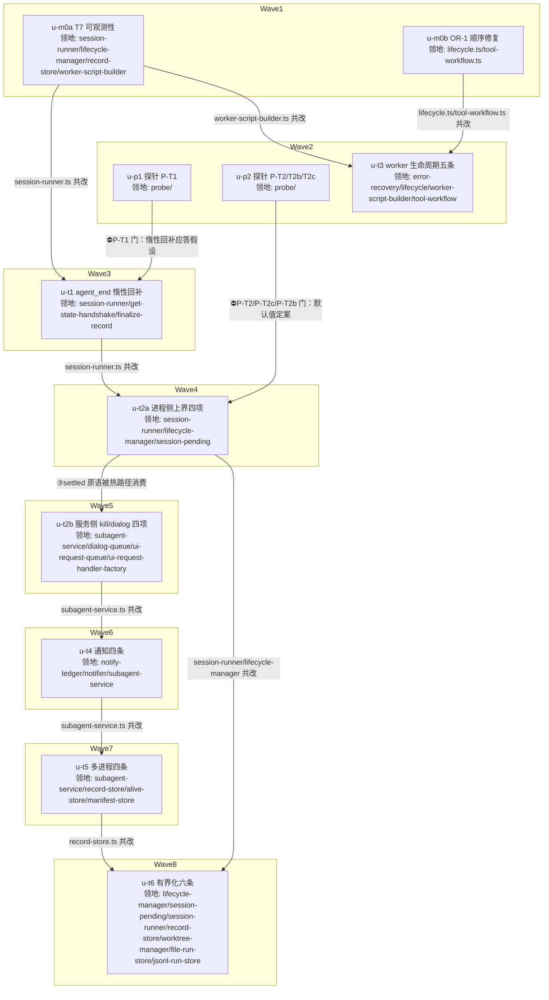

# subagent-core 无界等待家族修复 实施计划

基线: 8e0bb4e0b | 来源设计: `docs/design/subagent-core-unbounded-wait-audit.md`（4 轮对抗审查收敛，commit 728679ba8；审查报告 `subagent-core-unbounded-wait-audit.review.md` 轮 4 must_fix=0） | 日期: 2026-09-01

## 0 章节映射

| 内容 | 设计文档实际位置 |
|------|--------------|
| 背景/目标 | §1 背景：被设计的系统是什么（含 In/Out-scope）、§2 设计目标（含回收层四族定义） |
| 终态/机制 | §6 终态：使用者眼里将是什么样的（§6.1 成功路径 / §6.2 失败路径）、§7.2 七个修复主题 T1-T7（措施/被否/证据/效果/边界） |
| 验收场景表 | §8.2 验收场景 S-A~S-F（含观测点/注入方式/通过标准） |
| 下一层拆分 | §9 实施（M0-M3 阶段）、§10 下一层拆分（U-T1~U-T7 + 文件改动地图） |
| 待验证检查点 | §7.3 探针清单（P-T1/P-T2/P-T2b/P-T2c/P-SD/P-RC1）、§11 待验证检查点 1-6 |

## 1 目标快照（逐字摘录）

> **设计目标**：让「一次异常 → 永久挂起」在结构上不可能发生——正常路径不依赖一次性尽力操作，回收路径一律有界。
> 1. **登全**：同失败家族缺陷全部在册，每条带可复核证据（file:line）与断点分析，实锤/疑似分级。
> 2. **修正常路径**：每个 P0 缺陷的修复方向落在「让正常流程不依赖兜底」，而不是加超时把挂死转成降级。
> 3. **兜底归位**：超时/watchdog 类兜底只允许出现在「回收层」，且默认有界（opt-out 而非 opt-in）。
> 4. **可验收**：每个修复主题有真实场景验收标准（非单测非 mock）。

> **Out-of-scope**（设计 §1）：任何代码修改之外的内容；sessions-index 35MB 治理（独立议题）；zsw vendor 侧同步实施；RC-1/2/3 本身的修复细化（已在既有分析中定为方案一+二，本文并入主题 T1）。

## 2 单元列表

按设计 §10 七主题 + M0-M3 阶段 + 文件领地冲突细化（session-runner.ts / subagent-service.ts / record-store.ts 是串行瓶颈，见 DAG 边原因）。全部 plain 隔离（无跨单元热点公共文件如 index.ts 出口的共改；领地互斥已足够安全）。

| Unit | 职责 | 领地（精确文件路径，均相对 `packages/subagent-core/`） | 依赖 | 隔离 | 验收条款 |
|------|------|------|------|------|------|
| u-m0a | T7 可观测性五条：LC-7 env 非法 warn（两处）/ LC-9 stdout invalid 计数+debug / PS-14 sessions-index 写失败升 warn / OR-6 worker 消息 default 留痕 + log() 接入 workerLogs / PS-15 删 dropFileCache 死代码 | `src/execution/session-runner.ts`、`src/execution/lifecycle-manager.ts`、`src/execution/record-store.ts`、`src/orchestration/worker-script-builder.ts` | 无 | plain | 包内 typecheck 绿；相关 `__tests__` 增量测试绿（env 非法 warn 断言、invalid 计数断言、default case 留痕断言）；grep 无 dropFileCache 残留 |
| u-m0b | OR-1 顺序修复：scheduleTimeBudget 前移到 workerHost.start 之前 + tool-workflow 入口 time 上界校验 | `src/orchestration/lifecycle.ts`、`extensions/universal/subagent-workflow/src/interface/tool-workflow.ts`（**路径修正**：该文件在 extension 侧非 core 包内，设计引用的 `interface/tool-workflow.ts` 即此文件，core 无此目录——u-m0b 实施时发现并登记） | 无 | plain | typecheck 绿；新增测试：time>2^31-1 在 worker 启动前 fail-fast 且 runs Map 无残留条目 |
| u-p1 | 探针 P-T1：agent_end 时（子进程 idle）get_state 应答延迟实证。探针脚本放 `probe/`（随计划提交，S-A 复跑复用） | `probe/p-t1-lazy-getstate.mjs`（新建，只读 src 行为） | 无 | plain | 探针报告落盘：受控并发 spawn + 抑制首次握手场景下 idle 应答 < 1s；失败 → 设计 T1 降级路径（sessionDir 后缀扫描 + leaf 短路）并登记合理偏差 |
| u-p2 | 探针组：P-T2 keep-alive 时长分布（优先回溯历史 session 数据，不足再补真实任务）/ P-T2b pi SIGTERM 后代级联行为 / P-T2c post-run（agent_end→settled）间隔分布 | `probe/p-t2-keepalive-dist.mjs`、`probe/p-t2b-sigterm-cascade.mjs`、`probe/p-t2c-settled-window.mjs`（新建） | 无 | plain | 三份分布/行为记录落盘；P-T2c P99 与 P-T2 分布决定 u-t2a 两个默认上限值（30min/10min 定案或按降级调整并登记） |
| u-t3 | T3 剩余五条 + OR-6 主线程半边（u-m0a blocker 裁决并入）：error-recovery.ts handleWorkerMessage switch 补 default 留痕 + "log" case（workerLogs 已在 u-m0a 侧接线，此为消息面补充防线）。其余：OR-2 rebuild 失败回灌矩阵耗尽收敛 done,failed / OR-3 worker pending 接线 per-call timeout + 接通 abort 广播（P-SD 钩子 env + 安全约束）/ OR-4 终态三路径 M12 同款围栏 / OR-7 abort listener run 终态移除 / OR-8 run done 残留 in-flight 收口 cancelled | `src/orchestration/error-recovery.ts`、`src/orchestration/lifecycle.ts`、`src/orchestration/worker-script-builder.ts`、`extensions/universal/subagent-workflow/src/interface/tool-workflow.ts`（路径修正同 u-m0b） | u-m0b（lifecycle.ts 共改）、u-m0a（worker-script-builder.ts 共改） | plain | typecheck 绿；测试：rebuild 抛错→重试计数→耗尽 done,failed；pending 超时 resolve 错误；emit 围栏不产 unhandledRejection；钩子 env 激活时 warn 留痕断言；switch default 留痕 + log case 断言 |
| u-t1 | T1：agent_end 决策链惰性回补——sessionFile 缺失现场重试 get_state；LC-4 findSessionFileByHeaderId 兜底移出 `if (record.sessionFile)` 守卫；PS-9 finalize marker 清理增 sessionDir 反查 | `src/execution/session-runner.ts`、`src/execution/get-state-handshake.ts`、`src/execution/finalize-record.ts` | u-m0a（session-runner.ts 共改）、u-p1（⛔P-T1 门） | plain | typecheck 绿；测试：握手失败→agent_end 惰性重试回填→正常三分支；守卫移出后 sessionId-有-sessionFile-无形态可达兜底；finalize 反查落 marker |
| u-t2a | T2 进程侧上界四项：①keep-alive 裸缺省默认上限 30min（opt-out）②后代级联 kill（层主死后采集冻结快照→迭代至叶→存活+cmdline 校验，P-T2b 结果决定 no-op 或主路径）③settled 等待固定硬上限 10min（任意一轮、双挂载、同一原语：同一常量+同一挂载/清除 helper）⑤killAllSpawnedChildren「killed 且已 close 才跳过」 | `src/execution/session-runner.ts`、`src/execution/lifecycle-manager.ts`、`src/execution/session-pending.ts`（只读复用，若需导出辅助函数则改动入领地） | u-t1（session-runner.ts 共改）、u-p2（⛔P-T2/P-T2c/P-T2b 门） | plain | typecheck 绿；测试：裸缺省挂 30min timer 且 opt-out 可关；settled 上界双挂载同一常量断言；后代级联清单迭代至叶 + pid 校验；killed-not-closed 不跳过 |
| u-t2b | T2 服务侧四项：④三条裸 SIGTERM 收敛 killChildWithEscalation ⑥disposeAllRecords 补三回收面（abort+kill+disarmIdleTimer）⑦dialog timeout 接线 + 未传 timeout 默认 30min 上界 + 超时明确错误 settle ⑧deliverMessage 非 EPIPE 失败 re-arm idle timer 或转 cold close | `src/execution/subagent-service.ts`、`src/execution/dialog-queue.ts`、`src/execution/ui-request-queue.ts`、`src/execution/ui-request-handler-factory.ts` | u-t2a（③原语被 deliverMessage 热路径消费） | plain | typecheck 绿；测试：disposeAllRecords 调用三回收面 mock 断言；dialog 未传 timeout 默认上界 settle 错误含恢复指引；非 EPIPE 失败路径 timer re-arm |
| u-t4 | T4 通知四条：①notify 门 closedReason 白名单（parent-new/fork 不注入）②idleTimeoutMs 入口 fail-fast + armIdleTimer catch 降级挂默认+warn ③重投 attempts 上限+放弃语义 ④shutdown flush 被门拦落盘 pending 供 replay | `src/execution/notify-ledger.ts`、`src/execution/notifier.ts`、`src/execution/subagent-service.ts` | u-t2b（subagent-service.ts 共改） | plain | typecheck 绿；测试：parent-new 不注入新 session；非法 idleTimeoutMs 入口拒绝含合法范围；重投达上限放弃+warn；flush 拦截时 pending 落盘 |
| u-t5 | T5 多进程四条：①子进程 initSession 跳过 recoverOrphanRecords（sessionRootId=ROOT 判定）②alive marker 心跳刷新（P-T5 门：不可接受则降级软超时对齐）③running 候选冷查补 findForeignLiveInstance ④recoverTmpFiles per-file try | `src/execution/subagent-service.ts`、`src/execution/record-store.ts`、`src/execution/alive-store.ts`、`src/execution/manifest-store.ts` | u-t4（subagent-service.ts 共改）；P-T5 探针在本单元内先跑（真实 wave 写盘频率，或历史数据回溯） | plain | typecheck 绿；测试：非根进程跳过扫描；marker 心跳触发点；冷查带 foreign 守卫；单 tmp ENOENT 不中断整轮 |
| u-t6 | T6 有界化六条：①armIdleTimer 回调身份比对 ②session-pending 游标剪枝+差集计数 ③branchCache LRU ④orphanJudged revive() 复位 ⑤worktree 对账老化升级 ⑥OR-5 两正交子缺陷（增量 append 治单 run O(n²)，实施期先验证节流是否足够；STATE_MAX_RUNS 默认值按 §11-4 统计标定） | `src/execution/lifecycle-manager.ts`、`src/execution/session-pending.ts`、`src/execution/session-runner.ts`、`src/execution/record-store.ts`、`src/execution/worktree-manager.ts`、`src/orchestration/file-run-store.ts`、`src/orchestration/jsonl-run-store.ts` | u-t5（record-store.ts 共改）、u-t2a（session-runner.ts / lifecycle-manager.ts 共改） | plain | typecheck 绿；测试：旧 timer 到期不误删新条目（fake-timer 交错）；LRU 上界；revive 复位；连续 N 周期跳过升级 warn |

## 3 DAG

## 4 测试策略

- 测试框架：vitest（包内 `vitest.config.ts`，禁 node:test；timer 测试用 fake timers——LC-5 竞态窗口按设计 §11-2 需 fake-timer 精确交错验证）
- 增量（单元开发期，从 `packages/subagent-core/` 运行）：`pnpm test -- <本单元相关测试路径>` + `pnpm typecheck`
- 全量（收尾阶段 5 Gate A）：`packages/subagent-core` 全量 `pnpm test`（192 测试文件）+ `pnpm typecheck`；依赖方回归 `pnpm extensions:typecheck && pnpm extensions:lint && pnpm extensions:test`（subagent-workflow extension 消费 core workspace 版）
- 真实场景验收（Gate B）：按设计 §8.2 S-A~S-F 逐行签收；探针脚本可复跑
- 已知 defer：S-A（carbon 生产复跑）无法在本次会话完成，登记状态表并在交付汇报置顶

## 5 合理偏差登记表

| 偏差 | 来源 | 处置 | 状态 |
|------|------|------|------|
| tool-workflow.ts 物理路径在 extension 侧（extensions/universal/subagent-workflow/src/interface/），非 packages/subagent-core 内；设计文档 §4.1 OR-1 与 §10 文件改动地图的 `interface/tool-workflow.ts` 系简写 | u-m0b | 修改落实际文件 + 从 core 导入既有 MAX_TIMER_DELAY_MS 常量（不重复造）；impl-plan u-m0b/u-t3 领地已修正 | 已处置 |
| OR-6 log() 接线形态：workerLogs 通道挂载点在 worker-script-builder.ts 内（module 级 _workerLogs 数组随 return/error 带回），log 内容经 workerLogs→errorLogs 通路可见；独立 {type:"log"} postMessage 保留双通路 | u-m0a | 领地内实质消解静默丢弃；主线程 switch default 留痕 + log case 裁决并入 u-t3（blocker 处置） | u-t3 待办 |
| LC-9 计数暴露形态：StdoutPumpHandles.invalidLineCount() 访问器 + close 时聚合 debug（前 3 条样本 + 总数，防刷屏） | u-m0a | 设计未规定暴露形态，实现选择已登记 | 已处置 |
| worker 模板 byte-identical 快照因 log() 有意变更同批重生成（diff 仅 log() 段 6 行） | u-m0a | 快照护栏随源码变更同步，其余逐字节不变已核验 | 已处置 |

## 6 状态表

| Unit | 状态 | 轮次 | 证据指针 |
|------|------|------|------|
| u-m0a | committed | 1 | u-m0a commit（本轮）；核验：151 tests passed 重跑实证（6 文件）+ 全量 2826 passed + typecheck 绿；grep dropFileCache 无残留 |
| u-m0b | committed | 1 | u-m0b commit（本轮）；dev 报告 JSON 见会话；核验：lifecycle.test.ts 27 passed + tool-workflow-throw-paths.test.ts 7 passed 重跑实证 |
| u-p1 | pending | 0 | — |
| u-p2 | pending | 0 | — |
| u-t3 | pending | 0 | — |
| u-t1 | pending | 0 | — |
| u-t2a | pending | 0 | — |
| u-t2b | pending | 0 | — |
| u-t4 | pending | 0 | — |
| u-t5 | pending | 0 | — |
| u-t6 | pending | 0 | — |

## 7 残留风险与变更历史

- S-A 生产复跑依赖 carbon 环境窗口（本会话 defer，随生产节奏执行；600s 守卫观测预检随 S-A 执行）
- P-RC1（握手失败根因：负载 vs 协议）按设计 §11-1 不阻塞 T1，修复验收时补
- §11-5 PS-9 同源性（marker 缺失与 sessionFile 缺失是否同生同灭）在 u-t1 实施时观察，若同源则反查增益有限按设计降优先级（登记偏差）
- zsw vendor 侧同步随 core 发版节奏（设计 §11-6，Out-of-scope）

### 变更历史
- 2026-09-01 计划创建（基线 commit 后回填 hash）
