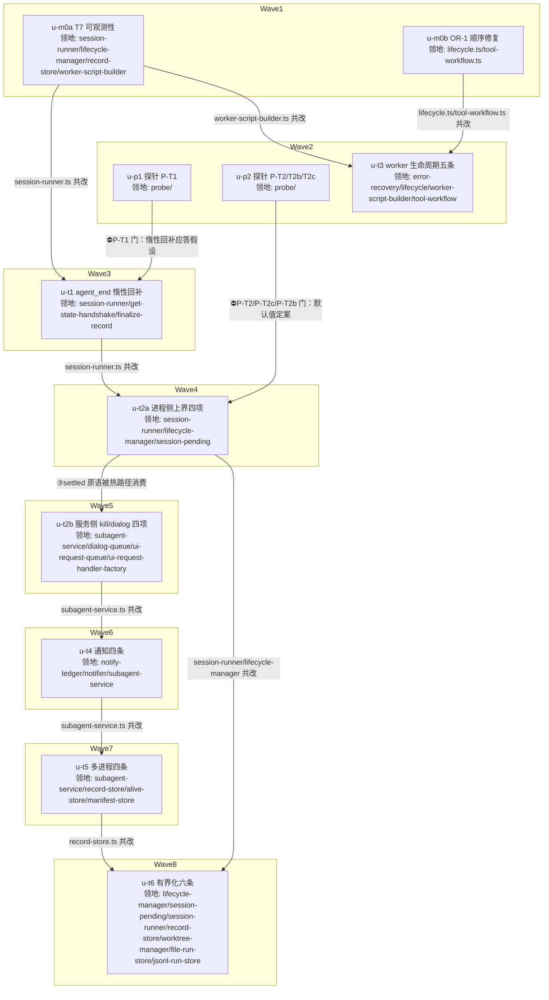

# subagent-core 无界等待家族修复 实施计划

基线: 8e0bb4e0b | 来源设计: `docs/design/subagent-core-unbounded-wait-audit.md`（4 轮对抗审查收敛，commit 728679ba8；审查报告 `subagent-core-unbounded-wait-audit.review.md` 轮 4 must_fix=0） | 日期: 2026-09-01

## 0 章节映射

| 内容 | 设计文档实际位置 |
|------|--------------|
| 背景/目标 | §1 背景：被设计的系统是什么（含 In/Out-scope）、§2 设计目标（含回收层四族定义） |
| 终态/机制 | §6 终态：使用者眼里将是什么样的（§6.1 成功路径 / §6.2 失败路径）、§7.2 七个修复主题 T1-T7（措施/被否/证据/效果/边界） |
| 验收场景表 | §8.2 验收场景 S-A~S-F（含观测点/注入方式/通过标准） |
| 下一层拆分 | §9 实施（M0-M3 阶段）、§10 下一层拆分（U-T1~U-T7 + 文件改动地图） |
| 待验证检查点 | §7.3 探针清单（P-T1/P-T2/P-T2b/P-T2c/P-SD/P-RC1）、§11 待验证检查点 1-6 |

## 1 目标快照（逐字摘录）

> **设计目标**：让「一次异常 → 永久挂起」在结构上不可能发生——正常路径不依赖一次性尽力操作，回收路径一律有界。
> 1. **登全**：同失败家族缺陷全部在册，每条带可复核证据（file:line）与断点分析，实锤/疑似分级。
> 2. **修正常路径**：每个 P0 缺陷的修复方向落在「让正常流程不依赖兜底」，而不是加超时把挂死转成降级。
> 3. **兜底归位**：超时/watchdog 类兜底只允许出现在「回收层」，且默认有界（opt-out 而非 opt-in）。
> 4. **可验收**：每个修复主题有真实场景验收标准（非单测非 mock）。

> **Out-of-scope**（设计 §1）：任何代码修改之外的内容；sessions-index 35MB 治理（独立议题）；zsw vendor 侧同步实施；RC-1/2/3 本身的修复细化（已在既有分析中定为方案一+二，本文并入主题 T1）。

## 2 单元列表

按设计 §10 七主题 + M0-M3 阶段 + 文件领地冲突细化（session-runner.ts / subagent-service.ts / record-store.ts 是串行瓶颈，见 DAG 边原因）。全部 plain 隔离（无跨单元热点公共文件如 index.ts 出口的共改；领地互斥已足够安全）。

| Unit | 职责 | 领地（精确文件路径，均相对 `packages/subagent-core/`） | 依赖 | 隔离 | 验收条款 |
|------|------|------|------|------|------|
| u-m0a | T7 可观测性五条：LC-7 env 非法 warn（两处）/ LC-9 stdout invalid 计数+debug / PS-14 sessions-index 写失败升 warn / OR-6 worker 消息 default 留痕 + log() 接入 workerLogs / PS-15 删 dropFileCache 死代码 | `src/execution/session-runner.ts`、`src/execution/lifecycle-manager.ts`、`src/execution/record-store.ts`、`src/orchestration/worker-script-builder.ts` | 无 | plain | 包内 typecheck 绿；相关 `__tests__` 增量测试绿（env 非法 warn 断言、invalid 计数断言、default case 留痕断言）；grep 无 dropFileCache 残留 |
| u-m0b | OR-1 顺序修复：scheduleTimeBudget 前移到 workerHost.start 之前 + tool-workflow 入口 time 上界校验 | `src/orchestration/lifecycle.ts`、`extensions/universal/subagent-workflow/src/interface/tool-workflow.ts`（**路径修正**：该文件在 extension 侧非 core 包内，设计引用的 `interface/tool-workflow.ts` 即此文件，core 无此目录——u-m0b 实施时发现并登记） | 无 | plain | typecheck 绿；新增测试：time>2^31-1 在 worker 启动前 fail-fast 且 runs Map 无残留条目 |
| u-p1 | 探针 P-T1：agent_end 时（子进程 idle）get_state 应答延迟实证。探针脚本放 `probe/`（随计划提交，S-A 复跑复用） | `probe/p-t1-lazy-getstate.mjs`（新建，只读 src 行为） | 无 | plain | 探针报告落盘：受控并发 spawn + 抑制首次握手场景下 idle 应答 < 1s；失败 → 设计 T1 降级路径（sessionDir 后缀扫描 + leaf 短路）并登记合理偏差 |
| u-p2 | 探针组：P-T2 keep-alive 时长分布（优先回溯历史 session 数据，不足再补真实任务）/ P-T2b pi SIGTERM 后代级联行为 / P-T2c post-run（agent_end→settled）间隔分布 | `probe/p-t2-keepalive-dist.mjs`、`probe/p-t2b-sigterm-cascade.mjs`、`probe/p-t2c-settled-window.mjs`（新建） | 无 | plain | 三份分布/行为记录落盘；P-T2c P99 与 P-T2 分布决定 u-t2a 两个默认上限值（30min/10min 定案或按降级调整并登记） |
| u-t3 | T3 剩余五条 + OR-6 主线程半边（u-m0a blocker 裁决并入）：error-recovery.ts handleWorkerMessage switch 补 default 留痕 + "log" case（workerLogs 已在 u-m0a 侧接线，此为消息面补充防线）。其余：OR-2 rebuild 失败回灌矩阵耗尽收敛 done,failed / OR-3 worker pending 接线 per-call timeout + 接通 abort 广播（P-SD 钩子 env + 安全约束）/ OR-4 终态三路径 M12 同款围栏 / OR-7 abort listener run 终态移除 / OR-8 run done 残留 in-flight 收口 cancelled | `src/orchestration/error-recovery.ts`、`src/orchestration/lifecycle.ts`、`src/orchestration/worker-script-builder.ts`、`extensions/universal/subagent-workflow/src/interface/tool-workflow.ts`（路径修正同 u-m0b） | u-m0b（lifecycle.ts 共改）、u-m0a（worker-script-builder.ts 共改） | plain | typecheck 绿；测试：rebuild 抛错→重试计数→耗尽 done,failed；pending 超时 resolve 错误；emit 围栏不产 unhandledRejection；钩子 env 激活时 warn 留痕断言；switch default 留痕 + log case 断言 |
| u-t1 | T1：agent_end 决策链惰性回补——sessionFile 缺失现场重试 get_state；LC-4 findSessionFileByHeaderId 兜底移出 `if (record.sessionFile)` 守卫；PS-9 finalize marker 清理增 sessionDir 反查 | `src/execution/session-runner.ts`、`src/execution/get-state-handshake.ts`、`src/execution/finalize-record.ts` | u-m0a（session-runner.ts 共改）、u-p1（⛔P-T1 门） | plain | typecheck 绿；测试：握手失败→agent_end 惰性重试回填→正常三分支；守卫移出后 sessionId-有-sessionFile-无形态可达兜底；finalize 反查落 marker |
| u-t2a | T2 进程侧上界四项：①keep-alive 裸缺省默认上限 30min（opt-out）②后代级联 kill（层主死后采集冻结快照→迭代至叶→存活+cmdline 校验，P-T2b 结果决定 no-op 或主路径）③settled 等待固定硬上限 10min（任意一轮、双挂载、同一原语：同一常量+同一挂载/清除 helper）⑤killAllSpawnedChildren「killed 且已 close 才跳过」 | `src/execution/session-runner.ts`、`src/execution/lifecycle-manager.ts`、`src/execution/session-pending.ts`（只读复用，若需导出辅助函数则改动入领地） | u-t1（session-runner.ts 共改）、u-p2（⛔P-T2/P-T2c/P-T2b 门） | plain | typecheck 绿；测试：裸缺省挂 30min timer 且 opt-out 可关；settled 上界双挂载同一常量断言；后代级联清单迭代至叶 + pid 校验；killed-not-closed 不跳过 |
| u-t2b | ~~原单单元~~ 已并行化重组（用户要求最大化并行）：dialog 部分拆为 u-t2b-d 立即并行；subagent-service 部分（④⑥⑧+③热路径接线）并入 u-svc 合并单元 | 见重组行 | u-t2a（③原语） | plain | 见 u-t2b-d / u-svc |
| u-t2b-d | **重组新增**（并行切片）：T2⑦ dialog 三件套——timeout 字段接线 + 未传 timeout 默认 30min 上界 + 超时明确错误 settle（含重新发起指引）+ 超时后队列继续 | `src/execution/dialog-queue.ts`、`src/execution/ui-request-queue.ts`、`src/execution/ui-request-handler-factory.ts`、对应 __tests__ | 无（与 u-t2a 领地互斥，立即并行） | plain | typecheck 绿；测试覆盖传值/默认/队列不卡死/settle 恰一次/字段透传 |
| u-t4 | ~~原单单元~~ 已并行化重组：ledger/notifier 部分拆为 u-t4-n 并行；subagent-service 部分（①②④）并入 u-svc | 见重组行 | — | plain | 见 u-t4-n / u-svc |
| u-t4-n | **重组新增**（并行切片）：T4③ notify-ledger 重投 attempts 上限（默认 5）+ 放弃语义（终态不复活）+ warn 含恢复指引 | `src/execution/notify-ledger.ts`、`src/execution/notifier.ts`、对应 __tests__ | 无（领地互斥，立即并行） | plain | typecheck 绿；测试覆盖上限放弃/不复活/未达上限不变 |
| u-t5 | ~~原单单元~~ 已并行化重组：manifest-store 部分并入 u-t6-s？否——manifest per-file try 并入 u-svc；subagent-service/alive-store/record-store 部分并入 u-svc；P-T5 探针（心跳写盘频率，历史回溯）在 u-svc 内先跑 | 见重组行 | — | plain | 见 u-svc |
| u-t6 | ~~原单单元~~ 已并行化重组：worktree/file-run-store/jsonl-run-store 部分拆为 u-t6-s 立即并行；lifecycle-manager/session-pending/session-runner/record-store 部分（①②③④）为收尾单元 u-t6-c | 见重组行 | — | plain | 见 u-t6-s / u-t6-c |
| u-t6-s | **重组新增**（并行切片）：T6⑤ worktree 对账老化（连续 N 周期升级 warn+清理指引）+ T6⑥ OR-5 两正交子缺陷（节流治单 run O(n²)，实施期验证足够性；STATE_MAX_RUNS 默认值） | `src/execution/worktree-manager.ts`、`src/orchestration/file-run-store.ts`、`src/orchestration/jsonl-run-store.ts`、对应 __tests__ | 无（领地互斥，立即并行） | plain | typecheck 绿；测试覆盖老化升级/节流有界+终态强制/默认值淘汰 |
| u-svc | **重组新增**（subagent-service 瓶颈合并单元，u-t2a 释放后派发）：T2 ④三条裸 SIGTERM 收敛 killChildWithEscalation ⑥disposeAllRecords 三回收面（abort+kill+disarm）⑧deliverMessage 非 EPIPE 失败 re-arm ③热路径挂载 settled 原语；T4 ①notify 门 closedReason 白名单 ②idleTimeoutMs 入口 fail-fast + armIdleTimer catch 降级挂默认+warn ④shutdown flush 被门拦落盘 pending；T5 ①子进程 initSession 跳过 recoverOrphanRecords（sessionRootId=ROOT 判定）②alive marker 心跳（⛔P-T5 探针先行：历史回溯 agent_end 频率与写盘开销，不可接受则降级软超时对齐）③running 候选冷查补 findForeignLiveInstance ④recoverTmpFiles per-file try；alive-store 心跳触发点接线（session-runner agent_end 处一行） | `src/execution/subagent-service.ts`、`src/execution/alive-store.ts`、`src/execution/manifest-store.ts`、`src/execution/session-runner.ts`（仅心跳接线行）、`src/execution/record-store.ts`（仅 T5 需要时）、对应 __tests__ | u-t2a（session-runner 释放 + ③原语）、u-t2b-d（无依赖仅波次错峰） | plain | typecheck 绿；各措施测试齐（见原 u-t2b/u-t4/u-t5 条款） |
| u-t6-c | **重组新增**（收尾单元）：T6①armIdleTimer 回调身份比对 ②session-pending 游标剪枝+差集计数 ③branchCache LRU ④orphanJudged revive() 复位 | `src/execution/lifecycle-manager.ts`、`src/execution/session-pending.ts`、`src/execution/session-runner.ts`、`src/execution/record-store.ts`、对应 __tests__ | u-t2a、u-svc（session-runner/lifecycle-manager/record-store 释放） | plain | typecheck 绿；fake-timer 交错误删用例/LRU 上界/revive 复位 |

## 3 DAG

## 4 测试策略

- 测试框架：vitest（包内 `vitest.config.ts`，禁 node:test；timer 测试用 fake timers——LC-5 竞态窗口按设计 §11-2 需 fake-timer 精确交错验证）
- 增量（单元开发期，从 `packages/subagent-core/` 运行）：`pnpm test -- <本单元相关测试路径>` + `pnpm typecheck`
- 全量（收尾阶段 5 Gate A）：`packages/subagent-core` 全量 `pnpm test`（192 测试文件）+ `pnpm typecheck`；依赖方回归 `pnpm extensions:typecheck && pnpm extensions:lint && pnpm extensions:test`（subagent-workflow extension 消费 core workspace 版）
- 真实场景验收（Gate B）：按设计 §8.2 S-A~S-F 逐行签收；探针脚本可复跑
- 已知 defer：S-A（carbon 生产复跑）无法在本次会话完成，登记状态表并在交付汇报置顶

## 5 合理偏差登记表

| 偏差 | 来源 | 处置 | 状态 |
|------|------|------|------|
| tool-workflow.ts 物理路径在 extension 侧（extensions/universal/subagent-workflow/src/interface/），非 packages/subagent-core 内；设计文档 §4.1 OR-1 与 §10 文件改动地图的 `interface/tool-workflow.ts` 系简写 | u-m0b | 修改落实际文件 + 从 core 导入既有 MAX_TIMER_DELAY_MS 常量（不重复造）；impl-plan u-m0b/u-t3 领地已修正 | 已处置 |
| OR-6 log() 接线形态：workerLogs 通道挂载点在 worker-script-builder.ts 内（module 级 _workerLogs 数组随 return/error 带回），log 内容经 workerLogs→errorLogs 通路可见；独立 {type:"log"} postMessage 保留双通路 | u-m0a | 领地内实质消解静默丢弃；主线程 switch default 留痕 + log case 裁决并入 u-t3（blocker 处置） | u-t3 待办 |
| LC-9 计数暴露形态：StdoutPumpHandles.invalidLineCount() 访问器 + close 时聚合 debug（前 3 条样本 + 总数，防刷屏） | u-m0a | 设计未规定暴露形态，实现选择已登记 | 已处置 |
| worker 模板 byte-identical 快照因 log() 有意变更同批重生成（diff 仅 log() 段 6 行） | u-m0a | 快照护栏随源码变更同步，其余逐字节不变已核验 | 已处置 |
| OR-4 围栏扩至同文件全部 6 处终态路径（设计证据列 3 处；补 handleWorkerExit、finalizeTimeBudgetExhausted，收敛为共享 helper emitTerminalSideEffects） | u-t3 | 「同族收尾不对称设防」闭合需要全覆盖 | 已处置 |
| OR-8 收口表达：状态枚举无 cancelled 值，以 call=done + trace=failed + 固定文案承载（不新增枚举避免 TUI/summary 波动）；收口站点扩至全部终态转换（error-recovery 6 处 + lifecycle abortRun/terminateRunningRuns/recoverCrashedRuns） | u-t3 | 枚举封闭是既有契约；「先收口再落盘」实现落盘前语义 | 已处置 |
| OR-3 workflow() 未接 per-call 超时：协议无 timeout 字段（AC-4 契约面不擅自扩），其 pending 由 abort 广播兜底；agent() string+secondArg 分支补 timeoutMs 透传（此前丢弃该字段） | u-t3 | 协议扩展需走契约变更流程，abort 兜底已覆盖 | 已处置 |
| P-SD 钩子语义取「第 N 次及以后每次抛错」（仅一次会在重试预算内自愈，S-D 验收不可证伪）；附 resetRebuildFailureInjectionForTest | u-t3 | 验收可证伪性优先 | 已处置 |
| OR-7 移除机制：lifecycle.ts 内 WeakMap 注册表 + makeHandlers 包装 onRunDone 覆盖全部消息面终态（workflow-run.ts 不在领地且避免 lifecycle↔error-recovery 循环依赖） | u-t3 | ports.ts 解耦决策保持 | 已处置 |
| **P-T2 探针否定 30min 裸缺省默认值**：历史 89 样本 96.6% keep-alive 窗口 >30min（P50=24.5min/P95=71.6min/max≈95.5h，85/89 parent-shutdown 正常收敛）→ 按设计 P-T2 降级路径 B 裁决：**u-t2a 的 keep-alive 上界采用无进展检测语义**（keep-alive 期间子进程事件/后代集合变化刷新计时，仅连续静默达阈值才 kill；静默阈值 30min 量级） | u-p2 | 设计内合法降级（探针门正常工作）；裸缺省挂载限定不变 | **u-t2a 依据** |
| P-T2b 结论：pi SIGTERM 不级联孤儿后台后代（形态 B 三次复现 NO-CASCADE；仅 bash 前台窗口有 CASCADE）→ 后代补杀为主路径（设计已按此形态） | u-p2 | 与实装源码 killTrackedDetachedChildren 覆盖面互证 | u-t2a 依据 |
| P-T2c 结论：6 轮真实会话 agent_end→settled 间隔全部 0ms（<1-2ms 同 chunk），显式 compact 30 万 tokens 耗时 40.1s → **10min settled 硬上限维持**（余量 4 个数量级） | u-p2 | 含大上下文样本 | 定案 |
| jsonl-run-store.ts 物理路径在 extensions/universal/subagent-workflow/src/（u-m0b tool-workflow.ts 同款漂移）；DEFAULT_STATE_MAX_RUNS=50 单源定义在 core file-run-store.ts，extension import；STATE_MAX_RUNS 显式非法值 = 显式 opt-out 通道不清理（补充裁决：设计只规定默认值未规定非法值走向，取保守不动磁盘） | u-t6-s | 按先例落实际文件；标定推演待 S-A 复核 | 已处置 |
| 探针均以 pi --no-extensions 形态运行（本机全局 npm 版 pi-subagent-workflow exports 漂移致扩展加载 fatal，环境噪音非本单元处置范围）；P-T2c auto-compact 场景以显式 compact 命令实测作量级代理（400KB 未达该模型阈值） | u-p2 | 报告如实标注；settled 窗口是 core 语义，无扩展形态为最小变量基线 | 已登记 |
| u-t1 越领地 additive：subagent-service.ts 注入 sessionDir（字段 + 两处 FinalizeDeps.sessionDir，10 行）——ExecutionRecord 无 cwd、ModelConfigService 不暴露 cwd，PS-9 反查的 sessionDir 只能由 SubagentService 注入 | u-t1（违领地但必要性成立，主 agent 核验 diff 仅 3 处 additive 后接受） | u-t1 领地补登 subagent-service.ts 注入点；u-t2b/u-t4/u-t5 共改时以此为基础续作 | 已处置 |
| agent_end 处置决策点异步化（runAgentEndDisposition fire-and-forget，三分支逐行迁移）：设计未规定同步/异步形态，决策延迟 ≤1s（P-T1 实测 0.3-0.4ms），requestGetStateOnce 永不 reject | u-t1 | 实现形态选择，行为不劣化 | 已处置 |
| T2③ 窗口起算口径裁决：设计正文「deliverMessage 发出 prompt 后同挂」vs 边界句「不触及 turn 执行期」张力——实施取**正文口径**（prompt 发出即起算，整轮含 turn 执行与收尾都在 10min 窗内），更强覆盖（续聊轮 turn hang 也能回收）；风险 = >10min 的 chatMode 单轮被误杀（P-T2c 实测正常轮次 <2ms/compact 40s，chatMode 对话形态单轮分钟级，风险罕见；如遇误杀调 SETTLED_WATCHDOG_TIMEOUT_MS） | u-t2a（主 agent 复核裁决） | design-code-sync 阶段回写设计边界句 | 待回写 |
| settled watchdog 终态 closedReason:'watchdog' 未落：ClosedReason 枚举封闭（OR-8 同款契约），裁决**不扩枚举**——终态原因经 AgentResult.error 携带 'settled watchdog' 标记 + 恢复指引承接；S-B 判据相应理解为「error 含 watchdog 标记与恢复指引」 | u-t2a（主 agent 裁决） | design-code-sync 阶段回写 §6.2/S-B | 待回写 |
| 包级全量首跑 1 例未复现 flake（随后连续 4 次 2915 全绿） | u-t2a | Gate A 复跑留意捕获 | 已登记 |
| PS-9 同源性观察（计划 §7 待办闭环）：marker 与 sessionFile 非同生同灭（marker 写点以 sessionFile 回填为前提，但 record 序列化/跨进程重建窗口可丢失 sessionFile 而 marker 留存磁盘）→ 反查增益成立，不降优先级 | u-t1 | 设计 §11-5 的答案：不适用同源降级条款 | 已闭环 |

## 6 状态表

| Unit | 状态 | 轮次 | 证据指针 |
|------|------|------|------|
| u-m0a | committed | 1 | u-m0a commit（本轮）；核验：151 tests passed 重跑实证（6 文件）+ 全量 2826 passed + typecheck 绿；grep dropFileCache 无残留 |
| u-m0b | committed | 1 | u-m0b commit（本轮）；dev 报告 JSON 见会话；核验：lifecycle.test.ts 27 passed + tool-workflow-throw-paths.test.ts 7 passed 重跑实证 |
| u-p1 | committed | 1 | P-T1 PASS：6 路并发 0.3-0.4ms 应答（预算 1s，2500 倍余量），⛔门放行 u-t1；probe/p-t1-{lazy-getstate.mjs,report.md} |
| u-p2 | committed | 1 | P-T2c 定案 10min 维持 / P-T2b NO-CASCADE 后代补杀主路径 / P-T2 否定 30min → 降级 B 裁决（见偏差表）；probe/ 11 文件 |
| u-t3 | committed | 1 | 六项 + OR-6 主线程半边全绿：orchestration 37 files 504 passed 重跑实证、全量 2868 passed、typecheck 绿、extensions 三连绿 |
| u-t1 | committed | 1 | 双管落地：execution 88 files 1254 passed（48 重跑实证）+ 全量 2879 passed + typecheck 绿；PS-9 同源性闭环（§11-5 不降级） |
| u-t2a | committed | 1 | 四项落地：35 新用例重跑实证 + 全量 2915 四连绿 + typecheck 绿；keep-alive 无进展语义（P-T2 降级 B）+ settled-watchdog 原语（settled-watchdog.ts）+ 后代级联 + killed 收紧；两项裁决登记偏差表 |
| u-t2b-d | committed | 1 | dialog 三件套落地：4 文件 54 tests 重跑实证（含竞态恰一次/默认上界/队列不卡死）；「明确错误 settle」因 pi 协议 RpcExtensionUIResponse 封闭联合无 error 形态 → settle {cancelled:true} + 错误消息与恢复指引落 logger.warn（未扩协议，OR-3 先例）；非法 timeout 回落默认/超大 clamp MAX_TIMER_DELAY_MS（防 1ms 塌缩语义反转） |
| u-t4-n | committed | 1 | 重投上限落地：NOTIFY_REDELIVERY_MAX_ATTEMPTS=5（attempts 含首次，同条通知最多 5 次投递尝试）；放弃终态 = customType 'subagent-bg-notify-abandoned' entry（三列差集 ledger−ack−abandoned，恢复不复活、compaction 补写闭环）+ warn 含恢复指引；notifier.ts 零改动（同通道 warn 已覆盖）；extension 壳侧 41 tests 回归绿 |
| u-t6-s | committed | 1 | 三文件落地：aging 升级 warn（4 周期含清理指引+结构化字段+自愈清零）+ 节流 60s（高频 10 save 落 1 行、done 强制落盘）+ STATE_MAX_RUNS 默认 50（两实现面单源常量 core 定义 extension import）；jsonl-run-store.ts 物理路径在 extension 侧（u-m0b tool-workflow.ts 同款漂移）；§11-4 标定 = 代码模型推演（本机无真实数据，~50MB→~8.5MB/run），节流即终案待 S-A 复核；19+5 tests 重跑实证 |
| u-svc | committed | 1 | 12 项措施全落地（T2④⑥⑧+③热路径、T4①②④、T5①②③④）：6 新测试文件 31 用例重跑实证 + 全量 2971 passed + extensions:typecheck 绿；P-T5 探针主路径心跳（4747 session 回溯，写盘开销可忽略 4 个数量级）。T5① 判据登记修正：实现为 PI_SUBAGENT_SELF_RECORD_ID env 存在性判定（与设计「sessionRootId=ROOT」语义等价，仅被父 spawn 的子进程持有该 env——R3-D4） |
| u-t6-c | committed | 1 | 四项 + close 剪枝接线（补线轮）：5 文件 20 tests 重跑实证 + execution 105 files 1358 passed + typecheck 绿；LC-5 OS 迟回调窗口客观存在按防御性身份比对落地 |
| u-t2b | （重组拆分，见 u-t2b-d/u-svc） | — | — |
| u-t4 | （重组拆分，见 u-t4-n/u-svc） | — | — |
| u-t5 | （重组拆分，并入 u-svc） | — | — |
| u-t6 | （重组拆分，见 u-t6-s/u-t6-c） | — | — |

## 7 残留风险与变更历史

- S-A 生产复跑依赖 carbon 环境窗口（本会话 defer，随生产节奏执行；600s 守卫观测预检随 S-A 执行）
- P-RC1（握手失败根因：负载 vs 协议）按设计 §11-1 不阻塞 T1，修复验收时补
- §11-5 PS-9 同源性（marker 缺失与 sessionFile 缺失是否同生同灭）在 u-t1 实施时观察，若同源则反查增益有限按设计降优先级（登记偏差）
- zsw vendor 侧同步随 core 发版节奏（设计 §11-6，Out-of-scope）

### 变更历史
- 2026-09-01 计划创建（基线 8e0bb4e0b）
- 2026-09-01 并行化重组（用户要求最大化并行，Wave4 起生效）：原 8 波串行中 subagent-service 三环链（u-t2b→u-t4→u-t5）合并为单单元 u-svc；无领地冲突的切片（dialog 三件套 u-t2b-d、ledger/notifier u-t4-n、worktree/run-store u-t6-s）与 u-t2a 并行（4 路并发）；T6 剩余项收尾为 u-t6-c。原则不变：同文件单元不并行（commit 粒度干净），不同文件单元最大化并行
