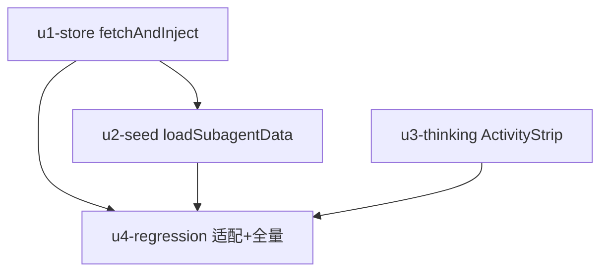

# subagent-drawer-blank 实施计划
基线: d74bdeabc（本文件由 6d5d75870 首次提交后 amend，实际基线以其为准）| 来源设计: docs/design/subagent-drawer-blank.md (v5) | 日期: 2026-09-08

## 0 章节映射
| 内容 | 本文实际位置 |
|------|--------------|
| 背景/目标 | §1 背景 + §2 设计目标（目标 1 即时任务气泡 / 2 思考中指示 / 3 不倒退） |
| 终态/机制 | §5 终态 + §7 实现机制（三处改动：①fetchAndInject 返回值+空不擦 ②loadSubagentData 判定顺序即优先级 ③subagentThinking prop→ActivityStrip） |
| 验收场景表 | §8.2（S1 首开 / S2 重开不擦除 / S3 轮终后打开 / S4 主会话零回归 / S5 非 pi 变体） |
| 下一层拆分 | §10 测试矩阵（T1-T5） |
| 待验证检查点 | §11（⛔1 视觉平滑带降级路径 / ⛔2 超长 task 渲染） |

## 1 目标快照（逐字摘录设计 §2）

**改造后：用户点击刚派发的 subagent，drawer 立即呈现「任务是什么 + 正在执行」的初始态。**

1. **即时任务气泡**：drawer 打开时分区的历史为空 → 立即显示 task 文本的用户气泡（来自侧边栏已在的 SubagentRecord，零额外 RPC）。
2. **思考中指示**：task 气泡下方显示「思考中…」活动行（复用主会话 D7 统一形态），子进程产出到达后自然过渡为真实内容。
3. **不倒退**：重开 drawer、切走切回、实时帧先到的场景，已投影内容不被擦除、不出现重复气泡。

**In-scope**：renderer 侧 `useSubagentTabData` / subagent store `fetchAndInject` / `MessageStream`→`ActivityStrip` prop 通路 + 测试。
**Out-of-scope**：runtime `getSubagentHistory` 协议与读取链（不改）；sessionFile 补全时机（轮终写 entry，属扩展侧 v4 设计，不动）；非 pi 引擎既有 coarse 提示与 outcome 兜底**机制**不变——但 task 气泡与思考行**同适用于非 pi**（运行态如实指示，与侧边栏 spinner 同口径，叠加形态见设计 §5.1 变体）；主会话 ActivityStrip/occupancy 语义（不动）。

## 2 单元列表

| Unit | 职责 | 领地（精确文件路径） | 依赖 | 隔离 | 验收条款 |
|------|------|----------------------|------|------|----------|
| u1-store | fetchAndInject 签名改返回 `Promise<Message[]>`；`history.length > 0` 才 setMessages（空不擦）；同步更新该函数 docstring（W2/M5 fail-fast 语义不变） | packages/renderer/src/stores/subagent.ts | 无（DAG 根） | plain | T1：空 → 不调 setMessages、返回 []；非空 → 调用并返回。既有 subagent.test.ts 非空/fail-fast 断言不破 |
| u2-seed | loadSubagentData 消费 fetchAndInject 返回值；空历史判定顺序写死：①outcome 先行（非 pi && 分区空 && result/error 有值，既有代码零改动）②task 种入随后（分区空 && task 非空 → id `task-u-<subagentId>`、role user、status complete、timestamp `record.startedAt ?? Date.now()`） | packages/renderer/src/composables/panel/useSubagentTabData.ts | u1-store | plain | T2 矩阵（设计 §10 v4）：非 pi+outcome 有值 → 仅 outcome 投影无 seed；非 pi+无 outcome 空 history → seed（**可达**：磁盘扫描滞后窗口）；pi+task 非空 → seed（主场景）；分区非空 → 不种不擦；reload 后无兑底残留 |
| u3-thinking | MessageStream 计算 `subagentThinking = forceWorking && (无 turn \|\| 末位 turn.assistants.length === 0)` 传 ActivityStrip；ActivityStrip 可选 prop，thinking 行条件扩为 `turn==='dispatching' \|\| subagentThinking`；i18n 复用 `panel.message.dispatching` 零新增 | packages/renderer/src/components/panel/MessageStream.vue packages/renderer/src/components/panel/message-stream/ActivityStrip.vue packages/renderer/src/__tests__/components/MessageStream-subagent-force-working.test.ts packages/renderer/src/__tests__/components/ActivityStrip.test.ts（新建） | 无（与 u2 并行） | plain | T3：forceWorking 翻转 × 末位 turn assistant 有/无 × 非 virtual id 恒 false；非 pi 窗口 B（末位仅 task user）→ true / 窗口 A·C（末位有 assistant）→ false。T4：ActivityStrip DOM 断言（testid `activity-strip-row-thinking`） |
| u4-regression | 适配性修订既有断言 + 全量回归：subagent-tab.test.ts「pi 空历史 → 0 turn」翻转为 1 turn（seed）；「:431 task+outcome 同屏」应保持绿（若红修测试前提不修产品代码）；跑全量相关套件 | packages/renderer/src/__tests__/panel/subagent-tab.test.ts | u1, u2, u3 | plain | T5：预期翻转清单落地 + 相关套件全绿（含 MessageStream-subagent-force-working / subagent.test / streaming 相关） |

注：u1/u2 的测试写入各自领地内既有测试文件（subagent.test.ts 归 u1 领地、subagent-tab.test.ts 归 u4 领地——T1/T2 新增用例由 u1/u2 在自己领地内的测试文件追加，u4 只做既有断言适配与全量回归）。为避免两 unit 改同一测试文件：T1 用例落 `__tests__/stores/subagent.test.ts`（u1 领地），T2 用例落新文件 `__tests__/composables/useSubagentTabData.test.ts`（u2 领地，新建）。

## 3 DAG 图

就绪集：初始 {u1, u3} 并行 → u2 → u4。

## 4 测试策略

- 增量（各 unit 自验）：
  - `cd packages/renderer && npx vitest run src/__tests__/stores/subagent.test.ts src/__tests__/composables/useSubagentTabData.test.ts src/__tests__/panel/subagent-tab.test.ts src/__tests__/components/MessageStream-subagent-force-working.test.ts`
- 全量（u4 阶段）：
  - `cd packages/renderer && npx vitest run`（renderer 全包）
  - 关联包守卫：`cd packages/core && npx vitest run src/domain/chat/__tests__/`（streaming/turn 相关，确认零改动无回归）
- 质量门：`pnpm run lint`（含 taste-lint）+ renderer typecheck（`cd packages/renderer && npx vue-tsc --noEmit` 或项目既有脚本）
- 三视角红线（TEST-STRATEGY.md）：每条新增用例至少一个用户可见 DOM 断言（T4 的 activity-strip-row-thinking / 气泡渲染）；spec 结构条目 = 渲染断言清单

## 5 合理偏差登记表

| # | 偏差 | 理由 | 登记 unit |
|---|------|------|-----------|
| 1 | u3 领地增补 ActivityStrip.test.ts（新建测试文件） | T4 的 DOM 断言需独立挂载 ActivityStrip（既有测试无此组件覆盖），计划表初版漏列 | u3 |

## 6 状态表

| Unit | 状态 | 轮次 | 证据指针 |
|------|------|------|----------|
| u1-store | pending | 0 | |
| u2-seed | pending | 0 | |
| u3-thinking | pending | 0 | |
| u4-regression | pending | 0 | |

## 7 残留风险与变更历史

- 残留风险：设计 §11 ⛔1（双 user 过渡视觉平滑，降级路径已定：超预期登记 follow-up 不阻塞）；⛔2（超长 task 渲染，超范围登记 follow-up）；⛔3（core ①级空视图降级缺陷，范围外已登记 follow-up，本设计 renderer seed 在症状层兜住）。
- 变更历史：
  - v1（2026-09-08）：初版。用户已声明「不需要我授权，你全权负责」——dev-flow 阶段 1 的用户评审步骤由主 agent 以文档化推理代行：切分粒度（4 unit，单 unit 领地 ≤2 src 文件，改动脉络与设计 §7 三处改动一一对应）；worktree 不开（改动面小、同包无合并冲突风险、DAG 浅）；验收条款对照设计 §8.2 五场景全覆盖（S1-S5 → u2/u3/u4 验收条款）。
