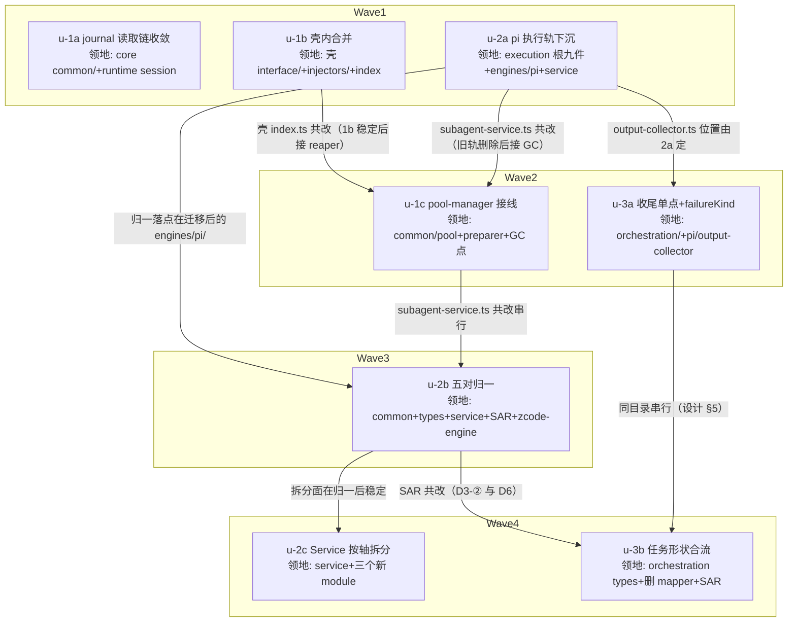

# subagent-dual-track-convergence 实施计划

基线: 3d62ae367（设计文档 r3 收敛版 commit） | 来源设计: [docs/design/subagent-dual-track-convergence.md](subagent-dual-track-convergence.md) | 日期: 2026-09-02

> 审查证据链：r1（4 must-fix）→ r2（2 must-fix + 2 suggestion）→ r3（0 must-fix + 4 suggestion，当轮全修）。报告在 `.review/design-review-dual-track-convergence-r{1,2,3}.md`（gitignore，不入库）。

## 0 章节映射

| 内容 | 设计文档实际位置 |
|------|--------------|
| 背景/目标 | §1 背景目标（SCQA / 系统是什么 / 设计目标 5 条 / in-out scope） |
| 终态/机制 | §3 解决方案（§3.1 终态五条 / §3.2 方案对比 / §3.3 D1-D8 决策 / §3.4 错误规格 / §3.5 物理数据流） |
| 验收场景表 | §4 验收（V1-V6 场景表） |
| 下一层拆分 | §5 下一层拆分（3 组 8 单元 + 文件改动地图） |
| 待验证检查点 | §5 末尾「待验证检查点」①-⑥ |

## 1 目标快照（逐字摘录）

**一句话结论**：前两轮重构（引擎抽象、core 抽包）都停在「新轨可用」而没有「旧轨收敛」，体系内现在有 10 对双轨/双实现，其中 4 对已开始行为漂移（有实证）；本设计按依赖关系分 3 组收敛它们——**每个概念一个实现点**，机制要么接线要么删除，不留「假兑现」中间态。

**设计目标（从使用者体验倒推，受益者排序 ③ 开发者 > ② xyz-agent 用户 > ① 模型）**：

1. **GUI 历史详情读在有测试守护的实现上**。生产读取通路从「零测试的手写副本」切换到「conformance C5 守护的 core 实现」——收益是守护对称与 engine-generic 正确性。
2. **每个概念一个实现点**。开发者改杀链 grace 窗口、journal 格式、资源清单注入逻辑、TUI 时间格式化，都只有一个写点。
3. **pi 与 zcode 同形**。理解任意引擎的执行，入口都是 `engines/<id>/` 的四件套。
4. **缺省路径不付多引擎税**。一个 workflow 内派 pi 子代理，任务形状只映射一次。
5. **机制无假兑现**。代码里存在的每个机制要么在生产链路被调用，要么被删除且设计文档同步修订。

**out of scope**：①core barrel 与壳侧 63 个深路径 import 收口；②新引擎接入；③notifier 的 ledger/delivery-kernel 双路径；④zcode 仓 zsw 壳迁移；⑤subagent pause/resume；⑥resource-discovery 的 sync/async 双轨；⑦journal compaction 事件的 GUI 可见性。

## 2 单元列表

| Unit | 职责 | 领地（精确文件路径） | 依赖 | 隔离 | 验收条款 |
|------|------|---------------------|------|------|---------|
| u-1a | D1 journal 读取链收敛：core 新增 session-view-service（降级链编排 + 投影 + reader registry），runtime 薄调用，删手写 reducer 与引擎 id 硬编码 | 新增 `packages/subagent-core/src/execution/engine/common/session-view-service.ts`（及同目录窄接口文件）；改 `packages/runtime/src/services/session/subagent-engine-history.ts`（删 `applyJournalEvent` 等 ~150 行 + 去 `ZCODE_ENGINE_ID` 硬编码 :130）、`packages/runtime/src/services/session/subagent-extractor.ts`（`projectEngineHandle` 双守卫收敛）；runtime tsup `noExternal` 已含 `@zhushanwen/subagent-core`（tsup.config.ts:47，核对项非改动项） | 无 | plain | V1①②③④；`cd packages/runtime && pnpm test` 全绿；core `pnpm test` 全绿；D1 实施期门①（投影依赖闭包复核无 pi 包，失败则投影留 runtime 收窄删除范围）+ ②（message_end error golden 样本可得性） |
| u-1b | D7 壳内合并：format 双轨并入、injector 工厂化、删 `formatSubagentStatusSnapshot` 死代码、engine-awareness 接线统一 | `extensions/universal/subagent-workflow/src/interface/format.ts`、`interface/views/format.ts`（删）、`interface/views/` 下消费 views/format 的 import 点、`injectors/subagent-list-injector.ts` + `injectors/workflow-list-injector.ts`（合并为工厂）及其 `__tests__`、`src/index.ts`（删 :127 死代码 + 接线统一）、`interface/__tests__/format*.test.ts` | 无 | plain | V2①②；`pnpm extensions:typecheck && pnpm extensions:lint && pnpm extensions:test` 全绿；`rg formatSubagentStatusSnapshot` 零命中；`views/format.ts` 文件不存在 |
| u-1c | D8 pool-manager 接线：refs.json 落盘、preparer acquire、record GC release（chat 域 taskId=record.id 先行；workflow 域过实施期门②后定） | `packages/subagent-core/src/execution/engine/common/pool-manager.ts`、`packages/subagent-core/src/execution/engine/engines/zcode/preparer.ts`、GC 触发点文件（实施期门①盘点定：disposeAllRecords（subagent-service.ts）/ session-start-reaper（壳 index.ts 装配）/ 用户删除 record） | u-1b（壳 index.ts 共改）、u-2a（subagent-service.ts 共改：GC 接线在旧轨删除后的稳定形态上做） | plain | V3；core `pnpm test` 全绿；实施期门①（GC 触发点全量盘点，≥3 处且语义各异 → 降级评估方向 B）+ ②（taskId↔record id 打通影响面：改 createRecordForMode 签名 / hook record store 即判深 → workflow 域维持 TTL 并登记设计文档） |
| u-2a | D2 pi 执行轨物理下沉：九件 rename 至 `engines/pi/`、PiEngine 持四件套 + 原生 interact、Service 删 `kickOffBackground` 旧轨、chat 域统一走 `executeViaEngine`；单 commit 机械迁移不留 shim | `packages/subagent-core/src/execution/` 根九件（session-runner / pi-invocation / stdin-writer / spawn-event-adapter / get-state-handshake / output-collector / temp-prompt / argv-mirror / turn-limiter）→ `execution/engine/engines/pi/`；`execution/engine/engines/pi/pi-engine.ts`（持四件套 + interact）；`execution/subagent-service.ts`（删旧轨）；全仓 import 更新（实施期 rg 全量提取，多形态：ESM import / vi.mock / 相对路径；计划期宽口径 rg = 18 文件：core 8 + 壳 10，设计走查口径 40+ 待复核）；`engines/pi/reader.ts` 一并裁决（删除或标注保留理由） | 无 | plain | V4①②③（基线快照 diff 白名单 / 四视图一致 / `pnpm run build` + `bash scripts/validate-runtime-bundle.sh` exit 0）；core `pnpm test` 全绿（含 conformance）；`rg kickOffBackground` 零命中 |
| u-2b | D3 五对归一：杀链合一（grace 参数化 pi=30s/zcode=5s）、routing 单实现两调用点、journal 接线 host helper、预检 capabilities 化（maxTurns 扩位 pi=true/zcode=false + worktree 补进 SAR + chat 域同步段钉死）、嵌套防护合一 | `packages/subagent-core/src/execution/engine/common/kill-chain.ts`、`engine/common/routing.ts`（新/扩）、`engine/common/nesting-guard.ts`、`engine/types.ts`（EngineCapabilities +maxTurns 位）、`execution/subagent-service.ts`（删 `assertEngineParamSupport` :1641 / `killChildWithEscalation` 调用点 / 通知簇外的归一接线）、`execution/engine/engines/zcode/zcode-engine.ts`（删 `rejectUnsupportedTaskShapes` 硬编码）、`execution/subprocess-agent-runner.ts`（pi 短路 + registry 注入并入 routing + SAR 预检调用点）、journal helper 新文件（common/） | u-2a（归一落点在迁移后的 engines/pi/）、u-1c（subagent-service.ts 共改串行） | plain | V4④⑤（worktree 双域拦截 + 无孤儿 record + 同步观察特征 + zcode+maxTurns 正向 / pi+maxTurns 反向）；core `pnpm test` 全绿；`rg assertEngineParamSupport\|killChildWithEscalation` 零命中；D3 实施期门（pi SIGTERM 优雅退出时序实测，确认 pi 传 30s 语义与现状一致） |
| u-2c | D4 SubagentService 按变化轴拆分：剥离通知簇 / onRoundSettled 闭包 / 冷路径 resurrect 四件 / UI 队列接线；Service 收窄至编排核（~10 public 方法） | `packages/subagent-core/src/execution/subagent-service.ts`（拆分）+ 新增三 module（notifier 面 / 轮次结算 / record-store 邻接，文件名实施期定，均在 execution/ 内）+ 壳侧装配点（若 UI 队列接线外提） | u-2b（拆分面在归一后稳定） | plain | V4 回归复跑（快照 diff 白名单口径不变）；core `pnpm test` 全绿；Service public 方法数 ≤12（rg 口径，目标 ~10） |
| u-3a | D5 收尾单点 + failureKind：error-recovery 更名拆分 worker-message-pump、8 处 coda 收敛 `finalizeRun` 单写点、`AgentResult` + `failureKind` 字段（unknown=可重试守恒）、删 execute-agent-call 子串分诊表 | `packages/subagent-core/src/orchestration/error-recovery.ts`（更名拆分）、`orchestration/lifecycle.ts`、`orchestration/execute-agent-call.ts`、`orchestration/models/types.ts`（AgentResult 扩字段）、`execution/engine/engines/pi/output-collector.ts`（2a 迁移后位置；failureKind 产出 + 词表保留） | u-2a（output-collector.ts 物理位置由 2a 决定） | plain | V5①②③④（终态四步恰好一次 / stale_context 分诊 / unknown 退避重试）；core `pnpm test` 全绿；`rg DETERMINISTIC_SCHEMA_FAILURE_PREFIX` 仅产出侧命中（消费侧零命中） |
| u-3b | D6 任务形状合流：AgentCallOpts 与 AgentTaskSpec 合流、orchestration 直产 TaskSpec、删两个 mapper 与往返保真测试、pi 边界一次直出映射 | `packages/subagent-core/src/orchestration/models/types.ts`（合流）、`execution/execute-options-mapper.ts`（删）、`execution/engine/engines/pi/task-spec-mapper.ts`（删，2a 迁移后位置）、`execution/subprocess-agent-runner.ts`（直产 TaskSpec）、`engines/pi/pi-engine.ts`（spawn 参数直出）及各自 `__tests__` | u-3a（同目录串行）、u-2b（SAR 共改串行） | plain | V6（pi 子代理行为一致 + 字段完整性对照表逐项核对——对照表从现有 mapper 测试提取，实施期门⑤产物）；core `pnpm test` 全绿；两个 mapper 文件不存在 |

**u-foundation 缺席说明**：本设计为收敛型重构，无跨单元共享的新契约模块——各单元的类型改动（maxTurns 位 → u-2b、failureKind 字段 → u-3a、session-view-service 接口 → u-1a）均在各自领地内单一消费，故不设共享契约根节点。

**领地互斥核查**：任意两单元领地交集为空（潜在交叠已用串行边化解：壳 index.ts → 1b→1c；subagent-service.ts → 2a→1c→2b→2c 链；SAR → 2b→3b；output-collector → 2a→3a）。

## 3 DAG 图

波次：W1(1a, 1b, 2a) → W2(1c, 3a) → W3(2b) → W4(2c, 3b)。每波并发 ≤3（≤5 上限内），整波绿才开下一波。

## 4 测试策略

**增量（单元开发期内，从对应子包目录运行）**：

| 单元 | 命令 |
|------|------|
| u-1a | `cd packages/subagent-core && pnpm test`；`cd packages/runtime && pnpm test` |
| u-1b | `pnpm extensions:typecheck && pnpm extensions:lint && pnpm extensions:test` |
| u-1c / u-2a / u-2b / u-2c / u-3a / u-3b | `cd packages/subagent-core && pnpm test` |
| u-2a 另加 | `pnpm run build` + `bash scripts/validate-runtime-bundle.sh`（staged 打包零影响探针） |

**全量（阶段 5 收尾）**：extensions 三连 + subagent-core vitest + runtime vitest + `pnpm run build` + `validate-runtime-bundle.sh` + `pnpm run lint`。

**真实环境验收（Gate B，阶段 5）**：V1-V6 按 §4 场景表逐行执行（`pnpm dev` + 真实 pi/zcode CLI + 真实模型调用），由主 agent 编排、视觉断言派视觉 subagent。

**测试框架红线**：vitest（禁 node:test / tsx --test），timer 测试用 fake timers，从子包目录运行。

## 5 合理偏差登记表

| 日期 | 单元 | 偏差 | 合理性论证 | 处置 |
|------|------|------|-----------|------|
| 2026-09-02 | u-1a | 投影输出类型为 core 自有结构兼容类型 HistoryMessage（非 import @xyz-agent/shared 的 Message） | shared 是 workspace private 包、subagent-core 是 npm 发布包，import 会拖 private 依赖进发布闭包；投影逻辑仍全量上移 core（未触发设计降级路径），结构兼容由 runtime 签名类型检查 + 两侧测试守护 | 已固化（deviations 详录） |
| 2026-09-02 | u-1a | session-view-service 的 DEFAULT_ENGINE_ID='pi' 本地锚定（非 import registry） | import registry 会连带 port→stream-sink 的 .ts 后缀值 import 链进 runtime tsc 图；对齐 engines/pi/reader.ts 的 PI_ENGINE_ID 先例，锚定一致性有守护测试 | 已固化 |
| 2026-09-02 | u-1a | runtime 删除量 ~430 行 > 设计估计 ~150 行 | 设计只计 reducer switch 本体，实际同文件投影/降级读取/白名单函数随迁 core 一并消灭——超额是收敛更彻底，非范围蔓延 | 已固化 |
| 2026-09-02 | u-1b | views 版 formatEventLine 改名 formatTraceEventLine 迁入（同名不同实现的真差异，设计 D7-① 未显式裁决） | 两版语义不同（subagent 对话流风格 vs workflow trace 风格），同文件无法双同名导出；唯一消费点 detail-content.ts:235 同步改名 | 已固化 |
| 2026-09-02 | u-1b | 「~150 行同构消失」实际净 -70（三文件口径） | 逐字同构骨架一份副本（~115-130 行）整体消除，但工厂新增 ~30 行参数化接口 + 两份重复机制文档合并保留一份；含 index.ts 接线 -26 行后整单元 diff +186/-426 | 已固化 |
| 2026-09-02 | u-2a | import 更新面 74 文件 >> 计划期宽口径 18（相对路径形态未覆盖） | 计划期 rg 只测深路径字符串形态，execution/__tests__ 大批 `../session-runner.ts` 相对引用未入计；实施期全量提取（残留风险 2 已预告），单元边界不受影响 | 已固化 |
| 2026-09-02 | u-2a | chat 轮次经 EnginePort 的形态 = ChatRoundTicket 交接（非 AgentTaskSpec 直载） | run(task, ctx) 的 task 形参对 chat 分支仅满足 port 签名；lossless host 件（ResolvedIdentity/SessionRunnerContext/forkFromSessionFile/resume/priority）由 ticket 携带——spec 往返会丢 forkFromSessionFile 造成 chat pi fork-from 回归；u-3b（D6 合流）消除双形态，pi-engine.ts 与 ticket 类型已登记 | 已固化（u-3b 消化） |
| 2026-09-02 | u-2a | interact 生产调用方为 interactRecord（record 锚定形态）而非 port face interact | 编排层已持归属校验过的同一 record 对象，port face 的 handle→recordId→store 二次查找会引入「record 未注册即投递失败」新失败模式；port face 保留完整实现且被 conformance 覆盖，协议知识在引擎边界的 D2 主张不受影响 | 已固化 |
| 2026-09-02 | u-2a | reader.ts 裁决 = 保留 + 文件头标注（实施期门②） | EnginePort.read 是非可选能力面（capabilities.sessionRead='full'、conformance read 降级契约①级实现）；删除使 pi read 面空心化并与终态图四件套矛盾；不构成第三个 SessionView 装配（u-1a session-view-service 对 pi 分支防御性空返回，零交叠） | 已固化 |
| 2026-09-02 | u-2a | 领地外追认 2 处：engine/types.ts InteractAction +interrupt?: boolean（加性）；subagent-actions.ts deliverMessage→deliverChatMessage 重命名清扫（8 处，1 代码 + 7 注释） | 前者不加则 chat 域 interrupt:true 语义经 engine.interact 后丢失 = 回归（D1 §3.3.5 预留扩展位的兑现）；后者为 Service 方法删除后的编译强制 + 零逻辑变化 | 主 agent 追认 |
| 2026-09-02 | u-2a | chat 域 pi 轮次不接 event journal | 迁移前基线无 journal 产物（A1 一致性要求）；journal 接线保留给非 pi 引擎 chat 路径与 workflow 域 SAR | 已固化 |
| 2026-09-02 | u-1c | 门①盘点 6 项触发点归并两类（archive 保留类 ①②④同构 / 文件 TTL 类 ③），真删除锚点 ≤2 未触发降级；实际接线面 = idle-gc release + session-file-gc TTL 兜底 + preparer acquire（disposeAllRecords/user-close 为 archive 保留语义不接） | 设计门①判据「≥3 处且语义各异」按归并后语义判定；record 未死的 archive 类接线会误删活数据源 | 已固化 |
| 2026-09-02 | u-1c | 门②判深：workflow 域维持 TTL 回收（SAR 零改动）；**doc_error 已回写设计文档 D8**：原「journal 现依赖 30 天 TTL 自然回收」为假许诺（session-file-gc 不扫 engines/），u-1c 以 cleanupExpiredPoolRefs 落地真 TTL | SAR 注释自认打通需 hook record store + 改 createRecordForMode 签名，命中判深判据 | 已固化（设计文档同步） |
| 2026-09-02 | u-1c | 领地外追认 1 处：zcode-engine.ts :231 prepareZcodeHome 加 taskId 参数（编译强制机械适配）；API sync 化（acquire/release/cleanup 从 async 改 sync——原 async 签名零生产调用方）；进程内计数 Map 删除（refs.json 唯一权威）；release 对无 refs 条目仍删 journal（record 死亡是充分条件）；done record 近似语义（一次性 done record journal 由 TTL 兜底） | 详见 u-1c deviations——主 agent 逐条审核通过 | 追认/已固化 |
| 2026-09-02 | u-3a | 只更名不拆文件（worker-message-pump.ts 四职责共享 WorkerMsg/守卫/闭包，物理拆分切断共享语义）；finalizeRun 签名加 doneReason 必要参数；coda 微差统一 ×3（transition 统一吞+中止 / save 统一 best-effort / emit 统一 try-catch——收敛裁决非回归，lifecycle.test 契约同步改写） | 名实不符根源是文件名；设计示意签名无法承载各路径不同 doneReason；微差统一是单点化的必然结果 | 已固化 |
| 2026-09-02 | u-3a | 领地外追认 6 处：failureKind 穿过 5 个 intermediate 类型点（execution/types + agent-result-mapper + engine/types + pi-engine 一行透传 + SAR 一行透传——纯加性可选字段）+ eslint.config.mjs 更名跟随；zcode 不产 failureKind 恒 unknown=可重试（原 zcode error 文案含 aborted 子串会不重试——理论漂移方向与 V5④ 安全默认一致，abort 场景由 signal.aborted 检查兜底） | failureKind 进程内契约物理穿过 intermediate 类型；zcode 无产出侧词表识别能力 | 追认/已固化 |
| 2026-09-02 | u-2b | fork 判据实施修正（**已回写设计 D3-④**）：原「借 caps.steer 判」不可照抄（pi steer='unsupported'，纯 steer 判误拦 pi fork 违反 V4⑤），实现为「分叉通道族任一可用即放行」（steer 或 conversation 非 unsupported）——行为矩阵与设计验收一致（pi 放行/zcode 拦截） | 设计原文判据与 pi capabilities 实况冲突；capability-gate.ts 模块注释记载裁定 | 已固化（设计文档同步） |
| 2026-09-02 | u-2b | chat 域 zcode+maxTurns 拒绝时点前移（**已回写设计 §3.4**）：旧异步 failed record → 新 record 创建前同步 throw——拒绝事实不变，时点前移是检查点钉死的直接结果；多违规首报顺序统一（纯文案）；双重 kill 窗口归并（终态等价、单 kill 时序逐字节一致由 race-F4 守护）；routeEngineForHost union 返回类型（pi 同步短路零微任务契约）；chat 域兜底统一本地 chatPiEngine 实例 | 详见 u-2b deviations——主 agent 逐条审核通过 | 已固化 |
| 2026-09-03 | u-2c | public 方法数口径对照：设计走查 27（u-2a 前）→ 开工实测 24（u-2a 已删 deliverMessage/resumeRound）→ 终态 12（rg 纯方法口径达标；含 asEngineService getter 为 13，getter 是 face 视图非动作方法不计）。消失路径四类：④外提（setUiRequestHandler→initSession.uiRequestHandler 参数，null=显式清空/undefined=不动）/ 死方法删除（notifyMissingHandler、listRunning 生产零调用）/ recoverOrphanRecords private 化（唯一调用方 initSession）/ 查询面聚合 8 方法降 private | 查询/交互面消费点在壳 interface/（约 19 调用点），首轮领地内不可达 ≤12，主 agent 裁决扩领地（选项 a）后完成聚合 | 已固化 |
| 2026-09-03 | u-2c | 聚合分组按变化轴两组而非单一对象：service.queries（读模型轴：findRecord/lookupRecordAnyState/collectRecords/getFullRecord/onChange）+ service.chatActions（对话 action 轴 M2-B3：getRecordForAction/closeSubagent/deliverChatMessage）；纯委托（方法体零改动）；deliverChatMessage 不豁免（同节同轴且保留则 13 超标）；onParentFork/onParentNew（8 处领地外测试调用）/ startGcTimer（并入 initSession 会启真实 1h timer 致测试不退）/ disposeAllRecords（SP-4 生命周期面）/ resolveModel（modelService 代理）保留 public | 变化轴归属裁决 + 不为凑数改写（private 化需 as-cast 属指标游戏） | 已固化 |
| 2026-09-03 | u-2c | 领地外追认 2 处：engine/engines/pi/registration.ts:35 与 subprocess-agent-runner.ts:93 的 PiEngine 结构化直绑改经 `get asEngineService()` 视图（复用既有 private piEngineServiceAdapter，成员集合与原直绑等价，行为零差异）——原直绑把 Service 整体当 PiEngineService 用，聚合收窄后必然破坏，各 1 行机械适配 | 主 agent 硬核验 diff 审查通过；getter 形态 = 惰性适配 face 非 public 动作方法 | 追认 |
| 2026-09-03 | u-2c | V4 快照复跑降级未执行：① u-2c 为行为逐字节等价搬移（无 pi 执行链变化），行为守护由 core 2407 全量承担（含 chatmode 闭环/message-close/restart/conformance）；② 复采环境受阻——pi CLI 0.84.2 加载源码 extension 时依赖解析到 npm 安装版 subagent-core（exports 无深路径，npm 版与源码版固有差异非本单元引入），修复需动 ~/.pi 用户环境 | 对齐 impl-plan 残留风险 5 先例降级；桌面形态 V4 全场景留阶段 5 |
| 2026-09-03 | u-2c | 「四件」实为五件：isReconnectableClosed（closed 死因可重连判定）作为冷查链内聚小函数随迁 cold-resurrect.ts（与 findColdLookupCandidate 不可分）；core 测试 2408→2407 = 删除 listRunning 死面用例 1 个（方法已删）；壳 mock 工厂形状跟随（queries/chatActions 包装视图，成员与平铺键同引用） | 设计四件为走查计数；测试数变化有归因非回归 | 已固化 |
| 2026-09-03 | u-3b | **终态命名裁定：AgentCallOpts（非 AgentTaskSpec）**——①agent() API 是唯一生产写入方，合流字段多数派已是调用方命名；②原 AgentTaskSpec 的中立重命名层（task/slug/effort/persona）与调用方命名形式同构语义同构，属假差异按「消假差异」合并；③持久化兼容反向锁定（jsonl run 快照 AgentCall.opts 与 worker 消息以 prompt 落盘，反向命名破坏旧快照重水合且迫使 3 个领地外文件实质改写）。设计终态四原文「AgentCallOpts（与 AgentTaskSpec 合流后的中立形状）」与此一致 | 变化轴归属裁决；反向方案被三硬事实挡死 | 已固化 |
| 2026-09-03 | u-3b | 字段裁撤 2 项：AgentTaskSpec.requires（P4 形状预留无生产写入方，并入需 import EngineCapabilities 形成 orchestration↔engine 类型环）与 PersonaSpec.agentRef（无写入方无消费者）不并入，裁撤理由登记于 AgentCallOpts 类型注释；kill-chain 超时文案取值源 task.slug→task.description（缺省显示 unknown，展示标签不变取值等价）；SLUG_MAX_LENGTH 迁至 orchestration/models/types.ts（与 description 同文件），core 1 行 + 壳 4 文件 import 路径跟随 | 死字段裁撤 + 等价改写；测试跟随 | 已固化 |
| 2026-09-03 | u-3b | RunContext.schemaEnv 成为无写入方字段：解耦形态改经 AgentCallOpts.schemaEnv 兜底（pi 直出「schema 派生优先 + schemaEnv 兜底」，与原 ctx 通道同源等值——SAR 填 ctx 的来源即 opts.schemaEnv），SAR 停填、pi-engine 停读；port.ts 字段定义保留（删 port 接口字段超授权）现为双向无消费，**待 D6 文档修订时移除**；host-task-spec 不透传 schemaEnv（维持 chat 域 pi 派生优先取值与合流前逐字节一致） | 行为零回归优先；残留项留一致性审查处置 | 已固化（含待办） |
| 2026-09-03 | u-3b | **ChatRoundTicket 双形态消化结论：保留+文档化（u-2a 偏差闭环）**——合流形状不能承载 ticket host 件（ctx/signal/priority/stream 是运行期句柄、record 是 Service 内部生命周期对象、resume 是 session-runner 私有 spawn 选项、opts: ExecuteOptions 是 D6 明确保留的 Service 内部编排形状且是 forkFromSessionFile 唯一 lossless 载体）；结构性裁决（「编排交接」vs「任务声明」职责分界），理由固化于 pi-engine.ts 注释；chat pi fork-from 零回归由新增用例锁定 | 与 u-2a 登记「spec 往返会丢 forkFromSessionFile」的判断一致，双形态为真差异保留 | 已固化 |
| 2026-09-03 | u-3b | 领地外追认（三组）：①授权扩展面 13 文件（engine/types.ts 删 AgentTaskSpec/PersonaSpec 定义——合流必要动作、port.ts run 签名、host-task-spec.ts 语义等价改写、zcode-engine.ts 类型 4 处 + 字段访问 2 行、kill-chain.ts 签名 + 1 行、persona-router.ts PersonaSpec→本地 PersonaContent、capability-gate/routing 注释、index.ts barrel、worker-message-pump 1 行、subagent-service 注释、测试跟随 7 文件）；②壳 interface/ 4 文件（SLUG_MAX_LENGTH import 路径 + 注释）；③过程失误登记：曾误用 git rm（构成 staged 删除），当场 git restore --staged 纠正，无 commit/stash 残留 | 主 agent 硬核验 diff 审查通过（4 个非机械点逐一审查：语义等价/死字段裁撤有据/取值源保守） | 追认 |

## 6 状态表

| Unit | 状态(pending/in-progress/committed/blocked) | 轮次 | 证据指针 |
|------|--------------------------------------------|------|---------|
| u-1a | committed | 1 | core 2346 passed（干净 TMPDIR）/ runtime 4095 passed / runtime typecheck exit 0（tsconfig +allowImportingTsExtensions 一行，授权项）/ tsup build success / V1④ 代码断言：runtime 手写 reducer 符号 rg 零命中、ZCODE_ENGINE_ID 硬编码删除；实施期门①闭包复核过（7 文件零 pi 包）、门② golden 样本补录 3 个（JournalWriter 真实落盘） |
| u-1b | committed | 1 | extensions 三连全绿（typecheck/lint EXIT=0 + subagent-workflow 69 files/902 tests）；rg formatSubagentStatusSnapshot 零命中；views/format.ts 不存在；injector 骨架符号仅存工厂文件；model-list-injector 零 diff；两段派发（全局文件数约束），偏差登记表 2 条 |
| u-1c | committed | 1 | 门①未触发降级（6 触发点归并 2 类语义）/ 门②判深（workflow 域维持 TTL）；接线面 = preparer acquire + idle-gc release + session-file-gc TTL 兜底（cleanupExpiredPoolRefs）+ refs.json 唯一权威计数；core 合流态 2388 passed（含 pool-manager 19 新用例）；resolvePoolDir 代码调用零命中；doc_error（TTL 假许诺）已回写设计文档 D8；偏差登记 +3 条 |
| u-2a | committed | 1 | 两段派发（段 1 机械迁移 74 文件 import / 段 2 删旧轨 + interact 下沉）；core 2348 passed（+2 新用例）/ runtime 4095 passed / extensions 三连全绿（902）/ tsc + tsup exit 0 / validate-runtime-bundle exit 0 / staged 产物符号探针（kickOffBackground=0、新符号齐）；rg kickOffBackground 与 Service 协议符号（deliverMessage/resumeRound/sendPromptCommand）代码零命中；假兑现 B 解除（interactRecord 生产调用 subagent-service.ts:820）；A1 终验：迁移后 chat 域重采基线 diff——record 机器字段形态逐字段一致（字段集/status/agentName/model/task），差异全部归因模型非确定性（slug 为模型自填参数、调用次数差异），rootSessionId 属 volatile 白名单；偏差登记表 +5 条（ChatRoundTicket / interactRecord 形态 / reader 保留 / 追认 2 项 / journal 不接） |
| u-2b | committed | 1 | 五对归一：capability-gate.ts（maxTurns 位 pi=true/zcode=false + per-engine 拦截矩阵 + SAR worktree 补拦）+ routing.ts routeEngineForHost 单实现两调用点（pi 同步短路契约）+ journal-wiring.ts host helper + kill-chain 唯一实现（grace 参数化 30s/5s，killChildWithEscalation 删除）+ nesting-guard ALS 合一；rg 三符号（assertEngineParamSupport/killChildWithEscalation/rejectUnsupportedTaskShapes）零命中；core 2408 passed（+20 净）/ extensions 三连全绿；实施期门（pi SIGTERM 30s）走既有 race-F4 三用例证据；fork 判据与拒绝时点前移两处口径已回写设计文档；偏差登记 +2 条 |
| u-2c | committed | 1（两段：首轮四块拆分 + 扩领地查询面聚合） | 四块拆分落地（notify-host.ts / round-settlement.ts / cold-resurrect.ts 三新 module + isReconnectableClosed 五件随迁 + UI 接线外提壳 index.ts，setUiRequestHandler→initSession.uiRequestHandler 参数）；查询面聚合（SubagentQueries/SubagentChatActions 导出，8 方法降 private，壳 interface/ 4 文件 19 调用点机械替换零残留）；public 方法 27→24→12 达标（rg 纯方法口径；含 asEngineService getter 13 不计）；死方法删除 ×2（notifyMissingHandler/listRunning）；core 2407 passed / 6 skipped（2408−listRunning 死面用例）+ tsc exit 0 / extensions 三连全绿（902）/ root eslint 改动生产文件 exit 0；追认 2 处（registration.ts / subprocess-agent-runner.ts asEngineService 视图）主 agent diff 审查通过；V4 复跑降级（行为等价搬移 + 复采环境受阻，桌面形态留阶段 5）；偏差登记 +5 条 |
| u-3a | committed | 1 | worker-message-pump.ts 更名落地（error-recovery.ts 不存在）/ finalizeRun 唯一定义 + 源码 8 调用点收敛 / failureKind 三态分诊（消费侧 DETERMINISTIC_SCHEMA_FAILURE_PREFIX 零命中，词表留产出侧）/ V5④ 语义守恒测试（unknown+缺省=退避重试）；core 合流态 2388 passed（含 finalize-run + 三态分诊新用例）；壳侧 902 全绿；偏差登记 +2 条（含追认 6 处 intermediate 类型点） |
| u-3b | committed | 1 | 合流终态 = AgentCallOpts（orchestration/models/types.ts，吸收 graceTurns/conversation/idleTimeoutMs/denyTools/permissionMode + worktree 三态 + SLUG_MAX_LENGTH 迁入）；两个 mapper 物理删除（execute-options-mapper.ts 115 行 + task-spec-mapper.ts 100 行 + 保真测试 38 用例），import 探针 rg 零命中；pi 边界一次直出 agentCallToExecuteOptions + 门⑤对照表落盘 spawn-opts-direct.test.ts（D-00 全字段快照 + D-01~D-24 逐字段断言双保险）；SAR 直传零映射 + mergeTimeoutSignal 随迁（7 用例）；ChatRoundTicket 双形态结构性保留（理由固化 pi-engine.ts 注释 + fork-from 零回归新用例）；core 2402 passed / 6 skipped（净 -5 对账：删 38 增 33）/ tsc exit 0 / runtime tsc exit 0 / extensions 三连全绿（902 + structured-output 189+2 跨包契约）/ root eslint 0 errors；追认三组（授权扩展 13 + 壳 4 + git rm 误操作已纠正登记）主 agent diff 审查通过；偏差登记 +6 条 |

## 7 残留风险与变更历史

**残留风险**：

1. u-1c 的 GC 触发点是移动靶（实施期门①盘点前领地不完整）——盘点结果若判深（≥3 处语义各异 / taskId 打通需改签名），触发降级评估（方向 B：删 pool-manager + 修订设计文档 §3.3.9 语义）。
2. D2 的「40+ 测试 import」为设计走查口径，计划期宽口径 rg 仅 18 文件——import 更新面以实施期 rg 全量提取为准（含 vi.mock / 相对路径形态），不影响单元边界。
3. 走查计数类断言（Service 27 public 方法 / 整类 mock ×7 / coda 8 处）均为实施期复核项（设计待验证检查点⑥）。
4. u-2a 为最高风险单元（物理迁移 + 删旧轨 + 全量 import）——V4 基线快照 diff 是其行为零回归的唯一机器证据，采集必须在迁移前完成。
5. **V4 基线采集记录（2026-09-02，u-2a 派发前）**：chat 域基线已采（`/tmp/v4-baseline/before-u2a/chat/`：真实 pi CLI + subagent-workflow 源码 extension + 真实模型，5 工具调用、record store 8 文件含 sa-*.json / 子代理 session / sessions-index / engines.json + 事件流）。宿主形态从 xyz-agent GUI 调整为 pi CLI 直测（合理偏差：同一宿主形态前后对照等价隔离 core 执行链变化 + AGENTS.md 钦定实测路径；GUI 四视图对照留阶段 5）。**workflow 域基线采集受阻降级**：pi CLI 隔离环境（PI_CODING_AGENT_DIR + /tmp cwd）下 project workflow 发现返回 (none)（independent node 探针用同一 workspaceRoot 能发现 `/…/.agents/workflows/v4-baseline-workflow.js`，pi 进程内 registry.loadAll() 为空——根因未定位，疑似 AGENT_DIR 隔离/cwd 推导在 pi 进程内的组合行为）——workflow 域行为对照降级为 conformance 套件 + core 全量测试 + 阶段 5 桌面形态 V4 全场景；发现链问题登记待独立排查（若桌面形态同样 (none) 则为产品缺陷）。u-2a 段 2 后在等价环境重采 chat 域对照快照做 diff。
6. **基线采集环境坑**：session 目录不可放在家目录子树下（findWorkspaceRoot 向上找到家目录 marker → project 源错位），须放 /tmp 直下；core 测试 resource-discovery 用例对 TMPDIR 父链 marker 敏感（/tmp 干净目录下 40/40 过）；runtime 全量测试须默认 TMPDIR（自定义 TMPDIR 会击穿 migrate-skills-discovery 的路径断言）；并行跑多套测试会引发 relay-registry socket 冲突——一律串行。

**变更历史**：

| 日期 | 事件 |
|------|------|
| 2026-09-02 | 计划创建（基线 3d62ae367；设计经 r1/r2/r3 三轮对抗式审查收敛至 0 must-fix） |
