# subagent 引擎感知注入 实施计划

基线: 7ff29c101 | 来源设计: docs/design/subagent-engine-awareness-injection.md | 日期: 2026-08-29

> 审查证据：设计文档已于 2026-08-29 过 tech-design-review 对抗式审查（会话内完成：must_fix=5 / suggestion=6，全部修复后随 7ff29c101 提交，报告全文在当日会话记录）。当前未解决必修项 = 0。

## 0 章节映射

| 内容 | 本文实际位置 |
|------|--------------|
| 背景/目标 | §1 背景目标（SCQA + G1-G4 + In/Out scope） |
| 终态/机制 | §3 解决方案（3.1 终态样例 / 3.3 决策 D1-D8）；§2.3 物理数据流 |
| 验收场景表 | §4 验收（A1-A8 + 小注 1-3） |
| 下一层拆分 | §5 下一层拆分（U1-U5 + 文件改动地图） |
| 待验证检查点 | §5 待验证检查点（P1/P2/P3） |

## 1 目标快照（逐字摘录自设计 §1，禁止改写）

- **G1（初始感知）**：session 首个 turn 起，AI 能从 system prompt 直接读出：当前默认引擎是什么、该引擎下可派发的模型 id 清单、清单适配哪个引擎。
- **G2（变更感知）**：对话中途 defaultEngine 被修改（用户手编 config / 未来 GUI 切换），在**下一个 turn**：AI 收到「引擎已从 A 切到 B」的对话流通知；该 turn 的 system prompt 已是新引擎状态；实际路由（subagent 派发）也按新引擎执行。对齐范围见 D2 的精确声明：**检测到变更的 session 三处同 turn 对齐**；同进程其他 session 在各自下一 turn 对齐。
- **G3（不重复）**：反复切换（A→B→A）不产生重复的模型清单注入；上下文中任意时刻模型清单只存在一份（system prompt 现值）。
- **G4（诚实降级）**：config 读失败、引擎未注册、引擎无凭据模型等异常形态，注入段如实声明，不静默、不伪造。

**Out of scope**：per-agent frontmatter engine 清单标注；派发时点模型预检（A1，独立设计）；GUI 引擎切换写路径；模型清单内容变更通知；全局 AGENTS.md 路由表修订（强伴随条件，另行处理）。

## 2 单元列表

| Unit | 职责 | 领地（精确文件路径，均相对 `extensions/universal/subagent-workflow/`） | 依赖 | 隔离 | 验收条款 |
|------|------|------|------|------|------|
| u1 config-foundation | config 三态读取 API（明确值 / ENOENT→缺省 pi / 读失败）+ read-failure warn 日志 + `ModelConfigService.reloadGlobalConfig()` 公开（initModel 复用之） | `src/execution/config.ts`；`src/execution/model-config-service.ts`；`src/execution/__tests__/config.test.ts`；`src/execution/__tests__/startup-config-declaration.test.ts`（如受影响） | — | plain | ① `npx vitest run src/execution/__tests__/config.test.ts` 绿，含新增三态用例（ENOENT=缺省非失败、坏 JSON=失败、明确值透传）；② `npx tsc --noEmit` 绿；③ 坏 JSON 路径产生 warn 日志（测试断言或探针输出） |
| u2 engine-section | `buildSubagentEngineSection(defaultEngine)` 恒在段（D6 + AGENTS.md 冲突裁决文案）+ 清单段空清单→提示行 + listModels 未实现/返回 null 降级（G4） | `src/execution/engine/model-prompt.ts`；`src/execution/engine/__tests__/model-prompt.test.ts` | — | plain | ① `npx vitest run src/execution/engine/__tests__/model-prompt.test.ts` 绿，覆盖：zcode/pi/ghost 三形态段文案、空清单提示行、null listModels 降级、渲染确定性（同输入两次输出逐字节相等）；② `npx tsc --noEmit` 绿 |
| u3 awareness-wiring | 新检测模块（per-turn 三态 poll + diff + reload 编排 + sendMessage 通知）+ P1 探针定通知路径（主路径或 NOTE 行回退）+ `index.ts:649` handler 替换 + session_start lastEngine 初始化（D1b） | `src/injectors/engine-awareness.ts`（新增）；`src/injectors/__tests__/engine-awareness.test.ts`（新增）；`src/index.ts`；`src/execution/__tests__/before-agent-start-injection.test.ts`（如受影响） | u1, u2 | plain | ① P1 探针真机跑通并留证据（pi rpc + 临时探针扩展，断言 sendMessage 消息是否进本 turn 请求；结论写入汇报）；② `npx vitest run src/injectors/__tests__/engine-awareness.test.ts` 绿，覆盖：变更触发 reload+通知、无变更无事、读失败保持 lastEngine、ENOENT 合法变更、首 turn 无伪通知（D1b）、通知不含模型清单；③ `npx tsc --noEmit` 绿；④ index.ts 只替换 engine handler，其余 4 个 before_agent_start 注册不动（diff 签收） |
| u4 stability-guard | 字节稳定守护测试：段渲染确定性 + 段序（engine 恒链尾） | `src/injectors/__tests__/engine-section-stability.test.ts`（新增） | u2, u3 | plain | ① `npx vitest run src/injectors/__tests__/engine-section-stability.test.ts` 绿：同一 defaultEngine 多次渲染字节稳定；引擎切换只改变尾部段（前缀不变断言）；段序断言 engine 段位于 provider models 段之后；② `npx tsc --noEmit` 绿 |

## 3 DAG 图

```mermaid
graph TD
  subgraph W1[Wave1 并行]
    U1["u1 config-foundation<br/>config 三态 + reloadGlobalConfig"]
    U2["u2 engine-section<br/>恒在状态段 + 清单降级"]
  end
  subgraph W2[Wave2]
    U3["u3 awareness-wiring<br/>检测模块 + index 接线 + 通知 + P1 探针"]
  end
  subgraph W3[Wave3]
    U4["u4 stability-guard<br/>确定性 + 段序守护测试"]
  end
  U1 -->|"三态读取 API 与 reloadGlobalConfig 被 u3 消费"| U3
  U2 -->|"buildSubagentEngineSection 被 u3 消费"| U3
  U2 -->|"渲染确定性断言输入"| U4
  U3 -->|"段序断言依赖 index 接线完成"| U4
```

worktree 决策：全部 plain。理由：`src/index.ts` 虽为扩展入口（热点文件判据之一），但仅 u3 单元触碰、无并行共改；其余领地互斥；无实验性整体废弃风险。

## 4 测试策略

命令真实来源：`extensions/universal/subagent-workflow/package.json` scripts（`typecheck` / `test`）+ 仓库根 AGENTS.md extensions 三连。

| 层级 | 命令 | 时机 |
|------|------|------|
| 增量（单测文件） | `cd extensions/universal/subagent-workflow && npx vitest run <测试文件路径>` | 每单元开发期 |
| 增量（类型） | `cd extensions/universal/subagent-workflow && npx tsc --noEmit` | 每单元提交前 |
| 波次门 | 仓库根 `pnpm extensions:typecheck` | 每波收口 |
| 全量（收尾） | 仓库根 `pnpm extensions:typecheck && pnpm extensions:lint && pnpm extensions:test` | 阶段 5 Gate A |

真机验收（Gate B，阶段 5，对应设计 §4 A1-A8）：`pi --mode rpc --extension <本地包路径>` + stdin JSONL + 临时 debug 探针（before_provider_request dump system prompt 尾部）。A8 依赖 cache-probe 环境，若不可用按 P3 降级声明。

## 5 合理偏差登记表

| Unit | 偏差 | 判定 | 理由 |
|------|------|------|------|
| u1 | loadGlobalConfig 内 sanitize 提取为共用 sanitizeParsedConfig | 合理 | D5 明文要求三态函数复用 sanitize；既有行为零变化（13 用例不回归） |
| u1 | read-failure warn 日志用英文 | 合理 | 包内日志惯例全英文（[subagents] 前缀同款），一致性优先 |
| u1 | 失败态补充用例用 EISDIR 替代 EACCES | 合理 | chmod 000 在 root/CI 有假阳性风险，EISDIR 稳定覆盖同分支 |
| u2 | pi 形态补齐「Omit model」bullet | 合理 | 设计 §3.1 未锁定 pi 形态完整段，恒在段结构一致性优先，全量 toBe 锁定 |
| u2 | ghost 警告行加「- 」列表标记 | 合理 | 仅格式统一，A6「段内警告行」语义不变 |
| u2 | listModels 抛异常从「不注入」改为「提示行段」 | 合理 | G4「不静默」语义下静默空串会让状态段「ids listed below」声明说谎 |
| u4 | 源码级守护用字符偏移断言（同渲染调用同行）+ 链模拟省略 subagent/workflow 注入器 | 合理 | 同行调用行号无法判先后；省略项与本断言无关，相对序由源码级断言独立锚定 |
| u4 | 加固用例（无状态残留/重注册不变/颠倒对照/zcode→ghost 尾部断言） | 合理 | 均在 u4 三项职责范围内，提升判别力 |
| u3 | 通知文案指路段按目标引擎参数化（非 pi 目标指向 `<available_<engine>_models>`） | 合理 | 设计只给了 zcode→pi 样例；与 u2 恒在段分界语义一致 |
| u3 | sendMessage 携带 details {from,to} | 合理 | D8 对齐 notifier 形态（details 结构化数据供 GUI），设计未禁止 |
| u3 | runEngineAwarenessTurn 返回 EngineAwarenessOutcome 判别联合 | 合理 | 结构化断言面，纯增量不改编排行为 |
| u3 | P1 探针结论：主路径成立（sendMessage 同 turn 可见） | 证据 | 源级 dist 0.84.4 调用链（agent-session.js:915/1143 + createContextSnapshot）+ 真机 pi rpc payload dump 双证据；无需 NOTE 行回退 |
| 审查轮2 | normalizeEngineId 下沉 registry.ts 单一权威源（原散在 engine-awareness 具名函数 + model-prompt 两处内联同款表达式） | 合理 | 归一规则变更单点生效，消灭注释人工耦合的漂移面（两区 reviewer 独立共现发现）；设计 D5 表述已同步 |
| 审查轮2 | reloadGlobalConfig 三态化（readGlobalConfig + applyGlobalConfig；failed 保持缓存） | 合理 | 设计 D2 原文「复用 loadGlobalConfig sanitize」形态读失败会把好缓存静默打回缺省且调用方无感知；设计 D2 已同步修订 |
| 审查轮2 | session_start 改调 modelService.reloadGlobalConfig()（单次读取同时定缓存与 lastEngine）；编排 deps reload()→applyRead(read)（检测与缓存共用同一次读取结果） | 合理 | 根治双读分叉窗口：D1b「同源取值零额外成本」原文不可达成（initModel 与 lastEngine 初始化是两次独立读取，隔 3 个 await）；设计 D1b/D2/§2.3 数据流已同步修订 |
| 审查轮2 | 5 个测试文件手工 ModelConfigService mock 补 reloadGlobalConfig stub（absent 态） | 合理 | session_start 调用形态变化的直接下游（扩领地裁决）；absent 与旧「读不到文件」行为等价，断言意图零改动 |

## 6 状态表

| Unit | 状态(pending/in-progress/committed/blocked) | 轮次 | 证据指针 |
|------|------|------|------|
| u1 | committed | 1 | b3161fd61（18 用例绿含 6 三态；tsc 0；偏差 3 条已登记 §5） |
| u2 | committed | 1 | 21af37319（10 用例绿；tsc 0；偏差 3 条已登记 §5） |
| u3 | committed | 2 | 882aa08ca（16 用例绿 + 整包 3122 绿 + tsc 0；轮 2 修 ESLint 未使用 import；P1 主路径双证据） |
| u4 | committed | 1 | be71ece2a（12 守护用例绿 + 89 回归绿 + tsc 0；偏差 5 条已登记 §5） |

## 7 残留风险与变更历史

- P1（u3 内置探针门）：**已闭环**——主路径成立，双证据（源级 dist 0.84.4 调用链 + 真机 pi rpc payload dump），无 NOTE 行回退需求。
- P2（A7 验收）：跨进程双 rpc 时序，预期无害。
- P3（A8 验收）：cache 指纹断点实测依赖 cache-probe，不可用则降级为 u4 守护测试证据 + 声明。
- 设计风险节声明的 AGENTS.md 强伴随条件不在本计划领地（Out of scope）。
- **[前瞻观察，复审登记]**：未来若有已注册非 pi 引擎省略 listModels/返回 null（「与主体系一致」型），状态段无条件的「Ids in <available_provider_models> do NOT apply」行（model-prompt.ts:67）会与清单段 core-aligned 提示行同屏矛盾——当前 zcode 实装非可空 listModels，形态不可达；首个此类引擎落地时需回改状态段 registered-non-pi 分支。

| 日期 | 事件 |
|------|------|
| 2026-08-29 | 计划创建，基线 7ff29c101 |
| 2026-08-29 | W1 双单元 committed（u1 b3161fd61 / u2 21af37319），核验：28 用例绿 + tsc 0，偏差 6 条登记。备注：本 worktree 存在并行会话（pi-sync/panel 线），其认知外文件已由该线自行提交（c38020cbb 等）；本计划所有 commit 均按精确路径 add，与其无纠缠 |
| 2026-08-29 | W2 u3 committed（882aa08ca，轮 2 修 ESLint 未使用 import）；P1 探针主路径双证据闭环 |
| 2026-08-29 | W3 u4 committed（be71ece2a） |
| 2026-08-29 | 阶段 3 双区一致性审查：u3/u4 零缺陷；u1/u2 一条 unreasonable（listModels 降级文案语义错位）+ 两条 doc_errors（D1b 组合盲区[中]、D2 顺序表述矛盾[低]）。设计文档修订 4 处（D1b 补基线 reload / D2 顺序统一 / D5 补非法值语义 / U2 行降级文案区分） |
| 2026-08-29 | 阶段 4 修复：u2 轮 2 接替 dev 完成（原会话网络错误中断，工作区核实零残留后补派）commit b0a4935c9；u3 轮 3 commit 20fbe5c58。定向复审 verdict=清零（245 用例绿），前瞻观察登记如上 |
| 2026-08-29 | 阶段 5 Gate A 绿：typecheck exit 0 / lint 0 errors（166 warnings 存量技术债标记）/ 全部 pi-* 包测试通过（subagent-workflow 3134 passed，6 skipped 为存量 env 门控 live 套件 ENGINE_CONFORMANCE_LIVE，非本次引入） |
| 2026-08-29 | 阶段 5 Gate B 绿（真机 pi rpc 沙箱 + dump 探针，8/8 pass）：A1/A2 状态段与清单逐字比对 MATCH；A3 三处同 turn 对齐经 pi-only 模型真派发 + record 键形态双证；A3' record engine=zcode 盖章；A4 双向边沿各恰一条零清单（「恰 3」时点成立——任务口径与动作序列的计数差为剧本措辞问题，语义验证成立）；A5 坏 JSON 零伪通知 + warn 日志落盘；A6 ghost 警告行与 engine_not_found 文案一致（LLM 依段内指引自主改 engine:'pi' 重试成功，注入正向收益旁证）；A7 双进程各自独立边沿；A8 分段 sha256 指纹实测共享前缀 ≥40000 字符、断点仅尾部引擎区（未走降级）。附带修正：pi rpc prompt 命令字段实装为 message 非 text。**双绿，交付** |
| 2026-08-29 | **审查轮 2**（交付后用户追加两区独立对抗审查，互不引用对方结论）：无 P0/P1；3 条 P2 unreasonable（session_start 双读分叉窗口 / normalize 三处重复——两 reviewer 独立共现 / reloadGlobalConfig 静默回落）+ 3 条 doc_errors + 10 条 reasonable（8 条为已登记偏差确认）。用户裁决全部修复：dev 单元两轮（4 项机制修复 + 5 mock 文件扩领地定向修，中间一轮 blocker 经扩领地裁决打回），包内全量 3137 用例 0 failed / tsc 0（主 agent 独立复核一致）；代码 commit **5a623cd9e**；设计文档 9 处同步修订（D1b 构造性同源重写 / D2 三态缓存提交 / D5 ENOENT 含目录缺失 + normalize 单一权威源 / §3.1 表补 listModels 抛异常 / §2.3 数据流 / U2 段包裹说明 / U3 行 / 文件改动地图）+ 本登记 4 行，见同 commit |
