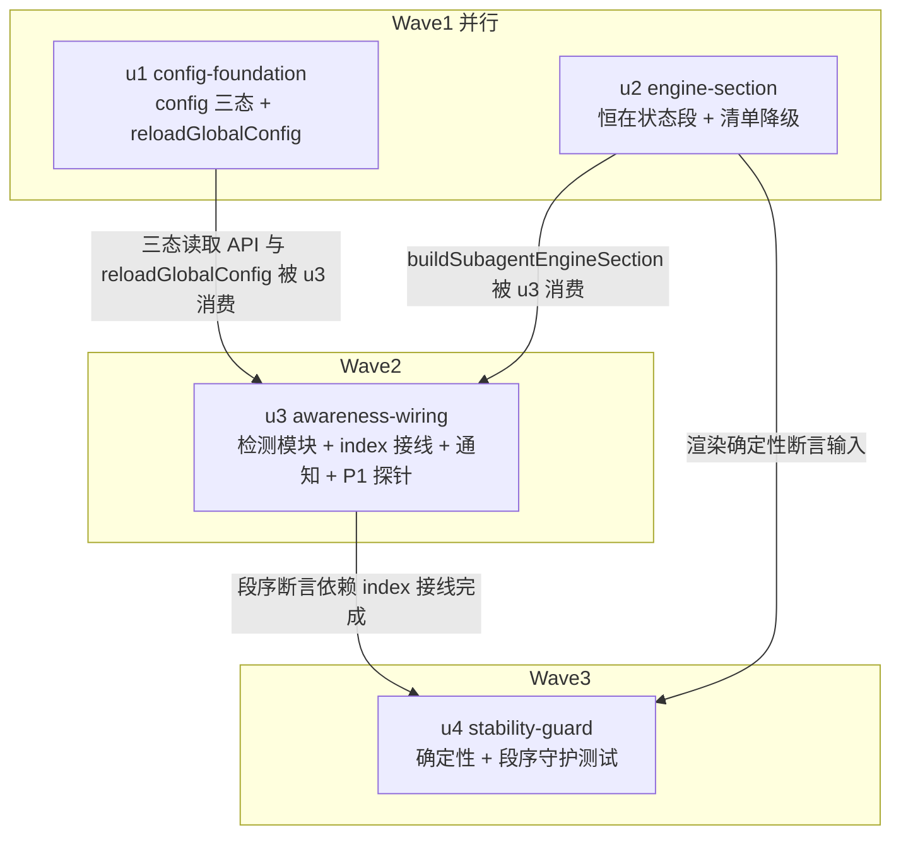

# subagent 引擎感知注入 实施计划

基线: 7ff29c101 | 来源设计: docs/design/subagent-engine-awareness-injection.md | 日期: 2026-08-29

> 审查证据：设计文档已于 2026-08-29 过 tech-design-review 对抗式审查（会话内完成：must_fix=5 / suggestion=6，全部修复后随 7ff29c101 提交，报告全文在当日会话记录）。当前未解决必修项 = 0。

## 0 章节映射

| 内容 | 本文实际位置 |
|------|--------------|
| 背景/目标 | §1 背景目标（SCQA + G1-G4 + In/Out scope） |
| 终态/机制 | §3 解决方案（3.1 终态样例 / 3.3 决策 D1-D8）；§2.3 物理数据流 |
| 验收场景表 | §4 验收（A1-A8 + 小注 1-3） |
| 下一层拆分 | §5 下一层拆分（U1-U5 + 文件改动地图） |
| 待验证检查点 | §5 待验证检查点（P1/P2/P3） |

## 1 目标快照（逐字摘录自设计 §1，禁止改写）

- **G1（初始感知）**：session 首个 turn 起，AI 能从 system prompt 直接读出：当前默认引擎是什么、该引擎下可派发的模型 id 清单、清单适配哪个引擎。
- **G2（变更感知）**：对话中途 defaultEngine 被修改（用户手编 config / 未来 GUI 切换），在**下一个 turn**：AI 收到「引擎已从 A 切到 B」的对话流通知；该 turn 的 system prompt 已是新引擎状态；实际路由（subagent 派发）也按新引擎执行。对齐范围见 D2 的精确声明：**检测到变更的 session 三处同 turn 对齐**；同进程其他 session 在各自下一 turn 对齐。
- **G3（不重复）**：反复切换（A→B→A）不产生重复的模型清单注入；上下文中任意时刻模型清单只存在一份（system prompt 现值）。
- **G4（诚实降级）**：config 读失败、引擎未注册、引擎无凭据模型等异常形态，注入段如实声明，不静默、不伪造。

**Out of scope**：per-agent frontmatter engine 清单标注；派发时点模型预检（A1，独立设计）；GUI 引擎切换写路径；模型清单内容变更通知；全局 AGENTS.md 路由表修订（强伴随条件，另行处理）。

## 2 单元列表

| Unit | 职责 | 领地（精确文件路径，均相对 `extensions/universal/subagent-workflow/`） | 依赖 | 隔离 | 验收条款 |
|------|------|------|------|------|------|
| u1 config-foundation | config 三态读取 API（明确值 / ENOENT→缺省 pi / 读失败）+ read-failure warn 日志 + `ModelConfigService.reloadGlobalConfig()` 公开（initModel 复用之） | `src/execution/config.ts`；`src/execution/model-config-service.ts`；`src/execution/__tests__/config.test.ts`；`src/execution/__tests__/startup-config-declaration.test.ts`（如受影响） | — | plain | ① `npx vitest run src/execution/__tests__/config.test.ts` 绿，含新增三态用例（ENOENT=缺省非失败、坏 JSON=失败、明确值透传）；② `npx tsc --noEmit` 绿；③ 坏 JSON 路径产生 warn 日志（测试断言或探针输出） |
| u2 engine-section | `buildSubagentEngineSection(defaultEngine)` 恒在段（D6 + AGENTS.md 冲突裁决文案）+ 清单段空清单→提示行 + listModels 未实现/返回 null 降级（G4） | `src/execution/engine/model-prompt.ts`；`src/execution/engine/__tests__/model-prompt.test.ts` | — | plain | ① `npx vitest run src/execution/engine/__tests__/model-prompt.test.ts` 绿，覆盖：zcode/pi/ghost 三形态段文案、空清单提示行、null listModels 降级、渲染确定性（同输入两次输出逐字节相等）；② `npx tsc --noEmit` 绿 |
| u3 awareness-wiring | 新检测模块（per-turn 三态 poll + diff + reload 编排 + sendMessage 通知）+ P1 探针定通知路径（主路径或 NOTE 行回退）+ `index.ts:649` handler 替换 + session_start lastEngine 初始化（D1b） | `src/injectors/engine-awareness.ts`（新增）；`src/injectors/__tests__/engine-awareness.test.ts`（新增）；`src/index.ts`；`src/execution/__tests__/before-agent-start-injection.test.ts`（如受影响） | u1, u2 | plain | ① P1 探针真机跑通并留证据（pi rpc + 临时探针扩展，断言 sendMessage 消息是否进本 turn 请求；结论写入汇报）；② `npx vitest run src/injectors/__tests__/engine-awareness.test.ts` 绿，覆盖：变更触发 reload+通知、无变更无事、读失败保持 lastEngine、ENOENT 合法变更、首 turn 无伪通知（D1b）、通知不含模型清单；③ `npx tsc --noEmit` 绿；④ index.ts 只替换 engine handler，其余 4 个 before_agent_start 注册不动（diff 签收） |
| u4 stability-guard | 字节稳定守护测试：段渲染确定性 + 段序（engine 恒链尾） | `src/injectors/__tests__/engine-section-stability.test.ts`（新增） | u2, u3 | plain | ① `npx vitest run src/injectors/__tests__/engine-section-stability.test.ts` 绿：同一 defaultEngine 多次渲染字节稳定；引擎切换只改变尾部段（前缀不变断言）；段序断言 engine 段位于 provider models 段之后；② `npx tsc --noEmit` 绿 |

## 3 DAG 图

worktree 决策：全部 plain。理由：`src/index.ts` 虽为扩展入口（热点文件判据之一），但仅 u3 单元触碰、无并行共改；其余领地互斥；无实验性整体废弃风险。

## 4 测试策略

命令真实来源：`extensions/universal/subagent-workflow/package.json` scripts（`typecheck` / `test`）+ 仓库根 AGENTS.md extensions 三连。

| 层级 | 命令 | 时机 |
|------|------|------|
| 增量（单测文件） | `cd extensions/universal/subagent-workflow && npx vitest run <测试文件路径>` | 每单元开发期 |
| 增量（类型） | `cd extensions/universal/subagent-workflow && npx tsc --noEmit` | 每单元提交前 |
| 波次门 | 仓库根 `pnpm extensions:typecheck` | 每波收口 |
| 全量（收尾） | 仓库根 `pnpm extensions:typecheck && pnpm extensions:lint && pnpm extensions:test` | 阶段 5 Gate A |

真机验收（Gate B，阶段 5，对应设计 §4 A1-A8）：`pi --mode rpc --extension <本地包路径>` + stdin JSONL + 临时 debug 探针（before_provider_request dump system prompt 尾部）。A8 依赖 cache-probe 环境，若不可用按 P3 降级声明。

## 5 合理偏差登记表

（初始为空）

## 6 状态表

| Unit | 状态(pending/in-progress/committed/blocked) | 轮次 | 证据指针 |
|------|------|------|------|
| u1 | pending | 0 | — |
| u2 | pending | 0 | — |
| u3 | pending | 0 | — |
| u4 | pending | 0 | — |

## 7 残留风险与变更历史

- P1（u3 内置探针门）：结果决定通知走主路径还是 NOTE 行回退，两条路径设计均已成立。
- P2（A7 验收）：跨进程双 rpc 时序，预期无害。
- P3（A8 验收）：cache 指纹断点实测依赖 cache-probe，不可用则降级。
- 设计风险节声明的 AGENTS.md 强伴随条件不在本计划领地（Out of scope）。

| 日期 | 事件 |
|------|------|
| 2026-08-29 | 计划创建，基线 7ff29c101 |
