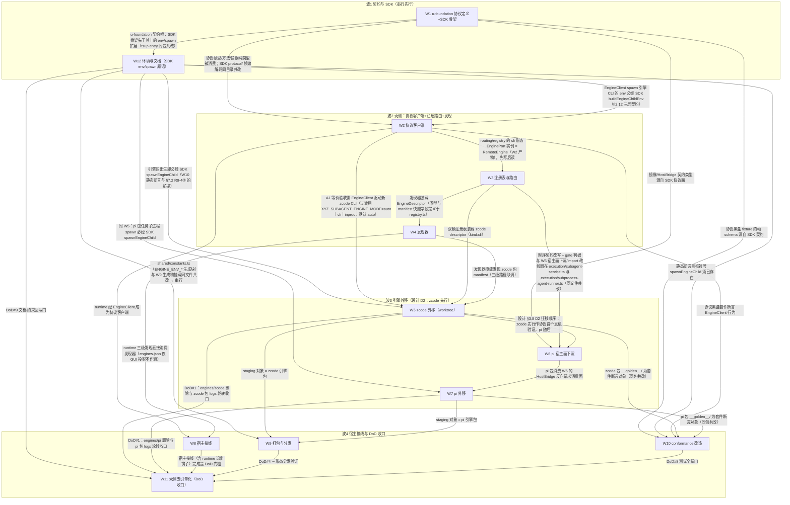

# 子代理引擎协议化与外移 实施计划

基线: df0139a39 | 来源设计: docs/design/subagent-engine-protocolization.md（v11，设计层收敛、实现级细节已下沉本文件） | 日期: 2026-09-08

> 本计划承接设计文档 §5 的 W1–W12 拆分，把**实现级细节**（env 变量名、pidfile 命名、清理谓词、
> conformance 断言形式、措辞限定词）从设计层下沉到本文件。设计文档后续瘦身时以本文件为
> 实现级 SSOT；设计决策本身仍以设计文档为准，本文件不发明新决策。

## 0 章节映射

| 内容 | 设计文档实际位置 |
|------|------------------|
| 背景/目标 | §1 背景目标（SCQA / G1–G6 / 迁移范围硬约束 / in-scope / out-of-scope） |
| 终态/机制 | §3 解决方案（§3.3 协议 / §3.4 发现注册 / §3.5 壳侧边界与 SDK / §3.6 宿主面与生命周期 / §3.7 打包三形态 / §3.8 迁移策略 D1–D6 / §3.9 写入面与代价 / §3.10 不变量） |
| 验收场景表 | §4 验收（A1–A13 + 基线三层 + 探针挂钩） |
| 下一层拆分 | §5 下一层拆分（W1–W12 表 + 排序与版本 + 风险回退 + 三个未知） |
| 待验证检查点 | ①§5 末「最大的三个未知」；②R9 审查残留 6 项（R9-1/2/2b/3/3b/4，见本文件 §7.2）；③RSS 量级实测回写（§3.6 表）；④事件 IPC 开销探针（§3.9 代价①） |

## 1 目标快照

> 逐字摘录自设计文档 §1（禁止改写；验收条款回溯锚点）。2026-09-08 重设计逐字核对：以下五块与设计文档 v11 文本一致（仅加粗）——①一句话结论（设计文档卷首语）②设计目标 G1–G6 表 ③迁移范围硬约束 ④in scope ⑤out of scope；核对发现的计划自加词（迁移范围句尾「（九条 DoD 硬门）」、漏抄的「（§5 末）」）已改正。

**一句话结论**：把 subagent-core 从「内建多引擎实现」改成「**引擎协议 + 编排壳**」——core 只保留路由 / 公共降级层 / journal / record / 协议客户端 / conformance 套件；每个引擎成为独立 CLI 包（`pi-subagent-cli` / `zcode-subagent-cli` …），用**元数据自注册**（package.json manifest + 配置覆盖）挂进 core 的引擎注册表，core 通过 **NDJSON stdio 协议**驱动它们。新增引擎 = 装一个包，**不再改 subagent-core**。

**设计目标**：

| # | 目标 | 视角 |
|---|------|------|
| G1 | 新增引擎零改 core | 接入者：写一个 npm 包（CLI 入口 + manifest），装上即出现在引擎选择器并可用 |
| G2 | 引擎与 core 解耦演进 | 接入者：引擎包按自己节奏发版；协议版本协商 + conformance 套件守契约 |
| G3 | 宿主/使用者零感知 | 使用者：subagent / workflow 的入参、返回、GUI 展示、record、历史详情完全不变 |
| G4 | 故障隔离 | 使用者：引擎进程崩溃/挂死只影响该引擎在途任务，不拖死宿主与其他引擎 |
| G5 | 现有能力零回归 | 使用者：pi / zcode 迁移后行为等价（事件、abort、凭据、池化、历史读取、chat 续聊） |
| G6 | 三形态分发一致 | workspace 开发态、Electron 打包态、npm + zsw vendor 态下发现与运行一致 |

**迁移范围（用户裁决 2026-09-08，硬约束）**：**`pi` 与 `zcode` 两个引擎都必须完成外移**，**不允许任何内置引擎例外**。驱动细节重写归各自提取设计（§5 末），但「迁移完成」属本设计验收范围，完成定义见 §3.8 D6。

**in scope**：引擎协议 v1；引擎 SDK 包；core 壳侧边界；发现与注册（manifest + 配置 + 搜索路径 + 时机）；引擎进程生命周期；三个宿主的接线与改动清单；打包与分发三形态；迁移策略与回退；conformance 套件；错误规格与恢复指引；宿主伴生写入面登记。

**out of scope**：① 具体引擎的驱动细节重写——归各自提取设计；细节外置**不豁免** DoD；② 引擎协议的**网络/远程**形态（v1 只做本机 stdio）；③ 引擎市场 / 自动下载安装（v1 只做「本地已安装包的发现」）；④ EnginePort 成员签名变更（本设计不改签名，只改「谁实现它、跑在哪」）；⑤ `~/.zcode/cli/{artifacts,exec,log,…}` 伴生写入面治理（由 `zcode-session-db-isolation.md` §2.4.1 登记）。

## 2 单元列表

| Unit | 职责（摘要） | 领地（精确文件路径） | 依赖 | 隔离(plain/worktree) | 验收条款 |
|------|--------------|----------------------|------|------|----------|
| **W1 协议定义 + SDK 骨架（u-foundation）** | engine-protocol v1 帧型/方法/错误码/版本常量/JSON Schema + 边界守卫 | 新建 `packages/subagent-engine-sdk/src/protocol/`（`engine-protocol.ts` 等）；新建 SDK 原语模块（设计 §3.5.1 D7 内容表承接，源 core 公共层迁出）：`packages/subagent-engine-sdk/src/schema-emulation.ts`、`src/nesting-guard.ts`、`src/logger.ts`（日志 facade）、`src/kill-chain.ts`、`src/journal-replay.ts`、`src/data-dir.ts`（`resolveEngineDataDir`）、`src/paths.ts`（`resolvePoolDir`）；新建 `.githooks/check-engine-sdk-boundary.mjs`；新建 `packages/subagent-engine-sdk/package.json`、`tsup.config.ts` | —（**u-foundation 共享契约根**：DAG 唯一根；帧型/方法/错误码/JSON Schema/类型闭包引擎面子集被 W2–W12 全部单元消费，**串行先行**，见 §3/§7.4③） | plain | A4/A6；§2.1 规格 |
| W2 协议客户端 | `EngineClient` + `RemoteEngine implements EnginePort` + 同步成员形态映射 | 新建 `packages/subagent-core/src/execution/engine/client/`（`engine-client.ts` / `remote-engine.ts` / `mirror.ts` 等）；`packages/subagent-engine-sdk/src/protocol/`（帧编解码） | W1、W12（`buildEngineChildEnv` 先于 EngineClient spawn 路径） | plain | A1/A6/A8/A13；§2.2 规格 |
| W3 注册表与路由 | `EngineDescriptor` 双模 + manifest 快照 + D4 缺省引擎 + 时序契约改写 + 契约变更④⑤ | 既有 `packages/subagent-core/src/execution/engine/registry.ts`、`routing.ts`；`packages/subagent-core/src/execution/subagent-service.ts`、`packages/subagent-core/src/execution/subprocess-agent-runner.ts`（精确路径，不用 `orchestration/**` 宽 glob——该目录是 workflow 编排域 30+ 文件，与引擎路由无关）；`packages/subagent-core/src/execution/engine/common/capability-gate.ts`、`engine/model-validation.ts` | W1、W2（cli 形态 EnginePort 实例 = RemoteEngine，先写后读） | plain | A2/A3/A4/A6/A12；§2.3 规格 |
| W4 发现器 | manifest 解析 + 三级搜索路径 + engines.json 投影 + 冷启动回退源单源化 | 既有 `packages/subagent-core/src/execution/engine/engine-discovery.ts`；新建 `engine-discovery-scan.ts`、`config.ts`（`engines{}` 段）；`packages/subagent-core/src/core/host-services.ts`；`extensions/universal/subagent-workflow/src/host/pi-host.ts`；`packages/runtime/src/services/session/session-records.ts`；两个守护测试（改写归本单元，非 W10 目录迁移）：`extensions/universal/subagent-workflow/src/__tests__/engines-declaration.test.ts`、`packages/runtime/src/__tests__/session-service-engine-config.test.ts` | W1、W3（发现器装载 EngineDescriptor，类型定义于 registry.ts） | plain | A4/A11/A12；§2.4 规格 |
| W5 zcode 外移 | 新建 `@zhushanwen/zcode-subagent-cli` 包，搬 `engines/zcode/` + 前置文档改动 | 新建 `packages/zcode-subagent-cli/`（`src/` + `bin` + package.json manifest + `__tests__/` 接收 `engines/zcode/__tests__/` 16 个测试文件与 `__fixtures__/`）；删除过渡完成后 `packages/subagent-core/src/execution/engine/engines/zcode/`（生产 10 个 .ts + 测试目录） | W1–W4、W12（SDK `spawnEngineChild` 先行） | **worktree**（整包搬移属实验性大改，§7.4⑥） | A1/A5/A9；§2.5 规格 |
| W6 pi 宿主面下沉 | `PiEngineService` 9 成员拆 HostBridge + `spawnedChildren` 状态镜像（前置，强制） | 既有 `packages/subagent-core/src/execution/subagent-service.ts`、`execution/engine/engines/pi/pi-engine.ts`、`session-runner.ts`；`packages/subagent-core/src/execution/lifecycle-predicates.ts`（拆依赖，行为不变）+ `packages/subagent-core/src/execution/__tests__/lifecycle-predicates.test.ts`（随谓词改写，归本单元非 W10）；`packages/subagent-core/src/execution/subprocess-agent-runner.ts`（深路径 import 改线，见 §2.6 末条——与 W3 共改同文件，由 W3→W6 串行边保证） | W1–W3、W5（设计 §3.8 D2：zcode 先行首个真机验证） | plain | A2/A3/A8 前置；§2.6 规格 |
| W7 pi 外移 | 新建 `@zhushanwen/pi-subagent-cli`（依赖 W6 产物） | 新建 `packages/pi-subagent-cli/`（含 `__tests__/` 接收 `engines/pi/__tests__/` 3 个测试文件：pi-engine / reader / spawn-opts-direct）；搬移源 `packages/subagent-core/src/execution/ui-request-queue.ts`（H8 表新增行，5 处 core 侧依赖处置见 §2.7；其直接测试 `packages/subagent-core/src/execution/__tests__/ui-request-queue.test.ts` 随迁本包领地，R2 MF-X2）；删除过渡完成后 `packages/subagent-core/src/execution/engine/engines/pi/`（生产 12 个 .ts + 测试目录） | W6、W12（SDK `spawnEngineChild` 先行） | plain | A2/A3/A9；§2.7 规格 |
| W8 宿主接线 | runtime 成为协议客户端 + 扩展依赖声明 + D8 兼容公共面 + relay 透传 | 既有 `packages/runtime/src/services/session/subagent-engine-history.ts`；`packages/subagent-core/src/index.ts`；`extensions/universal/subagent-workflow/package.json`；`packages/subagent-core/src/execution/relay-env.ts`；`packages/runtime/src/index.ts`（`shutdown()` 退出钩子） | W2/W4 | plain | A7/A11；§2.8 规格 |
| W9 打包与分发 | 引擎包 staging + 启动解析二维矩阵 + 数据根注入矩阵 + 新守卫 | `scripts/bundle-extensions.mjs`、`scripts/validate-runtime-bundle.sh`、`scripts/postbuild-validate.sh`、新建 `scripts/check-engine-package-boundary.mjs`；`apps/electron/electron-builder.yml`；`packages/shared/src/constants.ts`（生成物挂载；与 W12 的 ENGINE_ENV_* 生成块同文件，串行边 W12→W9 保证）；runtime 侧 `XYZ_AGENT_ENGINE_ROOTS` 推导代码（新建独立模块 `packages/runtime/src/services/session/engine-roots.ts`，不与 W4/W8 领地相交；若实现时并入既有文件须回写本表）；守卫挂载注册文件：`.githooks/install-hooks.sh`（pre-commit 挂载链，参照 `check_spawn_env_boundary.py` 在该脚本 :634 的既有挂载模式）与 `.github/workflows/ci.yml`、`build.yml` 的 invariants job（新守卫挂载落点） | W1/W5/W7、W12（常量生成块先行） | plain | A5/A11；§2.9 规格 |
| W10 conformance 改造 | 协议黑盒套件 + 基线三层 + 录制/复跑 + H9 测试面迁移 | 既有 `packages/subagent-core/src/execution/engine/__tests__/conformance/*`；新建 fixture 目录 `packages/subagent-core/src/execution/engine/__tests__/conformance/__fixtures__/engine-protocol/`；各引擎包 `__golden__/`；**core 测试处置面**（深路径 import 测试的三选一改写/迁移，见 §2.10 清单）：`packages/subagent-core/src/__tests__/`、`src/execution/__tests__/`（排除 `lifecycle-predicates.test.ts`——归 W6）、`src/orchestration/__tests__/`、`src/execution/engine/__tests__/`（排除 conformance）；两个守护测试不在本单元领地（改写归 W4，非目录迁移）；`packages/subagent-core/package.json`（新增 `record:engine-fixtures` / `test:engine-protocol` scripts） | W1/W2/W5/W7、W12（静态断言目标符号 `spawnEngineChild` 须已存在） | plain | A1/A2/A4/A9；§2.10 规格 |
| W11 壳侧去引擎化（DoD 收口） | 清 H1–H4/H8/H11 + 删内建与 inproc + stderr 轮转引擎侧自实现 | 既有 `packages/subagent-core/src/execution/engine/common/session-view-service.ts`；`packages/subagent-core/src/index.ts`、`package.json`、`tsup.config.ts`；`packages/runtime/tsup.config.ts`；`scripts/validate-runtime-bundle.sh`；`scripts/smoke-core-dist.mjs`（H3 同批改造，见 §2.11）；`eslint.config.mjs`（引擎精确路径 override 迁移，见 §2.11）；`packages/subagent-core/src/execution/subprocess-agent-runner.ts`（删深路径残余 import，W6 改线后收口）；引擎包日志模块（`packages/zcode-subagent-cli/src/logs/`、`packages/pi-subagent-cli/src/logs/`） | W5/W7/W8/W9/W10/W12 | plain | A5/A9/A11/A13；§2.11 规格 |
| W12 环境与文档 | `buildEngineChildEnv` 三层 env + 守卫扩展 + env 文档/约束回写 | 新建 `packages/subagent-engine-sdk/src/env.ts`、`src/spawn.ts`（`spawnEngineChild`）；`packages/shared/src/constants.ts`（ENGINE_ENV_* 生成块，与 W9 行区间互斥、串行边保证）；`.githooks/check_spawn_env_boundary.py`、`.githooks/check_env_whitelist_sync.py`；`packages/subagent-core/src/execution/worktree-manager.ts`、`packages/subagent-core/src/execution/worktree-git-ops.ts`（R3 MF-C：两处 git execFile 采纳 `buildOutboundChildEnv`，见 §2.12——当前计划无其他单元触碰这两文件，无领地交集）；`packages/shared/src/spawn-env-contract.ts`（env SSOT 登记表，`XYZ_ZCODE_CLI` 等条目 anchor 回写）；`docs/design/env-propagation-boundary.md`；`docs/constraints.json` + `scripts/render-constraints.mjs` | W1（**紧随其后**：SDK 原语先于全部消费方 W2/W5/W7/W9/W10） | plain | A6/A9；§2.12 规格；**worktree 行为改动回归（R4-S①）**：创建 worktree 走通 + hooks 子进程 env 抽查无 deny 键（集成断言或演示步骤，防 W12→W11 验收空档） |

> 隔离：**W5 = worktree**（整包搬移属实验性大改），其余单元 plain——逐单元结论与理由见 §7.4 自检⑥；热点公共文件 `execution/subagent-service.ts` 与 `execution/subprocess-agent-runner.ts` 由 W3→W6 串行边保证不并发共改（W3 先改时序契约/gate 判据，W6 后做 pi 宿主面下沉与 import 改线；`execution/subprocess-agent-runner.ts` 的残余删除在 W11，由 W6→W7→W11 传递链串行）。并行收口批 = W8/W9/W10（W12 已前移至 W1 之后，见 §3 排序说明与 §7.3 变更历史）。
>
> u-foundation 固定为共享契约根节点（类型/接口模块），初始即就绪的 DAG 根 = W1。

### 2.1 W1 协议面规格（帧字段级）

**传输**：stdio NDJSON（每行一个 JSON 对象）。**帧型四类**：

```jsonc
// ① 请求（core → 引擎）
{ "id": 1, "method": "run", "params": { ... } }
// ② 应答（引擎 → core）
{ "id": 1, "result": { ... } } | { "id": 1, "error": { "code": "...", "message": "...", "recovery": "...", "data": {...} } }
// ③ 通知（引擎 → core，无 id）
{ "method": "event", "params": { "runId": "...", "seq": 1, "event": { "type": "text_delta", "delta": "..." } } }
// ④ 反向请求（引擎 → core，必须应答）
{ "id": "rev-1", "method": "host/askUser", "params": { ... } }
```

**反向请求超时二分**（帧④注释，R9-2 关联）：
- 数据面类（`host/log` / `streamDelta` / `poolResolved` / `handleReady` / `childSpawned` / `childStateChanged`）：10s 未答 = 引擎故障 → 杀进程 + 在途 run 失败；
- 人机交互类（`host/askUser` / `host/permission`）：**不设统一超时**——core 先回 `{ack:true}`，结果异步到达；按 ADR-0047「静默 ≠ 卡死」用无进展检测/用户取消，不据此判引擎故障。

**10 正向方法**（帧字段，v1）：

| 方法 | params → result |
|------|-----------------|
| `initialize` | `{protocolVersion, hostInfo:{name,version,dataRoot}, engineConfig}` → `{protocolVersion, engineId, engineVersion, adapterVersion, capabilities, models?}`；应答**仅诊断**（与 manifest 不一致 → warn 留痕）；`engineConfig` = L3 显式配置 `engines.<id>.config`（`Record<string,string>`，缺省 `{}`，不放凭据）；版本越界 → `engine_protocol_mismatch` |
| `probe` | `{force?}` → `ProbeReport` |
| `run` | `{runId, task, ctx:{poolKey, cwd, model?, schemaEnv?, ctxModel?, engineFallback?, streamMode?}}`；期间发 `event` 通知；终态应答 `{handle, outcome}` |
| `cancel` | `{runId, reason}`；引擎须 3s 内收敛终态；超时 core 走杀链 |
| `interact` | `{handle, action}` → `InteractResult` |
| `read` | `{handle, dataDir}` → `SessionView`（`dataDir` **必填**：存量池时代相对 `dbPath` 需要它） |
| `listModels` | `{}` → `{models: [...] \| null}`（诊断面；宿主侧同步成员读 manifest，不经本方法） |
| `validateModel` | `{modelRef?}` → `{canonicalRef}`（诊断面；同上） |
| `dispose` | `{}` → `{ok:true}`；幂等 |
| `ping` | 健康检查（ADR-0047：静默 ≠ 卡死，不据此杀任务） |

**8 反向通道**：`host/log`、`host/askUser`、`host/permission`、`host/streamDelta`、`host/poolResolved`（**journal 落盘路径单一权威，须在首个事件 emit 前调用**）、`host/handleReady`、`host/childSpawned`（载荷 = 一次性子进程 pid，用途 = `isResumable` 镜像谓词 + 诊断留痕；**不供杀链/收割**；常驻进程不报，归 `dispose`）、`host/childStateChanged`（载荷 `{pid, recordId, state: running\|exited, killed: boolean, exitCode?, signal?}`——**`killed` 必含**，判据 `child !== undefined && !child.killed`）。未实现的交互能力回 `{unsupported:true}`。

**版本协商**：`ENGINE_PROTOCOL_VERSION = 1`（core 支持 `>=1 <2`）；越界 → `engine_protocol_mismatch`（含双方版本 + 升级指引），该引擎标记不可用。

**错误码表**：`engine_not_found` / `engine_protocol_mismatch` / `engine_capability_unsupported`（core gate 同步拦生成，非引擎帧透传）/ `engine_capability_mismatch` / `engine_model_unknown` / `engine_model_mismatch` / `engine_handshake_timeout`（10s）/ `engine_crashed`（附 stderr 尾 400 字符；重建最多 3 次指数退避 1s/2s/4s）/ `engine_probe_failed` / 其余 `engine_*` 透传。

**背压与流分工**：stdout 独占 NDJSON（行解析器；core 读慢靠 OS 管道背压，不做无界缓存）；stderr 常驻排空（内存环形缓冲尾 400 字符，崩溃现场由 `engine_crashed` 携带；**宿主侧不落盘**）。事件合并默认关闭（`XYZ_ENGINE_EVENT_COALESCE=0`）。

**守卫基线**（挂 W1 验收，新增 SDK 代码前先建守卫）：
- `check-engine-sdk-boundary.mjs`：SDK 源码 + dist 无 `@zhushanwen/subagent-core` 包名、无指向 `packages/subagent-core/**` 的越界相对路径（不变量「SDK 不得 import core」）；
- 类型闭包处置（逐项，设计 §3.5.1 表）：`execution/types.ts` 只抽引擎面最小契约子集（`AgentEvent`/`EngineHandleData`/`SessionView`/`EngineCapabilities`/`ProbeReport`/`InteractAction`/`AgentCallOpts`/`EngineOutcome` 结构子集）入 SDK，域类型（`ExecutionRecord`/`Turn`/`AgentFailureKind`/`WorktreeHandle`）留 core、SDK 用结构等价类型；`AgentCallOpts` 引擎面子集入 SDK + core 反向 re-export；`model-resolver.ts` 留 core；`paths.ts`（`resolvePoolDir`，纯 `node:path`）移入 SDK；`@xyz-agent/extension-protocol` 留 core 不引用；**`execution/dialog-queue.ts` 的 UiRequest 三类型（R3 S-A，`dialog-queue.ts:113/:150/:159` 实测，该模块是 `UiRequest`/`UiResponse`/`UiRequestHandler` 的规范来源；R4-S③ 补连带 `UiMethod` `:94`——`UiRequest.method` 的依赖类型，包外零消费方）入 SDK 类型闭包**：落点 = 新建 `packages/subagent-engine-sdk/src/ui-types.ts`（结构等价类型），core 侧 `dialog-queue.ts` 改为再导出 SDK 类型（`export type { UiRequest, UiResponse, UiRequestHandler } from "@zhushanwen/subagent-engine-sdk"`，队列实现本体留 core——§2.7 MF-X2 既定决策），双向可赋值断言（`AssertMutuallyAssignable`）挂进既有 `pnpm --filter @zhushanwen/subagent-core typecheck` 断言族（与上文类型闭包断言同族）；
- core 侧**双向可赋值断言**（`type _A = AssertMutuallyAssignable<CoreX, SdkX>`）纳入 `pnpm --filter @zhushanwen/subagent-core typecheck`——否则结构等价类型漂移编译期抓不到；
- **原语迁移处置（逐项，设计 §3.5.1 D7 内容表，承接于本单元领地——zcode 引擎现以 7 处静态 import 消费这些 core 公共层（`zcode-engine.ts:45-51/64`、`connection.ts:42-43`），外移后禁 import core，不迁必编译失败）**：
  - `schema-emulation` / `nesting-guard` / 日志 facade（`src/logger.ts`）：无 core 内部依赖 → **直接搬**入 SDK；
  - `data-dir`（`resolveEngineDataDir`）：今天 `data-dir.ts:23` import `core/host-services.ts` → **拆 seam**——SDK 版参数化/env 优先，core 侧保留 `getHostServices()` 绑定；
  - `journal-replay`：**纯投影部分**（entry → record 的 reducer）下沉 SDK，journal I/O 与②级降级链留 core；
  - `kill-chain` **引擎侧部分**：今天 import `orchestration/models/types.ts` + `registry.ts`（`DEFAULT_ENGINE_ID`）+ `core/logger.ts` → 契约类型随 SDK 下沉、`DEFAULT_ENGINE_ID` 改**参数注入**、logger 走 SDK facade；
  - `paths.ts`（`resolvePoolDir`，纯 `node:path`）→ **移入 SDK**（引擎侧需自算池/journal 路径；与上文类型闭包处置一致）。
  - DAG 一致性：W5/W7 对这些 SDK 原语的消费经既有传递链 **W1→W12→W5 / W1→W12→W7** 覆盖（原语随 W1 建、W12 的 env/spawn 原语同包共改且已先行于 W5/W7），无需新增显式边——结论登记见 §7.4①。
  - **SDK tsup entry 显式登记（R2 S-Y2；R3 S-A 增 `ui-types.ts`）**：`packages/subagent-engine-sdk/tsup.config.ts` entry 覆盖 = `protocol/` + 7 原语模块（schema-emulation / nesting-guard / logger / kill-chain / journal-replay / data-dir / paths）+ `ui-types.ts` + `env.ts` + `spawn.ts`——逐个具名；后续新增模块必须同步登记 entry（W12 扩 env/spawn 时同守卫核对）；

### 2.2 W2 协议客户端规格

**`EngineClient`**（core 新增，与 `AppServerConnection` 同型但引擎无关）：spawn / 帧编解码 / 请求关联 / 反向通知路由 / 崩溃重建 / dispose / killAll / stdout 行解析 + stderr 常驻排空（仅内存环缓冲）。

**core 侧 `host/askUser` 应答端接线（R2 MF-X2 认领，落点 = 本单元领地 `execution/engine/client/`）**：EngineClient 反向请求路由器把帧④ `host/askUser` 转发至 core `uiRequestHandler` 注入点（`subagent-service.ts` `init.uiRequestHandler`，[D4-④] 唯一注入入口），先回 `{ack:true}`、结果异步应答（R9-2 语义）；`ui-request-queue.ts` 迁 pi 包（W7）后该路由即 core 壳侧 ui 请求的唯一应答端；W6 拆 HostBridge 时同步接线（同热点文件由 W3→W6 串行边覆盖）。

**spawn 平台参数（必写死）**：
- POSIX：引擎 CLI 以独立进程组 spawn（`detached:true`）；
- Windows：`detached:false` + `windowsHide:true`（避免 console 窗口闪现），收割走 `taskkill /PID <pid> /T /F`（按 pid 树杀，不依赖进程组）。

**进程组收割（单一机制，v6 已删按 pid 补杀）**：引擎进程 exit / 重建 / `dispose` / `killAll` 时——POSIX `process.kill(-pid)` 负 pid 组杀；Windows `taskkill /T /F`。收割/镜像「零残留」断言范围 = **一代子进程 + 组内后代**（§7.2 R9-1：引擎自身 detached 后代不覆盖，属设计 §3.9 已接受代价，验收文案统一带此限定词）。

**镜像失效语义（必写死）**：
- 未收 `childSpawned` 前 = 无句柄（对齐 `getChildByRecord` undefined）；
- 引擎进程 exit / 重建 / `dispose` / `killAll` 时把该引擎**全部镜像项整体置死**（`killed=true` + 广播状态变更）——否则 `notify-host` 60s 合并窗口挂住 / `idle-gc` TTL 不触发 / `resumable` 说谎 / 续聊被拒；
- 引擎崩溃后镜像清空，`isResumable` 回落「无句柄」。

**`RemoteEngine` 同步成员形态映射（必写死）**：
- `capabilities()`：直读 manifest（注册期，无缓存）；
- `listModels()`：manifest **省略 `modelCatalog`（或 `models: null`）** → 成员不实现/返回 `null`（→ `buildCoreAlignedHint`）；**显式 `models: []`** → 返回 `[]`（→ `buildEmptyModelsHint`）；数组 → 原样返回；
- `validateModel()`：同源 manifest；省略 `modelCatalog` → 成员不实现（`typeof validateModel !== "function"` → 跳过校验，等价恒放行）；显式声明 → 按 `dynamic` 判（未命中且 `dynamic:false` → `engine_model_unknown` 同步拒；`dynamic:true` → 放行，运行期 `engine_model_mismatch`）。

**pidfile（实例维度命名 + 三条件清扫）**：
- 文件名 `<engineDataDir>/engines/<id>/engine.<hostKind>.<hostPid>.pid`（pi 宿主与 runtime 各写自己的文件，**不得共用 `engine.pid`**——last-writer-wins 会误杀对方存活实例）；
- 写入时机 = spawn 成功后原子写，**内容含 `enginePid` / `hostPid` / `engineStartTime`**（§7.2 R9-3b：清扫时与目标 pid 实际启动时间比对，同 cmdline 的 pid 复用由此识别；Windows 无可移植判据取安全方向 = **不杀只删**）；清理时机 = 引擎自灭 / dispose / 宿主正常退出；
- 启动期扫同 id 全部 pidfile，**三条件同时成立才杀**：pid 存活 + cmdline 身份校验（复用 `readProcessCmdline` 先例，防 pid 复用误杀）+ 该 pidfile 所属宿主 pid 已死（`process.kill(hostPid,0)`）；
- **§7.2 R9-3（pid 复用保守方向 + 陈旧 pidfile 删除通道）**：三条件中任一不确定（尤其 cmdline 校验不通过、宿主 pid 复用疑似）→ **保守跳过不杀**；三条件判定不成立（pid 已死 / cmdline 不符 / `engineStartTime` 不匹配）的 pidfile 属陈旧文件 → **启动清扫时删除该文件**（否则宿主每次崩溃重启新增一个 pidfile、无限堆积）；删除不设数量上限，判定即删（陈旧文件无杀风险）；宿主 pid 复用导致「宿主 pid 已死」误判为存活 → 同样保守跳过 + 保留文件（下轮再清）。

**引擎自灭（宿主崩溃反向兜底，宿主侧不实现，由 SDK 在引擎 CLI 侧实现——本单元负责 core 侧配套：spawn 时不覆写、stdin 管道独占）**：
- **主判据 = stdio 控制通道断开**（宿主 `kill -9` 时 stdin 必然 EOF / 写端 EPIPE）；**不得实现成「无反向流量即自杀」**（ADR-0047 反向通道版）；
- **辅助判据** = in-flight 反向请求（已发出未应答）计时超时，缺省 30s，读 `XYZ_ENGINE_HOST_REQUEST_TIMEOUT_MS`；
- **§7.2 R9-2 边界**：已 ack 的 `host/askUser` 异步等待**不计入**超时（ack 后属人机交互等待，非 in-flight）；
- **§7.2 R9-2b 边界**：长运行 `HostBridge.executeAndAwait` 反向请求**不计入** 30s 自灭计时——该请求走 ack 两阶段（core 收即回 `{ack:true}`，`AgentResult` 在任务完成时异步到达；in-flight 窗口 = 整个任务时长，按字面计时 = 每个 >30s 的 pi 任务被引擎自灭，`turnTimeoutMs` 同型事故）。本单元承接 = `EngineClient` 超时域划分：快答数据面（10s）/ 人机交互面与长运行 HostBridge 面（ack 两阶段，不参与引擎侧 30s 计时）；
- 自灭执行 = 引擎自杀并杀自己进程组（与 dispose 同一条路径）；
- **§7.2 R9-4②（stdin fd 不外泄）**：`spawnEngineChild`（W12 SDK 原语）spawn 引擎一代子进程时**不得把引擎自身的 stdin fd 传给后代**（stdio 数组对子进程 stdin 用 `'ignore'`/自有 pipe）——否则宿主死后代仍持写端、EOF 永不到达，自灭主判据失效；挂 W12 实现断言 + A8④ 真机断言（宿主 kill -9 后引擎在阈值内自灭即隐式验证 fd 未外泄）。

**验收条款**：A1①协议层结构等价；A6①②⑤⑥⑦；A8①②③④（含「静默长任务 >30s 无反向流量不被自灭」负向 + ack 的 `host/askUser` 等待不被判超时 + §7.2 R9-2b 负向「>30s 的 pi 任务不被自灭」）；A13②；§7.2 R9-3b（同 cmdline 复用不误杀、陈旧 pidfile 被 unlink）。

### 2.3 W3 注册表与路由规格

- `EngineDescriptor` 双模：`{kind:"inproc", factory}`（过渡期）与 `{kind:"cli", command, args, capabilities}`（目标）；上层 `getEngine(id)` 返回代理，两形态透明；
- manifest 能力位**快照**（session_start 扫描所得，非握手缓存）；同步成员源 = manifest 快照直读；
- D4 缺省引擎规格：`DEFAULT_ENGINE_ID` 语义改「配置的缺省引擎 id」；加载期不在已发现清单 → warn + 回落**第一个可用引擎**（manifest `displayName` 稳定序）+ record 留痕；全不可用 → 派发期 `engine_not_found`（列出「未发现任何引擎包」+ 安装指引）；`fallbackTargetId()` 恒 'pi' 改「首个可用引擎」，无则直接报错；
- `routeEngineForHost` pi 同步短路改**代理形态**：构造同步、不读 descriptor、缺包/坏包不在构造期 throw（descriptor 首次使用才解析）；`routing.test.ts:260-268`「非 Promise」断言保留；
- §3.5.3 时序契约同批改写：`routing.ts:258` / `subprocess-agent-runner.ts:142`「run 内首个 await 前已触达 `executeAndAwait`」作废 → 改「首个 await 前完成路由决策；执行经进程边界，时序契约由本设计放宽」；
- **契约变更④（无斜杠 `canonicalRef`）**：改 `resolveIdentityForEngine`（`subagent-service.ts:1918-1927`）与续聊回读（`:1398-1405`）——无斜杠 ref 按 `provider=""`、`id=ref`、整串进 `name` 处理，不落 `"<ref>/"` 畸形；
- **契约变更⑤（run 期失败清理前置副作用）**：`finalizeFailed` 补清理 `kickOffEngineRun` 前已建的 worktree/池（`subagent-service.ts:2053-2077` 创建点）；
- 被 gate 四类判据（读 `capability-gate.ts:58/67/76/84`）：`conversation`（conversation 形态）/ `steer`+`conversation`（fork，OR 语义任一可用即放行）/ `maxTurns` / `sandbox`（worktree）——manifest 权威，少声明 → 首个调用同步拒 `engine_capability_unsupported` + 恢复指引「修 manifest / 升级引擎包」；多声明 → run 期 `initialize` 发现 → `engine_capability_mismatch` + 清理前置副作用；非 gate 位不一致（无论强弱）一律 warn 不阻断；
- 注释回写（同批）：`model-validation.ts:10-12/48`、`capability-gate.ts:16-17`、`subagent-service.ts:2005-2009`、`routing.ts:254-260`、`subprocess-agent-runner.ts:140-154`、`port.ts:194`。

### 2.4 W4 发现器规格

- **manifest schema 字段级**（引擎包 package.json `xyz-agent.subagentEngine`）：`id` / `bin` / `protocol`（必需；缺失 → warn 跳过该包；protocol 不兼容 → 标记不可用）、`capabilities`（必需，至少 `schemaEnforcement`/`conversation`/`maxTurns`；缺键取最保守值 `unsupported`/`false` + warn；未知键忽略 + warn）、`envPrefixes`（可选，缺省 `[]`；拒 `""` / 含 `*` / 非法形态 `^[A-Za-z0-9_]+$`（大小写不敏感）/ 保留前缀 `XYZ_`/`XYZ_AGENT_`/`XYZ_SUBAGENT_` → 丢弃该前缀 + warn 包仍可用）、`modelCatalog`（可选；缺省 = **不注入**，descriptor 保留 `undefined`；`null` 合法等价省略；`models: []` 仅作者显式声明；`dynamic` 缺省 `true`）、`displayName`/`description`（可选，缺省 = `id`）；
- **三级发现**：L1 宿主发现根 env `XYZ_AGENT_ENGINE_ROOTS`（分隔符 = `path.delimiter`；去重、大小写敏感、非绝对路径丢弃 + warn）+ `HostServices.discoveryRoots()` 新增 `engines` kind；L2 node 解析（宿主 `node_modules` `require.resolve`；打包态与 zsw vendor 态无效）；L3 显式配置 `subagents/config.json` → `engines: {"<id>": {command, args, config, cwd, enabled}}`（无 `env` 键——v6 已删 extras；`config` 经 `initialize.engineConfig` 透传，引擎不实现消费即死键）；
- 发现时机：与 `syncEnginesFile` 同点 session_start 扫描一次 + 缓存；`hasEngine()` 查快照，未命中触发一次同步补扫（只读 manifest 不握手）；
- `engines.json` 投影：清单 = 已发现且可执行的 id 数组；契约 `{v:1, engines: string[]}` 不改；每次 session_start 幂等写（内容不变零写）；**冷启动回退源 = runtime 自身发现结果**（无静态 JSON 兜底；零命中返回空清单 + 「未发现任何引擎包」状态）；改两个守护测试 `engines-declaration.test.ts` / `session-service-engine-config.test.ts`（归本单元 W4 领地，非 W10 目录迁移）；
- 冲突与失败：manifest 缺字段/不可解析 → warn 跳过；同 id 覆盖 → info 留痕；`bin` 不存在/不可执行 → 标记不可用（不进清单）。

### 2.5 W5 zcode 外移规格

- 新建 `packages/zcode-subagent-cli`：搬 `packages/subagent-core/src/execution/engine/engines/zcode/`（10 个生产 .ts + `__tests__/` 16 个测试文件与 `__fixtures__/`）+ `zcode-session-db-isolation.md` 的前置改动（落在本包内）；package.json 按 §2.4 manifest schema（`id: "zcode"`、`envPrefixes: ["ZCODE_"]`、`modelCatalog` 构建期生成 `pnpm --filter <pkg> gen:model-catalog`）；
- 引擎包只依赖 SDK（不依赖 core）；`appserver-launcher.ts` wrapper、凭据 fs 拦截注入、池/HOME 隔离随包迁移；
- 过渡期 core 保留内建（`XYZ_SUBAGENT_ENGINE_MODE=auto|cli|inproc`，默认 auto，设计 D3），DoD 后 W11 删除。

### 2.6 W6 pi 宿主面下沉规格（强制前置）

- `PiEngineService` 9 成员 + 宿主全局状态逐条归属（设计 §3.8 D2 表）：`executeAndAwait` / `getRecordForAction` / `collectRecords` / `closeSubagent` / `cancel` / ChatRoundTicket / record 状态回写 / idle+activate lock 定时器 → **HostBridge（core）**；`spawnedChildren` Map + 收割 → **持有方 = 引擎进程**，core 只持状态镜像；`sendPromptCommand` / EPIPE 兜底 / 冷续轮 resume（`stdin-writer.ts`）→ **pi 包**；
- `HostBridge` 接口按设计 §3.8 最小示例落地（`executeAndAwait(opts, signal, onEvent, stream)` 等 9 方法）；
- `lifecycle-predicates.ts` 拆依赖（`hasLiveProcessHandle`/`isResumable` 改读镜像），行为不变（`execution/__tests__/lifecycle-predicates.test.ts` 同批随改）；
- **`subprocess-agent-runner.ts` 深路径 import 改线**（:33/:42）：`createPiEngine`（registration.ts）→ 经 descriptor/`RemoteEngine` 路由；`registerSpawnedChildForRecord`（session-runner.ts）→ 改 `spawnedChildren` 状态镜像 API——随镜像机制落地同批改线；W11 删内建后此文件残余清理归 W11（§2.11）。
- **`subagent-service.ts` 的 5 处 `engines/pi` 深路径 import 逐条去向（R3 S-C，2026-09-09 grep 实测行号）**（对齐 subprocess-agent-runner 写法，同批归本单元领地——该文件已在 W3→W6 串行边覆盖内）：
  - `:41 PiEngine` / `:42 PI_POOL_KEY` / `:43 ChatRoundTicket + PiEngineService 类型`（pi-engine.ts）→ **HostBridge 迁移后改走公共面**：`PiEngineService` 9 成员拆入 HostBridge（本单元）后，`PiEngine` 实例构造改经 descriptor/`RemoteEngine` 路由；`PI_POOL_KEY` 改经 descriptor 公共面（manifest/注册描述符携带 poolKey 常量）；`ChatRoundTicket`/`PiEngineService` 类型迁入 HostBridge 契约面；inproc 过渡分支残余归 W11 删；
  - `:63-71`（session-runner.ts：`killAllSpawnedChildren` / `killRecordChildWithEscalation` / `registerSpawnedChildForRecord` / `runSpawn` / `SessionRunnerContext` / `SpawnResumeOpts`）→ `killAll*`/`register*` 改 `spawnedChildren` **状态镜像 API**（随镜像机制同批改线）；`runSpawn`/`SessionRunnerContext`/`SpawnResumeOpts` **随 W7 迁 pi 包**，core 侧消费点改经 HostBridge/协议面；过渡期残余归 W11 删；
  - `:82`（stdin-writer.ts：`resetAllEpipeFailures`）→ **随 W7 迁 pi 包**（EPIPE 兜底属 pi 引擎侧职责，§2.6 首条已归 pi 包）；core 侧残余调用归 W11 删。
- **HostBridge 反向请求接线（R3 MF-A）**：拆 HostBridge 时同步把引擎 `host/askUser` 反向请求接入 core 应答端——路由入口 = W2 `EngineClient` 的 `init.uiRequestHandler` 注入点（`subagent-service.ts` `init.uiRequestHandler`，[D4-④] 唯一注入入口），应答处理复用 `ui-request-queue`/`dialog-queue` 应答链路（ack 两阶段，§7.2 R9-2 语义；详见 §2.2/§2.7 对应条目）——本条为本单元施工规格，漏做则 `host/askUser` 在 core 壳侧无应答端。

**验收补充（R3 MF-A）**：W6 交付后 fake 引擎经 `host/askUser` 反向请求可在 core 壳侧收到应答（集成断言：EngineClient 路由器 → `init.uiRequestHandler` 注入点 → 异步应答回帧④，ack 先行）。

### 2.7 W7 pi 外移规格

- 新建 `packages/pi-subagent-cli`（依赖 W6 的 HostBridge 反向请求消费面 + `host/*` 通道回调宿主执行子进程）；
- `session-reconstructor` 保持 core，pi 包经协议 `read` 拿会话视图；relay 转发语义照 W8/H12；
- `execution/ui-request-queue.ts` 随包迁移：子进程 `extension_ui_request` 的 FIFO 队列与 `respond`（stdin 回写，`stdin-writer.ts`）属 pi 引擎侧职责，core 壳侧改经 `host/askUser` 反向通道收请求（设计 §3.3 帧④）——该文件现以 3 处深路径 import 引擎内部（`ui-request-queue.ts:22-24`），登记进设计 H8 表新增行（见 §2.11）。**迁移依赖链闭环（R2 MF-X2，2026-09-09 实测该文件共 8 处 import）——5 处 core 侧依赖逐个去向**：
  - `../core/logger.ts`（`getLogger`）→ **走 SDK facade**：W1 领地 `src/logger.ts` 日志 facade 承接（同 kill-chain 处置范式）；
  - `./dialog-queue.ts`（`UiRequest` 类型 SSOT，`ui-request-queue.ts:23-25` 再导出 `UiRequest`/`UiResponse`/`UiRequestHandler`）→ **类型面入 SDK**：已显式落位 §2.1 类型闭包处置清单（三类型 → `packages/subagent-engine-sdk/src/ui-types.ts` 结构等价 + core 反向 re-export + 双向可赋值断言 + tsup entry 登记）；`dialog-queue.ts` 队列实现本体留 core（壳侧 `host/askUser` 消费端同样需要该类型与队列，不随迁）；
  - `./ui-channels.ts`（`parseChannel`）→ **随迁 pi 包**：通道解析属 pi extension `extension_ui_request` 载荷域，core 侧若仍有消费方则留副本并登记；
  - `./ui-request-observability.ts`（`notifyMissingHandlerGlobal`）→ **协议化取代观测桥**：该单例由 core 侧 `subagent-service.ts:529` 注册、队列经 globalThis 桥调用——跨进程后 globalThis 桥断裂，承接写死为「**引擎包内自持观测**（缺失 handler 的去重告警在引擎包本地实现）**+ 经 `host/log` 反向通道上报**」；core 侧 `ui-request-observability.ts` 留守（`registerGlobalObservability` 继续服务 subagent-service / resource-discovery 等壳侧消费方），跨进程单例桥接不重建；
  - `../core/error-message.ts`（`toErrorMessage`）→ **随迁最小等价实现**：pi 包内自持「错误 → 字符串」兜底格式化（与 dialog 队列无耦合；core 侧 `error-message.ts` 留守其余壳侧消费方，不整文件随迁）；
  - **core 侧应答端接线认领**：EngineClient 反向请求路由器把帧④ `host/askUser` 转发至 core `uiRequestHandler` 注入点（`subagent-service.ts` `init.uiRequestHandler`，[D4-④] 唯一注入入口），结果异步应答（ack 两阶段，§7.2 R9-2 语义）——落点 = W2 领地 `execution/engine/client/`（见 §2.2 对应条目）；W6 拆 HostBridge 时同步把该注入点接入路由（同热点文件由 W3→W6 串行边覆盖）；
  - **测试归属**：`execution/__tests__/ui-request-queue.test.ts`（`import "../ui-request-queue.ts"` 相对路径直测，不在 H9 grep 口径）随文件迁 pi 包（**W7** 领地，已列入 W7 单元行）；`ui-request-handler.test.ts` 已在 §2.10 清单①随 H8 迁移；
- 过渡期 `XYZ_SUBAGENT_ENGINE_MODE=auto|cli|inproc`（默认 auto，设计 D3），DoD 后 W11 删除。

### 2.8 W8 宿主接线规格

- runtime 成为协议客户端：发现源 = `XYZ_AGENT_ENGINE_ROOTS` + node 解析 + `config.json` 三级（**`engines.json` 仅 GUI 投影，不作发现源**）→ 按需 spawn 引擎 CLI 调 `read`（idle 复用 5min）→ 失败降②级 journal（GUI `source` 字段标注）；
- runtime `EngineClient` 与 pi 宿主实例不共享（同 id 两个常驻 CLI）；zcode 两实例共享同一宿主 HOME 与同一隔离库（WAL 并发，与改造前同语义）；
- 退出钩子落点 = `packages/runtime/src/index.ts` 的 `shutdown()` 内、`deinitRelayServer()` **之后**，dispose 与 relay 关停**并行**（`shutdown()` 内 relay 有 3s grace，串行会拖慢）；**不可用 `process.on('exit')`**（回调不能 await）；dispose 上界 3s，超时即杀；
- D8 兼容公共面：`killAllSpawnedChildren()` → `EngineClient.killAll()`（语义不变）；`registerZcodeEngine(engineDataDir)` 薄壳 → 确保 descriptor 注册 + `engineDataDir` 记入；`createZcodeEngine(deps)` → `RemoteEngine('zcode')`；deps 映射：`engineDataDir()` → env `XYZ_AGENT_DATA_DIR`；`cliPath?` → descriptor `command` 覆盖；`processEnv?` → `buildEngineChildEnv` base 合并；`sources` 不跨进程；vendored 定位二选一（core 相对定位 `<coreDir>/../<engine>-subagent-cli` 或 zsw 注入 `XYZ_AGENT_ENGINE_ROOTS`）；
- relay 透传（H12）：`XYZ_SUBAGENT_RELAY_{SOCKET,NODE,SCRIPT}` 原样转发；`SESSION_ID/RECORD_ID` 剥除，引擎 spawn 嵌套子进程时按 `run.params.ctx` 的 `sessionRootId`/`recordId` 重写（不靠 env 继承）；
- **实施前核实项（G3 消费面）**：`extensions/universal/subagent-workflow/src/injectors/engine-awareness.ts`（+ `injectors/__tests__/engine-awareness.test.ts`、`engine-section-stability.test.ts`）消费 `defaultEngine`/`engineRouting` 配置面——实施前必须 read 确认其只经 core 公共面消费（manifest/descriptor 快照），成立则零改动；若直读引擎同步成员则上报主 agent 扩领地（禁止顺手改领地外文件）。

### 2.9 W9 打包与分发规格

- Electron 打包态：引擎包 bundle 到 `apps/electron/resources/engines/<id>/`；`electron-builder.yml` extraResources 增该目录；`postbuild-validate.sh` 三平台校验；`bundle-extensions.mjs` external 边界加引擎包；路径传递 = runtime 推 `resources/` 位置 → env `XYZ_AGENT_ENGINE_ROOTS` 注入 pi 子进程 → 扩展发现器（`HostServices.discoveryRoots` `engines` kind 第二通道）；**显式注入绝对路径，不 cwd 探测**（防用户 repo 预置同名目录冒充）；
- npm / zsw vendor：引擎包独立发 npm；扩展 package.json 声明引擎包为 dependencies；zsw `lib/vendor/` 增引擎包目录（owner = zsw 仓）；
- **启动解析（宿主 × 平台二维矩阵）**：
  - ① pi 扩展宿主（打包）：`process.execPath` 是 Bun standalone binary → 必须用注入执行器 `XYZ_AGENT_ENGINE_NODE`（与 relay `XYZ_SUBAGENT_RELAY_NODE` 不复用），经 L0 层显式注入；执行器为 Electron 二进制时同时注入 `ELECTRON_RUN_AS_NODE=1`；首次使用前跑 `probeNodeExecutor` 探针（先例 = `packages/runtime/src/infra/relay/relay-env.ts:47-90`；core/SDK 不可 import runtime 包 → 探针逻辑在 SDK 侧复刻实现（或 W2 `EngineClient` 内），与 runtime 先例行为保持一致），失败 → `engine_not_found` + 指引；
  - ② runtime sidecar：`process.execPath` + `ELECTRON_RUN_AS_NODE=1`；
  - ③ standalone pi / zsw：PATH `node`（缺 node → `engine_not_found` + 安装指引）；
  - Windows：入口 `.mjs` 不需 shim；引擎声明 `.cmd` → 禁 `shell:true`，改 `cmd.exe /c` + 参数数组；
- **数据根注入矩阵（单一 env `XYZ_AGENT_DATA_DIR`，不造 `XYZ_AGENT_ENGINE_DATA_DIR`）**：pi 扩展进程 = core 侧解析 `getEngineDataDir()` 显式注入；standalone pi（env 缺省）= core 侧解析后注入，`resolveEngineDataDir(env)` 缺省语义写死「缺 env 且无注入 → 显式报错 `engine_not_found`（附期望路径）」；runtime = `getDataDir()` 自身权威；zsw = deps 映射注入（与宿主值不同则 warn + 以显式值为准）；
- 新守卫 `scripts/check-engine-package-boundary.mjs`：扫 `packages/subagent-engine-*` + 两个 CLI 包「不得依赖/导入 core 内部路径」+ DoD#2（exports 无 `./engines/` 子入口、barrel 无引擎重导出）；挂 pre-commit（按路径触发；挂载落点 = `.githooks/install-hooks.sh` 挂载链，参照 `check_spawn_env_boundary.py` 既有模式）+ CI invariants（落点 = `.github/workflows/ci.yml` 与 `build.yml` 的 invariants job）；引擎包落位 `packages/`（不进 `extensions/` 扩展守卫体系）；发布走 changeset + `apply-version.sh` 枚举。

### 2.10 W10 conformance 改造规格

- 契约套件改「协议黑盒」：fake 引擎 CLI 覆盖 **10 正向方法 + 8 反向通道 + 错误帧**；
- 基线三层：①协议层 fixture 回放（落位 `packages/subagent-core/src/execution/engine/__tests__/conformance/__fixtures__/engine-protocol/`，不新建顶层 `__fixtures__/`；断言 `AgentEvent` 结构等价——类型序列/顺序/`seq` 单调/字段白名单，排除 `text_delta` 文本内容等不可复现字段；沿用 `conformance/golden-replay.*.test.ts` + `assertAgentEventInvariants` + journal 往返保真）；②引擎层 golden 随引擎包 `__golden__/`；③真机层手动门（A1/A2/A3 断言不变量与关键终态，不逐字段 diff）；
- 录制/复跑：`pnpm --filter @zhushanwen/subagent-core record:engine-fixtures`（真实 run 帧裁剪/脱敏落 fixture，带 schema 版本）+ `test:engine-protocol`（fake 引擎回放 + 白名单逐字段比对）——两个 script 由本单元加进 `packages/subagent-core/package.json`；
- **静态断言「任务子进程 spawn 必经 SDK `spawnEngineChild`」**（grep 可执行、进 CI）：引擎包源码不得出现绕过 `spawnEngineChild` 的直接 `spawn`/`exec` 调用；**§7.2 R9-4③（allowlist 承接）**：allowlist 覆盖引擎自身用于**探测/收割**的 `ps` / `taskkill` / `kill` 调用——它们不是任务子进程，不得被断言拦下；allowlist 条目带理由注释；
- **真机/断言措辞统一限定（§7.2 R9-1）**：「子进程零残留」一律指**一代子进程 + 组内后代**；引擎自身 detached 后代不判 fail（设计 §3.9 已接受代价）；
- POSIX 运行时组探测：引擎上报的 `childSpawned` pid 做 `kill(-pid, 0)`，不在同组即告警（挂 A3 真机；Windows 无外部判据，仅靠 SDK 层保证，显式登记）；
- H9 测试面迁移（恢复设计 H9 完整口径）：**扩展测试（grep 实测 11 个 import 深路径）+ core 测试（grep 实测 `rg -l "from ['\"].*engines/(pi|zcode)" packages/subagent-core/src` 命中 60 个测试/辅助文件——2026-09-09 复测：排除 engines/pi|zcode 内部与 conformance 后共 66 文件，其中生产文件 6 个（index.ts / lifecycle-predicates.ts / subprocess-agent-runner.ts / ui-request-queue.ts / subagent-service.ts / session-view-service.ts）按各单元既有领地处置，余 60 个测试/辅助文件全部入下方清单；影响面审查 E1 清单 28 文件为子集）**随迁移处置，`pnpm extensions:test` + core test + 各引擎/SDK 包 test 全绿。两个守护测试（`extensions/universal/subagent-workflow/src/__tests__/engines-declaration.test.ts`、`packages/runtime/src/__tests__/session-service-engine-config.test.ts`）**排除**——改写归 W4，非目录迁移。

**core 测试逐文件三选一处置清单（覆盖 grep 实测 60 文件全集与 E1 实测集；处置①②行 grep 命中条目合计 59 + `lifecycle-predicates.test.ts` 归 W6 行（表末）= 60，另 `paths.test.ts` 不命中 grep 在「①随 SDK 原语」单列；处置依据 = 文件名工程判断 + import 内容，实施期按实际 import 逐文件复核）**：

| 处置 | 文件 |
|------|------|
| ①测 pi 引擎内部行为 → 随 pi 包迁移（**W7** 领地接收，随 §2.7 搬移同批执行） | `src/__tests__/session-runner.test.ts`、`src/__tests__/fr4-get-state-handshake.test.ts`；`src/execution/__tests__/` 下：ask-user-transit-e2e、chatmode-first-round-closure-spawn、descendant-sweep、descendant-sweep-guards、epipe-fallback、get-state-handshake、keep-alive-no-progress、kill-all-escalation、output-collector、pi-invocation、recursive-visibility-env、rpc-mode、run-and-finalize-anchoring、run-and-finalize-chatmode、run-spawn-chatmode-settled、run-spawn-edges、run-spawn-integration、run-spawn-resume、run-spawn-rpc-mode、run-spawn-stdout-callback-throw、service-kill-escalation、subagent-service-message-close（`getChildByRecord` 深路径，R2 补录）、settled-watchdog（`runSpawn` 深路径，R2 补录）、session-runner-branch-cache-lru、session-runner-close-prune、session-runner-dispatch、session-runner-epipe、session-runner-heartbeat-idle-fallback、session-runner-lifecycle-helpers、session-runner-schema-env、spawn-args、spawn-event-adapter、spawn-event-adapter-rpc、spawn-worktree-guidance、spawned-children、stdin-writer、temp-prompt、timeout-integration、turn-limiter、turn-limiter-semantics、max-turns-to-watchdog-ms、start-sync-model-guard、worktree-pid-registration.integration、ui-request-handler（随 §2.7 H8 迁移）、`helpers/session-runner-mocks.ts`、`helpers/spawn-mock.ts` |
| ①测 zcode 引擎内部行为 → 随 zcode 包迁移（**W5** 领地接收） | `src/execution/__tests__/execution-runtime-face.test.ts`、`engine-model-validation.test.ts`；`src/execution/engine/__tests__/common/session-view-service-zcode-dbpath.test.ts` |
| ①随 SDK 原语迁移 | `src/execution/engine/__tests__/paths.test.ts`（随 `paths.ts` 迁 SDK 包，迁移执行归 W10） |
| ②测壳侧行为但借引擎深路径搭环境 → 改写为镜像/协议等价断言（**W10**） | `src/__tests__/append-system-prompt-assembly.test.ts`；`src/orchestration/__tests__/execute-agent-call.test.ts`；`src/execution/__tests__/` 下：chat-engine-routing、subprocess-agent-runner-routing、explicit-agent-ref-guard、delivery-methods、gc-timer；`src/execution/engine/__tests__/common/capability-gate.test.ts`（深路径改读 manifest/镜像） |
| ③已无对应行为 → 声明废弃（**W10**，附理由） | 本轮实测集无命中；实施期发现者按此通道声明并附理由 |
| 归 **W6**（非 W10） | `src/execution/__tests__/lifecycle-predicates.test.ts`（随谓词拆依赖同批改写，§2.6） |

**验收**：迁移后各引擎包 / SDK 包内测试跑绿（`cd packages/<pkg> && pnpm test`）+ core test 全绿（W11 删 `engines/pi|zcode` 当轮不产生新编译失败）。

### 2.11 W11 壳侧去引擎化规格（DoD 收口）

- 清 H1（`session-view-service` 走协议 `read`，零静态引擎依赖）/ H2（barrel 引擎符号迁走，D8 薄壳除外）/ H3（package.json exports + tsup 引擎子入口删除；bare `import("sqlite")` 守卫随 reader 迁引擎包构建）/ H4（`killAllSpawnedChildren` 归 `EngineClient`）/ H8（设计 §3.5.2 H8 表**新增行**：`execution/ui-request-queue.ts`（:22-24 深路径 import `SessionRunnerContext`/`ExtensionUiRequest`/`respond`）→ 随 pi 包迁移（W7），core 侧 ui 请求改走 `host/askUser` 反向通道；该文件另有 5 处 core 侧 import 的迁移依赖链逐项处置见 §2.7（R2 MF-X2））/ H11（随 W5/W7 已迁，此处核对清零）；
- 删内建目录（`engines/pi`、`engines/zcode`）+ `XYZ_SUBAGENT_ENGINE_MODE=inproc` 分支（DoD#5）；`subprocess-agent-runner.ts` 深路径残余 import 删除（W6 改线后此处清零）；
- **`scripts/smoke-core-dist.mjs` 同批改造（H3 关联，影响面审查 MF4）**：其 :67-68 require core dist 引擎子入口 `${CORE_PKG_NAME}/engines/zcode/{reader,constants}`，挂载点 = `.github/workflows/release-npm.yml:84`、`release-npm-dev.yml:80`、`scripts/npm-prerelease.sh:98`——H3 删 exports `./engines/` 子入口当轮两条 npm 发布管线必红。处置（二选一，已选前者）：改为消费引擎包自身导出面（`@zhushanwen/zcode-subagent-cli`），保留 dist 冒烟覆盖；或删除这两个 require 项、保留其余 dist 冒烟；
- **`eslint.config.mjs` override 迁移（影响面审查 S1）**：以引擎精确路径为 key 的 override（`:155` `engines/zcode/session-channel.ts`、`:453` `[u-2a]` `engines/pi/session-runner.ts`、`:464` `zcode-engine.ts`）随搬移同批把 `files` 改指引擎包新路径（或迁进引擎包内 eslint 配置）——pattern 不再匹配 = 规则无声消失；验收补「搬移前后 eslint 生效规则集 diff = 0」；
- **SDK 加入 runtime `noExternal`**（否则打包态 `Cannot find module`）；核对 `validate-runtime-bundle.sh` 的 `workspace:*` DEPS 过滤盲区，新增「产物 grep `require("@zhushanwen/subagent-engine-sdk")` 零命中」一步（A5）；
- **引擎包自实现 stderr 轮转**：文件名带 pid 实例维度 `<engineDataDir>/logs/zcode-appserver-stderr-<pid>.log`；轮转参数读 `XYZ_LOG_MAX_BYTES` / `XYZ_LOG_KEEP_DAYS`（缺省 **50MB / 7 天**，与宿主一致）；清理判据 = **同前缀 + pid 已死（`process.kill(pid,0)` 跨实例探测）+ mtime 过期，三者同时成立才删**（不能只看 mtime——存活实例 7 天无输出会被误删）；双实例互不删除/重命名对方文件（对方 pid 存活时其文件不得删）；
- 引擎卸载后目录归属登记：取 §3.9 表裁决②「无通道风险 + 人工清理指引 + 重审触发（隔离库 > 2GB 或磁盘异常报告）」。
- **收口门核验（R3 MF-B，判定侧——执行归 W12 拖尾子项）**：W11 收口判据含「`check_spawn_env_boundary.py` 的 SCAN_ROOTS 已含 `packages/subagent-core/src` 且 core 侧 `EXEMPT_CALLSITES` 豁免清零」——该核验红则按 §7.1 W12 拖尾条款回改 W12 领地（加入条目/清零豁免的编辑动作归 W12 领地文件，W11 只判不改）。
- **验收补充**：`node scripts/smoke-core-dist.mjs` 通过（两条 npm 发布管线与预发布脚本不红）；搬移前后 eslint 生效规则集 diff = 0。

### 2.12 W12 环境与文档规格

**`buildEngineChildEnv(baseEnv, opts)` 三层（高者覆盖低者）**：

| 层 | 内容 | 规格 |
|----|------|------|
| L0 基础设施键（core 过滤**之后**显式注入，不受放行/剥除约束） | `XYZ_AGENT_DATA_DIR`（数据根，core 侧解析后注入）、`XYZ_AGENT_ENGINE_NODE`（执行器路径）、`ELECTRON_RUN_AS_NODE=1`（执行器为 Electron 二进制时）、`XYZ_AGENT_SUBAGENT=1`（nesting guard）、**relay 三键 `XYZ_SUBAGENT_RELAY_{SOCKET,NODE,SCRIPT}`**（宿主 relay 激活时才有值；必须走 L0——L1 拒绝表禁 `XYZ_SUBAGENT_` 前缀、L2 是 manifest 面，两层都到不了；缺它嵌套 subagent 静默回落直连）、引擎侧身份 env（`PI_SUBAGENT_ROOT_SESSION_ID` 等，`base-tool-enhance` 消费） | 实装名核对：relay env 族 = `XYZ_SUBAGENT_RELAY_{SOCKET,NODE,SCRIPT,SESSION_ID,RECORD_ID}`（`execution/relay-env.ts:13-17`）；`…_STDIN/STDOUT/STDERR` 不存在 |
| L1 deny + 显式剥除（恒高于 manifest 放行） | deny 清单（`SPAWN_ENV_OUTBOUND_DENY_LIST`）+ 凭证键 **`XYZ_AGENT_API_KEY`** + 父身份键 `XYZ_SUBAGENT_RELAY_{SESSION_ID,RECORD_ID}`（防父身份误归属，引擎按 `run.params.ctx` 重写） | 守卫断言：剥除/deny 清单里每个名字必须在实装中至少有一处生产消费 |
| L2 manifest 放行 | `envPrefixes: string[]`；保留前缀拒绝表 `XYZ_`/`XYZ_AGENT_`/`XYZ_SUBAGENT_`；形态校验大小写不敏感 `^[A-Za-z0-9_]+$`；非法条目 → 丢弃该前缀 + warn（包继续可用） | 未声明前缀不放行 + warn |

- 基座常量单源：SDK 的前缀/deny 常量由 `packages/shared/src/constants.ts` SSOT **构建期生成**为 `ENGINE_ENV_PREFIXES` / `ENGINE_ENV_DENY_LIST`；core 与引擎统一从 SDK 读（不引入 core → `@xyz-agent/shared` 运行时依赖）；
- **守卫断言**：L0 基础设施键集合 ∩ L1 deny/剥除集合 = ∅；生成物与 SSOT 逐项相等（`check_env_whitelist_sync.py` 加新断言，**不**把 SDK 塞进 `FORBIDDEN_DIRS`）；
- `check_spawn_env_boundary.py`：`SCAN_ROOTS`（现 = `["packages/runtime/src", "apps/electron/main"]`，`.githooks/check_spawn_env_boundary.py:46-49` 实测）**W12 主时点扩展对象 = SDK（`packages/subagent-engine-*`）与两个引擎 CLI 包**（出生即经 SDK 原语，无存量违规面）+ 同批登记 `buildEngineChildEnv` 为可接受构建器符号（与既有 `buildOutboundChildEnv` / `composeChildEnvBase` 并列进 `CONTRACT_BUILDER_SYMBOLS`）。**`packages/subagent-core/src` 的 SCAN_ROOTS 条目不在 W12 主时点加入**（W2 `EngineClient` 是本设计新增核心 spawn 点，但 core 现存 10 个 child_process 生产文件零构建器符号命中（实测），当轮扩即红）——该条目为 **W12 拖尾子项**（§7.1 W12 拖尾清单第四项）：W11 收口时点由 W12 领地执行（此时 engines/ 已删、壳侧裸 spawn 已消，加入 core/src 条目 + 清零 core 侧 EXEMPT_CALLSITES 豁免），终态以 W11 DoD#9 门核验（§7.4④ 同步），核验红则按拖尾条款回改 W12 领地；测试目录维持排除（`EXCLUDED_DIR_PARTS`/后缀规则不变）。**扩展时序与豁免通道（R2 MF-X3 + R3 MF-B，2026-09-09 核实守卫实态后写死；全文时点口径统一为本条，别处不得再写「W11 之后生效/正式入」异表述）**：
  - **守卫已有豁免机制，无需新建**：`EXEMPT_CALLSITES`（`.githooks/check_spawn_env_boundary.py:126-246`）= `(file_suffix, line_snippet, reason)` 三元组清单，命中即放行——core 侧豁免直接走该既有通道，非 W12 领地新增子项；
  - **缺目录 root 容错（R3 S-B，实测）**：守卫对 SCAN_ROOTS 中不存在的 root 跳过不报错（`iter_ts_files` 对 `not os.path.isdir(base)` 打 `[WARN]` 后 continue，`.githooks/check_spawn_env_boundary.py:252-254`）——W12 时点两个引擎 CLI 包（W5/W7 才创建）尚未在盘也只 WARN 不红，无需新增容错子项；
  - **W12 落地时对 core 侧既有 spawn 点以豁免清单登记**：每条进 `EXEMPT_CALLSITES` 附理由与消除时点（`session-runner.ts:2764` →「W7 迁移后消除」；`connection.ts:379` →「W5 迁移后消除」），**W11 收口时清零豁免**（core/src 正式入 SCAN_ROOTS 且零豁免为收口判据——判定归 W11 验收（§2.11 对应条目），执行归 W12 拖尾子项（§7.1），两边归属写清）；
  - **worktree git execFile 采纳构建器（R3 MF-C，取代 R2「永久豁免」登记）**：`packages/subagent-core/src/execution/worktree-manager.ts:713`、`packages/subagent-core/src/execution/worktree-git-ops.ts:110` 两处 git `execFile` 同批改为 `env: buildOutboundChildEnv(...)` 出站卫生构建（几行改动；实测两处现不传 env = 全量继承父 env 含 deny 键，而 `buildOutboundChildEnv` 是引擎无关的 deny 剥离构建器，完全适配 git 调用——deny 键不再进 git 子进程，git hooks 等后代不再可能消费 deny 键）；改后该两文件构建器符号自然命中，**其 EXEMPT_CALLSITES 永久豁免登记取消**（R2 版「git 操作非引擎 spawn，`buildEngineChildEnv` 语义不适配」理由作废——采纳的是引擎无关的 `buildOutboundChildEnv`，不在 C-proc-09 契约上打洞）；两文件进 W12 领地（§2 表），与 W10 静态断言「任务子进程 spawn 必经 `spawnEngineChild`」的边界写清：该断言只盖引擎包源码，两者互不代偿；
- SDK `spawnEngineChild` 原语：硬编码 POSIX `detached:false` / Windows `detached:false` + `windowsHide:true`，**不暴露 detached 选项**；**不把引擎自身 stdin fd 传给后代**（§7.2 R9-4②，见 §2.2）；
- 引擎侧自灭（SDK 实现，消费方 = 各引擎 CLI）：主判据 stdio EOF；辅助判据 in-flight 反向请求 30s 计时的**排除面 = 已 ack 的 `host/askUser`（§7.2 R9-2）+ 长运行 `HostBridge.executeAndAwait`（ack 两阶段，§7.2 R9-2b）**——排除面漏项即「>30s pi 任务被自灭」事故（`turnTimeoutMs` 同型）；
- pi 侧 `buildChildEnv` 迁移并补齐剥离（现状 `{...process.env}`，`session-runner.ts:1759` 起，未剥下述泄漏变量）——**剥离键集写死（共 5 键，逐个列名）**：①`XYZ_AGENT_PACKAGED`（实装：`SPAWN_ENV_OUTBOUND_DENY_LIST`，`packages/shared/src/spawn-env-contract.ts:21`）②`XYZ_RUNTIME_TOKEN`（实装：同 deny 清单，WS 鉴权令牌）③`XYZ_SUBAGENT_RELAY_SESSION_ID`（实装：`execution/relay-env.ts:16`；父身份键，防父身份误归属，引擎按 `run.params.ctx` 重写）④`XYZ_SUBAGENT_RELAY_RECORD_ID`（实装：`execution/relay-env.ts:17`；同上）⑤`XYZ_AGENT_API_KEY`（凭证键，见 L1 表）。**次序写死**：先过滤（deny/剥除）后 L0 显式注入（L0 表「core 过滤之后显式注入」即此语义）。偏差登记：`XYZ_SUBAGENT_RELAY_STDIN/STDOUT/STDERR` 全仓零实装（仅 `docs/design/probes/zcode-session-db/` 历史探针提及）——若 workspace AGENTS.md MANDATORY 表列有此三死名，按「防御性剥除（workspace 纪律），现无生产写入方」处理；推动 AGENTS.md 修正不在本 plan 范围，此处登记；`XYZ_ZCODE_CLI` 等出站白名单条目随包迁移同批回写 `docs/design/env-propagation-boundary.md` B3，**并同批更新 `packages/shared/src/spawn-env-contract.ts` 的 `XYZ_ZCODE_CLI` 条目 `piConsumerAnchors`**（现指向 subagent-core `engines/zcode/registration.ts:34`，包迁移后锚点漂移，改指引擎包新路径）；
- 文档/约束回写（DoD#9）：`docs/constraints.json` 新增「引擎协议边界」约束 + `node scripts/render-constraints.mjs`；`node scripts/check-doc-symbol-drift.mjs` 全绿。
- **执行序注记（2026-09-08 重设计）**：本单元紧随 W1（DAG 边 W1→W12→{W2,W5,W7,W9,W10}）——SDK env/spawn 原语必须先于全部消费方。其中依赖引擎包迁移状态的子项（`env-propagation-boundary.md` B3 条目终态、`SCAN_ROOTS` 对引擎包的扫描实效、pi 侧 `buildChildEnv` 补齐剥离的落点核对）**允许随 W5–W8 落地拖尾补充**：SDK 三层契约与 5 变量剥除清单由本单元定死并进守卫断言，包内代码采纳归 W5/W7 领地；终态以 W11 DoD#9 门核验（§7.1 残项）。

## 3 DAG 图



排序：W1 → W12（SDK env/spawn 原语，先于全部消费方）→ W2 → W3 → W4（壳侧）→ W5（zcode 外移，首个真机验证）→ W6–W7（pi，强制路径）→ W8/W9/W10 并行收口 → W11（DoD 收口）。**与设计 §5 排序的差异**：W12 从收口波前移至 W1 之后——设计 W12 依赖列本就只挂 W1，且其 SDK 原语（`buildEngineChildEnv`/`spawnEngineChild`）被 W2/W5/W7/W9/W10 直接消费，留在收口波会形成「消费方早于原语」的依赖倒置（逐对核查见 §7.4①，登记见 §7.3）。波次子图为展示分组，实际调度流式（单元 committed 即解锁后继补派，无整层 barrier）。版本：core 发 **major**；引擎包首版 0.x；SDK 与协议版本独立。回退：`XYZ_SUBAGENT_ENGINE_MODE=inproc`（迁移期专用，DoD#5 删除）。

## 4 测试策略

命令真实来源（2026-09-08 实测读取）：根 `package.json`（`test` = `pnpm --filter './packages/**' --filter './apps/**' --filter './extensions/**' --no-bail run test`；`extensions:typecheck` / `extensions:lint` / `extensions:test`）+ `packages/subagent-core/package.json`（`test: vitest run`、`typecheck: tsc --noEmit`）+ `packages/runtime/package.json`（`test: vitest run`、`test:equivalence`、`typecheck`）+ `extensions/universal/subagent-workflow/package.json`（`test: vitest run`、`test:isolated`）+ 项目 AGENTS.md。测试框架 vitest（禁 `node:test`）。

**增量（开发过程中按受影响包执行）**：

| 对象 | 命令（源 = package.json scripts） |
|------|------|
| core 单测 | `cd packages/subagent-core && pnpm test`（= `vitest run`；文件级调试 `pnpm vitest run <相关测试文件>`） |
| core 类型（含双向可赋值断言） | `cd packages/subagent-core && pnpm typecheck`（= `tsc --noEmit`） |
| runtime 单测/等价性 | `cd packages/runtime && pnpm test`；`pnpm test:equivalence`；`pnpm typecheck` |
| SDK / 引擎 CLI 包 | `cd packages/<pkg> && pnpm test && pnpm typecheck`（新包自建 vitest 配置，挂 junit reporter + fs-guard setupFiles，照 AGENTS.md 测试纪律） |
| 协议基线录制/复跑 | `pnpm --filter @zhushanwen/subagent-core record:engine-fixtures` / `pnpm --filter @zhushanwen/subagent-core test:engine-protocol`（两个 script 由 W10 加入 subagent-core package.json，落地前不适用） |
| extensions 三连 | `pnpm extensions:typecheck && pnpm extensions:lint && pnpm extensions:test`（root scripts；subagent-workflow 包内另有 `pnpm test:isolated`，剥除 `PI_SUBAGENT_*` 后跑） |
| lint | `pnpm run lint`（root，`eslint . --max-warnings 0`） |
| 守卫脚本 | `node scripts/check-engine-sdk-boundary.mjs`（W1 起）；`node scripts/check-engine-package-boundary.mjs`（W9 起）；`python3 .githooks/check_spawn_env_boundary.py`、`python3 .githooks/check_env_whitelist_sync.py`（W12 起） |

**全量（收尾 / PR / DoD 门）**：

- `pnpm test`（root script：全 workspace packages/apps/extensions，`--no-bail`）；
- `pnpm run lint`；
- `bash scripts/validate-runtime-bundle.sh`（W9/W11 后含引擎 staging 与 SDK 零命中新步）;
- DoD#8：core test + `pnpm extensions:test` + conformance（协议黑盒）全绿；
- DoD#9：`node scripts/check-doc-symbol-drift.mjs` 全绿。
- 真机门（A1/A2/A3/A8/A11 手动场景）不自动化，按设计文档 §4 场景表在 xyz-agent dev / zsw CLI 真实宿主跑；Windows 等效断言（`tasklist`/`taskkill`/`wmic`）在 Windows 环境补验。

## 5 合理偏差登记表

初始为空。执行期与计划的偏差在此登记（Unit / 偏差内容 / 理由 / 日期）。

| Unit | 偏差内容 | 理由 | 日期 |
|------|----------|------|------|
| —（计划准入门 0.3） | flow/plan.md 0.3 门要求设计文档 must_fix==0；实测 R9 最新一轮两份报告合计 **3 MF + 5 S 共 8 项**（主审 `.review/design-review-engine-protocolization-r9.md` = 1 MF + 3 S；影响面 `-r9-impact.md` = 2 MF + 2 S）。3 条 MF（A8① 限定词 / 长运行 executeAndAwait 30s 自灭 / pidfile 陈旧累积）全部为实现级，无决策级 must-fix；5 条 S 中 3 条（保守跳过语义 / stdin fd 不外泄 / W10 allowlist）升格跟踪。8 项全部承接落位：3 MF + 升格 3 S 共六条进 §7.2（R9-1/R9-2/R9-2b/R9-3/R9-3b/R9-4），余 2 S 随对应单元验收条款。经用户 2026-09-08 裁决改判：设计层无决策级 must-fix 即通过 | 证据 = `.review/design-review-engine-protocolization-r9.md`（首行结论 1 MF + 3 S）与 `.review/design-review-engine-protocolization-r9-impact.md`（2 MF + 2 S）；实现级残留已在 §7.2 六条闭环跟踪，并交叉引用进 §2.2/§2.10/§2.12 | 2026-09-08 |

## 6 状态表

| Unit | 状态(pending/in-progress/committed/blocked) | 轮次 | 证据指针 |
|------|------|------|----------|
| W1 协议定义 + SDK 骨架（u-foundation） | committed | 1 | commit 见 git log `feat(subagent-engine-sdk)`；test_evidence = SDK 50/50 测试 + typecheck exit 0 + build 63 产物（CJS/ESM）+ 边界守卫 58 文件 0 violations + eslint --max-warnings 0 |
| W2 协议客户端 | pending | — | — |
| W3 注册表与路由 | pending | — | — |
| W4 发现器 | pending | — | — |
| W5 zcode 外移 | pending | — | — |
| W6 pi 宿主面下沉 | pending | — | — |
| W7 pi 外移 | pending | — | — |
| W8 宿主接线 | pending | — | — |
| W9 打包与分发 | pending | — | — |
| W10 conformance 改造 | pending | — | — |
| W11 壳侧去引擎化 | pending | — | — |
| W12 环境与文档 | pending | — | — |

## 7 残留风险与变更历史

### 7.1 残留风险（设计层已登记，实施期监控）

- **三个未知（实施期优先证伪）**：① runtime ①级读进程开销与降级率（重审触发：详情页延迟 > 1s 或降级率 > 5%）；② pi 宿主面下沉实际成本（W6；超预算则拉长排期但不允许 pi 永久内置）；③ 打包态引擎发现路径传递与三平台启动解析覆盖（W9）——失败 → 降级 L3 config 手工注入（`engines{}` 段显式 command）+ 登记平台缺口。
- 已接受代价（设计 §3.9 表，不再重列细节）：事件 IPC 开销、引擎死亡连坐在途 run、重建上限 3、双实例常驻（RSS 待实测回写设计 §3.6 表）、stderr 排空 I/O、`modelCatalog` 静态化（陈旧展示）、引擎 detached 子进程不收割、宿主崩溃后阈值窗口内残留。
- 已登记风险：引擎卸载/禁用后目录无主残留（取裁决②人工清理 + 重审触发）。
- **W12 拖尾子项（2026-09-08 重设计登记；R3 MF-B 起逐项列举）**：W12 前移后，其「env 文档/守卫回写」中依赖引擎包迁移状态的子项允许随 W5–W8 落地拖尾；终态以 W11 DoD#9 门核验，核验红则回改 W12 领地内文档/守卫（引擎包内代码修正归 W5/W7 领地回改）。拖尾清单（四项）：
  1. `env-propagation-boundary.md` B3 条目终态；
  2. `check_spawn_env_boundary.py` SCAN_ROOTS 对引擎包的扫描实效；
  3. pi 侧 `buildChildEnv` 补齐剥离的落点核对；
  4. **`packages/subagent-core/src` 的 SCAN_ROOTS 条目 + core 侧 `EXEMPT_CALLSITES` 豁免清零（R3 MF-B）**：W11 收口时点由 W12 领地执行（此时 engines/ 已删、壳侧裸 spawn 已消），加入 core/src 条目并清零豁免；判定归 W11 收口判据（§2.11 对应条目），执行归本拖尾子项。

### 7.2 R9 审查残留项（实现级，必须随对应单元落地）

| # | 项 | 落位单元 | 验收/检查点 |
|---|----|----------|-------------|
| R9-1 | A8①「孙进程零命中」缺限定词 → 与 A3/A11 统一限定为「**一代子进程 + 组内后代**」；pi rpc-mode 在 `session-runner.ts:582/629` 产生 detached 后代，属 §3.9 已接受代价（不在收割覆盖范围） | W10（conformance 断言措辞）+ W2（镜像/收割范围注释） | A3/A8①/A11 验收文案统一带限定词；真机断言仅对一代子进程 + 组内后代做零残留检查，detached 后代不判 fail |
| R9-2 | 自灭判据与已 ack 的 `host/askUser` 异步等待的边界：ack 后属人机交互异步等待，**不得计入 in-flight 反向请求超时** | W2（`EngineClient` ack 语义）+ SDK 引擎侧自灭实现（W12） | A8④ 负向验收：「被 ack 的 `host/askUser` 异步等待不被判超时」+「静默长任务 >30s 无反向流量不被自灭」 |
| R9-3 | 三条件清扫对「同 cmdline 的 pid 复用」的保守方向 + **陈旧 pidfile 删除通道/上限**（宿主每次重启会新增一个 pidfile，不清理则无限堆积） | W2（pidfile 清扫实现） | 实现语义：三条件任一不确定 → 保守跳过不杀；判定不成立（pid 死 / cmdline 不符）→ 删除该 pidfile 文件；宿主 pid 复用疑似 → 跳过 + 保留下轮再清。待验证检查点（A8④ 场景族）：真机模拟「宿主 kill -9 × N 次重启」后 pidfile 目录无堆积、无双实例 |
| R9-2b | **长运行 `HostBridge.executeAndAwait` 不得计入 30s in-flight 超时**（R9 影响面 MF#1）：该请求应答 = 任务完成，整个任务时长都是 in-flight → 按字面实现每个 >30s 的 pi 任务都会被引擎自灭（`turnTimeoutMs` 同型事故）。 | W2（`EngineClient` 超时域划分）+ W12（引擎侧自灭） | **长运行 HostBridge 面走 ack 两阶段（同 `askUser` 模式），不参与 30s 计时**；A8④ 补负向用例「>30s 的 pi 任务不被自灭」 |
| R9-3b | pidfile 内落盘 **`engineStartTime`** 启动时间戳做 pid 复用比对（Windows 取安全方向：不杀只删） | W2（pidfile 原子写） | 同 cmdline 复用场景不误杀；陈旧文件被 unlink（防无界累积） |
| R9-4 | 补强三项：① 宿主 pid 复用的保守跳过语义（并入 R9-3）；② stdin fd 不得外泄给后代（否则宿主死后代持写端、EOF 不到达、自灭失效）；③ W10 静态断言承接 allowlist（`ps`/`taskkill`/`kill` 探测/收割调用不被「必经 `spawnEngineChild`」断言拦下） | ② W12（`spawnEngineChild` stdio 规约）+ W2；③ W10 | ② `spawnEngineChild` 单测断言子进程 stdin 非引擎 stdin fd + A8④ 真机隐式验证；③ W10 静态断言测试含 allowlist 正反两例 |

### 7.3 变更历史

- 2026-09-09：R3 聚焦复审修复（主审 `.review/plan-review-engine-protocolization-r3.md` 2 MF + 1 S / 影响面 `-r3-impact.md` 2 MF + 2 S，「§2.6 缺接线」两报告同指去重，合并 3 MF + 3 S，全部落位）：①MF-A：§2.6 新增「HostBridge 反向请求接线」条目（路由入口 = W2 `init.uiRequestHandler` 注入点、应答复用 ui-request-queue 链路）+ W6 验收补集成断言「fake 引擎经 `host/askUser` 可在 core 壳侧收到应答」——执行时点在 W6 而施工规格原先缺位，漏做则壳侧无应答端；②MF-B：§2.12 守卫扩展时序/领地闭环——W12 主时点扩展对象改写为仅 SDK + 两引擎包，`packages/subagent-core/src` 条目降为 W12 拖尾子项（§7.1 拖尾清单改四项列举、新增第 4 项 = core/src 条目 + 豁免清零），W11 验收补判定侧判据（§2.11 新增「收口门核验」条目：判定归 W11、执行归 W12 拖尾），消除「W11 之后生效 vs W11 收口时正式入」冲突表述（全文统一口径声明写入 §2.12 守卫条头）；③MF-C：worktree git execFile 豁免修正——`worktree-manager.ts:713`/`worktree-git-ops.ts:110`（实测两处不传 env，全量继承父 env 含 deny 键）同批改 `env: buildOutboundChildEnv(...)`（引擎无关 deny 剥离构建器，长期方案），取消 R2 登记的永久豁免，两文件进 W12 领地（§2 表；当前计划无其他单元触碰，§7.4① 无新领地交集对需补行）；④S-A：§2.1 类型闭包处置清单补 UiRequest 三类型行（`dialog-queue.ts:113/:150/:159` 实测）→ SDK 落点 `src/ui-types.ts` + core 反向 re-export + 双向可赋值断言挂 subagent-core typecheck 断言族 + tsup entry 登记（§2.1 末行 entry 全集同步加 `ui-types.ts`；§2.7 引用对齐）；⑤S-B：§2.12 守卫条补缺目录 root 容错声明——实测守卫现行为即「WARN + continue 跳过」（`iter_ts_files` :252-254），无需新增容错子项；⑥S-C：§2.6 补 `subagent-service.ts` 5 处 `engines/pi` 深路径 import 逐条去向（:41-43 pi-engine 三条 → HostBridge 迁移后改走公共面/descriptor 路由，inproc 残余 W11 删；:63-71 session-runner 六符号 → killAll/register 改镜像 API（W6）、runSpawn/类型随 W7 迁 pi 包；:82 stdin-writer → 随 W7 迁 pi 包）。修复前逐条 grep/read 复核实测（行号锚点均为 2026-09-09 实测）。
- 2026-09-09：R4 聚焦复审收敛判定（主审 `.review/plan-review-engine-protocolization-r4.md` 0 MF + 2 S / 影响面 `-r4-impact.md` 0 MF + 2 S，去重 3 S，当轮修完，**0 MF 设计就绪**）：R3 六条修复全部经源码实测成立（W11 拖尾歧义窗口 / worktree 领地交集 / UiRequest re-export 链兼容性等攻击点均不成立）。S 项修复：R4-S① W12 验收条款补 worktree 行为改动回归（创建 worktree 走通 + hooks 子进程 env 抽查无 deny 键，防 W12→W11 验收空档）；R4-S② §7.4⑥ W12 隔离理由行随 MF-C 领地性质更新；R4-S③ §2.1 UiRequest 闭包行补连带 `UiMethod`（`dialog-queue.ts:94`）。
- 2026-09-09：R2 聚焦复审修复（主审 `.review/plan-review-engine-protocolization-r2.md` 2 MF + 2 S / 影响面 `-r2-impact.md` 2 MF + 2 S，去重合并 3 MF + 3 S，全部落位）：①MF-X1+S-Y1：§2.10 三选一清单补录 `settled-watchdog`、`subagent-service-message-close` 两深路径命中文件（均处置①随 W7 迁移），core 测试计数「约 58」改「grep 实测 60」并注明口径（排除 engines 内部与 conformance 后 66 文件 = 生产 6 + 测试/辅助 60），清单头声明条目数 59 + W6 行 lifecycle-predicates = 60；②MF-X2：§2.7 写死 `ui-request-queue.ts` 5 处 core 侧依赖逐个去向（logger→SDK facade / dialog-queue 类型面入 SDK / ui-channels 随迁 / 观测桥→引擎包内自持 + host/log 上报 / error-message 随迁最小等价实现），core 侧 `host/askUser` 应答端接线认领归 W2 `execution/engine/client/`（§2.2 新条目，W6 同步接线），`ui-request-queue.test.ts` 归 W7 领地随迁，§2.11 H8 行同步引用；③MF-X3：§2.12 SCAN_ROOTS 扩展写死生效时点 = W11 之后（core/src 现有 10 个 child_process import 面零构建器命中，当轮扩即红），core 侧既有 spawn 点经守卫既有 `EXEMPT_CALLSITES` 机制登记豁免（W12 落地时逐条附理由与消除时点，W11 清零；worktree git execFile 两点永久豁免）；④S-Y2：§2.1 + §7.4① W1×W12 行显式登记 SDK tsup entry 全集；⑤S-Z1：§2.11 smoke-core-dist 行号核正 :68-69 → :67-68。修复前逐条 grep/read 复核实测（grep 命令与计数见 §2.10；守卫 EXEMPT_CALLSITES 实态 = `.githooks/check_spawn_env_boundary.py:126-246` 三元组机制）。
- 2026-09-08：首版，基线 135c1dbab，由设计文档 v10（R1–R8 全修、设计层收敛）生成；实现级细节自设计 §3.3–§3.9 / §4 / §5 下沉至本文件 §2 各单元规格。
- 2026-09-08：计划准入门 0.3 改判：R9 六条实现级 must-fix 经用户裁决视为不阻断设计层准入（设计层无决策级 must-fix 即通过），登记见 §5；证据 = `.review/design-review-engine-protocolization-r9.md` 与 `-r9-impact.md`。
- 2026-09-09：R1 两份审查（主审 3 MF + 5 S / 影响面 6 MF + 6 S，去重合并为 MF-1…MF-8 + S-1…S-10）修复：①W3/W6 领地目录前缀 `orchestration/` 改 `execution/` 精确路径并去宽 glob（MF1）；②W1 领地承接设计 §3.5.1 D7 内容表 7 个 SDK 原语模块 + §2.1 逐项处置（MF2）；③`probeNodeExecutor` 先例锚点改 `packages/runtime/src/infra/relay/relay-env.ts:47-90`（MF3）；④H9 恢复「扩展测试 11 个 + core 测试（实测约 58 文件）」口径 + §2.10 三选一处置清单、W5/W7 领地补引擎测试目录（MF4）；⑤`ui-request-queue.ts`（H8 表新增行，随 pi 包迁移）与 `subprocess-agent-runner.ts` import 改线归属（MF5）；⑥W11 认领 `scripts/smoke-core-dist.mjs`（MF6）；⑦§2.12 写死 5 键剥离清单 + 先过滤后注入次序 + 死名键偏差登记（MF7）；⑧SCAN_ROOTS 扩至 `packages/subagent-core/src` 并登记 `buildEngineChildEnv` 构建器符号（MF8）；⑩S 项：§0 计数 6 项、§5 改 3 MF + 5 S、双模措辞统一为 D3 三值、两处行号锚核正（relay-env :13-17 / capability-gate :16-17）、eslint override / spawn-env-contract / 守卫挂载注册文件入领地、engine-awareness 实施前核实项、§7.2 R9-3 挂 A8④、§7.1 未知③补回退动作；⑪§7.4① 领地交集表同步（W3×W6 文件对、新增 W1×W5/W7 / W6×W11 / W10×W4/W6 行）。领地内既有文件已 find 复核实存。
- 2026-09-08：按 dev-flow flow/plan.md 模板与 dag-authoring 规范重设计本计划：①§1 五块逐字核对（改正迁移范围句自加词）；②W1 显式标注 u-foundation 契约根（§2 表 + §3 DAG）；③DAG 全边加原因，并补串行边 W2→W3、W3→W4（接口复用：RemoteEngine / EngineDescriptor）、W5→W6（设计 D2 顺序）、W12→W2/W5/W7/W9/W10（SDK 原语先于消费方 + shared/constants.ts 同文件共改），W12 从收口波前移至 W1 之后（与设计 W12 依赖列 = W1 一致，消除「消费方早于原语」倒置）；④W5 隔离改 worktree（整包搬移属大改），其余 plain 逐单元给出理由；⑤§4 命令按根/subagent-core/runtime/extensions package.json 实测校准；⑥R9 六条残留显式交叉引用进 §2.2/§2.10/§2.12；⑦新增 §7.4 dag-authoring 自检清单。基线行改记 9d7f62f68。

### 7.4 dag-authoring 写盘前自检清单（2026-09-08 重设计逐项结论）

① **任意两单元领地交集为空**（同文件/同目录共改以串行边保证，逐对显式说明；**加粗 = 任务指定重点核查对**）：

| 单元对 | 领地交集核查 | 结论/处置 |
|--------|--------------|-----------|
| **W2 × W3** | 文件面 ∅（client/ 新目录 vs registry/routing/execution 既有文件）；接口复用：routing 返回的 cli 形态 EnginePort 实例 = RemoteEngine | 补串行边 W2→W3 |
| **W3 × W4** | 文件面 ∅（registry/routing vs engine-discovery*）；接口复用：EngineDescriptor/manifest 快照类型定义于 registry.ts | 补串行边 W3→W4 |
| **W5 × W12** | 文件面 ∅（zcode 包 vs SDK env/spawn + 守卫 + 文档）；接口复用：引擎包出生即消费 `spawnEngineChild`/`buildEngineChildEnv`（W10 静态断言 + §7.2 R9-4② 前提） | 补串行边 W12→W5（W7 同理 W12→W7） |
| **W10 × 其他** | W10∩W2（断言 EngineClient 行为，既有边 W2→W10）；W10∩W5/W7（各包 `__golden__/`，既有边 W5/W7→W10）；W10∩W12（断言目标符号须存在，补边 W12→W10）；W10∩W8/W9 = ∅ | 并行收口批成员 ✓ |
| W1 × W2 | `subagent-engine-sdk/src/protocol/`（帧编解码同目录） | 既有串行边 W1→W2 |
| W1 × W12 | SDK 包 tsup entry（新增 env.ts/spawn.ts 需登记构建入口；W1 首版 entry 覆盖 = protocol/ + 7 原语模块 + ui-types.ts + env.ts + spawn.ts 逐个具名，见 §2.1——R2 S-Y2 / R3 S-A） | 既有串行边 W1→W12 |
| W12 × 其他（worktree 两文件，R3 MF-C） | W12 新增领地 `execution/worktree-manager.ts`、`execution/worktree-git-ops.ts`（git execFile 采纳 `buildOutboundChildEnv`）与 W3/W6 的热点文件（subagent-service.ts / subprocess-agent-runner.ts）文件面 ∅，当前计划无其他单元触碰 | 无需串行边 ✓ |
| W2 × W12 | 文件面 ∅；接口复用：`buildEngineChildEnv` | 补串行边 W12→W2 |
| W2 × W4 | ∅，无接口依赖 | 经 W2→W3→W4 链自然串行 |
| W3 × W6 | `execution/subagent-service.ts`、`execution/subprocess-agent-runner.ts`（热点文件对，W3 改时序契约/gate、W6 做宿主面下沉与 import 改线） | 既有串行边 W3→W6 |
| W1 × W5/W7 | 文件面 ∅（SDK 原语模块 vs 引擎包目录）；W5/W7 消费 SDK 原语（schema-emulation/nesting-guard/kill-chain/journal-replay/data-dir/paths/logger facade，设计 D7 内容表）经传递链 W1→W12→W5 / W1→W12→W7 覆盖（原语随 W1 建、W12 同包 env/spawn 原语先行），无需新增显式边 | 传递链覆盖 ✓ |
| W6 × W11 | `execution/subprocess-agent-runner.ts`（W6 改线、W11 删残余 import）与 `engines/pi/` | 传递串行 W6→W7→W11 ✓ |
| W10 × W4/W6 | core 测试处置面排除两个守护测试（改写归 W4）与 `lifecycle-predicates.test.ts`（归 W6），无领地冲突 | 文件面 ∅ ✓ |
| W5 × W6 | 文件面 ∅（zcode 包 vs pi 宿主面）；设计 §3.8 D2 顺序钉死 zcode 先行 | 补串行边 W5→W6 |
| W5 × W7 | ∅（两包互不相交）；D2 顺序经 W5→W6→W7 链保证 | ✓ |
| W5/W7 × W10 | 各引擎包 `__golden__/` + 深路径测试迁移接收目录 `__tests__/`（§2.10 清单处置①） | 既有串行边 W5/W7→W10 |
| W5/W7 × W11 | `engines/zcode\|pi` 删除（含 W7 搬移源 `execution/ui-request-queue.ts` 迁出后的核对清零）+ 引擎包 `src/logs/` | 既有串行边 W5/W7→W11 |
| W8 × W11 | `packages/subagent-core/src/index.ts`（barrel 薄壳） | 既有串行边 W8→W11 |
| W9 × W11 | `scripts/validate-runtime-bundle.sh` | 既有串行边 W9→W11 |
| W9 × W12 | `packages/shared/src/constants.ts`（W9 生成物挂载 × W12 ENGINE_ENV_* 生成块） | 补串行边 W12→W9 |
| W8 × W9 | ∅（W9 的 runtime 推导代码落独立新文件 `engine-roots.ts`，不与 W8 的 history/index 相交） | 并行收口 ✓ |
| W4 × W8 | ∅（session-records.ts 属 W4；runtime discovery 文件属 W8） | 既有边 W4→W8 兼覆盖 |
| W2 × W5 | ∅（文件面）；A1 等价验收需 EngineClient 驱动新 CLI | 既有串行边 W2→W5 |

其余单元对领地显然不相交（新建包/目录 vs 既有文件，或波次隔离）。**结论：所有非空交集均被串行边覆盖，无假并行。**

② **每条边有原因标注**：§3 mermaid 30 条边全部为 `A -->|"原因"| B` 形式，逐条可审查依赖是否仍成立。✓

③ **u-foundation 存在且为根**：W1（engine-protocol v1 帧型/方法/错误码/JSON Schema + 类型闭包引擎面子集 + `check-engine-sdk-boundary.mjs` 守卫）= 共享契约根，DAG 唯一根，被 W2–W12 全部单元直接或间接消费；§2 表 W1 行与 §3 节点均已标注「u-foundation」且串行先行（波1）。✓

④ **每行验收条款独立可判**：每单元验收条款 = 「A* 场景标签（设计 §4 回溯锚点）+ §2.x 单元规格」双锚；§2.x 中「必写死 / 断言 / 守卫 / 判据 / 测试」条目即独立可判检查项（例：§2.2 spawn 平台参数与 pidfile 三条件清扫、§2.10 静态断言正反例、§2.11 stderr 清理三判据、§2.12 L0∩L1=∅ 守卫断言）。§7.2 六条 R9 残留各有可判验收/检查点，并在 §2.2/§2.10/§2.12 有显式交叉引用。场景标签不单独作为验收依据。✓

⑤ **每层单元数与并发 ≤5 兼容**：拓扑分层 L0{W1} → L1{W12} → L2{W2} → L3{W3} → L4{W4} → L5{W5,W8} → L6{W6} → L7{W7} → L8{W9,W10} → L9{W11}；最大层宽 2 ≤ 5。✓（§3 波次子图为展示分组，实际调度流式、无整层 barrier。）

⑥ **隔离列与热点文件分析一致**（判据：触碰热点公共文件 ≥1 或实验性大改才开 worktree；用户裁决 2026-09-08：W5 整包搬移可标 worktree，其余默认 plain）：

| Unit | 隔离 | 理由 |
|------|------|------|
| W1 | plain | 全新包/目录，无冲突面 |
| W2 | plain | 新建 client/ 目录；SDK protocol/ 与 W1 串行边保证 |
| W3 | plain | 触碰热点 `subagent-service.ts`，但 W3→W6 串行保证不并发共改，单仓顺序推进 |
| W4 | plain | 既有发现器文件 + 宿主两处文件，均无其他单元并行触碰 |
| **W5** | **worktree** | 整包搬移（10 个 .ts）+ 旧目录删除过渡，实验性大改，失败可整体弃置不污染工作分支 |
| W6 | plain | 热点文件同 W3（串行边覆盖）；拆依赖行为不变，非实验性 |
| W7 | plain | 新建包为主，迁移路径已由 W6 铺定，非实验性 |
| W8 | plain | runtime 接线 + core index.ts 薄壳，领地独占 |
| W9 | plain | 脚本/构建配置面 + 新守卫，领地独占 |
| W10 | plain | conformance 测试面；与 W5/W7 仅 `__golden__/` 交集且串行 |
| W11 | plain | DoD 收口删除，全部前驱串行完成后执行 |
| W12 | plain | SDK env/spawn 新文件 + 守卫/文档，紧随 W1 串行先行；R4-S②：MF-C 后本单元另含 worktree 两**生产文件**的小幅行为改动（2 处几行 `buildOutboundChildEnv` 采纳）——量级小、与 env 契约同域故仍 plain，不做实验性隔离 |
