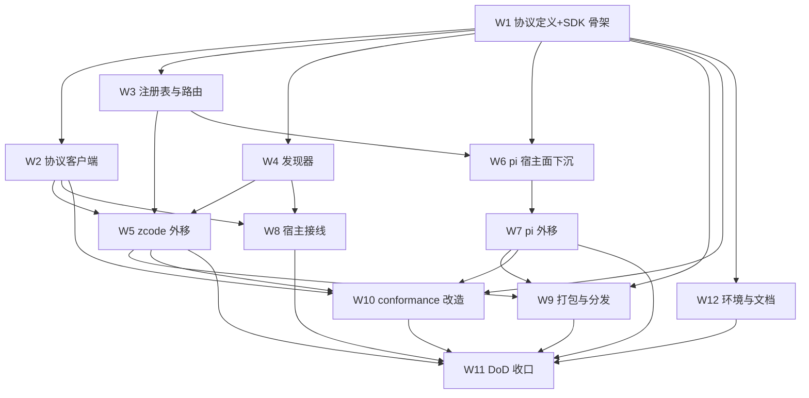

# 子代理引擎协议化与外移 实施计划

基线: 59f095b25 | 来源设计: docs/design/subagent-engine-protocolization.md（v10，设计层收敛） | 日期: 2026-09-08

> 本计划承接设计文档 §5 的 W1–W12 拆分，把**实现级细节**（env 变量名、pidfile 命名、清理谓词、
> conformance 断言形式、措辞限定词）从设计层下沉到本文件。设计文档后续瘦身时以本文件为
> 实现级 SSOT；设计决策本身仍以设计文档为准，本文件不发明新决策。

## 0 章节映射

| 内容 | 设计文档实际位置 |
|------|------------------|
| 背景/目标 | §1 背景目标（SCQA / G1–G6 / 迁移范围硬约束 / in-scope / out-of-scope） |
| 终态/机制 | §3 解决方案（§3.3 协议 / §3.4 发现注册 / §3.5 壳侧边界与 SDK / §3.6 宿主面与生命周期 / §3.7 打包三形态 / §3.8 迁移策略 D1–D6 / §3.9 写入面与代价 / §3.10 不变量） |
| 验收场景表 | §4 验收（A1–A13 + 基线三层 + 探针挂钩） |
| 下一层拆分 | §5 下一层拆分（W1–W12 表 + 排序与版本 + 风险回退 + 三个未知） |
| 待验证检查点 | ①§5 末「最大的三个未知」；②R9 审查残留 4 项（见本文件 §7.2）；③RSS 量级实测回写（§3.6 表）；④事件 IPC 开销探针（§3.9 代价①） |

## 1 目标快照

> 逐字摘录自设计文档 §1（禁止改写；验收条款回溯锚点）。

**一句话结论**：把 subagent-core 从「内建多引擎实现」改成「**引擎协议 + 编排壳**」——core 只保留路由 / 公共降级层 / journal / record / 协议客户端 / conformance 套件；每个引擎成为独立 CLI 包（`pi-subagent-cli` / `zcode-subagent-cli` …），用**元数据自注册**（package.json manifest + 配置覆盖）挂进 core 的引擎注册表，core 通过 **NDJSON stdio 协议**驱动它们。新增引擎 = 装一个包，**不再改 subagent-core**。

**设计目标**：

| # | 目标 | 视角 |
|---|------|------|
| G1 | 新增引擎零改 core | 接入者：写一个 npm 包（CLI 入口 + manifest），装上即出现在引擎选择器并可用 |
| G2 | 引擎与 core 解耦演进 | 接入者：引擎包按自己节奏发版；协议版本协商 + conformance 套件守契约 |
| G3 | 宿主/使用者零感知 | 使用者：subagent / workflow 的入参、返回、GUI 展示、record、历史详情完全不变 |
| G4 | 故障隔离 | 使用者：引擎进程崩溃/挂死只影响该引擎在途任务，不拖死宿主与其他引擎 |
| G5 | 现有能力零回归 | 使用者：pi / zcode 迁移后行为等价（事件、abort、凭据、池化、历史读取、chat 续聊） |
| G6 | 三形态分发一致 | workspace 开发态、Electron 打包态、npm + zsw vendor 态下发现与运行一致 |

**迁移范围（用户裁决 2026-09-08，硬约束）**：**`pi` 与 `zcode` 两个引擎都必须完成外移**，**不允许任何内置引擎例外**。驱动细节重写归各自提取设计，但「迁移完成」属本设计验收范围，完成定义见 §3.8 D6（九条 DoD 硬门）。

**in scope**：引擎协议 v1；引擎 SDK 包；core 壳侧边界；发现与注册（manifest + 配置 + 搜索路径 + 时机）；引擎进程生命周期；三个宿主的接线与改动清单；打包与分发三形态；迁移策略与回退；conformance 套件；错误规格与恢复指引；宿主伴生写入面登记。

**out of scope**：① 具体引擎的驱动细节重写——归各自提取设计；细节外置**不豁免** DoD；② 引擎协议的**网络/远程**形态（v1 只做本机 stdio）；③ 引擎市场 / 自动下载安装（v1 只做「本地已安装包的发现」）；④ EnginePort 成员签名变更（本设计不改签名，只改「谁实现它、跑在哪」）；⑤ `~/.zcode/cli/{artifacts,exec,log,…}` 伴生写入面治理（由 `zcode-session-db-isolation.md` §2.4.1 登记）。

## 2 单元列表

| Unit | 职责（摘要） | 领地（精确文件路径） | 依赖 | 隔离 | 验收条款 |
|------|--------------|----------------------|------|------|----------|
| W1 协议定义 + SDK 骨架 | engine-protocol v1 帧型/方法/错误码/版本常量/JSON Schema + 边界守卫 | 新建 `packages/subagent-engine-sdk/src/protocol/`（`engine-protocol.ts` 等）；新建 `.githooks/check-engine-sdk-boundary.mjs`；新建 `packages/subagent-engine-sdk/package.json`、`tsup.config.ts` | —（DAG 根，与 u-foundation 等价的共享契约根） | plain | A4/A6；§2.1 规格 |
| W2 协议客户端 | `EngineClient` + `RemoteEngine implements EnginePort` + 同步成员形态映射 | 新建 `packages/subagent-core/src/execution/engine/client/`（`engine-client.ts` / `remote-engine.ts` / `mirror.ts` 等）；`packages/subagent-engine-sdk/src/protocol/`（帧编解码） | W1 | plain | A1/A6/A8/A13；§2.2 规格 |
| W3 注册表与路由 | `EngineDescriptor` 双模 + manifest 快照 + D4 缺省引擎 + 时序契约改写 + 契约变更④⑤ | 既有 `packages/subagent-core/src/execution/engine/registry.ts`、`routing.ts`；`packages/subagent-core/src/orchestration/**`（`subagent-service.ts`、`subprocess-agent-runner.ts`）；`packages/subagent-core/src/execution/engine/common/capability-gate.ts`、`engine/model-validation.ts` | W1 | plain | A2/A3/A4/A6/A12；§2.3 规格 |
| W4 发现器 | manifest 解析 + 三级搜索路径 + engines.json 投影 + 冷启动回退源单源化 | 既有 `packages/subagent-core/src/execution/engine/engine-discovery.ts`；新建 `engine-discovery-scan.ts`、`config.ts`（`engines{}` 段）；`packages/subagent-core/src/core/host-services.ts`；`extensions/universal/subagent-workflow/src/host/pi-host.ts`；`packages/runtime/src/services/session/session-records.ts` | W1 | plain | A4/A11/A12；§2.4 规格 |
| W5 zcode 外移 | 新建 `@zhushanwen/zcode-subagent-cli` 包，搬 `engines/zcode/` + 前置文档改动 | 新建 `packages/zcode-subagent-cli/`（`src/` + `bin` + package.json manifest）；删除过渡完成后 `packages/subagent-core/src/execution/engine/engines/zcode/` | W1–W4 | plain | A1/A5/A9；§2.5 规格 |
| W6 pi 宿主面下沉 | `PiEngineService` 9 成员拆 HostBridge + `spawnedChildren` 状态镜像（前置，强制） | 既有 `packages/subagent-core/src/orchestration/subagent-service.ts`、`execution/engine/engines/pi/pi-engine.ts`、`session-runner.ts`；`packages/subagent-core/src/orchestration/lifecycle-predicates.ts`（拆依赖，行为不变） | W1–W3 | plain | A2/A3/A8 前置；§2.6 规格 |
| W7 pi 外移 | 新建 `@zhushanwen/pi-subagent-cli`（依赖 W6 产物） | 新建 `packages/pi-subagent-cli/`；删除过渡完成后 `packages/subagent-core/src/execution/engine/engines/pi/` | W6 | plain | A2/A3/A9；§2.7 规格 |
| W8 宿主接线 | runtime 成为协议客户端 + 扩展依赖声明 + D8 兼容公共面 + relay 透传 | 既有 `packages/runtime/src/services/session/subagent-engine-history.ts`；`packages/subagent-core/src/index.ts`；`extensions/universal/subagent-workflow/package.json`；`packages/subagent-core/src/execution/relay-env.ts`；`packages/runtime/src/index.ts`（`shutdown()` 退出钩子） | W2/W4 | plain | A7/A11；§2.8 规格 |
| W9 打包与分发 | 引擎包 staging + 启动解析二维矩阵 + 数据根注入矩阵 + 新守卫 | `scripts/bundle-extensions.mjs`、`scripts/validate-runtime-bundle.sh`、`scripts/postbuild-validate.sh`、新建 `scripts/check-engine-package-boundary.mjs`；`apps/electron/electron-builder.yml`；`packages/shared/src/constants.ts`（生成物挂载）；runtime 侧 `XYZ_AGENT_ENGINE_ROOTS` 推导代码 | W1/W5/W7 | plain | A5/A11；§2.9 规格 |
| W10 conformance 改造 | 协议黑盒套件 + 基线三层 + 录制/复跑 + H9 测试面迁移 | 既有 `packages/subagent-core/src/execution/engine/__tests__/conformance/*`；新建 fixture 目录 `packages/subagent-core/src/execution/engine/__tests__/conformance/__fixtures__/engine-protocol/`；各引擎包 `__golden__/`；`packages/subagent-core/package.json`（新增 `record:engine-fixtures` / `test:engine-protocol` scripts） | W1/W2/W5/W7 | plain | A1/A2/A4/A9；§2.10 规格 |
| W11 壳侧去引擎化（DoD 收口） | 清 H1–H4/H8/H11 + 删内建与 inproc + stderr 轮转引擎侧自实现 | 既有 `packages/subagent-core/src/execution/engine/common/session-view-service.ts`；`packages/subagent-core/src/index.ts`、`package.json`、`tsup.config.ts`；`packages/runtime/tsup.config.ts`；`scripts/validate-runtime-bundle.sh`；引擎包日志模块（`packages/zcode-subagent-cli/src/logs/`、`packages/pi-subagent-cli/src/logs/`） | W5/W7/W8/W9/W10/W12 | plain | A5/A9/A11/A13；§2.11 规格 |
| W12 环境与文档 | `buildEngineChildEnv` 三层 env + 守卫扩展 + env 文档/约束回写 | 新建 `packages/subagent-engine-sdk/src/env.ts`、`src/spawn.ts`（`spawnEngineChild`）；`.githooks/check_spawn_env_boundary.py`、`.githooks/check_env_whitelist_sync.py`；`docs/design/env-propagation-boundary.md`；`docs/constraints.json` + `scripts/render-constraints.mjs` | W1 | plain | A6/A9；§2.12 规格 |

> 全部单元 plain 隔离：单一仓库顺序推进，无并行 worktree 需求（排序见 §3 DAG；W8/W9/W10/W12 可并行收口）。

### 2.1 W1 协议面规格（帧字段级）

**传输**：stdio NDJSON（每行一个 JSON 对象）。**帧型四类**：

```jsonc
// ① 请求（core → 引擎）
{ "id": 1, "method": "run", "params": { ... } }
// ② 应答（引擎 → core）
{ "id": 1, "result": { ... } } | { "id": 1, "error": { "code": "...", "message": "...", "recovery": "...", "data": {...} } }
// ③ 通知（引擎 → core，无 id）
{ "method": "event", "params": { "runId": "...", "seq": 1, "event": { "type": "text_delta", "delta": "..." } } }
// ④ 反向请求（引擎 → core，必须应答）
{ "id": "rev-1", "method": "host/askUser", "params": { ... } }
```

**反向请求超时二分**（帧④注释，R9-2 关联）：
- 数据面类（`host/log` / `streamDelta` / `poolResolved` / `handleReady` / `childSpawned` / `childStateChanged`）：10s 未答 = 引擎故障 → 杀进程 + 在途 run 失败；
- 人机交互类（`host/askUser` / `host/permission`）：**不设统一超时**——core 先回 `{ack:true}`，结果异步到达；按 ADR-0047「静默 ≠ 卡死」用无进展检测/用户取消，不据此判引擎故障。

**10 正向方法**（帧字段，v1）：

| 方法 | params → result |
|------|-----------------|
| `initialize` | `{protocolVersion, hostInfo:{name,version,dataRoot}, engineConfig}` → `{protocolVersion, engineId, engineVersion, adapterVersion, capabilities, models?}`；应答**仅诊断**（与 manifest 不一致 → warn 留痕）；`engineConfig` = L3 显式配置 `engines.<id>.config`（`Record<string,string>`，缺省 `{}`，不放凭据）；版本越界 → `engine_protocol_mismatch` |
| `probe` | `{force?}` → `ProbeReport` |
| `run` | `{runId, task, ctx:{poolKey, cwd, model?, schemaEnv?, ctxModel?, engineFallback?, streamMode?}}`；期间发 `event` 通知；终态应答 `{handle, outcome}` |
| `cancel` | `{runId, reason}`；引擎须 3s 内收敛终态；超时 core 走杀链 |
| `interact` | `{handle, action}` → `InteractResult` |
| `read` | `{handle, dataDir}` → `SessionView`（`dataDir` **必填**：存量池时代相对 `dbPath` 需要它） |
| `listModels` | `{}` → `{models: [...] \| null}`（诊断面；宿主侧同步成员读 manifest，不经本方法） |
| `validateModel` | `{modelRef?}` → `{canonicalRef}`（诊断面；同上） |
| `dispose` | `{}` → `{ok:true}`；幂等 |
| `ping` | 健康检查（ADR-0047：静默 ≠ 卡死，不据此杀任务） |

**8 反向通道**：`host/log`、`host/askUser`、`host/permission`、`host/streamDelta`、`host/poolResolved`（**journal 落盘路径单一权威，须在首个事件 emit 前调用**）、`host/handleReady`、`host/childSpawned`（载荷 = 一次性子进程 pid，用途 = `isResumable` 镜像谓词 + 诊断留痕；**不供杀链/收割**；常驻进程不报，归 `dispose`）、`host/childStateChanged`（载荷 `{pid, recordId, state: running\|exited, killed: boolean, exitCode?, signal?}`——**`killed` 必含**，判据 `child !== undefined && !child.killed`）。未实现的交互能力回 `{unsupported:true}`。

**版本协商**：`ENGINE_PROTOCOL_VERSION = 1`（core 支持 `>=1 <2`）；越界 → `engine_protocol_mismatch`（含双方版本 + 升级指引），该引擎标记不可用。

**错误码表**：`engine_not_found` / `engine_protocol_mismatch` / `engine_capability_unsupported`（core gate 同步拦生成，非引擎帧透传）/ `engine_capability_mismatch` / `engine_model_unknown` / `engine_model_mismatch` / `engine_handshake_timeout`（10s）/ `engine_crashed`（附 stderr 尾 400 字符；重建最多 3 次指数退避 1s/2s/4s）/ `engine_probe_failed` / 其余 `engine_*` 透传。

**背压与流分工**：stdout 独占 NDJSON（行解析器；core 读慢靠 OS 管道背压，不做无界缓存）；stderr 常驻排空（内存环形缓冲尾 400 字符，崩溃现场由 `engine_crashed` 携带；**宿主侧不落盘**）。事件合并默认关闭（`XYZ_ENGINE_EVENT_COALESCE=0`）。

**守卫基线**（挂 W1 验收，新增 SDK 代码前先建守卫）：
- `check-engine-sdk-boundary.mjs`：SDK 源码 + dist 无 `@zhushanwen/subagent-core` 包名、无指向 `packages/subagent-core/**` 的越界相对路径（不变量「SDK 不得 import core」）；
- 类型闭包处置（逐项，设计 §3.5.1 表）：`execution/types.ts` 只抽引擎面最小契约子集（`AgentEvent`/`EngineHandleData`/`SessionView`/`EngineCapabilities`/`ProbeReport`/`InteractAction`/`AgentCallOpts`/`EngineOutcome` 结构子集）入 SDK，域类型（`ExecutionRecord`/`Turn`/`AgentFailureKind`/`WorktreeHandle`）留 core、SDK 用结构等价类型；`AgentCallOpts` 引擎面子集入 SDK + core 反向 re-export；`model-resolver.ts` 留 core；`paths.ts`（`resolvePoolDir`，纯 `node:path`）移入 SDK；`@xyz-agent/extension-protocol` 留 core 不引用；
- core 侧**双向可赋值断言**（`type _A = AssertMutuallyAssignable<CoreX, SdkX>`）纳入 `pnpm --filter @zhushanwen/subagent-core typecheck`——否则结构等价类型漂移编译期抓不到。

### 2.2 W2 协议客户端规格

**`EngineClient`**（core 新增，与 `AppServerConnection` 同型但引擎无关）：spawn / 帧编解码 / 请求关联 / 反向通知路由 / 崩溃重建 / dispose / killAll / stdout 行解析 + stderr 常驻排空（仅内存环缓冲）。

**spawn 平台参数（必写死）**：
- POSIX：引擎 CLI 以独立进程组 spawn（`detached:true`）；
- Windows：`detached:false` + `windowsHide:true`（避免 console 窗口闪现），收割走 `taskkill /PID <pid> /T /F`（按 pid 树杀，不依赖进程组）。

**进程组收割（单一机制，v6 已删按 pid 补杀）**：引擎进程 exit / 重建 / `dispose` / `killAll` 时——POSIX `process.kill(-pid)` 负 pid 组杀；Windows `taskkill /T /F`。

**镜像失效语义（必写死）**：
- 未收 `childSpawned` 前 = 无句柄（对齐 `getChildByRecord` undefined）；
- 引擎进程 exit / 重建 / `dispose` / `killAll` 时把该引擎**全部镜像项整体置死**（`killed=true` + 广播状态变更）——否则 `notify-host` 60s 合并窗口挂住 / `idle-gc` TTL 不触发 / `resumable` 说谎 / 续聊被拒；
- 引擎崩溃后镜像清空，`isResumable` 回落「无句柄」。

**`RemoteEngine` 同步成员形态映射（必写死）**：
- `capabilities()`：直读 manifest（注册期，无缓存）；
- `listModels()`：manifest **省略 `modelCatalog`（或 `models: null`）** → 成员不实现/返回 `null`（→ `buildCoreAlignedHint`）；**显式 `models: []`** → 返回 `[]`（→ `buildEmptyModelsHint`）；数组 → 原样返回；
- `validateModel()`：同源 manifest；省略 `modelCatalog` → 成员不实现（`typeof validateModel !== "function"` → 跳过校验，等价恒放行）；显式声明 → 按 `dynamic` 判（未命中且 `dynamic:false` → `engine_model_unknown` 同步拒；`dynamic:true` → 放行，运行期 `engine_model_mismatch`）。

**pidfile（实例维度命名 + 三条件清扫）**：
- 文件名 `<engineDataDir>/engines/<id>/engine.<hostKind>.<hostPid>.pid`（pi 宿主与 runtime 各写自己的文件，**不得共用 `engine.pid`**——last-writer-wins 会误杀对方存活实例）；
- 写入时机 = spawn 成功后原子写；清理时机 = 引擎自灭 / dispose / 宿主正常退出；
- 启动期扫同 id 全部 pidfile，**三条件同时成立才杀**：pid 存活 + cmdline 身份校验（复用 `readProcessCmdline` 先例，防 pid 复用误杀）+ 该 pidfile 所属宿主 pid 已死（`process.kill(hostPid,0)`）；
- **R9-3（pid 复用保守方向 + 陈旧 pidfile 删除通道）**：三条件中任一不确定（尤其 cmdline 校验不通过、宿主 pid 复用疑似）→ **保守跳过不杀**；三条件判定不成立（pid 已死 / cmdline 不符）的 pidfile 属陈旧文件 → **启动清扫时删除该文件**（否则宿主每次崩溃重启新增一个 pidfile、无限堆积）；删除不设数量上限，判定即删（陈旧文件无杀风险）；宿主 pid 复用导致「宿主 pid 已死」误判为存活 → 同样保守跳过 + 保留文件（下轮再清）。

**引擎自灭（宿主崩溃反向兜底，宿主侧不实现，由 SDK 在引擎 CLI 侧实现——本单元负责 core 侧配套：spawn 时不覆写、stdin 管道独占）**：
- **主判据 = stdio 控制通道断开**（宿主 `kill -9` 时 stdin 必然 EOF / 写端 EPIPE）；**不得实现成「无反向流量即自杀」**（ADR-0047 反向通道版）；
- **辅助判据** = in-flight 反向请求（已发出未应答）计时超时，缺省 30s，读 `XYZ_ENGINE_HOST_REQUEST_TIMEOUT_MS`；
- **R9-2 边界**：已 ack 的 `host/askUser` 异步等待**不计入**超时（ack 后属人机交互等待，非 in-flight）；
- 自灭执行 = 引擎自杀并杀自己进程组（与 dispose 同一条路径）；
- **R9 补强（stdin fd 不外泄）**：`spawnEngineChild`（W12 SDK 原语）spawn 引擎一代子进程时**不得把引擎自身的 stdin fd 传给后代**（stdio 数组对子进程 stdin 用 `'ignore'`/自有 pipe）——否则宿主死后代仍持写端、EOF 永不到达，自灭主判据失效；挂 W12 实现断言 + A8④ 真机断言（宿主 kill -9 后引擎在阈值内自灭即隐式验证 fd 未外泄）。

**验收条款**：A1①协议层结构等价；A6①②⑤⑥⑦；A8①②③④（含「静默长任务 >30s 无反向流量不被自灭」负向 + ack 的 `host/askUser` 等待不被判超时）；A13②。

### 2.3 W3 注册表与路由规格

- `EngineDescriptor` 双模：`{kind:"inproc", factory}`（过渡期）与 `{kind:"cli", command, args, capabilities}`（目标）；上层 `getEngine(id)` 返回代理，两形态透明；
- manifest 能力位**快照**（session_start 扫描所得，非握手缓存）；同步成员源 = manifest 快照直读；
- D4 缺省引擎规格：`DEFAULT_ENGINE_ID` 语义改「配置的缺省引擎 id」；加载期不在已发现清单 → warn + 回落**第一个可用引擎**（manifest `displayName` 稳定序）+ record 留痕；全不可用 → 派发期 `engine_not_found`（列出「未发现任何引擎包」+ 安装指引）；`fallbackTargetId()` 恒 'pi' 改「首个可用引擎」，无则直接报错；
- `routeEngineForHost` pi 同步短路改**代理形态**：构造同步、不读 descriptor、缺包/坏包不在构造期 throw（descriptor 首次使用才解析）；`routing.test.ts:260-268`「非 Promise」断言保留；
- §3.5.3 时序契约同批改写：`routing.ts:258` / `subprocess-agent-runner.ts:142`「run 内首个 await 前已触达 `executeAndAwait`」作废 → 改「首个 await 前完成路由决策；执行经进程边界，时序契约由本设计放宽」；
- **契约变更④（无斜杠 `canonicalRef`）**：改 `resolveIdentityForEngine`（`subagent-service.ts:1918-1927`）与续聊回读（`:1398-1405`）——无斜杠 ref 按 `provider=""`、`id=ref`、整串进 `name` 处理，不落 `"<ref>/"` 畸形；
- **契约变更⑤（run 期失败清理前置副作用）**：`finalizeFailed` 补清理 `kickOffEngineRun` 前已建的 worktree/池（`subagent-service.ts:2053-2077` 创建点）；
- 被 gate 四类判据（读 `capability-gate.ts:58/67/76/84`）：`conversation`（conversation 形态）/ `steer`+`conversation`（fork，OR 语义任一可用即放行）/ `maxTurns` / `sandbox`（worktree）——manifest 权威，少声明 → 首个调用同步拒 `engine_capability_unsupported` + 恢复指引「修 manifest / 升级引擎包」；多声明 → run 期 `initialize` 发现 → `engine_capability_mismatch` + 清理前置副作用；非 gate 位不一致（无论强弱）一律 warn 不阻断；
- 注释回写（同批）：`model-validation.ts:10-12/48`、`capability-gate.ts:12-16`、`subagent-service.ts:2005-2009`、`routing.ts:254-260`、`subprocess-agent-runner.ts:140-154`、`port.ts:194`。

### 2.4 W4 发现器规格

- **manifest schema 字段级**（引擎包 package.json `xyz-agent.subagentEngine`）：`id` / `bin` / `protocol`（必需；缺失 → warn 跳过该包；protocol 不兼容 → 标记不可用）、`capabilities`（必需，至少 `schemaEnforcement`/`conversation`/`maxTurns`；缺键取最保守值 `unsupported`/`false` + warn；未知键忽略 + warn）、`envPrefixes`（可选，缺省 `[]`；拒 `""` / 含 `*` / 非法形态 `^[A-Za-z0-9_]+$`（大小写不敏感）/ 保留前缀 `XYZ_`/`XYZ_AGENT_`/`XYZ_SUBAGENT_` → 丢弃该前缀 + warn 包仍可用）、`modelCatalog`（可选；缺省 = **不注入**，descriptor 保留 `undefined`；`null` 合法等价省略；`models: []` 仅作者显式声明；`dynamic` 缺省 `true`）、`displayName`/`description`（可选，缺省 = `id`）；
- **三级发现**：L1 宿主发现根 env `XYZ_AGENT_ENGINE_ROOTS`（分隔符 = `path.delimiter`；去重、大小写敏感、非绝对路径丢弃 + warn）+ `HostServices.discoveryRoots()` 新增 `engines` kind；L2 node 解析（宿主 `node_modules` `require.resolve`；打包态与 zsw vendor 态无效）；L3 显式配置 `subagents/config.json` → `engines: {"<id>": {command, args, config, cwd, enabled}}`（无 `env` 键——v6 已删 extras；`config` 经 `initialize.engineConfig` 透传，引擎不实现消费即死键）；
- 发现时机：与 `syncEnginesFile` 同点 session_start 扫描一次 + 缓存；`hasEngine()` 查快照，未命中触发一次同步补扫（只读 manifest 不握手）；
- `engines.json` 投影：清单 = 已发现且可执行的 id 数组；契约 `{v:1, engines: string[]}` 不改；每次 session_start 幂等写（内容不变零写）；**冷启动回退源 = runtime 自身发现结果**（无静态 JSON 兜底；零命中返回空清单 + 「未发现任何引擎包」状态）；改两个守护测试 `engines-declaration.test.ts` / `session-service-engine-config.test.ts`；
- 冲突与失败：manifest 缺字段/不可解析 → warn 跳过；同 id 覆盖 → info 留痕；`bin` 不存在/不可执行 → 标记不可用（不进清单）。

### 2.5 W5 zcode 外移规格

- 新建 `packages/zcode-subagent-cli`：搬 `packages/subagent-core/src/execution/engine/engines/zcode/`（10 个 .ts）+ `zcode-session-db-isolation.md` 的前置改动（落在本包内）；package.json 按 §2.4 manifest schema（`id: "zcode"`、`envPrefixes: ["ZCODE_"]`、`modelCatalog` 构建期生成 `pnpm --filter <pkg> gen:model-catalog`）；
- 引擎包只依赖 SDK（不依赖 core）；`appserver-launcher.ts` wrapper、凭据 fs 拦截注入、池/HOME 隔离随包迁移；
- 过渡期 core 保留内建（`XYZ_SUBAGENT_ENGINE_MODE` 双模），DoD 后 W11 删除。

### 2.6 W6 pi 宿主面下沉规格（强制前置）

- `PiEngineService` 9 成员 + 宿主全局状态逐条归属（设计 §3.8 D2 表）：`executeAndAwait` / `getRecordForAction` / `collectRecords` / `closeSubagent` / `cancel` / ChatRoundTicket / record 状态回写 / idle+activate lock 定时器 → **HostBridge（core）**；`spawnedChildren` Map + 收割 → **持有方 = 引擎进程**，core 只持状态镜像；`sendPromptCommand` / EPIPE 兜底 / 冷续轮 resume（`stdin-writer.ts`）→ **pi 包**；
- `HostBridge` 接口按设计 §3.8 最小示例落地（`executeAndAwait(opts, signal, onEvent, stream)` 等 9 方法）；
- `lifecycle-predicates.ts` 拆依赖（`hasLiveProcessHandle`/`isResumable` 改读镜像），行为不变。

### 2.7 W7 pi 外移规格

- 新建 `packages/pi-subagent-cli`（依赖 W6 的 HostBridge 反向请求消费面 + `host/*` 通道回调宿主执行子进程）；
- `session-reconstructor` 保持 core，pi 包经协议 `read` 拿会话视图；relay 转发语义照 W8/H12；
- 过渡期双模，DoD 后 W11 删除。

### 2.8 W8 宿主接线规格

- runtime 成为协议客户端：发现源 = `XYZ_AGENT_ENGINE_ROOTS` + node 解析 + `config.json` 三级（**`engines.json` 仅 GUI 投影，不作发现源**）→ 按需 spawn 引擎 CLI 调 `read`（idle 复用 5min）→ 失败降②级 journal（GUI `source` 字段标注）；
- runtime `EngineClient` 与 pi 宿主实例不共享（同 id 两个常驻 CLI）；zcode 两实例共享同一宿主 HOME 与同一隔离库（WAL 并发，与改造前同语义）；
- 退出钩子落点 = `packages/runtime/src/index.ts` 的 `shutdown()` 内、`deinitRelayServer()` **之后**，dispose 与 relay 关停**并行**（`shutdown()` 内 relay 有 3s grace，串行会拖慢）；**不可用 `process.on('exit')`**（回调不能 await）；dispose 上界 3s，超时即杀；
- D8 兼容公共面：`killAllSpawnedChildren()` → `EngineClient.killAll()`（语义不变）；`registerZcodeEngine(engineDataDir)` 薄壳 → 确保 descriptor 注册 + `engineDataDir` 记入；`createZcodeEngine(deps)` → `RemoteEngine('zcode')`；deps 映射：`engineDataDir()` → env `XYZ_AGENT_DATA_DIR`；`cliPath?` → descriptor `command` 覆盖；`processEnv?` → `buildEngineChildEnv` base 合并；`sources` 不跨进程；vendored 定位二选一（core 相对定位 `<coreDir>/../<engine>-subagent-cli` 或 zsw 注入 `XYZ_AGENT_ENGINE_ROOTS`）；
- relay 透传（H12）：`XYZ_SUBAGENT_RELAY_{SOCKET,NODE,SCRIPT}` 原样转发；`SESSION_ID/RECORD_ID` 剥除，引擎 spawn 嵌套子进程时按 `run.params.ctx` 的 `sessionRootId`/`recordId` 重写（不靠 env 继承）。

### 2.9 W9 打包与分发规格

- Electron 打包态：引擎包 bundle 到 `apps/electron/resources/engines/<id>/`；`electron-builder.yml` extraResources 增该目录；`postbuild-validate.sh` 三平台校验；`bundle-extensions.mjs` external 边界加引擎包；路径传递 = runtime 推 `resources/` 位置 → env `XYZ_AGENT_ENGINE_ROOTS` 注入 pi 子进程 → 扩展发现器（`HostServices.discoveryRoots` `engines` kind 第二通道）；**显式注入绝对路径，不 cwd 探测**（防用户 repo 预置同名目录冒充）；
- npm / zsw vendor：引擎包独立发 npm；扩展 package.json 声明引擎包为 dependencies；zsw `lib/vendor/` 增引擎包目录（owner = zsw 仓）；
- **启动解析（宿主 × 平台二维矩阵）**：
  - ① pi 扩展宿主（打包）：`process.execPath` 是 Bun standalone binary → 必须用注入执行器 `XYZ_AGENT_ENGINE_NODE`（与 relay `XYZ_SUBAGENT_RELAY_NODE` 不复用），经 L0 层显式注入；执行器为 Electron 二进制时同时注入 `ELECTRON_RUN_AS_NODE=1`；首次使用前跑 `probeNodeExecutor` 探针（`relay-env.ts:38-77` 先例），失败 → `engine_not_found` + 指引；
  - ② runtime sidecar：`process.execPath` + `ELECTRON_RUN_AS_NODE=1`；
  - ③ standalone pi / zsw：PATH `node`（缺 node → `engine_not_found` + 安装指引）；
  - Windows：入口 `.mjs` 不需 shim；引擎声明 `.cmd` → 禁 `shell:true`，改 `cmd.exe /c` + 参数数组；
- **数据根注入矩阵（单一 env `XYZ_AGENT_DATA_DIR`，不造 `XYZ_AGENT_ENGINE_DATA_DIR`）**：pi 扩展进程 = core 侧解析 `getEngineDataDir()` 显式注入；standalone pi（env 缺省）= core 侧解析后注入，`resolveEngineDataDir(env)` 缺省语义写死「缺 env 且无注入 → 显式报错 `engine_not_found`（附期望路径）」；runtime = `getDataDir()` 自身权威；zsw = deps 映射注入（与宿主值不同则 warn + 以显式值为准）；
- 新守卫 `scripts/check-engine-package-boundary.mjs`：扫 `packages/subagent-engine-*` + 两个 CLI 包「不得依赖/导入 core 内部路径」+ DoD#2（exports 无 `./engines/` 子入口、barrel 无引擎重导出）；挂 pre-commit（按路径触发）+ CI invariants；引擎包落位 `packages/`（不进 `extensions/` 扩展守卫体系）；发布走 changeset + `apply-version.sh` 枚举。

### 2.10 W10 conformance 改造规格

- 契约套件改「协议黑盒」：fake 引擎 CLI 覆盖 **10 正向方法 + 8 反向通道 + 错误帧**；
- 基线三层：①协议层 fixture 回放（落位 `packages/subagent-core/src/execution/engine/__tests__/conformance/__fixtures__/engine-protocol/`，不新建顶层 `__fixtures__/`；断言 `AgentEvent` 结构等价——类型序列/顺序/`seq` 单调/字段白名单，排除 `text_delta` 文本内容等不可复现字段；沿用 `conformance/golden-replay.*.test.ts` + `assertAgentEventInvariants` + journal 往返保真）；②引擎层 golden 随引擎包 `__golden__/`；③真机层手动门（A1/A2/A3 断言不变量与关键终态，不逐字段 diff）；
- 录制/复跑：`pnpm --filter @zhushanwen/subagent-core record:engine-fixtures`（真实 run 帧裁剪/脱敏落 fixture，带 schema 版本）+ `test:engine-protocol`（fake 引擎回放 + 白名单逐字段比对）——两个 script 由本单元加进 `packages/subagent-core/package.json`；
- **静态断言「任务子进程 spawn 必经 SDK `spawnEngineChild`」**（grep 可执行、进 CI）：引擎包源码不得出现绕过 `spawnEngineChild` 的直接 `spawn`/`exec` 调用；**R9-4（allowlist 承接）**：allowlist 覆盖引擎自身用于**探测/收割**的 `ps` / `taskkill` / `kill` 调用——它们不是任务子进程，不得被断言拦下；allowlist 条目带理由注释；
- POSIX 运行时组探测：引擎上报的 `childSpawned` pid 做 `kill(-pid, 0)`，不在同组即告警（挂 A3 真机；Windows 无外部判据，仅靠 SDK 层保证，显式登记）；
- H9 测试面迁移：14 个扩展测试文件 import 深路径随目录迁移，`pnpm extensions:test` + core test 全绿。

### 2.11 W11 壳侧去引擎化规格（DoD 收口）

- 清 H1（`session-view-service` 走协议 `read`，零静态引擎依赖）/ H2（barrel 引擎符号迁走，D8 薄壳除外）/ H3（package.json exports + tsup 引擎子入口删除；bare `import("sqlite")` 守卫随 reader 迁引擎包构建）/ H4（`killAllSpawnedChildren` 归 `EngineClient`）/ H8/H11（随 W5/W7 已迁，此处核对清零）；
- 删内建目录（`engines/pi`、`engines/zcode`）+ `XYZ_SUBAGENT_ENGINE_MODE=inproc` 分支（DoD#5）；
- **SDK 加入 runtime `noExternal`**（否则打包态 `Cannot find module`）；核对 `validate-runtime-bundle.sh` 的 `workspace:*` DEPS 过滤盲区，新增「产物 grep `require("@zhushanwen/subagent-engine-sdk")` 零命中」一步（A5）；
- **引擎包自实现 stderr 轮转**：文件名带 pid 实例维度 `<engineDataDir>/logs/zcode-appserver-stderr-<pid>.log`；轮转参数读 `XYZ_LOG_MAX_BYTES` / `XYZ_LOG_KEEP_DAYS`（缺省 **50MB / 7 天**，与宿主一致）；清理判据 = **同前缀 + pid 已死（`process.kill(pid,0)` 跨实例探测）+ mtime 过期，三者同时成立才删**（不能只看 mtime——存活实例 7 天无输出会被误删）；双实例互不删除/重命名对方文件（对方 pid 存活时其文件不得删）；
- 引擎卸载后目录归属登记：取 §3.9 表裁决②「无通道风险 + 人工清理指引 + 重审触发（隔离库 > 2GB 或磁盘异常报告）」。

### 2.12 W12 环境与文档规格

**`buildEngineChildEnv(baseEnv, opts)` 三层（高者覆盖低者）**：

| 层 | 内容 | 规格 |
|----|------|------|
| L0 基础设施键（core 过滤**之后**显式注入，不受放行/剥除约束） | `XYZ_AGENT_DATA_DIR`（数据根，core 侧解析后注入）、`XYZ_AGENT_ENGINE_NODE`（执行器路径）、`ELECTRON_RUN_AS_NODE=1`（执行器为 Electron 二进制时）、`XYZ_AGENT_SUBAGENT=1`（nesting guard）、**relay 三键 `XYZ_SUBAGENT_RELAY_{SOCKET,NODE,SCRIPT}`**（宿主 relay 激活时才有值；必须走 L0——L1 拒绝表禁 `XYZ_SUBAGENT_` 前缀、L2 是 manifest 面，两层都到不了；缺它嵌套 subagent 静默回落直连）、引擎侧身份 env（`PI_SUBAGENT_ROOT_SESSION_ID` 等，`base-tool-enhance` 消费） | 实装名核对：relay env 族 = `XYZ_SUBAGENT_RELAY_{SOCKET,NODE,SCRIPT,SESSION_ID,RECORD_ID}`（`relay-env.ts:14-17`）；`…_STDIN/STDOUT/STDERR` 不存在 |
| L1 deny + 显式剥除（恒高于 manifest 放行） | deny 清单（`SPAWN_ENV_OUTBOUND_DENY_LIST`）+ 凭证键 **`XYZ_AGENT_API_KEY`** + 父身份键 `XYZ_SUBAGENT_RELAY_{SESSION_ID,RECORD_ID}`（防父身份误归属，引擎按 `run.params.ctx` 重写） | 守卫断言：剥除/deny 清单里每个名字必须在实装中至少有一处生产消费 |
| L2 manifest 放行 | `envPrefixes: string[]`；保留前缀拒绝表 `XYZ_`/`XYZ_AGENT_`/`XYZ_SUBAGENT_`；形态校验大小写不敏感 `^[A-Za-z0-9_]+$`；非法条目 → 丢弃该前缀 + warn（包继续可用） | 未声明前缀不放行 + warn |

- 基座常量单源：SDK 的前缀/deny 常量由 `packages/shared/src/constants.ts` SSOT **构建期生成**为 `ENGINE_ENV_PREFIXES` / `ENGINE_ENV_DENY_LIST`；core 与引擎统一从 SDK 读（不引入 core → `@xyz-agent/shared` 运行时依赖）；
- **守卫断言**：L0 基础设施键集合 ∩ L1 deny/剥除集合 = ∅；生成物与 SSOT 逐项相等（`check_env_whitelist_sync.py` 加新断言，**不**把 SDK 塞进 `FORBIDDEN_DIRS`）；
- `check_spawn_env_boundary.py`：`SCAN_ROOTS` 扩展覆盖 SDK 与引擎包 + 同批登记 `buildEngineChildEnv` 为可接受构建器符号（否则引擎包内既有 spawn 点一扩即红）；
- SDK `spawnEngineChild` 原语：硬编码 POSIX `detached:false` / Windows `detached:false` + `windowsHide:true`，**不暴露 detached 选项**；**不把引擎自身 stdin fd 传给后代**（R9 补强，见 §2.2）；
- pi 侧 `buildChildEnv` 迁移并补齐剥离（现状 `{...process.env}` 未剥 5 个泄漏变量）；`XYZ_ZCODE_CLI` 等出站白名单条目随包迁移同批回写 `docs/design/env-propagation-boundary.md` B3；
- 文档/约束回写（DoD#9）：`docs/constraints.json` 新增「引擎协议边界」约束 + `node scripts/render-constraints.mjs`；`node scripts/check-doc-symbol-drift.mjs` 全绿。

## 3 DAG 图



排序（设计 §5）：W1–W4（协议与壳）→ W5（zcode 外移，首个真机验证）→ W6–W7（pi，强制路径）→ W8/W9/W10/W12 并行收口 → W11（DoD 收口）。版本：core 发 **major**；引擎包首版 0.x；SDK 与协议版本独立。回退：`XYZ_SUBAGENT_ENGINE_MODE=inproc`（迁移期专用，DoD#5 删除）。

## 4 测试策略

命令真实来源：根 `package.json` scripts + `packages/subagent-core/package.json` + 项目 AGENTS.md。测试框架 vitest（禁 `node:test`）。

**增量（开发过程中按受影响包执行）**：

| 对象 | 命令 |
|------|------|
| core 单测 | `cd packages/subagent-core && pnpm vitest run <相关测试文件>`（增量文件级） |
| core 类型（含双向可赋值断言） | `cd packages/subagent-core && pnpm typecheck` |
| SDK / 引擎 CLI 包 | `cd packages/<pkg> && pnpm test && pnpm typecheck`（新包自建 vitest 配置，挂 junit reporter + fs-guard setupFiles，照 AGENTS.md 测试纪律） |
| 协议基线复跑 | `pnpm --filter @zhushanwen/subagent-core test:engine-protocol`（W10 落地后） |
| extensions 三连 | `pnpm extensions:typecheck && pnpm extensions:lint && pnpm extensions:test` |
| lint | `pnpm run lint` |
| 守卫脚本 | `node scripts/check-engine-sdk-boundary.mjs`（W1 起）；`node scripts/check-engine-package-boundary.mjs`（W9 起）；`python3 .githooks/check_spawn_env_boundary.py`、`.githooks/check_env_whitelist_sync.py`（W12） |

**全量（收尾 / PR / DoD 门）**：

- `pnpm test`（全 workspace packages/apps/extensions）；
- `pnpm run lint`；
- `bash scripts/validate-runtime-bundle.sh`（W9/W11 后含引擎 staging 与 SDK 零命中新步）;
- DoD#8：core test + `pnpm extensions:test` + conformance（协议黑盒）全绿；
- DoD#9：`node scripts/check-doc-symbol-drift.mjs` 全绿。
- 真机门（A1/A2/A3/A8/A11 手动场景）不自动化，按 §4 场景表在 xyz-agent dev / zsw CLI 真实宿主跑；Windows 等效断言（`tasklist`/`taskkill`/`wmic`）在 Windows 环境补验。

## 5 合理偏差登记表

初始为空。执行期与计划的偏差在此登记（Unit / 偏差内容 / 理由 / 日期）。

## 6 状态表

| Unit | 状态 | 轮次 | 证据指针 |
|------|------|------|----------|
| W1 协议定义 + SDK 骨架 | pending | — | — |
| W2 协议客户端 | pending | — | — |
| W3 注册表与路由 | pending | — | — |
| W4 发现器 | pending | — | — |
| W5 zcode 外移 | pending | — | — |
| W6 pi 宿主面下沉 | pending | — | — |
| W7 pi 外移 | pending | — | — |
| W8 宿主接线 | pending | — | — |
| W9 打包与分发 | pending | — | — |
| W10 conformance 改造 | pending | — | — |
| W11 壳侧去引擎化 | pending | — | — |
| W12 环境与文档 | pending | — | — |

## 7 残留风险与变更历史

### 7.1 残留风险（设计层已登记，实施期监控）

- **三个未知（实施期优先证伪）**：① runtime ①级读进程开销与降级率（重审触发：详情页延迟 > 1s 或降级率 > 5%）；② pi 宿主面下沉实际成本（W6；超预算则拉长排期但不允许 pi 永久内置）；③ 打包态引擎发现路径传递与三平台启动解析覆盖（W9）。
- 已接受代价（设计 §3.9 表，不再重列细节）：事件 IPC 开销、引擎死亡连坐在途 run、重建上限 3、双实例常驻（RSS 待实测回写设计 §3.6 表）、stderr 排空 I/O、`modelCatalog` 静态化（陈旧展示）、引擎 detached 子进程不收割、宿主崩溃后阈值窗口内残留。
- 已登记风险：引擎卸载/禁用后目录无主残留（取裁决②人工清理 + 重审触发）。

### 7.2 R9 审查残留项（实现级，必须随对应单元落地）

| # | 项 | 落位单元 | 验收/检查点 |
|---|----|----------|-------------|
| R9-1 | A8①「孙进程零命中」缺限定词 → 与 A3/A11 统一限定为「**一代子进程 + 组内后代**」；pi rpc-mode 在 `session-runner.ts:582/629` 产生 detached 后代，属 §3.9 已接受代价（不在收割覆盖范围） | W10（conformance 断言措辞）+ W2（镜像/收割范围注释） | A3/A8①/A11 验收文案统一带限定词；真机断言仅对一代子进程 + 组内后代做零残留检查，detached 后代不判 fail |
| R9-2 | 自灭判据与已 ack 的 `host/askUser` 异步等待的边界：ack 后属人机交互异步等待，**不得计入 in-flight 反向请求超时** | W2（`EngineClient` ack 语义）+ SDK 引擎侧自灭实现（W12） | A8④ 负向验收：「被 ack 的 `host/askUser` 异步等待不被判超时」+「静默长任务 >30s 无反向流量不被自灭」 |
| R9-3 | 三条件清扫对「同 cmdline 的 pid 复用」的保守方向 + **陈旧 pidfile 删除通道/上限**（宿主每次重启会新增一个 pidfile，不清理则无限堆积） | W2（pidfile 清扫实现） | 实现语义：三条件任一不确定 → 保守跳过不杀；判定不成立（pid 死 / cmdline 不符）→ 删除该 pidfile 文件；宿主 pid 复用疑似 → 跳过 + 保留下轮再清。待验证检查点：真机模拟「宿主 kill -9 × N 次重启」后 pidfile 目录无堆积、无双实例 |
| R9-2b | **长运行 `HostBridge.executeAndAwait` 不得计入 30s in-flight 超时**（R9 影响面 MF#1）：该请求应答 = 任务完成，整个任务时长都是 in-flight → 按字面实现每个 >30s 的 pi 任务都会被引擎自灭（`turnTimeoutMs` 同型事故）。 | W2（`EngineClient` 超时域划分）+ W12（引擎侧自灭） | **长运行 HostBridge 面走 ack 两阶段（同 `askUser` 模式），不参与 30s 计时**；A8④ 补负向用例「>30s 的 pi 任务不被自灭」 |
| R9-3b | pidfile 内落盘 **`engineStartTime`** 启动时间戳做 pid 复用比对（Windows 取安全方向：不杀只删） | W2（pidfile 原子写） | 同 cmdline 复用场景不误杀；陈旧文件被 unlink（防无界累积） |
| R9-4 | 补强三项：① 宿主 pid 复用的保守跳过语义（并入 R9-3）；② stdin fd 不得外泄给后代（否则宿主死后代持写端、EOF 不到达、自灭失效）；③ W10 静态断言承接 allowlist（`ps`/`taskkill`/`kill` 探测/收割调用不被「必经 `spawnEngineChild`」断言拦下） | ② W12（`spawnEngineChild` stdio 规约）+ W2；③ W10 | ② `spawnEngineChild` 单测断言子进程 stdin 非引擎 stdin fd + A8④ 真机隐式验证；③ W10 静态断言测试含 allowlist 正反两例 |

### 7.3 变更历史

- 2026-09-08：首版，基线 135c1dbab，由设计文档 v10（R1–R8 全修、设计层收敛）生成；实现级细节自设计 §3.3–§3.9 / §4 / §5 下沉至本文件 §2 各单元规格。
