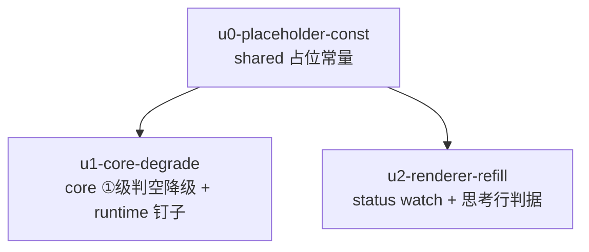

# 非 pi 引擎 subagent 可见性收尾 实施计划

基线: <commit 后回填> | 来源设计: docs/design/subagent-nonpi-visibility-followups.md | 日期: 2026-09-09

## 0 章节映射

| 内容 | 设计文档实际位置 |
|------|------------------|
| 背景/目标 | §1 背景与目标（1.2 目标表 G1-G3 / 1.3 In-Out scope） |
| 终态/机制 | §2 现状与问题分析 + §3 解决方案（3.1 终态 / 3.3 关键决策 D1-D6） |
| 验收场景表 | §4（真机场景表 S1-S7 + §4.1 单测矩阵） |
| 下一层拆分 | §5（5.1 单元表 / 5.2 文件改动地图 / 5.3 待验证检查点） |
| 待验证检查点 | §5.3（P1 ⛔实施期门 / P2-P4 ✅） |

审查通过证据：`.review/design-review-nonpi-followups-r2.md`（0 must-fix）+ `.review/design-review-nonpi-followups-impact-r2.md`（0 must-fix），2026-09-09 第二轮聚焦复审，收敛轨迹 r1(1MF+6S) → r2(5S 全修)。

## 1 目标快照（逐字摘录设计 §1.2 / §1.3）

> G1 非 pi subagent 运行中打开 drawer tab，任务终态后 tab **自动**显示完整对话（task + assistant 含 toolCalls），无需切换或手动刷新。
> G2 非 pi subagent 任意生命周期时刻，`session.getSubagentHistory` 对已知 record 返回**带实质内容或占位 assistant 的投影**，不再交出「仅 task」的空壳视图；drawer 详情与**显式非 pi 引擎的** agentcall 快照两个消费面同批受益。
> G3 pi 引擎行为零变化（D5 守护）：实时流照常、终态无多余 reload、读取链不走非 pi 分支。

Out-of-scope（设计 §1.3）：不伪造实时流（D7/D12）；不改 pi 路径；不加刷新按钮；不做 runtime 协议层「永不返回空」不变量收敛（含 pi `!sessionFile`，`session-records.ts:316`）。

## 2 单元列表

| Unit | 职责 | 领地（精确文件路径） | 依赖 | 隔离 | 验收条款 |
|------|------|----------------------|------|------|----------|
| u0-placeholder-const | shared 新增导出常量 `SUBAGENT_OUTCOME_PLACEHOLDER = '(no outcome recorded)'`，带三端锚定注释（core 本地同值 / runtime 测试守护 / renderer 判据消费，设计 D6） | `packages/shared/src/subagent.ts` | 无（DAG 根） | plain | shared 包 typecheck 绿；常量导出可被 workspace 消费 |
| u1-core-degrade | 编排层①级判空降级（D3：ReplayedTurn 逐 turn 实质内容判定，全空降②级）+ ③级占位字面量换本地常量（锚定注释）+ core 降级矩阵用例 + runtime 契约钉子用例（defined-empty 非空壳 + 占位同值断言，fixture result/error 双缺） | `packages/subagent-core/src/execution/engine/common/session-view-service.ts`、`packages/subagent-core/src/execution/engine/__tests__/common/session-view-service.test.ts`、`packages/runtime/test/subagent-extractor-engine.test.ts` | u0 | plain | §4.1 core 矩阵绿；subagent-core 全量绿；runtime 既有 engine-route/extractor 套件绿 |
| u2-renderer-refill | SubagentTab status watch（D2 四守卫）+ `useSubagentThinking` 判据排除占位（D6）+ renderer 测试矩阵（回填/零变化/切换守卫/已终态/切回兜底 + 思考行占位反例） | `packages/renderer/src/components/panel/SubagentTab.vue`、`packages/renderer/src/__tests__/panel/subagent-tab.test.ts`、`packages/renderer/src/composables/panel/useSubagentThinking.ts`、`packages/renderer/src/__tests__/components/MessageStream-subagent-force-working.test.ts` | u0 | plain | §4.1 renderer 矩阵绿；renderer 相关套件绿；drawer-blank T3 既有断言保持绿；`<script setup>` ≤300 行 |

落地顺序约束（设计 §5.1，防 MF1 中间态复活）：**u1 与 u2 必须同批 committed**（u0 → u1 → u2 串行派发即天然满足；不做 u1 单独合入）。

## 3 DAG 图

全部 plain 隔离（改动面小、领地互斥、无 worktree 必要——设计 §5.1 拆分理由）。

## 4 测试策略

增量（单元开发期，命令从子包目录执行）：

| 包 | 命令 |
|----|------|
| shared | `cd packages/shared && npx tsc --noEmit`（纯常量增量，无独立测试套件） |
| subagent-core | `cd packages/subagent-core && npx vitest run src/execution/engine/__tests__/common/session-view-service.test.ts` |
| runtime | `cd packages/runtime && npx vitest run test/subagent-extractor-engine.test.ts`（engine-route 路由面套件名以 `ls packages/runtime/test/` 实际为准，coder 开工时确认后全跑） |
| renderer | `cd packages/renderer && npx vitest run src/__tests__/panel/subagent-tab.test.ts src/__tests__/components/MessageStream-subagent-force-working.test.ts` |

全量（收尾 Gate A）：`packages/subagent-core` 与 `packages/renderer` 的 vitest 全量 + runtime 相关套件 + `pnpm run lint`。红线：vitest、fake timers、每用例至少一个用户可见 DOM 断言（renderer 用例）、测试禁触真实数据目录。

## 5 合理偏差登记表

（初始为空）

## 6 状态表

| Unit | 状态(pending/in-progress/committed/blocked) | 轮次 | 证据指针 |
|------|---------------------------------------------|------|----------|
| u0-placeholder-const | pending | 0 | — |
| u1-core-degrade | pending | 0 | — |
| u2-renderer-refill | pending | 0 | — |

## 7 残留风险与变更历史

- 2026-09-09 创建。审查证据与单元表直接来自设计文档 §5.1（已过双 reviewer 两轮对抗审查）。
- Gate B 真机验收注意（设计 §4 头注）：隔离栈 vite 1421 / runtime 3410 / CDP 9225，独立数据目录，`env -u ELECTRON_RUN_AS_NODE`；S3 计数与 S6 RPC 走 browser-automation 连 CDP。
