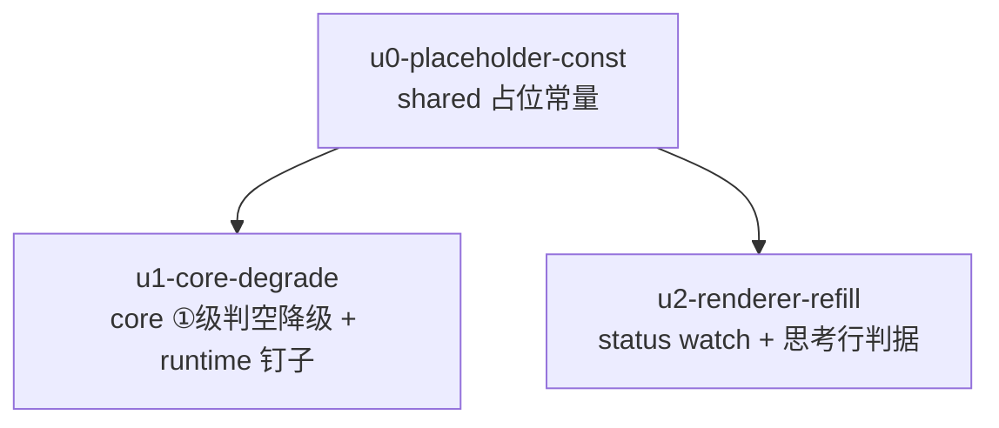

# 非 pi 引擎 subagent 可见性收尾 实施计划

基线: 6071fa8bf | 来源设计: docs/design/subagent-nonpi-visibility-followups.md | 日期: 2026-09-09

## 0 章节映射

| 内容 | 设计文档实际位置 |
|------|------------------|
| 背景/目标 | §1 背景与目标（1.2 目标表 G1-G3 / 1.3 In-Out scope） |
| 终态/机制 | §2 现状与问题分析 + §3 解决方案（3.1 终态 / 3.3 关键决策 D1-D6） |
| 验收场景表 | §4（真机场景表 S1-S7 + §4.1 单测矩阵） |
| 下一层拆分 | §5（5.1 单元表 / 5.2 文件改动地图 / 5.3 待验证检查点） |
| 待验证检查点 | §5.3（P1 ⛔实施期门 / P2-P4 ✅） |

审查通过证据：`.review/design-review-nonpi-followups-r2.md`（0 must-fix）+ `.review/design-review-nonpi-followups-impact-r2.md`（0 must-fix），2026-09-09 第二轮聚焦复审，收敛轨迹 r1(1MF+6S) → r2(5S 全修)。

## 1 目标快照（逐字摘录设计 §1.2 / §1.3）

> G1 非 pi subagent 运行中打开 drawer tab，任务终态后 tab **自动**显示完整对话（task + assistant 含 toolCalls），无需切换或手动刷新。
> G2 非 pi subagent 任意生命周期时刻，`session.getSubagentHistory` 对已知 record 返回**带实质内容或占位 assistant 的投影**，不再交出「仅 task」的空壳视图；drawer 详情与**显式非 pi 引擎的** agentcall 快照两个消费面同批受益。
> G3 pi 引擎行为零变化（D5 守护）：实时流照常、终态无多余 reload、读取链不走非 pi 分支。

Out-of-scope（设计 §1.3）：不伪造实时流（D7/D12）；不改 pi 路径；不加刷新按钮；不做 runtime 协议层「永不返回空」不变量收敛（含 pi `!sessionFile`，`session-records.ts:316`）。

## 2 单元列表

| Unit | 职责 | 领地（精确文件路径） | 依赖 | 隔离 | 验收条款 |
|------|------|----------------------|------|------|----------|
| u0-placeholder-const | shared 新增导出常量 `SUBAGENT_OUTCOME_PLACEHOLDER = '(no outcome recorded)'`，带三端锚定注释（core 本地同值 / runtime 测试守护 / renderer 判据消费，设计 D6） | `packages/shared/src/subagent.ts`、`packages/shared/src/index.ts`（barrel 具名导出，偏差补录见 §5） | 无（DAG 根） | plain | shared 包 typecheck 绿；常量导出可被 workspace 消费 |
| u1-core-degrade | 编排层①级判空降级（D3：ReplayedTurn 逐 turn 实质内容判定，全空降②级）+ ③级占位字面量换本地常量（锚定注释）+ core 降级矩阵用例 + runtime 契约钉子用例（defined-empty 非空壳 + 占位同值断言，fixture result/error 双缺） | `packages/subagent-core/src/execution/engine/common/session-view-service.ts`、`packages/subagent-core/src/execution/engine/__tests__/common/session-view-service.test.ts`、`packages/runtime/test/subagent-extractor-engine.test.ts` | u0 | plain | §4.1 core 矩阵绿；subagent-core 全量绿；runtime 既有 engine-route/extractor 套件绿 |
| u2-renderer-refill | SubagentTab status watch（D2 四守卫）+ `useSubagentThinking` 判据排除占位（D6）+ renderer 测试矩阵（回填/零变化/切换守卫/已终态/切回兜底 + 思考行占位反例） | `packages/renderer/src/components/panel/SubagentTab.vue`、`packages/renderer/src/__tests__/panel/subagent-tab.test.ts`、`packages/renderer/src/composables/panel/useSubagentThinking.ts`、`packages/renderer/src/__tests__/components/MessageStream-subagent-force-working.test.ts` | u0 | plain | §4.1 renderer 矩阵绿；renderer 相关套件绿；drawer-blank T3 既有断言保持绿；`<script setup>` ≤300 行 |

落地顺序约束（设计 §5.1，防 MF1 中间态复活）：**u1 与 u2 必须同批 committed**（u0 → u1 → u2 串行派发即天然满足；不做 u1 单独合入）。

## 3 DAG 图

全部 plain 隔离（改动面小、领地互斥、无 worktree 必要——设计 §5.1 拆分理由）。

## 4 测试策略

增量（单元开发期，命令从子包目录执行）：

| 包 | 命令 |
|----|------|
| shared | `cd packages/shared && npx tsc --noEmit`（纯常量增量，无独立测试套件） |
| subagent-core | `cd packages/subagent-core && npx vitest run src/execution/engine/__tests__/common/session-view-service.test.ts` |
| runtime | `cd packages/runtime && npx vitest run test/subagent-extractor-engine.test.ts`（engine-route 路由面套件名以 `ls packages/runtime/test/` 实际为准，coder 开工时确认后全跑） |
| renderer | `cd packages/renderer && npx vitest run src/__tests__/panel/subagent-tab.test.ts src/__tests__/components/MessageStream-subagent-force-working.test.ts` |

全量（收尾 Gate A）：`packages/subagent-core` 与 `packages/renderer` 的 vitest 全量 + runtime 相关套件 + `pnpm run lint`。红线：vitest、fake timers、每用例至少一个用户可见 DOM 断言（renderer 用例）、测试禁触真实数据目录。

## 5 合理偏差登记表

| Unit | 偏差 | 理由 | 处置 |
|------|------|------|------|
| u0 | 额外改 `packages/shared/src/index.ts`（+1 行具名再导出 + 注释） | shared barrel 是具名导出非 `export *`，不补则常量对 workspace 不可达，u0 验收条款「常量导出可被 workspace 消费」无法达成；u1/u2 领地均不含 index.ts | 合理偏差成立；u0 领地行已补录该文件；dev 报告 deviations 显式声明（非静默） |
| u1 | `hasTurnContent` 参数类型从 `Turn` 拓宽为结构类型 `{ text; thinking; toolCalls: unknown[] }`（session-view-service.ts） | ①级 ReplayedTurn 与②级 Turn 语义同构但类型不同，结构化参数使同一判定服务两级——D3「与②级同语义」的对称落地；设计只约束判据语义未约束签名 | 合理（一致性审查 r1 #2），无需文档同步 |
| u1 | runtime 钉子用例手工建库（复刻 schema DDL）而非复用 createPoolDb helper | createPoolDb 固定插 assistant turns，产不出 defined-empty 形态；手工建库是 fixture 约束的最小路径 | 合理（r1 #3）；createPoolDb 参数化留后续顺手项，非本批义务 |
| u2 | status watch source 聚合 `{vid, subId, status}` 三元组而非裸 watch record | 切换守卫与跨越守卫在回调内一次判完，避免裸 watch 的中间态误触发——D2 被否项「无守卫裸 watch」的防御形态 | 合理（r1 #4），无需文档同步 |

## 6 状态表

| Unit | 状态(pending/in-progress/committed/blocked) | 轮次 | 证据指针 |
|------|---------------------------------------------|------|----------|
| u0-placeholder-const | committed | 1 | commit 6f232824c；shared tsc --noEmit 重跑 PASS（主 agent 核验） |
| u1-core-degrade | committed | 1 | 与 u2 同批 commit；core 套件 29 passed / runtime 钉子 14 passed / engine-route 3 passed / subagent-core 全量 3379 passed（主 agent 重跑核验） |
| u2-renderer-refill | committed | 1 | 与 u1 同批 commit；renderer 双套件 25 passed（T3 保持绿）/ script setup 189 行 ≤300 / vue-tsc 干净（主 agent 重跑核验） |

## 7 残留风险与变更历史

- 2026-09-09 创建。审查证据与单元表直接来自设计文档 §5.1（已过双 reviewer 两轮对抗审查）。
- 2026-09-09 u0 committed（1 轮，deviations 1 条入 §5 登记表，领地补录 index.ts）；基线 hash 回填 6071fa8bf。
- 2026-09-09 u1+u2 各 1 轮完成，同批 committed（§2 顺序约束满足）；deviations 均空；全部验收条款主 agent 重跑核验通过。待：阶段 3 一致性审查。
- 2026-09-09 阶段 3 一致性审查一轮清零（single reviewer，区间 6071fa8bf..b329d4149）：4 reasonable（已入 §5 登记表）/ 0 unreasonable / 0 doc_errors。提醒项：D4 重审触发条件挂 §5.3 P1 ⛔门，Gate B S6 实测后回填。待：阶段 5 双级验收。
- 2026-09-09 Gate A pass：shared tsc / subagent-core 全量 3379 passed / runtime subagent 9 套件 81 passed / renderer 全量 4088 passed / vue-tsc / 根 lint 全绿，覆盖矩阵 8 文件无空缺（既有 skip 与本区间无关）。
- 2026-09-09 Gate B：5 pass + S6 partial-pass（非空壳标准 7/7 成立；窗口 B 占位形态窄于 UI 反应时延未真机目击，行为由单测矩阵背书）+ S2 blocked（失败路径两条注入路径均被系统韧性吸收：无效模型派发层 fail-fast 无 record 产生、运行中 kill 引擎被池自动重生——需 fail-inject 测试钩子才能真机注入，非产品缺陷证据）。P1 回填：占位形态覆盖 running 期实测 ≈0%，D4 无需重审。隔离栈启动实测：runtime 端口 offset=200（BASE_PORT 3210+200=3410），非默认 100。
- 残留风险：①S2 失败路径 UI（error 态 + outcome-summary 兜底）未真机触达——代码路径与 S1 同一 watch 跨越判据（终态判据对 failed/done 无区别），error 态 UI 为 drawer-blank 已交付行为且有单测背书；建议后续批次给 runtime 加 fail-inject 测试钩子。②Gate B 验收首次启动误用 offset=100 曾与并行 worktree（fix-chat-pin-bottom）dev 实例发生 supervisor 互杀约 10 轮，移至 3410 后消除，对方自愈，当前端口全部干净。
