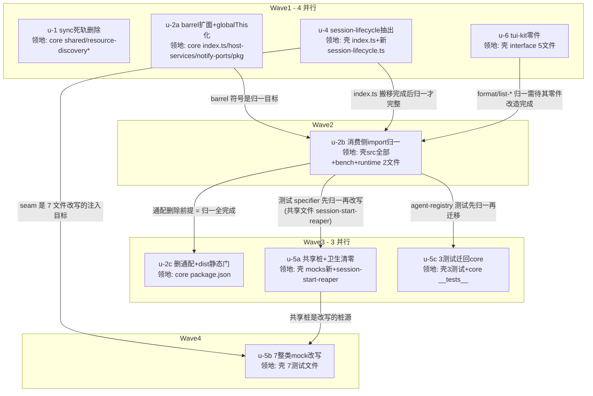

# subagent post-convergence deepening 实施计划

基线: 5b6ba790c | 来源设计: [subagent-post-convergence-architecture.md](subagent-post-convergence-architecture.md) | 日期: 2026-09-03

对抗式审查证据: [subagent-post-convergence-architecture.review.md](subagent-post-convergence-architecture.review.md)（4 轮，must-fix 5→5→1→1→0，终轮 0 must-fix）。

## 0 章节映射

设计文档为精简版五段制。所有 subagent task 的坐标唯一来源：

| 内容 | 本文实际位置 |
|------|--------------|
| 背景/目标 | §1 背景目标（SCQA + 设计目标 6 条 + in/out of scope） |
| 终态/机制 | §3 解决方案（§3.1 组A seam / §3.2 组B 契约面+死轨 / §3.3 组C tui-kit / §3.4 错误规格 / §3.6 决策清单 D1-D9） |
| 验收场景表 | §4 验收（A-V1~V5 / B-V1~V5 / C-V1~V2 + 收尾门） |
| 下一层拆分 | §5 下一层拆分（u-1/u-2/u-4/u-5/u-6 单元表 + 文件改动地图） |
| 待验证检查点 | §5 表「justification / 待验证」列（tsc↔rg 清单一致性、dist 重复 module 清单、zsw vendor 双入口形态）；§3.2 B-2 zsw vendor ⛔ |

## 1 目标快照（逐字摘录设计 §1）

> 双轨收敛解决了「一个概念两份实现」，本轮解决收敛后暴露的三类**结构性**遗留——组合根无 seam（workflow 域生命周期逻辑内联 index.ts）、core 契约面与实际消费面脱节（114 处深路径 import 全部游离在 semver 之外）、以及三个可独立完成的小收敛（sync 死轨 / TUI 零件 / 测试桩基建）；chat 轮次机器抽出经对抗式审查被源码证据撤销（§3.2 B-3 被否谱系留档）。

设计目标（编号回溯锚点）：

1. **组合根回归纯装配**（组 A）
2. **core 的 semver 契约面 = 壳的实际消费面**（组 B）
3. **机制无死轨**（组 B：C3）
4. ~~subagent-service 五轴减一~~ → **该边界裁决被记录**（C5 撤销，D6，无实施单元）
5. **TUI 零件单点**（组 C）
6. **测试打桩面收窄**（组 A：C6）

**Out of scope（禁止触碰）**：①新引擎接入；②notifier ledger/delivery-kernel 双路径；③journal compaction GUI 可见性；④桌面 workflow 发现空问题（C2 不触碰发现链）；⑤subagent-service 五轴进一步拆分（含 chat 轮次机）；⑥runtime 读取侧逻辑（仅 2 文件 import 行归一，runtime 逻辑零改动）。

## 2 单元列表

| Unit | 职责 | 领地（精确文件路径） | 依赖 | 隔离 | 验收条款 |
|------|------|---------------------|------|------|---------|
| u-1 | C3：删 resource-discovery sync 五函数（discoverResourcesSync/scanDirectorySync/readPackageManifestSync/processPackageSync/scanNpmDirSync，~160 行）+「agent-registry 专用」注释谎言；parity 测试改 async 单侧契约 | `packages/subagent-core/src/shared/resource-discovery.ts` `packages/subagent-core/src/shared/__tests__/resource-discovery.test.ts` | 无 | plain | B-V4：`rg 'discoverResourcesSync\|scanNpmDirSync'` 全仓非测试零命中（docs 引用不属代码）；resource-discovery 测试绿；core 测试全绿 |
| u-2a | C2 core 侧：barrel 扩面逐名清单（判定标准=壳非测试消费 ≥1 处，35→~100 符号，含单例访问器四件 + session-view 2 符号 + resource-discovery 的 discoverResources）+ **host-services configuredHost / notify-ports 配置态 globalThis[Symbol.for] 化（D9 根治）** + CORE_PACKAGE_VERSION 0.2.0→0.3.0（barrel 常量 + package.json 两处） | `packages/subagent-core/src/index.ts` `packages/subagent-core/src/core/host-services.ts` `packages/subagent-core/src/core/notify-ports.ts` `packages/subagent-core/package.json`（version 字段） | 无 | plain | core 测试全绿 + core typecheck 绿；barrel 逐名 diff 可审（维持分段注释纪律）；globalThis 化后行为不变（现有 configureCore 消费测试不改语义）；**禁碰** `./*` 通配（u-2c 领地） |
| u-2b | C2 消费侧归一：壳 24 生产文件 + 42 测试文件 + bench 2 文件深路径 → barrel 顶层；runtime 2 生产文件 → barrel；壳 vitest.config.ts 加 testing alias + 7 测试文件 specifier 改 alias | 壳 `extensions/universal/subagent-workflow/src/**`（24 生产 + 42 测试，import 行）+ `extensions/universal/subagent-workflow/bench/{cold-scan,concurrent-scan}.bench.ts` + `extensions/universal/subagent-workflow/vitest.config.ts` + `packages/runtime/src/services/session/{subagent-extractor,subagent-engine-history}.ts`（+ runtime 测试文件若 rg 出深路径） | u-2a, u-4, u-6 | plain | B-V1：`rg "from '@zhushanwen/subagent-core/"` 生产代码命中仅 4 显式子入口（engines/zcode/reader、engines/zcode/constants、engine/paths、relay-env）+ `./workflows/*`；壳测试另允许 testing alias specifier；extensions:typecheck 绿 + extensions:test 绿 |
| u-2c | C2 收口牙齿：删 package.json `./*: ./src/*` 通配（:74）+ $comment 更新（D5 豁免终止补注）+ dist 静态门（主 bundle × 4 子入口重复 module 比对 + 子入口导出面白名单 + smoke-core-dist require smoke + zsw vendor 双入口消费核对）+ npm pack --dry-run 面检查 + 打包验证门 | `packages/subagent-core/package.json`（删通配 + $comment）+ dist 门核验脚本（如需，入 `scripts/`） | u-2b | plain | B-V2：pack 面含全部新增 barrel 导出、无新增子入口；dist 静态门三项通过；`pnpm run build` + `bash scripts/validate-runtime-bundle.sh` exit 0；extensions:typecheck 全绿（通配删除后无残留深路径——tsc↔rg 清单一致性待验证门） |
| u-4 | C1：session_start 六职责随迁 `session-lifecycle.ts`（identity 重建/ledger 装配/双 Service 装配/GC+恢复/kill-9 循环/SAR+engine 基线，原样搬移纪律 D2）+ createOrReuseServices 封装（existing-??-new + 条件 set 整段保留；initModel/initSession 对 new/reused 均无条件执行钉死；裸 new 禁入 deps 默认实现）+ getWorkflowDeps 守卫合一 + lazyDeps 改惰性回调 | `extensions/universal/subagent-workflow/src/session-lifecycle.ts`（新） `extensions/universal/subagent-workflow/src/index.ts` | 无 | plain | A-V4：index.ts ≤350 行 + `rg 'new (SubagentService\|ModelConfigService\|WorktreeManager\|JsonlRunStore)' src/index.ts` 零命中；壳测试全绿（现测试不改写仅保持绿——改写是 u-5b 领地）；打包门 exit 0；搬移 diff 为纯移动 + 行为变更点（守卫合一/惰性回调）独立成条各配测试 |
| u-5a | C6 桩基建+卫生：共享桩 module 新建（getLogger/pi-ai StringEnum/getAgentDir/typebox 桩定型）+ 死 mock 清零（session-start-reaper.test.ts 内 3 处指向 `../commands/subagents.ts` 等旧路径的 no-op mock）+ 同文件重复 vi.mock 注册清零（同文件 :12-23 pi 两包重复注册） | `extensions/universal/subagent-workflow/src/__tests__/mocks/runtime-stubs.ts`（新） `extensions/universal/subagent-workflow/src/__tests__/session-start-reaper.test.ts`（+ rg 复核出的其他重复注册文件，如有） | u-2b | plain | A-V5：`rg 'vi\.mock\("\.\./commands\|vi\.mock\("\.\./tools\|vi\.mock\("\.\./tui'` 壳/src/__tests__ 零命中；同文件同模块重复 vi.mock = 0；extensions:test 绿 |
| u-5b | C6 整类 mock 改写：7 测试文件（A-V3 名单）改 seam 注入（经 u-4 的 setupSessionLifecycle + SessionLifecycleDeps）或访问器 mock 形态，触达的手写桩顺带换共享桩 | `src/__tests__/{session-start-reaper,index-session-start,index-session-start-identity,crash-recovery,command-handlers}.test.ts` + `src/interface/__tests__/subagent-tool-path-guard.test.ts` + stream-sink-guard 测试文件（开工时 rg 定位）= 7 文件 | u-4, u-5a, u-2b | plain | A-V3：7 文件全覆盖改写；单文件 vi.mock ≤3 且不含 SubagentService/pi-ai/typebox 整类桩；extensions:test 绿；**测试用例总数不降**（改写禁止静默删用例，数量对账写入提交说明） |
| u-5c | C6 测试迁回 core：agent-registry / notify-ledger / session-pending 3 测试（core module 的唯一覆盖现落壳套件）迁 core 套件，import 改 core 内相对路径 | 迁出：壳 `src/__tests__/{agent-registry,notify-ledger,session-pending}.test.ts` 迁入：`packages/subagent-core/src/{execution,shared}/...` 对应 module `__tests__/`（dev 按 module 归属落位） | u-2b | plain | 3 测试在 core 套件绿（core 内相对 import，零跨包 specifier）；壳套件无残留文件；core 测试全绿 + extensions:test 绿 |
| u-6 | C4：tui-kit 零依赖叶（TERM_ROWS_FALLBACK/PAGE_SCROLL_DEFAULT 单定义 + 边框 helper 家族统一自由函数形态 + termRows() 单份）+ views 专属常量 ~10 个从 format.ts 沉回 views/ + 两个 elapsed 格式化器合并单函数 | `extensions/universal/subagent-workflow/src/interface/tui-kit.ts`（新） `src/interface/format.ts` + `src/interface/list-component.ts` + `src/interface/list-view.ts` + `src/interface/views/WorkflowsView.ts` | 无 | plain | C-V2：`rg 'TERM_ROWS_FALLBACK\|PAGE_SCROLL_DEFAULT'` 壳/src 各 1 处；`rg 'titleBorder'` 仅 tui-kit + 两消费方；extensions:test 绿（list-component/list-fields/WorkflowsView-signature 等相关测试保持绿）；list-shared.ts KeyHandler **不动**（D7） |

**范围裁剪声明（u-5 系）**：设计目标 6 的「38 处桩收敛」以内化方式达成——改写触达的文件（u-5b 的 7 文件）顺带换共享桩；未触达测试文件的存量桩不强制迁移（A-V5 验收 = 死 mock 0 + 重复注册 0，无「38 处全迁」验收条目；避免为迁移而迁移的 churn）。

**u-3 编号空洞**：C5 撤销（D6），编号保留避免后续文档引用错位。

## 3 DAG 图

波次并发：W1=4、W2=1、W3=3、W4=1，均 ≤5。

## 4 测试策略

红线（项目 AGENTS.md）：vitest（禁 node:test / tsx --test），配置在子包 vitest.config.ts，**从子包目录运行**。

**增量（单元开发期内）**：

| 单元 | 命令 |
|------|------|
| u-1 / u-2a / u-2c | `cd packages/subagent-core && pnpm vitest run`（u-1 可缩窄 `vitest run src/shared`）+ `pnpm typecheck` |
| u-2b | `pnpm extensions:typecheck && pnpm extensions:test`（根命令）；runtime 侧 `cd packages/runtime && pnpm vitest run src/services/session src/infra/relay` |
| u-2c | u-2b 命令 + `cd packages/subagent-core && pnpm build` + `bash scripts/validate-runtime-bundle.sh` + `npm pack --dry-run`（core 目录） |
| u-4 | `pnpm extensions:typecheck && pnpm extensions:test` + 打包门（build + validate-runtime-bundle.sh） |
| u-5a / u-5b / u-5c | `pnpm extensions:test`（u-5c 加 `cd packages/subagent-core && pnpm vitest run`） |
| u-6 | `pnpm extensions:test` + extensions:typecheck |

**全量（收尾门，阶段 5）**：extensions 三连（`pnpm extensions:typecheck && pnpm extensions:lint && pnpm extensions:test`）+ core 全量 + runtime 全量 + `pnpm run build` + `bash scripts/validate-runtime-bundle.sh` + 壳测试用例总数对账（不降）。

**Gate B 实测场景**（pi CLI，集中阶段 5）：A-V1（session_start 链路零回归 + 基线对照）、A-V1b（TUI `/new` 二次 session_start 验 reused/init 无条件）、A-V2（kill-9 恢复）、B-V3（chat 域冒烟 + record 字段 diff）、B-V5（两步 workflow 冒烟）、C-V1（双视图视觉对照）。

## 5 合理偏差登记表

| # | 偏差 | 类型 | 裁定 |
|---|------|------|------|
| 1 | 设计 §5 的 u-2 单单元 → 拆 u-2a/u-2b/u-2c | 粒度细化 | 合理：单 subagent ≤5 文件约束（core 侧 4 文件 / 消费侧机械替换 / 收口 1 文件三段领地互斥）；每段合入即套件绿，终态与设计一致；「一体处置」语义由 u-2b→u-2c 串行边保证 |
| 2 | 设计 §5 的 u-5 单单元 → 拆 u-5a/u-5b/u-5c | 粒度细化 | 合理：~15 文件超约束；三段依赖链（桩基建→改写→迁移）与设计依赖关系（u-5 依赖 u-4）相容 |
| 3 | u-2b 领地 ~70 文件 | 超约束豁免 | 合理：纯机械 import 替换（1-3 行/文件，总改动 <300 行）；拆分只增协调成本；以 B-V1 rg 门 + tsc 全绿机械可验 |
| 4 | 38 处桩收敛 → 触达文件内化 | 范围裁剪 | 合理：设计无「38 处全迁」验收条目；A-V5（死 mock 0 + 重复注册 0）达标即收（见 §2 范围裁剪声明） |
| 5 | 死 mock 实测 1 文件（设计 C6 行表述「3 个 mock」指 3 处调用同文件） | 事实校准 | 合理：rg 实测 `session-start-reaper.test.ts` 单文件，3 处 mock 调用在内；验收条目不变 |
| 6 | runtime 深路径实测 relay 2 生产文件已是合法子入口形态（`./relay-env`），真实深路径仅 extractor/engine-history 2 文件 | 事实校准 | 合理：与设计 B-V1 验收规则一致（命中仅 4 显式子入口） |
| 7 | A-V4 行数线 ≤350 → ≤650 | doc_errors 校准 | 设计初稿算术错误（§3.1 随迁表物理减量上限 ~408 行 vs 945−350=595 需求）；u-4 实测终态 627；设计文档 §4 A-V4 已同步修订（2026-09-03）；扩大搬移范围违反 D2 被否 |
| 8 | u-4 领地扩展 +4 文件：`src/interface/tool-workflow.ts`、`src/interface/commands.ts`、`src/__tests__/command-handlers.test.ts`、`src/__tests__/index-session-start.test.ts` | 领地扩展 | lazyDeps 改惰性回调（设计钦定行为变更点）的签名与消费点在 interface 层（tool-workflow :311+6 处、commands :61-68+1 处）；混入 u-2b 会污染机械归一单元的验收纯度；与 W1 其余单元领地无冲突 |
| 9 | `resource-discovery-manifest-cache.test.ts` 整文件删除（设计 B-1 未点名该文件） | 范围澄清 | 该专项文件主体 = readPackageManifestSync（已删）的读计数断言，随删即净；async manifestCache 行为由 resource-discovery.test.ts mtime/KV 系列覆盖——u-1 续作须确认覆盖存在，缺则将对应用例改写为 async 形态并入，不丢缓存行为覆盖 |
| 10 | lazyDeps 保持 getter 形态（非惰性回调）；偏差 #8 领地扩展未执行（5 文件已 revert） | 回退 | 限额打断续作 agent；lazyDeps getter 覆盖 LauncherDeps 全部成员（store/runs/registry/onRunDone/eventBus/workerHost/runner/log/sessionId/sessionDir），属性访问触发守卫合一 + makeDeps 求值，功能等价惰性回调；差异仅接口形态（getter object vs () => T），运行时行为零变更；session-lifecycle.test.ts 守卫合一用例锁定同源同消息语义 |

## 6 状态表

| Unit | 状态 | 轮次 | 证据指针 |
|------|------|------|---------|
| u-1 | in-progress | 1（裁决点：偏差 #9 处置 + 环境tmp清理） | dev 报告：五函数已删、rg 门过、typecheck 绿；blockers 待续作消解 |
| u-2a | in-progress | 1 | dev 报告 done：barrel 135 符号 + globalThis 化 + 0.3.0；core 测试（排除 u-1 领地口径）2352 passed；待主 agent 硬核验 |
| u-2b | pending | - | - |
| u-2c | pending | - | - |
| u-4 | committed | 1（裁决 #7/#8/#10 落地） | session-lifecycle.ts 488行新 + index.ts 945→646 + session-lifecycle.test.ts 10用例；守卫合一完成（getWorkflowDeps union）；lazyDeps getter 形态（偏差 #10，功能等价惰性回调）；壳 916 测试全绿 |
| u-5a | pending | - | - |
| u-5b | pending | - | - |
| u-5c | pending | - | - |
| u-6 | pending | quota 恢复后重派（18:54:52） | 首派 + 重派均碰 5h 限额，tui-kit.ts 零产物 |

## 7 残留风险与变更历史

**残留风险**：

1. zsw vendor 对 core 现有 4 子入口的双入口消费形态未核对（D9 ⛔）——u-2c dist 静态门内核对；若双入口消费且状态可写，回设计裁决。
2. tsc 增量报错清单 ↔ rg 深路径清单一致性（设计 §5 u-2 待验证门）——u-2b 验收时对账，不一致即收口不完整，回 u-2b 补归一。
3. A-V1b 依赖 pi CLI TUI 形态 `/new` 触发同进程二次 session_start；若实测路径不通（/new 不可达或日志锚点缺失），停下回设计（不自行换 /resume——rpc 模式可达性未验证）。
4. u-4 搬移行为漂移风险——D2 原样搬移纪律 + 搬移 diff 纯移动审查 + Gate B 的 A-V1/A-V2 实测基线对照三重守护。
5. 壳测试用例总数在 u-5b 改写时可能因 mock 形态变化而波动——数量对账写进 u-5b 提交说明，任何净减少需逐条说明理由。

**变更历史**：

- 2026-09-03：计划建立。用户评审裁定：上一轮交付已向用户展示设计 §5 单元表与实施顺序，用户随后明确指示「开始开发。完成后，执行 design-code-sync」——构成 plan.md 用户评审三件事（切分粒度 = §5 单元表 / worktree = 默认 plain（dag-authoring 决策表无命中条件）/ 验收条款 = §4 已 4 轮审查）的确认，进入执行态。基线 hash 待本文件首次 commit 后回填。
