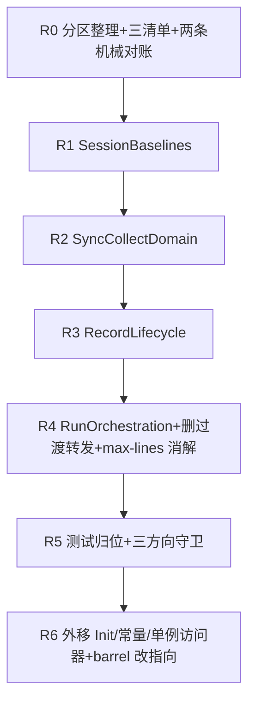

# SubagentService 上帝类拆分 实施计划
基线: 37a53dbb7 | 来源设计: docs/design/subagent-service-decomposition.md（tech-design 对抗审查收敛版） | 日期: 2026-09-12

## 0 章节映射
| 内容 | 设计文档实际位置 |
|------|------------------|
| 背景/目标 | §1 背景目标（1.1 SCQA / 1.3 设计目标 G1-G4 / 1.4 in-out scope） |
| 现状域表 | §2 现状与问题分析（2.1 十九职责域全表——R0 以重测域表取代，行号仅审查期参照 / 2.2 痛点 / 2.3 根因） |
| 终态/机制 | §3 解决方案（3.1 终态结构 / 3.2 多方案对比 / 3.3 关键决策 D1-D6 / 3.4 风险与守门） |
| 验收场景表 | §4 验收（S1-S5 真实场景 + 硬指标表） |
| 下一层拆分 | §5 下一层拆分（R0-R6 单元表 + 文件改动地图 + 待验证检查点①-③） |
| 决策溯源 | 附录（决策溯源与被否谱系 5 条） |

对抗式审查证据：tech-design 对抗审查 4 轮收敛（v1 首轮双审击穿 → v2 口径修正 → v3 补归属与对账 → v4 删转发判据改绑定 R0 重生成清单），被否谱系 5 条在设计文档附录；实施期规则以 §3.3 D1-D6 为准，边界命名可微调。

## 1 目标快照

**背景/目标（§1.3 逐字摘录）**：
- **G1 尺寸与聚焦（v2 口径修正）**：壳**类体**行数 ≤ 500（`wc -l` 减去 imports / 模块常量 / 接口声明——外移后残余非类体行 ~150，文件口径不可达，见 S2 算术）；每聚合 ≤ 700 行（附算术：RunOrchestration ≈ 680 + 注入接口样板，600 不可达）；每聚合单一职责域族；改一个域不再通读其余。
- **G2 依赖单向显式**：壳组合聚合；聚合间禁止互调私有方法（需要协作的经壳编排或显式接口）；service 实例字段所有权单一（单写者）——共享 ExecutionRecord 对象内部字段的写点收口归 H4（见 D1 两级归属）。
- **G3 测试随聚合迁移**：每聚合自持测试面；God-class 级测试拆散归属；深绑内部结构的测试改写不降低断言强度（见 D6）。
- **G4 零行为变化**：纯结构重构；全量测试全绿是每步合并门槛；前置 = R0 前确认基线绿（存量红先归档豁免清单——2026-09-11 单次实测 workflow-state-root.test.ts GC 写回用例红、复跑全绿 2849 用例，疑似环境相关，R0 前归档定性）。

**Out-of-scope（§1.4）**：任何行为/语义变化（含日志文案）；跨模块的搬迁（record-store / notifier 等已是独立模块不动）；H1/H2/H4 的改动内容；orchestration/（H2 已清，S5 grep 门零命中维持）；renderer / runtime / shared（不涉本设计）。

## 2 单元表

实测基线锚定（HEAD 37a53dbb7，详见 §7 残留风险①）：壳文件 3588 物理行 / 类体 :333-:3412 / 方法 grep 口径 91 + 字段声明 17（含 queries/chatActions 聚合面 2 个）/ max-lines warning 折算 1842/1700。**下表「域 #N」指设计 §2.1 域编号，行区间为实测值**。

| Unit | 内容 | 领地（允许触碰） | 依赖 | 难度 | 验收 |
|------|------|------------------|------|------|------|
| R0 | 壳内分区整理（纯移动零抽取）：按设计 §2.1 域重排类成员 + 分区注释（实测域区间见 §7 注记，#9/#16 已随 H1 消亡、#14 已增 H2 workflow 族）；**产出三清单：①实例字段逐个归属表（实测类字段声明 17 个 + 构造器 :507 内 this.* 赋值 12 处为盘点起点）②record 字段写点通道边界表（D1 第二级，含 SyncCollect 直调 store 的落标/E1 重建投影写通道——不得改道 RecordLifecycle）③深绑测试全集（D6；实测 grep `as unknown as\|ServiceInternals` 在 execution/__tests__ 命中 28 文件，含非深绑用途，R0 重收敛）**；同时登记已知跨聚合边：壳 dispose 直改 SyncCollect 内部态 settledRescanState（收敛为显式接口）；R0 前基线绿核对（G4 前置，含 workflow-state-root.test.ts 环境红定性归档） | `packages/subagent-core/src/execution/subagent-service.ts`（纯移动）+ `packages/subagent-core/src/execution/__tests__/`（只读盘点，零改动） | 无 | medium | 三清单落盘（建议写入设计文档附录或 `docs/design/subagent-service-decomposition.r0-inventory.md`，命名建议实施可调）+ **两条机械对账通过：①清单行数 vs 类字段声明 grep 计数一致 ②写点通道表 vs record 字段赋值 grep 计数一致** + 全量测试绿（基线已先核对） |
| R1 | 抽取 SessionBaselines（域 #2，实测 :613-:730）：initSession / initForkDepthBaseline / initExecContextBaseline + 字段 pi/sessionId/mainSessionFile/sessionRootId/forkDepthBaseline/rootCwd/streamSink/isIdleFn/dialogQueue/uiRequestHandler（归属以 R0 ①清单为准）；抽取后壳委托转发，对外方法签名不变；模式打样（深绑测试改写面首次落地——运行时字段替换语义依赖「闭包经 this 读取」的用例按 D6 改写） | 壳文件 + 新增 `packages/subagent-core/src/execution/service/session-baselines.ts` + `execution/__tests__/` 对应用例改写 | R0 | medium | S2/S5 + assertReady 下沉（D4：late-bound getter 注入形态 `() => ({pi, disposed})`）不破 session 复活（initSession 后复活用例） |
| R2 | 抽取 SyncCollectDomain（域 #5，实测 :986-:1234）：collectCoordinator 装配 + E9 转账 + getCollectSyncBudget / markMembersBatchFinalized / recoverSyncCollectBatch / armSettledRescan + settledRescanState 字段；**待验证检查点①：flushBatch 依赖 service 闭包——抽取时改显式依赖注入**；D1 v3 约束：SyncCollect 直调 store 通道不改道；壳 dispose 直改 settledRescanState 跨聚合边收敛为显式接口（R0 登记项兑现） | 壳文件 + 新增 `packages/subagent-core/src/execution/service/sync-collect-domain.ts`（不动 collect-coordinator.ts——已独立模块） | R1 | medium | S2/S5 + sync 批恢复用例 + E9 先于批量 archive 时序断言 |
| R3 | 抽取 RecordLifecycle（域 #3/#4/#8/#10/#11/#13/#17/#18，实测 :731-:871 / :872-:985 / :1235-:1334 / :1419-:1503 / :1504-:1709 / :2036-:2089 / :2090-:2177 身份段 / :3200 cancel / :3277-:3412 finalize 簇）：孤儿与 manifest 恢复 / 回收面（disposeAllRecords/onParentFork/onParentNew/startGcTimer）/ 查询面 / action 网关 / close 分流 / 身份解析与 record 创建 / cancel / finalize 簇；**含域 #4 回收面（被否谱系 #3——漏列即破所有者声明）**；本聚合 = store 与终态迁移入口的唯一宿主（H4 落点，D5）——本单元只搬不改 | 壳文件 + 新增 `packages/subagent-core/src/execution/service/record-lifecycle.ts`（不动 record-store.ts / finalize-record.ts / manifest-store.ts——已独立模块） | R2 | high | S2/S5 + S1 的 close/重启链路 + 待验证检查点③：壳 dispose 编排对 RecordLifecycle 的调用顺序与现状等价（E9 先于批量 archive 时序保持） |
| R4 | 抽取 RunOrchestration（域 #6/#7/#12/#14/#15，实测 :1335-:1418 / :1710-:1829 / :1830-:2177 workflow 族 / :2250-:2760 引擎编排 / :2745-:2800 pool/worktree）+ 删过渡期冗余转发：model 解析 / execute / executeAndAwait / **H2 workflow 族整段（executeWorkflowAgent :1830 + runWorkflowEngineTask :1918 + 类外模块级 helper :3415-:3550——armWorkflowNoProgressWatchdog / bindWorkflowStreamRefresh / noteIfWorkflowNoProgressFired / outcomeToWorkflowResult / workflowCallToExecuteOptions 随族迁入）** / executeViaEngine / kickOffEngineRun / runEngineTask / adopt / finalizeEngineOutcome / settleOneShotOutcome（含 finalizeRoundToIdle wrapper）/ acquirePoolOrFinalize / resolveWorktreeHandle / releaseRoundResources；删转发判据绑定 R0 时重生成的 grep 清单（D3+：壳终态永久保留面含 getStreamSink / getSessionRootId 两个漏列活消费点）；notifyGateAllowsDelivery 壳保留 re-export（实测 :84-85 现状即 re-export notifier.ts，机制不变）；**壳化后重测 max-lines warning（§7 ④）** | 壳文件 + 新增 `packages/subagent-core/src/execution/service/run-orchestration.ts`（import 已外置的 `execution/engine/common/run-signals.ts` 仅迁移引用，文件本身不动） | R3 | high | S2/S3/S5 + workflow 派发链用例（executeWorkflowAgent 注册面/守护 arm 键/D7 收口）+ max-lines warning 消解确认（壳折算行 ≤1700） |
| R5 | 测试归位 + 守卫：God-class 级测试按聚合拆散归属（每聚合至少一个同名域测试文件，S4）；三方向循环依赖守卫（聚合间 / 聚合→壳 / 壳→聚合）+ 私有互调 grep 门（参照既有 services 循环依赖检查先例，subagent-core 侧新建；守卫落点建议 `.githooks/` 或包内 lint 规则，实施定）；assertReady 反向边（聚合→壳）三方向覆盖（D4） | `packages/subagent-core/src/execution/__tests__/`（迁移与改写）+ 守卫脚本新增落点（`.githooks/` 或 `scripts/`，实施定） | R4 | medium | S3/S4 + 守卫对存量结构零误报 + 深绑改写断言强度对照表（D6：spyOn 内部 / 字段替换 / ServiceInternals 逐文件声明改写形态） |
| R6 | 外移 Init 接口 / 模块常量 / 单例访问器至 `execution/service/` 独立文件（壳类体 ≤500 门槛达成单元，S2 口径：imports/模块常量/接口声明三类外移后残余非类体行 ~150）：SubagentQueries :156 / SubagentChatActions :178 / SubagentServiceInit :223 / SubagentServiceSessionInit :235 / 模块常量（:265-:307 段）/ 单例访问器 :3552-:3588（SERVICE_SLOT_KEY / getServiceSlot / getSubagentService / setSubagentService / createSubagentService）；**import 纪律（v4）：Init 接口 type-only；单例访问器经 barrel 直接改指向 service-bootstrap、不做壳 re-export（防壳↔bootstrap 值环）**；barrel 导出面不变（`packages/subagent-core/src/index.ts` :205/:209/:212 现状 re-export 链保持符号面）；R5 守卫扩壳侧支撑文件方向 | 壳文件 + 新增 `packages/subagent-core/src/execution/service/service-bootstrap.ts` + `packages/subagent-core/src/index.ts`（仅改 import 指向，导出符号面不变） | R5 | low | S2（壳类体 ≤500 行 + 单类成员 ≤40）+ barrel 导出面不变断言（对外消费方 subagent-actions-core ×23 处 / subprocess-agent-runner / extensions session-lifecycle / workflow index.ts 零改动）+ R5 守卫扩方向后仍绿 |

## 3 DAG 图

串行主线（R0→R1→R2→R3→R4→R5→R6）。判定说明：

- **R1-R4 之间硬串行**：四个聚合抽取全部以同一物理文件 `subagent-service.ts` 为唯一操作面，strangler 式每步委托转发，并行必然 diff 冲突；且 D2 抽取序 = 依赖最少先（SessionBaselines 几乎零依赖 → SyncCollect 注入面窄 → RecordLifecycle 含回收面与 SyncCollect 时序硬耦合 → RunOrchestration 依赖前三者），顺序颠倒会造成后续单元引用未抽取的依赖。
- **R5 依赖 R4**：守卫建在终态聚合结构上（三方向 import 图在 R4 后才完整）；测试归位需各聚合文件落位后才能按域拆散。
- **R6 依赖 R5**：设计 §5 明文「R5 守卫扩壳侧支撑文件方向」——R6 产物（service-bootstrap.ts）需纳入 R5 守卫范围，R5 先建、R6 后扩。
- **R5 与 R6 理论弱并行**（R5 主领地 `__tests__`、R6 主领地壳尾部支撑符号，交集小），但守卫扩展的先后耦合（R6 需 R5 守卫存在）与同文件系改动风险，保守串行（单 dev 顺跑成本已低）。
- R0 是全部后续单元的实施依据（三清单），无依赖可立即启动。

## 4 验收场景
见设计文档 §4 S1-S5（真机阶段执行）。执行注记：S1 全功能回归（真实 GUI + 真实 LLM，六条链路含 H2 后形态的 message 冷启 resume）时点 = **R4 后终验 + 全部合并前复跑**，判据 = 与拆分前逐项一致；S2 尺寸硬指标（壳类体 ≤500 / 每聚合 ≤700 / 成员 ≤40）在 R1-R4 每步与 R6 达标时点分别机器核算；S5 全量测试（subagent-core 全量，基线 2849 用例 17s 量级 + extension 三连）为每 PR 合并门槛；S3 依赖单向由 R5 守卫机械检查接管。

## 5 偏差登记表

| 单元 | 条目 | 说明 |
|------|------|------|
| R1 | D-R1-1 SessionInit 接口本体迁聚合 | R6 的 Init 外移范围相应收窄（剩 SubagentServiceInit/常量/单例访问器） |
| R1 | D-R1-2 ENV 常量 SSOT 提前迁聚合 | D4「聚合→壳禁 import」的必然要求，属 R6 常量外移的部分提前 |
| R1 | D-R1-3 R0 清单③深绑口径缺口 | `Reflect.get(service, "字段")` 形态不在原 grep 口径，R1 补录 4 文件 6 处；R5 归位复扫时把该形态纳入口径 |
| R1 | D-R1-4 _seq 死字段删除 | 清单① B-7 兑现（删前全文件零消费复核） |
| R1 | D-R1-5 SessionInit.mode JSDoc 陈旧 | 提及的 this.sessionMode 字段早已不存在；按零行为/注释随迁原则未修，留后续清理 |
| R2 | D-R2-1 清单③三文件改写预判未发生 | flushBatch 晚绑定 deps 现读形态下 FR 深绑语义自然保留（spy 替换壳字段仍生效）；R5 归位复扫按实际形态核销 |
| R2 | D-R2-2 max-lines warning 提前消解 | 折算 1785→1640 < 1700；override 收窄/移除仍留 R4（lint 配置领地外） |
| R2 | D-R2-3 modelService 依赖窄化 | collectSyncSection 改节读取 getter，聚合不感知 ModelConfigService（读取链逐行等价） |
| R2 | D-R2-4 recoverSyncCollectBatch 转发形态 | async 方法 → 非 async 返回 Promise 单行转发（名称/参数/返回类型不变，可观察等价） |

## 6 状态表

| Unit | 状态 | 轮次 | 证据指针 |
|------|------|------|---------|
| R0 | committed | 1 | （基线后首个 commit）：18 域分区纯移动重排（独立复核 = 非注释行多重集 md5 一致 + 113 块锚点断言）+ r0-inventory.md 三清单（①34 字段重收敛口径 + 12 构造器赋值 + 7 跨聚合边；②16 直写写点通道表；③28 文件/87 命中 → 13 真深绑定性）+ 两条机械对账（34/34、16/16）+ 基线绿 2903/4；偏差 8 条登记于清单 §6（关键：impl-plan「字段 17」口径不可复现重收敛为 34；R1 字段清单漏列 uiObservability/execNesting/forkDepthAls 以清单为准；finalizeRoundToIdle 归 R4） |
| R1 | committed | 1 | 7 文件 +535/-286：session-baselines.ts 397 行聚合（≤700 达标）+ 壳转发化（折算 1842→1785）+ 跨聚合边收敛 2/7（C-2 deps 回调、C-3 disposeSessionUi）+ 深绑改写 13 处全等价（对照表在报告）+ 聚合面零变化（diff 零命中）+ 模式打样固化于聚合文件头（晚绑定 deps/窄结构类型/单写者 getter/常量 SSOT 迁移）。偏差 5 条：D-R1-1 SessionInit 接口本体迁聚合（R6 交叠预告）/ D-R1-2 4 个 ENV 常量 SSOT 提前迁（R6 部分提前）/ D-R1-3 R0 清单③ grep 口径缺 `Reflect.get(service,` 形态，补录 4 文件 6 处（R5 复扫口径纳入）/ D-R1-4 _seq 死字段删除 / D-R1-5 SessionInit.mode JSDoc 陈旧注释随迁留清 |
| R2 | committed | 1 | 2 文件 +570/-377：sync-collect-domain.ts 518 行聚合 + 壳转发化（折算 1785→1640，max-lines warning 提前消解）；检查点① 落地（flushBatch 依赖两分：聚合私有 this + 8 晚绑定 getter，service 整实例零注入）；C-1 收口（lazyDispose）+ R1 回调改接（聚合间零直写，互不 import）；D1 v3 不改道逐行自查过；E9 时序 + flush 屏障断言绿（R3 检查点③前置已锁定）；涉本域 6 个深绑文件零改写（晚绑定现读保 FR 语义）。偏差 4 条：D-R2-1 清单③三文件改写预判未发生（晚绑定形态根因，R5 按实际核销）/ D-R2-2 warning 提前消解（override 收窄仍留 R4）/ D-R2-3 modelService 窄化为节读取 getter / D-R2-4 recoverSyncCollectBatch 转发 async→非 async Promise（可观察等价） |
| R3 | pending | - | |
| R4 | pending | - | |
| R5 | pending | - | |
| R6 | pending | - | |
| 阶段3（一致性对抗审查） | pending | - | |
| Gate A（机器门） | pending | - | |
| Gate B（真机） | pending | - | |

## 7 残留风险与变更历史

- 残留风险（计划创建时点登记，实施期追加）：
  - ① **设计基线数字已过时，以当前 HEAD 重测为准**：设计头部「3255 行 / 103 类成员 / 19 域」为 H1 前基线（2026-09-10 L 批次后）。HEAD 37a53dbb7 实测：**3588 物理行**（H1 删 chat 域方法族净缩，H2 增 workflow 族净增，净 +333）；**类体 :333-:3412（约 3080 行）**；**方法 grep 口径 91（`^  (private|async|get|public )…\(`）+ 类字段声明 17（含 queries/chatActions 聚合面 2 个 readonly）+ 构造器 :507 内 this.* 赋值 12 处**——设计 103 成员口径与本实测口径不可直接互比，R0 以统一 grep 口径重收敛并落 ①清单；域行区间全面漂移（§2 单元表已逐域注记实测值，如 #5 sync 批 :986-:1234、#18 finalize 簇 :3277-:3412）。**实施一律以符号 grep 锚定，禁止按设计 §2.1 行号或本计划行号直接编辑**。
  - ② **H2 刚落地，壳文件形态有变**：executeWorkflowAgent :1830 / runWorkflowEngineTask :1918（八步迁移 + D7 收口 + D6 gate）/ 类外模块级 helper :3415-:3550（armWorkflowNoProgressWatchdog 等 5 个，WorkflowNoProgressGuard 接口 + 单例访问器前段）/ notifyGateAllowsDelivery 壳内 re-export :84-85（设计 §5 写「:257 保留 re-export」，机制不变行号漂移）/ barrel :205/:209/:212 re-export 链。各单元派发前 dev 必须先 read 当前壳文件对应段现状再动手，禁止按设计文档行号想象；H2 新增段归属已核对：workflow 族全部归 RunOrchestration（域 #14 增项，与设计 §3.1「H2 的 executeWorkflowAgent 归 RunOrchestration 协作面」一致）。
  - ③ **H2 阶段提出的 run-signals.ts 不影响抽取序**：已外置为 `packages/subagent-core/src/execution/engine/common/run-signals.ts`（83 行叶子模块，壳 :53 import mergeRunSignals）——不在类体、无 service 依赖，RunOrchestration 抽取时仅迁移 import 引用，文件本身不动；orchestration/ 亦无残留待清项（H2 W4 grep 门 createRecord 零命中维持）。本设计领地不含 orchestration/、renderer、runtime、shared。
  - ④ **engine-client.ts「545 行 lint 拆分债」口径与实测不符**：实测 `packages/subagent-core/src/execution/engine/client/engine-client.ts` = **732 行，eslint 实跑零告警**（不在任何 max-lines override 清单，折算行在阈值内）；其头部自声明职责内聚（协议客户端单类）。该文件不在本设计领地与单元表内；若实施期发现 R4 引擎编排抽取与它存在强耦合需触碰，按偏差登记表流程上报批准。
  - ⑤ **subagent-service.ts max-lines warning 处置归属 = 本设计 R4**：eslint.config.mjs :489-:495 为该文件单列 override `['warn', { max: 1700, skipBlankLines: true, skipComments: true }]`（旧位 2141 行起的逐次抬升史 + 注释明言「长期拆分（service 门面 / record 子图 / chat 轮次编排 / spawn 编排）待独立重构」= 即本设计）。当前折算 **1842 行，超阈值 142，warning 级**。R4 壳化后重测，预期消解并应同步收窄或移除该 override（移除动作属 lint 配置文件，超出 R4 领地字面，按偏差登记流程处理）；禁止在本设计实施期为它再抬阈值。
  - ⑥ **深绑测试口径膨胀**：设计 D6「≥10 个测试文件」为旧口径；实测 `execution/__tests__/` 83 个文件中 grep `as unknown as|ServiceInternals` 命中 28（含非深绑用途的断言转型）。R0 ③清单逐文件定性收敛，R1-R4 每步按清单声明改写形态，断言强度不降（S4 判据）。
  - ⑦ **待验证检查点①-③（设计 §5 末段）为实施期门**：① flushBatch 闭包拆分（R2）；② R0 三清单（R1-R4 实施依据）；③ dispose 时序等价（R3，E9 先于批量 archive 的时序约束保持）。存量红 baseline：workflow-state-root.test.ts GC 写回用例 2026-09-11 单次红、复跑全绿（2849 用例），R0 前归档定性，可复现则记录复现条件。
  - ⑧ **会话外变更警示**：计划创建时工作区存在非本设计链路的未提交改动 `M docs/design/timeout-zcode-turn-and-settled-watchdog.md`（认知外改动，本计划不触碰、不提交、不撤销）；后续单元实施前若工作区不洁，先按规则 0 请用户裁决。
- 变更历史：
  - 2026-09-12 计划创建（来源设计 tech-design 对抗审查收敛版；H2 于 37a53dbb7 交付当日启动，基线 37a53dbb7）。执行依据 = 用户托管指令（H1 → H2 → H3 → H4 串行，dev-flow 全流程）。计划起草前完成现状重测：壳文件 3588 行 / 类体 :333-:3412 / 方法 91 + 字段 17 / max-lines 折算 1842/1700 warning / engine-client.ts 732 行零告警 / run-signals.ts 已外置 83 行——全部实测值已回填 §2 单元表与 §7 残留风险。
