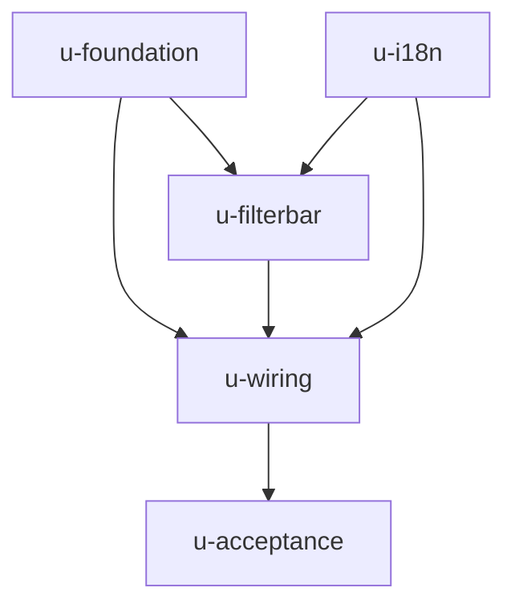

# subagent-sidebar-filter 实施计划

基线: 03ffc8b2e（设计文档 commit；本计划随基线 commit 落库） | 来源设计: docs/design/subagent-sidebar-filter.md | 日期: 2026-09-04

## 0 章节映射

| 内容 | 设计文档实际位置 |
|------|------------------|
| 背景/目标 | §1 背景目标（SCQA + G1–G4 + In/Out of scope） |
| 终态/机制 | §3 解决方案（§3.1 终态 + §3.3 决策 D1–D8 + §3.4 组件设计含代码参考实装） |
| 验收场景表 | §4 验收（S1–S7） |
| 下一层拆分 | §5 下一层拆分（T1–T5 + 文件改动地图） |
| 待验证检查点 | §5 末「待验证」段（结论：无未决项） |

> 审查证据链：`.review/design-review-subagent-sidebar-filter-r1.md`（R1，3 must-fix）→ `r2.md`（聚焦复审，4 must-fix + 4 suggestion）→ `r3.md`（终审 **0 must-fix + 3 条文字级 suggestion 已修，设计就绪**）。设计文档版本 v3.1。
>
> 用户评审豁免记录：用户在派发前明确「不需要向我提问确认，这个需求比较简单」——本计划三问自查代替显式确认：① 切分粒度 = 设计 §5 T1–T5 一一对应，单元均为单文件级小粒度，合理；② worktree = 全部 plain（单分支小改动、无并行领地冲突，dag-authoring 判据不需要）；③ 验收条款 = 设计 §4 S1–S7 覆盖 G1–G4 + D4/D8 边界 + 两条回归，无遗漏。

## 1 目标快照（逐字摘录设计 §1）

> **目标**（从使用者体验倒推）：
> - G1 打开 Agents tab 默认只看到进行中的任务；没有进行中任务时给自适应空态 + 一键查看全部。
> - G2 三桶切换即时生效（纯内存过滤，无网络请求、无 loading）。
> - G3 每个筛选桶显示数量预告（进行中 0 一眼可知该切全部）。
> - G4 视觉语言与既有两级 tab 体系一致（凹陷槽范式，方案 A）。
>
> **In scope**：Agents tab 二级筛选 UI、前端分桶派生、空态自适应、per-session 筛选分区（挂载期内）、一级 tab badge 口径同步收窄（`useSidebarCounts.subagentRunningCount`，见 D8）、zh/en i18n、测试。
> **Out of scope**：Flows tab 接入同一筛选（组件按可复用形态写，但本次不接线、不提前抽象）；排序 / 按 agent 类型筛选；跨启动记忆用户选择；任何 runtime / 协议 / store 结构改动。

关键决策速查（实施者必读，全文见设计 §3.3）：D1 挂载期内分区记忆/切 tab 重置 · D2 文案「已结束」 · D3 分桶判据 SSOT 模块 · D4 done 投影归「已结束」+ isDoneProjection 同源 · D5 useSessionScopedState 工厂分区（init 必须 reactive 容器！per-instance Map 切 tab 重置）· D6 筛选条仅列表态 · D7 不抽象通用件 · D8 badge 口径同步收窄。

## 2 单元列表

| Unit | 职责 | 领地（精确文件路径） | 依赖 | 隔离 | 验收条款 |
|------|------|----------------------|------|------|----------|
| u-foundation | 分桶判据 SSOT 模块 + 单测（设计 T1：6 status × 三投影形态矩阵、三值过滤、计数一致性、isDoneProjection 导出） | 新增 `packages/renderer/src/lib/subagent-bucket.ts`；新增 `packages/renderer/src/__tests__/lib/subagent-bucket.test.ts` | 无 | plain | 单测绿；导出签名与设计 §3.4 一致 |
| u-i18n | `subagentFilter` 段七个 key × zh/en（设计 §3.4 i18n 表） | 修改 `packages/renderer/src/i18n/locales/zh-CN/sidebar.ts`；修改 `packages/renderer/src/i18n/locales/en-US/sidebar.ts` | 无 | plain | `pnpm check:i18n` 绿；key 齐全 |
| u-filterbar | 纯展示二级筛选槽（设计 T2：方案 A 视觉规格 + testid + v-model） | 新增 `packages/renderer/src/components/sidebar/SubagentFilterBar.vue`；新增 `packages/renderer/src/__tests__/components/SubagentFilterBar.test.ts` | u-foundation, u-i18n | plain | 三视角测试绿（渲染计数/点击 emit/形态 testid/data-active） |
| u-wiring | composable + SubagentList 接线 + Sidebar 传参 + badge 收窄 + 既有 spec 适配（设计 T3） | 新增 `packages/renderer/src/composables/features/sidebar/useSubagentBucketFilter.ts`；新增 `packages/renderer/src/__tests__/composables/useSubagentBucketFilter.test.ts`；修改 `packages/renderer/src/components/sidebar/SubagentList.vue`；修改 `packages/renderer/src/components/sidebar/Sidebar.vue`；修改 `packages/renderer/src/composables/features/sidebar/useSidebarCounts.ts`；修改 `packages/renderer/src/__tests__/sidebar/SubagentList.spec.ts`；修改 `packages/renderer/src/components/sidebar/SegmentedTab.vue`（仅限 badge props 注释同步 D8 语义「进行中桶数量」，不动逻辑与模板） | u-filterbar | plain | renderer 全量测试绿；设计 §5 T3 测试清单逐项存在；isDoneProjection 同源（SubagentList 无重复 status 判定） |
| u-acceptance | 真实验收 S1–S7（设计 §4；dev app + 真实派发 subagent） | 无代码领地（只跑验证 + 必要时回修） | u-wiring | plain | S1–S7 逐行签收表 |

说明：单元划分与设计 §5 T1–T5 一一对应（u-acceptance 即 T5，由主 agent 执行——dev app 编排与 browser 断言不走 coder subagent）。领地白名单外交代：发现领地外必改 → 停手上报，禁止顺手改。

## 3 DAG 图

Wave 1: u-foundation ∥ u-i18n（并行）→ Wave 2: u-filterbar → Wave 3: u-wiring → Wave 4: u-acceptance。

## 4 测试策略

- 框架：vitest（红线：禁 `node:test`/`tsx --test`；timer 用 fake timers；配置在 `packages/renderer/vitest.config.ts`，命令从该子包目录运行；测试写删目标仅 tmpdir，fs-guard 生效中）。
- 三视角红线（TEST-STRATEGY §3）：构建者白盒 + 使用者黑盒 + 观察者形态；每条用例至少一个用户可见 DOM 断言。
- 增量（单元开发期）：`cd packages/renderer && pnpm test <测试文件>`（vitest run 单文件）。
- 全量（收尾 u-acceptance 前）：`cd packages/renderer && pnpm test && pnpm typecheck && pnpm typecheck:test`；`cd packages/renderer && pnpm check:i18n`；根 `pnpm run lint`。
- 既有破坏面：`src/__tests__/sidebar/SubagentList.spec.ts` 全终态 fixture 适配（补 running 记录或断言前切桶 + mount 补传 sessionId prop）；badge 用例（D8 口径收窄后 running 断言语义变化）随 u-wiring 适配。

## 5 合理偏差登记表

| Unit | 偏差 | 理由 | 固化动作 | 日期 |
|------|------|------|----------|------|
| （空） | | | | |

## 6 状态表

| Unit | 状态 | 轮次 | 证据指针 |
|------|------|------|----------|
| u-foundation | pending | 0 | |
| u-i18n | committed | 1 | commit 见 git log；check:i18n 186 passed（主 agent 复跑核验；structured-output 汇报机制失败不影响实物验收） |
| u-filterbar | pending | 0 | |
| u-wiring | pending | 0 | |
| u-acceptance | pending | 0 | |

## 7 残留风险与变更历史

- 残留风险（设计已登记，实施不处理）：waiting 类记录（chat 轮终/孤儿）无外部动作在 renderer 侧永不迁出，「进行中」计数含不可归零项（设计 D4 语义残留登记）；done 投影 renderer 侧永久态由 D8 badge 收窄兜住 badge 虚亮。
- 2026-09-04：计划创建（设计文档 v3，第 3 轮终审进行中）。
- 2026-09-04：终审 0 must-fix 通过，设计文档升至 v3.1（3 条 suggestion 随轮修）；u-wiring 领地补 SegmentedTab.vue（仅 badge 注释同步）；基线 commit 后开工。
