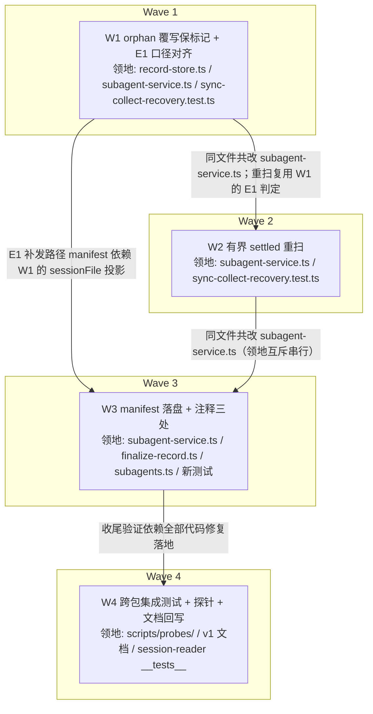

# subagent-sync-collect v2（取回通道与崩溃恢复断链修复）实施计划

基线: c1202e6ea（来源设计 commit）| 来源设计: docs/design/subagent-sync-collect-v2.md | 日期: 2026-09-05

## 0 章节映射

| 内容 | 本文实际位置 |
|------|--------------|
| 背景/目标 | §1 背景目标（SCQA；§1.2 设计目标 GV1-GV3；In/Out scope） |
| 终态/机制 | §3 解决方案（§3.1 终态场景 A/B/C；§3.2 方案对比；§3.3 决策 D1-D5） |
| 验收场景表 | §4 验收（V1-V4，真实 pi CLI 探针） |
| 下一层拆分 | §5 下一层拆分（W1-W4 + 依赖） |
| 待验证检查点 | §5 探针清单（P-orphan / P-settled / P-manifest / P-rebuild，均带降级路径） |

对抗式审查证据：本会话 3 轮 tech-design-review 对抗式循环——R1（2 must-fix + 2 suggestion：orphan 覆写抹 collectMode 第四断链 + stale-read 断言与 pi 实装不符）→ R2（2 must-fix + 2 suggestion：W1 测试形态不同构 + merge 口径自相矛盾）→ R3（**0 must-fix** + 4 suggestion + 1 info，全部当轮修完）。收敛轨迹记入 §7。

## 1 目标快照（逐字摘录自设计 §1.2 与 Out of scope）

| # | 目标 | 使用者可感知形态 |
|---|------|----------------|
| GV1 | 指针行取回通道**自举可用**——无需人工绕过 | 真实 pi CLI 下超预算批通知后，主 agent 按指针行原文调 `session_read result`（sa- id）即取回全文 |
| GV2 | 崩溃恢复承诺**真实兑现** | ①批等待中崩溃且批内含成功成员（主场景）→ 重启后单条补发、二次重启零重发；②kill -9 后重启 → 孤儿成员转终态且批标记保留 → E1 补发（v1 探针 A6 FAIL 转 PASS） |
| GV3 | v1 行为**零回归** | 异步路径通知文案逐字节不变（旧 golden）；批通知文案逐字节不变（新 golden 不动）；账本幂等/at-least-once 语义不变；config/预算算法不动 |

Out of scope（明确不做）：worker detach；zcode appserver 存活成员的崩溃后接回；嵌套 subagent 的 sync 批崩溃恢复（孙的 entry 在子进程 session 文件域，E1 与 merge 均只覆盖主文件——v1 同盲区，零回归，独立议题）；E9 出口跨键残余重复窗；批饥饿的 list 投影；B 档性能项。

## 2 单元列表

| Unit | 职责 | 领地（精确文件路径） | 依赖 | 隔离 | 验收条款 |
|------|------|---------------------|------|------|---------|
| W1 | 断链 2+3：orphan 覆写 merge（collectMode/batchFinalized/result/model，仅补 undefined/空值）+ E1 running 判定 resumable 豁免 + rebuildEntryRecord 投影补 resumable/sessionFile + 真实序列种子测试（主用例写文件 pi / async 对照 / 豁免路径断言 pi） | `packages/subagent-core/src/execution/record-store.ts`、`packages/subagent-core/src/execution/subagent-service.ts`、`packages/subagent-core/src/execution/__tests__/sync-collect-recovery.test.ts` | — | plain | ①P-orphan 绿：主用例（子 session 文件 + 无三 sidecar 构造 → finalizeOrphanRecord 真实跑）断言覆写 entry 保留 collectMode/batchFinalized/result/model；async 对照批域字段不出现且 result 补齐；②P-rebuild 绿：既有 recoverEntryOnlyOrphans 测试复跑不变；③subagent-core 全量测试基线不降（3106 passed） |
| W2 | 断链 4：E1 等待分支 disposed 包装的 agent_settled 有界重扫（上限 8，达限 debug 留痕） | `packages/subagent-core/src/execution/subagent-service.ts`、`packages/subagent-core/src/execution/__tests__/sync-collect-recovery.test.ts` | W1 | plain | ①P-settled 定谳：read pi dist 事件分发实现确认多次 pi.on 互不干扰（若单 handler 覆盖语义 → 降级并入 ledger host 分发链，记合理偏差）；②重扫用例绿（成员延迟终态 → settled 边沿补发；8 次上限 → disposed 不再扫）；③core 基线不降 |
| W3 | 断链 1：appendBatchFinalizedEntry 处 fire-and-forget best-effort 写 manifest（status 如实投影）+ manifest 生命周期旧语义注释修正三处 | `packages/subagent-core/src/execution/subagent-service.ts`、`packages/subagent-core/src/execution/finalize-record.ts`（注释）、`extensions/universal/session-reader/src/discovery/subagents.ts`（注释）、`packages/subagent-core/src/execution/__tests__/`（新不变量测试文件） | W1（E1 补发路径 manifest 依赖 sessionFile 投影） | plain | ①P-manifest 绿：落标+写 manifest 后重启重建，list 投影与无 manifest 时一致（有 entry 的成员永不被 manifest 补充投影覆盖）；②三处注释修正到位（finalize-record.ts:230 / 文件头 D-017 段 / subagents.ts:22-24）；③core + session-reader 两包测试绿 |
| W4 | F3：跨包集成测试（subagent-core 真实 tmpdir 磁盘状态 → session-reader result action 反查，不 mock manifest 写入）+ 探针 V1/V2/V3 复跑 + RESULTS.md 回写 + v1 文档旧归因订正 | `scripts/probes/subagent-sync-collect/`（探针脚本 + RESULTS.md）、`docs/design/subagent-sync-collect.md`、`docs/design/subagent-sync-collect.impl-plan.md`、`extensions/universal/session-reader/src/__tests__/`（新跨包用例） | W1、W2、W3 | plain | ①V1 探针 PASS：指针行 sa- id 原文反查逐字节一致、无「无匹配 record」、manifest 先于通知送达落盘；②V2 探针 PASS：SIGKILL 崩溃含成功成员批 → 重启 #1 单条补发（result 全文）→ 重启 #2 零重发；③V3 探针 PASS（v1 A6 FAIL 转 PASS）：kill -9 → 240s 内补发，批头计数容忍 finished/failed 两形态；④V4：三包测试基线 + golden 不动；⑤v1 设计文档 stale-read 旧归因订正 + impl-plan §7 回写 |

## 3 DAG 图

全串行说明：W1/W2/W3 领地均含 `subagent-service.ts`（W1/W2 另共改 `sync-collect-recovery.test.ts`），按 dag-authoring「同文件共改 → 串行边」全链串行；无共享契约根节点（W1 的投影扩展是行为修复非新契约），u-foundation 缺席。

## 4 测试策略

- **增量（各单元开发期内）**：
  - subagent-core：`cd packages/subagent-core && env -u XYZ_SUBAGENT_RELAY_SOCKET -u XYZ_SUBAGENT_RELAY_NODE -u XYZ_SUBAGENT_RELAY_SCRIPT -u PI_SUBAGENT_SELF_RECORD_ID -u PI_SUBAGENT_ROOT_SESSION_ID pnpm test`（handoff 环境坑：剥离 relay env；vitest 必须从子包目录跑）
  - 单文件速跑：同上 + `-- <test 文件路径>`（vitest 过滤）
  - W3 追加 session-reader：`cd extensions/universal/session-reader && pnpm test`
- **全量（收尾 W4 后）**：根级 `pnpm test`（根级不剥 relay env，测试已自身免疫）+ `pnpm extensions:lint`
- 探针（W4）：`node scripts/probes/subagent-sync-collect/*.mjs`（真实 pi CLI，`--mode rpc`，模型 `xiaomi-token-plan-cn/mimo-v2.5-pro`）

## 5 合理偏差登记表

| # | 偏差 | 类别 | 裁决 |
|---|------|------|------|
| 1 | W1：`recoverOrphanRecords` 参数为追加式第二参 `(rootSessionFilter?, mainSessionFile?)`，非设计 D3 字面的「与 recoverEntryOnlyOrphans 同款 mainSessionFile 前置」——领地外 record-store.test.ts（7 处）与 record-store-orphan-revive.test.ts（3 处）既有单参调用，前置会使 rootSessionId 被误读为文件路径；追加式既有调用面零改动且行为等价（undefined 时 merge 无源，与旧版一致） | 合理偏差（签名细节，语义符合 D3） | 接受，设计措辞以「追加式传参」为准 |
| 2 | W1：merge 落点在 `finalizeOrphanRecord` 入口统一（覆盖 chatMode 分流 / IO 保守 / 终态覆写三分支），设计 D3 明示 chatMode 分支、未明示 IO-error 保守分支——该分支同样落 resumable entry，覆写语义同构，入口统一比逐分支选择性 merge 简单 | 合理偏差（超设计最小面的同构扩展） | 接受 |
| 3 | W1 遗留 typecheck 错误（mergeOrphanLastEntry model 返回 string\|undefined vs SubagentRecord.model 非可选，vitest 不查类型未暴露），W2 轮编排者授权定向修复：`?? ""` 类型收尾（运行时不可达，两侧实参恒 string），typecheck exit 0 | 缺陷修复（非偏差） | 已修（W2 commit 内） |
| 4 | W2：修复测试文件既有 logger mock 死路径（vi.mock 相对路径解析到不存在的模块，静默失效；D4 上限用例需断言 debug 留痕才暴露）——改为正确相对路径后 loggerMock 真正接管，既有 10 用例复跑全绿 | 合理偏差（领地内既有缺陷顺手修，非静默） | 接受 |
| 5 | P-settled 定谳结论：pi dist extension 事件分发为**列表分发**（loader.js:233-238 handlers.push + runner.js:623-653 逐一 await），多次 pi.on 互不干扰——设计 D4 主路径实施，降级路径（并入 ledger host 分发链）未触发 | 探针定谳（非偏差） | 主路径成立 |
| 6 | W3：注释修正处数超任务列举三处——同款旧语义残留全扫（finalize-record.ts 另有 Step 4 段 :193、subagents.ts 另有 :131/:304/:346 三处「创建时写入」错误假设），不改则文件内自相矛盾 | 合理偏差（同类缺口全修） | 接受 |
| 7 | W3：kill-9 主用例与豁免路径用例由同步 it 改 async it（manifest fire-and-forget 异步写需轮询等落盘），原有断言全保留仅追加 manifest 断言段 | 合理偏差（异步写的必然配套） | 接受 |
| 8 | W4：V2 探针完成信号修正——首版等 .finalized sidecar ≥2 永超时（实证 sync one-shot 成员走 doFinalizeRoundToIdle 轮终回 running-resumable 不写 .finalized），改等主文件 2 个 sync id 末条 entry 轮终形态；慢任务 sleep 90s→240s 适配 mimo 3 并发实测时延 | 合理偏差（探针工程修正，断言未放宽） | 接受 |
| 9 | W4：V1 取回轮加一次重试（首跑模型单轮未调 session_read 工具），断言硬门（逐字节一致）未放宽 | 合理偏差（模型行为波动容错） | 接受 |
| 10 | W4：V3 实测成员正文为空——sleep 中 kill 无 assistant 输出 → gc 判 finished + 覆写 entry 无 result 可 merge，属设计「result 或截断 error」二分外的第三形态（空正文），已如实留痕 RESULTS.md，批头 finished/failed 容忍断言已覆盖 | 观察发现（设计场景表的诚实补充） | 接受，不改断言 |
| 11 | 一致性审查（区1/区2，2026-09-05）reasonable 合集：①runSyncCollectRecoveryScan 三态单实现（E1 首扫与重扫共用，防复制分岔）；②recovery 测试 until 轮询 + rmSync maxRetries 竞态防护（#7 延伸）；③settledCapture 测试基建忠实落地 pi 列表分发语义；④V1 探针 perItemChars=100 确定性截断沿用 v1 A4① 手法（硬门未放宽）；⑤V1 manifest 时点门取「消费时点就位」口径（GV1 操作性语义）；⑥V2/V3 断言组与设计 §4 逐条对齐（SIGKILL 形态/单条补发双断言/批头容忍/id 集双向相等/二次重启零重发/fail-safe 早退）；⑦跨包测试 manifest 来源结构性成立（全仓 writeManifest 仅两点，测试链路只能经 W3 路径产出）；⑧sa- 反查链与设计 §1.1 一致；⑨subagents.ts 四处注释与写点核实一致；⑩v1 E1/A6 订正归因/commit 引用/交叉引用核实正确；⑪V4 收窄为测试门（异步零回归由 golden + D5 论证覆盖） | 合理偏差（实现优于设计字面，不破坏目标） | 全部接受；关键项 ①⑥⑦ 已在代码注释/RESULTS.md 自说明 |
| 12 | 一致性审查 unreasonable 修复轮（2026-09-05）：①dispose() 惰化 settled 重扫 handler（通知永久丢失不可逆窗口闭合）+ 两处失实注释修正 + mutation 验证用例（5c41481f1）；②merge「仅补不覆盖」保留方向反向用例（identity 前 model_change entry 为 rec.model 真实数据源——identity 本身无 model 字段，pi sdk 实证）；③探针 checks.finish/插值化/sleep 统一 + find.test.ts 漏网注释（区 2 批次） | 审查修复（非偏差） | 全部落地 |

## 6 状态表

| Unit | 状态 | 轮次 | 证据指针 |
|------|------|------|---------|
| W1 | committed | 1（首轮绿） | 全量 3110 passed / 9 skipped（基线 3106 + 新增 4：kill-9 同构主用例 / async 对照 / 豁免路径 / P-rebuild）；主 agent 复跑核实 |
| W2 | committed | 1（首轮绿 + 1 轮定向类型修复） | typecheck exit 0 + 全量 3112 passed / 9 skipped（+2：延迟闭合 / 上限 disposed）；P-settled 定谳列表分发（偏差 #5）；主 agent 复跑核实 |
| W3 | committed | 1（首轮绿；编排者复跑首轮 1 failed 为 W2 已登记 flake，复跑 2 连绿 + 单文件 3 连绿排除回归） | core 全量 3113 passed / 9 skipped（+1 P-manifest）+ typecheck exit 0 + session-reader 305 passed / 1 skipped；偏差 #6/#7 |
| W4 | committed | 1（首轮绿） | 探针实跑 V1 17/0 + V2 15/0 + V3 11/0（v1 A6 FAIL 转 PASS）；跨包测试 2 用例（session-reader 307 passed）；根级 pnpm test exit 0（38 包全绿）+ extensions:lint 0 + doc-symbol-drift OK；偏差 #8-#10 |

## 7 残留风险与变更历史

- 残留风险（承接设计 out of scope，非本轮缺陷）：worker detach / zcode 存活接回 / 嵌套 sync 批恢复 / E9 跨键残余窗——见设计 §1.2 Out of scope 与被否谱系。
- **探针手工复跑 SOP（2026-09-07 登记，adversarial-review-fixes B4 裁决：登记不搬 CI——探针需真实模型凭证，结构性不可进 CI）**：升级 pi 版本或改动 manifest 写点 / 屏障逻辑（flushBatch 时序、`appendBatchFinalizedEntry`、`finalizeOrphanRecord` merge、E1 判定口径、settled 重扫）后，必须在本地 pi CLI 复跑 v2/v3 探针（`scripts/probes/subagent-sync-collect/` V2 含成功成员崩溃批 / V3 kill -9 全灭，实跑记录回写 RESULTS.md）——真实 fs 时序回归目前只有这条手工防线（CI 回归防线 = subagent-core 真实文件通路集成测试）；SOP 同步登记 TEST-STRATEGY.md 回归基线表。
- lint 存量红（W1 核验时确认，均非本轮引入）：①subagent-service.ts max-lines warning（HEAD 既有 1512>1450，W1 净增 11 行中 10 行为注释，skipComments 计数不变；修复需拆文件且 W2/W3 继续共改——后续重构议题）；②~~scripts/probes a2/a6 的 no-unused-vars error（v1 探针遗留，W4 领地处置）~~ 已于 W4 commit 878675154 闭环（a2 弃用未用 ns 参数 + a6 删死函数）。
- 探针 P-settled 若发现 pi 事件分发为单 handler 覆盖语义，W2 降级并入 ledger host 分发链（设计 D4 降级路径），记合理偏差。
- 变更历史：
  - 2026-09-05 计划创建。审查轨迹：R1 2MF+2SG → R2 2MF+2SG → R3 0MF+4SG+1INFO（全修）；设计 commit c1202e6ea。
  - 2026-09-05 W1 committed：断链 2+3 修复落地（偏差登记 #1/#2），全量 3110 绿。
  - 2026-09-05 W2 committed（e2238ce4c）：断链 4 settled 有界重扫 + P-settled 定谳列表分发（偏差 #3-#5），typecheck 0 + 全量 3112 绿。
  - 2026-09-05 W3 committed（bbcd95c1c）：断链 1 manifest 落盘 + 注释语义修正（偏差 #6/#7），core 3113 + typecheck 0 + session-reader 305 绿。
  - 2026-09-05 W4 committed（878675154 + 探针三连）：探针 V1 17/0 + V2 15/0 + V3 11/0（v1 A6 FAIL 转 PASS）+ 跨包测试 + v1 文档回写 + a2/a6 lint 修复（偏差 #8-#10），根级 38 包全绿；flake 修复另 commit（d9ad39cb8，recovery 测试 rmSync 重试）。
  - 2026-09-05 阶段 3 一致性审查（两区并行 reviewer）：区 1（core 执行层）3 reasonable / 2 unreasonable / 1 doc_error；区 2（跨包+探针+文档）10 reasonable / 3 unreasonable / 4 doc_error。处置： unreasonable 5 条两批定向修复（区 1 批 5c41481f1 已 commit：dispose 惰化 + merge 保留方向用例，均 mutation 验证；区 2 批探针 finish/插值/sleep + find.test.ts 注释进行中）；doc_error 5 条主 agent 亲修（v2 设计 D2 论证链机制错引订正、v2 impl-plan §7 变更历史补全 + lint 闭环、v1 impl-plan 变更历史追加 v2 订正、find.test.ts 并入区 2 批）；reasonable 13 条登记 #11。
  - 2026-09-05 阶段 4 定向复审：5 条 unreasonable 全部消灭、0 新发现（mutation 验证 + 计数对账 + 攻击面全核）；区 2 修复批 d2d2b0b69 commit。
  - 2026-09-05 阶段 5 双级验收：**Gate A 通过**（subagent-core 3115 passed|9 skipped =基线 skip、session-reader 307|1 =基线、extensions:lint 0、typecheck×2 0、零容忍扫描零命中、行为改动 100% 测试认领；唯一失败 = runtime pi-settings-store D1a 跨进程锁用例在 38 包满载下 1 次预存负载 flake——本区间零触碰 runtime，单文件 29/29 + 整包连续两次 4368/4368 全绿三重验证排除回归，剩余 8 包补跑全绿）；**Gate B 通过**（V1 17/0 + V2 16/0 + V3 12/0 探针实跑全 PASS，v1 A6 FAIL 转 PASS；四探针 ⛔→✅ 回填；V4 golden 零改动 + 三包基线零回归）。双绿交付。
  - 2026-09-05 验收后残留修复轮（用户指令「彻底排查并修复」三项）：①D1a flake 根因定谳（测试探测自制造锁竞争，见 §7 残留风险①）+ 修复（stdout handshake + acquireLikePi 保真）；②manifest 时序屏障化（D1 时序修订版：批通知路径 manifest → 写账 → 落标，E9 保持 fire；flushBatch/E1 async 化，协调器 deps 签名 void→Promise<void>；core 3116 passed +1 屏障严格时序用例；V1 探针严格门实跑 PASS 早于 3.9ms）；③根 test script 加 --no-bail。
- 残留风险（验收后登记；①②④已于同日修复轮闭环清账，见变更历史）：①~~runtime pi-settings-store D1a 满载 flake~~ **已修复**——根因定谳：测试探测机制（主进程 lockSync 试探等待子进程）自己制造持锁窗口，满载下窗口被 CPU 抢占拉长 20-250 倍（实测 p99.9 0.4ms→35ms），子进程单次 fail-fast 锁请求撞窗即 ELOCKED exit 1（非超时类失败）；修复 = 观测去竞争（stdout handshake「LOCKED」，主进程不再触碰锁）+ 子进程对齐 pi 真实 acquireLockSyncWithRetry 语义（20ms×10 重试），确定性碰撞实验四组证明线上失败形态消除（修复前 exit 1 ELOCKED 复现 / 修复后满载量级窗口碰撞 exit 0）；②~~V1 manifest 时序口径 nuance~~ **已修复**——D1 修订为「批通知路径写账前屏障」（manifest 并行写 + await 落盘 → 写账 → 落标），「通知可达 ⇒ 索引就位」升为构造性保证，E9 保持 fire-and-forget（无指针行消费）；V1 探针 mtime 断言升严格门并实跑 PASS（早于 3.9ms）；③首批探针记录的 15/11 PASS 硬编码计数与实际 16/12 不符（区 2 插值化已修复，首批记录仅作历史留痕）；④~~根级 pnpm test first-fail 递归~~ **已修复**——test script 加 `--no-bail`（pnpm recursive 原生选项），单包失败不再中止掩盖尾部包，退出码仍汇总非零；⑤apps/electron 不在根级 test 扫描面（配置现状）。
