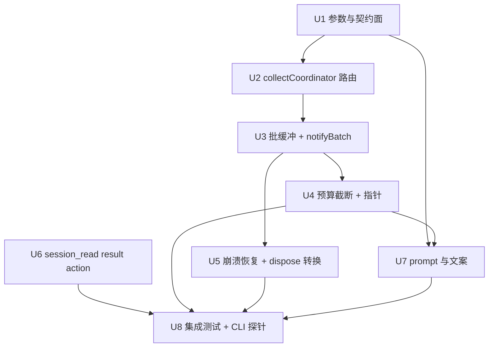

# subagent 同步收集（sync collect）实施计划

基线: 2b483bc39（现行 HEAD；此前锚点 92b977b68（rebase 悬空）→ 3b4be4561（2026-09-05 一致性修复轮改锚）演进见变更历史各轮） | 来源设计: docs/design/subagent-sync-collect.md | 日期: 2026-09-04
审查报告: docs/design/subagent-sync-collect.review.md（5 轮收敛，最终 0 must-fix / 0 suggestion）

## 0 章节映射

| 内容 | 设计文档实际位置 |
|------|------------------|
| 背景/目标 | §1 背景目标（§1.2 目标表 G1-G5 + In/Out of scope） |
| 终态/机制 | §3 解决方案（§3.1 终态：API/数据模型=§3.1.3、数据流=§3.1.4、错误规格表=§3.1.5 E1-E9；§3.3 决策 D1-D8；§3.4 约束一致性） |
| 验收场景表 | §4 验收（A1-A8 + DoD 判定：A1/A4/A6 为实施完成门） |
| 下一层拆分 | §5 下一层拆分（U1-U8） |
| 待验证检查点 | §5 末「待验证检查点」⛔1-4（gui-mappers 批量映射 / ledger 幂等行为 / 池排队 status 值 / zcode 终态汇聚） |

## 1 目标快照（逐字摘录设计 §1.2 + §1 Out of scope）

> **G1** 一轮派 N 个独立 one-shot 且结果需合并综合时，一次派发一次回收（主 agent 派 4 个 explorer 后 STOP，只被唤醒 1 次，通知含 4 段结果）
> **G2** 结果总量大时不撑爆单轮注入，且有低成本取回通道（超预算条目截断 + 指针行；`session_read action:"result"` 一参数取全文）
> **G3** 异步现状零变化（默认 `collect:"async"`；现有单条通知文案逐字节不变（G4 golden 锁））
> **G4** 批语义在崩溃/重启下不丢不重（延续 C-ext-19 确认式送达：批通知持久账本 + 幂等键 + 重启重放）
> **G5** pi / zcode 双引擎行为一致（collect 路由在引擎无关的 service 层）

> **Out of scope（v1 明确不做，设计 §3.3 D8）**：conversation 模式（`conversation:true`）的 sync；`message` 轮次批收；workflow 域改造；fail-fast（成员失败立即通知）选项；批级超时；GUI 专项改造（复用现有 batch 渲染，仅核对）。

## 2 单元列表

| Unit | 职责 | 领地（精确文件路径） | 依赖 | 隔离 | 验收条款 |
|------|------|---------------------|------|------|---------|
| U1 参数与契约面（foundation） | schema 加 `collect`；config `collectSync` 节 + sanitize（E5）；ExecutionRecord 加 `collectMode` + `batchFinalized` 字段及 record-entry 序列化白名单；start handler 解析 + 响应 `collect` 段（mode/pendingSyncCount）+ E4 校验（conversation+sync immediate throw）；⛔3 池排队 sync record status 值核实 | `extensions/universal/subagent-workflow/src/interface/subagent-tool-schema.ts`、`packages/subagent-core/src/execution/subagent-actions-core.ts`、`packages/subagent-core/src/execution/config.ts`、`packages/subagent-core/src/execution/types.ts`（ExecutionRecord 接口本体，types.ts:416）、`packages/subagent-core/src/execution/record-entry.ts`、测试：`packages/subagent-core/src/execution/__tests__/`（新增 collect-param / config-collect-sync 测试）、`extensions/universal/subagent-workflow/src/__tests__/`（schema 校验测试） | 无 | plain | E4/E5 单测；schema 导出契约；既有测试零回归 |
| U2 collectCoordinator 路由 | notifyComplete 全部调用点统一过协调器（sync→缓冲，async→现状字节不变）；⛔4 核实 zcode 终态汇聚点（parent-child-matrix 测试参照）；⛔2 前置：确认 ledger 同 notifyId 重复 record 行为 | `packages/subagent-core/src/execution/collect-coordinator.ts`（新建）、`packages/subagent-core/src/execution/subagent-service.ts`、`packages/subagent-core/src/execution/session-runner.ts`（调用点路由）、测试：`packages/subagent-core/src/execution/__tests__/`（协调器路由测试） | U1 | plain | A5（async 路由字节不变，旧 golden 全绿）；A8 前置（混派路由单测） |
| U3 批缓冲 + notifyBatch | pending 集/缓冲/闭合判定（running-sync==0 && 缓冲非空，跨轮续累）；`notifier.notifyBatch` + `buildBatchLlmContent` 基础版（批头计数 + `\n\n---\n\n` join）；notifyId = `sync-batch:<sha1(sorted ids)>`（批 entry details 顶层键，回执销账匹配）；⛔1 gui-mappers 批量 details 核对；⛔2 ledger 幂等断言补强 | `packages/subagent-core/src/execution/notifier.ts`、`packages/subagent-core/src/execution/subagent-service.ts`、只读核对：`extensions/universal/subagent-workflow/src/interface/bg-notify-render.ts`、测试：`packages/subagent-core/src/execution/__tests__/` + `extensions/universal/subagent-workflow/src/__tests__/`（新批 golden） | U2 | plain | A1/A3/A8 单测层（错峰闭合、失败入批、混派正交、跨轮 2+1 续累单批） |
| U4 预算截断 + 指针 | 两段式预算纯函数：per-item 截断 + totalChars 再压缩 `effectivePerItem = clamp(floor(totalChars/n), 200, perItemChars)`；截断尾行（session_read 指引）；config 热读 | `packages/subagent-core/src/execution/notifier.ts`（批内容组装处）、测试：`packages/subagent-core/src/execution/__tests__/`（预算确定性测试） | U3 | plain | A4 单测层（7×6000→3428 演算例、纯清单退化 n>120、指针行格式） |
| U5 崩溃恢复钩子 + dispose 转换 | record-store 末条 entry 通路（collectLastRecordEntries 同构）+ rebuildEntryRecord 投影扩展（collectMode/batchFinalized + 终态五字段 status/endedAt/closedReason/result/error）；E1 session_start 恢复钩子（只收无标记 sync 终态成员；补发内容=末条终态快照；补标+幂等窗口补标）；E9 dispose 转换（缓冲终态成员逐条转 async 写账 + 落 batchFinalized）；与 ledger recoverFromSession 协同 | `packages/subagent-core/src/execution/record-store.ts`、`packages/subagent-core/src/execution/subagent-service.ts`（dispose 路径）、`extensions/universal/subagent-workflow/src/index.ts`（恢复编排接线）、测试：`packages/subagent-core/src/execution/__tests__/`（真实文件通路集成测试——标记可见性断言禁 mock） | U3 | plain | A6 单测/集成层（真实 JSONL 写入→扫描重建；dispose 转换零重发；补标幂等收敛） |
| U6 session_read result action | 新 action `result`：manifest 反查 → 最终 assistant 正文（与 record.result 同源）+ 批量 id（≤10）+ limit（默认 8000） | `extensions/universal/session-reader/src/tool-handler.ts`、`extensions/universal/session-reader/src/index.ts`（schema）、测试：`extensions/universal/session-reader/src/__tests__/` | 无 | plain | A4 取回一致前置（action 返回与 record.result 逐字节一致） |
| U7 工具 prompt 与引导文案 | subagent 工具 description：collect 用法（≥2 独立 one-shot 要综合→sync；对话/需早响应→async）；「You cannot」节措辞；config skill 文档补 collectSync 节 | `extensions/universal/subagent-workflow/src/interface/subagent-tool.ts`、`extensions/universal/subagent-workflow/skills/subagent-ext-config/SKILL.md` | U1-U4 | plain | 文案与实装一致性核对（description 参数表 = schema 实际） |
| U8 集成测试 + 真实 CLI 探针 | 崩溃恢复集成测试（真实文件通路）；A1-A8 CLI 探针脚本化（`pi --mode rpc --extension <path>`，探针脚本落 `scripts/probes/subagent-sync-collect/`，验收后按仓库惯例归档）；全量回归 | `packages/subagent-core/src/execution/__tests__/`（集成）、`extensions/universal/subagent-workflow/src/__tests__/`、`extensions/universal/session-reader/src/__tests__/`、`scripts/probes/subagent-sync-collect/`（新建，探针） | U1-U7 | plain | DoD：A1/A4/A6 CLI 实测通过 + A2/A3/A5/A7/A8 执行记录 + 全量测试绿 |

**领地说明（对照设计 §5 的修正，2026-09-04 执行期修订）**：ExecutionRecord 接口本体在 `types.ts:416`（初版计划误判为 execution-record.ts，U1 执行者发现后主 agent 核实裁决——设计原文正确）；`record-entry.ts` 是 entry 序列化单写点（round-5 审查核实）；两字段的序列化白名单统一放 U1（foundation 契约），U5 只消费。⛔3 已核实：池排队 record 在 `store.register` 时即 `status:"running"`，池无独立状态概念（U2 闭合判定用「非终态」口径）。

## 3 DAG 图

波次：W1=U1 → W2=U2∥U6 → W3=U3 → W4=U4∥U5 → W5=U7 → W6=U8。
并行判据：W2（U2 与 U6 文件零交集）、W4（U4 只动 notifier.ts，U5 动 record-store/service/index，零交集）。全部 plain——同仓小步串行/双并行，无需 worktree（无长时独立验证周期）。

## 4 测试策略

**框架红线**（AGENTS.md）：vitest 唯一（禁 node:test/tsx --test），配置在子包 vitest.config.ts、从子包目录运行；timer 测试用 fake timers；测试禁止触碰真实数据目录——写删目标必须 `mkdtempSync(join(tmpdir(), ...))` 自建自删。

| 层级 | 命令 | 时机 |
|------|------|------|
| 增量（单包） | `cd packages/subagent-core && pnpm test` | 每个涉 subagent-core 的单元收尾 |
| 增量（单包） | `cd extensions/universal/session-reader && pnpm test` | U6 收尾 |
| 增量（单包） | `cd extensions/universal/subagent-workflow && pnpm test` | U2/U3/U5/U7 收尾（golden 在此包） |
| 静态 | `pnpm extensions:typecheck && pnpm extensions:lint` | 每单元收尾 |
| 全量 | `pnpm test`（root，全 workspace） | U8 阶段 / 收尾门 |
| 真实场景门 | `scripts/probes/subagent-sync-collect/` CLI 探针（A1-A8） | U8（DoD：A1/A4/A6 通过，A2 记录数字不设门） |

三视角要求（TEST-STRATEGY §3）：每单元测试至少含使用者黑盒断言（工具响应/通知文案的用户可见形态）+ 构建者白盒（协调器/预算纯函数）+ 观察者形态（session JSONL 中的 entry/账本状态）。

## 5 合理偏差登记表

| # | Unit | 偏差 | 理由与处置 |
|---|------|------|-----------|
| 1 | U1 | `StartHandlerInput.collect` / `ExecuteOptions.collect` 运行时宽收 `string`（schema 层枚举限 async/sync） | pi 工具框架把 schema Static 解析为 string，engine 字段同先例；非法值 ≠ "sync" 按 async 处理，E4 守卫用精确 "sync" 判定 |
| 2 | U1 | `DEFAULT_CONFIG` 刻意不含 collectSync 键；缺省语义由 `DEFAULT_COLLECT_SYNC` 承载（消费方 `?? DEFAULT_COLLECT_SYNC` 兼底） | SW 包 startupConfig 声明守护测试断言与 DEFAULT_CONFIG 深相等；键缺失语义与 defaultEngine/engineRouting 同风格 |
| 3 | U1→U2 | startHandler 缺省 collect 暂以 `DEFAULT_COLLECT_SYNC.default` 兑底，config.json 的 collectSync.default 未接线（service 无公开配置访问器） | U1 领地内无 service 配置面；**U2 必须接线**：开放配置访问后接入真实 config 读取，E4 守卫判定无需改 |
| 4 | U1→U2 | start 响应 `pendingSyncCount` 暂以「枚举计数 + 1」补足本条（record.collectMode 落点未接线，枚举天然不含本条） | **U2 必须接线后去掉 +1**（record 带 collectMode 入枚举后 +1 即双计；源码已有 [U2 接线点] 注释锚） |
| 5 | 全局 | 存量测试环境敏感缺口：`pi-invocation.test.ts` / `relay-env.test.ts` 在带 `XYZ_SUBAGENT_RELAY_*` / `PI_SUBAGENT_*` 的会话环境内跑会红（断言依赖真实进程 env/execPath） | 非 U1 引入（HEAD 同红）；CI 干净环境不受影响；**已闭合（3b4be4561，2026-09-05）**：relay-env 断言改 sanitized copy、pi-invocation 剥 5 键、根聚合测试 6 红转绿——残留风险解除 |
| 6 | U2→U3 | U2 集成测试 `vi.mock("../execution/session-runner.ts")` 路径错误致拦截从未生效，U3 修正为 `"../session-runner.ts"` 后真链 trace 暴露两个缺陷并已修复：① recordToSubagent 投影丢 collectMode → 闭合判定恒立即闭合（数据源改 store.listAllActive() 原始内存态）；② SP-5 resumable 回退态（running+resumable 留内存）致 sync 批永不闭合（非终态口径补 resumable 判据） | U3 真链验证抓出的真 bug，修复属 U3 领地内修正；教训登记：mock 测试不验证真链，后续单元集成测试必须 mock 路径自检 |
| 7 | U3 | 批 details 需带顶层 `notifyId` 键（投递回执匹配 collectDeliveredNotifyIds 读 details.notifyId，否则批 entry 永不销账） | 设计未明写此键（§3.1.4 details 形状沿用 mergeItems），实装需要；零冲突增量 |
| 8 | U4→U5 | config 预算热读未在 U4 接线（领地不含 service），落地为 buildBatchLlmContent 可选 budget 参数 | **已闭环**：U5 flushBatch 调用点接入 config collectSync 预算（同 commit 4c63d9fb9） |
| 9 | U5 | E9 转换挪到 disposeAllRecords 之前 | 测试实证：archive 先清内存 + idToFile 冷启动 → 落标必 miss；前置转换后 6/6 绿 |
| 10 | U5 | notifier.ts 最小加法（notifyBatch 可选 budget 参数） | U4 预算接线的调用点在 notifier 内部，跨领地最小增量已验收 |
| 11 | U5 | multiproc-guard 存量测试 env 泄漏修复（PI_SUBAGENT_ROOT_SESSION_ID 泄进 vitem 致所有权误判） | HEAD 文件交换法证实预存红；领地内修复（测试 env 清理），非本特性回归 |
| 12 | U7→审查 | 设计 D2 的「list 看 pendingSyncCount」逃生口与实装不符（计数只在 start 响应，list 未投影 collect 信息） | 文案按实装落笔；**已裁决（一致性审查 F-a-3，2026-09-05）**：改设计措辞（逃生口 = list 可见在跑成员 + cancel 逼闭合，pendingSyncCount 回显仅在 start 响应），偏差登记保留，list 投影 collect 信息列为 v2 候选 |
| 13 | U8→产线修复 | 批拆分盲窗：同同步段背靠背终态的 sync 成员拆成多条单成员批（闭合检测只扫 listAllActive 非终态，看不到已终态未路由成员） | U8 集成测试抓出（G1 削弱）；修复 = 闭合满足改 setTimeout(0) 合批去抖（触发时重验闭合条件）+ cancelScheduledFlush 供 E9 取消（避免双通道双投递）；A8 用例收紧为背靠背断言锁定 |
| 14 | U8→测试修复 | one-shot-upgrade.test.ts 未清理宿主身份 env（PI_SUBAGENT_* 泄漏 → cross-tree 守卫正确拒绝 spawn） | A/B 法实证根因；beforeEach 剥 IDENTITY_ENV_KEYS 五键（与 collect-mixed-dispatch 同款范式）；pre-commit 拦截解除 |

## 6 状态表

| Unit | 状态 | 轮次 | 证据指针 |
|------|------|------|---------|
| U1 | committed | 1（3 次看门狗截断续聊完成） | commit faab2a3cc; subagent-core 3038 绿 + SW 931 绿（golden 11/11）+ typecheck/lint 过（主 agent 重跑） |
| U2 | committed | 1（2 次看门狗截断续聊完成） | commit 77de9c02d; subagent-core 3060 绿（主 agent 复跑）+ typecheck/lint 过；⛔4/⛔2 结论入 §7 |
| U3 | committed | 2（含真链 bug 修复轮） | commit a53271c70; subagent-core 3078 绿 + SW 936 绿（旧 golden 11/11 零 diff）+ typecheck/lint 过（主 agent 复跑） |
| U4 | committed | 2（首任零产出被替换，v2 测试先行收工） | commit a39505d1e; collect-budget 15 新 + notify-batch 14 回归 = 29 绿（主 agent 复跑）+ tsc 过 |
| U5 | committed | 2（v2 升档 glm-5.3） | commit 4c63d9fb9; core 3099 绿 + SW 936 基线 + typecheck/lint 过（主 agent 复跑）；真文件通路测试 6/6；E9 时序修正 + multiproc-guard 预存 env 泄漏修复（HEAD 交换法证实） |
| U6 | committed | 1（修复轮：max-lines 提取 + 接替 dev 会话 GC 后主 agent 验收） | commit 895f9da2a; session-reader 305 绿（主 agent 复跑）+ typecheck/lint 过 |
| U7 | committed | 1（看门狗截断续聊收尾，经 U5 树中继） | commit 33601d35c; SW 936 绿（主 agent 复跑）+ lint 过；偏差 #12 登记 |
| U8 | committed | 3（v1/v2 被僵尸树污染零产出替换，v3 交付 + 盲窗修复轮 + R1 微修） | commit 94c706656; core 3104 绿 + SW 936 绿（剥离后首次全绿）+ node --check 10/10 + dry-run 5/5（主 agent 复跑）；探针实跑 e8619bae9——A1/A4/A8 探针实跑全绿（RESULTS.md 场景记录含 start 计数检查；精确分数以运行时 stdout 为准，检查项在修复中途有增补；A6 见 §7）——F-b-1 闭环 |

## 7 残留风险与变更历史

- 残留风险：E9 出口跨键残余重复窗（PS-17 同族，设计 §3.1.3 已披露，v1 接受）；⛔1-4 检查点若核实出设计外事实（如 zcode 终态旁路），停下上报，不自行扩 scope。（原登记「偏差表 #5 存量测试环境敏感缺口」已于 3b4be4561 闭合解除，见偏差表 #5 与变更历史。）
- ~~orphan 兜底未证实 → 极端 kill 时序下 sync 成员结果可能静默丢失（用户重发任务即可恢复，v2 候选：worker detach 或孤儿判定）。~~ **已由 v2 闭环（2026-09-05）**：v2（[subagent-sync-collect-v2.md](subagent-sync-collect-v2.md)，W1-W3 commit 8b679519b / e2238ce4c / bbcd95c1c）定谳 kill -9 补发不可达的真根因——orphan 覆写 entry 抹 collectMode（E1 候选恒空）+ E1 running 口径与协调器分岔 + 无再驱动，非「孤儿自行跑完」前提缺口；覆写保标记 + resumable 口径 + settled 有界重扫落地后探针 V3 复验 PASS（kill -9 重启 240s 内补发单批 + 二次重启零重发，留痕 `scripts/probes/subagent-sync-collect/RESULTS.md` V3 节）。
- ~~批指针 sa- id 不可自举解析（探针实跑发现，2026-09-05 登记，v2 候选）：症状——批通知指针行引导 `session_read {"action":"result","session":"<sa- id>"}` 取回全文，真实 CLI 流下反查报「无匹配 record」；根因——sa- id → sessionFile 反查依赖 record manifest 落盘，真实 CLI 流下 manifest 惰性/不落盘；临时绕过——session_read 支持绝对路径形态（直接指子 session 文件）；v2 候选修复——manifest 及时落盘或反查兜底通路。~~ **已由 v2 闭环（2026-09-05）**：v2 D1 在落标唯一出口（appendBatchFinalizedEntry）fire-and-forget 补写 manifest（status 如实投影），探针 V1 复验 PASS（批通知首见时点 manifest 已落盘、sa- id 原文反查命中、取回与 record.result 逐字节一致，留痕 `scripts/probes/subagent-sync-collect/RESULTS.md` V1 节；commit 同上 W1-W3 系列）。
- ⛔3 已核实（U1）：排队 record 在 `store.register` 时即 `status:"running"`（register 先于 pool.acquire，池无状态概念）——U2 闭合判定用「非终态」口径，无需新状态。
- ⛔4 已核实（U2）：zcode 引擎零 notify 旁路（engine/ 目录无 notify 命中，唯一出口 kickOffEngineRun 汇聚 notifyComplete）——U2 路由全覆盖。
- ⛔2 已核实（U2）：ledger 同 notifyId 重复 record 幂等拒绝零副作用——U3 批 hash 幂等依赖成立。
- ⛔1 已核实（U3）：GUI 链路 details 原样透传（renderer 不拆批量细节），TUI extractBatch 已支持；无需改动，不属本特性缺口。（2026-09-05 一致性修复轮补记——W3 变更历史曾宣称闭合但漏登记于此。）
- 环境注意（U2 发现）：vitest 4.1.8 本包环境 `vi.waitFor` 失效（sanity 实证 callback falsy 直接 resolve）——后续单元集成测试用手写轮询。
- U5 强制前置（U2 披露）：record-store 投影（recordToSubagent）现不含 collectMode，落盘 entry 暂无该字段（闭合判定不受影响，内存 record 已带）——U5 投影扩展必须补。
- 变更历史：
  - 2026-09-04 初版（基于设计 v5 审查收敛稿，fb66e8ec3 基线提交）。
  - 2026-09-04 U1 执行期：领地修订（ExecutionRecord 接口本体在 types.ts:416，初版误判 execution-record.ts）；U1 committed（偏差 #1-5 登记，#3/#4 为 U2 强制接线项）。
  - 2026-09-04 W2 流转：U2 committed（77de9c02d，偏差 #3/#4 接线完成）+ U6 committed（895f9da2a，含 max-lines 提取修复轮）；巡检机制（5m 调度）当轮发现接替 dev 会话假活（工作已完成但完成通知丢失），主 agent 直接验收闭环。
  - 2026-09-05 W3 流转：U3 committed（a53271c70）；偏差 #6/#7 登记（真链 bug 修复 + 回执匹配 notifyId 键）；⛔1/⛔2 全部闭合（4 个检查点清零）。
  - 2026-09-05 W4 流转：U4 committed（a39505d1e，首任零产出替换后 v2 测试先行收工）+ U5 committed（4c63d9fb9，升档 glm-5.3）；偏差 #8 闭环、#9-#11 登记；僵树清理 + 主会话直接派发恢复可达性。
  - 2026-09-05 W5 流转：U7 committed（33601d35c）；偏差 #12 登记（list 逃生口缺口转一致性审查）。
  - 2026-09-05 W6 流转：U8 committed（94c706656）；偏差 #13（批拆分盲窗修复——合批去抖）/ #14（one-shot env 泄漏修复）登记；阶段 2 全部 8 单元 committed，进阶段 3（design-code-sync）。
  - 2026-09-05 偏差 #5 闭合回写（3b4be4561）：relay-env 断言改 sanitized copy + pi-invocation 剥 5 键，根聚合测试 6 红转绿；修复发生在 2c1f47d8d（02:45）之后，偏差表 #5 与残留风险段本轮补登记。
  - 2026-09-05 一致性修复轮（design-code-sync Step 3 第 1 轮，依据 subagent-sync-collect.consistency-review.md）：① 偏差 #7 行恢复——W4 739718be4 增补 #8-#11 时编辑事故误删，按 2099e2b69 原文复原；② 基线 92b977b68 → 3b4be4561（写时真实、rebase 后不在任何分支历史，gc 后不可达；92b977b68 = fb66e8ec3 的 rebase 前身，本表改锚现行 HEAD）；③ 全文 9 处日期 2026-02-11 系统性错置，按 git 真实提交日期（2026-09-04/05）逐条修正；④ U1 状态表证据指针「commit <本条>」占位回填 faab2a3cc；⑤ ⛔1 闭合结论补记（W3 宣称闭合但漏登记）；⑥ 偏差 #12 裁决回写——一致性审查 F-a-3 判改设计措辞，list 投影 collect 信息列为 v2 候选。设计文档同步修：A3/§3.1.2 失败条目 error 全文口径（F-a-1）、§3.1.3/§3.1.4 批 details 顶层 notifyId 键（F-a-2）、§3.1.2/D2/D6 list 逃生口措辞（F-a-3）。
  - 2026-09-05 一致性修复三 commit 落地（第 1 轮交付）：e8619bae9 探针（探针脚本修复：harness 探测 / A4 确定性 / A6 + 新增 diag-a6 / diag-degrade / diag-survive + RESULTS.md 记录落盘）；61cecd9b8 文档（第 1 轮 9 条文档侧修复落盘：本文件 + 设计文档 + 审查报告入册）；cc5ee6e3d 微修（移交代码侧三处：subagent-tool description 参数表补 collect（F-a-4）/ notifier.ts 头注释术语消歧（F-d-1）/ start-collect-guard.test.ts 头公式改现行口径（F-d-2））。
  - 2026-09-05 探针收尾回写（F-b-1 闭环）：A1/A4/A8 探针实跑全绿（记录 scripts/probes/subagent-sync-collect/RESULTS.md，场景记录含 start 计数检查；精确分数以运行时 stdout 为准，检查项在修复中途有增补）；A6 裁决——kill 形态可构造，补发不可达：worker 与宿主 SIGKILL 共亡（产线前提缺口而非探针缺陷；主 pi SIGKILL 时 worker 子进程随即全灭，t+5s 进程数=0，diag-survive.mjs 实测留痕 RESULTS.md），真实 kill -9 后通知可达性依赖未证实的 orphan 兜底；落入设计 §3.3 D5 预声明备选门，由 U5 的 E1/E9 集成测试满足（subagent-core 3104 passed 内）；状态表 U8 证据指针已补；新登记残留风险「orphan 兜底未证实」与「批指针 sa- id 不可自举解析」（本节上方，v2 候选）。
