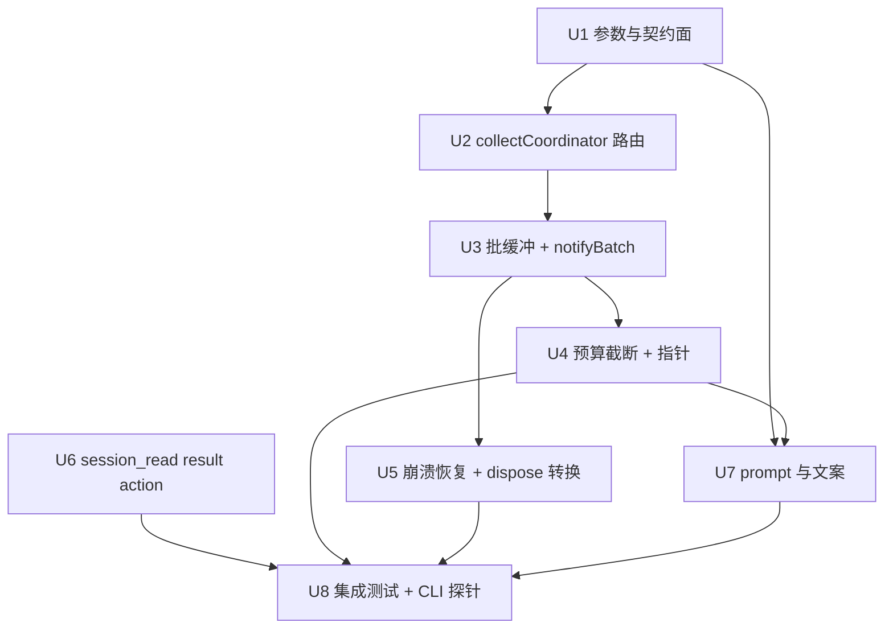

# subagent 同步收集（sync collect）实施计划

基线: 92b977b68 | 来源设计: docs/design/subagent-sync-collect.md | 日期: 2026-02-11
审查报告: docs/design/subagent-sync-collect.review.md（5 轮收敛，最终 0 must-fix / 0 suggestion）

## 0 章节映射

| 内容 | 设计文档实际位置 |
|------|------------------|
| 背景/目标 | §1 背景目标（§1.2 目标表 G1-G5 + In/Out of scope） |
| 终态/机制 | §3 解决方案（§3.1 终态：API/数据模型=§3.1.3、数据流=§3.1.4、错误规格表=§3.1.5 E1-E9；§3.3 决策 D1-D8；§3.4 约束一致性） |
| 验收场景表 | §4 验收（A1-A8 + DoD 判定：A1/A4/A6 为实施完成门） |
| 下一层拆分 | §5 下一层拆分（U1-U8） |
| 待验证检查点 | §5 末「待验证检查点」⛔1-4（gui-mappers 批量映射 / ledger 幂等行为 / 池排队 status 值 / zcode 终态汇聚） |

## 1 目标快照（逐字摘录设计 §1.2 + §1 Out of scope）

> **G1** 一轮派 N 个独立 one-shot 且结果需合并综合时，一次派发一次回收（主 agent 派 4 个 explorer 后 STOP，只被唤醒 1 次，通知含 4 段结果）
> **G2** 结果总量大时不撑爆单轮注入，且有低成本取回通道（超预算条目截断 + 指针行；`session_read action:"result"` 一参数取全文）
> **G3** 异步现状零变化（默认 `collect:"async"`；现有单条通知文案逐字节不变（G4 golden 锁））
> **G4** 批语义在崩溃/重启下不丢不重（延续 C-ext-19 确认式送达：批通知持久账本 + 幂等键 + 重启重放）
> **G5** pi / zcode 双引擎行为一致（collect 路由在引擎无关的 service 层）

> **Out of scope（v1 明确不做，设计 §3.3 D8）**：conversation 模式（`conversation:true`）的 sync；`message` 轮次批收；workflow 域改造；fail-fast（成员失败立即通知）选项；批级超时；GUI 专项改造（复用现有 batch 渲染，仅核对）。

## 2 单元列表

| Unit | 职责 | 领地（精确文件路径） | 依赖 | 隔离 | 验收条款 |
|------|------|---------------------|------|------|---------|
| U1 参数与契约面（foundation） | schema 加 `collect`；config `collectSync` 节 + sanitize（E5）；ExecutionRecord 加 `collectMode` + `batchFinalized` 字段及 record-entry 序列化白名单；start handler 解析 + 响应 `collect` 段（mode/pendingSyncCount）+ E4 校验（conversation+sync immediate throw）；⛔3 池排队 sync record status 值核实 | `extensions/universal/subagent-workflow/src/interface/subagent-tool-schema.ts`、`packages/subagent-core/src/execution/subagent-actions-core.ts`、`packages/subagent-core/src/execution/config.ts`、`packages/subagent-core/src/execution/execution-record.ts`、`packages/subagent-core/src/execution/record-entry.ts`、测试：`packages/subagent-core/src/execution/__tests__/`（新增 collect-param / config-collect-sync 测试） | 无 | plain | E4/E5 单测；schema 导出契约；既有测试零回归 |
| U2 collectCoordinator 路由 | notifyComplete 全部调用点统一过协调器（sync→缓冲，async→现状字节不变）；⛔4 核实 zcode 终态汇聚点（parent-child-matrix 测试参照）；⛔2 前置：确认 ledger 同 notifyId 重复 record 行为 | `packages/subagent-core/src/execution/collect-coordinator.ts`（新建）、`packages/subagent-core/src/execution/subagent-service.ts`、`packages/subagent-core/src/execution/session-runner.ts`（调用点路由）、测试：`packages/subagent-core/src/execution/__tests__/`（协调器路由测试） | U1 | plain | A5（async 路由字节不变，旧 golden 全绿）；A8 前置（混派路由单测） |
| U3 批缓冲 + notifyBatch | pending 集/缓冲/闭合判定（running-sync==0 && 缓冲非空，跨轮续累）；`notifier.notifyBatch` + `buildBatchLlmContent` 基础版（批头计数 + `\n\n---\n\n` join）；notifyId = `sync-batch:<sha1(sorted ids)>`；⛔1 gui-mappers 批量 details 核对；⛔2 ledger 幂等断言补强 | `packages/subagent-core/src/execution/notifier.ts`、`packages/subagent-core/src/execution/subagent-service.ts`、只读核对：`extensions/universal/subagent-workflow/src/interface/bg-notify-render.ts`、测试：`packages/subagent-core/src/execution/__tests__/` + `extensions/universal/subagent-workflow/src/__tests__/`（新批 golden） | U2 | plain | A1/A3/A8 单测层（错峰闭合、失败入批、混派正交、跨轮 2+1 续累单批） |
| U4 预算截断 + 指针 | 两段式预算纯函数：per-item 截断 + totalChars 再压缩 `effectivePerItem = clamp(floor(totalChars/n), 200, perItemChars)`；截断尾行（session_read 指引）；config 热读 | `packages/subagent-core/src/execution/notifier.ts`（批内容组装处）、测试：`packages/subagent-core/src/execution/__tests__/`（预算确定性测试） | U3 | plain | A4 单测层（7×6000→3428 演算例、纯清单退化 n>120、指针行格式） |
| U5 崩溃恢复钩子 + dispose 转换 | record-store 末条 entry 通路（collectLastRecordEntries 同构）+ rebuildEntryRecord 投影扩展（collectMode/batchFinalized + 终态五字段 status/endedAt/closedReason/result/error）；E1 session_start 恢复钩子（只收无标记 sync 终态成员；补发内容=末条终态快照；补标+幂等窗口补标）；E9 dispose 转换（缓冲终态成员逐条转 async 写账 + 落 batchFinalized）；与 ledger recoverFromSession 协同 | `packages/subagent-core/src/execution/record-store.ts`、`packages/subagent-core/src/execution/subagent-service.ts`（dispose 路径）、`extensions/universal/subagent-workflow/src/index.ts`（恢复编排接线）、测试：`packages/subagent-core/src/execution/__tests__/`（真实文件通路集成测试——标记可见性断言禁 mock） | U3 | plain | A6 单测/集成层（真实 JSONL 写入→扫描重建；dispose 转换零重发；补标幂等收敛） |
| U6 session_read result action | 新 action `result`：manifest 反查 → 最终 assistant 正文（与 record.result 同源）+ 批量 id（≤10）+ limit（默认 8000） | `extensions/universal/session-reader/src/tool-handler.ts`、`extensions/universal/session-reader/src/index.ts`（schema）、测试：`extensions/universal/session-reader/src/__tests__/` | 无 | plain | A4 取回一致前置（action 返回与 record.result 逐字节一致） |
| U7 工具 prompt 与引导文案 | subagent 工具 description：collect 用法（≥2 独立 one-shot 要综合→sync；对话/需早响应→async）；「You cannot」节措辞；config skill 文档补 collectSync 节 | `extensions/universal/subagent-workflow/src/interface/subagent-tool.ts`、`extensions/universal/subagent-workflow/skills/subagent-ext-config/SKILL.md` | U1-U4 | plain | 文案与实装一致性核对（description 参数表 = schema 实际） |
| U8 集成测试 + 真实 CLI 探针 | 崩溃恢复集成测试（真实文件通路）；A1-A8 CLI 探针脚本化（`pi --mode rpc --extension <path>`，探针脚本落 `scripts/probes/subagent-sync-collect/`，验收后按仓库惯例归档）；全量回归 | `packages/subagent-core/src/execution/__tests__/`（集成）、`extensions/universal/subagent-workflow/src/__tests__/`、`extensions/universal/session-reader/src/__tests__/`、`scripts/probes/subagent-sync-collect/`（新建，探针） | U1-U7 | plain | DoD：A1/A4/A6 CLI 实测通过 + A2/A3/A5/A7/A8 执行记录 + 全量测试绿 |

**领地说明（对照设计 §5 的修正）**：设计文件地图写 `types.ts`（ExecutionRecord），实装为 `execution-record.ts` + `record-entry.ts`（序列化单写点，round-5 审查核实）；两字段的序列化白名单统一放 U1（foundation 契约），U5 只消费。其余路径与设计一致。

## 3 DAG 图

波次：W1=U1 → W2=U2∥U6 → W3=U3 → W4=U4∥U5 → W5=U7 → W6=U8。
并行判据：W2（U2 与 U6 文件零交集）、W4（U4 只动 notifier.ts，U5 动 record-store/service/index，零交集）。全部 plain——同仓小步串行/双并行，无需 worktree（无长时独立验证周期）。

## 4 测试策略

**框架红线**（AGENTS.md）：vitest 唯一（禁 node:test/tsx --test），配置在子包 vitest.config.ts、从子包目录运行；timer 测试用 fake timers；测试禁止触碰真实数据目录——写删目标必须 `mkdtempSync(join(tmpdir(), ...))` 自建自删。

| 层级 | 命令 | 时机 |
|------|------|------|
| 增量（单包） | `cd packages/subagent-core && pnpm test` | 每个涉 subagent-core 的单元收尾 |
| 增量（单包） | `cd extensions/universal/session-reader && pnpm test` | U6 收尾 |
| 增量（单包） | `cd extensions/universal/subagent-workflow && pnpm test` | U2/U3/U5/U7 收尾（golden 在此包） |
| 静态 | `pnpm extensions:typecheck && pnpm extensions:lint` | 每单元收尾 |
| 全量 | `pnpm test`（root，全 workspace） | U8 阶段 / 收尾门 |
| 真实场景门 | `scripts/probes/subagent-sync-collect/` CLI 探针（A1-A8） | U8（DoD：A1/A4/A6 通过，A2 记录数字不设门） |

三视角要求（TEST-STRATEGY §3）：每单元测试至少含使用者黑盒断言（工具响应/通知文案的用户可见形态）+ 构建者白盒（协调器/预算纯函数）+ 观察者形态（session JSONL 中的 entry/账本状态）。

## 5 合理偏差登记表

（空——审查/执行阶段发现后登记）

## 6 状态表

| Unit | 状态 | 轮次 | 证据指针 |
|------|------|------|---------|
| U1 | pending | 0 | — |
| U2 | pending | 0 | — |
| U3 | pending | 0 | — |
| U4 | pending | 0 | — |
| U5 | pending | 0 | — |
| U6 | pending | 0 | — |
| U7 | pending | 0 | — |
| U8 | pending | 0 | — |

## 7 残留风险与变更历史

- 残留风险：E9 出口跨键残余重复窗（PS-17 同族，设计 §3.1.3 已披露，v1 接受）；⛔1-4 检查点若核实出设计外事实（如 zcode 终态旁路），停下上报，不自行扩 scope。
- 变更历史：
  - 2026-02-11 初版（基于设计 v5 审查收敛稿）。
