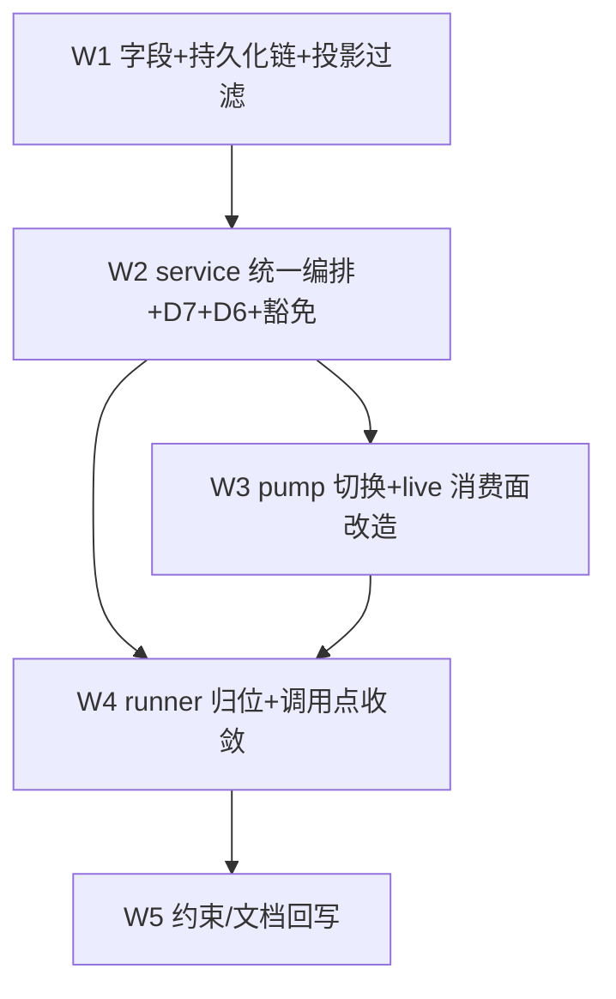

# workflow 域 agent() record 归位 实施计划
基线: bcb2ada46 | 来源设计: docs/design/subagent-workflow-record-unification.md (v3) | 日期: 2026-09-11

## 0 章节映射
| 内容 | 设计文档实际位置 |
|------|------------------|
| 背景/目标 | §1 背景目标（1.1 SCQA / 1.3 设计目标 G1-G3 / 1.4 in-out scope） |
| 终态/机制 | §3 解决方案（3.3 关键决策 D1-D7 + 既有机制×workflow record 决策表 / 3.4 错误规格 / 3.5 终态数据流） |
| 验收场景表 | §4 验收（S1-S6 真实场景表） |
| 下一层拆分 | §5 下一层拆分（W1-W5 单元表 + W2 接管迁移清单 + 文件改动地图 + 待验证检查点①-⑥） |
| 待验证检查点 | §5 末段「待验证检查点」①-⑥ |

对抗式审查证据：tech-design 双审循环 3 轮收敛（v1 首轮 9 MF → v2 轮 2 击穿 5 项 → v3 收敛 0 MF + 0 SUG），被否谱系 5 条在设计文档附录；设计头部「修订状态」声明收敛。

## 1 目标快照

**背景/目标（§1.3 逐字摘录）**：
- G1 agent() 等同 subagent：同一派发编排、同一 record 模型、同一治理保障；显式例外 = 成功收口形态（D7 workflow origin 成功即终态化）。
- G2 可见性 = 隐藏：workflow record 投影/列表层默认隐藏；run 视图实时进度从 store 订阅（parentRunId 查询）。
- G3 并发共享池：与手动 subagent 共用 DefaultConcurrencyPool（现状已成立，回归验证）。

**Out-of-scope（§1.4）**：workflow 脚本语言/script-lint 本体；WorkflowRun 聚合根与 FileRunStore（run 级状态保留原状）；workflow 视图 UI 改版（只换数据源）；H4 持久化收敛；run 级 pending 注册/注销对（lifecycle ↔ pump 不动，D5）。

## 2 单元表

| Unit | 内容 | 领地（允许触碰） | 依赖 | 难度 | 验收 |
|------|------|------------------|------|------|------|
| W1 | `origin`/`parentRunId` 字段 + **持久化链三环**（record-entry.ts entry schema 加字段 + recordToSubagent 投影加字段 + 重建链透传——漏任一环重启后 origin 丢失、D1 六面全失效）+ store 查询面（parentRunId 查询、`includeWorkflow` 参数）+ 投影层过滤四处（subagents tool list 默认过滤 + runner 恢复指引文案带 includeWorkflow:true、renderer useSidebarCounts active bucket、useBackgroundWork.hasRunning、TUI /subagents） | core `execution/{types,record-entry,record-store}.ts` + `execution/subagent-service.ts`（仅注册面字段透传，若需）+ extension `subagent-workflow/src/interface/subagents.ts` + renderer `useSidebarCounts`/`useBackgroundWork` + TUI list 面 | 无 | medium | 单测：entry 往返（写→重建→字段保真）+ 四投影面过滤断言 + 缺省 origin="tool" 负向断言 |
| W2 | service 统一编排入口 `executeWorkflowAgent`（接管迁移清单八步：路由/预检/model 校验/journal/守护单点键 record.id 双刷新源/mergeRunSignals/spawned-children 复刻，ctxModel 孪生守卫放弃）+ D7 origin 收口分支（settleOneShotOutcome **函数顶部** + 自带 tryTransition 抢锁 + 条件含 `!aborted`）+ D6 通知 origin gate（toNotifyRecord 单漏斗）+ adopt 豁免（service 分诊两处 + supervisor domain.ts 双点）+ superseded 豁免 | core `execution/subagent-service.ts` + `execution/subprocess-agent-runner.ts`（本轮仅保留 run() 契约，归位在 W4）+ `execution/round-supervisor/{service-binding,domain}.ts` + `execution/record-store.ts`（若 boot 分区负面断言需） | W1 | high | 单测：注册面/池顺序（路由预检先于 acquire）/守护 arm 键/D7 收口（含 CAS 规格：memory closedReason 不分叉、aborted+success 竞态不漂移）/D6 gate 负面断言/治理决策表逐族（含 bootPartition 对 workflow 形态负面断言、superseded parallel 同 slug 不误判） |
| W3 | pump 切换：删 progress record（createRecord 直调）+ trace.live 字段 + `new SubagentStream`；views/detail-content（3 处）+ WorkflowsView（3 处）+ run-snapshot（剥 live 序列化）的 live 消费面改造；订阅源切 store（parentRunId 查询 + getEventLog/getCurrentActivity 同源；archive 终态快照 = 复用 archive 内置 notifyChange tick） | `orchestration/{worker-message-pump,run-snapshot}.ts` + extension `subagent-workflow/src/interface/views/{detail-content,WorkflowsView}.ts` | W2 | medium | S1/S3 真机 + live 零引用编译 + run 视图逐字段对齐 projectLiveProgress 现状 |
| W4 | runner 归位（v3 定形：保留 SAR 类壳掏空 run() 改纯转调 executeWorkflowAgent——构造签名不变，唯一装配点 session-lifecycle.ts 零改动；ctxModel dep 保留签名兼容、run() 内不再消费）；journal-wiring workflow 域调用点归一（SAR 侧删除，service 单点）；sweep 的 workflow 判据装配处置（run 级判据保留） | core `execution/subprocess-agent-runner.ts` + `execution/engine/common/journal-wiring.ts`（调用点）+ sweep 判据装配处 | W2、W3 | medium | S5 grep 门（`grep -n "createRecord(" packages/subagent-core/src/orchestration/` 零命中）+ views/run-snapshot 编译零 live 引用 + 全量测试 |
| W5 | 约束/文档回写：C-proc-13 ② 按域分明（record 域注销发射 = 终态化 + chatMode 轮末 idle（Continuation 簿记）+ 对账 sweep 补发；run 域注册/注销对 = lifecycle/pump）、sweep 条款修正、troubleshooting 排查通道更新（list includeWorkflow:true） | docs/constraints.json + constraints.md（render 再生）+ docs/troubleshooting.md + 本设计/impl-plan 状态回写 | W4 | low | doc-symbol-drift 绿 + render-constraints 幂等 |

## 3 DAG 图

串行主线（W1→W2→W3→W4→W5）；W3/W4 理论可并行但同域 orchestration/ 与 runner 装配弱耦合，保守串行（单 dev 顺跑成本已低）。

## 4 验收场景
见设计文档 §4 S1-S6（真机阶段执行；S4 并发上限 N 实施期读 settings 默认值入表——检查点⑤）。

## 5 偏差登记表

| 单元 | 条目 | 说明 |
|------|------|------|
| W1 | 领地外 +1（已批） | `packages/shared/src/subagent.ts` SubagentRecord 增 `origin?`——renderer 过滤 composable 消费 shared 跨进程契约，契约无字段则 vue-tsc/测试构造失败；只加 origin 不加 parentRunId（renderer W1 无下钻消费面，W3 需要时再加） |
| W1 | 实施口径两处 | ① TUI `/subagents` 补全与 overlay 经 `queries.collectRecords` 缺省自动继承过滤，subagents.ts 零改动即达成 D1④（设计预期改该文件，实际无需）；② 子文件 identity 通路（scanFile/buildRecord）不携带 origin——origin 只活在主 session 自描述 entry，identity 是否携带来源留待 W2 executeWorkflowAgent 接线时决策 |
| W2 | 设计口径纠偏（dev 实证） | 设计 D3「现状 SAR 委托 executeAndAwait」表述与 H1 终态不符——SAR 已直调 engine.run、无 record；dev 按设计 §3.5 终态数据流以 executeWorkflowAgent 为写入方实现，行为与目标一致（D3 的「路由/预检先于 acquire」结论不受影响） |
| W3 | 领地外 +4（均上报有据） | orchestration/models/ports.ts（LifecycleDeps.workflowAgentDispatch 注入面）/ models/types.ts（删 ExecutionTraceNode.live——D2 字面要求，grep 验收范围含此文件）/ extension index.ts（组合根装配）/ interface/commands.ts（views liveRecords 查询注入——task 明文允许 interface 层最小新增） |
| W3 | 返工 1 轮（must-fix） | 主审复核抓出 streaming 静默退化：dev 误读 D2「既有通道承载」为参数占位而非效果保持（旧 pump:790 deps.streamSink 构造是真实 TUI 打字机行为）；修复 = runWorkflowEngineTask 在 stream 缺省时内构 createBackgroundStream（与 kickOffChatRound :2780 同款），三形态断言（TUI 发/GUI+relay 停发/空 sink 不崩）+ 内构保活用例，core 2932 全绿 |
| 阶段3-R1 | runtime 第四消费环（R3-1 修复裁决） | runtime subagent-extractor 投影补 origin（字面量守卫），parentRunId **不**扩 shared 契约——GUI 通道现无消费面（run 视图走 TUI 直连 core service），与 W1 领地外偏差「只加 origin」先例一致，GUI 出现 run 视图下钻消费面时再加 |
| 阶段3-R1 | R2-5 streamSink 删除裁决 | LifecycleDeps.streamSink 死字段取长期方案删除（字段 + index.ts 装配行 + agent-call-stream U4' 改编译期结构断言——字段回归即编译红）；对照 ctxModel「兼容保留」先例不适用（ctxModel 有 updateCtxModel 生产消费方，streamSink 消费面已死） |
| 阶段3-R1 | R3-7 列表过滤落点裁决 | GUI 列表过滤落 useSidebarCounts 的 subagentList 组装点（三桶全滤：Agents tab 域重定义为「手动派发 subagent」，workflow 进度由 workflow 域面承载）——不改 filterSubagents SSOT（active/ended 滤而 all 不滤会破三桶自洽）；S3 验收口径兑现（GUI 列表 + TUI 默认均不含 workflow 子代理） |

## 6 状态表

| Unit | 状态 | 轮次 | 证据指针 |
|------|------|------|---------|
| W1 | committed | 1 | f57d1a687（16 文件：字段 + 持久化链三环 + collectRecords includeWorkflow/collectRecordsByParentRunId + 四投影过滤 + 治理面零过滤）；测试 core 2905 / renderer 22 / extension 910 全绿 + tsc/vue-tsc/extensions:lint exit 0；红锚验证 = 移除 readEntryOriginFields 透传后 record-origin.test.ts 转红 2 failed |
| W2 | committed | 1 | （W1 commit 后）b09e3371d：9 文件 +1280/-90：executeWorkflowAgent :1823 + runWorkflowEngineTask :1909（八步迁移落地，⑥提公共 run-signals.ts）/ D7 顶部分支 :2657 / D6 漏斗 gate :131 / adopt 豁免 :2482+:2542 + domain "workflow" 域 / superseded 候选过滤 :332；测试 core 2926 全绿 + tsc EXIT=0 + D5 不动面零 diff 自查 + 红锚（D7 分支下移→'user-close' 分叉转红）；新增 21 用例（workflow-agent-dispatch 14 + round-supervisor-workflow-origin 7） |
| W3 | committed | 2（1 返工） | （W2 登记后）358889596：21 文件 +1095/-414：pump 切 workflowAgentDispatch 注入 + 旁路 record 族整删（createRecord/updateFromEvent/SubagentStream/node.live/run-snapshot strip）+ ExecutionTraceNode.live 字段删除 + views store 订阅（task 标签+startedAt 最近邻配对；七字段双路径对齐测试）+ streaming 返工（runWorkflowEngineTask 内构 createBackgroundStream，三形态断言）；core 2932 + ext 919 全绿 + 双侧 tsc EXIT=0 + D5/W2 冻结面零 diff（返工例外 = service 单方法，显式授权）；record↔node 映射 = task 匹配+最近邻贪心，parallel 孪生匹配任一（两行均实时形态） |
| W4 | committed | 1 | （W3 登记后）ffbe595c5：SAR 529→94 行壳化（纯转调 executeWorkflowAgent + SAR_UNATTACHED_PARENT_RUN_ID 占位；构造签名/ctxModel/updateCtxModel/mergeRunSignals re-export 保留）+ journal-wiring workflow 域单点化（:1938；:2403/:2597 = chat/tool 既有调用点）+ pump 回退分支保留（两分支执行体归一非双轨；删除连带 ports/index/session-lifecycle 违反装配点零改动定形）+ sweep 判据零改动（D7 已实质收口 record 级盲区）+ 4 个旧编排测试文件删除（覆盖承接清单齐，覆盖损失申报 1 条：workflow 域 runCtx sessionRootId 无显式用例）；core 2888 + ext 919 全绿 + tsc/typecheck/eslint EXIT=0；S5 grep 门零命中 |
| W5 | committed | 1 | ba269fb40：C-proc-13 ② 注销发射点按域分明回写（record 域注销发射=终态化 + chatMode 轮末 idle（Continuation 簿记）+ 对账 sweep 补发 / run 域配对=lifecycle↔pump；sweep 判据不变 + D7 消除恒挂组合注记）+ render-constraints 再生幂等 + troubleshooting §12③ H2 修订（recordId/includeWorkflow:true 排查通道/D7 gc 终态判读）+ W4 移交注释修正 2 处（ports.ts 回退 JSDoc、settled-watchdog 挂载点文案+U-B3 断言同步）+ 本表与设计头部实施状态回写；doc-symbol-drift 绿（9 映射文档零悬空） |
| 阶段3 | 复审收敛（round-2 must-fix=0） | 2 | round-1 修复 fb4b30ee2（30 文件）→ 聚焦复审 **must-fix 计数 0**（本轮新发现 0 + 未真修 0）：R3-1 端到端 verified（extractor→publish→renderer 全链无第二丢字段点，红锚双锚成立）/ R3-7 三桶自洽无消费方误伤 / R2-5 streamSink 删除涟漪清零（U4' 编译期断言=加强非偷换）/ R3-2 四方逐字一致；无修复过界、无断言弱化（renderer 测试纯追加、dispatch 断言 1→2 精确化）。复审 4 条 info 当轮修完 3 条（U4' 拦截面表述、D1② 消费面枚举补列表组装点、troubleshooting 四处→五处明列 GUI 列表），第 4 条（SLUG_MAX_LENGTH 第四消费方 tool-workflow 已被「壳侧 tool schema」概括）复审自评语义可接受不改。**阶段 3 关闭** |

## 7 残留风险与变更历史

- 残留风险：① 设计行号基于 commit `22f77c157` 工作区（v2 声明），H1 落地后 subagent-service.ts 行号大幅漂移——实施一律以符号 grep 锚定（设计头部已声明）；② H1/H2 咬合点 subagent-service.ts（H1 刚重写编排核 + Continuation + origin 相关面）——W2 派发前 dev 必须先 read H1 终态的 settleOneShotOutcome / disposeAllRecords / adopt 分诊两处现状再动手，禁止按设计文档行号想象；③ 待验证检查点①-⑥（§5 末段）为实施期门：② projectLiveProgress 字段清单与 ③ views 数据源现状链是 W3 的 S1 等价表依据，W3 派发前须先产出对照表；⑤ 并发上限默认值入 S4 验收表；⑥ D7 成功终态 reason=gc 的 GUI/通知投影兼容；⑦ runtime `subagentRecordEquals` 尚缺 result/chatMode/resumable/engine/engineFallback/engineHandle 六字段比对（阶段3修复A相邻发现，存量非 H2 引入）——轮终迁移只变这些字段时 publish 可能滞后，修复涉及 publish 频率行为分析，独立 backlog 不入本设计范围。
- 变更历史：
  - 2026-09-11 计划创建（来源设计 v3，双 0 收敛版；H1 双绿交付当日启动，基线 bcb2ada46）。执行依据 = 用户托管指令（H1 → H2 → H3 → H4 串行，dev-flow 全流程）。
  - 2026-09-11 W1 committed（f57d1a687，16 文件）；W2 committed（9 文件 +1280/-90，红锚过）；W3 committed（21 文件 +1095/-414，含 streaming 返工 1 轮）；W4 committed（SAR 壳化 + 4 旧测试文件删除）；W5 文档/约束回写完成（C-proc-13 ②按域分明 + troubleshooting §12③ + 注释清账）。全部单元落地，进入阶段 3 一致性对抗审查。
  - 2026-09-12 阶段 3 三分区审查（R1 core 执行域 / R2 编排域与删除面 / R3 投影面与文档回写）聚合：9 must-fix + 7 suggestion + 8 info，行为级零漂移确认（七决策/八步/S5 门/D5 配对全兑现）；round-1 修复 committed（fb4b30ee2，30 文件），聚焦复审待派。
