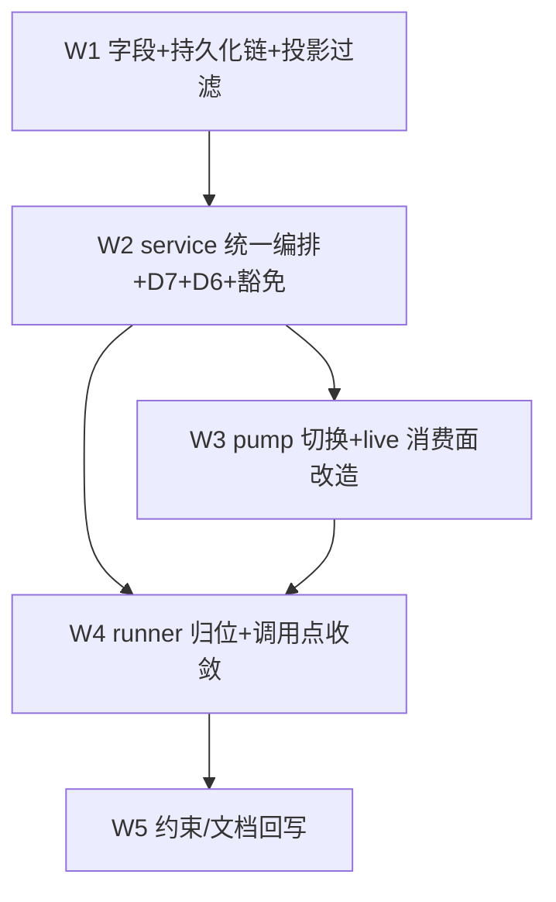

# workflow 域 agent() record 归位 实施计划
基线: bcb2ada46 | 来源设计: docs/design/subagent-workflow-record-unification.md (v3) | 日期: 2026-09-11

## 0 章节映射
| 内容 | 设计文档实际位置 |
|------|------------------|
| 背景/目标 | §1 背景目标（1.1 SCQA / 1.3 设计目标 G1-G3 / 1.4 in-out scope） |
| 终态/机制 | §3 解决方案（3.3 关键决策 D1-D7 + 既有机制×workflow record 决策表 / 3.4 错误规格 / 3.5 终态数据流） |
| 验收场景表 | §4 验收（S1-S6 真实场景表） |
| 下一层拆分 | §5 下一层拆分（W1-W5 单元表 + W2 接管迁移清单 + 文件改动地图 + 待验证检查点①-⑥） |
| 待验证检查点 | §5 末段「待验证检查点」①-⑥ |

对抗式审查证据：tech-design 双审循环 3 轮收敛（v1 首轮 9 MF → v2 轮 2 击穿 5 项 → v3 收敛 0 MF + 0 SUG），被否谱系 5 条在设计文档附录；设计头部「修订状态」声明收敛。

## 1 目标快照

**背景/目标（§1.3 逐字摘录）**：
- G1 agent() 等同 subagent：同一派发编排、同一 record 模型、同一治理保障；显式例外 = 成功收口形态（D7 workflow origin 成功即终态化）。
- G2 可见性 = 隐藏：workflow record 投影/列表层默认隐藏；run 视图实时进度从 store 订阅（parentRunId 查询）。
- G3 并发共享池：与手动 subagent 共用 DefaultConcurrencyPool（现状已成立，回归验证）。

**Out-of-scope（§1.4）**：workflow 脚本语言/script-lint 本体；WorkflowRun 聚合根与 FileRunStore（run 级状态保留原状）；workflow 视图 UI 改版（只换数据源）；H4 持久化收敛；run 级 pending 注册/注销对（lifecycle ↔ pump 不动，D5）。

## 2 单元表

| Unit | 内容 | 领地（允许触碰） | 依赖 | 难度 | 验收 |
|------|------|------------------|------|------|------|
| W1 | `origin`/`parentRunId` 字段 + **持久化链三环**（record-entry.ts entry schema 加字段 + recordToSubagent 投影加字段 + 重建链透传——漏任一环重启后 origin 丢失、D1 六面全失效）+ store 查询面（parentRunId 查询、`includeWorkflow` 参数）+ 投影层过滤四处（subagents tool list 默认过滤 + runner 恢复指引文案带 includeWorkflow:true、renderer useSidebarCounts active bucket、useBackgroundWork.hasRunning、TUI /subagents） | core `execution/{types,record-entry,record-store}.ts` + `execution/subagent-service.ts`（仅注册面字段透传，若需）+ extension `subagent-workflow/src/interface/subagents.ts` + renderer `useSidebarCounts`/`useBackgroundWork` + TUI list 面 | 无 | medium | 单测：entry 往返（写→重建→字段保真）+ 四投影面过滤断言 + 缺省 origin="tool" 负向断言 |
| W2 | service 统一编排入口 `executeWorkflowAgent`（接管迁移清单八步：路由/预检/model 校验/journal/守护单点键 record.id 双刷新源/mergeRunSignals/spawned-children 复刻，ctxModel 孪生守卫放弃）+ D7 origin 收口分支（settleOneShotOutcome **函数顶部** + 自带 tryTransition 抢锁 + 条件含 `!aborted`）+ D6 通知 origin gate（toNotifyRecord 单漏斗）+ adopt 豁免（service 分诊两处 + supervisor domain.ts 双点）+ superseded 豁免 | core `execution/subagent-service.ts` + `execution/subprocess-agent-runner.ts`（本轮仅保留 run() 契约，归位在 W4）+ `execution/round-supervisor/{service-binding,domain}.ts` + `execution/record-store.ts`（若 boot 分区负面断言需） | W1 | high | 单测：注册面/池顺序（路由预检先于 acquire）/守护 arm 键/D7 收口（含 CAS 规格：memory closedReason 不分叉、aborted+success 竞态不漂移）/D6 gate 负面断言/治理决策表逐族（含 bootPartition 对 workflow 形态负面断言、superseded parallel 同 slug 不误判） |
| W3 | pump 切换：删 progress record（createRecord 直调）+ trace.live 字段 + `new SubagentStream`；views/detail-content（3 处）+ WorkflowsView（3 处）+ run-snapshot（剥 live 序列化）的 live 消费面改造；订阅源切 store（parentRunId 查询 + getEventLog/getCurrentActivity 同源；archive 终态快照 = 复用 archive 内置 notifyChange tick） | `orchestration/{worker-message-pump,run-snapshot}.ts` + extension `subagent-workflow/src/interface/views/{detail-content,WorkflowsView}.ts` | W2 | medium | S1/S3 真机 + live 零引用编译 + run 视图逐字段对齐 projectLiveProgress 现状 |
| W4 | runner 归位（v3 定形：保留 SAR 类壳掏空 run() 改纯转调 executeWorkflowAgent——构造签名不变，唯一装配点 session-lifecycle.ts 零改动；ctxModel dep 保留签名兼容、run() 内不再消费）；journal-wiring 调用点 2→1；sweep 的 workflow 判据装配处置（run 级判据保留） | core `execution/subprocess-agent-runner.ts` + `execution/engine/common/journal-wiring.ts`（调用点）+ sweep 判据装配处 | W2、W3 | medium | S5 grep 门（`grep -n "createRecord(" packages/subagent-core/src/orchestration/` 零命中）+ views/run-snapshot 编译零 live 引用 + 全量测试 |
| W5 | 约束/文档回写：C-proc-13 ② 按域分明（record 域注销单点 = record 终态化；run 域注册/注销对 = lifecycle/pump）、sweep 条款修正、troubleshooting 排查通道更新（list includeWorkflow:true） | docs/constraints.json + constraints.md（render 再生）+ docs/troubleshooting.md + 本设计/impl-plan 状态回写 | W4 | low | doc-symbol-drift 绿 + render-constraints 幂等 |

## 3 DAG 图

串行主线（W1→W2→W3→W4→W5）；W3/W4 理论可并行但同域 orchestration/ 与 runner 装配弱耦合，保守串行（单 dev 顺跑成本已低）。

## 4 验收场景
见设计文档 §4 S1-S6（真机阶段执行；S4 并发上限 N 实施期读 settings 默认值入表——检查点⑤）。

## 5 偏差登记表

| 单元 | 条目 | 说明 |
|------|------|------|
| W1 | 领地外 +1（已批） | `packages/shared/src/subagent.ts` SubagentRecord 增 `origin?`——renderer 过滤 composable 消费 shared 跨进程契约，契约无字段则 vue-tsc/测试构造失败；只加 origin 不加 parentRunId（renderer W1 无下钻消费面，W3 需要时再加） |
| W1 | 实施口径两处 | ① TUI `/subagents` 补全与 overlay 经 `queries.collectRecords` 缺省自动继承过滤，subagents.ts 零改动即达成 D1④（设计预期改该文件，实际无需）；② 子文件 identity 通路（scanFile/buildRecord）不携带 origin——origin 只活在主 session 自描述 entry，identity 是否携带来源留待 W2 executeWorkflowAgent 接线时决策 |

## 6 状态表

| Unit | 状态 | 轮次 | 证据指针 |
|------|------|------|---------|
| W1 | committed | 1 | f57d1a687（16 文件：字段 + 持久化链三环 + collectRecords includeWorkflow/collectRecordsByParentRunId + 四投影过滤 + 治理面零过滤）；测试 core 2905 / renderer 22 / extension 910 全绿 + tsc/vue-tsc/extensions:lint exit 0；红锚验证 = 移除 readEntryOriginFields 透传后 record-origin.test.ts 转红 2 failed |
| W2 | pending | — | — |
| W3 | pending | — | — |
| W4 | pending | — | — |
| W5 | pending | — | — |

## 7 残留风险与变更历史

- 残留风险：① 设计行号基于 commit `22f77c157` 工作区（v2 声明），H1 落地后 subagent-service.ts 行号大幅漂移——实施一律以符号 grep 锚定（设计头部已声明）；② H1/H2 咬合点 subagent-service.ts（H1 刚重写编排核 + Continuation + origin 相关面）——W2 派发前 dev 必须先 read H1 终态的 settleOneShotOutcome / disposeAllRecords / adopt 分诊两处现状再动手，禁止按设计文档行号想象；③ 待验证检查点①-⑥（§5 末段）为实施期门：② projectLiveProgress 字段清单与 ③ views 数据源现状链是 W3 的 S1 等价表依据，W3 派发前须先产出对照表；⑤ 并发上限默认值入 S4 验收表；⑥ D7 成功终态 reason=gc 的 GUI/通知投影兼容。
- 变更历史：
  - 2026-09-11 计划创建（来源设计 v3，双 0 收敛版；H1 双绿交付当日启动，基线 bcb2ada46）。执行依据 = 用户托管指令（H1 → H2 → H3 → H4 串行，dev-flow 全流程）。
