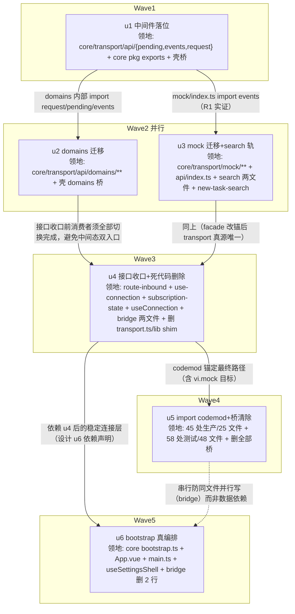

# T&C 收口（tc-transport-consolidation）实施计划

基线: 2da0016d2 | 来源设计: [docs/design/tc-transport-consolidation.md](tc-transport-consolidation.md)（v5） | 日期: 2026-09-02

> 审查证据：来源设计「附录：变更历史」v2–v5 条目——R1（2 must-fix）/ R2（2）/ R3（1）/ R4（**0 must-fix**，判定「v4 可进入实施」），v5 收录 R4 全部修复。无独立旁路报告文件（`.review/` 不存在），以内嵌变更历史为准。

## 0 章节映射

| 内容 | 设计文档实际位置 |
|------|--------------|
| 背景/目标 | §1 背景：被设计的系统是什么 · §2 设计目标（G1–G5 + In-scope / Out-of-scope） |
| 终态/机制 | §5 终态：使用者眼里将是什么样的 · §6 关键决策与权衡（D1–D5）· §7 实现机制 |
| 验收场景表 | §8 验收（§8.2 场景表 A1–A7） |
| 下一层拆分 | §10 下一层拆分（u1–u6 种子）· §9 实施阶段（M0–M5） |
| 待验证检查点 | §11 待验证检查点（5 条） |

所有 subagent task 的设计引用一律从本表坐标取，禁止自猜编号。

## 1 目标快照（逐字摘录）

**一句话结论**（设计开头）：「把滞留 renderer 壳的 api 中间件（events / pending / request / domains / mock，约 5.3k 行）原样下沉 `core/transport`，删除死代码连接入口与 TransportPorts 反向注入接口，让 `bootstrap()` 从零调用的占位变成被 renderer 壳真实调用的五步编排——入站消息从『跨界两次』变『单跨界』，mobile 壳获得可复用的 RPC 层。」

**设计目标**（§2）：G1 seam 收口 · G2 连接语义单一 · G3 extension-host 流量并入 · G4 mock 单一真源 · G5 bootstrap 真编排。

**Out-of-scope**（§2，逐字）：

- mobile 壳对接 core bootstrap（组 3；mobile 自身 TODO 注释亦标注 P1+D2 条件）
- i18n 下沉（组 3）；route-inbound 三结构合一（ROUTE_TABLE/CROSS_SESSION_TYPES/FALLBACK，独立小步）；transport 模块级状态的 taste 治理收编（组 2）；测试语义分流「锚 core / 随壳消亡」（组 2——本波只改测试的 import 路径，不改断言语义）
- `@/api` barrel facade（45 处 `from '@/api'`）的迁移——facade 是壳的 env 装配，留在壳（见 D4）

## 2 单元列表

**中间态桥策略**（本计划层决策，设计 §9「每阶段独立 commit + 验证」的实现前提）：u1–u2 迁移波内，壳原文件降为单行 re-export（`export * from '@xyz-agent/core/…'`）保编译不断；消费者 import 改写集中在 u5 codemod，u5 末删除全部桥文件。终态与设计 §7 壳目标结构一致（`packages/renderer/src/api/` 仅剩 index.ts）。区别于 D1 否决的 B 方案：桥只存在于波内、u5 终态全删，不是交付形态。D1 否决语境是「22 个文件骨架保留到 P6 清尾」的长久 shim。

| Unit | 职责 | 领地（精确文件路径） | 依赖 | 隔离 | 验收条款 |
|------|------|----------------------|------|------|----------|
| **u1** 中间件落位 | pending/events/request 迁 core + core exports 基建 + 壳转桥 + 受影响测试 mock 改锚 | 新增 `packages/core/src/transport/api/{pending,events,request,index}.ts`；新增 `packages/core/src/transport/api/__tests__/{pending,request}.test.ts`（自 `packages/renderer/src/api/__tests__/` 随迁，import 改写）；改 `packages/core/package.json`（exports 预加 `./transport/api`、`./transport/api/domains`、`./transport/mock`、`./transport/ws-client` 四行——中间两行指向 u2/u3 将创建的路径，无人 import 零影响；`./transport/ws-client` 供 renderer 测试 vi.mock 说明符解析）；改 `packages/renderer/src/api/{pending,events,request}.ts` 为单行桥（指向 `@xyz-agent/core/transport/api` barrel，deviation 登记：模块级四段子路径无 exports 条目不可解析）；改 6 个测试文件 mock 目标改锚 core ws-client（`src/__tests__/api/{t4-api-layer,quota-domain,preset-domain,composer-domain}.test.ts`、`src/__tests__/new-task/session-api.test.ts`、`src/__tests__/extension-upgrade.test.ts`——原 vi.mock('@/api/transport') 拦截 request→transport.send 链路，桥化后 request 在 core 内直连 ws-client 失拦截，v2 修订前移自 u4） | 无 | plain | ① `pnpm --filter @xyz-agent/core test` 绿（fake timers 用例在 core vitest 跑通，§11-3 首个实证点）；② `pnpm --filter @xyz-agent/frontend typecheck && pnpm --filter @xyz-agent/frontend test` 绿；③ `git diff` 显示 25 个子路径消费者文件零改动（6 个 mock 改锚测试文件除外，v2 修订） |
| **u2** domains 迁移 | 17 域文件迁 core（内部 import 改 core 相对路径）+ 壳转桥 | 新增 `packages/core/src/transport/api/domains/`（17 文件，1,891 行，**不建 index.ts barrel**——域目录 barrel 本就不存在，10 个同名导出冲突使打平 barrel 不可行，v4）；改 `packages/core/package.json`（exports 增通配 `"./transport/api/domains/*"` 一条覆盖 17 域 + **删** u1 预置的 `./transport/api/domains` barrel 条目，v4）；改 `packages/renderer/src/api/domains/*.ts` 为 17 个单行桥，**直指单域子路径** `export * from '@xyz-agent/core/transport/api/domains/<domain>'`（v4：barrel 形态因同名冲突不可行，通配条目即 u5 codemod 终态锚点）；`extension.ts` 的 `import * as transport from '../transport'`（6 处 transport.send）改锚 `import { send } from '../ws-client'`；**settings.ts 拆分**（v4）：core 侧仅迁 WS 部分（剔除 `'@/lib/ipc'` import 与 getProxyConfig/setProxyConfig/testProxy/getUpdateSettings/setUpdateSettings 五个 Electron IPC 函数——平台门面留壳），壳 settings.ts = 桥（re-export core settings 子路径）+ 本地保留 5 个 IPC 函数（UpdatePage.vue:178 混合具名消费零改动）；改 `packages/renderer/src/api/__tests__/usage-forcequit-domains.test.ts` 的 mock 改锚（v4：vi.mock('@/api/request') 桥化后失拦截——同 u1 v2 前移模式，ws-client/pending 类说明符参照 preset-domain.test.ts:38-39 改法，断言与 factory 零改动；`'@/api/mock'` 数据 import 不动，mock 迁移属 u3） | u1 | plain | ① core + frontend 双包 typecheck/test 绿；② barrel facade 消费者（57 处实测）零改动经桥全通；③ domains 内部对 pending/events/request 的 import 全部为 core 内相对路径（extension.ts 除外——其 transport 依赖改锚 ws-client） |
| **u3** mock 迁移 + search 轨 | mock 全量迁 core + facade 改锚 + VITE_E2E 参数化 + search 轨条件化 + SearchPorts 可选化 | 新增 `packages/core/src/transport/mock/`（11 文件 2,934 行 + `src/mock/mock-ws.ts` 148 行并入；`mock/index.ts:40` 的 `'@/lib/ws-client'` 改 core 相对 `'../ws-client'`（:67 wsClient.getState 用法）；`:100` `import.meta.env.VITE_E2E` 改工厂参数，facade 注入）；改 `packages/renderer/src/api/index.ts`（facade mock 侧 `'./mock'` 改 `'@xyz-agent/core/transport/mock'` + VITE_E2E 注入；real 侧 `'./domains/xxx'` 桥引用留给 u5 codemod）；删 `packages/renderer/src/api/mock/` 与 `packages/renderer/src/mock/mock-ws.ts`；改 `packages/renderer/src/main.ts:7` 与 `packages/renderer/src/composables/shell/useSettingsShell.ts:43` 的 mock-ws import 改锚 core 子路径（v6 领地扩展，各一行；useSettingsShell :65-70 兜底注入段归 u6 不动）；改 `packages/renderer/src/composables/features/search/{useSearch.ts,useSearchModalDeps.ts}`（D4-②：顶层静态 import core mock 子路径 + 引用点整体条件化——useSearch:120 已在 isMock 分支天然成立；useSearchModalDeps:57 `searchMock: mockApi.search.query` 无条件属性引用改 `isMock ? mockApi.search.query : undefined` 构建期常量分支）；改 `packages/core/src/domain/new-task-search/search-ports.ts`（:106 searchMock 改可选）；改 `packages/core/src/domain/new-task-search/search.ts`（:123 isMock 分支加守卫，缺字段显式抛错）；改 `packages/core/package.json`（`sideEffects: false` + exports 追加 `"./transport/mock/*"` 通配覆盖 mock-ws）；searchMock 相关测试类型适配（grep searchMock renderer 测试零命中，预计无需改动，以实测为准） | u1 | plain | ① frontend typecheck + test 绿（fg1/fg5/fg6 等 mock 行为测试断言不动通过）；② SearchPorts.searchMock 为可选字段且 search.ts 守卫存在；③ 探针门③：`pnpm --filter @xyz-agent/frontend build` 后产物 grep `search-data` / mock fixture 标识串零命中（失败 fallback 动态 import 并复测，设计 §11-1） |
| **u4** 接口收口 + 死代码删除 | TransportPorts 降内部 seam + ConnectionPorts 收窄 + bridge 改锚 + connect()/shim 删除 | 改 `packages/core/src/coordination/route-inbound.ts`（生产直连 transport/api；`configureRouteInbound(ports?)` 可选参数，缺省真实模块——TransportPorts 接口定义保留为 core 内部测试 seam）；改 `packages/core/src/transport/use-connection.ts`（ConnectionPorts 删 pending/events/subscribe 三字段；:176-177 configureRouteInbound 透传与 :277/:290/:312 ports.pending 调用改内部 import `'./api/pending'` / `'./api/events'` / domains session subscribe）；改 `packages/core/src/coordination/subscription-state.ts`（:31/:94/:109 `TransportPorts['subscribe']`/`Pick<TransportPorts,'subscribe'>` 改直引 core domains/session subscribe 签名类型）；core 4 测试构造适配（`coordination/route-inbound.test.ts`、`subscription-state.test.ts`、`subscription-replay.test.ts`、`transport/__tests__/ws-client.invariants.test.ts`——断言不动）；改 `packages/renderer/src/composables/useConnection.ts`（装配瘦身：删 :69-71 三字段 + :32-34 相关 import）；改 `packages/renderer/src/composables/shell/useExtensionHostBridge.ts`（:51 getState 改锚 core + :67 `import * as transport from '@/api/transport'` 改 `import { send } from '@xyz-agent/core/transport/ws-client'`，:193/:278 调用点改 send）；改 `packages/renderer/src/composables/shell/extension-host-dialog.ts`（:25 同款改锚，:151 调用点）；删 `packages/renderer/src/api/transport.ts`；删 `packages/renderer/src/lib/ws-client.ts`；改 5 个 shim 消费测试（`composables/shell/__tests__/useExtensionHostBridge.test.ts`、`__tests__/ws-client-send-boolean.test.ts`、`session-workflow-update-fallback.test.ts`、`session-exited.test.ts`、`session-subagents-fallback.test.ts`——import/vi.mock 说明符 '@/lib/ws-client' 改 core）；改 2 个剩余 transport mock 测试（`composables/shell/__tests__/extension-host-dialog.test.ts`、`useExtensionHostBridge.test.ts` 的 vi.mock('@/api/transport') 改 core ws-client）；**改 `.githooks/check_no_direct_ws_send.py`**（v8：WS_WHITELIST 更新——移除已删除的 api/transport.ts，加入 useExtensionHostBridge.ts 与 extension-host-dialog.ts（设计 D5 批准的 bridge 直连形态）；注释同步 D5 决策） | u2、u3 | plain | ① core + frontend 双包 typecheck/test 绿；② `grep -rn "TransportPorts" packages/renderer/src` 非注释行零命中；ConnectionPorts 类型无 pending/events/subscribe 字段；③ `packages/renderer/src/api/transport.ts` 与 `packages/renderer/src/lib/ws-client.ts` 不存在；④ pre-commit 全绿（含更新后的 ws-send 白名单） |
| **u5** import codemod + 桥清除 | 全部子路径消费者改指 core + 删全部桥 | 改生产子路径 import 41 处/33 文件（含 8 个 .vue）：`'@/api/{pending,events,request}'` → `'@xyz-agent/core/transport/api'`（barrel）；`'@/api/domains/<domain>'` → `'@xyz-agent/core/transport/api/domains/<domain>'`（u4 通配条目即终态锚点，纯前缀替换）；**settings 混合拆分**：WorktreePage.vue:149 / SystemAutoRenameSection.vue:48 / SystemSmartContextSection.vue:114 / update/UpdatePage.vue / useAppUpdate.ts 等具名消费——WS 函数行改 core 子路径、IPC 5 函数（getProxyConfig/setProxyConfig/testProxy/getUpdateSettings/setUpdateSettings）行留 `'@/api/domains/settings'`（v10；壳 settings.ts 桥段删除、IPC 部分保留为纯壳门面文件不删）；改测试子路径 55 处同步改写（vi.mock 说明符与生产 import 说明符一致才拦截——u1 实证）；改 facade `packages/renderer/src/api/index.ts`（15 个 `'./domains/xxx'` → core 子路径；类型 re-export 同步）；删 20 个桥文件（pending/events/request + domains 16 个非 settings；settings.ts 桥段删除文件保留）；挪 `packages/renderer/src/api/__tests__/usage-forcequit-domains.test.ts` → `packages/renderer/src/__tests__/api/`（api/__tests__/ 目录随之删除）；改 `packages/renderer/vitest.config.ts`（:32 coverage exclude 'src/mock/**' 指向已删目录，清理——v10） | u4 | plain | ① A6 回归门：core + frontend 双包 typecheck、双包 test、根 `pnpm lint` 全绿；② `ls packages/renderer/src/api/` 仅 index.ts 与 domains/settings.ts（IPC 门面）；③ `grep -rn "from '@/api/" packages/renderer/src` 仅剩 settings IPC 消费行 |
| **u6** bootstrap 真编排 | initConnection 真实现 + 调用点收敛 + 注册触发去重 | 改 `packages/core/src/bootstrap.ts`（initConnection 真实现 = `useConnection().init()`——core 内直 import `'./transport/use-connection'`，resolve 即编排提交（D2 裁决②，不等待 connected）；`BootstrapOptions` 删 `connectionMode` 字段（init() 只消费 env.isMock，双开关源删一）；restoreSessions 保持 core 内 no-op 占位（R3 减法修正，删 console.log 改无输出 no-op + 注释说明 future 扩展点归 core coordination）；五步日志加顺序编号（探针①可观察：`[bootstrap] step N/5 ...` 形态）；头部注释从「P0 骨架」更新为真编排描述）；改 `packages/core/src/__tests__/bootstrap.test.ts`（makeOptions 删 connectionMode:20；initConnection 真实现后 spy 方式适配——断言 ES1 顺序与 reject 中断不动）；改 `packages/renderer/src/main.ts`（platform 分叉收敛为 `resolvePlatform()` 模块级 memoized 函数 + export 供 App.vue；main.ts 早期注入保留——settings-lifecycle.ts:88 setup 期消费点 + HMR 场景；[HISTORICAL] 死锁注释更新指向）；改 `packages/renderer/src/App.vue`（:96 `onMounted(() => { void init() })` → `onMounted(() => { void bootstrap({ platform: resolvePlatform() }) })` + ES1 catch（bootstrap reject 上抛接现有错误展示路径，最小形态 console.error + 现有 connection error UI；connected 驱动 watch :98-105 保持不动）；useConnection 的 init 解构若不再直接用则清理）；改 `packages/renderer/src/composables/shell/useSettingsShell.ts`（删 bootstrapSettingsCore 内 :66-70 platform 兜底注入段——分叉真收敛 main.ts 一处；函数其余逻辑不动；注释同步）；改 `packages/renderer/src/composables/shell/useExtensionHostBridge.ts`（删 :259-260 两行 `void registerMountPoints()` / `void scanContributions()` 及 :258 fire-and-forget 注释；:257 setExtensionRegistries 注入保留——注册收敛为 bootstrap 第 4/5 步唯一触发；:9 头部注释同步） | u4 | plain | ① core + frontend 双包 typecheck/test 绿（core 1277 基线含 bootstrap.test 适配）；② 探针①（dev 实跑五步顺序 + 到 connected 无 warn）**留阶段 5 Gate B 统一执行**（dev 环境跑 Electron 受限，主 agent 验收阶段实跑；本单元交付日志顺序编号的可观察性）；③ `grep -n "connectionMode" packages/core/src` 零命中 |

领地互斥校验：u2 与 u3 同波并行（领地无交集，`packages/core/package.json` 由 u1 预置三行 exports、sideEffects 归 u3 独占）；u4/u5/u6 均触碰 `useExtensionHostBridge.ts` 但分属串行波次（u4 改锚 → u5 codemod 其余 api import → u6 删 2 行注册触发），无并行写冲突。无独立 u-foundation：共享接线点（core package.json exports + api barrel）已并入 u1 独占，u1 即波次根节点。

## 3 DAG 图



波次表：W1[u1] → W2[u2 ∥ u3] → W3[u4] → W4[u5] → W5[u6]。共 5 波，最大并发 2。

## 4 测试策略

命令实证自各包 package.json scripts（2026-09-02）：

**增量（每单元开发循环内）**：

```bash
pnpm --filter @xyz-agent/core typecheck && pnpm --filter @xyz-agent/core test
pnpm --filter @xyz-agent/frontend typecheck && pnpm --filter @xyz-agent/frontend typecheck:test && pnpm --filter @xyz-agent/frontend test
```

**全量（u5 的 A6 门 + 阶段 5 收尾，项目收尾场景）**：

```bash
pnpm test          # 根脚本：packages/* + apps/* + extensions/*
pnpm lint          # 根脚本：eslint . --max-warnings 0
```

**真实场景（阶段 5 Gate B，设计 §8 场景表）**：A1 真实对话流、A2 mock 模式、A3 断连恢复、A4 插件挂载点上报、A5 启动编排（u6 探针）、A7 mock 不进生产包（u3 探针③）。A1/A3 最高优先级。每个场景用真实 app 操作与真实 runtime/mock 进程，不用单测断言替代。

**测试红线**（设计 §8 A6 + AGENTS.md）：renderer 测试断言语义不变（vi.mock 拦截目标重写除外）；core 路由类测试仅构造方式适配、断言不动；vitest 配置在子包 vitest.config.ts，从子包目录运行。

## 5 合理偏差登记表

| # | 单元 | 偏差内容 | 设计锚点 | 状态 |
|---|------|----------|----------|------|
| 1 | u1 | 三桥统一指向 `@xyz-agent/core/transport/api`（barrel）而非模块级子路径——模块级四段子路径无 exports 条目不可解析；`'@/api/pending'` 等入口暂为三模块导出超集（无同名冲突），u5 桥删除后消失 | 设计 §7 壳目标结构（终态无桥，不受影响） | 已批准 |
| 2 | u1 | 6 个测试 mock 说明符改锚：ws-client 类用 `@xyz-agent/core/transport/ws-client`（exports 第四行支撑）；pending 类用跨包相对路径直指 `core/src/transport/api/pending.ts`——vi.mock 按解析后模块 ID 拦截，barrel 说明符与 core 内部 `'./pending'` 是不同模块 ID 无法拦截。断言与 factory 零改动 | 设计 §11-2（拦截链路实证，结论反哺 u4：pending 类目标必须直指模块文件） | 已批准 |
| 3 | u1 | request.ts 内 `transport.send` 改为 ws-client 具名 `send` 直连（含 request.test vi.mock 目标连带 + extension-upgrade namespace import 连带） | 设计 §4 After 图「request → ws-client.send」直连即终态 | 已批准 |
| 4 | u2 | 领地外 3 测试文件追认（chat-bash / chat-send-images / session-removebycwd）：vi.mock('@/api/request') 同族失拦截（桥不转发 mock），与 v4 裁决 B1 同根因同模式，说明符改锚 core request 跨包相对路径，断言与 factory 零改动 | 计划 v4 B1 裁决先例（设计 §11-2） | 已追认（v5） |
| 5 | u2 | usage-forcequit 改锚形态：command 级断言（commandMock）直指 core request 模块文件（preset 的 send 级改法不适用——断言层级不同）；「断言零改动优先」裁决 | u1 偏差 #2「直指模块文件」模式 | 已批准 |
| 6 | u2 | extension.ts transport.send 实际 1 处（:190；v3/v4 计划文字「6 处」为 grep -o 计数把非调用行计入的沿袭错误）；ws-client 相对深度 '../../'（domains/ 比 api/ 深一层）；core settings.ts 两处历史注释随 IPC 剔除同步修正 | 事实修正，无设计冲突 | 已批准 |
| 7 | u3 | isE2E 参数化用 `let isE2E + setMockE2E()` setter 而非全量工厂——mock/index.ts 持模块级单例状态（streamHandlers/mockQueues 等），工厂形态会令 facade/useSearch/fg 测试各自实例化隔离副本破坏共享状态可见性；setter 保单例语义 + 全部消费者导出签名零改动 | 设计 D4「工厂参数由壳注入」的等价机制（注入语义达成，形态适配单例约束） | 已批准 |
| 8 | u3 | 6 个测试文件单行 import/vi.mock 说明符改锚（fg1/fg5/fg6/usage-forcequit → core mock；useExtensionHostBridge.test/useSettingsShell.test → core mock/mock-ws）——删目录与源码改锚后消费方必须同步，派发事实漏盘 | u2 偏差 #4 同款先例（v5 追认） | 已追认（v7） |
| 9 | u3 | 残留上报：vitest.config.ts:32 coverage exclude 'src/mock/**' 指向已删目录（零行为影响，留 u5 清理）；lib/ws-client.ts:8 等注释提旧 mock 路径（u4 删该文件自然消亡） | 待 u4/u5 收尾 | 已登记 |
| 10 | u4 | core 测试适配范围超领地清单：4 文件 → 实际 8 文件（transport/__tests__/ 下 7 个 use-connection 系列测试均构造三字段须改 vi.mock 模块级拦截，断言不动；coordination 3 测试 + ws-client.invariants 零改动） | ConnectionPorts 删字段的必然连带（同 u2 #4 先例） | 已追认（v9） |
| 11 | u4 | route-inbound defaultPorts.subscribe 用动态 import 惰性解析（非顶层静态值使用）——静态使用会拉进 ws-client 静态链破坏 renderer 测试 mock 拦截（bisect 五轮实证，回填 §7 风险 2）；pending/events 静态使用无害 | 设计 D3「生产直连」语义不变，仅 subscribe 解析时机惰性化（运行时仍 core 真源） | 已批准 |
| 12 | u4 | use-connection-seq-gap.test TC4 断言包 vi.waitFor()（flush 机制适配，断言语义逐字不动，route-inbound.test:199 先例）；check_no_direct_ws_send.py 排除规则修正目录段匹配（修误报，AGENTS.md 规则本体修正原则）；route-inbound.test 新增 1 个默认路径用例（core 1276→1277） | 预期内最小适配 | 已批准 |
| 13 | u5 | settings 混合拆分实测不存在——UpdatePage.vue:178 纯 IPC（零改动留壳路径）、WorktreePage/SystemAutoRename/SystemSmartContext 纯 WS（整行改 core）；useAppUpdate.ts 实测直连 '@/lib/ipc' 不消费 settings 桥（派发预判失实，按 grep 实测处理） | 事实修正，终态等价（IPC 门面留壳、WS 归 core） | 已批准 |
| 14 | u5 | 派发盘点外连带修复：3 处相对路径桥引用补漏（events-global:2 / extension-upgrade:24 / rpc-type-pairing:22——后者的目录扫描守卫对象跟随真源迁移，防扫描面静默缩为壳剩 IPC 门面）；eslint.config.mjs 的 mock max-lines 豁免 glob 跟随迁移改指 core（u3 遗留被 A6 门暴露，正面修复非新增豁免）；usage-forcequit 挪位连带桥 import 改锚 | 「检出问题全部正面修复」原则 | 已批准 |
| 15 | u5 | 约 15 处注释内散文式路径描述未批量重写（部分含行号引用需核对，批量改写会显著扩大 diff）——留组 2 清理 | 非本波 scope（注释非行为） | 已登记 |
| 16 | u5 | frontend 全量第 2 轮 2 例间歇失败（未捕获用例名），同代码状态复跑两轮全绿 + 基线亦绿，判定环境负载 flaky；u5 为纯说明符替换无逻辑/时序改动 | flaky 记录，A6 以最终两轮连续全绿计 | 已登记 |
| 17 | u6 | resolvePlatform 落新建独立模块 `packages/renderer/src/platform/resolve-platform.ts`（非任务字面的 main.ts 内 export）——App.vue 反向 import main.ts 会把 createApp/app.mount 全副作用拉进每个 import App 的测试（App-w8 必挂）并成环 | 分叉收敛单点语义不变（D2），形态更正确 | 已批准 |
| 18 | u6 | 领地外 useExtensionHostBridge.test.ts 适配：TC11/TC12 断言依赖旧装配期注册，收敛后新增 simulateBootstrapRegistration() 显式模拟 step4 + 三处装配点统一补 ensureMountPointsSync 守卫，断言语义逐字不动 | u2/u3/u5 同族先例；不动则验收②③物理不可能 | 已追认（v13） |
| 19 | u6 | bridge :287-289 commandRegistry 声明同步段从装配期同步循环改 ensureCommandDeclarationsSync（watch(connected) 重放 + 模块级守卫，与 ensureMountPointsSync 同构）——§11-5 自查发现：不改则注册收敛 step5 后装配期 contributions 恒空，builtin slash 声明永久丢失 | 领地文件内超字面行段的真实缺陷修复 | 已批准 |
| 20 | u6 | restoreSessions 保留 `[bootstrap] step 3/5` 编号日志（任务「删 console.log 改无输出」与「各步加编号日志」两条款冲突，按探针①可观察性优先消解；函数体除日志零副作用） | no-op 语义不变 | 已批准 |
| 21 | u6 | §11-5 时序结论：维持 onMounted 形态无需 fallback——connected 唯一驱动均为宏任务（WS onopen+auth / mock 200ms setTimeout），bootstrap step2 resolve 后 step3-5 由 await 链微任务接续，step4/5 结构性先于 connected；settings 订阅注册（setup 同步段）仍先于首推 | 设计 §11-5 裁定标准满足 | 已采纳 |

预登记两条口径差异（非偏差，数字校准）：设计「测试 62 处/50 文件」实测 **58 处/48 文件**（子路径口径，另 barrel 12 处不动）；设计「3 个测试改路径」（lib shim）实测 **5 个测试文件**（useExtensionHostBridge.test / ws-client-send-boolean / session-workflow-update-fallback / session-exited / session-subagents-fallback）。以实测为准执行，不回改设计文档（±4 处属设计期统计与 HEAD 漂移）。

## 6 状态表

| Unit | 状态 | 轮次 | 证据指针 |
|------|------|------|----------|
| u1 | committed | 2（首轮 core 侧 + 续轮 6 测试 mock 改锚，计划 v2 修订） | core test 1276 passed/6 todo + frontend test 348 文件 3601 passed/3 skipped + 双包 typecheck 绿；commit 见 git log `refactor(core)` u1 条目 |
| u2 | committed | 2（首轮零改动 blocker 上报三处派发事实失实 + v4 裁决续作全绿） | 同 u1 基线全绿不回归；22 领地文件 + 3 追认测试（v5）；commit 见 git log `refactor(core)` u2 条目 |
| u3 | committed | 1（一次通过） | 双包基线一致（core 1276 / frontend 3601）+ 探针门③ build 后产物 grep 10 个 mock 标识串零命中（**优于基线**：迁移前 HEAD 实测存在 fixture 泄漏）+ E2E 注入跨包验证；6 追认测试（v7）；commit 见 git log u3 条目 |
| u4 | committed | 1（一次通过，5 deviations 全批/追认） | core 93 文件 1277 passed（+1 默认路径用例）/ 6 todo + frontend 348 文件 3601 | 3 skipped 基线一致；TransportPorts 壳层非注释行零命中；transport.ts/lib shim 已删；白名单守卫 exit 0；commit 见 git log u4 条目 |
| u5 | committed | 1（一次通过，8 deviations 全批/追认） | A6 回归门全绿（双包 typecheck 三连 + core 1277 / frontend 3601 基线 + 根 lint 零告警，主 agent 独立复跑确认）；131 项改动（111 M + 19 D + 1 R091 挪位，v14 审查修正口径）；api/ 终态 index.ts + domains/settings.ts（IPC 门面）；commit 见 git log u5 条目 |
| u6 | committed | 1（一次通过，5 deviations 全批/追认，含 §11-5 时序自查结论） | 双包基线一致（core 1277 / frontend 3601）；bootstrap 生产调用成立（App.vue onMounted）；connectionMode 零残留；探针①可观察性交付（step N/5 日志）；commit 见 git log u6 条目 |

**阶段 3 一致性审查记录**（2026-09-02，四区 reviewer 并行，diff 区间 04de5cbf1..HEAD）：

- R1 core api+domains / R2 mock+search / R3 接口收口 / R4 codemod+bootstrap 各自独立完成，合计 unreasonable **1 条**、doc_errors 5 条（去重）。
- **U1（unreasonable，已修复）**：App.vue ES1 catch 仅 console.error 未落地设计 §5.2「降级 UI + 重试入口」，且计划 v12 ④ 软化要求未走偏差程序——根因是计划层失误。修复：catch 内 `setFailed()` 置 failed 终止态 → App.vue 现有 failed 分支（错误展示 + onRetry → retryRuntime）自动渲染，即落地设计要求（setFailed 无参签名经 ws-client.ts:151 核实）。
- **doc_errors 5 条处置**：设计 §7 core 树（domains 行数 1,857 + index.ts barrel）与壳树（settings 门面保留 + resolve-platform + setFailed + shim 行删除）+ D1 settings 拆分修订声明 → 设计文档 v6 回写（主 agent 亲为）；pending.ts:9 注释漂移 + ws-send 白名单 useConnection.ts 僵尸条目 → 修复批次一并处理；计划状态表 u5 统计口径修正（v14）。
- 修复批次验收：frontend typecheck 绿 + 348 文件 3601 测试基线 + 守卫脚本 exit 0（主 agent 复跑）。
| u3 | pending | 0 | — |
| u4 | pending | 0 | — |
| u5 | pending | 0 | — |
| u6 | pending | 0 | — |

## 7 残留风险与变更历史

**残留风险**（继承设计 §11 全部 5 条 + 本计划新增 2 条）：

1. 跨包静态分支 DCE（§11-1）：u3 探针门③实证，失败 fallback 动态 import。
2. vi.mock 拦截链路（§11-2）：~~u4 预改 1 个 t4-api-layer 类测试验证后批量~~ **u1 已实证**（v2）：① core 内相对 import 的 vi.mock 拦截**有效**（core request.test.ts 3 用例绿，mock 说明符按测试文件位置解析 `'../../ws-client'`）；② **桥不转发 mock**——vi.mock('@/api/transport') 拦截壳模块，core 内部 import 不受影响（先例坑 session-workflow-update-fallback.test.ts:31 在 u1 提前引爆而非 u4）；③ mock「request→send」链路的测试须改锚 core ws-client（需 exports `./transport/ws-client` 条目）；④ **u4 补充实证**（v9）：route-inbound 若顶层静态值使用 domains/session 的 subscribe，会把 session→request→ws-client 链拉进静态模块图，导致 renderer 侧 ws-client 的 vi.mock 全部失效（bisect 五轮验证）——subscribe 用动态 import 惰性解析规避（低频路径零成本）；pending/events 无 ws-client 下游链，静态使用无害。
3. core vitest 对随迁测试兼容性（§11-3）：u1 即首个实证点（fake timers / domains mock 数据）。
4. core 子路径 exports 在 renderer vite 构建下解析（§11-4）：现状 `.` 入口 166 文件消费风险低，u1 typecheck 即验证。
5. 挂载点/贡献注册触发时序（§11-5）：u6 探针；fallback 自带裁定标准（订阅注册先于 sendInitialState 首推，[HISTORICAL] 竞态不得重开）。
6. **[本计划新增]** exports 预加三行中两行（domains/mock）在 u1 commit 后、u2/u3 落地前指向不存在文件——无人 import 零影响；若期间有第三方 import 该子路径会解析失败（本仓内无此用法，grep 实证）。
7. **[本计划新增]** 临时桥窗口内（u1–u4 期间）存在 core 真源 + 壳桥双文件——设计 D1 否决的是长久 shim，桥窗口最长 3 波且 u5 终态全删；若执行中断于窗口内，状态表如实记录桥存在的事实。
8. **[v4 新增]** settings 域混合消费：u5 codemod 时 UpdatePage.vue（及其他）从 `'@/api/domains/settings'` 的具名 import 混含 core WS 函数与壳保留的 5 个 IPC 函数——须拆分 import（WS 部分改 core 子路径、IPC 部分留壳路径），不能整文件盲替。

**变更历史**：

- v1：2026-09-02 初版（基于设计 v5 + 领地实证：生产 45 处/25 文件、测试 58 处/48 文件、vi.mock transport 9 处、shim 测试 5 文件、renderer 包名 @xyz-agent/frontend）。
- v2：2026-09-02 u1 首轮 dev 后计划修订：① u1 领地扩入 6 个测试文件（t4-api-layer / quota-domain / preset-domain / composer-domain / session-api / extension-upgrade）的 mock 改锚 + core exports 补 `./transport/ws-client` 行——根因：桥不转发 mock（§7 风险 2 实证），这 6 个测试断言「request→transport.send 被 mock 调用」，桥化后 request 在 core 内直连 ws-client 失拦截，33 用例红；原计划把 mock 改写全放 u4 导致 u1-u4 波次间 frontend test 红，违反「每单元测试绿」纪律；② u4 对应缩减（9 个 vi.mock 测试中 6 个前移）；③ 桥形态 deviation 登记（指向 barrel `@xyz-agent/core/transport/api` 而非模块级子路径——四段子路径无 exports 条目，'@/api/pending' 等入口暂为三模块导出超集，u5 桥删除后消失）。
- v3：2026-09-02 u2 派发前修正：① extension.ts 的 `'../transport'` 依赖改锚 ws-client（6 处 send）；② usage-forcequit-domains.test.ts 留壳不随迁（依赖 u3 未迁的 mock 数据）；③ u2 领地补 `domains/index.ts` barrel 创建；④ W2 并行改波内串行（u2 → u3）——同工作区并行开发时全量 typecheck/test 相互看到对方中间态，保守正确优先。
- v4：2026-09-02 u2 首轮零改动 blocker 上报后裁决（三处派发事实失实，dev 证据行号级核实）：① **B2 桥形态**——10 个同名导出冲突（preset/session 的 list/create/remove；settings re-export config/extension 的 onProviders/onSkills/onAgents/onDefaults/onExtensions/listProviders/setProvider）使「barrel + 单行桥 + 消费者零改动」不可同构，且 `'@/api/domains'` 目录 barrel 本不存在（17 文件外无 index.ts）——裁决：不建 barrel，core exports 增 `"./transport/api/domains/*"` 通配一条覆盖 17 域（即 u5 codemod 终态锚点，消费者改锚纯前缀替换），删 u1 预置的 `./transport/api/domains` barrel 条目，壳桥直指单域子路径；② **B1**——usage-forcequit-domains.test.ts:15-18 的 vi.mock('@/api/request') 桥化后失拦截（同 u1 v2 根因），mock 改锚前移进 u2 领地；③ **B3**——settings.ts:15-21 的 5 个 Electron IPC 函数（'@/lib/ipc'）属壳平台门面（settings.ts 注释自述「不走 runtime WS」），core 仅迁 WS 部分、壳保留 IPC 5 函数与桥合并导出。次要校准：barrel facade 消费 57 处（v1 口径 45，HEAD 漂移）。
- v5：2026-09-02 u2 完成后追认：① 3 个领地外测试文件（chat-bash / chat-send-images / session-removebycwd）的 vi.mock('@/api/request') 同族失拦截改锚——v4 裁决意图覆盖此类，dev 按先例处理正确，追认入账（教训：派发前应全量 grep vi.mock 同族消费者一次盘清，避免逐波发现）；② extension.ts transport.send 实际 1 处（:190），v3「6 处」为 grep -o 计数错误；③ usage-forcequit 为 command 级断言，改锚直指 core request 模块（preset 的 send 级改法不适用）。
- v6：2026-09-02 u3 派发前领地修订（依赖事实派发前全量盘清）：① main.ts:7 / useSettingsShell.ts:43 的 mock-ws import 改锚（各一行）入 u3 领地（mock-ws 并入 core 后原文件删除，消费方必须同步改锚；useSettingsShell :65-70 兜底注入段仍归 u6）；② core exports 追加 `"./transport/mock/*"` 通配（u1 预置的 `./transport/mock` 条目保留，facade 引用）；③ facade real 侧 `'./domains/xxx'` 桥引用留给 u5 codemod（u2 后经桥已解析 core，u3 只动 mock 侧一行）；④ searchMock 测试口径修正——grep renderer 测试零命中，「3 测试类型适配」为设计期保守预估，以实测为准；⑤ mock/index.ts:40 `'@/lib/ws-client'` 改锚 `'../ws-client'`（:67 getState 用法）写入领地。
- v7：2026-09-02 u3 完成后追认与记录：① 6 个测试文件单行改锚（fg1/fg5/fg6/usage-forcequit → core mock；useExtensionHostBridge.test/useSettingsShell.test → core mock/mock-ws）追认——同 u2 v5 先例，派发事实两处漏盘（mock-ws 测试消费方 + '@/api/mock' 测试消费方）；② setMockE2E setter 形态批准（等价机制：保模块级单例语义，工厂形态会隔离 fg 测试与 facade 的共享状态）；③ 探针门③实测**优于基线**——迁移前 HEAD 生产包存在 search-data fixture 泄漏（useSearchModalDeps:57 无条件引用，设计 D4 诊断确认），迁移后 10 个标识串零命中，G4 单一真源目标超额达成；④ E2E 注入链路跨包验证通过（vite define 作用于 core 模块 + setMockE2E）；⑤ 残留：vitest.config.ts:32 coverage exclude 指向已删目录留 u5 清理。
- v8：2026-09-02 u4 派发前领地细化（事实全量盘清）：① **`.githooks/check_no_direct_ws_send.py` WS_WHITELIST 更新入 u4 领地**——bridge 改锚 `from '@xyz-agent/core/transport/ws-client'` 命中白名单正则（说明符以 ws-client 结尾），须移除已删除的 api/transport.ts、加入两 bridge 文件（设计 D5 批准形态）；② use-connection 内部用法定位（:176-177 透传 + :277/:290/:312 ports.pending 直调）；③ useConnection 装配瘦身定位（:32-34 import + :69-71 三字段）；④ 剩余 vi.mock transport 实测 2 文件（extension-host-dialog.test / useExtensionHostBridge.test，非 3）；⑤ TransportPorts 验收口径修正为「非注释行零命中」（u1 桥注释提及该词，桥 u5 删）。
- v9：2026-09-02 u4 完成后追认与回填：① core 测试适配 4→8 文件追认（7 个 use-connection 系列测试构造三字段的必然连带）；② **subscribe 动态 import 惰性解析批准**——静态值使用拉进 ws-client 静态链破坏 renderer 测试 mock 拦截（bisect 五轮实证），结论回填 §7 风险 2 第 ④ 点；③ seq-gap TC4 waitFor flush 适配 + 白名单排除规则目录段匹配修正（规则本体修误报）+ 新增默认路径用例（core 1276→1277）批准。
- v10：2026-09-02 u5 派发前领地细化（改写面全量盘清）：① 实测改写面——生产 41 处/33 文件（含 8 .vue）+ 测试 55 处 + facade 15 处；② **settings 终态修正**——壳 settings.ts 保留为纯 IPC 门面文件（桥段删除、5 函数保留不删文件），混合消费者拆分 import（WS 行改 core、IPC 行留壳路径），验收②③ 口径相应修正；③ usage-forcequit 测试挪 `src/__tests__/api/`（api/__tests__/ 目录删除）；④ vitest.config.ts:32 死 coverage exclude 清理入领地；⑤ vi.mock 同步规则明确（说明符与生产 import 一致才拦截）。
- v11：2026-09-02 u5 完成后追认与记录（8 deviations 全批，见偏差登记 13-16）：① settings 实测无混合行（UpdatePage 纯 IPC 留壳、三文件纯 WS 改 core），useAppUpdate 直连 lib/ipc 不涉桥——派发预判失实按 grep 实测处理；② 3 处相对路径补漏 + rpc-type-pairing 扫描守卫跟随 + eslint 豁免 glob 跟随（A6 门暴露的 u3 遗留正面修复）；③ .vue 实测 10 个（派发清单 8）；④ 15 处散文注释与 2 例 flaky 登记不改（记录在案）；⑤ A6 门含根 lint（--max-warnings 0）首次全绿。
- v12：2026-09-02 u6 派发前领地细化（现状全量盘清）：① initConnection 真实现形态——core bootstrap.ts 直 import use-connection（`useConnection().init()`，resolve 即编排提交）；② core `__tests__/bootstrap.test.ts` 入领地（makeOptions:20 删 connectionMode + spy 适配，ES1 断言不动）；③ 探针①（dev 实跑）**移至阶段 5 Gate B 统一执行**——dev 环境跑 Electron 受限，本单元交付日志顺序编号可观察性；④ App.vue ES1 catch 最小形态（接现有 connection error 展示路径）；⑤ bridge 删行号更新 :259-260（u4 改锚后行号偏移）。
- v13：2026-09-02 u6 完成后追认（5 deviations 全批，见偏差登记 17-21）：① resolvePlatform 独立模块（platform/resolve-platform.ts）批准——App.vue 反向 import main.ts 会拉启动副作用进测试并成环；② 领地外 useExtensionHostBridge.test.ts 适配追认（同族先例）；③ commandRegistry 改 ensureCommandDeclarationsSync 重放范式批准——§11-5 自查发现的真实缺陷（builtin slash 声明会随注册收敛丢失）；④ §11-5 时序结论采纳：维持 onMounted，step4/5 微任务结构性先于 connected 宏任务，fallback 不需要。**状态表全 committed，进入阶段 3 一致性审查。**
- v14：2026-09-02 一致性审查与修复循环记录（四区并行：unreasonable 1 + doc_errors 5，全部清零）：① U1（App.vue ES1 catch 未落地 §5.2 降级 UI——计划 v12 ④ 软化失误）已修复：catch 内 setFailed() → 现有 failed 态 UI + 重试入口自动渲染；② pending.ts:9 注释漂移与 ws-send 白名单僵尸条目一并修正；③ 设计文档 v6 回写（§7 双树修订 + D1 settings 拆分修订声明）；④ 状态表 u5 统计口径修正（111 M + 19 D + 1 R091）。修复批次验收：frontend typecheck + 348 文件 3601 基线 + 守卫 exit 0。**审查清零，进入阶段 5 双级验收。**

## 8. 阶段 5 双级验收记录（2026-09-02）

**Gate A（全量测试）**：根 `pnpm test`（34 有 test 包）+ `pnpm lint`（--max-warnings 0 零告警）。34 包全部执行完毕（首败中止后补跑余包）。**唯一持久失败**：subagent-core `resource-discovery.test.ts > findWorkspaceRoot` 1 例——根因 `$TMPDIR/.pi/agent` 环境污染（用户侧 pi 实验产物，与 /tmp/v6-fixture-noperm 同期痕迹）+ 测试隔离缺口；交付领地 diff 为空、非本次引入（**待用户签认的残留风险**）。flaky 2 例（runtime 1 例 Gate A 当场复跑全绿、frontend 2 例 u5 期复跑全绿）。skipped/todo 全部清点非本次引入。uncovered 3 项（App.vue 降级分支 / resolve-platform.ts / main.ts）由 Gate B 实跑覆盖。

**Gate B（端到端，dev 实跑 + CDP）**：

| 场景 | verdict | evidence |
|---|---|---|
| A1 真实对话流 | pass | 真实 runtime + GLM-5.3：「列出当前目录文件」→ 思考×2 + 工具×1（bash 列出 ~ 真实文件）+ 流式逐字渲染（24.7K/7s）；切走切回 session 历史一致（live ≡ reload） |
| A2 mock 模式 | pass | VITE_MOCK=true dev：mock 流式标记文案渲染 + 思考/工具块 + 变更集 fixture（+39/-5）+ mock 模型标识；取消/E2E 分支由 fg1/fg5/fg6 基线背书 |
| A3 断连恢复 | pass | kill runtime PID → supervisor 自动重启 → renderer 自动重连 → 新消息正常往返（新 session jsonl 落盘）；断连窗口 pending reject 由 core 单测覆盖（ws-client.invariants/use-connection-clear-pending） |
| A4 挂载点上报 | pass | CDP 帧拦截：`auth:1` 后 `plugin.mountPoints.sync:1`——auth 握手完成后发出且恰一次；连接后 RPC 流正常（subscribe×6 等） |
| A5 启动编排 | pass | 五步日志实证 `[bootstrap] step 1/5 → 5/5` 顺序执行、providePlatform 先于连接编排、连接建立（authenticated）；reload 场景 2 条 Vue onScopeDispose warn 为存量行为（来源代码不在交付 diff，App.vue:94 历史注释为证）；**违反态实验按设计为临时实验不落终态代码，以 await 链代码顺序 + bootstrap.test ES1 断言 + R3/R4 审查证据代替** |
| A6 回归门 | pass | u5 完成（主 agent 复核）+ Gate A 全量背书 |
| A7 mock 不进生产包 | pass | u3 + 一致性审查 R2 + 主 agent 三方独立复验：生产产物 mock 标识串零命中，且优于迁移前基线（存量泄漏修复） |

**双绿达成。交付完成。**
