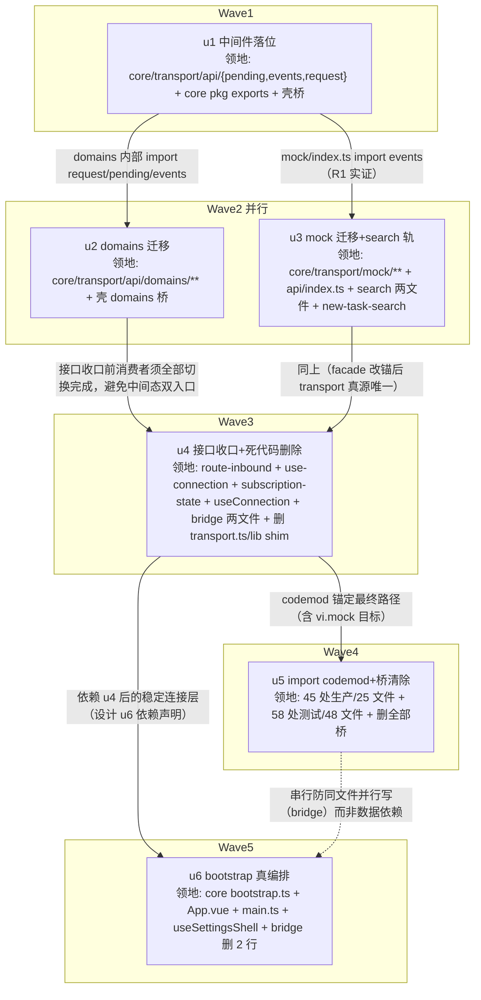

# T&C 收口（tc-transport-consolidation）实施计划

基线: 2da0016d2 | 来源设计: [docs/design/tc-transport-consolidation.md](tc-transport-consolidation.md)（v5） | 日期: 2026-09-02

> 审查证据：来源设计「附录：变更历史」v2–v5 条目——R1（2 must-fix）/ R2（2）/ R3（1）/ R4（**0 must-fix**，判定「v4 可进入实施」），v5 收录 R4 全部修复。无独立旁路报告文件（`.review/` 不存在），以内嵌变更历史为准。

## 0 章节映射

| 内容 | 设计文档实际位置 |
|------|--------------|
| 背景/目标 | §1 背景：被设计的系统是什么 · §2 设计目标（G1–G5 + In-scope / Out-of-scope） |
| 终态/机制 | §5 终态：使用者眼里将是什么样的 · §6 关键决策与权衡（D1–D5）· §7 实现机制 |
| 验收场景表 | §8 验收（§8.2 场景表 A1–A7） |
| 下一层拆分 | §10 下一层拆分（u1–u6 种子）· §9 实施阶段（M0–M5） |
| 待验证检查点 | §11 待验证检查点（5 条） |

所有 subagent task 的设计引用一律从本表坐标取，禁止自猜编号。

## 1 目标快照（逐字摘录）

**一句话结论**（设计开头）：「把滞留 renderer 壳的 api 中间件（events / pending / request / domains / mock，约 5.3k 行）原样下沉 `core/transport`，删除死代码连接入口与 TransportPorts 反向注入接口，让 `bootstrap()` 从零调用的占位变成被 renderer 壳真实调用的五步编排——入站消息从『跨界两次』变『单跨界』，mobile 壳获得可复用的 RPC 层。」

**设计目标**（§2）：G1 seam 收口 · G2 连接语义单一 · G3 extension-host 流量并入 · G4 mock 单一真源 · G5 bootstrap 真编排。

**Out-of-scope**（§2，逐字）：

- mobile 壳对接 core bootstrap（组 3；mobile 自身 TODO 注释亦标注 P1+D2 条件）
- i18n 下沉（组 3）；route-inbound 三结构合一（ROUTE_TABLE/CROSS_SESSION_TYPES/FALLBACK，独立小步）；transport 模块级状态的 taste 治理收编（组 2）；测试语义分流「锚 core / 随壳消亡」（组 2——本波只改测试的 import 路径，不改断言语义）
- `@/api` barrel facade（45 处 `from '@/api'`）的迁移——facade 是壳的 env 装配，留在壳（见 D4）

## 2 单元列表

**中间态桥策略**（本计划层决策，设计 §9「每阶段独立 commit + 验证」的实现前提）：u1–u2 迁移波内，壳原文件降为单行 re-export（`export * from '@xyz-agent/core/…'`）保编译不断；消费者 import 改写集中在 u5 codemod，u5 末删除全部桥文件。终态与设计 §7 壳目标结构一致（`packages/renderer/src/api/` 仅剩 index.ts）。区别于 D1 否决的 B 方案：桥只存在于波内、u5 终态全删，不是交付形态。D1 否决语境是「22 个文件骨架保留到 P6 清尾」的长久 shim。

| Unit | 职责 | 领地（精确文件路径） | 依赖 | 隔离 | 验收条款 |
|------|------|----------------------|------|------|----------|
| **u1** 中间件落位 | pending/events/request 迁 core + core exports 基建 + 壳转桥 + 受影响测试 mock 改锚 | 新增 `packages/core/src/transport/api/{pending,events,request,index}.ts`；新增 `packages/core/src/transport/api/__tests__/{pending,request}.test.ts`（自 `packages/renderer/src/api/__tests__/` 随迁，import 改写）；改 `packages/core/package.json`（exports 预加 `./transport/api`、`./transport/api/domains`、`./transport/mock`、`./transport/ws-client` 四行——中间两行指向 u2/u3 将创建的路径，无人 import 零影响；`./transport/ws-client` 供 renderer 测试 vi.mock 说明符解析）；改 `packages/renderer/src/api/{pending,events,request}.ts` 为单行桥（指向 `@xyz-agent/core/transport/api` barrel，deviation 登记：模块级四段子路径无 exports 条目不可解析）；改 6 个测试文件 mock 目标改锚 core ws-client（`src/__tests__/api/{t4-api-layer,quota-domain,preset-domain,composer-domain}.test.ts`、`src/__tests__/new-task/session-api.test.ts`、`src/__tests__/extension-upgrade.test.ts`——原 vi.mock('@/api/transport') 拦截 request→transport.send 链路，桥化后 request 在 core 内直连 ws-client 失拦截，v2 修订前移自 u4） | 无 | plain | ① `pnpm --filter @xyz-agent/core test` 绿（fake timers 用例在 core vitest 跑通，§11-3 首个实证点）；② `pnpm --filter @xyz-agent/frontend typecheck && pnpm --filter @xyz-agent/frontend test` 绿；③ `git diff` 显示 25 个子路径消费者文件零改动（6 个 mock 改锚测试文件除外，v2 修订） |
| **u2** domains 迁移 | 17 域文件迁 core（内部 import 改 core 相对路径）+ 壳转桥 | 新增 `packages/core/src/transport/api/domains/`（17 文件，1,891 行）；新增 `packages/core/src/transport/api/__tests__/usage-forcequit-domains.test.ts`（随迁）；改 `packages/renderer/src/api/domains/*.ts` 为 17 个单行桥 | u1 | plain | ① core + frontend 双包 typecheck/test 绿；② barrel 消费者（45 处 `from '@/api'`）零改动经桥全通；③ domains 内部对 pending/events/request 的 import 全部为 core 内相对路径 |
| **u3** mock 迁移 + search 轨 | mock 全量迁 core + facade 改锚 + VITE_E2E 参数化 + search 轨条件化 + SearchPorts 可选化 | 新增 `packages/core/src/transport/mock/`（11 文件 2,934 行 + `src/mock/mock-ws.ts` 148 行并入，`import.meta.env.VITE_E2E` 改工厂参数）；改 `packages/renderer/src/api/index.ts`（VITE_MOCK 三元 → core real/mock + VITE_E2E 注入）；删 `packages/renderer/src/api/mock/`（消费者仅 facade 与 search 轨，本单元全部改锚，无需桥）；删 `packages/renderer/src/mock/mock-ws.ts`；改 `packages/renderer/src/composables/features/search/{useSearch.ts,useSearchModalDeps.ts}`（D4-② 顶层静态 import core mock 子路径 + 引用点整体条件化）；改 `packages/core/src/domain/new-task-search/search-ports.ts`（searchMock 必填→可选）；改 `packages/core/src/domain/new-task-search/search.ts`（isMock 分支守卫，失败显式抛错）；改含 searchMock 引用的测试文件（执行期 `grep -rl searchMock packages/renderer/src --include='*.test.ts'` 定位，预计 useSearch.test.ts / useSearchJump.test.ts 等 3 个，类型适配）；改 `packages/core/package.json`（`sideEffects: false`） | u1 | plain | ① frontend typecheck + test 绿（fg1/fg5/fg6 等 mock 行为测试断言不动通过）；② SearchPorts.searchMock 为可选字段且 search.ts 守卫存在；③ 探针门③：`pnpm --filter @xyz-agent/frontend build` 后产物 grep `search-data` / mock fixture 标识串零命中（失败 fallback 动态 import 并复测，设计 §11-1） |
| **u4** 接口收口 + 死代码删除 | TransportPorts 降内部 seam + ConnectionPorts 收窄 + bridge 改锚 + connect()/shim 删除 | 改 `packages/core/src/coordination/route-inbound.ts`（生产直连 transport/api；`configureRouteInbound(ports?)` 可选参数）；改 `packages/core/src/transport/use-connection.ts`（删 pending/events/subscribe 三字段，内部 import）；改 `packages/core/src/coordination/subscription-state.ts`（`Pick<TransportPorts,'subscribe'>` 改直引 core domains/session 签名）；改 core 4 测试（`coordination/route-inbound.test.ts`、`subscription-state.test.ts`、`subscription-replay.test.ts`、`transport/__tests__/ws-client.invariants.test.ts`——构造方式适配，断言不动）；改 `packages/renderer/src/composables/useConnection.ts`（装配瘦身）；改 `packages/renderer/src/composables/shell/useExtensionHostBridge.ts`（:51 getState 改锚 core + :67 transport.send 改锚 core ws-client）；改 `packages/renderer/src/composables/shell/extension-host-dialog.ts`（:25 transport 改锚）；删 `packages/renderer/src/api/transport.ts`；删 `packages/renderer/src/lib/ws-client.ts`；改 5 个 shim 消费测试（`composables/shell/__tests__/useExtensionHostBridge.test.ts`、`__tests__/ws-client-send-boolean.test.ts`、`session-workflow-update-fallback.test.ts`、`session-exited.test.ts`、`session-subagents-fallback.test.ts`）；改剩余含 `vi.mock('@/api/transport')` 的测试文件（u1 v2 修订已前移 6 个，执行期 grep 定位余量） | u2、u3 | plain | ① core + frontend 双包 typecheck/test 绿；② `grep -rn "TransportPorts" packages/renderer/src` 零命中；ConnectionPorts 类型无 pending/events/subscribe 字段；③ `packages/renderer/src/api/transport.ts` 与 `packages/renderer/src/lib/ws-client.ts` 不存在 |
| **u5** import codemod + 桥清除 | 全部子路径消费者改指 core + 删全部桥 | 改生产 45 处/25 文件（`from '@/api/{pending,events,request,domains/*,mock}'` → `@xyz-agent/core` 子路径或 barrel）；改测试 58 处/48 文件同步改写；删 `packages/renderer/src/api/` 下全部桥文件（pending/events/request/domains 17 个 + `__tests__/` 清空后删目录，仅留 index.ts） | u4 | plain | ① A6 回归门：core + frontend 双包 typecheck、双包 test、根 `pnpm lint` 全绿；② `ls packages/renderer/src/api/` 仅 index.ts；③ `grep -rn "from '@/api/" packages/renderer/src` 零命中 |
| **u6** bootstrap 真编排 | initConnection 真实现 + 调用点收敛 + 注册触发去重 | 改 `packages/core/src/bootstrap.ts`（initConnection = `useConnection().init()`；`BootstrapOptions` 删 connectionMode；restoreSessions 保持 core 内 no-op 占位）；改 `packages/renderer/src/App.vue`（onMounted → `bootstrap(...)`，connected 驱动视图初始化保持 :98-105 现状）；改 `packages/renderer/src/main.ts`（`resolvePlatform()` 模块级 memoized 收敛分叉）；改 `packages/renderer/src/composables/shell/useSettingsShell.ts`（删 :65-70 bootstrapSettingsCore 兜底注入）；改 `packages/renderer/src/composables/shell/useExtensionHostBridge.ts`（删 :260-261 两行 `void registerMountPoints()` / `void scanContributions()`，:259 注释随删，:258 setExtensionRegistries 注入保留） | u4 | plain | ① 探针①：`pnpm dev` 实跑，bootstrap 步骤日志含顺序编号、providePlatform 先于连接编排、各步 await 顺序执行、到 connected 全程无 warn；② typecheck/test 绿；③ 若首屏挂载点缺失（§11-5 时序风险）→ fallback 按 §11-5 裁定标准执行（实测订阅注册先于 sendInitialState 首推） |

领地互斥校验：u2 与 u3 同波并行（领地无交集，`packages/core/package.json` 由 u1 预置三行 exports、sideEffects 归 u3 独占）；u4/u5/u6 均触碰 `useExtensionHostBridge.ts` 但分属串行波次（u4 改锚 → u5 codemod 其余 api import → u6 删 2 行注册触发），无并行写冲突。无独立 u-foundation：共享接线点（core package.json exports + api barrel）已并入 u1 独占，u1 即波次根节点。

## 3 DAG 图



波次表：W1[u1] → W2[u2 ∥ u3] → W3[u4] → W4[u5] → W5[u6]。共 5 波，最大并发 2。

## 4 测试策略

命令实证自各包 package.json scripts（2026-09-02）：

**增量（每单元开发循环内）**：

```bash
pnpm --filter @xyz-agent/core typecheck && pnpm --filter @xyz-agent/core test
pnpm --filter @xyz-agent/frontend typecheck && pnpm --filter @xyz-agent/frontend typecheck:test && pnpm --filter @xyz-agent/frontend test
```

**全量（u5 的 A6 门 + 阶段 5 收尾，项目收尾场景）**：

```bash
pnpm test          # 根脚本：packages/* + apps/* + extensions/*
pnpm lint          # 根脚本：eslint . --max-warnings 0
```

**真实场景（阶段 5 Gate B，设计 §8 场景表）**：A1 真实对话流、A2 mock 模式、A3 断连恢复、A4 插件挂载点上报、A5 启动编排（u6 探针）、A7 mock 不进生产包（u3 探针③）。A1/A3 最高优先级。每个场景用真实 app 操作与真实 runtime/mock 进程，不用单测断言替代。

**测试红线**（设计 §8 A6 + AGENTS.md）：renderer 测试断言语义不变（vi.mock 拦截目标重写除外）；core 路由类测试仅构造方式适配、断言不动；vitest 配置在子包 vitest.config.ts，从子包目录运行。

## 5 合理偏差登记表

| # | 单元 | 偏差内容 | 设计锚点 | 状态 |
|---|------|----------|----------|------|
| （空——执行期登记） | | | | |

预登记两条口径差异（非偏差，数字校准）：设计「测试 62 处/50 文件」实测 **58 处/48 文件**（子路径口径，另 barrel 12 处不动）；设计「3 个测试改路径」（lib shim）实测 **5 个测试文件**（useExtensionHostBridge.test / ws-client-send-boolean / session-workflow-update-fallback / session-exited / session-subagents-fallback）。以实测为准执行，不回改设计文档（±4 处属设计期统计与 HEAD 漂移）。

## 6 状态表

| Unit | 状态 | 轮次 | 证据指针 |
|------|------|------|----------|
| u1 | pending | 0 | — |
| u2 | pending | 0 | — |
| u3 | pending | 0 | — |
| u4 | pending | 0 | — |
| u5 | pending | 0 | — |
| u6 | pending | 0 | — |

## 7 残留风险与变更历史

**残留风险**（继承设计 §11 全部 5 条 + 本计划新增 2 条）：

1. 跨包静态分支 DCE（§11-1）：u3 探针门③实证，失败 fallback 动态 import。
2. vi.mock 拦截链路（§11-2）：~~u4 预改 1 个 t4-api-layer 类测试验证后批量~~ **u1 已实证**（v2）：① core 内相对 import 的 vi.mock 拦截**有效**（core request.test.ts 3 用例绿，mock 说明符按测试文件位置解析 `'../../ws-client'`）；② **桥不转发 mock**——vi.mock('@/api/transport') 拦截壳模块，core 内部 import 不受影响（先例坑 session-workflow-update-fallback.test.ts:31 在 u1 提前引爆而非 u4）；③ mock「request→send」链路的测试须改锚 core ws-client（需 exports `./transport/ws-client` 条目）。
3. core vitest 对随迁测试兼容性（§11-3）：u1 即首个实证点（fake timers / domains mock 数据）。
4. core 子路径 exports 在 renderer vite 构建下解析（§11-4）：现状 `.` 入口 166 文件消费风险低，u1 typecheck 即验证。
5. 挂载点/贡献注册触发时序（§11-5）：u6 探针；fallback 自带裁定标准（订阅注册先于 sendInitialState 首推，[HISTORICAL] 竞态不得重开）。
6. **[本计划新增]** exports 预加三行中两行（domains/mock）在 u1 commit 后、u2/u3 落地前指向不存在文件——无人 import 零影响；若期间有第三方 import 该子路径会解析失败（本仓内无此用法，grep 实证）。
7. **[本计划新增]** 临时桥窗口内（u1–u4 期间）存在 core 真源 + 壳桥双文件——设计 D1 否决的是长久 shim，桥窗口最长 3 波且 u5 终态全删；若执行中断于窗口内，状态表如实记录桥存在的事实。

**变更历史**：

- v1：2026-09-02 初版（基于设计 v5 + 领地实证：生产 45 处/25 文件、测试 58 处/48 文件、vi.mock transport 9 处、shim 测试 5 文件、renderer 包名 @xyz-agent/frontend）。
- v2：2026-09-02 u1 首轮 dev 后计划修订：① u1 领地扩入 6 个测试文件（t4-api-layer / quota-domain / preset-domain / composer-domain / session-api / extension-upgrade）的 mock 改锚 + core exports 补 `./transport/ws-client` 行——根因：桥不转发 mock（§7 风险 2 实证），这 6 个测试断言「request→transport.send 被 mock 调用」，桥化后 request 在 core 内直连 ws-client 失拦截，33 用例红；原计划把 mock 改写全放 u4 导致 u1-u4 波次间 frontend test 红，违反「每单元测试绿」纪律；② u4 对应缩减（9 个 vi.mock 测试中 6 个前移）；③ 桥形态 deviation 登记（指向 barrel `@xyz-agent/core/transport/api` 而非模块级子路径——四段子路径无 exports 条目，'@/api/pending' 等入口暂为三模块导出超集，u5 桥删除后消失）。
