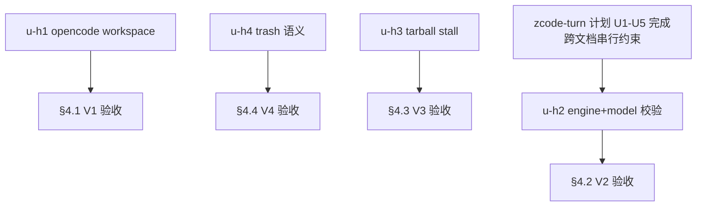

# timeout-audit-hygiene-batch 实施计划

基线: 1646a599a | 来源设计: docs/design/timeout-audit-hygiene-batch.md | 日期: 2026-09-05

## 0 章节映射

| 内容 | 设计文档实际位置 |
|------|------------------|
| 背景/目标 | §1 背景（§1.2 设计目标 G1-G4 + §1.3 Scope） |
| 终态/机制 | §3 解决方案（§3.1-§3.4 四项，各含决策 D1-x/D2-x/D3-x/D4-x） |
| 验收场景表 | §4 验收（§4.1 V1 / §4.2 V2 / §4.3 V3 / §4.4 V4） |
| 下一层拆分 | §5（§5.2 拆分清单 + §5.3 文件改动地图 + §5.4 检查点 + §5.5 探针清单） |
| 待验证检查点 | §5.4（P1-1/P1-2/P2-1/P2-2/P3-1/P4-1 六项）+ §5.5 汇总 |

## 1 目标快照（逐字摘录自设计 §1.2/§1.3）

> 1. **G1（opencode）**：用户配置自己的 opencode 凭证后，看到的额度**只可能是自己账号的数据**；未配置 workspace 时得到明确的「未配置」指引，而不是别人的数字或莫名报错。
> 2. **G2（engine+model）**：agent 派发 subagent 时，`engine` 与 `model` 的任何组合要么成功执行、要么在派发同步期报出**指明引擎与模型不配套**的错误（含目标引擎可用清单与修正动作），绝不出现「校验通过但执行必炸」或「合法派发被误导性拒绝」。「派发」按 §2.2 定义覆盖 **chat 工具与 workflow 两条路径**，两路径同等满足。
> 3. **G3（tarball）**：tarball 服务器中途停发数据时，安装操作在有限时间内**报出可重试的 network 错误**，而不是永久挂死。
> 4. **G4（trash）**：用户删除 session 时，文件**要么进废纸篓要么留在原地报错**——任何系统状态下都不会被静默永久删除。

**Out-of-scope**：附赠发现 #5（归 Doc 3）；opencode 自动发现 API 探测只登记实施期探针不承诺实现；trash 非 macOS 分支保持现状；trash 路径注入硬化独立处理；`<available_zcode_models>` 注入策略（已有用户拍板）只在错误消息侧闭环。

## 2 单元列表

| Unit | 职责 | 领地（精确文件路径） | 依赖 | 隔离 | 验收条款 |
|------|------|---------------------|------|------|---------|
| u-h1-opencode-workspace | shared 协议+类型（`quota.configure` 增 workspace 参数 / `QuotaFetchFailureReason` 增 `not_configured` / `fetchQuota` 第三参数）→ runtime（QuotaService 读写注入 + fetcher URL 拼接 + not_configured）→ renderer（Settings 输入框 + 失败态文案）；URL 归一化两形态（完整 URL / 裸 wrk_ id） | `packages/shared/src/quota-types.ts` · `packages/shared/src/protocol.ts` · `packages/shared/src/provider.ts` `packages/runtime/src/services/quota-service.ts` · `packages/runtime/src/services/quota-providers/opencode.ts` `packages/renderer/src/composables/features/model/useQuotaConfigure.ts` + 对应 Settings 组件 | 无 | plain | §4.1 V1-1~V1-4 |
| u-h2-engine-model-validation | subagent-core：execute() 编排调整（路由先行+按引擎分支）+ EnginePort.validateModel 可选面 + zcode 委托 resolveZcodeModelRef + 错误文案（场景 2/3）+ pi 未命中跨引擎候选 | `packages/subagent-core/src/execution/subagent-service.ts` · `execution/subprocess-agent-runner.ts` · `execution/engine/port.ts` · `execution/engine/engines/zcode/zcode-engine.ts` · `packages/shared/src/model-ref.ts`（或新错误构造） | 无（**跨文档约束：zcode-engine.ts 与 zcode-turn 计划 U2-U5 冲突，排在 zcode 链之后**） | plain | §4.2 V2-1~V2-4 |
| u-h3-tarball-stall-guard | npm-installer.ts downloadAndExtract 单点：stall timer（60s 无进展）+ data 刷新 + destroy + NpmInstallError 包装 | `packages/runtime/src/infra/installers/npm-installer.ts` | 无 | plain | §4.3 V3-1~V3-3 |
| u-h4-trash-no-permanent-delete | trash.ts 降级分支删除 + 结构化错误 + logger；session-message-handler delete case 错误通道核对（P4-1） | `packages/runtime/src/infra/system/trash.ts` · `packages/runtime/src/transport/session-message-handler.ts`（视 P4-1 核实结果） | 无 | plain | §4.4 V4-1~V4-3 |

**实施顺序**：四单元相互独立；合入顺序按设计 §5.1「数据正确性 → 数据丢失 → 挂死 → 派发链路」= u-h1 → u-h4 → u-h3 → u-h2；u-h2 受跨文档领地约束最后派发。

## 3 DAG 图

## 4 测试策略

- **增量**：`cd packages/shared && pnpm test`（u-h1 协议类型）；`cd packages/runtime && pnpm test`（u-h1 quota / u-h3 installer / u-h4 trash）；`cd packages/subagent-core && pnpm test`（u-h2）；`cd packages/renderer && pnpm test`（u-h1 Settings）。
- **Gate B**：V1-V4 真实场景（真实 opencode 凭证 / 双引擎真实派发 / stall 服务器 / Finder 繁忙注入）。
- 探针 §5.5：P1-1/P1-2/P2-1/P2-2/P3-1/P4-1 全部 ⛔ 实施期门，各自带降级路径。

## 5 合理偏差登记表

（初始为空）

## 6 状态表

| Unit | 状态 | 轮次 | 证据指针 |
|------|------|------|---------|
| u-h1-opencode-workspace | committed | 1 | 三层 29 文件同批（Settings 实际在 ui 包，连带文件已登记）；五包测试绿 + V1-3 硬编码 grep 归零 |
| u-h2-engine-model-validation | committed | 1 | 路由先行 + 按引擎校验 + workflow 路径同覆盖；24 测 + 包全量 3100 绿；P2-1 降级未启用（无时序回归）；model-ref 实际路径在 subagent-core/src/shared/ |
| u-h3-tarball-stall-guard | committed | 1 | stall 测试 9/9（真实 TCP 故障注入）+ runtime 主组 4260 绿；P3-1 降级未启用（实测无需） |
| u-h4-trash-no-permanent-delete | committed | 1 | unlink 降级分支删除 6 测 + 错误链中间层修复（授权修复轮：session-store/ports 签名 Promise 化 + 端到端 5 测）；P4-1 收口存在核实 |

## 7 残留风险与变更历史

- 预检证据：设计 v1.3 经 3 轮对抗审查收敛 0 must-fix（`.review/timeout-hygiene-r3.md`：0 MF/1 SG/1 INFO）。
- **跨文档领地冲突（主 agent 编排约束）**：u-h2 的 `execution/engine/engines/zcode/zcode-engine.ts` 与 timeout-zcode-turn 计划 U2/U3/U4/U5 领地重叠——u-h2 排 zcode 链完成后派发。u-h1/u-h3/u-h4 与所有其他计划无交集。
- u-h2 动 subagent 派发主链路编排（P2-1 时序回归风险），回归面最大——其验收 V2-4 三条回归场景是守卫底线。

## 变更历史

- v1（2026-09-05）：初版。用户评审以会话指令「开始规划开发」代替（夜间托管自治态），DAG/单元表随最终汇报呈现。
