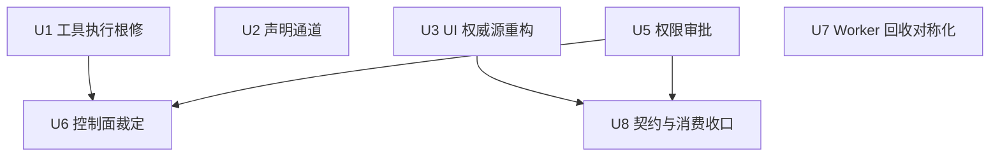

# plugin-service 超时粒度校准 实施计划

基线: <待基线 commit 后回填> | 来源设计: docs/design/timeout-plugin-service-granularity.md | 日期: 2026-09-04

## 0 章节映射

| 内容 | 设计文档实际位置 |
|------|------------------|
| 背景/目标 | §1 背景：被设计的系统是什么 + §2 设计目标（含 In-scope/Out-of-scope） |
| 终态/机制 | §5 终态 + §6 关键决策 D1-D6 + §7 实现机制（文件级改动地图 + 错误规格表） |
| 验收场景表 | §9（V1 / V2 / V3 / V4 / V4b / V5 / V6） |
| 下一层拆分 | §10（U1-U8，v2 合并后 7 单元） |
| 探针清单 | §8（P-1 至 P-13） |
| 待验证检查点 | §11 |

对抗式审查证据：`docs/design/timeout-plugin-service-granularity.review.md`（第 4 轮，must_fix=0, suggestion=0）；第 2 轮代行报告备份 `.review.round2-agent.md`。

## 1 目标快照（逐字摘录自设计 §2）

> 1. **长工具不误杀**：插件作者写一个跑 60s+ 的工具（代码分析、批量处理、子代理调用），pi agent 调用后能拿到真实结果，不被 30s 砍成 `isError`（回溯审计 ❌3）。
> 2. **人不被替答**：用户离开屏幕 5min 回来，插件的 confirm 弹窗还在等他；权限审批弹窗没见他，插件也不会被判「拒绝而卸载」。
> 3. **错误诚实**：任何超时错误都告诉受害者（pi agent / 插件作者 / 用户日志）等了多久、对面发生了什么、怎么调整（声明 `timeoutMs` / 传 `timeout` / 重试）。
> 4. **挂死仍有兜底**：插件 handler 死循环时，pi turn 不会被永久占死——兜底有界、可被插件作者显式 opt-out（规则 19「回收层防挂死兜底允许默认有界」条款）。
> 5. **每个超时有逃生门**：任务级与等人工类超时均可由「最了解对象的一方」（插件作者 / 请求发起方）显式指定；控制面超时保持秒级但留覆盖参数。

**Out-of-scope**（§2）：pi 侧 bridge extension 的 abort/signal 传播（独立缺口另行登记）；无进展检测协议改造；前端弹窗 UI 交互 redesign；permission 扩展请求 `APPROVAL_TIMEOUT` 5min；renderer 侧 65s 默认的结构性守卫（Doc 4/5 范围）。

## 2 单元列表

| Unit | 职责 | 领地（精确文件路径） | 依赖 | 隔离 | 验收条款 |
|------|------|----------------------|------|------|----------|
| U1 | 工具执行根修：`TOOL_EXECUTE_TIMEOUT_MS` → `DEFAULT_TOOL_EXECUTE_TIMEOUT_MS=30_000_000` + `resolveToolTimeoutMs` 纯函数（合法正数/`<=0`或`Infinity`不限时/非法回落/clamp）+ 超时错误消息诚实化（§5.2 文案） | `packages/runtime/src/services/plugin-service/bridge-interop.ts`；测试 `packages/runtime/test/plugin-tool-execution.test.ts`（+同目录新增取值链测试文件可） | 无 | plain | V1；增量单测：取值链全分支 + 迟到回包 miss（P-9） |
| U2 | 声明通道：`ToolRegistration.timeoutMs?: number` 字段 + tool-api 注册入口窄校验（非 number 抛 INVALID_TIMEOUT_MS） | `packages/runtime/src/services/plugin-service/plugin-types.ts`、`packages/runtime/src/services/plugin-service/tool-api.ts`；测试 `packages/runtime/test/plugin-registry.test.ts` | 无（U1 消费字段，缺省回落默认兼容） | plain | V2；增量单测：非法声明 fail-fast / 合法声明透传 |
| U3 | UI 弹窗超时权威源重构：ui-api dialog 三方法 `opts.timeout` + requestId 生成 + effective 直传 + `UI_TIMEOUT` 转译 + cancel notify；ui-request-queue 删语义 timer/替答 → 防泄漏兜底 `min(effective+60_000, MAX_TIMER_DELAY_MS)` + `cancelRequest` + notification handler；shared ServerMessageMap `plugin:uiRequestExpired` 类型。**单 commit 同改**（防中间破碎态） | `packages/runtime/src/services/plugin-service/api/ui-api.ts`、`packages/runtime/src/services/plugin-service/ui-request-queue.ts`、`packages/runtime/src/services/plugin-service/plugin-rpc-server.ts`（如 handler 注册需落此）、`packages/shared/src/**`（ServerMessageMap）；测试 `packages/runtime/test/plugin-ui-dialog.test.ts`、`packages/runtime/test/plugin-rpc.test.ts` | 无 | plain | V3/V4/V4b；增量单测：取值链 / 兜底 min 边界（effective=MAX）/ cancelRequest 幂等 / 排队全程语义 |
| U5 | 权限审批：`PERMISSION_TIMEOUT_MS`→30min + `waitForPermissionApproval` resolve `'timeout'` + `doActivatePlugin` 分流 + `plugin-service.ts` 装配点 env 接线（`XYZ_PLUGIN_PERMISSION_TIMEOUT_MS`，非法 warn 回落）+ `onPermissionRequestExpired` 广播注入 + shared ServerMessageMap `plugin:permissionRequestExpired` 类型 | `packages/runtime/src/services/plugin-service/plugin-activator.ts`、`packages/runtime/src/services/plugin-service/plugin-service.ts`、`packages/shared/src/**`；测试 `packages/runtime/test/`（activator 相关测试文件，实施时定位） | 无 | plain | V5；增量单测：timeout/false 分流 / 迟到批准 noop / env 非法回落 |
| U6 | 控制面裁定：`ActivatorOptions.activateTimeoutMs` 覆盖参数 + `COMMAND_EXECUTE_TIMEOUT_MS` 10s→复用 D1 默认常量 + 命令定义级 `timeoutMs` 声明 + 错误消息诚实化 | `packages/runtime/src/services/plugin-service/plugin-activator.ts`、`packages/runtime/src/services/plugin-service/api/commands-executor.ts`；测试 `packages/runtime/test/` | U1（复用默认常量与取值函数）、U5（同文件 plugin-activator.ts，串行防冲突） | plain | V6③；增量单测：命令声明取值链 / activate 覆盖参数透传 |
| U7 | Worker 回收对称化：`loadPlugin` 超时调 `handleWorkerCrash` + `loadTimeoutMs` 参数（对齐 fork 版）+ hot-reload race timer 句柄修复 | `packages/runtime/src/services/plugin-service/plugin-host.ts`、`packages/runtime/src/services/plugin-service/plugin-hot-reload.ts`；测试 `packages/runtime/test/plugin-host.test.ts` | 无 | plain | V6①②；增量单测：load 超时 → crash 链调用（P-10 前半）/ 幂等守卫 |
| U8 | 契约与消费收口：development-guide 超时契约节（onActivate 轻量 / timeoutMs / opts.timeout / pi abort 不传播已知限制）+ 前端消费两条 expired 广播撤窗（PermissionRequestDialog / usePermissionRequest / uiRequest 弹窗组件） | `docs/extensions/development-guide.md`、`packages/ui/src/extension-host/**`（弹窗组件）、`packages/renderer/src/composables/shell/usePermissionRequest.ts` | U3、U5（类型与广播已存在） | plain | V4/V5 撤窗断言；P-11（旧版前端无异常回退验证） |

**无独立 u-foundation**：共享类型（ServerMessageMap 两条 expired 广播）按设计 §10 v2 决策随 U3/U5 同 commit 落地（类型先行防断言漂移），不设独立类型单元。

**领地重叠说明**：设计 §10 称 U5/U6「可并行」，但两者领地均含 `plugin-activator.ts`——按领地锁定原则串行化（U5 → U6），计划较设计收紧，无功能影响。

## 3 DAG 图

派发批次（并发 ≤3）：
- 批 1：U1、U3、U7（相互独立，覆盖 P0 与独立行为修复）
- 批 2：U2、U5
- 批 3：U6（依赖 U1+U5）
- 批 4：U8（依赖 U3+U5）
- 端到端验收（阶段 5）：V1-V6 全场景 + P-8/P-9/P-10 探针（dev app 全链，环境见 §9 V1 勘误）

## 4 测试策略

**框架**：vitest（项目红线：禁 `node:test`；配置在子包 vitest.config.ts；从子包目录运行；timer 测试用 fake timers）。

- **增量（单元开发期）**：`cd packages/runtime && pnpm test -- test/<相关文件>`；涉 shared 类型时 `cd packages/shared && pnpm typecheck && pnpm test`
- **单元收口**：`cd packages/runtime && pnpm typecheck && pnpm test`（该包全量，防跨文件回归）
- **流水线收尾（阶段 5，全量）**：`cd packages/runtime && pnpm test` + `cd packages/shared && pnpm typecheck && pnpm test` + 根 `pnpm run lint`；真实场景验收 V1-V6 按 §9 表（dev app 全链 / standalone runtime + relay env，见 V1 环境勘误），`XYZ_AGENT_DEBUG=1` 看 `~/.pi/agent/logs/`

## 5 合理偏差登记表

| Unit | 偏差 | 证据（file:line） | 登记时间 |
|------|------|-------------------|----------|
| U1 | opt-out 以 clamp 上界（2^31-1≈24.8 天）近似「不挂 timer」——invoke timeoutMs 必传的客观约束下取「简单者」，设计 §6.1 明示二选一 | bridge-interop.ts:35-57；plugin-rpc-server.ts:142 | 2026-09-04 实施期 |
| U1/U6 | formatDurationMs 双份 + declaredActive 内联复制 isDeclaredTimeoutActive 语义（假差异，语义同构）——收敛建议：后续清理 commit 从 bridge-interop 统一导出 | bridge-interop.ts:33-66；commands-executor.ts:17-21/83 | 2026-09-04 A1 审查 |
| U1 | 迟到回包 miss 为静默安全 noop（无 debug 日志）——设计正文已同步为如实描述（v2.2 勘误②+A1 doc_error 修正），日志补点留后续 | plugin-rpc-server.ts:164-169；pending-tracker.ts:55-73 | 2026-09-04 A1 审查 |
| U3 | production 接线授权扩展 plugin-rpc-setup.ts + plugin-service.ts（cancelUiRequest/meta 透传）——单一权威生产生效必需 | plugin-rpc-setup.ts；plugin-service.ts | 2026-09-04 实施期 |
| U3 | plugin-permission-map.ts SSOT 登记 +1（ui 域 5→6）——守卫强制（新增 RPC 方法必须登记否则全量红） | plugin-permission-map.ts；plugin-permission-map.test.ts | 2026-09-04 实施期 |
| U3/U8 | expired 广播不经 core MessageBusBridge（bridge 无归一项），消费侧直订 WS onGlobal（沿 extension.ui_timeout 先例）——副作用：bridge 对 unknown type 各 emit 一条 bus error → console.warn（无用户可见异常，P-11 成立）；core 补归一为后续跟进项 | usePermissionRequest.ts；extension-host-dialog.ts；notification-host-controller.ts:97-99 | 2026-09-04 U8 |
| U6 | commands-api.ts 越界最小追加（命令定义类型实际所在地，任务预判 plugin-types.ts 不适用）——声明链验收必需，A1 审查追认 | commands-api.ts:64-97/155-170 | 2026-09-04 U6/A1 |
| U6 | busy 提示按 v1.1 S1 规格落地（WeakMap 记录 register 时刻） | commands-executor.ts:88-96/176-180 | 2026-09-04 U6 |
| U7 | loadTimeoutMs 落地为构造选项（fork 版 PluginPoolOptions 逐字同构）而非方法参数；race timer 清理用 finally 超集覆盖 deactivate 抛错路径 | plugin-host.ts；plugin-host-process.ts:102/123 | 2026-09-04 U7 |
| U8 | 权限撤窗按 pluginId 严格匹配（防陈旧广播误撤后到插件的新弹窗）——任务描述的幂等严格化 | usePermissionRequest.ts | 2026-09-04 U8 |
| U8 | development-guide 契约节落位 §11.5（保护外部锚点 #22 不断链） | development-guide.md:1104+ | 2026-09-04 U8 |
| U5 | ACTIVATING 作废检查先于 'timeout' 分流（作废激活不发 expired 广播，弹窗命运归接管方）——设计条款 2 未细分的正确实现 | plugin-activator.ts:266-269；plugin-permission-timeout.test.ts d1/d2 | 2026-09-04 A2 |
| U3 | 排队项兜底收尾（expireFallback 含 queued 分支）——cancel 丢失形态下 V4b 排队场景也封闭，设计条款 4 未细列 | ui-request-queue.ts:170-194 | 2026-09-04 A2 |
| U3 | uiRequestExpired handler 双防御（缺 requestId warn 丢弃 / 未接线 warn 退化兜底）——失败要出声 | ui-api.ts:197-215 | 2026-09-04 A2 |
| U3 | 重复 id 防御保持 JSON-RPC error.code 线协议形状（throw 纯 Error → INTERNAL_ERROR 回包） | ui-request-queue.ts:96-103 | 2026-09-04 A2 |
| U3 | 生产装配全链回归测试（真实 PluginService + advanceTimersByTimeAsync 防兜底抢跑竞速失真） | plugin-ui-timeout-authority.test.ts:388-472 | 2026-09-04 A2 |
| U7 | loadPlugin 超时错误消息诚实化超出设计要求（时长 + loadTimeoutMs 指引，落实 §2 目标 3）；loadTimeoutMs 为宿主装配选项不进插件契约节，文档落位正确 | plugin-host.ts:397-409 | 2026-09-04 A3 |
| U8 | requestIdSessions 反查表「撤窗命中才删」生命周期——requestId 全局唯一保证残留无误命中；卫生建议：respond 出队可顺手删表项（非必须） | extension-host-dialog.ts:130-153 | 2026-09-04 A3 |
| U7 | P-10 检查点证据链双载体（注释推演 + 测试断言）可回溯 | plugin-host.ts:398-405；plugin-host.test.ts | 2026-09-04 A3 |

**A1-low 修复记录**：development-guide §11.5 缺命令 timeoutMs 契约行（unreasonable，low）——由主 agent 亲为补齐（文档一行补丁，命令节 + busy 说明），未打回 U8（额度受限期务实选择，动作同 doc 处理路径）。

## 6 状态表

| Unit | 状态 | 轮次 | 证据指针 |
|------|------|------|----------|
| U1 | committed | 2 | 15c772474；20 tests 绿，typecheck 零错误；常量裁决 30min（设计 v2.2 勘误联动）+ opt-out clamp 近似 + guard helper（U2 落地后可简化）均登记 |
| U2 | committed | 1 | c61095d3a；20 用例绿 + 全量 4220 绿 + typecheck 零错误；plugin-sdk types.ts 生成物同步已追认（sync 脚本机械产物，SSOT 在领地内）；guard 简化建议转 U1 agent 执行 |
| U3 | committed | 2 | 7ac323b5f；34 targeted + 4211 全量绿，typecheck 零错误；越界联动（permission-map SSOT 守卫）已追认登记；生产装配接线（plugin-rpc-setup + plugin-service.ts 1 行）授权扩展完成；SDK 类型面 opts 并入 U8（blockers 转移） |
| U5 | committed | 1 | ac00daa7f；27 targeted + 4229 全量 + shared 226 绿，typecheck/eslint 零错误；§11 env 白名单检查点闭环（入站 XYZ_ 前缀已放行 + 出站不注入）；env 先例位置校正登记（subagent-core lifecycle-manager.ts:57-79） |
| U6 | committed | 1 | 6b6ebe047；70 targeted + plugin 套件 579 + 全量绿（A1-A33 PASS），typecheck/eslint 零错误；commands-api.ts 越界已追认（命令类型实际所在地，声明链验收必需）；busy 提示（v1.1 S1）落地；formatDurationMs 本地复制与 warning 与 U1 基线同款（收敛建议登记） |
| U7 | committed | 1 | a618c114f；plugin-host+plugin-hot-reload 23 tests 绿，全量 4182 绿，typecheck 零错误；P-10 实测入口 status=active 无需兜底（deviation 登记） |
| U8 | committed | 1 | e90bd960c；renderer 19 + ui 22 targeted、ui 557 / renderer 3670 套件绿，runtime/ui/renderer typecheck 零错误；expired 广播 sid 反查表与 onGlobal 通道偏差登记；plugin-sdk/mock.ts 存量 tsc 错误 2 处为流水线前遗留（残留风险登记） |

## 7 残留风险与变更历史

- §11 检查点闭环情况：P-8/P-9 **blocked**（端到端通路依赖 bridge extension，实测其与 pi 0.84.4 实装不兼容——export 形态旧 + `extension_ui_request` 不在 pi 0.84 UI context，插件工具经 pi 调用链路产品级不可达；**区间外既有缺口**，bridge/index.ts 在 7650690ac..HEAD 零改动；runtime 侧 D1 语义由 U1 单测 20 例 + 实读核实覆盖）；P-10 **已闭环**（入口 status=active 守卫满足 + E2E 三轮 rebuild 后同宿主插件自动重载恢复 ACTIVE + 工具重注册）；D2 幂等单测已覆盖含 effective=MAX 边界；env 白名单无需登记（入站 XYZ_ 前缀放行 + 出站不注入）。
- **跟进项（本流水线范围外）**：①**bridge extension 重写适配 pi 0.84**（产品级：factory 形态 + UI context 无自定义 method 透传——插件工具经 pi 调用链路恢复的前提，V1/V2/P-8/P-9 端到端验收依赖此项）；②packages/plugin-sdk/src/mock.ts 存量 tsc 错误 2 处（w1 时期签名漂移，非本流水线引入）；③core MessageBusBridge 对两条 expired 广播补归一（当前 console.warn 噪音，无用户可见异常）；④formatDurationMs/isDeclaredTimeoutActive 已统一导出（Gate A 修复落地），MAX_TIMER_DELAY_MS 双份（bridge-interop 模块私有/ui-api 导出，同值平台常量）可并入同批收敛；⑤sandbox 插件命令 invokeResult 一次疑似未闭环（Gate B 观察到一次，trusted 正常，独立于超时逻辑，待查）；⑥W3 crashCounts 衰减快照比对在连续崩溃耗尽重试后不收敛（exceeded 成不可逆终态）——crash-rebuild 既有机制，与超时修复无关。
- **Gate B 环境与口径说明**：dev app 全链被并行会话占用，采用设计 §9 V1 勘误的备选环境（standalone runtime :3311 + 隔离数据目录 + WS 直连 + runtime spawn pi binary）；前端缺席场景「用户点击」由同协议 WS 命令承载、撤窗断言降级为 expired 广播发出 + U8 单测佐证；V3/V5 含 5min/10min 真实等待（无加速）。含 hang-load 的宿主 rebuild 后 load 阶段被同批死循环再次连坐属固有杀伤半径（plugin-bootstrap 消息并发处理），ACTIVE restored 终态由 TDD full-chain 单测 + crasher 形态 E2E 补全覆盖。

## 变更历史

- v1.3（2026-09-04）：阶段 5 双级验收完成。**Gate A 绿**：4 包 5702 用例全绿 + typecheck 四包零错误 + 根 lint exit 0（修复 1dad3ce65：命名时间常量 + formatDurationMs/isDeclaredTimeoutActive 统一导出，登记表假差异收敛同批落地）+ 零 skip/零 SKIP_ + 覆盖矩阵 7 单元全认领。**Gate B 绿**（含 1 轮失败回流）：V3/V4/V4b/V5/V6①③ pass（真实等待 5min/9min37s/45s，无加速）；V6② 首轮 fail（load 超时连坐后同宿主插件状态被激活失败终态覆盖为 UNLOADED，rebuild 不重载——U7 引入回归）→ 修复 08dc7b4e1（settleActivationFailure CRASHED 让位，TDD 三连坐路径）→ 真实环境复验 pass（skip reload 0 次 + 重载自动发起 + crasher 形态 3 轮 rebuild 恢复弧线）；V1/V2/P-8/P-9 blocked 登记（bridge 与 pi 0.84 既有断裂，见残留风险①）。
- v1.2（2026-09-04）：阶段 3 A2/A3 区审查结论处理——0 doc_errors；3 low（sandbox cancel 触发场景入错误规格表【主 agent 亲改】、V5 重触发链路直接单测【已补】、UiDialogOptions import 收敛【已落地】）全清零 commit c5a862246；reasonable ×9 入登记表；Gate A lint 失败回流修复 1dad3ce65。
- v2.2（2026-09-04）：实施期勘误登记（与设计文档 v2.2 同步；dev-flow U1 发现）：§6.1 常量字面 30_000_000（500min）系设计初稿笔误，裁决收敛 1_800_000（30min）——U1 代码与测试已同步；登记实施偏差：opt-out clamp 近似、迟到回包静默 noop（debug 补点待后续）、U3 生产装配接线授权扩展（plugin-rpc-setup.ts / plugin-service.ts）。实质明细已并入本表 §5 登记表对应行。
- v1.1（2026-09-04）：阶段 3 A1 区审查结论处理——reasonable×4 入登记表；A1-low（development-guide 缺命令 timeoutMs 契约行）主 agent 亲为补齐；A1 doc_error（迟到回包 debug 日志）设计正文已修正。A2/A3 区审查因 5h 额度上限中断，待 18:54 额度重置后重派。
- v1（2026-09-04）：初版。单元表派生自设计 §10（U1-U8）；U5/U6 因领地重叠（plugin-activator.ts）串行化，较设计收紧。
