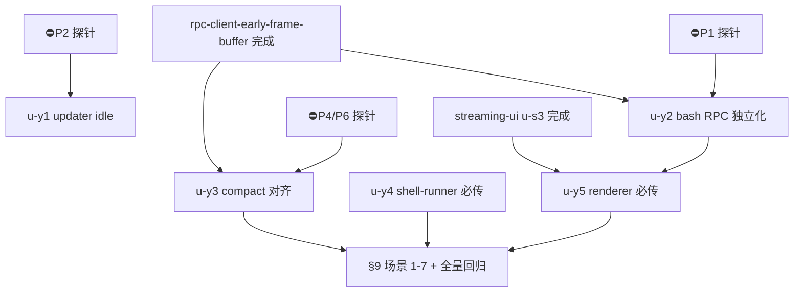

# timeout-slow-flow-wallclock 实施计划

基线: 1646a599a | 来源设计: docs/design/timeout-slow-flow-wallclock.md | 日期: 2026-09-05

## 0 章节映射

| 内容 | 设计文档实际位置 |
|------|------------------|
| 背景/目标 | §1 背景（四条慢速链路）+ §2 设计目标（G1-G5 + In/Out-of-scope） |
| 终态/机制 | §5 终态 · §6 关键决策 D1-D5 + 决策总览 · §7 实现机制（文件级改动地图 + 错误规格表） |
| 验收场景表 | §9 验收（场景 1-7） |
| 下一层拆分 | §10 下一层拆分（U1-U5 + 实施路径 M1-M4） |
| 待验证检查点 | §8 探针清单（P1/P2/P3/P4/P6）+ §11 登记项 |

## 1 目标快照（逐字摘录自设计 §2）

> **改造后使用者（含未来开发者）能做到以下五件事：**

1. **G1（慢网络更新）**：只要下载还在传字节，无论多慢都不被杀；拔网/卡死后 30s 内得到明确失败与续传指引。
2. **G2（长命令）**：`!` 前缀执行 >5min 的合法命令（构建/测试套件）结果不丢；超过兜底上限时错误消息诚实告知「命令仍在运行、如何取消、去哪找回结果」。**边界声明**：诚实告知承诺在默认配置下成立；env 逃生门（runtime >3660s 或 0）下 renderer 3660s backstop 先到时为失败 toast——已知接受。
3. **G3（大 session 压缩）**：大 session 压缩不被 xyz 双端误杀；renderer 恒不先于 runtime 判死（结构保证）。**边界声明**：压缩 LLM 调用受底层 provider SDK 默认 10min HTTP 墙钟约束（smart-context D13-5 已知缺口，另立任务），本设计不承诺突破该层。
4. **G4（worktree setup）**：超时由用户配置值唯一决定；infra 层不再有隐藏 2min 墙钟。
5. **G5（开发者）**：新增 RPC 命令忘记声明超时 → 编译期报错。

**Out-of-scope**：streaming UI 600s（Doc 2）；zcode 300s / settled-watchdog（Doc 1）；插件工具 30s（Doc 3）；附赠发现 #1-4（Doc 5）；handoff 三层校准链迁移；smart-context SDK 10min 墙。

## 2 单元列表

| Unit | 职责 | 领地（精确文件路径） | 依赖 | 隔离 | 验收条款 |
|------|------|---------------------|------|------|---------|
| u-y1-updater-idle | D1 全部：curl/undici 删总钟 + 单段 idle 前移（fetch 前）+ per-part 只删钟（idle 本在 fetch 前）+ 注释联动（⛔P2 探针门先行） | updater/download 双侧文件（设计 §7 文件地图：download-asset.ts · curl-download.ts 所在 main 进程目录） | ⛔P2 | plain | §9 场景 1/2 |
| u-y2-bash-rpc-independence | D2 全部：shared 新增 `BASH_RPC_TIMEOUT_MS = 3_600_000` + runtime rpc-client import（:700 bash() 改用 + env `XYZ_RUNTIME_BASH_RPC_TIMEOUT_MS` 0=不限时）+ dispatcher 合成终态诚实文案 + ①b toast 抑制（**极性：getExecutingBash 为空→抑制；非空→不抑制**）；apply-entry-equivalence 回归同批跑（⛔P1 先行） | `packages/shared/src/`（常量落点实施时裁决 protocol.ts vs 新 timeouts.ts）· `packages/runtime/src/infra/pi/rpc-client.ts` · `message-dispatcher.ts` · `packages/core/src/domain/chat/useChat.ts`（:623-632 catch ①b） | ⛔P1；**跨文档：rpc-client.ts 需 rpc-client-early-frame-buffer 计划 u-r1/u-r2 完成后派发** | plain | §9 场景 3/4 |
| u-y3-compact-align | D3 全部：shared `COMPACT_RPC_TIMEOUT_MS`（30min）+ `RENDERER_RPC_MARGIN_MS` + 双端替换（rpc-client compact 回归自有常量 + renderer chat.ts 补参） | `packages/shared/src/` · `packages/runtime/src/infra/pi/rpc-client.ts` · `packages/renderer/src/api/domains/chat.ts` | ⛔P4/P6；同 u-y2 的 rpc-client.ts 串行约束 | plain | §9 场景 5 |
| u-y4-shell-runner-required | D4：shell-runner timeout 改 port 层必传（编译期拦截）+ infra 删内置 120s + 测试补参 | shell-runner port/infra 文件（设计 §7 文件地图） | 无 | plain | §9 场景 6（前半用户值生效 + 后半漏传编译拦截） |
| u-y5-renderer-required | D5：pending/request 超时改必传 + 具名 backstop 常量 + ~50 调用点补参 + message.bash 语义化取值（BASH_RPC_TIMEOUT_MS + MARGIN） | `packages/renderer/src/api/`（pending.ts · request.ts · domains/** ~50 点） | u-y2（shared 常量就位）；**跨文档：chat.ts/useChat.ts 与 streaming-ui 链错开（u-s3 完成后派发）** | plain | §9 场景 3/7 + 全量 typecheck |

**实施路径**（设计 §10）：M1 = P2 + u-y1 → M2 = P1 + u-y2 → M3 = P4/P6 + u-y3 → M4 = u-y4 + u-y5 + 全量回归。

## 3 DAG 图

## 4 测试策略

- **增量**：`cd packages/shared && pnpm test`（常量）；`cd packages/runtime && pnpm test`（rpc-client/dispatcher；**`test:equivalence`（apply-entry-equivalence）在 u-y2 同批必跑**）；`cd packages/core && pnpm test`（useChat ①b）；`cd packages/renderer && pnpm test`（api 补参）。
- **Gate B（§9 场景 1-7）**：真实慢速下载（限速代理）/ 真实长 bash（env 缩样 + 一次全时长抽样）/ 真实大 session 压缩（构造边界 300-600s）/ worktree 真实 setup。
- M4 全量回归：typecheck + apply-entry-equivalence + electron 打包三阶段验证（update 代码属 main 进程：preflight→build→postbuild）。

## 5 合理偏差登记表

| # | 偏差 | 理由（u-y2 实施裁决） |
|---|------|----------------------|
| 1 | shared 常量落点 = **新 `timeouts.ts`**（非 protocol.ts） | 设计 §7 显式留给实施裁决。protocol.ts 是 wire 形状 SSOT（纯类型 + 守卫），RPC 超时校准链是运行时值域——「协议长什么样」与「各层等多久」为真差异；u-y3 的 COMPACT+MARGIN 将落同文件，校准链关系单文件可审 |
| 2 | 任务描述领地路径勘误：`message-dispatcher.ts` 实际在 `packages/runtime/src/services/session/` | 设计 §7 文件地图同路径；任务领地段写的 `packages/runtime/src/transport/` 是笔误（transport/ 下是 session-message-handler.ts，本单元未改动它）。文件本身在领地内 |
| 3 | 诚实文案不含设计样例 `👉` Emoji + 时长动态格式化 | 项目规范禁止 Emoji（AGENTS.md 前端编码规范 / 全局输出习惯）；文案用 `RpcTimeoutError.timeoutMs` 动态构造（「1 小时」/「90 秒」等），env 缩样时如实反映实际等待上限，比样例固定「1 小时」更诚实（§7 错误规格表「bash >1h（env 可调）」口径） |
| 4 | `sendCommand` 增设 timeout ≤ 0 = 不限时不挂 timer 分支（`pending.timer` 类型放宽 `| undefined`） | 设计只定「env 0=不限时」语义未定实现载体；`setTimeout(fn, 0)` 立即触发故必须显式分支。默认值与其余命令行为不变，`clearTimeout(undefined)` 为 no-op，resolve/reject 路径天然安全 |
| 5 | dispatcher 超时分支仍广播 `message.error`（技术性 errMsg 进对话流） | 设计 D2 只要求合成终态 output 换诚实文案；`message.error` 是既有诊断通道（含 timeoutMs 数值可追溯），保留为最小 diff。气泡诚实文案（权威面）+ 对话流技术行不矛盾 |
| 6 | useChat ①b 抑制的边界形态登记：命令从未到达 runtime（WS 断连 `code='disconnected'`）时 `getExecutingBash` 从未置位 → 按极性「为空→抑制」不弹失败 toast | r4 权威表述的字面结论，设计未显式讨论该形态；断连态有 use-connection 重连指示兜底，非静默无反馈。发生率低（发送时 WS 已断），如需区分「终态已到」与「从未开始」需新增标志位，超出本单元 scope |
| 7 | P1 探针形态补强：空 session 直接 bash RPC 落盘断言不成立（pi 延迟写入门：`_persist` 无 assistant 消息前一切 entry 只留内存，pi 0.84.4 dist session-manager.js:726-738）→ 探针改为预置含 assistant 历史的 session + switch_session | 真实 composer 场景（`!` 前必有对话历史）天然越过该门，P1 假设实测成立；该门是 pi 既有行为非 D2 引入，首条 assistant 消息到达时 fileEntries 全量补写，entry 不丢 |
| 8 | 修复轮：renderer 测试领地临时扩入 `src/__tests__/composables/useChat-bash.test.ts`（u-s2 完成后归 u-y2 收尾）——T5 按新行为改写（终态已收→toast 抑制）+ 新增 T5b 反形态（backstop 先到→toast 被调），并同批回补 core useChat.test.ts 无 renderer 行为面的缺口 | ①b 改变了 renderer 既有 T5 断言的行为前提；任务授权领地扩入。路径勘误：实际在 `__tests__/composables/` 子目录（任务描述少一层） |

## 6 状态表

| Unit | 状态 | 轮次 | 证据指针 |
|------|------|------|---------|
| u-y1-updater-idle | committed | 1 | P2 探针余量 32.3x 走正常路径（idle 前移）；main 全量 741 绿；upgrade-fetch 注释联动（授权修复轮）；types.ts UI 文案留 design-code-sync 裁决 |
| u-y2-bash-rpc-independence | committed | 1 | ⛔P1 探针 PASS（runtime 放弃等待后 pi 照常落盘，迟到响应恢复出口成立）；equivalence 两轮绿；T5 修复轮（①b 行为面断言 T5 改写 + T5b 反形态）；commit cf943ccd9 |
| u-y3-compact-align | committed | 1 | ⛔P4 探针 PASS（真实 compact 178k tokens 9.5s = 189 倍余量；缩样 SIGSTOP 双端时序 B1/B2/B3 全 true）；三包全量绿；commit d7fd9728e |
| u-y4-shell-runner-required | committed | 1 | 编译拦截验证 + 唯一生产调用点已显式传参零破坏；用户值生效测试 |
| u-y5-renderer-required | committed | 1 | 149 调用点（147 补参 backstop + 2 核对跳过）+ bash 语义化 3660s（设计归本单元）；编译拦截验证；renderer 3695 绿 |

## 7 残留风险与变更历史

- 预检证据：设计 v1.4 经 4 轮对抗审查收敛（r4 报告 1 MF/1 SG，修复已在 v1.4 落地并经主 agent 行级核对——MF 极性修正与处方逐字对齐、SG 补包路径 commit e6d5ae1a5；决策骨架四轮无新攻击面）。
- **跨文档领地冲突（主 agent 编排约束）**：① `rpc-client.ts` 与 rpc-client-early-frame-buffer 计划冲突（u-y2/u-y3 排后）；② renderer/core `chat.ts`/`useChat.ts` 与 streaming-ui 计划交叠（u-y5 排 streaming-ui u-s3 后）。
- ⛔ 探针门 P1/P2/P4/P6 全部实施期必跑，降级路径见 §8。
- shared 常量落点（protocol.ts vs 新 timeouts.ts）设计显式留给实施裁决，落定后回写 §7 登记表。

## 变更历史

- v1（2026-09-05）：初版。用户评审以会话指令「开始规划开发」代替（夜间托管自治态），DAG/单元表随最终汇报呈现。
