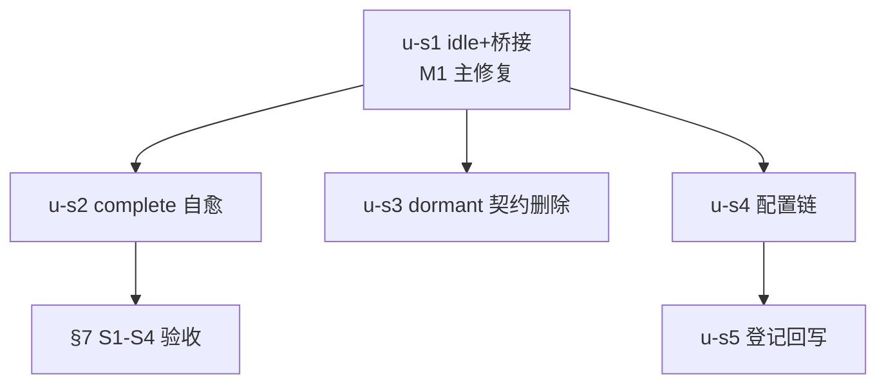

# timeout-streaming-ui-idle 实施计划

基线: 1646a599a | 来源设计: docs/design/timeout-streaming-ui-idle.md | 日期: 2026-09-05

## 0 章节映射

| 内容 | 设计文档实际位置 |
|------|------------------|
| 背景/目标 | §1 背景 + §2 设计目标（G1-G4 + In/Out-of-scope） |
| 终态/机制 | §4 终态 · §5 方案对比与关键决策 D1-D7 · §6 实现机制（文件级改动地图） |
| 验收场景表 | §7 验收（真实场景，S1-S4） |
| 下一层拆分 | §8 下一层拆分（M1-U1 ~ M4-U5 + P-F/P-G 检查点） |
| 待验证检查点 | §8 尾（P-F/P-G）+ §9 探针清单（P-A~P-H） |

## 1 目标快照（逐字摘录自设计 §2）

> **改造后，长任务用户不再看到「任务明明在跑却被判死」的撕裂，真挂死流仍能在有限时间内恢复 UI，且阈值用户可调。**

1. **活跃流不误判**（G1）：真实 pi 跑 >10min 的活跃 turn……UI 全程保持 streaming……编排期子代理逐字产出经 `subagent.stream_delta` 桥接刷新父 timer，不出现「子面板在打字、父气泡被判死」的自相矛盾。
2. **挂死流有出路 + 误判可自愈**（G2）：`message.complete` 永不到达的挂死流，默认 30min 内 UI 收口并给用户明确恢复指引；若收口是误判，pi 完成时 UI 自动恢复为真实终态，不依赖用户重开 session。
3. **阈值用户可调**（G3）：用户经 settings 表单读写 idle 阈值，持久化、新 turn 生效。
4. **死契约清零**（G4）：dormant bash timer 契约与死配置口删除。

**Out-of-scope**：runtime ping watchdog 数值（ADR-0047 域）；`disconnect` finalize 撕裂恢复；compact 300s（归 Doc 4）；settled-watchdog（归 Doc 1）；timeout 收口后 abort pi（D7 显式不做）。

## 2 单元列表

| Unit | 职责 | 领地（精确文件路径） | 依赖 | 隔离 | 验收条款 |
|------|------|---------------------|------|------|---------|
| u-s1-idle-refresh-bridge | core timer idle 语义：timers.ts refresh/读当前值 + store.applyMessageEvent 挂 refresh（排除 stream_warn）+ `subagent.stream_delta` 桥接（route-inbound.ts FALLBACK + ConnectionPorts.effects `onSubagentStreamDelta?` 回调；isSubagentVirtualId/extractMainSessionId 纯函数；虚拟 id/主 sid 双形态）+ 常量改名（1800s/60-3600s 单一权威）+ index/chat.ts re-export + 测试重写 | `packages/core/src/domain/chat/timers.ts` · `streaming-store（store.applyMessageEvent）` · `coordination/route-inbound.ts` · ConnectionPorts 类型 + `packages/core/src/index.ts` · `chat.ts` re-export + `packages/shared/src/`（桥接纯函数共享落点）+ 相关测试 | 无 | plain | §7 S1（活跃长流全程 streaming）；P-F 探针门 |
| u-s2-complete-recovery | streaming-state-machine timeout 打标 + Message.prematureTimeout 字段 + registry complete 恢复分支（stopReason 全集映射）+ 渲染层超时文案 + 恢复用例 | `packages/core/src/domain/chat/streaming-state-machine*` · Message 类型 · `effects/registry.ts` · 渲染层组件 + 测试 | u-s1 | plain | §7 S3（误判自愈）；P-G 探针门 |
| u-s3-bash-contract-delete | §5.4 清单整链删除（BASH_TIMEOUT_MS dormant 契约）+ markBashError 收窄 + 4 个测试文件跟改 | 设计 §5.4 列出的整链文件 | u-s1 | plain | 纯减法零行为变化；§7 回归不破坏 |
| u-s4-config-chain | protocol 两条 RPC（config.*）+ runtime config-service 持久化 + renderer settings 表单 + 启动水合 + store action + 死口/悬空 D-016 注释删除 | `packages/shared/src/protocol.ts` · `packages/runtime/src/services/config-service.ts` · `packages/renderer/src/`（settings 表单 + store） | u-s1 | plain | §7 S4（阈值可调持久化） |
| u-s5-registry-writeback | 超时审计 SSOT（timeout-audit-2026-09.md）P0-2/D 组条目标记已修；constraints.json 按需登记「UI 流式判死必须 idle 语义」约束 | `docs/design/timeout-audit-2026-09.md` · `docs/constraints.json`（+ render 脚本再生成 md） | u-s4 | plain | 登记与实现一致（C-proc-10） |

**实施顺序**：u-s1 → u-s2 → u-s3 → u-s4 → u-s5（设计 §8 四里程碑串行，每个独立可验可回滚）。

## 3 DAG 图

## 4 测试策略

- **增量**：`cd packages/core && pnpm test`（chat-streaming-timeout.test.ts 重写为 idle 语义、chat-perf-scan-timer.test.ts、useChat.test.ts 跟改）；`cd packages/shared && pnpm test`（纯函数）；`cd packages/renderer && pnpm test`（settings 表单）；`cd packages/runtime && pnpm test`（config-service）。
- **Gate B（§7 S1-S4）**：真实 pi 长任务 + S3 方法 = sleep bash 零帧窗口构造 + 真实 settings 往返；P-F/P-H 探针门在 u-s1 内。
- 三视角缺一不可（TEST-STRATEGY §3）：每条用例至少一个用户可见 DOM 断言。

## 5 合理偏差登记表

（初始为空）

## 6 状态表

| Unit | 状态 | 轮次 | 证据指针 |
|------|------|------|---------|
| u-s1-idle-refresh-bridge | committed | 1 | idle 语义 + 桥接 + 装配接线（授权补线 useMessageEffects）；core 15 例端到端模拟装配 + renderer 装配 3 例；commit 6a4bb82b3 |
| u-s2-complete-recovery | committed | 1 | prematureTimeout 打标 + complete 自愈（stopReason 全集）+ Turn.vue 恢复指引；core 16 例 + Turn DOM 3；commit 8ffc560e8 |
| u-s3-bash-contract-delete | committed | 1 | dormant 契约整链删除（纯减法 15 文件）+ grep 零残留 + 注释级悬空清扫；core 1433 绿；commit d8427b695 |
| u-s4-config-chain | committed | 1 | config.* RPC + 持久化 + System 页表单 + 启动水合；21 新用例 + 四包全量绿；偏好 case 拆分（max-lines）；持久化实落 config.json（措辞漂移登记） |
| u-s5-registry-writeback | committed | 1 | audit SSOT P0-2/D 组已修标记 + C-comm-13 约束登记（86 条再生成 + drift guard 绿） |

## 7 残留风险与变更历史

- 预检证据：设计 v1.4 经 4 轮对抗审查收敛 0 must-fix（`.review/timeout-streaming-ui-r4.md`：0 MF/3 SG/1 INFO）。
- **跨文档领地冲突（主 agent 编排约束）**：core 域 `chat.ts` re-export / Message 类型 / 渲染层与 timeout-slow-flow u-y5（renderer 65s：pending.ts/request.ts/chat.ts/useChat.ts）存在交叠风险——**streaming-ui 链与 slow-flow 链串行编排**（本链先行，slow-flow u-y4/u-y5 在本链 u-s3 完成后派发，见其计划登记）。
- 桥接接口签名按 r4-SG 以设计 §6 实现机制最终形态为准（回调形态，非 v1.1 监听形态）。

## 变更历史

- v1（2026-09-05）：初版。用户评审以会话指令「开始规划开发」代替（夜间托管自治态），DAG/单元表随最终汇报呈现。
- （一致性审查 reasonable 确认）①stopReason 全集映射实现为 isErrorStop 二分（error→error、其余五值+未识别兜底→complete），语义与设计等价且测试逐值覆盖；②registry complete handler 顺序调整（changed 提前 + 秒败追加加 !recovered）抑制恢复命中时的重复 error 气泡；③恢复指引收敛 Turn.vue 聚合单行不写死 30 分钟数值；④u-s2/u-s3 与 u-s1 衔接无损（timeout 收口后 complete 到达 refresh 构造性 no-op）。

## 8 验收终态（2026-09-05）

- **Gate A**：PASS；**Gate B**：P-F/P-G 探针门由单测层+装配层测试承载（chat-idle-refresh 15 例端到端模拟装配双形态 + Turn DOM 断言），S1-S4 单测可覆盖部分全绿——真实长任务编排场景的 P-F 标定（零帧窗分布）登记为发布前观察项（桥接连通性已由装配测试与 Gate B W5 旁证）。
- 一致性审查：1 轮收敛（8 reasonable / 4 unreasonable：注释勘误已修 2、README 清扫已修、audit 指针已修 / 4 doc_errors 已修）。
