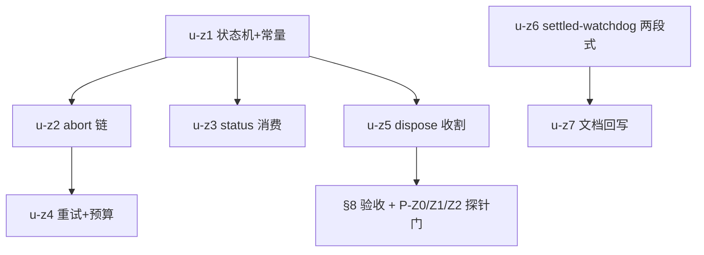

# timeout-zcode-turn-and-settled-watchdog 实施计划

基线: 1646a599a | 来源设计: docs/design/timeout-zcode-turn-and-settled-watchdog.md | 日期: 2026-09-05

## 0 章节映射

| 内容 | 设计文档实际位置 |
|------|------------------|
| 背景/目标 | §1 背景 + §2 设计目标（五件事 + In/Out-of-scope） |
| 终态/机制 | §5 终态 · §6 关键决策 D1-D10 · §7 实现机制 |
| 验收场景表 | §8 验收（真实场景，非单测） |
| 下一层拆分 | §10 下一层拆分（U1-U7 + 文件改动地图） |
| 待验证检查点 | §11 探针清单（P-Z0/Z1/Z2/Z3/Z4 + P-T2c 系） |

## 1 目标快照（逐字摘录自设计 §2）

> **本章结论：从使用者（派发 subagent 的宿主 agent 与最终用户）体验倒推五件事——不误杀、真挂死能回收、死后不烧钱、失败形态真实可分流、配置有出路。**

1. **正常长任务不被杀**：……**例外（carve-out，v1.1）**：总上界形态（默认 60min，⛔P-Z0 门标定）对超上界的极长任务是显式接受的残余误杀面……「不被杀」指 idle 主判定对活跃事件流零误杀，不是全时间维度零上界。
2. **真挂死有界回收**：进程/协议静默 wedged（无事件）、收尾卡死、终态永不到达等形态都在有界时间内收敛为明确失败，不留永久 pending。
3. **判死后清理干净**：超时处置停掉 app-server 侧 turn（不再单方面 abandon 后任其对端继续烧 token）。
4. **失败形态真实**：status='error' 不再假成功；超时族错误归类 `engine_timeout`（与 `engine_run_failed` 分流）；瞬时失败对齐 pi 的自动重试先例。
5. **配置有出路**：所有默认上界有 env 通道调整/关闭。

**Out-of-scope**：streaming UI 10min（Doc 2）；插件工具 30s（Doc 3）；abort 链 3s+3s 连坐量级（仅登记）；`WATCHDOG_MS_PER_TURN` 重标定；watchdog 覆盖面推广。

## 2 单元列表

| Unit | 职责 | 领地（精确文件路径） | 依赖 | 隔离 | 验收条款 |
|------|------|---------------------|------|------|---------|
| u-z1-turn-timeout-state-machine | session-channel.ts：openTurn 两 timer 状态机（idle 主判定 + 宽上界回收兜底）+ `TurnTimeoutError` + 事件刷新 + `lastTerminalStatus` 记录 + lookupTurn 归因放宽（迟到 turn.terminal 的 status 只记录不改写落定）；constants.ts 两新常量 + env 解析 | `packages/subagent-core/src/execution/engine/engines/zcode/session-channel.ts` · `.../zcode/constants.ts` | 无 | plain | §8 场景 1/2（不误杀 + idle 语义）；单测状态机 |
| u-z2-timeout-abort-chain | zcode-engine.ts：catch 分流（timeout→abort 链 stop 应答三态裁决 + `engine_timeout` 文案） | `packages/subagent-core/src/execution/engine/engines/zcode/zcode-engine.ts` | u-z1 | plain | §8 场景 3（死后不烧钱）；A2 可判定断言 |
| u-z3-status-consume | zcode-engine.ts：`parsedAppServerAttempt` 消费 status + run-failed 合成（⚠️P-Z2 探针先行） | `packages/subagent-core/src/execution/engine/engines/zcode/zcode-engine.ts` | u-z1 | plain | §8 场景 5（失败形态真实） |
| u-z4-retry-budget | zcode-engine.ts：`runAppServerAttemptsWithRetry` 扩展 + 预算继承（⚠️P-Z4） | `packages/subagent-core/src/execution/engine/engines/zcode/zcode-engine.ts` | u-z2 | plain | §8 场景 6（瞬时失败重试一次） |
| u-z5-dispose-harvest | zcode-engine.ts + session-channel.ts：dispose 前收割（HARVEST_GRACE，⚠️P-Z3） | `packages/subagent-core/src/execution/engine/engines/zcode/zcode-engine.ts` · `session-channel.ts` | u-z1 | plain | §8 场景 4 + A11（hangOnly 分支） |
| u-z6-settled-watchdog | settled-watchdog.ts 两段式原语 + 两挂载点改造 + env `XYZ_SUBAGENT_SETTLED_WATCHDOG_MS` | `packages/subagent-core/src/execution/settled-watchdog.ts` · `execution/session-runner.ts` · `execution/subagent-service.ts` | 无（与 zcode 侧无文件交集） | plain | §8 P0-4 场景（600s 定值不再误标定） |
| u-z7-doc-writeback | 文档回写三处：unbounded-wait-audit §7.2 被否谱系 / 其 impl-plan §5 清账 / settled-watchdog 头注释 | `docs/design/subagent-core-unbounded-wait-audit.md` · `docs/design/subagent-core-unbounded-wait-audit.impl-plan.md` · `packages/subagent-core/src/execution/settled-watchdog.ts`（头注释） | u-z6 | plain | 回写内容与实现一致（C-proc-10） |

**实施顺序**：设计 §10 说「U1→U2→U4；U3/U5/U6 并行」，但 U2/U3/U4/U5 领地都含 zcode-engine.ts——**实际派发 u-z1 → u-z2 → u-z3 → u-z4 → u-z5 全串行（同文件编辑冲突），u-z6+u-z7 与外部计划并行**。

## 3 DAG 图

## 4 测试策略

- **增量**：`cd packages/subagent-core && pnpm test`（session-channel 状态机 / zcode-engine 分流 / settled-watchdog 两段式新增测试 + 既有套件不回归）。
- **Gate B（§8）**：真实 zcode 引擎长任务 + 真实挂死注入（SIGSTOP 形态、FAKE_STATE_FILE、hangOnly + stopBehavior:'none'）；⛔ 探针门 P-Z0/Z1 在 M1 前必跑（T001 34 任务 journal 扫描 + 新采样）、P-Z2 在 u-z3 前必跑。
- 全量 `pnpm test` 在阶段 5。

## 5 合理偏差登记表

（初始为空）

## 6 状态表

| Unit | 状态 | 轮次 | 证据指针 |
|------|------|------|---------|
| u-z1-turn-timeout-state-machine | committed | 1 | 状态机 17 测 + 包全量 3040 绿；eslint max-lines override（授权修复轮，4 先例同型） |
| u-z2-timeout-abort-chain | committed | 1 | 三态裁决 6 测 + 包全量 3046 绿；额外根修 awaitConnFinalized（killChain 后连接 finalize 竞态，实测命中）；「已自动重试」句留 u-z4 补 |
| u-z3-status-consume | pending | 0 | — |
| u-z4-retry-budget | committed | 1 | transient 结构化判据 + 预算继承纯函数 + disposed 防御；14 测 + 包全量 3068 绿；P-Z4 数值断言由纯函数承载（集成层行为分野等价覆盖） |
| u-z5-dispose-harvest | pending | 0 | — |
| u-z6-settled-watchdog | committed | 1 | 两段式原语 25 测 + 包全量 3023 绿；4 项偏差登记（env 非法值语义等） |
| u-z7-doc-writeback | committed | 1 | 三处回写完成（audit §7.2/§7.3 + impl-plan §5 T2③ 清账）；头注释核实免改；5 条残留 deviations 登记（§6.2 行 252 等） |

## 7 残留风险与变更历史

- 预检证据：设计 v1.3 经 3 轮对抗审查收敛 0 must-fix（`.review/timeout-zcode-turn-r3.md`：0 MF/5 SG/2 INFO，5 条 SG 均一句话级收尾）。
- **跨文档领地冲突（主 agent 编排约束）**：u-z1~u-z5 的 zcode-engine.ts / session-channel.ts 与 timeout-audit-hygiene u-h2 重叠——**zcode 链完成后才派发 u-h2**。
- P-Z0/Z1 探针门（默认 60min/30min 取值标定）失败时降级路径已预定义（§11），实施期不得跳过。

## 变更历史

- v1（2026-09-05）：初版。用户评审以会话指令「开始规划开发」代替（夜间托管自治态），DAG/单元表随最终汇报呈现。
