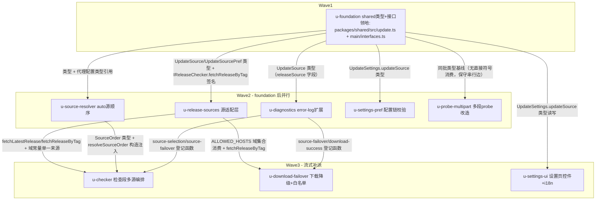

# 自动升级多源（AtomGit + GitHub）实施计划

基线: 6d3f76cdb | 来源设计: docs/design/update-multi-source.md | 日期: 2026-09-07

审查证据：`.review/` 九份报告——r1 主审 4MF/5S + 影响面 6MF/4S → r2 0MF/2S + 1MF/4S → r3 0MF/3S + 1MF/1S → r4 双审 0MF（3S 全修入 v5）；第 5 轮独立四维度深度审查 0 P0（7 P1 / 7 P2 全修入 v6，commit 389883039）。当前 must-fix == 0。

## 0 章节映射

| 内容 | 设计文档实际位置 |
|------|------------------|
| 背景/目标 | §1 背景：被设计的系统是什么 + §2 设计目标（Out-of-scope 在 §2 末） |
| 终态/机制 | §4.2 物理数据流 + §5 终态 + §6 决策 D1-D8 + §7 实现机制（改动地图 §7.2/§7.3） |
| 验收场景表 | §8.2 验收场景 S1-S6 + 单测分工段 |
| 下一层拆分 | §10 下一层拆分（7 单元）+ §9 实施表 M0-M5 |
| 待验证检查点 | §11（5 项）+ §7.5 探针 P1-P7 |

## 0.1 M0 探针结果（2026-09-07 实测，subagent task 的输入事实）

| 探针 | 结果 | 对实现的影响 |
|------|------|--------------|
| P1 落域 | 附件（type=attach）`browser_download_url` 落域 **`gitcode.com`**，by-tag 直链形态 `https://gitcode.com/qq_18433817/xyz-agent/releases/download/{tag}/{file}`，302 → `file-cdn.gitcode.com`（auth_key 签名） | `ALLOWED_HOSTS` 精确登记 `gitcode.com` 一项即可；`raw.gitcode.com` 仅 source 归档（type=source，非发布产物），不登记 |
| P4 manifest | manifest.json 直链匿名可达（302 → file-cdn 签名 URL），v0.9.14 在 assets 中 | manifest URL 从 assets 取 `browser_download_url` 的前提成立 |
| P5 探测形态 | `github.com` GET Range 0-0 → 206；`gitcode.com` → **200 全量（约 258KB body）**；gitcode.com 对 GET 不 405 | 「任何完成 HTTP 响应即可达」判定下两域均可达；主域不可假设支持 Range（gitcode.com 主域 200），probe 判定必须看 206 + Content-Range |
| P6 prerelease | `prerelease: false`（**boolean**）；`release_status: 'none'`；`draft`/`published_at`/`html_url` 为 null | normalize 的 `=== true` 收窄保留为防御性收窄（防 API 演化） |
| P7 多段 | 两源下载 URL 同构：206 + `Content-Range: bytes 0-0/135681147`（total 正确）+ `Content-Length: 1`（陷阱实锤）；**AtomGit 4 路并发 Range 全 206**（读路径无 429） | 新 probe 判定（206 + Content-Range total ≥ 阈值）两源成立；多段并行对 AtomGit 无并发障碍 |

## 1 目标快照（逐字摘录设计 §2）

> **本章结论：三类使用者（国内无代理用户、代理用户、显式偏好者）都能以最小代价完成升级。**
> 1. **国内无代理用户**：启动后升级检查与下载自动落到 AtomGit（可达且快），GitHub 故障对其透明。
> 2. **代理用户**：行为与现状一致（GitHub 优先），不因双源改造引入额外延迟。
> 3. **显式偏好者**：在设置-更新中选择来源（自动 / GitHub / AtomGit），选择即优先级；任一环节失败仍能经另一源完成升级（降级是无条件的，不因显式选择而关闭）。
> 4. **安全不回退**：renderer 传意图、main 权威解析的信任锚（RC1）、sha256 完整性校验、下载域白名单防 SSRF——三条安全性质在双源下全部保持。

**Out-of-scope（§2）**：安装段（platform-updater / self-healer）；发布侧同步脚本及其命名；electron-updater 替换；三源以上扩展性预留；atomgit release 的写路径（客户端只读）。

## 2 单元列表

| Unit | 职责 | 领地（精确文件路径，均相对仓库根） | 依赖 | 隔离 | 验收条款 |
|------|------|-----------------------------------|------|------|----------|
| u-foundation | shared 类型扩展（UpdateSource/UpdateSourcePref/LatestReleaseInfo.source?/UpdateSettings.updateSource? + :69 注释中性化）+ `IReleaseChecker` 补 `fetchReleaseByTag(source, tag): Promise<LatestReleaseInfo \| null>`（§7.1/§7.2 interfaces 行）+ shared 包入口导出接线 | `packages/shared/src/update.ts`；`packages/shared/src/index.ts`（:151 显式命名导出列表追加两新类型名——该文件为显式列表非 `export *`，属共享接线点）；`apps/electron/main/interfaces.ts` | — | plain | `cd packages/shared && pnpm typecheck` 过；`cd apps/electron/main && npx vitest run` 既有测试全绿（类型扩展不破坏编译面） |
| u-release-sources | 源适配层（D1/D2）：`fetchLatestRelease(source)` / `fetchReleaseByTag(source, tag)` + 两源 normalize（prerelease `=== true` 收窄、draft→undefined、publishedAt→''、htmlUrl 拼 gitcode.com 页面链接、asset 字段别名容错、形状守卫）+ manifest 从 assets 取直链 + 域常量单一来源导出（两源 API/下载域 + ALLOWED_HOSTS 集合） | `apps/electron/main/update/release-sources.ts`（新）；`apps/electron/main/update/__tests__/release-sources.test.ts`（新） | u-foundation | plain | normalize 表测全绿，断言至少含：prerelease 字符串 `"false"` 不误判 / draft null→undefined / assets 无 size / 形状坏抛可归类错误 / **两源全部产物 downloadUrl hostname ⊆ ALLOWED_HOSTS 防漂移** / by-tag 透传（§8 单测分工） |
| u-source-resolver | auto 模式源顺序（D4）：settings 映射 / 代理短路 / 域名并行探测（GET Range 0-0 + 任何响应即可达 + `disableFlagPersistence: true` + 3s 超时）/ 进程内 TTL 1h 缓存 + 导出 `SourceOrder` 类型 | `apps/electron/main/update/source-resolver.ts`（新）；`apps/electron/main/test/source-resolver.test.ts`（新） | u-foundation | plain | 决策表测全绿：三偏好映射 / 代理短路不探测 / 双探测可达排序（undici resolve 与 curl httpStatusCode 两引擎等价判定）/ 双败回退 [github, atomgit] / tie-break github / TTL 命中不重复探测 / disableFlagPersistence 传参断言 |
| u-diagnostics | error-log 诊断面（S1-S3 观测面）：`appendUpdateError` 增 `releaseSource` 字段 + 三类成功登记 source-selection（含源顺序/胜出源/探测结果/各源 latest tag）/ source-failover（from/to/manifest 来源）/ download-success（multiPart + engine），复用 512KB×2 轮转 | `apps/electron/main/update/error-log.ts`；`apps/electron/main/test/error-log.test.ts`（新） | u-foundation | plain | vitest：三类登记各落一条 JSONL 且字段齐 / releaseSource 字段透传 / 轮转通道不回退（既有轮转测试语义保持）/ 写入失败不抛（对齐既有容错） |
| u-settings-pref | updateSource 配置链：update-settings 逐字段枚举校验 + `update:setSettings` 入参校验（非三值抛错）+ UPDATE_NETWORK_FAILED suggestion 去 GitHub 专名（types.ts:85） | `apps/electron/main/update/update-settings.ts`；`apps/electron/main/update/types.ts`；`apps/electron/main/gateway/update-handlers.ts`；`apps/electron/main/test/update-settings.test.ts`；`apps/electron/main/test/update-handlers-orchestration.test.ts`（既有断言联动维护） | u-foundation | plain | vitest：合法三值写入读回一致 / 非法值回退 auto 或抛错（对齐现有字段校验先例，设计 §6.3）/ suggestion 文案无「GitHub」专名 / 既有 update-settings + update-handlers 测试全绿 |
| u-probe-multipart | 多段入口探测改造（§7.2 download-asset 行）：`probeMultiPartSupport` HEAD → GET `Range: bytes=0-0`，判定迁移为 206 + `Content-Range: bytes 0-0/{total}` 且 total ≥ MIN_MULTI_PART_SIZE → supported（totalBytes 取自 Content-Range）；四出口归类（206+达标 / 206+total 低于阈值 / 206 但 Content-Range 缺失、total `*`、单位非 bytes / 非 206 含 200 全量退化 → 均 not） | `apps/electron/main/update/download-asset.ts`；`apps/electron/main/test/download-asset.test.ts` | u-foundation | plain | vitest：probe 四出口表测（含 totalBytes 取自 Content-Range 而非恒 1 的 content-length 断言）+ 存量 HEAD mock 族（9+ 处）全部改写为 GET Range 形态后既有测试全绿 |
| u-checker | 检查段多源编排（§4.2①-⑥/§6.5）：按 SourceOrder 逐源「fetch+normalize+三重防御+版本比较」一体化、退避源短路跳过、全部源确认无新版才写负缓存（混合态不写）、AtomGit manifest 失败计该源失败（GitHub 不阻塞）、manifest 解析扩 size + URL 从 assets 取、per-source 退避 Map + `getRateLimitedUntil()` 返回各源最大截止时刻（签名不变）、resolver 构造注入 `new ReleaseChecker({ resolveSourceOrder })`、source-selection/source-failover 登记接线 | `apps/electron/main/release-checker.ts`；`apps/electron/main/test/release-checker.test.ts`；`apps/electron/main/test/release-checker-proxy.test.ts`（既有断言联动维护） | u-release-sources；u-source-resolver；u-diagnostics | plain | vitest：主源「无新版」不写全局负缓存 + 混合态不写负缓存 + 次源新版可达 + 退避源短路零请求断言 + getRateLimitedUntil 各源最大值/无退避 0 + AtomGit manifest 失败降级次源 + GitHub manifest 失败不阻塞 + 存量负缓存 describe 块按新语义重写后全绿 |
| u-download-failover | 下载段跨源降级（§4.2③④/§6.5/§6.8）+ 白名单（§6.6）：触发集合 errorCode 四值白名单（NETWORK_FAILED/NETWORK_TIMEOUT/PROXY_ERROR/PROXY_UNREACHABLE）、`release.source` undefined 不降级、UpdateIntegrityError 不降级、by-tag 确认含目标 asset 存在（404 与 200-无-asset 同语义：保留断点原错误上抛）、复用 temp+resume-state 续传仅替换 downloadUrl、`ALLOWED_HOSTS` 消费 release-sources 单一来源 + 增 `gitcode.com`、source-failover/download-success 登记接线 | `apps/electron/main/update/orchestrator.ts`；`apps/electron/main/update/validate-release.ts`；`apps/electron/main/test/orchestrator.test.ts`；`apps/electron/main/test/validate-release.test.ts` | u-release-sources；u-diagnostics | plain | vitest：降级分支测（双引擎失败注入）+ UpdateIntegrityError 不触发降级 + source undefined 不降级 + 触发集合外 errorCode（DISK_SPACE 等）不降级 + 对侧 by-tag 404 / by-tag 200 无 asset 均保留断点原错误上抛 + totalBytes 三组合（一致续传/不一致转全量/state 缺失从零）+ validate-release 新域放行与非白名单域拒绝 |
| u-settings-ui | 设置页来源控件 + 文案：UpdatePage 三选控件（自动（推荐）/GitHub/AtomGit，testid `select-update-source`，嵌入现有偏好卡，切换即持久化+失败回滚+toast，不自动触发 force 检查）+ i18n 新增来源文案（zh-CN/en-US settings.ts）+ rateLimited 文案中性化（sidebar.ts zh:52/en:53）+ `docs/testing/update-e2e.md` testid 登记 | `packages/renderer/src/components/settings/update/UpdatePage.vue`；`packages/renderer/src/i18n/locales/zh-CN/settings.ts`；`packages/renderer/src/i18n/locales/en-US/settings.ts`；`packages/renderer/src/i18n/locales/zh-CN/sidebar.ts`；`packages/renderer/src/i18n/locales/en-US/sidebar.ts`；`docs/testing/update-e2e.md` | u-foundation | plain | renderer vitest 相关用例绿 + `cd packages/renderer && pnpm typecheck` 过 + vue_rules_checker/taste-lint 过（pre-commit 自然覆盖）+ 组件测试断言：三选项渲染 / 切换调 setUpdateSettings / 失败回滚 / testid 存在 |

领地交集自检：任意两单元领地无交集（update-handlers.ts 仅 u-settings-pref；error-log.ts 仅 u-diagnostics；release-checker.ts 仅 u-checker；download-asset.ts 仅 u-probe-multipart；orchestrator.ts 仅 u-download-failover）。

## 3 DAG 图

流式调度：U0 committed 即派 W2 全部（5 个 = 并发上限）；任一 W2 单元 committed 即解锁其在 W3 的后继补派（U8 仅依赖 U0，若 W2 有单元先行完成腾出并发位则 U8 提前）。

## 4 测试策略

- **增量（单元内）**：
  - main 进程：`cd apps/electron/main && npx vitest run test/<file>.test.ts`（或 `update/__tests__/<file>`）
  - shared：`cd packages/shared && pnpm typecheck && npx vitest run`
  - renderer：`cd packages/renderer && npx vitest run <相关测试>` + `pnpm typecheck`
- **全量（阶段 5 收尾）**：`pnpm run test:all`（frontend + runtime + main）+ `cd packages/shared && npx vitest run`；runtime 本次零改动，作为回归基线确认。
- 测试框架 vitest，配置在子包（apps/electron/main/vitest.config.ts 等），从子包目录运行；timer 用 fake timers；禁止 `node:test`。
- 存量测试迁移是改动地图组成部分（设计 §7.2「存量测试迁移」行）：release-checker.test.ts 负缓存块重写（u-checker）、download-asset.test.ts HEAD mock 族改写（u-probe-multipart）、update-handlers-orchestration.test.ts 联动维护（u-settings-pref）。

## 5 合理偏差登记表

| Unit | 偏差 | 理由 | 登记日期 |
|------|------|------|----------|
| u-foundation | fetchReleaseByTag 做成 IReleaseChecker 必需方法（设计未明说可选性）；接口实现侧出现计划内中间态编译红（release-checker.ts / dev mock / handler 测试 mock 共 10 处 TS2420/TS2741 连锁），由 u-checker（实现方法）与存量测试迁移（补 mock）消解，vitest 全程绿（esbuild 剥类型） | 必需方法语义更准确：多源降级必经路径不存在「不支持」的 checker（同接口 getRateLimitedUntil 的可选先例注释明确是「不支持限额语义时不实现」，场景不同） | 2026-09-07 |
| u-foundation | 设计 §7.1 称 update.ts 有「两处 GitHub API 限额注释」（:63/:70），实测仅 :69 一处 | 设计行号笔误；全文件核对无第二处，其余 GitHub 字样为字段来源的事实性描述非限流表述 | 2026-09-07 |
| u-diagnostics | source-selection 降频变化检测在设计的「排序/胜出源/探测结果」三维外增加第四维 tags（各源 latest tag） | 不纳入则稳态下 tag 冻结在首条，F5 同步缺失形态的唯一客户端观测面失效；tag 变化受版本发布节流，写放仍远低于每轮必写上界 | 2026-09-07 |
| u-diagnostics | appendUpdateError 返回 void → boolean；诊断 stage 新增值 'checking'（仅诊断日志用） | 支撑「写失败不推进降频快照」语义；既有调用方全部忽略返回值行为零变化；检查段事件在 UpdateStage 既有值域无对应值 | 2026-09-07 |
| u-probe-multipart | 验收条款「存量 HEAD mock 族改写后既有测试全绿」首轮未达成：仅迁移 test/download-asset.test.ts，漏扫 update/__tests__/download-asset-fallback.test.ts（u4-probe-curl、u4-multipart-success 2 红）与 update/__tests__/update.test.ts（B4 1 红）同族 HEAD-era mock | 打回返工（轮次 2），领地扩展上述两文件 | 2026-09-07 |
| u-checker | DOC_MODULE_MAP 登记（设计 §9 M2 项）从 u-diagnostics 移交至 u-checker | scripts/check-doc-symbol-drift.mjs 在 u-diagnostics 领地外；M2 挂点单元为 checker，随其 commit 落地 | 2026-09-07 |

## 6 状态表

| Unit | 状态 | 轮次 | 证据指针 |
|------|------|------|----------|
| u-foundation | committed | 1 | 本文件同 commit；shared typecheck exit 0 + main vitest 48 文件 761 用例全绿（两轮复核）+ main tsc TS2305 归零（计划内中间态红 10 处由 u-checker 消解） |
| u-release-sources | in-progress | 1 | agent 已派发（Wave2） |
| u-source-resolver | committed | 1 | 本文件同 commit；vitest 17/17、eslint 0 warning、领地 2 新文件与 files_changed 一致 |
| u-diagnostics | committed | 1 | 本文件同 commit；vitest 15/15 + w2-main-integration 40 绿；error-log 纯增量零行为变化 |
| u-settings-pref | committed | 1 | 本文件同 commit；vitest 44/44（含 download-asset 已 commit 态回归）、eslint 0 errors、rateLimited 判定零改动已偏差登记 |
| u-probe-multipart | committed | 1 | 本文件同 commit；vitest 30/30（23 存量 + 7 新增四出口表测）、HEAD 残留 0、eslint 0 problems、领地 TS2698 存量错顺手修复 |
| u-checker | pending | 0 | — |
| u-download-failover | pending | 0 | — |
| u-settings-ui | pending | 0 | — |

## 7 残留风险与变更历史

- §11.3：AtomGit API 匿名访问稳定性无官方承诺——运行期经 source-selection 日志观测（M2 后），频繁 4xx/429 再议保守请求间隔。
- §11.4：跨源续传三组合由 u-download-failover 单测覆盖（totalBytes 一致/不一致/state 缺失）。
- §11.5：Windows NSIS 路径未在本设计期实测，S1 的 Windows 复验留待发布前（Out-of-scope of 本流水线，登记不阻塞）。
- S1-S6 真实场景验收（打包 app + hosts 故障注入）属阶段 5 Gate B，本机 macOS 可执行 S1-S5；S6 需本地代理注入产物，实施时评估等效手段。
- 变更历史：
  - 2026-09-07：初版。9 单元拆分自设计 §10 + §9；M0 探针已由主 agent 执行完毕（见 §0.1），白名单精确值 `gitcode.com` 已定，探针 P2/P3 为发布脚本既有实测。
