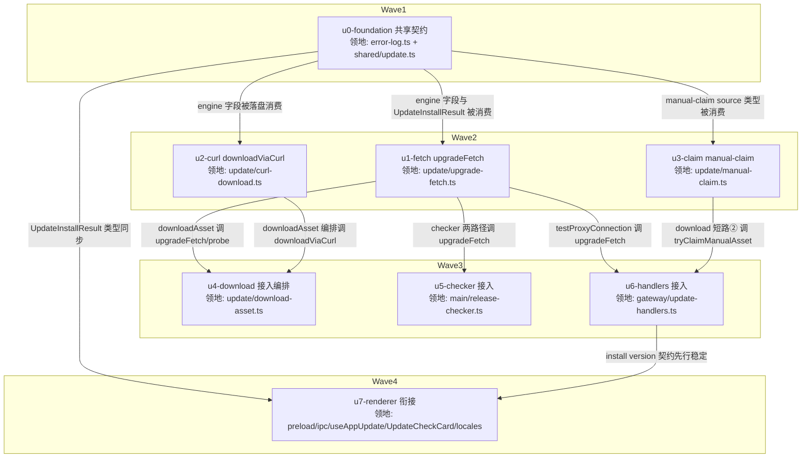

# update-network-resilience 实施计划

基线: 待基线 commit | 来源设计: [docs/design/update-network-resilience.md](update-network-resilience.md)（审查报告：[update-network-resilience.review.md](update-network-resilience.review.md)，must_fix=0）| 日期: 2026-08-30

## 0 章节映射

| 内容 | 本文实际位置 |
|------|--------------|
| 背景/目标 | §1 背景目标（SCQA + G1/G2/G3 + Scope） |
| 终态/机制 | §3 解决方案（§3.1 终态场景；§3.3 决策 D1-D10；§3.4 数据流图） |
| 验收场景表 | §4 验收（A1-A7 + 单元测试覆盖清单） |
| 下一层拆分 | §5 下一层拆分（U1-U9 表 + 待验证检查点） |
| 待验证检查点 | §5 末「待验证检查点」4 条（实施期门） |

## 1 目标快照（逐字摘录）

> **G1 手动下载逃生通道**：用户用浏览器/其他机器下载安装包 zip，放入指定目录，升级入口（侧边栏升级按钮 **和** 设置页更新卡片，二者共用同一 IPC）识别后直接进入「可安装」态，全程零 app 网络依赖。
>
> **G2 网络访问双引擎降级**：授权失效/连接层故障时用户点升级**无需任何额外操作**：undici 失败自动换 curl，代理整体不可用时兜底直连；调用方（download / check / testProxy）代码不感知引擎切换。
>
> **G3 兼容性**：现有 IPC 契约、preloaded 机制、错误分类体系（UpdateErrorCode / 用户文案 / update-error.log）不变，仅扩展。

**Out-of-scope（逐字）**：开发者签名 + 公证（另行推进）；文件选择器式认领 UI；multipart per-part 的 curl 化；Windows / Linux 的授权问题。

## 2 单元列表

| Unit | 职责 | 领地（精确文件路径） | 依赖 | 隔离 | 验收条款 |
|------|------|---------------------|------|------|---------|
| u0-foundation | error-log `engine` 字段 + `source: 'engine-fallback'/'manual-claim'` 类型 + shared `UpdateInstallResult` 类型 | `apps/electron/main/update/error-log.ts`、`packages/shared/src/update.ts` | — | plain | ① `cd apps/electron/main && npx vitest run update/__tests__/` 全绿；② `UpdateInstallResult` 被 shared 导出且 preload/ipc 侧暂不消费不报错（纯类型新增） |
| u1-fetch | `upgradeFetch` 封装：双引擎 + `enginePreference`（置位判定按 D4 收敛封装内 + 不参与置位选项）+ curl exit code 映射 + 小请求语义（`-f -L`/`-I -L`/headers-body 分文件）+ 降级点落盘 | `apps/electron/main/update/upgrade-fetch.ts`（新）、`apps/electron/main/update/__tests__/upgrade-fetch.test.ts`（新） | u0 | plain | ① 单测覆盖 D4 矩阵逐行（含反例：HTTP 403 不触发 curl、瞬时类不置 flag、`UND_ERR_CONNECT_TIMEOUT` 置 flag、不参与置位选项）；② curl exit 7/28/33/35/56/22 映射用例；③ 降级点落盘 `source:'engine-fallback'` 断言 |
| u2-curl | `downloadViaCurl`：spawn curl 整文件下载（`-f -L -C -`/speed-time/statSync 进度 watch/1h 上限 kill/exit 33 删 temp 重下/before-quit kill/spawn ENOENT 上抛） | `apps/electron/main/update/curl-download.ts`（新）、`apps/electron/main/update/__tests__/curl-download.test.ts`（新） | u0 | plain | ① 单测：ENOENT 上抛形态、exit 33 触发删 temp 重下、进度 watch 推流（fake timers）；② curl 参数数组断言含 `-f -L -C - --speed-limit 1 --speed-time 30 --connect-timeout 10` |
| u3-claim | `tryClaimManualAsset`：目录扫描 + 平台 asset name+size+sha256 三重校验 + move + 写 preloaded + mismatch 落盘（噪音控制）+ 并发幂等（ENOENT 视为成功） | `apps/electron/main/update/manual-claim.ts`（新）、`apps/electron/main/update/__tests__/manual-claim.test.ts`（新） | u0 | plain | ① 单测：三重校验正反例（同名 size 不符 / sha 不符 / sha 缺失拒绝）、目录空不落盘、renameSync ENOENT 幂等成功、认领后 `preloaded-update.json` 登记形状正确 |
| u4-download | download-asset 接入：flag 分流 + probe 换 `upgradeFetch`（usedEngine 分流多段）+ 多段/单段失败降级编排 + D10 三步链（curl 缺失回退 undici 直连）+ resume-state 统一清理 | `apps/electron/main/update/download-asset.ts`、`apps/electron/main/update/__tests__/download-asset-fallback.test.ts`（新） | u1, u2 | plain | ① 单测：undici 连接建立失败 → 置 flag → curl 路径；curl+代理 exit 7 → 直连兜底；curl ENOENT → undici 直连；probe usedEngine='curl' → 跳过多段；② 既有 update.test.ts 全绿（回归） |
| u5-checker | release-checker 接入：`doFetchGitHubLatestRelease` 与 `doFetchManifestSha256` 均换 `upgradeFetch`（直连编排保留在 checker） | `apps/electron/main/release-checker.ts` | u1 | plain | ① 单测（在现有测试文件追加或新建）：checker 经 upgradeFetch 调用、manifest fallback 路径同源；② 既有 release-checker 相关测试全绿 |
| u6-handlers | gateway 接入：download 入口本地短路①②（版本严格相等）+ getPreloaded miss 后认领 + testProxy 双引擎 + install 响应加 `version` | `apps/electron/main/gateway/update-handlers.ts` | u1, u3 | plain | ① 单测：断网场景（mock 网络抛错）download 命中认领短路返回 downloaded；preloaded 0.9.12 vs payload 0.9.11 不短路；testProxy undici 失败 curl 成功返回 success；② 既有 update.test.ts 中 handler 用例全绿 |
| u7-renderer | renderer 衔接：`UpdateInstallResult` 签名同步（preload/ipc + shared 包根出口 index.ts 追加导出）+ install 返回对齐实装版本 + 设置页手动通道区（路径展示 + mkdir + openPath）+ 错误 suggestion 追加指引 + i18n 双语 | `apps/electron/preload/preload.ts`、`packages/renderer/src/lib/ipc.ts`、`packages/shared/src/index.ts`（仅追加 UpdateInstallResult 导出一行）、`packages/renderer/src/composables/features/settings/useAppUpdate.ts`、`packages/renderer/src/components/settings/UpdateCheckCard.vue`、`packages/renderer/src/i18n/locales/zh-CN/sidebar.ts`、`packages/renderer/src/i18n/locales/en-US/sidebar.ts` | u0, u6 | plain | ① `pnpm --filter @xyz-agent/frontend run test` 全绿（含新增手动通道区用例）；② `pnpm run typecheck:preload` 通过；③ 三视角用例：手动通道区渲染断言（用户可见 DOM） |

## 3 DAG 图

## 4 测试策略

- **框架红线**：vitest（禁 node:test），配置在子包 vitest.config.ts，从子包目录运行；timer 用 fake timers（TEST-STRATEGY.md）。
- **增量（单元开发期）**：
  - main 侧：`cd apps/electron/main && npx vitest run update/__tests__/`（update 模块全部用例；main 的 vitest 从 apps/electron/main 目录运行，测试位于 update/__tests__/）
  - renderer 侧：`cd packages/renderer && npx vitest run src/__tests__/components/UpdateButton src/__tests__/settings/update-page`（按改动触达）
  - preload：`cd apps/electron && pnpm run typecheck:preload`
- **全量（收尾阶段）**：`pnpm --filter @xyz-agent/frontend run test && cd apps/electron/main && npx vitest run`（main 全量）+ `pnpm run lint`。
- **真实场景验收（阶段 5 Gate B）**：设计 §4 A1/A2/A3/A4/A5/A6 在事故机器（本机）执行；A7 为 Windows/Linux 定向检查，本机无 Win/Linux 环境 → 标记 deferred，随跨平台 CI/手测留档。

## 5 合理偏差登记表

| # | 偏差 | 处理 |
|---|------|------|
| 1 | 计划初版测试命令路径笔误（`__tests__/update/` → 实际 `update/__tests__/`，vitest 从 apps/electron/main 运行） | 计划 §2/§4 已修正（u0 轮次发现） |
| 2 | shared 包根入口 `packages/shared/src/index.ts` 为具名导出清单（非 `export *`），u7 导入 `UpdateInstallResult` 需在该清单追加一行——原计划遗漏该文件 | u7 领地已补入（仅限追加该导出行） |
| 3 | error-log 的 `source` 原为自由 string 非字面量联合，`engine-fallback`/`manual-claim` 以 JSDoc 登记而非类型收窄 | 接受（保持向后兼容，比设计更保守） |

## 6 状态表

| Unit | 状态 | 轮次 | 证据指针 |
|------|------|------|---------|
| u0-foundation | committed | 1 | `update/__tests__/ 68 passed`；diff 30 行（error-log engine 字段 + shared UpdateInstallResult） |
| u1-fetch | pending | 0 | — |
| u2-curl | pending | 0 | — |
| u3-claim | pending | 0 | — |
| u4-download | pending | 0 | — |
| u5-checker | pending | 0 | — |
| u6-handlers | pending | 0 | — |
| u7-renderer | pending | 0 | — |

## 7 残留风险与变更历史

- **残留风险**：① A7 跨平台定向检查无法在本机执行（deferred 至 CI/手测）；② §5 待验证检查点 4 条（curl speed-time 等价性 / 打包环境 spawn / 进度平滑度 / Win curl 支持）属实施期门，计划在 u2 完成后以探针脚本验证；③ u7 触达 UpdateCheckCard.vue 与 locales，需遵守 renderer 三视角测试红线（用户可见 DOM 断言）。
- **变更历史**：
  - 2026-08-30 计划创建（阶段 0 预检通过：结构四节齐全；审查证据 [update-network-resilience.review.md](update-network-resilience.review.md) must_fix=0）。
  - 2026-08-30 u0 committed 后：修正测试命令路径（偏差 #1）、u7 领地补 shared index.ts（偏差 #2）、登记偏差 #3；状态表同步。
