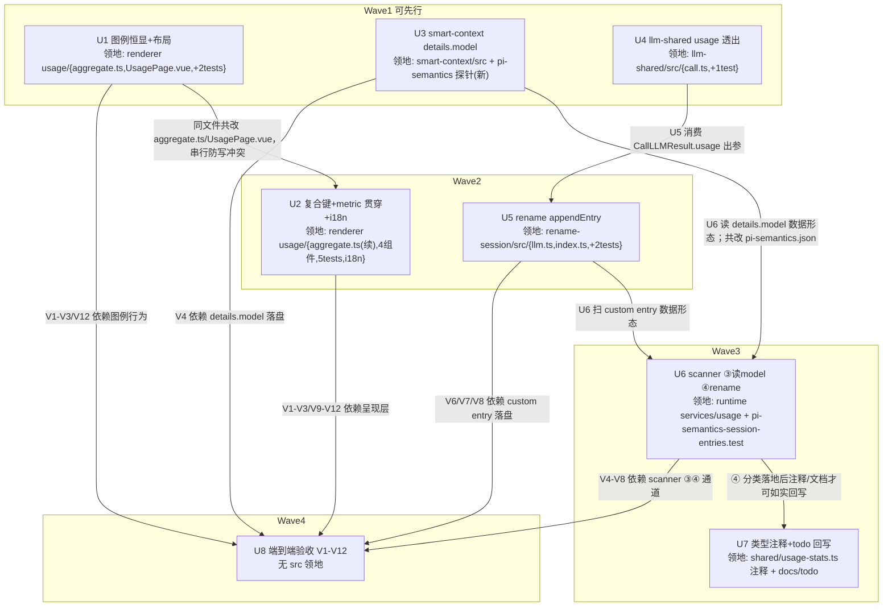

# 用量统计页四类缺陷修复 实施计划

基线: 7efeb3a97 | 来源设计: docs/design/usage-page-fixes.md（14f267243）| 日期: 2026-09-08

## 0 章节映射

| 内容 | 本文实际位置 |
|------|--------------|
| 背景/目标 | §1 背景目标（SCQA + G1-G4 + Scope） |
| 终态/机制 | §3 解决方案（3.1 终态 / 3.2 方案对比 / 3.3 终态数据契约 ①-⑥ / 3.4 D1-D6 / 3.5 探针清单 / 3.6 错误规格） |
| 验收场景表 | §4 验收（V1-V12） |
| 下一层拆分 | §5 下一层拆分（U1-U8） |
| 待验证检查点 | §5 末尾（P-appendEntry ⛔U5、P-en-i18n ⛔U2、P-narrow ⛔U1）+ §3.5 探针清单状态列 |

审查证据：`.review/usage-design-review-r4.md` + `.review/usage-design-review-r4-impact.md`（R4 双审 0MF+0S；R1→R4 四轮收敛，R4 明示「设计可进入实施」）。

## 1 目标快照（逐字摘录设计 §1）

> 现状四类缺陷让这个回答不可信也不可用——badge 互相叠印、关掉的 provider 从图例消失且无法单独恢复、compaction 用量只显示匿名桶、rename-session 的 LLM 消耗完全无账。

- **G1 图例可读可交互**：chips 各自独立渲染、超长横向滚动；关掉的 provider 置灰保留、可单独恢复；isolate 单看时图例仍显示全部 provider。
- **G2 compaction 可归属**：明细表 compaction 组展开后显示实际执行摘要的 `provider/model` 行；存量无归属数据诚实显示，不编造。
- **G3 rename-session 有账**：rename 成功调用后，用量页出现 `rename-session` 组，展开可见所用模型与 token/费用；对话流不受污染。
- **G4 聚合正确性**：metric 切换（Token↔费用）贯穿全部排序/榜单（缓存构成模块除外——token 域固有）；跨 provider 同名模型不合并；英文界面无中文残留。

**Out of scope（显式排除，登记为 follow-up）**：permission classifier LLM usage 落账；subagent 子 session usage 入账；pi 原生 compaction 模型归属；热力日历随 range 联动；fork session 用量去重。见设计 §1 Scope。

## 2 单元列表

> 与设计 §5 U1-U8 一一对应；领地为核实过的精确路径。U1→U2 同文件（aggregate.ts / UsagePage.vue）共改，串行边（设计「分批提交」落为串行）。U3/U6 共改 docs/pi-semantics.json，串行边（与设计依赖 U3→U6 一致）。

| Unit | 职责 | 领地（精确文件路径） | 依赖 | 隔离 | 验收条款 |
|------|------|----------------------|------|------|----------|
| U1 | 图例恒显 + 布局修复：`perProvFull` 累加器；chips 数据源/置灰/守卫基数切换；`flex-nowrap overflow-x-auto`；`size="icon"` 按 §3.3 ⑥ 清理（文本按钮全去，仅 isolate-clear 保留并自管 `h-6 w-6`）；P-narrow 窄窗探针 | `packages/renderer/src/components/settings/usage/aggregate.ts`、`packages/renderer/src/components/settings/usage/UsagePage.vue`、`packages/renderer/src/components/settings/usage/__tests__/UsagePage.filters.test.ts`（断言反转）、`packages/renderer/src/components/settings/usage/__tests__/UsagePage.test.ts` | 无（可先行） | plain | 增量 vitest 绿（filters 断言反转为「置灰保留」）；§3.3 ⑥ 规则逐条过检；V1/V2/V3/V12 的呈现层逻辑就绪 |
| U2 | 聚合正确性：`perModel` 复合键值结构、metric 贯穿排序、`expandedGroups` watch、i18n 收口；**人工核对带逐处过检**（isolate 三处行过滤复合键比较、modelProviderMap 派生源=全量 `data.rows`、toggleProvider 联动守卫复合键验证、detailGroups modelProv 派生、组件展示用 provider/model 分量含 isolate chip、UsageModelRank :12/:21/:103 复合键行标识、modelProviderMap prop 查表整条删除禁 unknown 兜底）；P-en-i18n 探针 | `packages/renderer/src/components/settings/usage/aggregate.ts`、`UsageModelRank.vue`、`UsageCacheMix.vue`、`UsageDetailTable.vue`、`UsageDailyChart.vue`、`UsagePage.vue`、`packages/renderer/src/components/settings/usage/__tests__/aggregate.test.ts`、`__tests__/UsageModelRank.test.ts`、`__tests__/UsageDetailTable.test.ts`、`__tests__/UsageDailyChart.test.ts`、`__tests__/UsagePage.filters.test.ts`、`__tests__/UsagePage.test.ts`（2026-09-08 修订：isolate 复合键化波及 usage-model-* testid 与 isolate chip 断言，U1 已 committed 后归入 U2 领地）、`packages/renderer/src/i18n/locales/`（en/zh 缺失 keys 补齐） | U1（同文件共改） | plain | 增量 vitest 绿；§3.3 ⑤ 人工核对带 7 项逐处过检清单留痕；cacheMix TOP-4 保持 totalTokens（token 域例外）；V9/V10/V11 逻辑就绪 |
| U3 | smart-context `details.model` 落盘（same-model/cross-model 两处生成点，格式 `${model.provider}/${model.id}`）；连带：`docs/pi-semantics.json` 新增 probe 条目「appendCompaction 对 hook details 逐字透传落盘」（verifiedWith 0.84.4）+ 新建探针测试（缺测试则版本门禁红） | `extensions/universal/smart-context/src/compact-handler.ts`、`extensions/universal/smart-context/src/__tests__/compact-handler.test.ts`、`docs/pi-semantics.json`、`packages/runtime/src/infra/pi/__tests__/pi-semantics-compaction-details.test.ts`（新建） | 无（可先行） | plain | extensions:typecheck/lint/test 绿；两处生成点均写 details.model；pi-semantics.json 条目与探针测试同批交付 |
| U4 | llm-shared `CallLLMResult.usage` 透出（additive，透传 completeSimple resp.usage） | `extensions/shared/llm-shared/src/call.ts`、`extensions/shared/llm-shared/src/__tests__/call.test.ts` | 无（可先行） | plain | extensions:typecheck/lint/test 绿；既有调用方（permission classifier 等）零改动（additive 验证：全仓 grep CallLLMResult 消费方编译通过） |
| U5 | rename-session appendEntry：落点收敛 `llm.ts` callRenameLLM 内部（`ok:true && usage` 后立即、`cleanTitle` 之前）；`index.ts` 注入 `appendUsageEntry` 回调（闭包捕获 pi，回调体内 catch + logger.error）；P-appendEntry 探针 | `extensions/universal/rename-session/src/llm.ts`、`extensions/universal/rename-session/src/index.ts`、`extensions/universal/rename-session/src/__tests__/llm.test.ts`、`extensions/universal/rename-session/src/__tests__/index.test.ts` | U4（消费 usage 出参） | plain | extensions:typecheck/lint/test 绿；本地 pi CLI 实测 custom entry 落盘（P-appendEntry ✅）；无 usage 时跳过不落账（§3.6） |
| U6 | scanner：③ 读 `details.model`（非 string/空串回退 `'compaction'`）、④ rename-session 分类（usage 存在性守卫、model 守卫回退 `'rename-session'`、timestamp 非法 skippedLines）；连带：`docs/pi-semantics.json` 新增 probe「appendCustomEntry 落盘形态含 customType/data/timestamp」+ 扩展既有探针测试；服务头注更新（④ 为 xyz 自有口径） | `packages/runtime/src/services/usage/usage-stats-service.ts`、`packages/runtime/src/services/usage/usage-stats-service.test.ts`、`docs/pi-semantics.json`、`packages/runtime/src/infra/pi/__tests__/pi-semantics-session-entries.test.ts` | U3、U5（数据形态）；pi-semantics.json 与 U3 串行 | plain | runtime 增量 vitest 绿（④ 分类 + 守卫 + details.model 回退用例）；探针测试扩展同批；服务头注已更新 |
| U7 | 类型注释与设计文档回写：`usage-stats.ts` 注释（compaction 虚拟桶 model 归属来源 + rename-session ④ 分类）；`docs/todo/usage-stats-design.md` 回写（D1 增补归属来源与 ④ 分类）。设计文档 `usage-page-fixes.md` 的变更历史条目由主 agent 在阶段 5 收尾时补记（不属 coder 领地） | `packages/shared/src/usage-stats.ts`（仅注释）、`docs/todo/usage-stats-design.md` | U6（描述其落地形态） | plain | 注释与 todo 文档内容与实装一致（人工核对）；不引入任何代码行为变更（diff 仅注释/文档） |
| U8 | 端到端验收：按设计 §4 V1-V12 执行（V4/V6/V8 走本地 pi CLI + `<tmp-root>` + `XYZ_AGENT_DATA_DIR` 桥接；V10 用 `mkdtempSync` fixture；V8 测后恢复 rename config） | 无 src 领地（只读验证 + 临时目录；V8 临时改 `~/.pi/agent/config/rename-session-ext-config.json` 测后恢复） | U1、U2、U3、U5、U6 | plain | V1-V12 逐场景签收表全绿（含 V12 守卫组合与 V5/V8 负面场景）；收尾全量 `pnpm test` + `pnpm run lint` 绿 |

**u-foundation 说明**：本计划无独立共享契约根单元——设计 §3.3 数据契约为文档形态（①-⑥），落地点分布在 U3（details.model）/ U4（CallLLMResult.usage）/ U6（scanner ④），各属单一单元领地；renderer 侧聚合契约（perProvFull / perModel 值结构）同落 aggregate.ts，由 U1→U2 串行边保证无并行写冲突。符合 dag-authoring「确无共享契约文件时允许缺席」。

## 3 DAG 图

流式调度：单元 committed 即解锁后继补派，无整层 barrier。并发峰值 3（Wave1）≤5。

## 4 测试策略

**增量（单元开发期，从子包目录运行，vitest 禁 node:test）**：

| 范围 | 命令 |
|------|------|
| renderer（U1/U2） | `cd packages/renderer && npx vitest run src/components/settings/usage` |
| runtime（U6） | `cd packages/runtime && npx vitest run src/services/usage src/infra/pi/__tests__/pi-semantics-session-entries.test.ts src/infra/pi/__tests__/pi-semantics-compaction-details.test.ts` |
| extensions（U3/U4/U5） | `pnpm extensions:typecheck && pnpm extensions:lint && pnpm extensions:test`（三连；目标包过滤用 `pnpm --filter @zhushanwen/pi-<pkg> test`） |
| 本地 CLI 实测（U5 探针） | `pi --mode rpc --session-dir <tmp> --model xiaomi-token-plan-cn/mimo-v2.5-pro --approve --extension <rename-session 路径>` + stdin JSONL（AGENTS MANDATORY 实测路径） |

**测试纪律**：写删目标必须 `mkdtempSync(join(tmpdir(), ...))` 自建自删（V10 fixture 同）；禁触真实 `~/.xyz-agent` / pi session 目录；timer 用 fake timers；三视角（构建者白盒 + 使用者黑盒 + 观察者 DOM 断言）。

**全量（收尾 U8）**：`pnpm test`（根，含 packages/apps/extensions）+ `pnpm run lint`。

## 5 合理偏差登记表

| # | 偏差内容 | 登记时间 | 理由 |
|---|----------|----------|------|
| R1 | U3 details.model 两处生成点同源同格式，穷举无第三落点（tool.ts:201 为工具结果 details，非 entry 生成点） | 2026-09-08 阶段3 | 实现与 §3.3① 完全一致，属设计确认非偏离（Zone B） |
| R2 | U4 additive 消费方零波及；U5 落点/时点/注入/catch 四契约落地，双向时序与负面测试厚于设计最低要求 | 2026-09-08 阶段3 | 合理增厚，不破坏设计（Zone B） |
| R3 | UsagePage.test.ts 零改动（stub 冒烟零断言命中，领地修订预期差闭合）；isolateParts 首个 / 切分对含 / 模型 id 稳健（优于设计字面） | 2026-09-08 阶段3 | 实现优于设计且不破坏目标（Zone A） |
| R4 | Zone C 九项：③④ 守卫逐字一致、头注口径三处互证、§2.5 逐环对应、PS-28/29 锚点对 0.84.4 行级精确、U7 零行为变更、usage 守卫 JS 对象语义（数组可过→全 0 兕底，良性，与①②③同款） | 2026-09-08 阶段3 | 与设计一致或良性边界（Zone C） |

## 6 状态表

| Unit | 状态(pending/in-progress/committed/blocked) | 轮次 | 证据指针 |
|------|----------------------------------------------|------|----------|
| U1 | committed | 1 | 788fbebc6（renderer usage 53/53 · vue-tsc 绿；领地内 UsagePage.test.ts 零破坏无需改动，属领地上界非义务） |
| U2 | committed | 1 | e9ce690dc（usage 62/62 · vue-tsc 绿 · 人工核对带①-⑦ grep 实证：modelProviderMap 全量 rows 派生 / unknown 兜底零残留 / isolate 复合键比较×3；i18n keys 双语已齐备零改动；合理偏差 3 条见登记表） |
| U3 | committed | 1 | a8491bb2c（smart-context 49/49 · 探针 3/3 · pi-semantics 守卫 28 条 · typecheck/lint exit=0） |
| U4 | committed | 1 | 650118620（llm-shared 52/52 · extensions:typecheck exit=0；附带发现：PI_SUBAGENT_CHAT_MODE 环境泄漏致 subagent-workflow 测试假红，后续全量测试用干净 env） |
| U5 | committed | 1 | 363879a17（rename-session 167/167 · typecheck/lint exit=0 · P-appendEntry CLI 探针一次通过，证据：subagent 会话 2026-09-08T06-09-36-321Z） |
| U6 | committed | 1 | 985aadbf7（runtime 45/45 · pi-semantics 守卫 29 条 · tsc 绿 · pre-commit 含 Bundle 验证全绿） |
| U7 | committed | 1 | ac039f4e7（shared 323/323 · ts 改动纯注释行 · todo 文档纯新增 2 行） |
| U8 | pending | 0 | — |

## 7 残留风险与变更历史

**残留风险**：

1. P-narrow（窄窗布局）/ P-en-i18n（en keys 完备性）/ P-appendEntry（fire-and-forget 时机）为设计期不可定检查点，分别在 U1/U2/U5 落地验证；失败降级路径见设计 §3.5 表。
2. V8 临时改写 `~/.pi/agent/config/rename-session-ext-config.json`（系统 pi 目录，不受 `<tmp-root>` 隔离）——执行前必须备份、测后必须恢复并通过「下一个新 session 标题正常生成」验证；provider 级凭据不可动（主 turn 同败则场景空转假绿）。
3. dev app 单实例锁：V4/V6/V8 的 `XYZ_AGENT_DATA_DIR` 桥接前先退出在跑的 dev 实例（userData 硬编码不随 env 变，否则新实例静默 quit）。
4.存量 compaction 数据无归属（设计已接受代价，generic 行诚实显示）；rename 账 best-effort（pi flush-debounce 窗口崩溃可丢单条，设计 caveat 已登记）。

**变更历史**：

- 2026-09-08：初稿。预检门通过（R4 双审 0MF+0S，报告 `.review/usage-design-review-r4*.md`）；单元表与 DAG 按设计 §5 固化，U1→U2、U3→U6 同文件串行边补充登记；基线 commit 待用户评审后执行。
- 2026-09-08：基线 7efeb3a97 确认；U3 committed（a8491bb2c）；U1 committed（788fbebc6）；U4 committed（650118620）。U2 领地修订：补入 UsagePage.filters.test.ts / UsagePage.test.ts（isolate 复合键化波及其 testid/chip 断言；U1 committed 后无写冲突）。登记 U4 附带发现：PI_SUBAGENT_CHAT_MODE 环境泄漏可致 subagent-workflow 测试假红，全量测试用干净 env。
