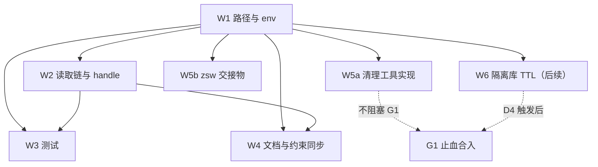

# zcode 引擎会话库隔离 实施计划

基线: 59f095b25 | 来源设计: docs/design/zcode-session-db-isolation.md（v10，设计层收敛） | 日期: 2026-09-08

> 本计划承接设计文档 §5 的 W1–W6 拆分，把**实现级细节**（文件锚点行号、工具 CLI 参数、
> SQL 语句、断言命令、常量字面量）从设计层下沉到本文件。设计文档后续瘦身时以本文件为实现级 SSOT；
> **设计决策本身仍以设计文档为准，本文件不发明新决策**。

## 0 章节映射

| 内容 | 设计文档实际位置 |
|------|------------------|
| 背景/目标 | §1 背景目标（SCQA / G1–G5 / in-scope / out-of-scope） |
| 终态/机制 | §3 解决方案（§3.1 方案对比 / §3.2 D1–D7 / §3.3 实施不变量 6 条） |
| 验收场景表 | §4 验收（A1–A12 + 探针挂钩①–⑤） |
| 下一层拆分 | §5 下一层拆分（W1–W6 + W5b 表 + 版本排序 + 风险回退） |
| 待验证检查点 | ①§2.4.1 伴生面债务（`docs/todo/伴生面治理.md`，W4⑦）；②§2.4.2 用量页失真 A/B 裁决；③R9 审查残留 5 项（本文件 §7.2）；④E3「运行期删除」真机形态（§4 探针⑤ 降级路径） |

## 1 目标快照

> 逐字摘录自设计文档 §1（禁止改写；验收条款回溯锚点）。

**一句话结论**：把 xyz-agent 的 zcode 引擎会话库从宿主共享库 `~/.zcode/cli/db/db.sqlite` 切到
**隔离库** `<engineDataDir>/engines/zcode/session-db/db.sqlite`，消除 ZCode GUI 侧边栏污染。

| # | 目标 | 视角 |
|---|------|------|
| G1 | ZCode GUI 侧边栏零污染 | 用户：GUI 里看不到我们派发的 headless 会话 |
| G2 | 功能零回归 | 用户：任务结果、历史详情①级读取、并发/崩溃行为与改造前等价 |
| G3 | 共享面零回归 | 用户：凭据、插件/MCP 继承、`pnpm` store 布局不变 |
| G4 | 存量零迁移 | 用户：改造不动任何既有 record 与宿主库行；历史详情仍可读 |
| G5 | 宿主库行可回收 | 用户：提供独立清理通道（需授权），可选把已污染行清掉 |

**in scope**：隔离库路径与 env 契约；两条读取链白名单；handle 回填；存量兼容；隔离库生命周期与回收判定；
错误规格；存量行清理通道（独立排期）；伴生写入面登记；约束/文档同步。

**out of scope**：① 宿主 `~/.zcode/cli/{artifacts,exec,log,…}` 伴生写入面治理（另案，§2.4.1 已登记债务）；
② zsw 侧清理实现（本仓只交付规格与交接物 W5b）；③ 隔离库自动 TTL 清理（W6，先就绪再触发）；
④ 用量观测面失真的实现修复（§2.4.2 待用户 A/B 裁决）。

## 2 单元列表

| Unit | 职责（摘要） | 领地（精确文件路径） | 依赖 | 隔离 | 验收条款 |
|------|--------------|----------------------|------|------|----------|
| W1 路径与 env | `zcodeSessionDbPath()` / `zcodeDbPathAllowlist()` 两个构造函数 + env 注入（含清空别名键）+ 父目录确保 | 新建 `packages/subagent-core/src/execution/engine/engines/zcode/db-path.ts`；既有 `engines/zcode/zcode-engine.ts`（组装段 648–657）；必要时 `engines/zcode/connection.ts` | —（DAG 根） | plain | A1；探针①；§2.1 规格 |
| W2 读取链与 handle | 两站点改集合成员判定 + handle 回填隔离路径 + `hostZcodeDbPath()` 降级为兼容锚点 + 注释回写 | 既有 `packages/subagent-core/src/execution/engine/common/session-view-service.ts`（`:161`）、`engines/zcode/zcode-engine.ts`（`:407`/`:453`/`:889`/`12-20`/`400`/`872-874`/`1111`）、`engines/zcode/connection.ts`（`:122-123`）、`engines/zcode/constants.ts`（`:7-9`/`:40-44`/`:141`） | W1 | plain | A3/A4；探针②；§2.2 规格 |
| W3 测试 | 单元 + 集成（fake-server）+ 真机 live 用例；含池 GC 守卫（经公共 API） | `packages/subagent-core/src/execution/engine/engines/zcode/__tests__/*`、`engine/__tests__/common/session-view-service-zcode-dbpath.test.ts`、`engine/__tests__/conformance/*`、`packages/runtime/test/subagent-extractor-engine.test.ts`、`packages/runtime/src/__tests__/subagent-extractor-engine.test.ts` | W1/W2 | plain | A1–A4/A6/A9；§2.3 规格 |
| W4 文档与约束同步 | 约束表 / AGENTS / 池边界注释 / 漂移检查 / 权威源文档 / 第六面 / 伴生面债务落点 | `docs/constraints.json` + `docs/constraints.md`（生成物）、`AGENTS.md`、`packages/subagent-core/src/execution/engine/common/pool-manager.ts`（`:14` 注释）、`docs/design/zcode-engine-appserver-resident.md`、`docs/design/subagent-engine-protocolization.md`（H1/A10）、新建 `docs/todo/伴生面治理.md` | W1/W2 | plain | §2.4 规格（文档同步纪律 C-proc-10） |
| W5a 清理工具实现 | 按 D7 规格实现（I1/I2/I3/I3b + 执行形态 + 索引预检 + 跨库顺序 + 残留清单） | 新建 `scripts/zcode-session-db-cleanup.mjs`（或 `scripts/cleanup/` 下同族脚本）；更新 `docs/design/probes/zcode-session-db/counts.sql`（参照 SQL 可跑化） | W1 | plain | A11；§2.5 规格 |
| W5b zsw 侧交接物 | 导出 `zcodeSessionDbPath` + 仓内规格文件 | 新建 `docs/design/handoff/zsw-session-db-cleanup-spec.md` | W1 | plain | §2.4.3；§2.6 规格 |
| W6 隔离库 TTL（后续项） | 按 D4 重审触发条件启动（体积/行龄阈值 → 清理策略） | 新增设计或小改 `session-file-gc` 同域 | D4 触发后 | plain | D4 触发后另立；§2.7 规格 |

**版本与排序**：W1 + W2 必须同批（env 与 handle 分叉会立刻产生读取降级）；W3 随 W1/W2 同批交付；
W4 在合入前完成；W5a/W5b/W6 独立排期（不阻塞 G1）。

---

### 2.1 W1 规格（路径与 env）

- **路径（单一构造函数）**：`zcodeSessionDbPath(engineDataDir) = join(engineDataDir, "engines", "zcode", "session-db", "db.sqlite")`。
  **选址在池目录之外**（不落 `engines/zcode/shared/`——那是 journal 池目录，被 `deletePoolNativeState` 覆盖，F11）。
  journal 路径不变（仍 `engines/zcode/shared/journal-<taskId>.jsonl`）。
- **落点**：新建 `engines/zcode/db-path.ts`——`constants.ts` 头注要求「零 import 纯常量」，而构造函数需 `node:path`；
  `hostZcodeDbPath()` 一并迁入并改写注释，**避开 `zcode-engine → constants → zcode-engine` 环**。
- **env**：在 `zcode-engine.ts` 组装 app-server env 处（组装段 648–657）**覆盖式写入** `ZCODE_SESSION_DB_PATH`
  （忽略宿主继承值）；**同时显式清空同层别名键 `ZCODE_SESSION_DB`**（实装里两者都映射到 `storage.sessionDbPath`，
  按 env 键序后写胜出——当前写法恰然后写，但那是顺序巧合，必须显式化）。
- **父目录**：引擎自身会递归创建（`ensureParentDir`）；我们仍建议启动前 `mkdirSync(recursive:true)`（把权限/磁盘错误提前为可读文案）。
- **禁硬编码**：路径一律由 `engineDataDir`（`deps.engineDataDir()`）推导（pre-commit 路径白名单检查）。
- **验收**：A1；探针①（spawn env 含 `ZCODE_SESSION_DB_PATH` 且等于 `zcodeSessionDbPath(engineDataDir)`，且不含 `ZCODE_SESSION_DB`）。

### 2.2 W2 规格（读取链与 handle）

| 链路 | 位置 | 现状 | 改造后 |
|------|------|------|--------|
| 生产链（GUI 详情页①级读） | `common/session-view-service.ts:161`（`readZcodeNativeTier`） | 只认 `resolve(homedir(), ...ZCODE_HOST_DB_SUFFIX)` | 白名单集合加入 `zcodeSessionDbPath(dataDir)` |
| API 链（`EnginePort.read()`） | `zcode-engine.ts:889` | `dbPathRaw === hostZcodeDbPath()` | 同上（集合成员判定） |
| handle 回填 | `zcode-engine.ts:407` / `:453` | `dbPath: hostZcodeDbPath()` | `dbPath: zcodeSessionDbPath(engineDataDir)` |

- **白名单形态**：`zcodeDbPathAllowlist(dataDir) = {zcodeSessionDbPath(dataDir), hostZcodeDbPath()}`（后者仅存量兼容）。
- **dataDir 权威源与传播前提**：两站点各用**它打开数据库时所用的同一个 dataDir**；当前产品路径下相等，
  靠传播链 runtime `process-manager.ts:136` 注入 `getConfigDir()` → pi 子进程 `{...process.env}`（`session-runner.ts:1764`）→ 引擎 spawn 透传。
  **任一 spawn 点剥掉该 env** → 写侧落 `<piAgentDir>/engines/...` 而读侧按 runtime dataDir 构集合 → ①级**静默**降②级。
  兜底 = 单元断言「xyz-agent spawn 配置下两站点 dataDir 相等」（D3 误配形态单列）。
- **安全边界不变**：record/handle 来自 append-only JSONL（不可信面）→ 只放行集合内**精确绝对路径**，其余拒绝①级、降 journal。
- **注释回写清单**：`zcode-engine.ts:12-20/400/872-874/1111`、`connection.ts:122-123`、`session-view-service.ts:141-165`、`constants.ts:7-9/40-44/141`。
- **验收**：A3/A4；探针②（`onHandleReady` 与终态 handle 的 `dbPath` 相等；两站点集合成员判定一致）。

### 2.3 W3 规格（测试）

- **单元**：env 注入 / 路径单一来源 / 两站点集合成员 / 存量三类读取分支（D3 表三行 + 误配形态）/
  **池 GC 守卫**（经 `acquirePool` / `releasePoolRef` / `cleanupExpiredPoolRefs` **公共 API**，不用模块私有的 `deletePoolNativeState`）/
  两站点 dataDir 相等。
- **集成（fake-server）**：create 帧后断言 fake 侧收到的 env 含隔离路径（探针④）。
- **真机 live 用例**：改断言宿主库零行（A1/A2/A3 各跑一次）。
- **A9 守卫步骤（可执行）**：`dataDir=mkdtempSync()` → `mkdirSync(dirname(zcodeSessionDbPath(dataDir)), {recursive:true})`
  （**入参是父目录，不是 dbPath 本身**）→ 写入 `db.sqlite` + `-wal` + `-shm` →
  (a) `acquirePool(dataDir,'zcode','shared',taskId)` + `releasePoolRef(...)` 归零；
  (b) `cleanupExpiredPoolRefs(dataDir, 0, spyFs)`。
  断言：①三件套**字节不变**；②**枚举断言**——spy 的 `readdirSync` 调用序列命中 `engines/zcode/session-db`（证明真扫到）；
  ③池目录原生状态照常清理（`refs.json`/原生条目被删；`deletePoolNativeState` 对空目录 early-return，池目录本身不会被 rmdir）；
  ④`zcodeSessionDbPath(dataDir)` 不在 `resolvePoolDir(dataDir,'zcode','shared')` 之下。

### 2.4 W4 规格（文档与约束同步）

① `docs/constraints.json` **C-ext-20** 改写（删「与 GUI 共写同一 SQLite」「dbPath 绝对锚定 `ZCODE_HOST_DB_SUFFIX`」两句，
补隔离库语义）+ 跑 `node scripts/render-constraints.mjs` 重生成 `docs/constraints.md`；
② 项目 `AGENTS.md`「架构约定 → zcode 引擎单一 app-server 形态」段同步；
③ `pool-manager.ts:14` 边界注释补「隔离库不在池目录内，但 TTL 扫描会枚举 `session-db/`」；
④ 跑 `node scripts/check-doc-symbol-drift.mjs`；
⑤ `docs/design/zcode-engine-appserver-resident.md` 头部补「2026-09 会话库隔离」修订块；
⑥ 第六面 `docs/design/subagent-engine-protocolization.md` 的 H1/A10 校准；
⑦ **新增 `docs/todo/伴生面治理.md`**（§2.4.1 跟踪落点，含 owner/期限/上界/复测命令）。

### 2.5 W5a 规格（清理工具）

- **识别基准**：白名单 = 自身 record 存储 `engineHandle.sessionRef.sessionId`；
  **解析路径**：只解析 `type='custom' && customType='subagent-record'` 的 entry，**禁止对 JSONL 行做文本/正则提取**；
  结果做「id 形状校验 + 宿主库存在性」双过滤。
- **I1 双计数**：四数分列（白名单总数 / 白名单∩宿主库=直接删除集 / 派生删除集 / 删除集总数）；
  断言「删除集 == 参照 SQL 结果」——参照 SQL = `counts.sql` 内 W5 查询的**单一文本**（宿主库取直接集 + 索引库应用预检，跨双库）。
- **I2 时间戳交叉验证（硬中止，作用域 = 直接删除集）**：`data.startedAt` 与宿主行 `time_created` 差值 ≤ **10s**
  （**全局唯一常量**，禁止在多处写字面量）；取不到或超容差 → 中止并报告该 id。派生集不适用（record 里 0 entry）。
- **I3 形态硬中止（作用域 = 直接删除集）**：任一行 `task_type != 'interactive'` 或 `title_source='custom'` → 中止。
- **I3b 派生集不变量**：每行必须满足 `parent_id ∈ 直接删除集 且 task_type='subagent_child'`，违反即中止。
- **执行形态**：① 交互式确认（stdin 输入「删除集总数」）；② 受控非交互旁路 `--confirm-count <N>` 精确匹配；
  无参数且非 TTY → 拒绝；③ 报告置顶汇总异常信号；④ 确认凭证落盘（输入短语 + 操作者 + 时间戳 + 授权来源）。
- **删除面**：宿主库按 FK 依赖序 + `PRAGMA foreign_keys=ON` + `input_history` 显式删 + 派生行纳入；
  **宿主库不预计算冲突源表**；**索引库零 FK → 四冲突源只读预检必须保留**（命中 → **两侧同时剔除**）。
- **跨库顺序**：每 id **先宿主后索引**（中间态只可能是「宿主已删、索引残留」）；
  残留 id 落盘 `w5-residue-<ts>.json` + `--replay-residue <file>` 补删。
- **备份与停机窗口**：备份三件套 = 整库快照（宿主库 + 索引库 + 隔离库，3.07GB），**回滚粒度 = 整库还原**；
  窗口写者清单 = ① 本仓 pi/runtime 宿主（停）、② zsw（**确认无在途 zsw 任务**——zsw 2.2.0 无常驻 daemon）、③ ZCode GUI（关闭）。
- **验收**：A11（含反向 fixture 两条、非 TTY 拒绝、凭证匹配、索引面 N→0、索引删除失败 fixture、残留清单归空）。

### 2.6 W5b 规格（zsw 交接物）

导出 `zcodeSessionDbPath` 语义 + 落仓内规格文件 `docs/design/handoff/zsw-session-db-cleanup-spec.md`
（SSOT 内容 + 期望 zsw 验收点）；跨仓登记降为「投递动作」：本仓记 owner + 投递日期。

### 2.7 W6 规格（隔离库 TTL，后续项）

按 D4 重审触发条件启动（隔离库 > 2GB / 最早行龄 > 90 天 / 用户报告磁盘异常）；
**阈值 ≈45 天（行龄 90 天 ≈4GB）**；**先就绪再触发，非硬 T+2 周**。

## 3 DAG 图

**关键路径**：W1 → W2 → W3（必须同批）；W4 合入前完成；W5a/W5b/W6 独立排期。

## 4 测试策略

> 命令从仓库真实脚本读取（`packages/*/package.json`）。

| 层级 | 命令 | 说明 |
|------|------|------|
| 单元 + 集成（subagent-core） | `pnpm --filter @zhushanwen/subagent-core test`（= `vitest run`） | W3 全部用例；用例级耗时落 `packages/subagent-core/test-results/vitest-junit.xml` |
| 类型检查（subagent-core） | `pnpm --filter @zhushanwen/subagent-core typecheck`（= `tsc --noEmit`） | W1/W2 改动必跑 |
| runtime 侧 | `pnpm --filter @xyz-agent/runtime test`（= `vitest run`） | `subagent-extractor-engine` 相关用例 |
| 等价性 | `pnpm --filter @xyz-agent/runtime test:equivalence` | 如涉及 applyEntry 路径 |
| 文档漂移 | `node scripts/check-doc-symbol-drift.mjs` | W4 必跑 |
| 约束渲染 | `node scripts/render-constraints.mjs` | W4 必跑（改 `constraints.json` 后） |
| 复跑证据 | `sqlite3` + `docs/design/probes/zcode-session-db/counts.sql`（W5 节） | I1 参照 / Δ 分布 / 碰撞面；**注意 §7.2 R9-1/R9-2 的两个可跑性缺陷** |
| 真机 | `pnpm dev` + 真实 zcode 凭据 + ZCode GUI | A1/A2/A3/A8/A11 的场景验证（非 mock） |

## 5 合理偏差登记表

（初始为空；实施期出现合理不一致时登记于此，并同步设计文档措辞。）

## 6 状态表

| Unit | 状态 | 轮次 | 证据指针 |
|------|------|------|----------|
| W1 路径与 env | pending | 0 | — |
| W2 读取链与 handle | pending | 0 | — |
| W3 测试 | pending | 0 | — |
| W4 文档与约束同步 | pending | 0 | — |
| W5a 清理工具实现 | pending | 0 | — |
| W5b zsw 交接物 | pending | 0 | — |
| W6 隔离库 TTL | pending | 0 | — |

## 7 残留风险与变更历史

### 7.1 设计层已接受代价（引用设计文档，不在本计划重复论证）

| 代价 | 设计位置 | 重审触发 |
|------|----------|----------|
| 宿主 `~/.zcode/cli/*` 伴生写入面无通道 | §2.4.1 | 上界 100G / 可用 <100G / 周增速 >10G → `docs/todo/伴生面治理.md` |
| ZCode GUI 用量页今日口径失真 | §2.4.2 | 用户裁决「不可接受」或今日 tokens 连续 3 日 > 100M |
| zsw 侧需自行清理 | §2.4.3 | W5b 投递后 zsw 侧反馈 |
| 隔离库无 per-session 删除粒度 | §3.2 D4 | W6 启动 |
| I2 时间戳判据的残余风险（±10s 窗内碰撞 ≈3/1642） | §3.2 D7 | 出现误删报告或碰撞计数 > 10 |

### 7.2 R9 审查残留（实现级，随本计划交付）

| # | 项 | 落点 | 处置 |
|---|----|------|------|
| R9-1 | `counts.sql` 第 0 步 `.mode json` + `.import` 实测跑不通（JSONL 整行落一列 → `startedAt` 恒 NULL，Δ/碰撞假阴） | `counts.sql` | W5a：改成可跑的导入方式（先转 CSV 或 node 直写 sqlite） |
| R9-2 | `counts.sql` W5 ② 索引预检命令原样直跑报 `no such table: wl.wl`（白名单库只 ATTACH 在宿主库会话） | `counts.sql` | W5a：参照链路写全（或在宿主库会话内 ATTACH 索引库） |
| R9-3 | 设计文档 `:518` 残留「只读查宿主库得 50 + 4」旧口径 | 设计文档 A11 段 | W4：统一指向 `counts.sql` W5 单一文本 |
| R9-4 | `--replay-residue` 清单文件无防篡改/过期面 | W5a | 逐 id 形状 + 存在性校验 + 复用索引预检四冲突源（命中跳过并报告）+ `--confirm-count <清单条数>` + replay 前断言宿主行确不存在；fixture：篡改清单混入真实用户索引 id → 拒删并报告；过期 id → no-op 报告 |
| R9-5 | 「zsw re-vendor 进程必须在窗口内停用」不可执行（zsw 无常驻进程） | W5a 写者清单 | 改为可执行检查「确认无在途 zsw 任务」（进程画像 + `pgrep`） |
| R9-6 | 停机窗口写者清单缺「用户手动终端 zcode CLI」 | W5a | 补入清单 |
| R9-7 | counts.sql W5 节头注释未随 ④⑤ 更新、`10000` 字面量缺指向权威常量的注释 | `counts.sql` | W5a：注释与常量来源单一化 |

### 7.3 待验证检查点

| # | 检查点 | 验证方式 | 阻塞关系 |
|---|--------|----------|----------|
| C1 | A2 真实 GUI 侧边栏零污染 | 真机（GUI 打开 worktree → 重启 GUI → 看侧边栏） | **阻塞 G1 验收**；不通过 → 撤 W1 env 注入（一行回退）+ 按方案 B 补 `titleGenerationEnabled:false` |
| C2 | A5/A6 是否暴露「共享库假设」被别处依赖（如插件按宿主库路径读历史） | 真机 + 插件/MCP 场景 | 阻塞合入；处置同 C1 |
| C3 | E3「运行期删除」真实形态（unlink 后写入 + 重启后新库） | 实施期补真机探针 | 不通过 → **仅回改 E3/A8② 措辞**，D4 与方案不变 |
| C4 | 「宿主已删、索引残留」的 GUI 可恢复性 | A11 真机观测 | 不通过 → 改双向事务或清单补删为唯一通道 |
| C5 | §2.4.2 用量页失真 A/B 用户裁决 | 合入评审时点 | 沉默 → 视为分支 A（Release Notes 知情条目随合入发布） |

### 7.4 变更历史

| 日期 | 变更 | 说明 |
|------|------|------|
| 2026-09-08 | 建立本计划 | 从设计文档 v10 抽取实现级细节；单元 W1–W6 与设计 §5 一一对应 |
| 2026-09-08 | 收入 R9 残留 7 项 | R9 审查（3 MF + 3 S 主审 / 2 MF + 2 S 影响面）的实现级项按 §7.2 落位，不再改设计文档 |
