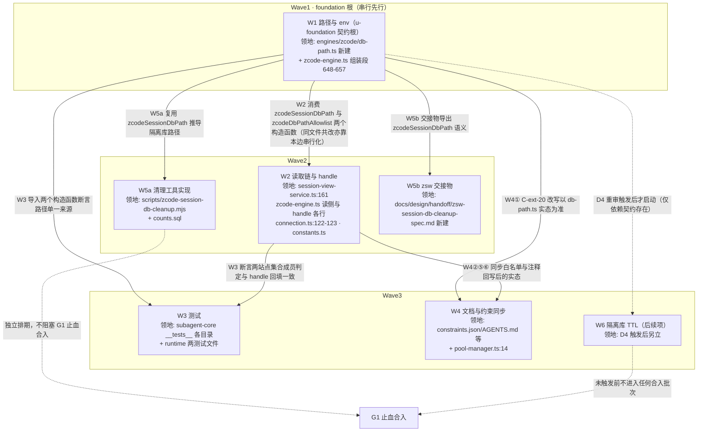

# zcode 引擎会话库隔离 实施计划

基线: df0139a39 | 来源设计: docs/design/zcode-session-db-isolation.md（v11，分层拆分后设计层 SSOT） | 日期: 2026-09-08

> 本计划承接设计文档 §5 的 W1–W6 拆分，把**实现级细节**（文件锚点行号、工具 CLI 参数、
> SQL 语句、断言命令、常量字面量）从设计层下沉到本文件。设计文档后续瘦身时以本文件为实现级 SSOT；
> **设计决策本身仍以设计文档为准，本文件不发明新决策**。
> 编写规范：按 dev-flow `flow/plan.md` 八章节模板 + `references/dag-authoring.md` 规范组织
> （§7.5 附写盘前自检清单勾选结果）；R9 审查残留（5 MF + 5 S：R9-1–R9-7 七项实现级 + R9-8/R9-9 两条 impact-S 去向）登记于 §7.2，并在对应单元规格 §2.x 内显式交叉引用。

## 0 章节映射

| 内容 | 设计文档实际位置 |
|------|------------------|
| 背景/目标 | §1 背景目标（SCQA / G1–G5 / in-scope / out-of-scope） |
| 终态/机制 | §3 解决方案（§3.1 方案对比 / §3.2 D1–D7 / §3.3 实施不变量 6 条） |
| 验收场景表 | §4 验收（A1–A12 + 探针挂钩①–⑤） |
| 下一层拆分 | §5 下一层拆分（W1–W6 + W5b 表 + 版本排序 + 风险回退） |
| 待验证检查点 | ①§2.4.1 伴生面债务（`docs/todo/伴生面治理.md`，W4⑦）；②§2.4.2 用量页失真 A/B 裁决；③R9 审查残留（R9-1–R9-7 七项实现级 + R9-8/R9-9 impact-S 去向登记，本文件 §7.2，单元规格 §2.4/§2.5 已交叉引用）；④E3「运行期删除」真机形态（§4 探针⑤ 降级路径） |

## 1 目标快照

> 本节为设计文档**逐字摘录**（禁止改写；验收条款回溯锚点）。摘录范围：一句话结论 = 设计文档头部结论块（`:3-6`）；
> 设计目标表 / in scope / out of scope = 设计文档 §1（`:104-122`）。可加粗，不改词。

**一句话结论**：把 zcode 引擎 app-server 的会话库从宿主 `~/.zcode/cli/db/db.sqlite` 隔离到
xyz-agent 引擎数据目录下的**独立会话库**（spawn env `ZCODE_SESSION_DB_PATH`，**已真机探针验证**），
使 subagent 会话不再进入 ZCode GUI 侧边栏；HOME 保持共享（凭据 / 插件 / MCP / pnpm store 语义零变化），
**不**重启 2026-09 已删除的池 / 锁 / pidfile 复杂度。

**设计目标**（从使用者体验倒推）

| # | 目标 | 使用者视角 |
|---|------|-----------|
| G1 | 侧边栏零污染 | 在任意目录跑 zcode subagent，ZCode GUI 侧边栏（含重启后）都不多出会话 |
| G2 | 现有能力零回归 | subagent 执行、GUI 详情页历史（①级 sqlite）、凭据 / 插件 / MCP、并发与 abort 全部与改造前等价 |
| G3 | 不重启复杂度 | 不引入 HOME 池 / 目录锁 / pidfile / 派生目录；pnpm store 与 HOME 语义零变化 |
| G4 | 存量兼容 | 改造前产生的 record（含池时代相对路径、共享 HOME 时代宿主绝对路径）仍能读历史 |
| G5 | 残留可回收 | 隔离库归 xyz-agent 独占，具备可判定的清理通道（我们拥有全部行 + 存量宿主行可用自己的 record 白名单定位）；**口径 = 「行可回收」**（磁盘回收另需 VACUUM） |

**in scope**：zcode 引擎会话库路径隔离（spawn env + 两条读取链白名单 + 存量兼容 + 隔离库回收 +
存量宿主行清理通道）；相关测试与文档/约束同步。

**out of scope**：
① 修改 zcode CLI / GUI 源码（用户约束，排除）；
② `~/.zcode/cli/{artifacts,exec,log,…}` 等**伴生写入面**的治理（磁盘残留，与侧边栏无关）——
**但本设计必须穷举登记它们**（§2.4.1），因为「隔离库」只解决侧边栏，不解决磁盘；
③ zsw（z-code-plugin-workspace）侧代码改动——但**必须分析其连带影响**（§2.4.3）；
④ 让隔离后的会话「在 GUI 里可见但折叠」——GUI 无此 API（§2.5）。

## 2 单元列表

| Unit | 职责 | 领地（精确文件路径） | 依赖 | 隔离(plain/worktree) | 验收条款 |
|------|------|----------------------|------|----------------------|----------|
| W1 路径与 env（**u-foundation 共享契约根**——`db-path.ts` 构造函数被 W2/W3/W5a/W5b 消费，DAG 唯一根，串行先行，禁止与后继单元并行共改） | `zcodeSessionDbPath()` / `zcodeDbPathAllowlist()` 两个构造函数 + `hostZcodeDbPath()` 迁入（zcode-engine.ts 保留 re-export）+ env 注入（含清空别名键）+ 父目录确保 | 新建 `packages/subagent-core/src/execution/engine/engines/zcode/db-path.ts`（契约根文件）；既有 `engines/zcode/zcode-engine.ts` 组装段 648–657 + `hostZcodeDbPath()` 迁出面 `:117-120`（函数定义与注释）+ import 块 `:75-93`（`ZCODE_HOST_DB_SUFFIX` import 去留）（与 W2 共改此文件：行区间互斥 + 串行边 W1→W2 保证，见 §3）；必要时 `engines/zcode/connection.ts`（仅 env 组装面，与 W2 的 `:122-123` 注释回写行区间互斥，同上串行保证） | —（DAG 根） | plain | A1；探针①（spawn env 断言）；§2.1 规格 |
| W2 读取链与 handle | 两站点改集合成员判定 + handle 回填隔离路径 + `hostZcodeDbPath()` 降级为兼容锚点 + 注释回写 | 既有 `packages/subagent-core/src/execution/engine/common/session-view-service.ts`（`:161`）、`engines/zcode/zcode-engine.ts`（`:407`/`:453`/`:889`/`12-20`/`400`/`872-874`/`1111`——`1111` 实施时人工确认：该行为凭据文案注释与库路径无关，无关则从清单移除；与 W1 共改此文件：W1 组装段 648–657 + `:117-120`/`:75-93` 迁出面，行区间互斥 + 串行边 W1→W2 保证）、`engines/zcode/connection.ts`（`:122-123`，与 W1 必要时触碰的 env 组装面行区间互斥）、`engines/zcode/constants.ts`（`:7-9`/`:40-44`/`:141`） | W1 | plain | A3/A4；探针②（handle 一致性断言）；既有 suite 全绿（翻转清单 §2.3）；§2.2 规格 |
| W3 测试 | 单元 + 集成（fake-server）+ 真机 live 用例；含池 GC 守卫（经公共 API） | `packages/subagent-core/src/execution/engine/engines/zcode/__tests__/*`、`engine/__tests__/common/session-view-service-zcode-dbpath.test.ts`、`engine/__tests__/conformance/*`、`packages/runtime/test/subagent-extractor-engine.test.ts`、`packages/runtime/src/__tests__/subagent-extractor-engine.test.ts` | W1/W2 | plain | A1–A4/A6/A9；探针③④；§2.3 规格 |
| W4 文档与约束同步 | 约束表 / AGENTS / 池边界注释 / 漂移检查 / 权威源文档 / 第六面 / 伴生面债务落点 / 设计文档 `:502` 口径句修正（R9-3） / drift 守卫 DOC_MODULE_MAP 登记（⑨） | `docs/constraints.json` + `docs/constraints.md`（生成物）、`AGENTS.md`、`packages/subagent-core/src/execution/engine/common/pool-manager.ts`（`:14` 注释）、`docs/design/zcode-engine-appserver-resident.md`、`docs/design/subagent-engine-protocolization.md`（H1/A10）、`docs/design/zcode-session-db-isolation.md`（**仅 A11 双口径段 `:502` 口径句**，见 §2.4⑧）、新建 `docs/todo/伴生面治理.md`、`scripts/check-doc-symbol-drift.mjs`（DOC_MODULE_MAP 登记段，§2.4⑨） | W1/W2 | plain | §2.4 规格（文档同步纪律 C-proc-10）+ `node scripts/check-doc-symbol-drift.mjs` 登记后通过（⑨） |
| W5a 清理工具实现 | 按 D7 规格实现（I1/I2/I3/I3b + 执行形态 + 索引预检 + 跨库顺序 + 残留清单）；承接 §7.2 R9-1/R9-2/R9-4/R9-5/R9-6/R9-7 | 新建 `scripts/zcode-session-db-cleanup.mjs`（若拆多文件则 `scripts/cleanup/` 下同族脚本，均归本单元独占）；更新 `docs/design/probes/zcode-session-db/counts.sql`（R9-1/R9-2/R9-7 可跑性修复） | W1 | plain | A11（含 §7.2 R9-4 replay fixture 两条）；§2.5 规格 |
| W5b zsw 侧交接物 | 导出 `zcodeSessionDbPath`（= db-path.ts 模块级 export，W1 交付物；不新增 package.json subpath exports）+ 仓内规格文件 + owner/投递日期 | 新建 `docs/design/handoff/zsw-session-db-cleanup-spec.md` | W1 | plain | §2.4.3；§2.6 规格 |
| W6 隔离库 TTL（后续项） | 按 D4 重审触发条件启动（体积/行龄阈值 → 清理策略） | 新增设计或小改 `session-file-gc` 同域 | D4 触发后 | plain | D4 触发后另立；§2.7 规格 |

**版本与排序**：W1 + W2 必须同批（env 与 handle 分叉会立刻产生读取降级）；W3 随 W1/W2 同批交付；
W4 在合入前完成；W5a/W5b/W6 独立排期（不阻塞 G1）。

---

### 2.1 W1 规格（路径与 env；u-foundation 契约根）

> **foundation 角色说明**：本单元产出的 `db-path.ts` 两个构造函数是 W2（集合成员判定）、W3（测试导入）、
> W5a（清理工具路径推导）、W5b（交接物导出语义）的共同消费契约——对应 dag-authoring 的 u-foundation
> 共享契约根，故 DAG 中串行先行（Wave1 独占），其后继单元才解锁。

- **路径（单一构造函数）**：`zcodeSessionDbPath(engineDataDir) = join(engineDataDir, "engines", "zcode", "session-db", "db.sqlite")`。
  **选址在池目录之外**（不落 `engines/zcode/shared/`——那是 journal 池目录，被 `deletePoolNativeState` 覆盖，F11）。
  journal 路径不变（仍 `engines/zcode/shared/journal-<taskId>.jsonl`）。
- **落点**：新建 `engines/zcode/db-path.ts`——`constants.ts` 头注要求「零 import 纯常量」，而构造函数需 `node:path`；
  `hostZcodeDbPath()` 一并迁入并改写注释，**避开 `db-path → zcode-engine → db-path` 环（allowlist 需 `hostZcodeDbPath()`，随迁断环；constants.ts 零 import 非环参与者）**。
- **hostZcodeDbPath 迁移站点**：函数定义与注释 `zcode-engine.ts:117-120`（export function 于 `:118-119`）+ import 块 `:75-93`（`ZCODE_HOST_DB_SUFFIX` import 去留）；既有测试 import（`zcode-engine-timeout.test.ts:33`、`zcode-engine-status.test.ts:35`）**不动**——处置 = `zcode-engine.ts` 保留 `hostZcodeDbPath` re-export、测试 import 来源不变（§2.3 翻转清单注明）。
- **env**：在 `zcode-engine.ts` 组装 app-server env 处（组装段 648–657）**覆盖式写入** `ZCODE_SESSION_DB_PATH`
  （忽略宿主继承值）；**同时显式清空同层别名键 `ZCODE_SESSION_DB`**（实装里两者都映射到 `storage.sessionDbPath`，
  按 env 键序后写胜出——当前写法恰然后写，但那是顺序巧合，必须显式化）。
- **父目录**：引擎自身会递归创建（`ensureParentDir`）；我们仍建议启动前 `mkdirSync(recursive:true)`（把权限/磁盘错误提前为可读文案）。
- **禁硬编码**：路径一律由 `engineDataDir`（`deps.engineDataDir()`）推导（pre-commit 路径白名单检查）。
- **同文件共改边界**：本单元对 `zcode-engine.ts` 的改动 = 组装段 648–657 + `hostZcodeDbPath()` 迁出面 `:117-120`（函数定义与注释）+ import 块 `:75-93`；W2 对同一文件的改动在
  `:407`/`:453`/`:889`/`:12-20`/`:400`/`:872-874`/`:1111`——行区间互斥，且串行边 W1→W2 保证不并行写（§3）。
- **验收**：A1；探针①（spawn env 含 `ZCODE_SESSION_DB_PATH` 且等于 `zcodeSessionDbPath(engineDataDir)`，且不含 `ZCODE_SESSION_DB`）。

### 2.2 W2 规格（读取链与 handle）

| 链路 | 位置 | 现状 | 改造后 |
|------|------|------|--------|
| 生产链（GUI 详情页①级读） | `common/session-view-service.ts:161`（`readZcodeNativeTier`） | 只认 `resolve(homedir(), ...ZCODE_HOST_DB_SUFFIX)` | 白名单集合加入 `zcodeSessionDbPath(dataDir)` |
| API 链（`EnginePort.read()`） | `zcode-engine.ts:889` | `dbPathRaw === hostZcodeDbPath()` | 同上（集合成员判定） |
| handle 回填 | `zcode-engine.ts:407` / `:453` | `dbPath: hostZcodeDbPath()` | `dbPath: zcodeSessionDbPath(engineDataDir)` |

- **白名单形态**：`zcodeDbPathAllowlist(dataDir) = {zcodeSessionDbPath(dataDir), hostZcodeDbPath()}`（后者仅存量兼容）。
- **dataDir 权威源与传播前提**：两站点各用**它打开数据库时所用的同一个 dataDir**；当前产品路径下相等，
  靠传播链 runtime `process-manager.ts:136` 注入 `getConfigDir()` → pi 子进程 `{...process.env}`（`session-runner.ts:1764`）→ 引擎 spawn 透传。
  **任一 spawn 点剥掉该 env** → 写侧落 `<piAgentDir>/engines/...` 而读侧按 runtime dataDir 构集合 → ①级**静默**降②级。
  兜底 = 单元断言「xyz-agent spawn 配置下两站点 dataDir 相等」（D3 误配形态单列）。
- **安全边界不变**：record/handle 来自 append-only JSONL（不可信面）→ 只放行集合内**精确绝对路径**，其余拒绝①级、降 journal。
- **同文件共改边界**：本单元与 W1 共改 `zcode-engine.ts`（本单元行区间见 §2 表；W1 组装段 648–657 + `:117-120`/`:75-93` 迁出面）与
  `connection.ts`（本单元 `:122-123` 注释回写；W1 仅 env 组装面）——两处**行区间互斥 + 串行边 W1→W2 保证**。
- **注释回写清单**：`zcode-engine.ts:12-20/400/872-874/1111`、`connection.ts:122-123`、`session-view-service.ts:141-165`、`constants.ts:7-9/40-44/141`。
- **验收**：A3/A4；探针②（`onHandleReady` 与终态 handle 的 `dbPath` 相等；两站点集合成员判定一致）；既有 suite 全绿（断言翻转清单 §2.3）。

### 2.3 W3 规格（测试）

- **单元**：env 注入 / 路径单一来源 / 两站点集合成员 / 存量三类读取分支（D3 表三行 + 误配形态）/
  **池 GC 守卫**（经 `acquirePool` / `releasePoolRef` / `cleanupExpiredPoolRefs` **公共 API**，不用模块私有的 `deletePoolNativeState`）/
  两站点 dataDir 相等。
- **集成（fake-server）**：create 帧后断言 FAKE_CLI 子进程回写的 process.env 含 `ZCODE_SESSION_DB_PATH` 且不含 `ZCODE_SESSION_DB`（env 不随 RPC 帧传输；参照 `connection.test.ts:388` env 快照先例）（探针④）。
- **真机 live 用例**：改断言宿主库零行（A1/A2/A3 各跑一次）。
- **A9 守卫步骤（可执行）**：`dataDir=mkdtempSync()` → `mkdirSync(dirname(zcodeSessionDbPath(dataDir)), {recursive:true})`
  （**入参是父目录，不是 dbPath 本身**）→ 写入 `db.sqlite` + `-wal` + `-shm` →
  (a) `acquirePool(dataDir,'zcode','shared',taskId)` + `releasePoolRef(...)` 归零；
  (b) `cleanupExpiredPoolRefs(dataDir, 0, spyFs)`。
  断言：①三件套**字节不变**；②**枚举断言**——spy 的 `readdirSync` 调用序列命中 `engines/zcode/session-db`（证明真扫到）；
  ③池目录原生状态照常清理（`refs.json`/原生条目被删；`deletePoolNativeState` 对空目录 early-return，池目录本身不会被 rmdir）；
  ④`zcodeSessionDbPath(dataDir)` 不在 `resolvePoolDir(dataDir,'zcode','shared')` 之下。
- **既有断言翻转清单**（W3 必改；期望值统一改 `zcodeSessionDbPath(engineDataDir)`；已核实行号）：
  - `zcode-engine-status.test.ts:161` —— `dbPath: hostZcodeDbPath()` toEqual 断言翻转；
  - `zcode-engine-timeout.test.ts:306` —— 同上（`dbPath: hostZcodeDbPath()` toEqual）；
  - `zcode-engine-appserver.test.ts:248` / `:477` —— `expectedHostDbPath` 独立展开，改隔离路径；
  - `zcode-engine.live.test.ts:89` —— 真机门宿主路径改隔离路径；头注 `:9` 旧口径句同步改写；
  - `session-view-service-zcode-dbpath.test.ts:33` —— 「唯一合法绝对 dbPath」注释前提失效，注释随断言同改；
  - import 来源不变：`zcode-engine.ts` 保留 `hostZcodeDbPath` re-export，`zcode-engine-timeout.test.ts:33` / `zcode-engine-status.test.ts:35` 测试 import 不动。
  - **W1 期补录（2026-09-09 实测遗漏）**：`zcode-engine-appserver.test.ts:288-289` —— 「engines/zcode/ 目录封闭断言」（池时代残留守卫）`toEqual(["appserver-launcher.cjs"])` 因 W1 mkdirSync 合法新建 `session-db/` 而红；期望列表纳入 `"session-db"`（保持封闭断言语义），W1 committed 前翻转完成

### 2.4 W4 规格（文档与约束同步）

① `docs/constraints.json` **C-ext-20** 改写（删「与 GUI 共写同一 SQLite」「dbPath 绝对锚定 `ZCODE_HOST_DB_SUFFIX`」两句，
补隔离库语义）+ 跑 `node scripts/render-constraints.mjs` 重生成 `docs/constraints.md`；
② 项目 `AGENTS.md`「架构约定 → zcode 引擎单一 app-server 形态」段同步；
③ `pool-manager.ts:14` 边界注释补「隔离库不在池目录内，但 TTL 扫描会枚举 `session-db/`」；
④ 跑 `node scripts/check-doc-symbol-drift.mjs`（验收 = ⑨ 登记后脚本通过）；
⑤ `docs/design/zcode-engine-appserver-resident.md` 头部补「2026-09 会话库隔离」修订块；**同批**撤销 `:12`「已接受代价：GUI 会话列表可见 headless 会话」句、`:19`「handle.dbPath 锚定 `ZCODE_HOST_DB_SUFFIX`」句改写为隔离库口径（与修订块同批，防同页矛盾）；
⑥ 第六面 `docs/design/subagent-engine-protocolization.md` 的 H1/A10 校准；
⑦ **新增 `docs/todo/伴生面治理.md`**（§2.4.1 跟踪落点，含 owner/期限/上界/复测命令）；
⑧ **含 §7.2 R9-3**：`docs/design/zcode-session-db-isolation.md` A11 双口径段 `:502` 的「独立参照 SQL……只读查宿主库得 50 + 4」
旧口径句改为指向 `counts.sql` W5 单一文本（跨双库、含索引预检口径）——**仅口径句替换，不动决策内容**；
counts.sql 路径与节名已存在，本项不依赖 W5a 的可跑性修复先行。
⑨ `scripts/check-doc-symbol-drift.mjs` 的 DOC_MODULE_MAP 登记 `docs/design/zcode-session-db-isolation.md` + 本 impl-plan → 映射源码目录 `packages/subagent-core/src/execution/engine`（防守卫对两文档空转；④ 的「脚本通过」以本登记为前提）。

### 2.5 W5a 规格（清理工具）

> 本单元承接 §7.2 **R9-1 / R9-2 / R9-4 / R9-5 / R9-6 / R9-7** 全部条款，逐条标注在对应小节。

- **识别基准**：白名单 = 自身 record 存储 `engineHandle.sessionRef.sessionId`；
  **解析路径**：只解析 `type='custom' && customType='subagent-record'` 的 entry，**禁止对 JSONL 行做文本/正则提取**；
  结果做「id 形状校验 + 宿主库存在性」双过滤。
- **I1 双计数**：四数分列（白名单总数 / 白名单∩宿主库=直接删除集 / 派生删除集 / 删除集总数）；
  断言「删除集 == 参照 SQL 结果」——参照 SQL = `counts.sql` 内 W5 查询的**单一文本**（宿主库取直接集 + 索引库应用预检，跨双库）；
  该断言的可跑性依赖 **§7.2 R9-1 / R9-2** 的 counts.sql 修复（见下文「counts.sql 可跑性」条）。
- **I2 时间戳交叉验证（硬中止，作用域 = 直接删除集）**：`data.startedAt` 与宿主行 `time_created` 差值 ≤ **10s**
  （**全局唯一常量**，禁止在多处写字面量）；取不到或超容差 → 中止并报告该 id。派生集不适用（record 里 0 entry）。
- **I3 形态硬中止（作用域 = 直接删除集）**：任一行 `task_type != 'interactive'` 或 `title_source='custom'` → 中止。
- **I3b 派生集不变量**：每行必须满足 `parent_id ∈ 直接删除集 且 task_type='subagent_child'`，违反即中止。
- **执行形态**：① 交互式确认（stdin 输入「删除集总数」）；② 受控非交互旁路 `--confirm-count <N>` 精确匹配；
  无参数且非 TTY → 拒绝；③ 报告置顶汇总异常信号；④ 确认凭证落盘（输入短语 + 操作者 + 时间戳 + 授权来源）。
- **删除面**：宿主库按 FK 依赖序 + `PRAGMA foreign_keys=ON` + `input_history` 显式删 + 派生行纳入；
  **宿主库不预计算冲突源表**；**索引库零 FK → 四冲突源只读预检必须保留**（命中 → **两侧同时剔除**）。
- **跨库顺序**：每 id **先宿主后索引**（中间态只可能是「宿主已删、索引残留」）；
  残留 id 落盘 `w5-residue-<ts>.json` + `--replay-residue <file>` 补删。
  **replay 前置断言（含 §7.2 R9-4 防篡改条款）**：逐 id 形状校验 + 索引库 `tasks` 存在性校验 +
  **复用索引预检四冲突源**（命中 → 跳过并报告，不删）+ `--confirm-count <清单条数>`（同主路径纪律，防陈旧清单）+
  replay 前逐 id 断言宿主行确不存在（否则拒绝并提示先对齐两库备份状态，防制造「索引已删、宿主残留」反向中间态）；
  fixture：篡改清单混入真实用户索引 id → 拒删并报告；过期 id（已不在索引）→ no-op 报告。
- **备份与停机窗口**：备份 = 三库整库快照（宿主库 + 索引库 + 隔离库）；3.07GB 为宿主+索引两库实测值（设计 D7），隔离库另计（量级见设计 D4）——隔离库纳入理由 = 回滚面完整；**回滚粒度 = 整库还原**。
  窗口写者清单（**含 §7.2 R9-5 / R9-6**）：
  ① 本仓 pi/runtime 宿主（停——硬停）；
  ② zsw——**可执行判定**：zsw 2.0+ 为 CLI 一次性进程、无常驻 daemon，「停用进程」不可执行 →
  **窗口开始前**执行 `pgrep -flE "zsw|zcode.*app-server"`（覆盖 zsw CLI 与其在途 app-server 子进程；实施期用真实在途进程核验画像后钉死）**断言空输出**；
  非空 → **中止窗口启动并列出全部命中进程**（等其终态或由操作者按进程级精确定位处理后重跑检查）；
  ③ ZCode GUI（关闭——硬停）；
  ④ **用户手动终端 zcode CLI 进程**（提示用户窗口内无在途 zcode 终端会话——此前清单漏项，§7.2 R9-6）。
  ②④ 为「尽力检查」（best-effort：只能证明检查时点无匹配进程，无法证明持续零在途）；①③ 为硬停（确定性可验证动作）。
- **counts.sql 可跑性（含 §7.2 R9-1 / R9-2 / R9-7）**：第 0 步装载改可跑方式（node 逐行导出 `sessionId,startedAt`
  CSV，或直接生成 `INSERT INTO wl VALUES(...)` 语句；`.import` 前置 `.mode csv`），
  修复后 ④Δ 分布 / ⑤碰撞面查询不得因 `startedAt` NULL 假阴；
  W5 ② 索引预检命令先 `ATTACH DATABASE '<白名单库>' AS wl` 再在同一索引库会话内执行（或白名单 id 内联 IN 列表）；
  W5 节头注释随 ①–⑤ 步数更新；`10000` 容差字面量补注释「权威值见 D7 I2，改容差须同步此处」。
- **验收**：A11（含反向 fixture 两条、非 TTY 拒绝、凭证匹配、索引面 N→0、索引删除失败 fixture、残留清单归空、
  §7.2 R9-4 replay fixture 两条）。

### 2.6 W5b 规格（zsw 交接物）

导出 `zcodeSessionDbPath` 语义（= db-path.ts 模块级 export，W1 交付物；**不新增 package.json subpath exports**）+ 落仓内规格文件 `docs/design/handoff/zsw-session-db-cleanup-spec.md`
（SSOT 内容 + 期望 zsw 验收点）；跨仓登记降为「投递动作」：W5b 仅落规格文件 + 本仓记 owner + 投递日期。
**消费方式钉死**：zsw 侧唯一受支持形态 = vendored 整包源码深导入 `db-path.ts`；npm 安装形态**不可达**（core `package.json` 无 db-path 子入口 exports、根 barrel 不导出该函数）——规格文件必须显式写明此边界，避免 zsw 按 npm 形态接线。

### 2.7 W6 规格（隔离库 TTL，后续项）

按 D4 重审触发条件启动（隔离库 > 2GB / 最早行龄 > 90 天 / 用户报告磁盘异常）；
**阈值 ≈45 天（行龄 90 天 ≈4GB）**；**先就绪再触发，非硬 T+2 周**。

## 3 DAG 图

**关键路径与合入批次**：W1 → W2 → W3；**W1+W2+W3 必须同批合入**（env 与 handle 分叉会立刻产生读取降级）
——「同批」指合入批次而非派发 barrier：dag-authoring 调度为流式，单元 committed 即解锁后继补派；
W4 在合入前完成；W5a/W5b/W6 独立排期（不阻塞 G1）。

## 4 测试策略

> 命令从仓库真实脚本读取：`packages/subagent-core/package.json`（`test` = `vitest run`、`typecheck` = `tsc --noEmit`）、
> `packages/runtime/package.json`（`test` = `vitest run`、`test:equivalence` = `vitest run src/__tests__/equivalence/`）。
> 增量与全量分开列。

**全量（合入门禁）**

| 层级 | 命令 | 说明 |
|------|------|------|
| 单元 + 集成（subagent-core） | `pnpm --filter @zhushanwen/subagent-core test`（= `vitest run`） | W3 全部用例；用例级耗时落 `packages/subagent-core/test-results/vitest-junit.xml` |
| 类型检查（subagent-core） | `pnpm --filter @zhushanwen/subagent-core typecheck`（= `tsc --noEmit`） | W1/W2 改动必跑 |
| runtime 全量 | `pnpm --filter @xyz-agent/runtime test`（= `vitest run`） | `subagent-extractor-engine` 相关用例回归 |
| 等价性 | `pnpm --filter @xyz-agent/runtime test:equivalence` | 如涉及 applyEntry 路径 |
| 文档漂移 | `node scripts/check-doc-symbol-drift.mjs` | W4 必跑 |
| 约束渲染 | `node scripts/render-constraints.mjs` | W4 必跑（改 `constraints.json` 后） |
| 存量零迁移（A10） | 改造前后宿主库行数对比 + record diff 命令（counts.sql 基线复跑） | 合入门禁：存量宿主行零丢失（行数不减、record 可 diff 对齐） |
| 真机 | `pnpm dev` + 真实 zcode 凭据 + ZCode GUI | A1/A2/A3/A8/A11 场景验证（非 mock）；**A7**（宿主库零新增）= A1–A6 跑毕后聚合统计（counts.sql 复跑对比改造前基线）；**A12**（伴生面 diff `~/.zcode/` 与 §2.4.1 登记一致）= C1 同批真机批次（A1–A6 后） |

**增量（单元开发内环，仅跑受影响面）**

| 适用单元 | 命令 | 说明 |
|----------|------|------|
| W1/W2 | `pnpm --filter @zhushanwen/subagent-core exec vitest run src/execution/engine` | 只跑引擎域用例（zcode 目录 + common） |
| W3 单文件迭代 | `pnpm --filter @zhushanwen/subagent-core exec vitest run <测试文件路径>`（runtime 侧测试换 `--filter @xyz-agent/runtime`） | vitest 支持文件路径过滤 |
| W4 | §4 全量表「文档漂移」「约束渲染」两命令即其增量 | 无测试套件 |
| W5a | `sqlite3` + `docs/design/probes/zcode-session-db/counts.sql`（W5 节） | I1 参照 / Δ 分布 / 碰撞面复跑；**依赖 §7.2 R9-1/R9-2 的可跑性修复先行** |

## 5 合理偏差登记表

| # | 偏差 | 内容 | 裁决 / 证据 |
|---|------|------|------------|
| D-1 | flow/plan.md 阶段 0.3 门改判 | flow/plan.md 0.3 门要求设计文档 must_fix==0；实测 R9 最新一轮 **5 MF**（主审 MF1=:518 口径 / MF2=counts.sql 装载链 / MF3=索引预检跨库；影响面 MF1=--replay-residue 防篡改 / MF2=zsw 停用不可执行）+ 5 S（3 项落 §7.2 R9-4/6/7；2 项 design 层措辞已随本轮修复设计文档）全为实现级，无决策级 must-fix，已逐条落本计划 §7.2 与单元验收条款。经用户 2026-09-08 裁决改判：设计层无决策级 must-fix 即通过 | 证据 = `.review/design-review-db-isolation-r9.md` 与 `.review/design-review-db-isolation-r9-impact.md`；变更登记见 §7.4 |

（其余初始为空；实施期出现合理不一致时登记于此，并同步设计文档措辞。）

## 6 状态表

| Unit | 状态(pending/in-progress/committed/blocked) | 轮次 | 证据指针 |
|------|----------------------------------------------|------|----------|
| W1 路径与 env | committed | 1 | commit 见 git log `feat(subagent-core): W1 db-path contract + env injection`；test_evidence = 引擎域 453 passed / 0 failed（`vitest run src/execution/engine`）+ typecheck 零错误；翻转清单含 W1 期补录条（§2.3） |
| W2 读取链与 handle | pending | 0 | — |
| W3 测试 | pending | 0 | — |
| W4 文档与约束同步 | pending | 0 | — |
| W5a 清理工具实现 | pending | 0 | — |
| W5b zsw 交接物 | pending | 0 | — |
| W6 隔离库 TTL | pending | 0 | — |

## 7 残留风险与变更历史

### 7.1 设计层已接受代价（引用设计文档，不在本计划重复论证）

| 代价 | 设计位置 | 重审触发 |
|------|----------|----------|
| 宿主 `~/.zcode/cli/*` 伴生写入面无通道 | §2.4.1 | 上界 100G / 可用 <100G / 周增速 >10G → `docs/todo/伴生面治理.md` |
| ZCode GUI 用量页今日口径失真 | §2.4.2 | 用户裁决「不可接受」或今日 tokens 连续 3 日 > 100M |
| zsw 侧需自行清理 | §2.4.3 | W5b 投递后 zsw 侧反馈 |
| 隔离库无 per-session 删除粒度 | §3.2 D4 | W6 启动 |
| I2 时间戳判据的残余风险（±10s 窗内碰撞 ≈3/1642） | §3.2 D7 | 出现误删报告或碰撞计数 > 10 |

### 7.2 R9 审查残留（实现级，随本计划交付）

| # | 项 | 落点 | 处置 | 单元规格交叉引用 |
|---|----|------|------|------------------|
| R9-1 | `counts.sql` 第 0 步 `.mode json` + `.import` 实测跑不通（JSONL 整行落一列 → `startedAt` 恒 NULL，Δ/碰撞假阴） | `counts.sql` | W5a：改成可跑的导入方式（先转 CSV 或 node 直写 sqlite） | §2.5「counts.sql 可跑性」 |
| R9-2 | `counts.sql` W5 ② 索引预检命令原样直跑报 `no such table: wl.wl`（白名单库只 ATTACH 在宿主库会话） | `counts.sql` | W5a：参照链路写全（或在宿主库会话内 ATTACH 索引库） | §2.5「counts.sql 可跑性」 |
| R9-3 | 设计文档 `:502` 残留「只读查宿主库得 50 + 4」旧口径 | 设计文档 A11 段 | W4：统一指向 `counts.sql` W5 单一文本 | §2.4⑧ |
| R9-4 | `--replay-residue` 清单文件无防篡改/过期面 | W5a | 逐 id 形状 + 存在性校验 + 复用索引预检四冲突源（命中跳过并报告）+ `--confirm-count <清单条数>` + replay 前断言宿主行确不存在；fixture：篡改清单混入真实用户索引 id → 拒删并报告；过期 id → no-op 报告 | §2.5「跨库顺序（replay 前置断言）」 |
| R9-5 | 「zsw re-vendor 进程必须在窗口内停用」不可执行（zsw 无常驻进程） | W5a 写者清单 | 改为可执行检查「确认无在途 zsw 任务」（进程画像 + `pgrep`） | §2.5「备份与停机窗口」② |
| R9-6 | 停机窗口写者清单缺「用户手动终端 zcode CLI」 | W5a | 补入清单 | §2.5「备份与停机窗口」④ |
| R9-7 | counts.sql W5 节头注释未随 ④⑤ 更新、`10000` 字面量缺指向权威常量的注释 | `counts.sql` | W5a：注释与常量来源单一化 | §2.5「counts.sql 可跑性」 |
| R9-8 | r9-impact S1：设计 `:287`「用户报告 → 立即执行 W5 清理工具」与停机窗口编排节奏冲突 | 设计文档 `:287` | 已修复：设计文档改「启动 W5 清理流程」（本轮） | —（design 层措辞，无单元落点） |
| R9-9 | r9-impact S2：A11 fallback「双向事务」为未定义一次性术语 | §7.3 C4 | 去向 = C4 不通过时独立设计（非本计划范围）；§7.3 C4 行已补注 | §7.3 C4 |

### 7.3 待验证检查点

| # | 检查点 | 验证方式 | 阻塞关系 |
|---|--------|----------|----------|
| C1 | A2 真实 GUI 侧边栏零污染 | 真机（GUI 打开 worktree → 重启 GUI → 看侧边栏）；同批真机批次（A1–A6 后）附 **A12** 伴生面 diff（`~/.zcode/` 与 §2.4.1 登记一致）与 **A7** 宿主库零新增聚合统计（counts.sql 复跑对比基线） | **阻塞 G1 验收**；不通过 → 回退 W1 env 注入（env 覆写 + 别名清空共 2 处）+ 同步回退 W2 handle 回填（`zcode-engine.ts:407`/`:453` 两站点）→ 新 record 恢复宿主绝对路径；白名单集合可保留（第二项本就兼容）+ 按方案 B 补 `titleGenerationEnabled:false`；**回退同批连带回翻 §2.3 既有断言翻转清单**（期望值恢复 `hostZcodeDbPath()` 口径），否则四个测试文件必红（响亮信号，不属静默回归，但须在回退操作单内列明） |
| C2 | A5/A6 是否暴露「共享库假设」被别处依赖（如插件按宿主库路径读历史） | 真机 + 插件/MCP 场景 | 阻塞合入；处置同 C1 |
| C3 | E3「运行期删除」真实形态（unlink 后写入 + 重启后新库） | 实施期补真机探针 | 不通过 → **仅回改 E3/A8② 措辞**，D4 与方案不变 |
| C4 | 「宿主已删、索引残留」的 GUI 可恢复性 | A11 真机观测 | 不通过 → 改双向事务或清单补删为唯一通道（届时独立设计，非本计划范围） |
| C5 | §2.4.2 用量页失真 A/B 用户裁决 | 合入评审时点 | 沉默 → 视为分支 A（Release Notes 知情条目随合入发布） |
| C6 | A10 存量零迁移（改造不丢存量宿主行） | 合入门禁：改造前后宿主库行数对比 + record diff 命令（counts.sql 基线复跑） | 阻塞合入；行数减少或 record 丢失 → 中止排查 |

### 7.4 变更历史

| 日期 | 变更 | 说明 |
|------|------|------|
| 2026-09-08 | 建立本计划 | 从设计文档 v10 抽取实现级细节；单元 W1–W6 与设计 §5 一一对应 |
| 2026-09-08 | 收入 R9 残留 7 项 | R9 审查（3 MF + 3 S 主审 / 2 MF + 2 S 影响面）的实现级项按 §7.2 落位，不再改设计文档 |
| 2026-09-08 | 按 flow/plan.md 模板与 dag-authoring 规范重设计本计划 | §1 改设计文档逐字摘录；§2 表标注 W1 foundation 契约根与 W1/W2 同文件行区间互斥；§2.5 落 R9-5 pgrep 可执行判定并交叉引用 R9 各条；§3 边全部带原因并分层；§4 增量与全量分开列；§5 登记 0.3 门改判（D-1，用户裁决：设计层无决策级 must-fix 即通过）；§7.5 附自检清单结果 |
| 2026-09-08 | 计划层对抗式审查 R1 全量修复（7 MF + 8 S） | MF-1 设计锚点 `:518`→`:502` ×3；MF-2 hostZcodeDbPath 迁移站点入 W1 领地（`:117-120`/`:75-93` + re-export 处置）；MF-3 §2.3 增既有断言翻转清单 + W2 验收补「既有 suite 全绿」；MF-4 A7/A10/A12 认领落位（§4 + §7.3 C1/C6 + §7.5-4）；MF-5 C1 回退补 W2 handle 回填两站点；MF-6 drift 守卫 DOC_MODULE_MAP 登记（§2.4⑨）；MF-7 D-1 计数纠正（8 MF → 5 MF + 5 S，「窗口写者清单缺项」移出 MF 枚举）；S-1 §7.2 增 R9-8/R9-9 impact-S 去向；S-2 备份口径拆两库实测/隔离库另计；S-3 断环表述改 `db-path → zcode-engine → db-path`；S-4 W5b 导出语义钉死；S-5 W4⑤ appserver-resident 同批撤销/改写两句；S-6 pgrep 画像 `-flE "zsw\|zcode.*app-server"`；S-7 探针④ 改 env 快照断言；S-8 `:1111` 凭据文案注释人工确认加注 |
| 2026-09-09 | R2 聚焦复审通过（主审 0 MF + 1 S / 影响面 0 MF + 1 S），2 S 当轮修复 | R1 全部 7 MF + 8 S 修复经复核成立（计数账目闭合、关键锚点实核命中、自报攻击点防住）。S-9（主审）C1 回退条款补「§2.3 断言翻转清单连带回翻」句；S-10（影响面）§2.6 补 W5b 消费方式钉死（vendored 深导入唯一受支持、npm 形态不可达） |
| 2026-09-09 | W1 开发期：翻转清单补录一条（实施期合理偏差登记） | W1 实测发现 `zcode-engine-appserver.test.ts:288-289`「engines/zcode/ 目录封闭断言」不在 §2.3 清单内，因 W1 mkdirSync 合法新建 `session-db/` 而红（因果明确，非行为回归）；§2.3 补录第 7 条，期望列表纳入 `"session-db"`，W1 committed 前由修复轮翻转 |

### 7.5 dag-authoring 写盘前自检清单（2026-09-08 重设计勾选结果）

| # | 清单项 | 结论 |
|---|--------|------|
| 1 | 任意两单元领地交集为空 | ✅ 例外两处均已显式说明（§2 表两行领地列）：① `engines/zcode/zcode-engine.ts`——W1 组装段 648–657 + `hostZcodeDbPath()` 迁出面 `:117-120` 与 import 块 `:75-93`，W2 在 `:407`/`:453`/`:889`/`:12-20`/`:400`/`:872-874`/`:1111`，行区间互斥；② `engines/zcode/connection.ts`——W1 仅 env 组装面（必要时），W2 仅 `:122-123` 注释回写。两处同属串行链 W1→W2（§3），不并行写。其余单元领地两两不交 |
| 2 | 每条边有原因标注 | ✅ §3 全部 10 条边（7 实线 + 3 虚线）均带 `|\|"原因"\|` 标注 |
| 3 | u-foundation 存在且为根 | ✅ W1（`db-path.ts` 的 `zcodeSessionDbPath`/`zcodeDbPathAllowlist` 契约）被 W2/W3/W5a/W5b 消费；DAG 唯一根，Wave1 串行先行 |
| 4 | 每行验收条款独立可判 | ✅ 各单元验收条款 = 设计验收场景号（剧本在设计文档 §4）+ 探针断言①–⑤（可执行断言，细则在 §2.x）或具体命令（如 W4 的 doc-drift 脚本）；场景认领：A1–A6/A8/A9/A11 挂对应单元或真机行，A7/A10/A12 三项不挂单元——认领位置：A7 = A1–A6 真机收尾聚合统计（§4 真机行 / §7.3 C1）、A10 = 合入门禁（§4 全量表 + §7.3 C6）、A12 = C1 同批真机批次（§7.3 C1） |
| 5 | 每层单元数与并发 ≤5 兼容 | ✅ Wave1=1 / Wave2=3 / Wave3=3；最大同时并发 3 |
| 6 | 隔离列与热点文件分析一致 | ✅ 全部 plain：唯一同文件共改（W1/W2 的 `zcode-engine.ts` 与 `connection.ts`）已由行区间互斥 + 串行边消解；无并行单元触碰同一热点公共文件；非实验性大改；用户未指定 worktree → 按 dag-authoring 决策表全部不开 worktree |
