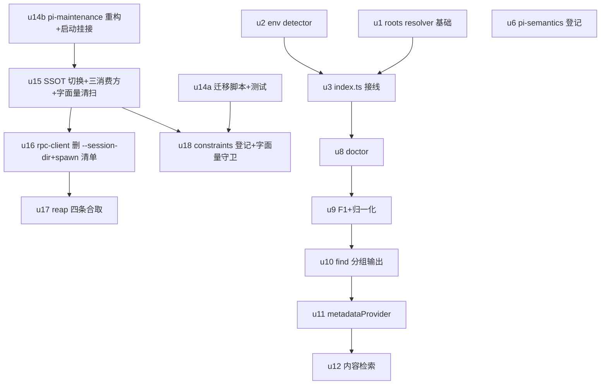

# session-reader 会话根发现与布局对齐 实施计划

基线: `60978ae1b` | 来源设计: [2026-09-10-session-root-discovery-and-env-transparency.md](2026-09-10-session-root-discovery-and-env-transparency.md) | 日期: 2026-09-10

> 模型路由说明：本 harness（zcode）的 Agent 工具不暴露 per-task 模型参数，全部 subagent 使用 harness 配置的 provider（GLM-5.3-Flash 系）。全局 AGENTS.md 的模型路由表在本环境无可选面，不构成等待点。
> 范围声明：本流水线交付 M-1 → M0-M3 → M4（设计 §9.1）。**M5（U13 双仓同步）时机绑定 merge 发版，不在本流水线**，状态表登记为 deferred；U4/U5/U7/V7 按 §6.13 B 先行路径**不建**。

## 0 章节映射

| 内容 | 设计文档实际位置 |
|------|------------------|
| 背景/目标 | §1 背景（含 1.1 两宿主两布局 / 1.3 布局沿革）· §2 设计目标（6 条 + In/Out-of-scope） |
| 终态/机制 | §5 终态（5.3 布局终态）· §6 关键决策（6.1-6.13）· §7 实现机制（7A runtime 侧 / 7B extension 侧） |
| 验收场景表 | §8.2（V1-V11 + 回归基线；V7 作废不执行） |
| 下一层拆分 | §10（U1-U18）+ §10.1 文件改动地图 |
| 待验证检查点 | §11（1-14）+ §12.1 探针清单（P-1~P-12）；⛔ 实施期门：P-6 / P-11 / P-12 / §11.11 / §11.14 |
| 对抗审查证据 | git 提交链 `2f3160052..3a56d28af`（第 5-10 轮修复逐 commit）+ 文档 §12.4 变更历史 v9 系列——两审查 agent（主审 / 影面审）第 10 轮双收敛 **0 must-fix / 0 suggestion**。无盘面旁路报告文件（审查经 task-notification 在会话内完成，结论已由提交链与变更历史固化） |

## 1 目标快照（逐字摘录）

**本章结论**（§2）：改造后，agent 在任何宿主下都能用 `session_read` 完成「定位 → 阅读 → 检索」全流程，无需任何 shell 搜盘。

1. **任何宿主下主 session 全 action 可见**：`find`（uuid / recent / 关键词三条匹配路径）以及 `family` / `export{format:"family"}` 等按 id 解析的 action，候选集必须包含当前宿主的全部主 session。
2. **失败时能自证，且不给出错误归因**：定位失败的错误信息必须携带「发现层内部状态」（每个候选根路径 + 文件数）+ 一条**确定能成功**的替代动作 + 明确的禁止项；**不得**在证据不足时断言「真的没有这个 session」。
3. **环境透明**：agent 能直接问出「我现在跑在纯 pi 还是 xyz-agent/TaiJi，数据目录在哪」，不必靠猜或探测。
4. **主 session 可按人话检索**（范围限定）：能用标题（如「福耀玻璃深度研究」）、cwd、时间检索**当前宿主会话根**内的主 session，不必记 uuid。
5. **跨会话内容检索**（阶段二）：能回答「哪个 session 讨论过 X」，而不是只能按元数据匹配。
6. **布局完整对齐现版 pi**（方案 B，先行）：xyz-agent 的数据布局与 pi 0.84.x 完全同构，唯一差异是根目录（`~/.pi/` vs `~/.xyz-agent/`）。

**Out-of-scope**（§2 逐字）：不改任何 session 文件的**格式**；不改 pi 源码（[MANDATORY] 上游不改）；不做 TUI 侧改动；不在工具 description 里注入环境信息；不引入持久化索引文件。

## 2 单元列表

| Unit | 职责 | 领地（精确文件路径） | 依赖 | 隔离 | 验收条款 |
|---|---|---|---|---|---|
| **u14a** | U14a 手工迁移脚本：§6.11 六步 + 三判前置（实参形态 / pgrep -f 进程自证 / pi+backup 三分支）+ 续传分支（备份名 ts 最大）+ 分域并道（记录型文件级并入 / provider 三件套 keyed union（auth 顶层、models 与 providers 在 `.providers`）+ 健康侧防御降级 + tmp+rename 原子写 / 偏好旧赢新避让 / 独立凭据新赢旧避让）+ 冲突清单报告 + 顶层残片清单 + 旧备份清单 | `scripts/migrate-pi-layout-v2.mjs`（新增）；`scripts/__tests__/migrate-pi-layout-v2.test.mjs`（新增） | 无 | plain | ① `cd scripts && npx vitest run __tests__/migrate-pi-layout-v2.test.mjs` 全绿：覆盖 V9⑥ 幂等三态、V9⑦ 分域并道全场景（X/Y/伴随字段/畸形两形态/独立凭据/偏好）、V9⑧ 负向（进程命中列 PID / 非 `.xyz-agent*` 拒绝）、报告字段（备份体积/回滚命令/残片/冲突清单）② P-11 实测登记（真实 `~/.xyz-agent/pi/sessions` 首行 cwd 覆盖率，只读）③ tmp 真实布局副本端到端跑通 V9①②③④ |
| **u14b** | pi-maintenance 重构：`migrateToPiSubdir` 目录迁移段退役；`syncBundledResources()` 独立直挂 runtime 启动；启动残留探测 WARN（判据 = `<dataDir>/pi` 存在且含 `agent/` 或 `sessions/` 子目录，指引跑迁移脚本）；`getPiGlobalAgentDir` 推导改从 `getDataDir()` 起（U15② 同文件并入）；清除本文件对 `getPiRoot` 的全部依赖（为 u15 删除该函数清障） | `packages/runtime/src/infra/pi/pi-maintenance.ts`；`packages/runtime/src/index.ts`（启动挂接段 `:188-200` 附近）；pi-maintenance 相关既有测试（实施时定位，无则补最小单测） | 无 | plain | ① runtime 增量测试绿 ② `grep -n "getPiRoot\|migrateToPiSubdir" packages/runtime/src -r` 无目录迁移段残留 ③ WARN 探测单测：`pi/` 含 agent\|sessions 形态 → WARN + 指引文案；不含 → 静默 |
| **u15** | U15 路径 SSOT 切换 + 三消费方改造 + 字面量清扫：`getPiAgentDir→join(getDataDir(),'agent')`、`getSessionsDir→join(getPiAgentDir(),'sessions')`、`getPiRoot` 删除；①usage-stats 扫描改两层 ②session-fork `buildForkTarget` 写 encodeCwd 子目录（`getPiGlobalAgentDir` 已在 u14b）；字面量清扫按「数据布局清 / 资源布局豁免」两栏（豁免：`pi-maintenance.ts` bundled 同步源、`prepare-pi-resources.sh` resources/pi） | `packages/shared/src/paths.ts`；`packages/runtime/src/infra/pi/pi-paths.ts`；`packages/runtime/src/services/usage/usage-stats-service.ts` + `usage-stats-service.test.ts`；`packages/runtime/src/services/session/session-fork.ts` + `packages/runtime/src/__tests__/session-fork-fields.test.ts`；`packages/runtime/src/infra/__tests__/spawn-env.test.ts`；`scripts/probe-pi-sw-snapshot.mjs`；`scripts/verify-plugin-contract.sh`；`workflow-extractor.ts` 注释（实施时定位精确路径）；`AGENTS.md`；`docs/troubleshooting.md` | u14b | plain | ① SSOT 函数新值生效 + `getPiRoot` 全仓无引用 ② usage-stats 两层扫描用例（encodeCwd 子目录文件被统计）③ fork 写子目录用例（与 `import-service.ts:252` 形态对齐断言）④ 数据布局字面量清零：`grep -rn "'pi',\s*'sessions'\|'pi',\s*'agent'" packages/ apps/ scripts/ --include="*.ts" --include="*.mjs"` 仅剩豁免面 ⑤ runtime + shared 增量测试绿 |
| **u16** | U16 rpc-client：删 `--session-dir` argv；新增 spawn 清单写入 `<dataDir>/run/pi-spawn-markers.json`（仅 staged 专属三根：打包资源根 / dev 仓库资源根 `<projectRoot>/apps/electron/resources/extensions/` / `<dataDir>` 下 `extensions/`+`npm/` 子树；每次 spawn 全量重算覆盖写，tmp+rename 原子）；核验 `options.extensionPaths` 恒传（§11.11） | `packages/runtime/src/infra/pi/rpc-client.ts`；清单写入逻辑（同文件或 `packages/runtime/src/infra/pi/spawn-markers.ts` 新增）；对应测试（`packages/runtime/src/infra/__tests__/` 下新增或既有） | u15 | plain | ① spawn argv 断言无 `--session-dir`（测试）② 清单写入单测：三根形态收录 / 用户路径（`~/.pi`、项目 `.pi`、`~/.agents`）排除 / 全量重算覆盖 / tmp+rename 原子 ③ §11.11 核验结论登记（调用链恒传或登记例外） |
| **u17** | U17 reap 判据替换：`matchesOwnPiArgv` 改四条合取（`--mode rpc` + `--no-extensions` 存在 + 任一 `--extension`/`--skill` 值 ∈ 清单精确相等 + ppid=1）；清单缺失 → 跳过收殓 + 日志；收殓范围扩大声明注释 | `packages/runtime/src/services/reap-orphan-pi.ts`；`packages/runtime/src/services/reap-orphan-pi.test.ts` | u16 | plain | ① 测试全绿，覆盖 V10 子项单测化：正向（清单内值+`--no-extensions`+ppid=1 收殓）/ 反向三态（裸 pi 交互、无 `--no-extensions`、值不在清单均不杀）/ 清单缺失跳过 ② DIR 常量与断言同步（无旧布局字面量） |
| **u18** | U18 constraints 登记 + 字面量守卫：①constraints.json 新增 C-pi 布局对齐契约条目 + `render-constraints.mjs` 重生成 md ②独立检查器 `scripts/check-layout-literals.mjs`（显式文件范围 packages/+apps/+scripts/+AGENTS.md+docs/troubleshooting.md；模式 `'pi','agent'`/`'pi','sessions'` join 形态与 `xyz-agent*/pi/` 上下文字符串；**排除 `.pi` 前缀**；集中豁免常量表 `LAYOUT_LITERAL_EXEMPT`：bundled 同步源 / find-pi-executable.ts:47 / prepare-pi-resources.sh / 迁移脚本本体）③挂 pre-commit 新段（`.githooks/install-hooks.sh`） | `docs/constraints.json`；`docs/constraints.md`（重生成）；`scripts/check-layout-literals.mjs`（新增）；`scripts/__tests__/check-layout-literals.test.mjs`（新增）；`.githooks/install-hooks.sh`（新增段） | u15、u14a | plain | ① `node scripts/render-constraints.mjs` 后 constraints.md 含新条目、`node scripts/check-pi-semantics.mjs` 不受影响 ② 检查器单测：旧布局字面量报红 / 豁免表放行 / `.pi` 前缀不误报（覆盖 mock/settings-data.ts 等已知合法引用）③ 对全仓实跑 exit 0（豁免面完备）④ install-hooks.sh 重装后 pre-commit 含新段 |
| **u1** | U1（foundation）`resolveSessionRoots(signals)`：四根标签（`[live]` 规范化 encodeCwd 剥层 / `[default]` / `[legacy]` / `[subagent]`；B 收缩无 `[env]`）+ realpath 去重（保留最高优先级 kind）+ 复用 `scanJsonlRecursive`；旧签名薄包装保留；`subagents.ts` not-found 文案改列实际候选根（U7 文案部分并入） | `extensions/universal/session-reader/src/discovery/roots.ts`；`extensions/universal/session-reader/src/discovery/subagents.ts`（仅 not-found 文案段）；`extensions/universal/session-reader/src/__tests__/roots.test.ts` | 无 | plain | ① roots.test 全绿：三宿主信号包 table-driven（纯 pi / xyz-agent / ctx 缺失降级）+ `[live]` 剥层两形态 + 去重保标签 ② 发现层零 pi 依赖不破（import 边界不变） |
| **u2** | U2 `detectEnvironment(signals)`：合取（`XYZ_AGENT_EXT_LOG==='1'` 且 `PI_CODING_AGENT_DIR` 匹配 `<*>/.xyz-agent*/agent` **双形态兼容**）+ distribution（bundle 路径 packaged/dev/null）+ `evidence[]` 恒输出 | `extensions/universal/session-reader/src/discovery/env.ts`（新增）；`extensions/universal/session-reader/src/__tests__/env.test.ts`（新增） | 无（∥u1） | plain | ① env.test 全绿：合取正反例 / 单信号透传污染反例（`XYZ_AGENT_EXT_LOG` 单独成立不判托管）/ bundle 路径三态 / B 前后两种 PI_CODING_AGENT_DIR 形态 |
| **u6** | U6 `docs/pi-semantics.json` 登记 6 条：①ENV_SESSION_DIR 变量名 ②session 目录优先级链 ③ctx.sessionManager 非 mode-gated ④getSessionDir() 双形态 ⑤默认布局构造式 `<agentDir>/sessions/<encodeCwd>` ⑥settings.sessionDir 静默覆盖位（各配 pi-anchor + 探针） | `docs/pi-semantics.json` | 无（∥） | plain | ① `node scripts/check-pi-semantics.mjs` 通过 ② 6 条各有 anchor 与既有条目格式一致 |
| **u3** | U3 `index.ts` 信号采集接线：`execute` 组装信号包（可选链 `ctx?.sessionManager?.getSessionDir?.()` / `process.env` / `import.meta.url`）+ `handleSessionRead` 签名 `agentDir→signals`（tool-handler 签名段）；`ctx===undefined` 降级 | `extensions/universal/session-reader/src/index.ts`；`extensions/universal/session-reader/src/tool-handler.ts`（仅签名段）；`extensions/universal/session-reader/src/__tests__/index.test.ts` | u1、u2 | plain | ① `index.test.ts:97`（`ctx===undefined`）仍通过且断言 `👉` 文案 ② 新增 `sessionManager` 缺方法降级用例 ③ extension 增量测试 + typecheck 绿 |
| **u8** | U8 `doctor` action：schema enum + handler 分支 + `renderDoctor`（环境判定 + evidence + 根表〔来源/路径/存在/文件数/耗时〕+ 事实型诊断 + legacy 非空告警 + `pi/` 残留与 `pi.backup-v2-*/` 独立 glob 标注〔基点 `dirname(agentDir)` + 形态判据〕）+ 进程内缓存（keyed by path，秒级 TTL / mtime 失效；**find 不读缓存**）+ subagent 根默认不扫 | `extensions/universal/session-reader/src/index.ts`（enum + description 一词 + guideline 一句）；`extensions/universal/session-reader/src/tool-handler.ts`（doctor 分支 + renderDoctor + 缓存）；`extensions/universal/session-reader/src/__tests__/tool-handler.test.ts`（doctor 段） | u3 | plain | ① doctor 用例：四根表渲染 + 去重注记 + legacy 非空告警正反 + 残留 glob 两形态（`pi/` 含/不含子目录形态、`pi.backup-v2-*`）+ subagent 根不扫 + 缓存命中与 find 不读缓存 ② description/guidelines 变更仅三处（§6.4 缓存一次性代价面） |
| **u9** | U9 F1 重写 + uuid 归一化：两级匹配（精确子串 + `norm` 归一化）；`looksLikeUuidFragment` 用 `norm(query)`；`formatNoMatch` 重写（事实型自检行〔本次实扫计数〕+ 编辑距离 top-N + 三条做法 + doctor 提示 + 禁止项一行；无「去用 recent」误导、无「真的没有」断言） | `extensions/universal/session-reader/src/discovery/find.ts`（匹配段）；`extensions/universal/session-reader/src/tool-handler.ts`（formatNoMatch + 编辑距离工具）；`extensions/universal/session-reader/src/__tests__/tool-handler.test.ts`（F1 段） | u8 | plain | ① 大写 / 去连字符 uuid 命中用例 ② F1 文案四要素断言 + 负向断言（不含误导指引、不含归因断言）③ 编辑距离 top-N 用例 ④ 归一化对比基线（§11.5：与现状同组 query 做差，增量仅限大小写/连字符变体） |
| **u10** | U10 `find` 输出增强：按 source 分组 main 置顶（limit 作用于合并列表 / truncated 按合并总量 / subagent 溢出折叠计数行 + `source:"subagent"` 提示）+ 全 id + 可复制调用串；`resolveByFragment` 独立无分组查询不动；`SESSION_ID_PREFIX_LEN` 与 result 通路不动 | `extensions/universal/session-reader/src/tool-handler.ts`（formatFindContent + 分组）；`extensions/universal/session-reader/src/__tests__/tool-handler.test.ts`（分组段） | u9 | plain | ① 分组用例：main 置顶 / limit 配额 / truncated 合并总量 / 折叠计数 ② 回归基线用例：result 批量头行仍 8 字符（`execution-tree.test.ts:747` 不变）、全 id 输出、可复制调用串格式 |
| **u11** | U11 元数据走 `SessionManager.listAll`：`metadataProvider` 注入（index.ts 构造，发现层零 pi 依赖）+ 三条调用策略（惰性：uuid 精确+归一化双零且非纯 hex 才调 / 窄化：仅平铺目录〔无子目录根 + 未剥层 liveDir〕，含子目录根回退首条 user 不退出 keyword 匹配 / TTL 缓存）+ 两条 guard（仅存在根 + 永传非空串；单目录 try/catch 记空继续）+ 纯 TS 降级（首条 user 命中即停，标题留空） | `extensions/universal/session-reader/src/discovery/find.ts`（metadataProvider 注入点 + 策略）；`extensions/universal/session-reader/src/index.ts`（provider 构造）；`extensions/universal/session-reader/src/tool-handler.ts`（注入透传）；`extensions/universal/session-reader/src/__tests__/`（find/tool-handler 对应用例） | u10 | plain | ① 三策略用例：uuid 路径不调 listAll / keyword 才调 / 含子目录根跳过但候选不退出匹配（回退首条 user）② guard 用例：provider 抛错降级记空继续 + 标题留空不报错 ③ 零 pi 依赖边界不变 |
| **u12** | U12 跨会话内容检索：窄化前置（宽搜明确拒绝 + 提示先窄化）+ 字节上限 + 结果渲染（session 列表 + turn 索引 + 可执行调用串） | `extensions/universal/session-reader/src/discovery/find.ts`（内容检索段）；`extensions/universal/session-reader/src/tool-handler.ts`（search 增强渲染）；`extensions/universal/session-reader/src/__tests__/`（对应用例） | u11 | plain | ① 宽搜拒绝用例（候选集超阈值 → 拒绝 + 指引，非静默超时）② 字节上限截断用例 ③ 渲染含 turn 索引与调用串 |
| **u13** | U13 双仓同步（M5）——**deferred，不在本流水线** | （仓外：npm 发版 / `pi update` / `~/Code/pi-session-reader` 重平移 / SKILL.md） | M2 落地 + merge 发版 | — | V11（merge 发版后执行，时机 = merge skill 阶段） |

# u-foundation 说明：extension 侧共享契约根 = u1（`SessionRoot` / `SessionRootSignals` 类型），runtime 侧无新增共享类型模块（SSOT 为原地改值），故不设独立 u-foundation 单元。

## 3 DAG 图

波次（并发 ≤3）：W1 = u14a ∥ u14b ∥ u1 ∥ u2 ∥ u6 → W2 = u15 → W3 = u3 → W4 = u16 → W5 = u8 → W6 = u17 ∥ u18 → W7 = u9 → W8 = u10 → W9 = u11 → W10 = u12。

批次门（orchestrator 核验后推进）：M-1 门（u17、u18 committed 后）跑 V9 tmp 端到端 + §11.14 空 agentDir 自举门 + runtime/extensions 增量测试；M0-M3 门（u10 后）跑 extensions 三连 + V1-V6/V4/V5a 的 pi RPC 实测（阶段 5 统一）；M4 门（u12 后）V5b/V8 实测。

## 4 测试策略

**框架红线**（项目 AGENTS.md）：仅 vitest；配置在子包 vitest.config.ts，从子包目录运行；timer 用例用 fake timers；测试写删目标必须 `mkdtempSync(join(tmpdir(),...))` 自建自删，禁止触碰真实数据目录（`~/.xyz-agent`/`~/.xyz-agent-dev`/`~/.pi`——**只读探测除外**，如 P-11 统计）。

| 层 | 增量（单元开发期） | 全量（阶段 5 / 批次门） |
|---|---|---|
| scripts | `cd scripts && npx vitest run __tests__/<file>` | `cd scripts && npx vitest run` |
| runtime | `cd packages/runtime && npx vitest run <相关 test 路径>` | `cd packages/runtime && npx vitest run` |
| shared | `cd packages/shared && npx vitest run`（有 paths 相关测试则含） | 同左 |
| session-reader | `cd extensions/universal/session-reader && npx vitest run <file>` | `pnpm extensions:typecheck && pnpm extensions:lint && pnpm extensions:test` |
| 仓库级 | — | `pnpm test`（root，--no-bail）+ `pnpm lint` |

真实环境验收（orchestrator 执行，非 subagent）：V9 tmp 副本端到端、§11.14 自举门、V1-V6/V5a/V5b/V8 经 pi RPC 实测（AGENTS.md 规范命令，env 隔离），探针产生的 tmp session 人工清理。

## 5 合理偏差登记表

| # | 偏差 | 对应设计位置 | 裁定理由 | 状态 |
|---|---|---|---|---|
| D-1 | u6 六条登记全部为 observe 型守卫（设计写「各配 pi-anchor + 探针」，预期 probe 型） | §10 U6 行 | 守卫 schema 的 probe 型要求指向真实存在的 .test.ts；u6 领地仅 pi-semantics.json 且与 u1/u3 并行无法依赖其测试产物。verifiedWith 版本门禁对全表生效（pi 升级即 fail），登记意图不受损；后续 u1/u3 测试落地后可将关键条目升级为 probe（登记为可选跟进项） | 合理 |
| D-2 | `SessionRoot` 增加设计类型签名外的两字段：`files: SessionFileMeta[]`（必填）与 `dedupedInto?: SessionRootKind`；`normalizeLiveSessionDir` 一并导出；id 恒等于 kind | §7B 要点 8/4 | §7B 要点 8 要求自检计数「取自本次 find 刚完成的实扫结果」（u9-u11 消费文件列表）；要点 4 要求 doctor 渲染「与 N 同路径，已去重」注记——无 dedupedInto 则被去重根会被误渲染为「存在 0 文件」。服务设计意图的契约补全，下游 u8/u9/u10/u11 直接受益 | 合理 |
| D-3 | 旧签名薄包装「构造 {agentDir} 信号包 → resolveSessionRoots → 过滤」，会额外扫非目标根 | §7B 要点 7 | 与设计「薄包装仅为存量单测与外部深 import」定位一致；工具运行路径 u9+ 切新签名后成本消失 | 合理 |
| D-4 | 新增空 agentDir 防御（返回空根列表，附用例） | §7B（任务未明示） | 最小防御：避免派生式退化为 cwd 相对路径扫到无关目录；附试用例，无行为面扩大 | 合理 |
| D-5 | subagents.ts not-found 失败路径新增一次 resolveSessionRoots 调用（重复扫描） | §6.8/U1 | 仅异常路径；换「实际扫描候选根」事实性列表，正是 U1 文案改造的目的 | 合理 |
| D-6 | `migrateToPiSubdir` 保留 no-op 空壳而非整体删除（pi-provider-store.ts:594 barrel re-export 领地外，整体删除会 TS2305 断编译）；目录迁移与 mkdir 逻辑零残留，注释登记「re-export 清理后可整体删除」 | §6.11 既有函数处置 | 任务允许两形态；逻辑消失即达意图，空壳清除归入 u15 或收尾清扫 | 合理 |
| D-7 | **u14a 领地扩容**（计划期缺口，执行期发现）：+`docs/architecture/data-source-registry.md`（登记条目）+ R1 检查器 ALLOWLIST（`.githooks/check_pi_direct_write.py`） | §6.11 / 检查器自身救济路径 | R1 以 rglob 扫工作树，迁移脚本必然同时含 sessions 路径痕迹（步骤 3/4 分发逻辑）与 writeFile（三件套 union 原子写）→ 被判「直写候选」；脚本对 jsonl 是 rename-only，写的是配置 JSON 与报告——正是检查器救济路径写明的「登记例外」形态。计划期漏列该登记义务，orchestrator 裁定领地扩容；**副作用：u14a 落地前 R1 挡住全仓 commit（含无关的 u14b/u3），提交队列按 u14a → u14b → u3 顺序 flush** | 合理（计划缺口） |
| D-8 | `handleSessionRead` 第二参实做 `SessionRootSignals \| string` 联合 + 入口归一化（任务要求纯 signals 类型） | §7B/§10 U3 | 存量 tool-handler.test.ts / result.test.ts / cross-package 等约 100 处裸 string 调用不在 u3 领地，纯收紧必破 341 全包基线；与 D-3 薄包装裁定同构；工具运行路径恒传完整信号包，类型收紧随 u9+（其领地含 tool-handler.test.ts） | 合理 |
| D-9 | u14a 六条规格空白裁决（非设计明文违反）：①encodeCwd 断言以 pi-paths.ts 实装为准（其头注释示例与自身实现不符，win32 形态 `--C--Users-x-proj--`）；②无 pi 二进制机器自证对象不存在 → 放行并在报告注明（§11.13 空白）；③union 结果与主位深等 → 无写动作（unionSkipped 计数）但冲突照进清单（V9⑥「全跳过」×V9⑦「冲突清单」交互空白，幂等与差异可见兼得）；④双侧同值单文件与 token\* 不产 aside（同值非冲突）；⑤sidecar 前缀判定排除 .jsonl（主文件只走 header 分发，杜绝双规则处理）；⑥非记录型/资源型深层目录递归逐条目分类（步骤 2b 只定义顶层；config/providers.json 经此命中三件套 union——设计意图所需） | §6.11 六步块 | 均为设计未细化处的最小确定性裁决，各附用例；⑥是三件套 union 可生效的前提 | 合理 |
| D-17 | u12 三条裁决：①核心编排放 tool-handler.ts 的 searchAcrossSessions（复用同文件扫描管线），find.ts 只承载候选索引——函数级落点最小耦合；②跨会话 limit 粒度取 per-session（设计未定义，输出规模有界 ≤10×limit）；③触发形态 = session 逗号分隔 id 列表 ≤10（result 批量先例同构），description 三处同步（§6.4 一次性代价面）；④tool-handler.ts max-lines 1765/1200（存量 warning 级加重）——拆分归独立重构，不在本流水线 | §10 U12 / V8 | 均为计划未细化处的最小裁决；④登记为已知技术债 | 合理 |
| D-16 | u11 四条契约补全：①collectCandidates 由薄包装切 `resolveSessionRoots` 根列表（窄化策略②需根级事实；= D-3 预告的工具路径切新签名在本单元落地，find 开始消费 [live] 根）②`MatchedSession.name` 可选字段 + 标题优先渲染（§5.1 形态要求标题可见，否则标题检索命中不可辨识）③标题命中候选的 preview 取元数据 firstMessage 免二次深读 ④TTL=5000ms 与 doctor 同档（§11.3a 实测校准登记为验收期项） | §6.6/§5.1 | 均为实现目标的必要组成；①同时消除 F1 已消除的二次扫盘反模式 | 合理 |
| D-15 | u10 三条裁决：①溢出/配额满的计数为确定下界（>N 形态）而非精确总数——精确总数需 O(命中) 次深读首条 user，truncated 布尔经 +1 探测保持精确等价；②显式 source 过滤查询不参与分组/折叠（显式 source 即折叠提示的展开动作，全 id 与 ↳ 串仍适用）；③一次窗口性 flaky 观测（u9⑥ 去重注记用例 02:40-02:48 高负载窗口 4 连红，双 stash 对照排除本单元，窗口外 14+ 连绿）——登记为 Gate A 全量关注项 | §6.7 子决策 2/3 | ①设计要求 truncated 精确而计数行形态未细化，下界计数符合「折叠为计数行」意图 ②语义自洽 ③非确定性、对照排除，如实登记 | 合理 |
| D-13 | F1 编辑距离候选源 = resolveSessionRoots 实扫 files 提取的 sessionId（设计未细化候选源；与自检计数同批实扫、零额外扫盘）；resolveByFragment/doFind 零匹配路径删去 findSessions('recent') 重复扫盘调用（新文案无 recent 候选） | §6.7/§5.2 | 最小裁决 + 死代码清除；u9 微修复另将 doFind 内部签名改 signals（对外 D-8 联合不变） | 合理 |
| D-14 | u17 接口改名 `ReapOrphanOptions.sessionsDir→dataDir`（v1 的 --session-dir 等值目标语义已死，新语义 = 清单读取根）牵出 3 处计划盲区必改：生产调用方 startup-background-init.ts:82、计划未登记的第二个测试文件 test/reap-orphan-pi.test.ts、u18 守卫测试以 reap 豁免为 fixture 的断言行；另 flagValue 扩展为 collectFlagValues（argv 可重复传 --extension，「任一命中」必须遍历） | §6.12/U17 | 保留死字段双轨会使生产调用静默失效，改名是正确裁决；3 处均为改名的机械组成，orchestrator 授权扩容收口 | 合理（计划盲区） |
| D-12 | u8 两条契约补全：①SessionRoot 增可选 `cached?` 标记（options.cache 命中以缓存值构造、files 恒空）+ `SessionRootScanOptions`（subagents: 'scan'\|'stat'、cache 注入式句柄，TTL/mtime 判定留在 tool-handler 侧）②description 'Ten actions'→'Eleven actions'（保留错误动作数比 6 字节缓存代价更有害，且与 V11 计数 11 一致） | §6.3 同一数据源两处渲染 / §6.4 | ① doctor 不带 options 的消费契约补全（D-2 同方向）②正确性必需；doctor 双实现镜像已被打回消除（§6.3 合规） | 合理 |
| D-11 | spawn 清单登记规则②扩为双 dev 形态：dev 资源根（resources staging）+ **dev 源码根 `<repoRoot>/extensions/`**（resolver dev 分支实际传参形态） | §6.12 | 设计②的前提（dev/build 同源走 resources）与实装不符——dev builtin 路径来自源码根，不扩根则 dev 清单恒空、V10① dev 正向必然失败；源码根是「xyz 自己传的路径」的 dev 形态，符合清单意图；D-u16-1 由 u16 agent 发现并建议，orchestrator 批准；文档措辞同步归 design-code-sync 阶段 | 合理（设计勘误） |
| D-10 | R1 ALLOWLIST 消费逻辑由「文件:行号精确键」改为文件级键（set→dict）+ checker docstring「空集」段与 registry 计数同步 | D-7 追加任务 | 文件级条目不改消费逻辑即永不生效——登记生效的必要组成；命中处仍按 文件：行 在通过报告列出（可观测性保留，未来新增写点不被静默吞）；docstring/计数同步为防漂移义务 | 合理 |

## 6 状态表

| Unit | 状态 | 轮次 | 证据指针 |
|---|---|---|---|
| u14a | committed | 2+1 | 脚本 759 行 + 测试 862 行；32/32 重跑绿；P-11 = 100%（11/11 全有 cwd，只读实测，登记于测试文件头）；CLI 实机负向探针（pgrep 命中 14+84 进程 → 拦截列 PID）；D-7 登记落地（R1 exit 0）；偏差 D-9/D-10 |
| u14b | committed | 3 | 五处改动落地（退役/syncBundledResources 直挂/WARN 探测/getPiGlobalAgentDir 改 getDataDir 推导/getPiRoot 零引用）；F3 打回修复（maxRetries×3）后 9 用例绿重跑；tsc 0；偏差 D-6 |
| u15 | committed | 2 | wave1 24fb71b0f + wave2（probe/verify 脚本、workflow-extractor 注释、troubleshooting 迁移节；AGENTS.md 实测无可清项）；残留 ~18 处生产注释 + ~40 处测试 mock 字面量与 logger.ts:431 移交 u18 守卫批；verify-plugin-contract E2E 实跑 PASS |
| u16 | committed | 3 | 删 --session-dir + spawn-markers（D-11 双 dev 形态）+ §11.11 恒传升格；F3 打回一轮补 maxRetries×9；24 文件 commit 携带 session-dir 断言同步 |
| u17 | fix-round-1 | 2 | 领地内完成（35 用例 + 豁免 12→11 + collectFlagValues 扩展）；3 处计划盲区必改点已授权扩容（D-14），agent 续作中 |
| u18 | committed | 1 | 守卫（19 用例 + 拦截冒烟）+ constraints C-pi-14 + 清扫 105 文件；豁免 13→12（system-prompt 修复后移除）；发现 system-prompt 真实破损已由 u19 收口 |
| u1 | committed | 1 | roots.test 17/17 + 全包 338 绿重跑确认；tsc/eslint 干净；偏差 D-2~D-5 |
| u2 | in-progress | 1 | agent_2102d150 |
| u6 | committed | 1 | PS-28~PS-33 六条 anchor 逐条实装核对（⑤补双锚、⑥修 distPath 缺 core/ 前缀）；守卫 exit 0（33 条）重跑确认；D6 软门禁恢复动作完成（探针族 11 文件/56 用例全绿）；偏差 D-1 |
| u2 | committed | 1 | env.ts + env.test.ts（16 用例）重跑绿；tsc --noEmit exit 0；无偏差 |
| u3 | committed | 1 | index.test 13/13 + 全包 341 绿重跑确认；tsc 0；偏差 D-8 |
| u8 | committed | 2 | doctor action（enum/description+Eleven actions/guidelines 三处 + renderDoctor + 独立 glob 残留探测 + TTL/mtime 缓存句柄 + subagent 默认不扫）；微修复统一数据源（roots.ts +SessionRootScanOptions，镜像 −120 行）；116/116 + 全包 358 绿 + tsc 0；偏差 D-12 |
| u9 | committed | 1 | 2575192b0：归一化两级匹配 + F1 四要素重写 + 编辑距离 top-3；364 全包绿 + tsc 0；偏差 D-13 |
| u10 | committed | 1 | find 分组渲染（main 置顶/limit 配额/truncated 合并总量/折叠计数/全 id+↳串）；373 全包绿 + tsc×2 + eslint 0；偏差 D-15 |
| u11 | committed | 1 | metadataProvider 三层落点（策略在 find.ts / TTL 缓存在 handler 注入边界 / listAll 构造在 index.ts）；385 全包绿 + 零 pi 依赖；偏差 D-16（collectCandidates 切根列表 = D-3 收口） |
| u12 | committed | 2 | 跨会话 search（逗号候选集 ≤10 拒绝式窄化 / 64MB 预算 / turn 索引 + ↳串渲染 / per-session limit）；description 三处收口；393 全包绿 + tsc 0；偏差 D-17 |
| u13 | deferred | — | M5 随 merge 发版触发（设计 §9.1） |

## 7 残留风险与变更历史

**残留风险 / 实施期门**（设计 §11 + §12.1，执行到对应单元时必须消解并回填结论）：

- ⛔ P-11（u14a）：存量主 session 首行 cwd 覆盖率 → 决定 `_migrated-no-cwd/` 占比。
- ⛔ §11.14（M-1 门）：B 后空 `agent/` 自举——tmp 空数据目录启动新版实测；不能自举则「先升后迁」降格、V9 子场景改负向判定。
- ⛔ §11.11（u16）：`options.extensionPaths` 恒传核验。
- ⛔ P-6（M0-M3 验收）：RPC 模式 `getSessionDir()` 实跑值（B 后预期 `<dataDir>/agent/sessions/<encodeCwd>` 子目录形态，`[live]` 剥层判据依赖）。
- ⛔ §11.2（u1 验收）：`[live]` encodeCwd 判据用真实路径集合回归。
- ⛔ §11.3（u11）：listAll 实测耗时校准 TTL；不达预期回退纯 TS 首条 user。
- 已接受残留：窗口期双面失明（§6.11）、`pi/agent/{extensions,npm,tmp}` 迁出残留（§6.11 影面登记）、`~/.xyz-agent/sessions` 旧旧布局不在候选根（§11.7 裁决：不补第四根，迁移脚本步骤 4 兼并）。

**变更历史**：
- 2026-09-10（执行期 1）：u6/u2/u1/u14b 四单元核验通过；u14b commit 被两件事暴露——①首派失败的 hook 报错系旧版生成 hook 的引用错位（期间某 subagent 的 pnpm install 经 prepare 触发 install-hooks 再生，新版 bash -n 通过，不再复现）；②**R1 直写检查扫 untracked 工作树**，u14a 未完成的迁移脚本被拦 → 裁定偏差 D-7（u14a 领地扩容：data-source-registry 条目 + R1 ALLOWLIST），提交队列阻塞至 u14a 落地，flush 顺序 u14a → u14b → u3。
- 2026-09-10 计划创建：15 单元 + 1 deferred；单元编排对设计 §10 做两处结构性归组——① U14b 的 runtime 侧（退役/直挂/WARN）与 U15② 的 `getPiGlobalAgentDir` 同在 `pi-maintenance.ts`，合并为 u14b（消除同文件跨单元领地重叠，且让 u15 删 `getPiRoot` 时无残留引用）；② reap 测试文件整体划归 u17（u15 不碰，避免 DIR 常量两次改写）。M5（U13）登记 deferred。
